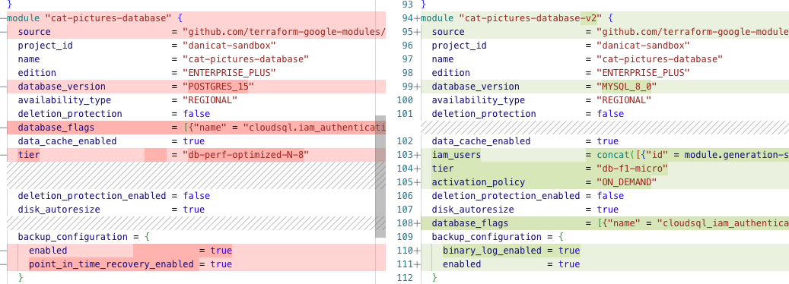
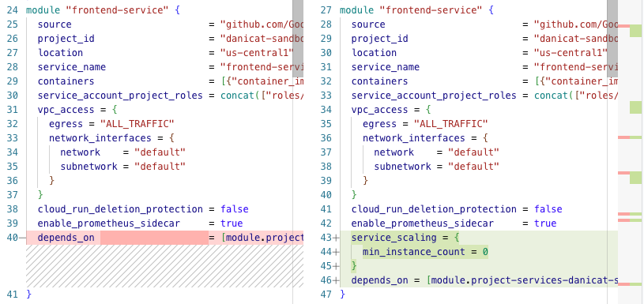

---
categories:
- Applied GenAI
date: '2025-07-02T00:00:00+01:00'
summary: Gemini Cloud Assistを活用し、Google Cloud上で自然言語プロンプトからインフラストラクチャを設計・コード生成する方法を実践的に解説します。
tags:
  - gemini
  - google-cloud
  - tutorial
title: "Gemini Cloud Assistでプロンプトからインフラを設計・構築する"
slug: "gemini-cloud-assist"
aliases:
  - "/ja/posts/20250702-gemini-cloud-assist/"
description: "Gemini Cloud Assist と Application Design Center を使い、自然言語プロンプトからGoogle Cloudのインフラ設計とTerraformコード生成を行う手順を解説。"
proficiencyLevel: "Beginner"
dependencies:
  - "Google Cloud Platform"
  - "Terraform"
---

## はじめに

今回はいつものAIエージェントの話題から少し寄り道して、先週参加した「I/O Connect Berlin 2025」をきっかけに触ってみた製品について紹介します。

このイベントには、Google Developer Groups（GDG）のメンバーやコミュニティのエキスパートをはじめ、ヨーロッパ各地から1,000人以上の開発者が集まりました。4月にDevRelチームにジョインして以来、私にとって初めての公式Googleイベントでもあったため非常に感慨深いものでした（先週ブログの更新をお休みした理由もこれです！）。

私は会場で「Design and Deploy」というデモセッションを担当しました。これは [Application Design Center (ADC)](https://cloud.google.com/application-design-center/docs/overview?utm_campaign=CDR_0x72884f69_awareness_b428663487&utm_medium=external&utm_source=blog) と [Gemini Cloud Assist (GCA)](https://cloud.google.com/products/gemini/cloud-assist?utm_campaign=CDR_0x72884f69_awareness_b428663487&utm_medium=external&utm_source=blog) という2つのプロダクトを組み合わせたデモです。参加者の反応がとても好評だったため、現地に来られなかった皆さんにもこのテクノロジーを体験していただけるよう、ブログ記事としてまとめることにしました。

Application Design Centerは、アーキテクトや開発者がアプリケーションのインフラストラクチャを設計するのを支援するプロダクトです。画面上ではインフラの構成要素を視覚的に定義できる使いやすいUIが提供されていますが、内部（アンダー・ザ・フード）ではUI上のすべてがTerraformモジュールとして表現されているため、[Infrastructure as Code (IaC)](https://en.wikipedia.org/wiki/Infrastructure_as_code) のメリットもそのまま享受できます。

あらかじめお伝えしておくと、ADCは現在 [パブリックプレビュー（Public Preview）](https://cloud.google.com/products?e=48754805&hl=en#product-launch-stages&utm_campaign=CDR_0x72884f69_awareness_b428663487&utm_medium=external&utm_source=blog) の段階にあります。日々機能が進化しているため、過去のバージョンとの互換性が失われる可能性もあります。また、後述するように、一般提供（GA）までに改善が期待される粗削りな部分もいくつか見られます。

一方のGemini Cloud Assist（こちらもパブリックプレビュー中）は、Google CloudにおけるGemini支援機能の公式製品名です。単体の独立したプロダクトというよりも、大規模言語モデル（LLM）ベースの最新チャット体験を通じて、Google Cloud（GCP）のあらゆるリソースやサービスと自然言語で対話できるようにする「結合組織」のような役割を果たしています。

それでは、この2つのテクノロジーを組み合わせて、アプリケーションのインフラを素早く設計・構築していく流れを見ていきましょう。

## アプリケーション設計セッションを開始する

Application Design CenterはGoogle Cloudコンソールから手動で開くこともできますが、それではあまり面白くありません。新規設計でADCを起動する一番の方法は、任意のページでGeminiパネルを開くことです。たとえばここでは、プロジェクトのウェルカム（Welcome）ページを使用しています。

検索バー右側にある「星（スパークル）」アイコンのボタンをクリックすると、Gemini Cloud Assistのペインが開きます。

すると、次のような画面が開きます。

このパネルからGeminiと対話できます。「〇〇を行うアプリケーションを作成して」といったプロンプトとともに、アーキテクチャに関する詳細をできるだけ具体的に伝えてみましょう。例として、「猫の画像を生成するアプリケーション」を作成してみます。入力するプロンプトは以下のとおりです。

> Geminiを使って猫の画像を生成し、Cloud SQLデータベースに保存するアプリケーションを作成してください。ユーザーは生成サービス（generation service）を使って新しい画像をリクエストでき、画像サービス（pictures service）で生成された画像を閲覧できます。両方のサービスはフロントエンドサービスとグローバルロードバランサーを通じて公開されます。

プロンプトを入力すると、Geminiが少し推論を行い、数秒後に次のような構成案を出力してくれます。

インラインで表示される図だけでも大まかな構成は把握できますが、［Edit app design（アプリデザインを編集）］ボタンをクリックすると、さらにデザインを直感的に操作・調整できます。拡張ビューで設計図が開き、構成をブラッシュアップできるようになります（※この記事の以降のセクションでは、［Edit app design］をクリックすると「Preview」ウィンドウが開く環境を前提に解説します。もし開かない場合は、記事末尾の注記をご確認ください）。

「Preview」ウィンドウの画面は以下のようになります。

命名規則や生成された各コンポーネントの設定内容を調整したい場合は、コンポーネントをクリックして設定パネル（configuration panel）を開けばいつでも変更できます。ここでは `frontend-service` の設定パネルを開いてみました。

この画面には Cloud Run で起動されるコンテナイメージも表示されており、デフォルトではサンプル用の `hello` コンテナが指定されています。Gemini Cloud Assist は私たちがどのコンテナを実行したいかまでは把握していないためですが、イメージ情報を渡せば適切な値に差し替えてくれます。

ここで前提として強調しておきたいのは、**このツールはアプリケーションのコードそのものを実装するのではなく、それを支えるインフラストラクチャを設計・構成するためのツールである**という点です。フロントエンドやバックエンドの実際のコードを書くには、Gemini CLI や普段使っている IDE などの開発ツールを利用し、ビルドしたコンテナイメージを Artifact Registry などのコンテナレジストリにプッシュして Cloud Run から参照できるようにする必要があります。

Preview ウィンドウでは既存コンポーネントの編集は可能ですが、手動で新しいコンポーネントを追加することはできません。構成を段階的に改善（イテレーション）したい場合は、Gemini に修正指示を出します。たとえば、次のようなフォローアッププロンプトを投げてみます。

> 猫の画像が生成されるたびにイベントをキャプチャするストリーミングサービスを追加してください。ストリームの先にはコンシューマーサービスを配置し、GCS（Cloud Storage）でホストされている静的ページを更新して最新画像をフィードに追加できるようにします。

これがGeminiの応答です。

すると Preview ウィンドウが新しい構成図に更新され、追加（緑）、変更（青）、削除（赤）がカラーハイライトで視覚的に表示されます。

画面下部に提案を採用するか（Accept）、破棄するか（Reject）の選択肢が表示されます。ですがその前に、内部で生成された Terraform コードをチェックしてみましょう。コードの差分を確認するには、［View diff（差分を表示）］をクリックします。

すると Code Diff ウィンドウが開き、変更前後のコードが左右に並んで表示されます。

ご覧のとおり、ダイアグラム上の各ボックスがそれぞれ個別の Terraform モジュールに対応しています。下にスクロールすると、今回追加されたモジュールが緑色でハイライトされているのが確認できます。

生成された内容に問題がなければ提案を採用し、修正が必要であれば却下して Gemini に再指示を出せます。提案を受け入れたものの、`database-secrets` モジュールに少し違和感を覚えたので、Gemini に質問してみることにしました。

プロンプト：「Cloud SQLデータベースがIAM認証を使っているのに、なぜ database secret を追加したのですか？」

案の定、実際には不要だったようです。

Preview ウィンドウでの表示：

これは非常に重要な教訓です。AIがどれほど進化しても、エンジニアが評価・判断を下す責任から解放されるわけではありません。最終的に本番環境の責任を負うのは私たち自身です。すべてを自分の目で検証する姿勢を忘れないようにしましょう 🙂

検証という点では、もうひとつ気になったことがありました。Gemini が提案してきた Cloud SQL のインスタンスタイプが `db-perf-optimized-N-8` というかなりハイスペックなものだったのです。小さなプロトタイプには明らかに過剰スペックなので、プロンプトでコストを抑えるよう指示してみます。

> コスト効率を重視した構成にしてください（Make it cost effective）

うーん……これには少し考えさせられました。グローバルではなくリージョンロードバランサーにするという提案は理解できますが、なぜ MySQL のほうが PostgreSQL よりもコスト効率が高いと判断したのかは疑問です。私が気になっていたのはデータベースの種類ではなく、マシンスペック（マシンタイプ）でした。

しかも Gemini のチャット回答はすべてを伝えてくれていませんでした。コードの差分（diff）をよく確認してみると、実際にはマシンタイプ（属性 `tier`）も変更されていたのですが、テキストでの説明が抜けていたのです。

これには納得がいかなかったので、理由を問い詰めてみました。

> なぜ MySQL のほうが PostgreSQL よりもコスト効率が良いと考えるのですか？（Why do you consider MySQL more cost effective than PostgreSQL?）

Gemini からの回答では、MySQL が PostgreSQL よりコスト効率が良い理由として次の3点が挙げられていました。

1. ライセンスの違い（Licensing differences）
2. リソース消費量（Resource consumption）
3. マネージドサービスの価格設定（Managed service pricing）

残念ながら、この回答には同意できません。1点目については、両者ともオープンソースライセンスでありコスト差はありません。2点目については一理あるかもしれませんが、適切なベンチマーク検証が必要です。そして3点目は明確な誤りで、Google Cloud 上の Cloud SQL は PostgreSQL も MySQL も同じ料金体系です。ここは人間の勝ちということで、変更を差し戻しましょう。

> PostgreSQL から MySQL への変更は元に戻し、小さくしたマシンタイプ（tier）だけを維持してください。

最終確認：Cloud SQL を小さめの tier の PostgreSQL で動かす設定に落ち着きましたが、差分をもうひとつ見ると、Cloud Run の「ゼロスケール（scale to zero）」を有効にする重要な変更が加わっていることにも気づきました。

この設定自体は非常に理にかなっていますが、やはりチャットの対話文では言及されていませんでした。これも「AI ツールの言うことは信頼しつつも、必ず検証せよ（Trust, but verify）」という教訓です。本番環境で予期せぬ挙動に見舞われるのは避けたいところです。

## Terraform ファイルを取得する

アーキテクチャの設計が固まったら、UI右上にある［&lt;&gt; Get Code（コードを取得）］ボタンをクリックします。これで、生成された Terraform コード一式が zip ファイルとしてパッケージングされ、ローカルマシンにダウンロードできるようになります。

本記事の執筆時点では、Application Design Center は GitHub や GitLab、Google Cloud Source Repositories、Bitbucket といった VCS（バージョン管理システム）との直接連携をサポートしていません。ツールからコードを取り出す手段は、現時点ではこの zip ダウンロードのみとなります。

組織（Organization）階層がセットアップされた企業アカウントであれば、この設計をそのまま AppHub 経由でデプロイできますが、個人アカウントを利用している場合は、現時点ではコードのダウンロードまでがツールの対応範囲となります。

## Application Design Center UI に関する補足事項

［Edit app design］ボタンをクリックしたときの挙動は、Google Cloud コンソールの設定環境によって異なります。組織（Organization）に紐付いていない個人アカウントで試している場合、設計図の閲覧と Terraform コードのダウンロードができる「Preview」ウィンドウは開きますが、Application Design Center のフル機能 UI にはアクセスできません。

フル機能を利用するには組織配下のアカウントである必要があります。Application Design Center のセットアップには「ADC 有効化（App Design Center enabled）」フォルダーという特殊なフォルダー構成が必要となるためです。組織を持たないアカウントではフォルダーを作成できず、組織内であってもクラウド管理者によるフォルダー設定が必要になります。

そのため、組織に属していない個人開発者アカウントでは、現時点では ADC の全機能をフルに活用することはできません。

それでも本記事で紹介したように、Gemini を使ってアプリケーションアーキテクチャをプロトタイピングすることは十分に可能です。ただし、クラウド UI 上で設計の進捗を保存することはできないため、Terraform ファイルをローカルマシンにダウンロードし、手元の Terraform 環境からデプロイするワークフローになります。

## まとめと今後の展望

新しい AI プロダクトが登場するたびに、トニー・スタークのように音声コマンドだけでソフトウェアを自在に組み上げていく未来を思い描いてワクワクします。完全な自動化にはまだ道半ばですが、Gemini Cloud Assist によって、自然言語でインフラの構成要素を指定・自動設計できるようになったのは大きな前進です。

UI や Gemini の提案精度にはまだ粗削りな部分が残っているものの、新しいアプリケーションを作るたびにゼロから手作業で Terraform コードを書き起こす手間が省けるだけでも、すでに大きな価値を感じています。

このツールは今後数ヶ月で急速に進化していくはずなので、この記事の内容も早晩アップデートされていくでしょう。最新情報をキャッチアップするには公式の [Application Design Center](https://cloud.google.com/application-design-center/docs/overview?utm_campaign=CDR_0x72884f69_awareness_b428663487&utm_medium=external&utm_source=blog) ドキュメントをチェックしてみてください。もちろん本ブログでも、面白い新機能やアップデートがあれば随時取り上げていきます。

プロンプトのアイデアとして、「コスト効率を高めて（make it cost effective）」「高可用性構成にして（make it highly available）」「なぜ Y ではなく X を選んだのか説明して（explain why x instead of y）」「X を Y に置き換えて（replace x with y）」「初心者にもわかりやすく解説して（explain x to me like I’m 5）」など、いろいろなプロンプトを試してみるのがおすすめです。

皆さんはどう思いましたか？こうしたツールにワクワクしますか、それとも脅威を感じますか？面白いプロンプトを見つけたら、ぜひ下のコメント欄で教えてください！
