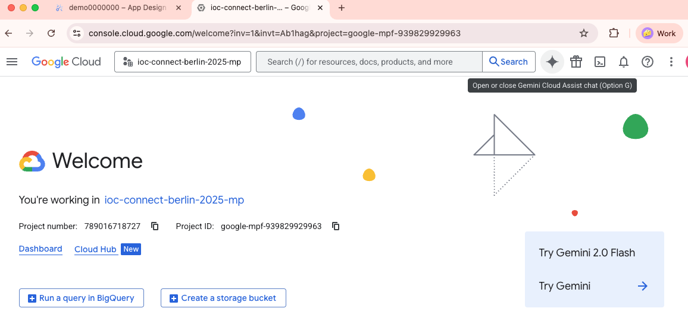
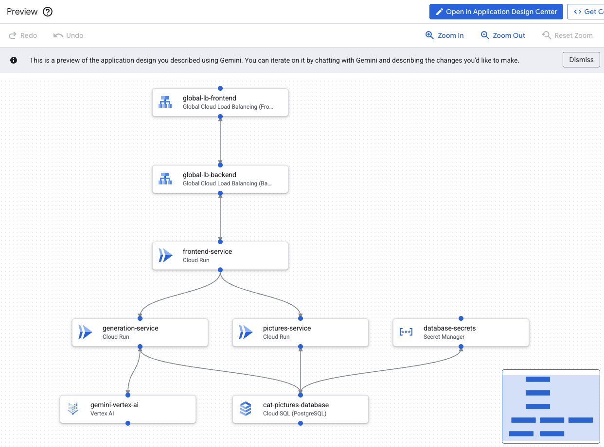
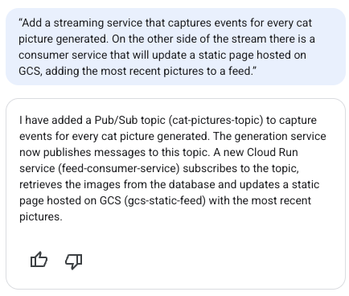
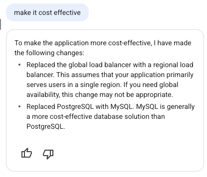



## はじめに

今日は、いつものAIエージェントのコンテンツから少し寄り道して、先週のI/O Connect Berlin 2025への参加の一環として最近探求するようになった製品についてお話します。

このイベントには、Google開発者コミュニティ（Google Developer Groups）のメンバーやコミュニティの専門家を含む、ヨーロッパ中から1000人以上の開発者が集まりました。また、4月にDevRelチームに参加して以来、初めての公式Googleイベントだったので、私にとって特に意味のあるものでした。そのため、先週はブログの更新がありませんでした！

私は「Design and Deploy」というデモを担当しました。これは、[Application Design Center (ADC)](https://cloud.google.com/application-design-center/docs/overview?utm_campaign=CDR_0x72884f69_awareness_b428663487&utm_medium=external&utm_source=blog)と[Gemini Cloud Assist (GCA)](https://cloud.google.com/products/gemini/cloud-assist?utm_campaign=CDR_0x72884f69_awareness_b428663487&utm_medium=external&utm_source=blog)という2つの製品の組み合わせを紹介するものです。デモは非常に好評だったので、このコンテンツをブログにも持ち込んで、そこにいなかった人々にもこのテクノロジーで遊ぶ機会を与えたいと思いました。

Application Design Centerは、アーキテクトや開発者がアプリケーションインフラストラクチャを設計するのに役立つ製品です。フロントでは、インフラストラクチャのコンポーネントを視覚的に定義できる優れたユーザーインターフェイスを提供しますが、内部ではUIのすべてがTerraformモジュールとして表されるため、[Infrastructure as Code](https://en.wikipedia.org/wiki/Infrastructure_as_code)の利点を活用することもできます。

重要な免責事項として、ADCは現在[パブリックプレビュー](https://cloud.google.com/products?e=48754805&hl=en#product-launch-stages&utm_campaign=CDR_0x72884f69_awareness_b428663487&utm_medium=external&utm_source=blog)段階にあります。これは、製品が日々進化しており、以前のイテレーションとの互換性が失われる可能性があることを意味します。また、以下で説明するように、製品が一般提供される前に修正されるべき、いくつかの粗削りな点も顕著にあります。

一方、Gemini Cloud Assist（これもパブリックプレビュー中）は、Google CloudでのGeminiサポートの公式製品名です。このため、GCAはスタンドアロン製品ではなく、ユーザーが自然言語を使用してGCPのあらゆるものと対話できるようにする結合組織のようなものであり、大規模言語モデルに基づく最新のチャットボットエクスペリエンスのすべての利点が含まれています。

これら両方のテクノロジーを使用して、アプリケーションのインフラストラクチャ部分を迅速に設計する方法を見てみましょう。

## アプリケーション設計セッションの開始方法

いつでもGoogle Cloudコンソールから手動でApplication Design Centerを開くことができますが、それでは面白くありません。新しい設計のためにADCをトリガーする最良の方法は、任意のページでGeminiパネルを開くことです。たとえば、ここではプロジェクトのウェルカムページを使用しています。

検索バーの右側にある「星」ボタンをクリックすると、Gemini Cloud Assistペインが開きます。

開くはずです：

これは、Geminiと対話できるパネルです。「xを行うアプリケーションを作成する」のようなものを入力し、アーキテクチャに関する詳細をできるだけ多く含めます。たとえば、猫の写真を生成するアプリケーションを作成してみましょう。プロンプトは次のとおりです。

> Geminiで猫の写真を生成し、Cloud SQLデータベースに保存するアプリケーションを作成します。ユーザーは生成サービスを使用して新しい写真をリクエストでき、写真サービスで生成された写真を見ることができます。両方のサービスは、フロントエンドサービスとグローバルロードバランサーを介して公開されます。

プロンプトを入力すると、Geminiはしばらく考えて、数秒後に次のような出力を生成します。

組み込みの視覚化は私たちにアイデアを与えてくれますが、「アプリデザインを編集」ボタンをクリックすると、デザインをよりよく操作できます。これにより、デザインが拡張ビューで開かれ、さらに洗練させることができます。（この記事の残りの部分は、「アプリデザインを編集」ボタンがプレビューウィンドウを開くことを前提としています。そうでない場合は、記事の下部にある注記を確認してください）

「プレビュー」ウィンドウでは次のようになります。

命名規則や生成されたコンポーネントの詳細に満足できない場合は、コンポーネントをクリックして構成パネルを開くことでいつでも変更できます。ここでは、frontend-serviceから構成パネルを開きました。

この画面には、Cloud Runによってインスタンス化されるコンテナも表示されることに注意してください。これはデフォルトで「hello」コンテナになります。これは、Gemini Cloud Assistが実行したいコンテナに関する情報を持っていないためですが、この情報を提供すると値を置き換えることができます。

このツールが実際にアプリケーションをコーディングするのではなく、それをサポートするインフラストラクチャを設計するだけであるという期待を設定する必要があるため、ここでもう1つ強調しておきます。たとえば、実際のフロントエンドサービスとバックエンドサービスをコーディングするには、Gemini CLIや通常のIDEなどの他のツールを使用し、Cloud Runがアクセスできるようにコンテナレジストリにアーティファクトを公開する必要があります。

プレビューウィンドウではコンポーネントを編集できますが、手動でコンポーネントを追加することはできません。デザインを反復処理したい場合は、Geminiにデザインを変更するように依頼できます。たとえば、次のフォローアッププロンプトを確認してください。

> 猫の写真が生成されるたびにイベントをキャプチャするストリーミングサービスを追加します。ストリームの反対側には、GCSでホストされている静的ページを更新し、最新の写真をフィードに追加するコンシューマーサービスがあります。

これがGeminiの応答です。

そして、プレビューウィンドウは新しいデザインで更新され、追加（緑）、変更（青）、削除（赤）が強調表示されます。

画面の下部には、提案を受け入れるか拒否するかのオプションが表示されます。しかし、その前に、内部で生成されているTerraformコードを検査する良い機会です。コードを表示して変更を比較するには、「差分を表示」をクリックします。

これにより、両方のバージョンが並べて表示されたコード差分ウィンドウが開きます。

ご覧のとおり、図の各ボックスは異なるTerraformモジュールにマッピングされています。下にスクロールすると、最近追加されたモジュールが緑色で強調表示されているのがわかります。

実装に満足している場合は、提案を受け入れるか、拒否してGeminiに改善を依頼できます。「database-secrets」モジュールについて少し奇妙なことに気づいたので、Geminiにそれについて尋ねることにしました。

プロンプト：「Cloud SQLデータベースがIAM認証を使用しているのに、なぜデータベースシークレットを追加したのですか？」

まあ、あまり必要ではなかったようです。

プレビューウィンドウで：

これは、AIがますます高度になっているとしても、私たちが評価して決定を下すことから免除されているわけではないという重要な注意点です。結局のところ、AIはまだそこにありますが、私たちの仕事は危機に瀕しているので、すべてを検証することを忘れないでください。🙂

検証のトピックについて、もう1つ注意を引いたのは、Geminiがかなり大きなCloud SQLインスタンスタイプ（db-perf-optimized-N-8）を提案していたことです。これは間違いなく小さなプロトタイプには多すぎるので、これを改善するために別のプロンプトを試してみましょう。

> コスト効率を良くしてください

うーん…これは考えさせられました。リージョンロードバランサーとグローバルロードバランサーの点はわかりますが、なぜMySQLがPostgreSQLよりもコスト効率が良いと考えるのかについては納得できません。実際のデータベーステクノロジーよりもマシンタイプの方が気になりました。

Geminiの答えも全体像を教えてくれません。差分を詳しく調べると、実際にはマシンタイプ（属性`tier`として表示）を変更し、それを私たちに伝えるのを忘れていたことがわかります。

これには完全には満足していないので、理由を尋ねます。

> なぜMySQLがPostgreSQLよりもコスト効率が良いと考えるのですか？

応答は、MySQLがPostgresよりもコスト効率が良い理由として次のことを示唆しています。
1. ライセンスの違い
2. リソース消費
3. マネージドサービスの価格設定

残念ながら、この答えには同意できません。項目1については、どちらもオープンソースライセンスを持っているので、それほど違いはありません。項目2については、ある程度の真実があるかもしれませんが、それでも適切なベンチマークが必要です。項目3は、Cloud SQL for PostgresとMySQLがGCPで同じ価格設定モデルを持っているため、間違っています。人間にもう1点、変更を元に戻しましょう。

> postgresからmysqlへの変更を元に戻し、小さいマシンタイプは維持してください。

最終検査：Cloud SQLが小さいデータベース層でPostgresを実行していることに満足していますが、Cloud Runのスケールゼロ機能を有効にする別の注目すべき編集があることもわかりました。

これは非常に理にかなっていますが、対話では言及されていませんでした。これは、AIツールが言っていることを「信頼するが検証する」というもう1つのリマインダーです。本番環境で予期しない事態が発生することは望んでいません。

## Terraformファイルの取得

デザインに満足したら、UIの右上隅にある「&lt;&gt; コードを取得」ボタンをクリックできます。これにより、基になるTerraformコードがzipファイルにパックされ、ローカルマシンにダウンロードできます。

残念ながら、この記事の執筆時点では、Application Design Centerは、GitHub、GitLab、Google Source、Bitbucketなどのコードバージョン管理システムとの統合をサポートしていません。ツールからコードを抽出する唯一の方法は、このzipファイルダウンロードを介することです。

完全な組織階層を持つ企業アカウントを使用している人は、このデザインを取得してAppHubを使用してデプロイできますが、個人アカウントを使用している場合は、残念ながらこれがツールでできることの限界です。

## アプリデザインセンターUIに関する注記

「アプリデザインを編集」ボタンは、クラウドコンソールの設定方法によって動作が異なります。個人アカウントからこのプロンプトをテストしていて、個人アカウントが組織に添付されていない場合は、デザインを表示して対応するTerraformコードをダウンロードできるプレビューウィンドウが開きますが、アプリデザインセンターの完全なユーザーインターフェイスにはアクセスできません。

完全なインターフェイスを使用するには、組織の一員である必要があります。アプリデザインセンターのセットアップには、「アプリデザインセンターが有効になっている」フォルダと呼ばれる特別な種類のフォルダが構成されている必要があるためです。組織のないアカウントにフォルダを追加する方法はなく、組織内ではこのフォルダをクラウド管理者が設定する必要があります。

残念ながら、これは、組織に属していないユーザーアカウントは、少なくとも当面の間、ADC機能の完全なセットから事実上締め出されることを意味します。

この記事で示したように、Geminiを使用してアプリのアーキテクチャをプロトタイプ化することはできますが、クラウドUIで進行状況を保存することはできず、Terraformファイルをローカルマシンにダウンロードして、独自のTerraformインストールを使用してデプロイする必要があります。

## 結論と次のステップ

リリースされるすべての新しいAI製品は、音声コマンドだけでソフトウェアを設計できる「トニースターク」の瞬間というアイデアに興奮させてくれます。まだそこまでには至っていませんが、Gemini Cloud Assistを使用すると、自然言語を使用してインフラストラクチャコンポーネントを指定できるようになったため、順調に進んでいます。

UIとGeminiの提案の両方でまだいくつかの粗削りな点がありますが、開発しているすべての新しいアプリケーションに対して手作業でTerraformコードを作成する必要がなくなったことにすでに安堵しています。

これは明らかに有効期限があるべき記事の1つです。このツールは今後数か月で非常に急速に進化するはずだからです。最新情報を入手するには、いつでも[Application Design Center](https://cloud.google.com/application-design-center/docs/overview?utm_campaign=CDR_0x72884f69_awareness_b428663487&utm_medium=external&utm_source=blog)の製品ページを確認できますが、もちろん、このブログでも興味深い新機能や改善点についてできる限り書いていきます。

いくつかの提案として、「コスト効率を良くする」、「高可用性にする」、「xではなくyの理由を説明する」、「xをyに置き換える」、「xを5歳児のように説明する」などの創造的なプロンプトを試すことをお勧めします。

あなたの考えはどうですか？このツールはエキサイティングですか、それとも怖いですか？興味深いプロンプトを見つけましたか？以下にコメントを残してください！
