## Introduction

Today we are going to take a small detour from our usual AI agent content to talk about a product I’ve come to explore recently as part of my participation at I/O Connect Berlin 2025 last week.

This event brought together over 1000 developers from all over Europe, including members from the Google developer communities (Google Developer Groups) and community experts. It was also my first official Google event since I joined the DevRel team back in April, so it was particularly meaningful for me - and this is why we didn’t get a blog update last week!

I was responsible for a demo called “Design and Deploy” which showcases the combination of two products: [Application Design Center (ADC)](https://cloud.google.com/application-design-center/docs/overview?utm_campaign=CDR_0x72884f69_awareness_b428663487&utm_medium=external&utm_source=blog) and [Gemini Cloud Assist (GCA)](https://cloud.google.com/products/gemini/cloud-assist?utm_campaign=CDR_0x72884f69_awareness_b428663487&utm_medium=external&utm_source=blog). The demo was so well received that I thought it would be nice to bring this content to the blog as well to give the opportunity to the people who were not there to play with this technology as well.

Application Design Center is a product to help architects and developers to design their application infrastructure. On the front it provides a nice user interface where you can visually define components for your infrastructure, but under the hood everything in the UI is represented as a terraform module so you can also leverage the benefits of [Infrastructure as Code](https://en.wikipedia.org/wiki/Infrastructure_as_code).

An important disclaimer is that ADC is currently in [public preview](https://cloud.google.com/products?e=48754805&hl=en#product-launch-stages&utm_campaign=CDR_0x72884f69_awareness_b428663487&utm_medium=external&utm_source=blog). This means that the product is evolving every day and sometimes it might break compatibility with previous iterations. It also has notably a few rough edges that I’m going to mention below, which should be addressed before the product becomes generally available.

Gemini Cloud Assist (also on public preview), on the other hand, is the official product name for the Gemini support in Google Cloud. Because of this, GCA is not a standalone product, but more like a connective tissue that enables users to interact with anything GCP using natural language, including all the benefits of the modern chatbot experience based on large language models.

Let’s see how we can use both of these technologies to quickly design the infrastructure part of an application for us.

## How to start an application design session

You can always open the Application Design Center manually from the Google Cloud console, but what is the fun in that? The best way to trigger ADC for a new design is to simply open the Gemini panel in any page. Here, for example, I’m using the Welcome page of my project:

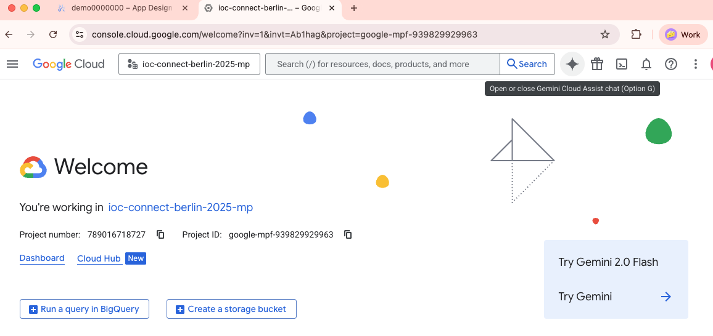

If you click on the “star” button on the right side of the search bar you are going to open the Gemini Cloud Assist pane:

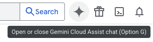

Should open:

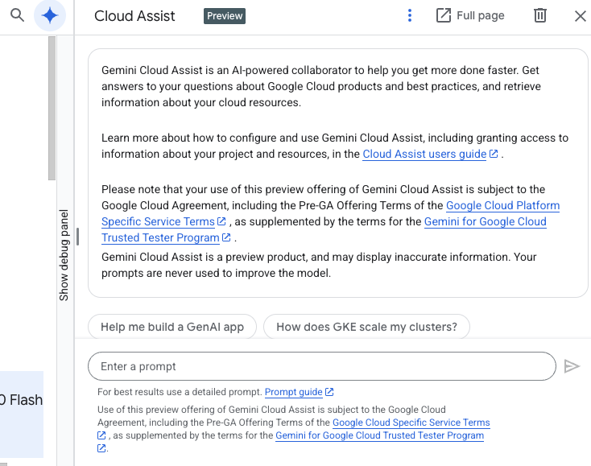

This is the panel where you can interact with Gemini. Type something like “create an application that does x” and include as many details as you would like about the architecture. For example, let’s try creating an application that generates cat pictures. Here is the prompt:

> Create an application that generates cat pictures with Gemini and stores them in a Cloud SQL database. Users can request new pictures using a generation service and can see the generated pictures with a pictures service. Both services are exposed through a frontend service and a global load balancer.

After entering the prompt, Gemini will think for a while and after a few seconds produce an output like this:

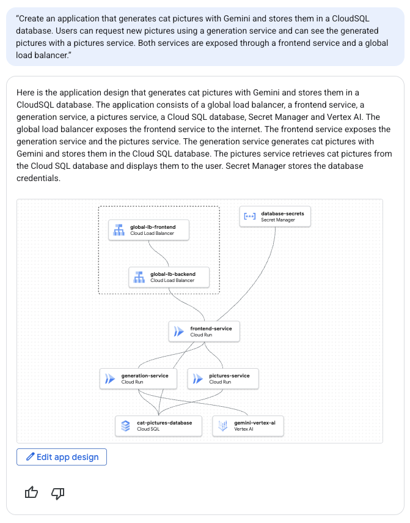

The built-in visualisation gives us an idea, but we can better interact with the design if we click on the “Edit app design” button. This will open the design in an expanded view so we can further refine it. (Please note that the remainder of this article assumes the “Edit app design” button opens the Preview window. If in your case it doesn`t, check the notes at the bottom of the article)

This is how it looks on the “Preview” window:

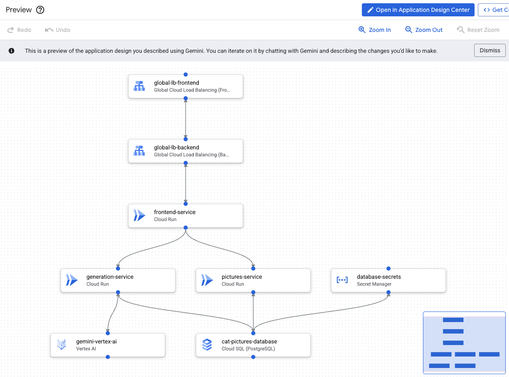

If you are not happy with the naming conventions or with the details of the generated components you can always change them by clicking on the component and opening the configuration panel. Here I opened the configuration panel from my frontend-service:

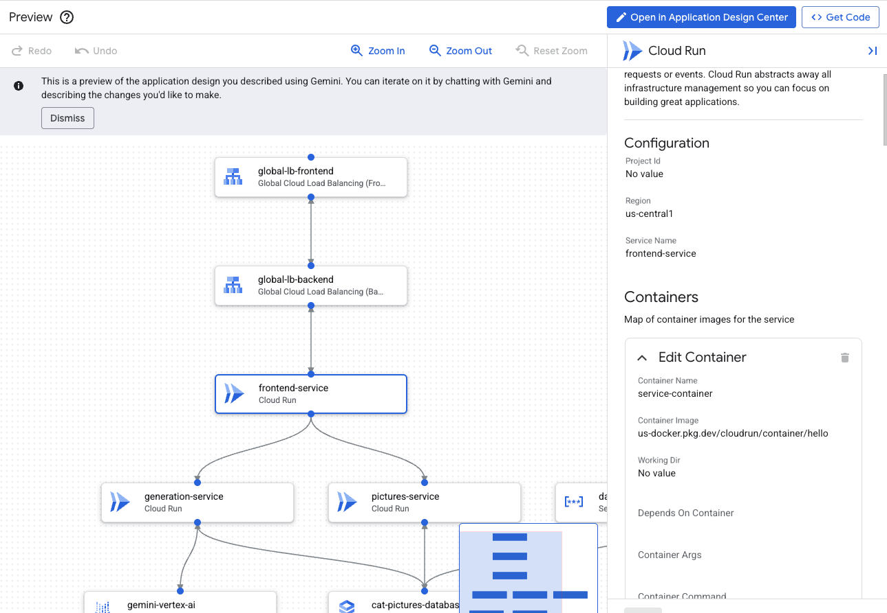

Note that this screen also shows which container is instantiated by Cloud Run, which defaults to a “hello” container. This is because Gemini Cloud Assist doesn’t have information about which container you want to run, but if you provide this information it will be able to replace the value. 

I’m highlighting this here also for another reason - we need to set the expectations that this tool doesn’t actually code the application for you, it only designs the infrastructure to support it. For coding the actual frontend and backend services, for example, you will need to use other tools like the Gemini CLI or your regular IDE and publish the artifacts to your container registry so that Cloud Run can access them.

In the Preview window you can edit components, but not add components manually. If you want to iterate on the design, what you can do is to ask Gemini to modify the design for you. Check for example this follow up prompt:

> Add a streaming service that captures events for every cat picture generated. On the other side of the stream there is a consumer service that will update a static page hosted on GCS, adding the most recent pictures to a feed.

This is Gemini’s response:

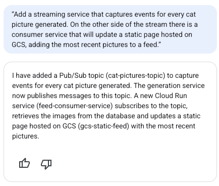

And the Preview window will be updated with the new design, highlighting additions (green), modifications (blue) and deletions (red):

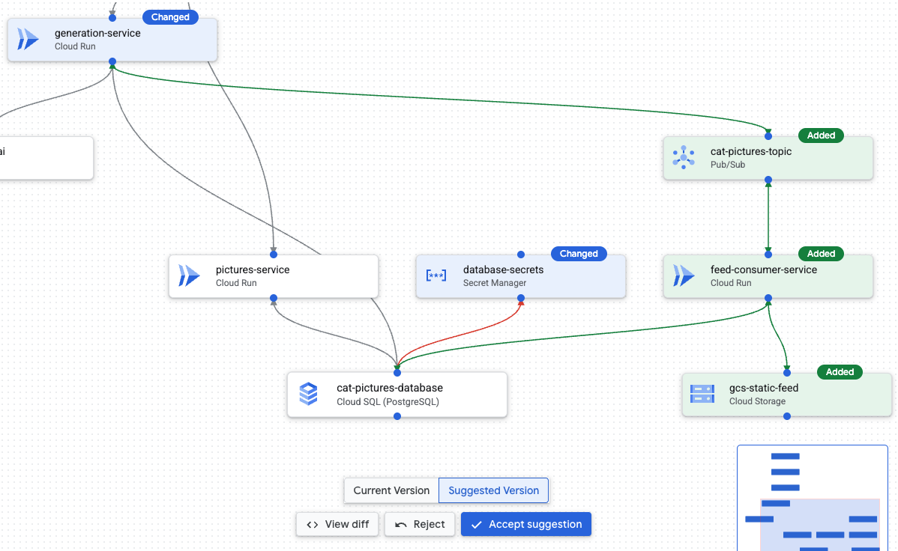

At the bottom of the screen you are given the option to accept or reject the suggestion. But before that, it is a good opportunity to inspect the terraform code that is generated under the hood. To see the code and compare the changes, click on “View diff”:

This will open the Code Diff window with both versions shown side by side:

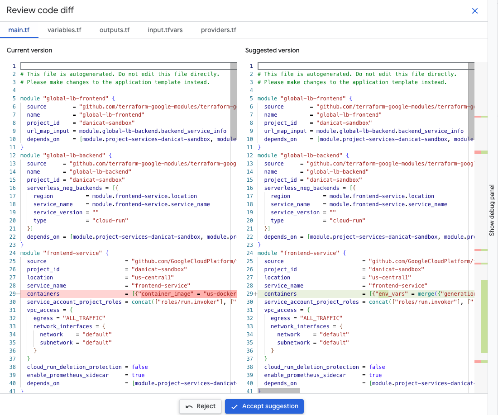

As you can see, each box in the diagram is mapped to a different terraform module. If you scroll down to the bottom you can see the modules it recently added highlighted in green.

If you are happy with the implementation you can accept the suggestion or reject and ask Gemini to improve it. I accepted the suggestion, but I noticed something slightly weird about the “database-secrets” module, so I decided to ask Gemini about it:

Prompt: “why did you add a database secret if the Cloud SQL database is using IAM authentication?”

Oh well, I guess it was not really necessary:

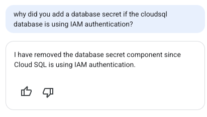

On the Preview window:

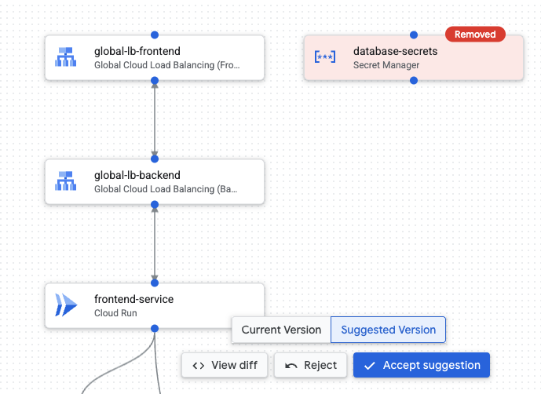

This is an important call out that as much as AI has become more and more advanced, we are still not exempt from evaluating and making decisions. At the end of the day, the AI will still be there, but our jobs are on the line, so don’t forget to validate everything. 🙂

On the topic of validations, another thing that caught my attention is that Gemini was suggesting a fairly big Cloud SQL instance type: db-perf-optimized-N-8. Let’s try another prompt to improve this, as this definitely is too much for a small prototype:

> Make it cost effective

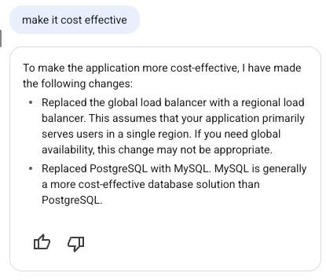

Hmmm… this one got me thinking. I can see the point on regional vs global load balancer, but I’m not sold on why it thinks MySQL is more cost-effective than PostgreSQL. I was more concerned about the machine type than the actual database technology.

Gemini’s answer doesn’t tell us the whole story either. Inspecting the diff closely it shows us that it actually modified the machine type (shown as the attribute `tier`) and just forgot to tell us:

")

I’m not entirely satisfied with this, so I’m going to ask why:

> Why do you consider MySQL more cost effective than PostgreSQL?

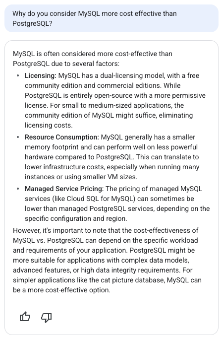

The response suggests that MySQL is more cost effective than Postgres due to:
1. Licensing differences
2. Resource consumption
3. Managed service pricing

Unfortunately I cannot agree with this answer. For item 1 both have open source licenses so they are not that different. Maybe item 2 might have some truth to it but I would still need a proper benchmark. Item 3 is wrong because Cloud SQL for Postgres and MySQL have the same pricing model on GCP. One more point for humans, let’s revert the change:

> revert the change from postgres to mysql, but keep the smaller machine type.

Final inspection: I'm happy with Cloud SQL running Postgres on a smaller database tier, but I also found there is another notable edit that enables Cloud Run scale to zero feature:

")

This one makes a lot of sense, but it was also not mentioned in the dialogue. This is another reminder to “trust but verify” whatever your AI tooling is telling you. We don’t want any surprises running in production.

## Retrieving the Terraform Files

Once you are happy with the design you can click on the “&lt;&gt; Get Code” button on the top-right corner of the UI. This will pack the underlying terraform code into a zip file for you to download to your local machine.

Unfortunately at the time of this writing, the Application Design Center doesn’t support any integrations with code versioning systems like GitHub, GitLab, Google Source, Bitbucket and others. The only way to extract the code from the tool is through this zip file download.

For people who are using corporate accounts with a full organization hierarchy, you can take this design and deploy it using AppHub, but if you are using your personal account unfortunately this is the limit of what the tool can do for you.

## Notes on the App Design Center UI

The “Edit app design” button will have different behaviors depending on how your cloud console is set up. If you are testing this prompt from your personal account and your personal account is not attached to an organization, it will open a Preview window where you can see the design and download the corresponding terraform code, but you won’t have access to the full user interface for App Design Center.

To use the full interface you need to be part of an organization, as the App Design Center setup needs an special kind of folder configured refered as an “app design center enabled” folder. There is no way to add folders to accounts without an organization and within an organization this folder needs to be set up by the cloud administrator.

Unfortunately, this means that user accounts that do not belong to any organizations will be effectively locked out of the full set of ADC features, at least for the time being.

You will still be able to use Gemini to help you prototype your app architecture just like I’ve shown in this article, but you won’t be able to save your progress on the Cloud UI and will need to download the terraform files to your local machine and deploy it using your own terraform installation.

## Conclusions and next steps

Every new AI product that is released makes me excited about the idea of having that “Tony Stark” moment where you can design your software just using voice commands. We are not there yet, but with Gemini Cloud Assist we are making good progress as now we can use natural language to specify the infrastructure components for us.

There are still a few rough edges both in terms of the UI and Gemini’s suggestions, but I’m already relieved that I don’t have to handcraft terraform code for every new application I’m developing.

This is clearly one article that should have an expiration date, as we should see this tooling evolve very quickly over the next couple of months. To keep yourself up to date, you can always check the [Application Design Center](https://cloud.google.com/application-design-center/docs/overview?utm_campaign=CDR_0x72884f69_awareness_b428663487&utm_medium=external&utm_source=blog) product page, but of course I will do my best to write about interesting new features and improvements on this blog as well.

As a few suggestions, I would recommend you to try some creative prompts like “make it cost effective”, “make it highly available”, “explain why x instead of y”, “replace x with y”, “explain x to me like I’m 5”, and so on.

What are your thoughts? Did you find this tool exciting or scary? Have you found any interesting prompts? Leave your comments below!
