---
categories:
- Applied GenAI
date: '2025-07-02T00:00:00+01:00'
summary: Como desenhar infraestrutura no Google Cloud usando linguagem natural com o Gemini Cloud Assist
tags:
  - gemini
  - google-cloud
  - tutorial
title: Do Prompt à Infraestrutura com o Gemini Cloud Assist
---

## Introdução

Hoje vamos fazer um pequeno desvio do nosso conteúdo habitual sobre agentes de IA para falar sobre um produto que explorei recentemente durante a minha participação no I/O Connect Berlin 2025, na semana passada.

O evento reuniu mais de 1.000 pessoas desenvolvedoras de toda a Europa, incluindo membros das comunidades do Google (Google Developer Groups) e experts da comunidade. Foi também o meu primeiro evento oficial do Google desde que entrei para a equipe de DevRel em abril, o que tornou tudo ainda mais especial para mim — e é por isso que não tivemos post no blog na semana passada!

Fui responsável por uma demonstração chamada “Design and Deploy”, que apresentou a combinação de dois produtos: o [Application Design Center (ADC)](https://cloud.google.com/application-design-center/docs/overview?utm_campaign=CDR_0x72884f69_awareness_b428663487&utm_medium=external&utm_source=blog) e o [Gemini Cloud Assist (GCA)](https://cloud.google.com/products/gemini/cloud-assist?utm_campaign=CDR_0x72884f69_awareness_b428663487&utm_medium=external&utm_source=blog). A demo foi tão bem recebida que decidi trazer o conteúdo para o blog também, dando a oportunidade de experimentar essa tecnologia a quem não pôde estar lá presencialmente.

O Application Design Center é um produto criado para ajudar arquitetos e desenvolvedores a desenhar a infraestrutura de suas aplicações. Na camada visual, ele oferece uma interface intuitiva na qual você define os componentes da infraestrutura graficamente; por baixo dos panos, porém, tudo o que aparece na tela é representado como um módulo Terraform, permitindo aproveitar todos os benefícios de [Infraestrutura como Código (IaC)](https://en.wikipedia.org/wiki/Infrastructure_as_code).

Um detalhe importante é que o ADC está atualmente em [public preview](https://cloud.google.com/products?e=48754805&hl=en#product-launch-stages&utm_campaign=CDR_0x72884f69_awareness_b428663487&utm_medium=external&utm_source=blog). Isso significa que o produto evolui diariamente e pode, eventualmente, quebrar compatibilidade com versões anteriores. Ele também conta com algumas arestas que precisam ser lapidadas antes da disponibilidade geral (GA), as quais vou destacar adiante.

Já o Gemini Cloud Assist (também em public preview) é o nome oficial do suporte do Gemini no Google Cloud. Por isso, o GCA não é um produto isolado, mas sim uma camada conectiva que permite interagir com qualquer recurso do GCP em linguagem natural, trazendo todas as vantagens da experiência moderna de chat baseada em LLMs.

Vamos ver como combinar essas duas tecnologias para desenhar rapidamente a infraestrutura de uma aplicação.

## Como iniciar uma sessão de design de aplicação

Você sempre pode abrir o Application Design Center manualmente pelo console do Google Cloud, mas onde estaria a graça nisso? O jeito mais prático de acionar o ADC para um novo desenho é abrir o painel do Gemini a partir de qualquer página. Aqui, por exemplo, estou na tela inicial (Welcome) do meu projeto:

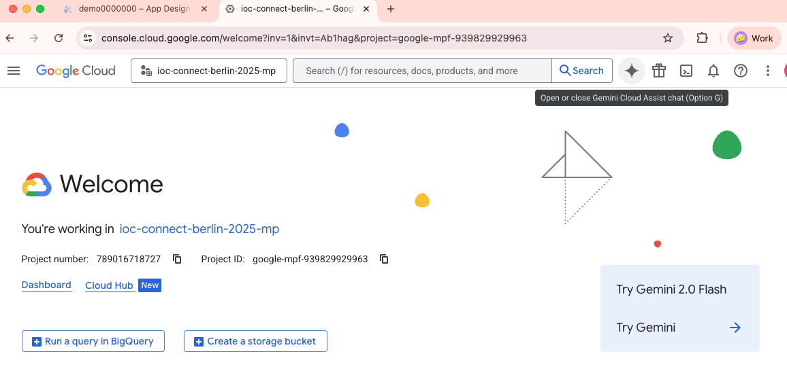

Ao clicar no botão de “estrela” no canto direito da barra de pesquisa, você abre o painel do Gemini Cloud Assist:

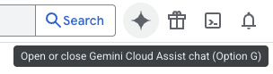

A interface exibida será esta:

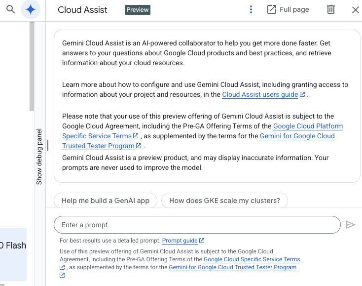

Nesse painel você pode interagir diretamente com o Gemini. Digite algo como “crie uma aplicação que faz X” e inclua quantos detalhes arquiteturais desejar. Por exemplo, vamos criar uma aplicação que gera imagens de gatos. Aqui está o prompt:

> Crie uma aplicação que gere imagens de gatos com o Gemini e as armazene em um banco de dados Cloud SQL. Os usuários podem solicitar novas imagens usando um serviço de geração e visualizar as imagens criadas por meio de um serviço de imagens. Ambos os serviços devem ser expostos através de um serviço de frontend e um balanceador de carga global.

Após enviar o prompt, o Gemini processará a requisição por alguns instantes e apresentará um resultado como este:

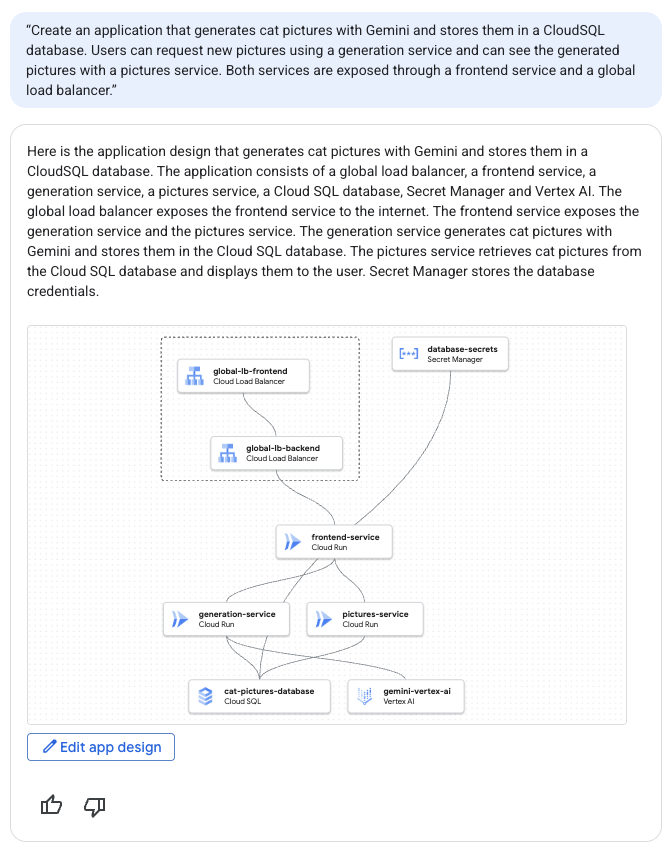

A visualização integrada dá uma boa ideia inicial, mas podemos interagir muito melhor com o desenho clicando no botão “Edit app design”. Isso abrirá a arquitetura em modo expandido para refinamento. (Nota: o restante do artigo assume que o botão “Edit app design” abre a janela de Preview. Caso isso não aconteça no seu ambiente, consulte as notas ao final do texto).

É assim que o desenho aparece na janela de “Preview”:

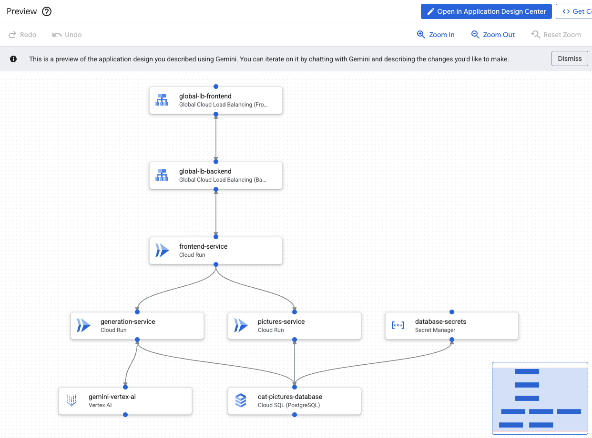

Caso queira ajustar as convenções de nomenclatura ou os detalhes dos componentes gerados, basta clicar sobre qualquer componente para abrir o painel de configuração. Aqui abri os detalhes do meu `frontend-service`:

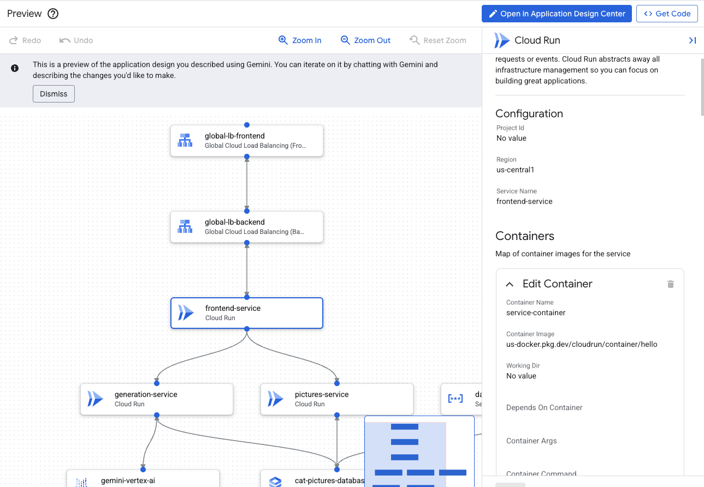

Repare que a tela exibe a imagem de contêiner instanciada pelo Cloud Run, que por padrão vem como um contêiner “hello”. Isso acontece porque o Gemini Cloud Assist não sabe qual imagem você pretende rodar, mas você pode informar esse valor para que ele faça a substituição.

Vale reforçar esse ponto para alinhar expectativas: a ferramenta não escreve o código da aplicação por você, ela apenas projeta a infraestrutura necessária para executá-la. Para programar os serviços de frontend e backend, você continuará usando ferramentas como o Gemini CLI ou sua IDE de preferência, publicando os artefatos no seu container registry para que o Cloud Run possa acessá-los.

Na janela de Preview é possível editar componentes existentes, mas não adicionar novos blocos manualmente pela interface. Para iterar no design, basta pedir as alterações ao Gemini em linguagem natural. Veja este prompt de continuidade:

> Adicione um serviço de streaming que capture eventos para cada imagem de gato gerada. Do outro lado do stream, inclua um serviço consumidor que atualizará uma página estática hospedada no GCS, adicionando as fotos mais recentes a um feed.

E esta foi a resposta do Gemini:

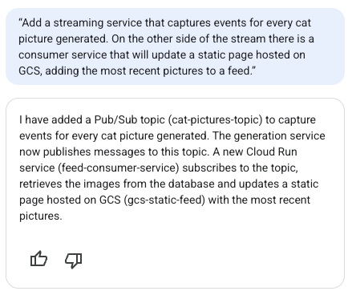

A janela de Preview é atualizada com o novo design, destacando adições (em verde), modificações (em azul) e remoções (em vermelho):

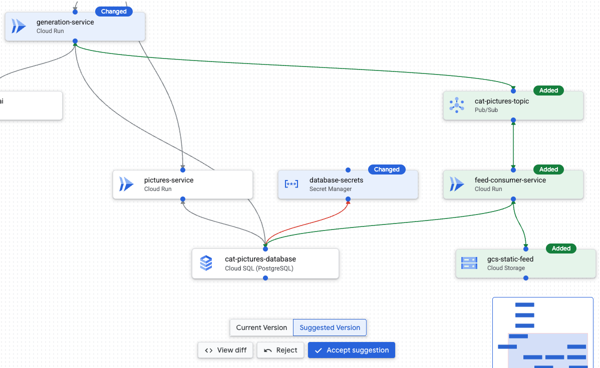

Na parte inferior da tela, você pode aceitar ou rejeitar a sugestão. Antes disso, porém, vale a pena inspecionar o código Terraform gerado nos bastidores. Para visualizar as diferenças, clique em “View diff”:

Isso abrirá a janela de Code Diff com ambas as versões lado a lado:

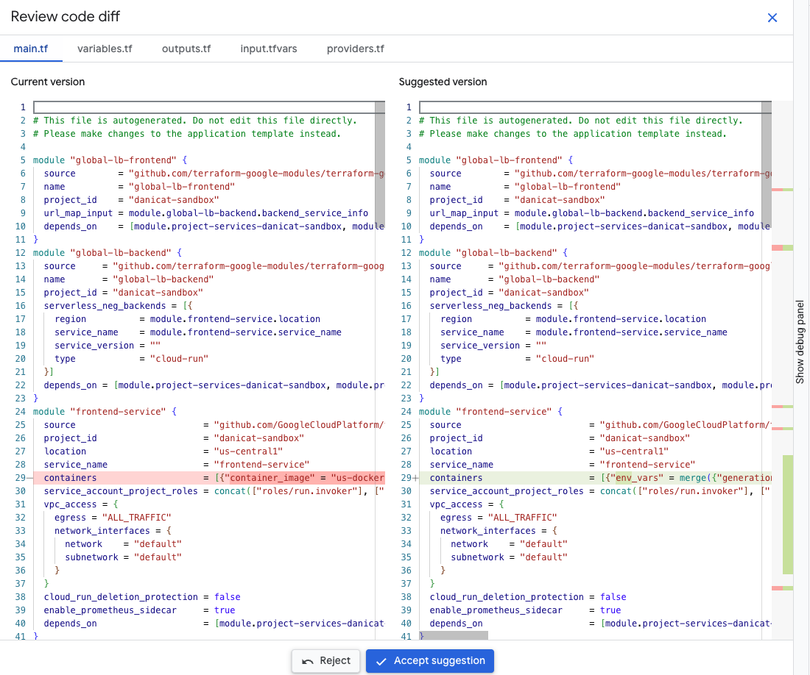

Como você pode notar, cada caixa no diagrama é mapeada para um módulo Terraform específico. Rolando até o fim da página, os módulos adicionados recentemente aparecem destacados em verde.

Se a implementação estiver satisfatória, você pode aceitar a proposta ou rejeitá-la e pedir melhorias ao Gemini. Eu aceitei a sugestão, mas notei algo curioso no módulo “database-secrets” e resolvi questionar o Gemini:

Prompt: “por que você adicionou um segredo de banco de dados se o banco Cloud SQL está usando autenticação IAM?”

Pois é, no fim das contas não era necessário:

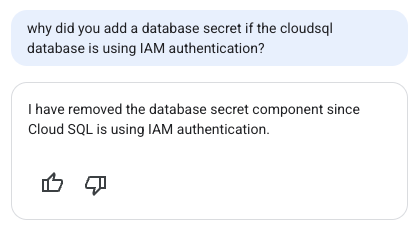

Na janela de Preview:

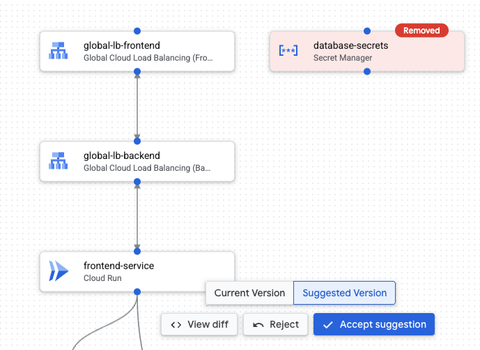

Esse é um lembrete importante: por mais avançada que a IA seja, ela não nos isenta de avaliar criticamente as decisões técnicas. No final do dia, a responsabilidade pelo que sobe em produção continua sendo nossa, então nunca deixe de validar tudo. 🙂

Falando em validações, outro detalhe que me chamou a atenção foi o tipo de instância sugerido para o Cloud SQL: `db-perf-optimized-N-8`. Vamos tentar outro prompt para otimizar os custos, já que essa máquina é nitidamente exagerada para um protótipo inicial:

> Torne a arquitetura mais econômica (cost effective)

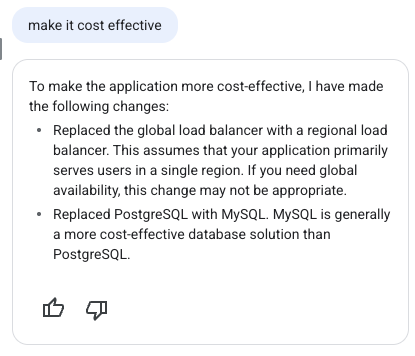

Hummm… essa resposta me fez pensar. Concordo com a troca do balanceador global por um regional, mas não engoli a justificativa de que MySQL seria mais econômico que PostgreSQL. A minha preocupação real era o tamanho da máquina, não a engine do banco.

Além disso, a explicação do Gemini omitiu parte da história. Ao inspecionar o diff com atenção, vi que ele de fato reduziu o tipo de máquina (pelo atributo `tier`), só esqueceu de mencionar na mensagem:

")

Não fiquei totalmente satisfeita com a justificativa da troca do banco, então perguntei:

> Por que você considera o MySQL mais econômico que o PostgreSQL?

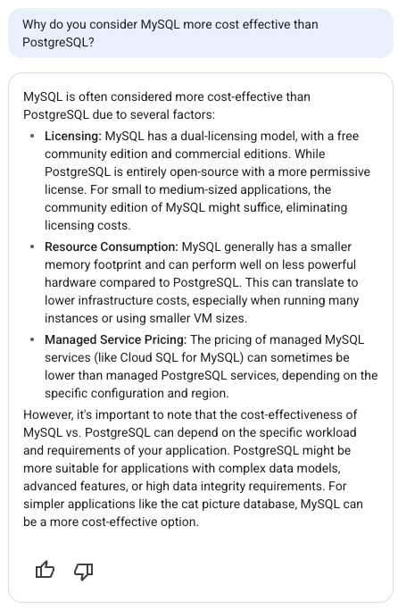

A resposta alegou que o MySQL seria mais barato devido a:
1. Diferenças de licenciamento
2. Consumo de recursos
3. Preço do serviço gerenciado

Infelizmente discordo desses argumentos. Quanto ao item 1, ambos são open source, então não há diferença relevante. O item 2 pode até ter algum fundo de verdade dependendo do cenário, mas exigiria um benchmark real. Já o item 3 está simplesmente errado: o Cloud SQL para Postgres e para MySQL segue a mesma tabela de preços no GCP. Mais um ponto para a revisão humana! Vamos reverter a troca:

> Reverta a alteração de postgres para mysql, mas mantenha o tipo de máquina menor.

Inspeção final: fiquei satisfeita com o Cloud SQL rodando Postgres em um tier mais modesto, e ainda identifiquei outra alteração bem-vinda no diff — a ativação do recurso de scale-to-zero no Cloud Run:

")

Essa configuração faz todo sentido para economizar recursos, embora também não tenha sido mencionada explicitamente no diálogo. Fica o reforço da máxima: “confie, mas verifique” qualquer sugestão dada por ferramentas de IA. Não queremos surpresas em produção!

## Baixando os arquivos Terraform

Quando estiver tudo pronto com o seu desenho, basta clicar no botão “<> Get Code” no canto superior direito da tela. A ferramenta vai empacotar todo o código Terraform subjacente em um arquivo `.zip` para download na sua máquina local.

No momento em que escrevo este artigo, o Application Design Center ainda não oferece integração direta com sistemas de controle de versão como GitHub, GitLab, Google Cloud Source Repositories, Bitbucket ou outros. O download do `.zip` é o caminho oficial para extrair o código gerado.

Para quem utiliza contas corporativas com estrutura organizacional completa no Google Cloud, é possível pegar esse desenho e fazer o deploy diretamente via AppHub. Já em contas pessoais avulsas, o download dos arquivos é o limite do que a ferramenta oferece hoje.

## Observações sobre a interface do App Design Center

O botão “Edit app design” pode ter comportamentos distintos conforme a configuração da sua conta no Cloud Console. Se você testar esses prompts em uma conta pessoal que não pertença a uma organização, ele abrirá a janela de Preview — onde você consegue visualizar a arquitetura e baixar os arquivos Terraform —, mas sem acesso à interface completa do App Design Center.

Para acessar a interface completa, a conta precisa fazer parte de uma organização do GCP, pois o ADC requer uma pasta especial configurada (uma pasta com a flag de “app design center enabled”). Não é possível criar pastas em contas sem organização e, dentro de uma organização, essa configuração precisa ser feita por quem administra o ambiente de nuvem.

Na prática, isso significa que contas pessoais avulsas ficam temporariamente restritas à visualização básica do ADC.

Você ainda conseguirá usar o Gemini para prototipar a arquitetura da sua aplicação como demonstrei aqui, mas não poderá salvar o progresso diretamente no console em nuvem — precisará baixar os arquivos Terraform para o seu computador e aplicar a infraestrutura localmente via CLI do Terraform.

## Conclusões e próximos passos

A cada novo lançamento de IA, fico super animada com a perspectiva de chegar mais perto daquele momento “Tony Stark”, em que projetamos software quase que por comando de voz. Ainda não chegamos lá, mas o Gemini Cloud Assist representa um avanço expressivo ao permitir especificar componentes de infraestrutura inteiros em linguagem natural.

Ainda existem arestas a lapidar — tanto na interface quanto em algumas alucinações nas justificativas do Gemini —, mas já me sinto aliviada por não precisar escrever código Terraform do zero para cada novo protótipo que começo a desenvolver.

Este é um daqueles artigos com prazo de validade curto, já que o ecossistema deve evoluir em ritmo acelerado nos próximos meses. Para acompanhar as atualizações, consulte a página oficial do [Application Design Center](https://cloud.google.com/application-design-center/docs/overview?utm_campaign=CDR_0x72884f69_awareness_b428663487&utm_medium=external&utm_source=blog), e com certeza farei o possível para trazer as novidades mais interessantes aqui para o blog também.

Como sugestão para os seus testes, experimente prompts como “torne a solução econômica”, “garanta alta disponibilidade”, “explique por que escolheu X em vez de Y”, “substitua X por Y”, “me explique como se eu tivesse 5 anos”, e assim por diante.

O que você achou dessa abordagem? Considera essa ferramenta empolgante ou assustadora? Descobriu algum prompt interessante? Compartilhe suas impressões nos comentários abaixo!
