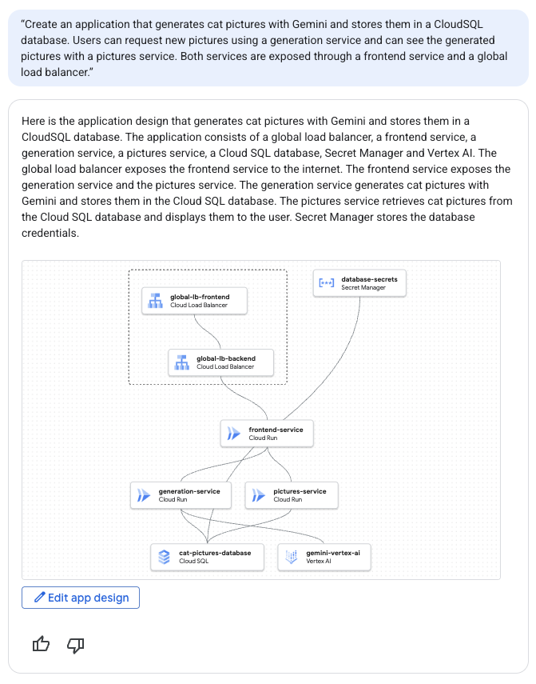
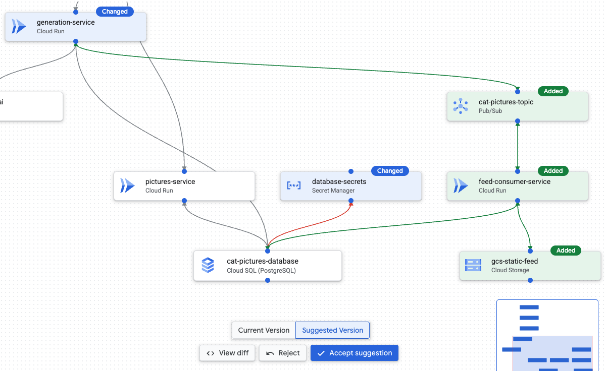
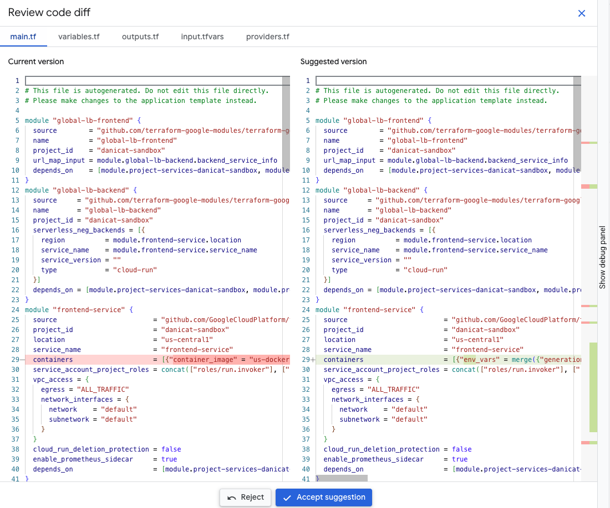
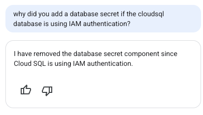
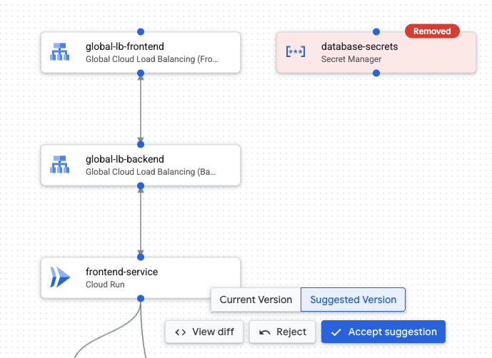
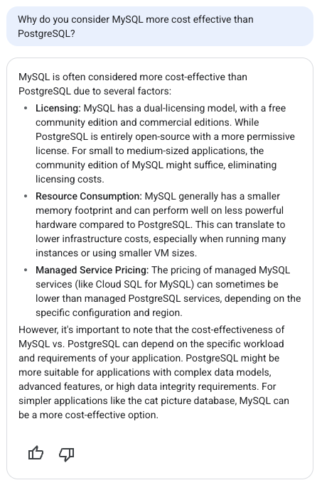


## Introdução

Hoje vamos fazer um pequeno desvio do nosso conteúdo usual sobre agentes de IA para falar sobre um produto que explorei recentemente como parte da minha participação no I/O Connect Berlin 2025 na semana passada.

Este evento reuniu mais de 1000 desenvolvedores de toda a Europa, incluindo membros das comunidades de desenvolvedores do Google (Google Developer Groups) e especialistas da comunidade. Foi também o meu primeiro evento oficial do Google desde que entrei para a equipe de DevRel em abril, por isso foi particularmente significativo para mim - e é por isso que não tivemos atualização no blog na semana passada!

Fui responsável por uma demonstração chamada “Design and Deploy”, que mostra a combinação de dois produtos: [Application Design Center (ADC)](https://cloud.google.com/application-design-center/docs/overview?utm_campaign=CDR_0x72884f69_awareness_b428663487&utm_medium=external&utm_source=blog) e [Gemini Cloud Assist (GCA)](https://cloud.google.com/products/gemini/cloud-assist?utm_campaign=CDR_0x72884f69_awareness_b428663487&utm_medium=external&utm_source=blog). A demonstração foi tão bem recebida que achei que seria bom trazer esse conteúdo para o blog também, para dar a oportunidade às pessoas que não estavam lá de brincar com essa tecnologia também.

O Application Design Center é um produto para ajudar arquitetos e desenvolvedores a projetar a infraestrutura de seus aplicativos. Na frente, ele fornece uma interface de usuário agradável onde você pode definir visualmente os componentes para sua infraestrutura, mas por baixo dos panos tudo na interface do usuário é representado como um módulo terraform para que você também possa aproveitar os benefícios da [Infraestrutura como Código](https://en.wikipedia.org/wiki/Infrastructure_as_code).

Um aviso importante é que o ADC está atualmente em [pré-visualização pública](https://cloud.google.com/products?e=48754805&hl=en#product-launch-stages&utm_campaign=CDR_0x72884f69_awareness_b428663487&utm_medium=external&utm_source=blog). Isso significa que o produto está evoluindo a cada dia e, às vezes, pode quebrar a compatibilidade com iterações anteriores. Ele também tem algumas arestas notavelmente ásperas que mencionarei abaixo, que devem ser resolvidas antes que o produto se torne disponível para o público em geral.

O Gemini Cloud Assist (também em pré-visualização pública), por outro lado, é o nome oficial do produto para o suporte do Gemini no Google Cloud. Por causa disso, o GCA não é um produto autônomo, mas mais como um tecido conjuntivo que permite aos usuários interagir com qualquer coisa do GCP usando linguagem natural, incluindo todos os benefícios da moderna experiência de chatbot baseada em modelos de linguagem grandes.

Vamos ver como podemos usar ambas as tecnologias para projetar rapidamente a parte de infraestrutura de um aplicativo para nós.

## Como iniciar uma sessão de design de aplicativo

Você sempre pode abrir o Application Design Center manualmente no console do Google Cloud, mas qual é a graça disso? A melhor maneira de acionar o ADC para um novo design é simplesmente abrir o painel do Gemini em qualquer página. Aqui, por exemplo, estou usando a página de boas-vindas do meu projeto:

Se você clicar no botão “estrela” no lado direito da barra de pesquisa, abrirá o painel do Gemini Cloud Assist:

Deve abrir:

Este é o painel onde você pode interagir com o Gemini. Digite algo como “criar um aplicativo que faz x” e inclua quantos detalhes desejar sobre a arquitetura. Por exemplo, vamos tentar criar um aplicativo que gera fotos de gatos. Aqui está o prompt:

> Crie um aplicativo que gere fotos de gatos com o Gemini e as armazene em um banco de dados Cloud SQL. Os usuários podem solicitar novas fotos usando um serviço de geração e podem ver as fotos geradas com um serviço de fotos. Ambos os serviços são expostos por meio de um serviço de frontend e um balanceador de carga global.

Depois de inserir o prompt, o Gemini pensará por um tempo e, após alguns segundos, produzirá uma saída como esta:

A visualização integrada nos dá uma ideia, mas podemos interagir melhor com o design se clicarmos no botão “Edit app design”. Isso abrirá o design em uma visualização expandida para que possamos refiná-lo ainda mais. (Observe que o restante deste artigo pressupõe que o botão “Edit app design” abre a janela de Pré-visualização. Se no seu caso não abrir, verifique as notas no final do artigo)

É assim que fica na janela de “Pré-visualização”:

Se você não estiver satisfeito com as convenções de nomenclatura ou com os detalhes dos componentes gerados, poderá sempre alterá-los clicando no componente e abrindo o painel de configuração. Aqui abri o painel de configuração do meu `frontend-service`:

Observe que esta tela também mostra qual contêiner é instanciado pelo Cloud Run, que assume como padrão um contêiner “hello”. Isso ocorre porque o Gemini Cloud Assist não tem informações sobre qual contêiner você deseja executar, mas se você fornecer essas informações, ele poderá substituir o valor.

Estou destacando isso aqui também por outro motivo - precisamos definir as expectativas de que esta ferramenta não codifica o aplicativo para você, ela apenas projeta a infraestrutura para suportá-lo. Para codificar os serviços de frontend e backend reais, por exemplo, você precisará usar outras ferramentas como o Gemini CLI ou seu IDE regular e publicar os artefatos em seu registro de contêiner para que o Cloud Run possa acessá-los.

Na janela de Pré-visualização, você pode editar componentes, mas não adicionar componentes manualmente. Se você quiser iterar no design, o que você pode fazer é pedir ao Gemini para modificar o design para você. Veja, por exemplo, este prompt de acompanhamento:

> Adicione um serviço de streaming que capture eventos para cada foto de gato gerada. Do outro lado do stream, há um serviço de consumidor que atualizará uma página estática hospedada no GCS, adicionando as fotos mais recentes a um feed.

Esta é a resposta do Gemini:

E a janela de Pré-visualização será atualizada com o novo design, destacando adições (verde), modificações (azul) e exclusões (vermelho):

Na parte inferior da tela, você tem a opção de aceitar ou rejeitar a sugestão. Mas antes disso, é uma boa oportunidade para inspecionar o código terraform que é gerado por baixo dos panos. Para ver o código e comparar as alterações, clique em “View diff”:

Isso abrirá a janela Code Diff com ambas as versões mostradas lado a lado:

Como você pode ver, cada caixa no diagrama é mapeada para um módulo terraform diferente. Se você rolar para baixo, poderá ver os módulos que ele adicionou recentemente destacados em verde.

Se você estiver satisfeito com a implementação, pode aceitar a sugestão ou rejeitar e pedir ao Gemini para melhorá-la. Aceitei a sugestão, mas notei algo um pouco estranho sobre o módulo “database-secrets”, então decidi perguntar ao Gemini sobre isso:

Prompt: “por que você adicionou um segredo de banco de dados se o banco de dados Cloud SQL está usando autenticação IAM?”

Bem, acho que não era realmente necessário:

Na janela de Pré-visualização:

Este é um alerta importante de que, por mais que a IA tenha se tornado cada vez mais avançada, ainda não estamos isentos de avaliar e tomar decisões. No final das contas, a IA ainda estará lá, mas nossos empregos estão em jogo, então não se esqueça de validar tudo. 🙂

Sobre o tema de validações, outra coisa que me chamou a atenção é que o Gemini estava sugerindo um tipo de instância Cloud SQL razoavelmente grande: `db-perf-optimized-N-8`. Vamos tentar outro prompt para melhorar isso, pois isso definitivamente é demais para um protótipo pequeno:

> Torne-o econômico

Hmmm… essa me fez pensar. Entendo o ponto sobre o balanceador de carga regional versus global, mas não estou convencido do motivo pelo qual ele acha que o MySQL é mais econômico do que o PostgreSQL. Eu estava mais preocupado com o tipo de máquina do que com a tecnologia de banco de dados real.

A resposta do Gemini não nos conta toda a história, no entanto. Inspecionando o `diff` de perto, ele nos mostra que na verdade modificou o tipo de máquina (mostrado como o atributo `tier`) e simplesmente esqueceu de nos dizer:

")

Não estou totalmente satisfeito com isso, então vou perguntar por quê:

A resposta sugere que o MySQL é mais econômico que o Postgres devido a:
1. Diferenças de licenciamento
2. Consumo de recursos
3. Preços de serviços gerenciados

Infelizmente, não posso concordar com esta resposta. Para o item 1, ambos têm licenças de código aberto, portanto, não são tão diferentes. Talvez o item 2 possa ter alguma verdade, mas eu ainda precisaria de um benchmark adequado. O item 3 está errado porque o Cloud SQL para Postgres e MySQL têm o mesmo modelo de preços no GCP. Mais um ponto para os humanos, vamos reverter a mudança:

> reverta a alteração de postgres para mysql, mas mantenha o tipo de máquina menor.

Inspeção final: estou feliz com o Cloud SQL executando Postgres em um nível de banco de dados menor, mas também descobri que há outra edição notável que ativa o recurso de escalonamento para zero do Cloud Run:

")

Este faz muito sentido, mas também não foi mencionado no diálogo. Este é outro lembrete para “confiar, mas verificar” o que quer que sua ferramenta de IA esteja lhe dizendo. Não queremos surpresas rodando em produção.

## Recuperando os Arquivos Terraform

Depois de estar satisfeito com o design, você pode clicar no botão “&lt;&gt; Get Code” no canto superior direito da interface do usuário. Isso compactará o código terraform subjacente em um arquivo zip para você baixar para sua máquina local.

Infelizmente, no momento em que este artigo foi escrito, o Application Design Center não oferece suporte a nenhuma integração com sistemas de controle de versão de código como GitHub, GitLab, Google Source, Bitbucket e outros. A única maneira de extrair o código da ferramenta é por meio do download deste arquivo zip.

Para pessoas que usam contas corporativas com uma hierarquia organizacional completa, você pode pegar este design e implantá-lo usando o AppHub, mas se você estiver usando sua conta pessoal, infelizmente este é o limite do que a ferramenta pode fazer por você.

## Notas sobre a interface do usuário do App Design Center

O botão “Edit app design” terá comportamentos diferentes dependendo de como seu console da nuvem está configurado. Se você estiver testando este prompt de sua conta pessoal e sua conta pessoal não estiver vinculada a uma organização, ele abrirá uma janela de Pré-visualização onde você poderá ver o design e baixar o código terraform correspondente, mas não terá acesso à interface de usuário completa do App Design Center.

Para usar a interface completa, você precisa fazer parte de uma organização, pois a configuração do App Design Center precisa de um tipo especial de pasta configurada, denominada pasta “habilitada para o app design center”. Não há como adicionar pastas a contas sem uma organização e, dentro de uma organização, esta pasta precisa ser configurada pelo administrador da nuvem.

Infelizmente, isso significa que as contas de usuário que não pertencem a nenhuma organização ficarão efetivamente bloqueadas do conjunto completo de recursos do ADC, pelo menos por enquanto.

Você ainda poderá usar o Gemini para ajudá-lo a prototipar a arquitetura do seu aplicativo, assim como mostrei neste artigo, mas não poderá salvar seu progresso na interface do usuário da nuvem e precisará baixar os arquivos terraform para sua máquina local e implantá-los usando sua própria instalação do terraform.

## Conclusões e próximos passos

Cada novo produto de IA lançado me deixa animado com a ideia de ter aquele momento “Tony Stark” em que você pode projetar seu software apenas usando comandos de voz. Ainda não chegamos lá, mas com o Gemini Cloud Assist estamos progredindo bem, pois agora podemos usar linguagem natural para especificar os componentes de infraestrutura para nós.

Ainda existem algumas arestas ásperas tanto em termos de interface do usuário quanto nas sugestões do Gemini, mas já estou aliviado por não ter que criar manualmente o código terraform para cada novo aplicativo que estou desenvolvendo.

Este é claramente um artigo que deve ter uma data de validade, pois devemos ver essa ferramenta evoluir muito rapidamente nos próximos meses. Para se manter atualizado, você sempre pode verificar a página do produto [Application Design Center](https://cloud.google.com/application-design-center/docs/overview?utm_campaign=CDR_0x72884f69_awareness_b428663487&utm_medium=external&utm_source=blog), mas é claro que farei o meu melhor para escrever sobre novos recursos e melhorias interessantes neste blog também.

Como algumas sugestões, recomendo que você experimente alguns prompts criativos como “torne-o econômico”, “torne-o altamente disponível”, “explique por que x em vez de y”, “substitua x por y”, “explique x para mim como se eu tivesse 5 anos”, e assim por diante.

Quais são seus pensamentos? Você achou esta ferramenta empolgante ou assustadora? Você encontrou algum prompt interessante? Deixe seus comentários abaixo!
