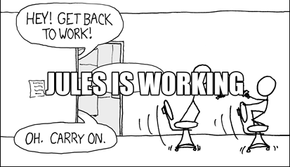

> *Author's note:* about 90% of this blog post is written by AI, but I proofread and edited it to ensure the post read nicely. It was funny how Jules had the tendency to brag about itself. I had to guide it with many prompts to get to this final result, but the last edit was easier to do manually. You can see the full edit history on the [PR commit history](https://github.com/danicat/danicat.dev/pull/6). A notable mention is that it completely refused to translate this post to Portuguese (Brazil) stating that it doesn't have translation capabilities, but the entirety of this blog was translated using Jules in a previous interaction. I guess it was not in the mood. :)

## Introduction

I recently decided to update the homepage of my blog to better highlight the most recent content. As a backend engineer, diving deep into frontend intricacies isn't my usual day-to-day, so instead of manually coding all the changes in a less familiar domain, I enlisted the help of [Jules](https://jules.google), an AI coding assistant.

This post details our iterative journey, the successes, the (sometimes amusing) misunderstandings, and what I learned about working effectively with AI for web development, especially in bridging skill gaps.

## The Goal: A Featured Post Section

My initial request to Jules was straightforward:
> "Change the layout of the main page so that it displays the most recent blog post in highlight instead of it being in the recent posts list. The recent posts should contain all other posts except the most recent one. This behaviour should be seen only on the blog landing page (home). If the user clicks on the Blog menu it should still see all the posts in reverse chronological order, including the most recent one."

Jules quickly understood and proposed a plan involving exploring the Hugo codebase, identifying templates, and modifying them.

## Iteration Highlights: The Good, The Bad, and The AI

Our collaboration involved several iterations to get things just right.

### Iteration 1: Initial Setup - Getting the Basics Right
Jules correctly identified the Blowfish theme's partials and set up the override structure. The logic to separate the latest post from the others in the "Recent Posts" list was implemented well.

*   **What worked:** Understanding the core Hugo structure, fetching posts, basic template modifications. Jules's ability to navigate the theme and project files was a significant time-saver here.

### Iteration 2: Styling with Tailwind - The Trial-and-Error Dance
We then focused on the appearance: title, width, and image dimensions. This involved a series of prompts to fine-tune the visuals. For example:

> "Change the featured post title to 'Featured Post'. Adjust its width to be about 80% of the view. The image is too tall/narrow, let's try a 4:3 aspect ratio. That's still not quite right, make it wider/less tall."

This is where the iterative nature of working with Jules on visual elements became very apparent.

*   **Jules's approach:** Modified i18n files for titles, used various Tailwind width classes (e.g., `md:w-4/5`, `md:w-2/3`, `max-w-xl`, `max-w-2xl`), and manipulated `padding-bottom` for image aspect ratios.

*   **Challenge & Frustration:** A particular challenge, especially for someone like me who primarily works on the backend, was the trial-and-error nature of styling with Tailwind through an intermediary. While Jules could apply the classes it thought appropriate, the visual outcome wasn't always immediately what I had in mind. Changes in Tailwind classes often didn't translate to a clearly visible difference on the first try, or the effect was not as expected. This led to a few rounds of "try this class," "no, make it narrower/wider/taller/shorter," which, while ultimately successful, could feel frustrating at times. It highlighted the disconnect between code and immediate visual feedback in this AI-assisted async workflow.

*   **Learning:** Fine-tuning visual aesthetics is the least favourite part of my experience, as the instructions will often result to false positives. Clear, descriptive feedback is key, but also recognizing that some back-and-forth is inevitable when I can't directly point at a screen or make micro-adjustments myself in real-time. Jules, however, diligently applied each requested change, which helped bridge my frontend knowledge gap.

### Iteration 3: Custom CSS vs. Tailwind - A Brief Detour
At one point, to get very specific control over the card's dimensions, I prompted:

> "jules, instead of trying to use an existing style class, create an unique style class for the featured post card. This style should use relative width and height of 75% of the container..."

*   **Jules's response:** Jules correctly created the custom CSS rules and refactored the card's partial to use them.

*   **Outcome & Learning:** While Jules implemented this as requested, the result felt somewhat alien to the rest of the blog's design, which is heavily Tailwind-based. The custom CSS didn't quite harmonize, and I quickly decided that maintaining consistency with Tailwind was more important. This was a good lesson in ensuring that even AI-generated solutions fit the existing design language and my preference for sticking to the established framework. Jules adapted back to Tailwind upon request:

> "undo the last change and restore the tailwind style of formatting. apply the same style guidelines using tailwind best practices"

### Iteration 4: The Great "Comments" Misunderstanding!
This was perhaps the most illustrative part of the AI-human interaction. I mentioned:

> "the comments are rendering in the featured post. please remove all the comments or make them invisible"

*   **Jules's interpretation:** Jules assumed I meant the blog's *user comment system* (like Utterances or Giscus) or metadata like views/likes counts. This led to a series of steps where Jules tried to investigate and then conditionally hide views/likes metadata.
*   **My Clarification:** After these changes, I clarified by giving it an example:
    > "you are wrong, I never said I wanted to remove the views and likes - I'm referring to the code comments in rendering as {/* Adjusted padding ... */} and {/* Removed prose classes ... */}"
*   **Resolution:** Once Jules understood I meant *literal Go template/HTML comments* that were incorrectly formatted (using `{/*...*}` which isn't a valid Hugo comment style and thus renders as text) and not `{{/* ... */}}`, the fix was immediate: remove the offending text from the templates.
*   **What worked:** Jules's persistence and systematic approach to debugging the (misunderstood) problem was commendable.
*   **Challenge & Learning:** This highlighted a crucial aspect of AI interaction: ambiguity in natural language. "Comments" has multiple meanings. My initial report wasn't precise enough.

### Iteration 5: Final Polish
After resolving the visible template comments, we made final tweaks:

> "Remove the 'Featured Post' title. Change card width to 50%. Increase title and summary font sizes. Make the image's aspect ratio 16:9."

This led to the final adjustments for the card's width, font sizes, and image aspect ratio. The width % didn't have any effect, but changing the aspect ratio did the trick.

### Bonus Iteration: Jules Drafts This Blog Post

> "This is perfect. No more code changes are needed. Now I want you to create a new blog post entry describing the iteration we just did..."

And here we are! This post itself was drafted with the assistance of Jules, based on our interaction log and my guiding feedback, including the very points you're reading now.

## What Worked Well with Jules

*   **Bridging Skill Gaps:** As a backend engineer, Jules was invaluable in tackling frontend tasks involving Hugo templating and Tailwind CSS, areas where I have less day-to-day experience. Jules made up for my lack of deep frontend knowledge, proposing and implementing solutions that I could then guide and refine.
*   **Speed of Implementation:** For well-understood changes, Jules can modify code, create files, and refactor structures much faster than manual typing.
*   **Handling Complex Instructions:** Generally, Jules understood multi-step requests and complex layout goals.
*   **Systematic Problem Solving:** Even with misunderstandings, Jules often followed a logical process.
*   **Iterative Refinement:** Jules was consistently receptive to feedback for tweaks.

## Challenges and Learnings

*   **Precision of Language:** The "comments" incident underscores how critical precise language is. What's obvious to a human, or shorthand, might be ambiguous to an AI.
*   **Visual Feedback Loop & Tailwind:** The trial-and-error with Tailwind styling was a key challenge. Without Jules "seeing" the output, describing desired visual outcomes or why a particular set of classes wasn't working as hoped required patience and detailed descriptions. This is inherent in text-based interaction for visual tasks.
*   **Misinterpretation & Course Correction:** When Jules misunderstood a task, it would proceed diligently down that incorrect path. There wasn't a way to interrupt it mid-task; I had to wait for it to complete its current action sequence before providing corrective feedback.
*   **Asynchronous Workflow & Pace:** The work is mostly asynchronous. Each request and Jules's implementation could take from a few minutes to sometimes half an hour for more complex sequences. This makes the iterative loop slower than direct coding with instant feedback or live pair programming.

## Suggested Resources

For those interested in learning more about Jules:

*   [Jules Official Website](https://jules.google)
*   [Jules Documentation](https://jules.google/docs)

## Conclusion

Overall, working with Jules on this homepage feature was a productive experience. It truly felt like "vibe-coding" – a dynamic exchange guiding the AI. The key to success lies in clear, iterative communication, patience during misunderstandings, and a willingness to provide specific, actionable feedback.

The frustrations, particularly with the Tailwind trial-and-error and the AI's occasional misinterpretations, are part of the current landscape of AI-assisted development. However, despite the asynchronous nature and the time taken for some generations, the ability to offload the mechanical aspects of coding and to get suggestions for areas outside my core expertise (like specific Tailwind implementations or Hugo structures) still resulted in a net gain. It was significantly faster and more effective than if I had attempted to learn all the necessary frontend design principles, Hugo intricacies, and Tailwind CSS nuances from scratch for this specific feature.

AI assistants like Jules are powerful tools. They don't replace human oversight or design intent, but they can be incredible accelerators when approached with the right mindset and communication strategy.
