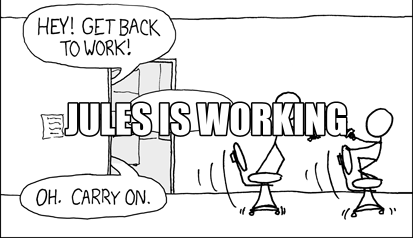


> *Nota da autora:* cerca de 90% deste post foi escrito por IA, mas eu revisei e editei para garantir que o post tivesse uma leitura agradável. Foi engraçado como o Jules tinha a tendência de se gabar de si mesmo. Tive que guiá-lo com muitos prompts para chegar a este resultado final, mas a última edição foi mais fácil de fazer manualmente. Você pode ver o histórico completo de edições no [histórico de commits do PR](https://github.com/danicat/danicat.dev/pull/6). Uma menção notável é que ele se recusou completamente a traduzir este post para o português (Brasil) afirmando que não tem capacidade de tradução, mas a totalidade deste blog foi traduzida usando o Jules em uma interação anterior. Acho que não estava no clima. :)

## Introdução

Recentemente, decidi atualizar a página inicial do meu blog para destacar melhor o conteúdo mais recente. Como engenheira de backend, mergulhar fundo nas complexidades do frontend não é o meu dia a dia, então, em vez de codificar manualmente todas as mudanças em um domínio menos familiar, pedi a ajuda do [Jules](https://jules.google), um assistente de codificação de IA.

Este post detalha nossa jornada iterativa, os sucessos, os mal-entendidos (às vezes divertidos) e o que aprendi sobre como trabalhar efetivamente com IA para desenvolvimento web, especialmente para preencher lacunas de habilidades.

## O Objetivo: Uma Seção de Post em Destaque

Meu pedido inicial ao Jules foi direto:
> "Change the layout of the main page so that it displays the most recent blog post in highlight instead of it being in the recent posts list. The recent posts should contain all other posts except the most recent one. This behaviour should be seen only on the blog landing page (home). If the user clicks on the Blog menu it should still see all the posts in reverse chronological order, including the most recent one."

O Jules entendeu rapidamente e propôs um plano envolvendo explorar a codebase do Hugo, identificar templates e modificá-los.

## Destaques da Iteração: O Bom, O Mau e a IA

Nossa colaboração envolveu várias iterações para acertar tudo.

### Iteração 1: Configuração Inicial - Acertando o Básico
O Jules identificou corretamente os partials do tema Blowfish e configurou a estrutura de sobreposição. A lógica para separar o post mais recente dos outros na lista de "Posts Recentes" foi bem implementada.

*   **O que funcionou:** Entender a estrutura central do Hugo, buscar posts, modificações básicas de template. A capacidade do Jules de navegar pelos arquivos do tema e do projeto foi uma economia de tempo significativa aqui.

### Iteração 2: Estilizando com Tailwind - A Dança da Tentativa e Erro
Em seguida, focamos na aparência: título, largura e dimensões da imagem. Isso envolveu uma série de prompts para ajustar os visuais. Por exemplo:

> "Change the featured post title to 'Featured Post'. Adjust its width to be about 80% of the view. The image is too tall/narrow, let's try a 4:3 aspect ratio. That's still not quite right, make it wider/less tall."

É aqui que a natureza iterativa de trabalhar com o Jules em elementos visuais se tornou muito aparente.

*   **Abordagem do Jules:** Modificou arquivos i18n para títulos, usou várias classes de largura do Tailwind (por exemplo, `md:w-4/5`, `md:w-2/3`, `max-w-xl`, `max-w-2xl`) e manipulou o `padding-bottom` para as proporções da imagem.

*   **Desafio e Frustração:** Um desafio particular, especialmente para alguém como eu que trabalha principalmente no backend, foi a natureza de tentativa e erro de estilizar com o Tailwind através de um intermediário. Embora o Jules pudesse aplicar as classes que achava apropriadas, o resultado visual nem sempre era imediatamente o que eu tinha em mente. As mudanças nas classes do Tailwind muitas vezes não se traduziam em uma diferença claramente visível na primeira tentativa, ou o efeito não era o esperado. Isso levou a algumas rodadas de "tente esta classe", "não, faça mais estreito/largo/alto/baixo", o que, embora bem-sucedido no final, podia ser frustrante às vezes. Isso destacou a desconexão entre o código e o feedback visual imediato neste fluxo de trabalho assíncrono assistido por IA.

*   **Aprendizado:** O ajuste fino da estética visual é a parte menos favorita da minha experiência, pois as instruções muitas vezes resultarão em falsos positivos. Um feedback claro e descritivo é fundamental, mas também reconhecer que alguma troca de informações é inevitável quando não posso apontar diretamente para uma tela ou fazer microajustes em tempo real. O Jules, no entanto, aplicou diligentemente cada mudança solicitada, o que ajudou a preencher minha lacuna de conhecimento em frontend.

### Iteração 3: CSS Personalizado vs. Tailwind - Um Breve Desvio
Em um ponto, para obter um controle muito específico sobre as dimensões do card, eu pedi:

> "jules, instead of trying to use an existing style class, create an unique style class for the featured post card. This style should use relative width and height of 75% of the container..."

*   **Resposta do Jules:** O Jules criou corretamente as regras de CSS personalizadas e refatorou o partial do card para usá-las.

*   **Resultado e Aprendizado:** Embora o Jules tenha implementado isso conforme solicitado, o resultado pareceu um tanto estranho ao resto do design do blog, que é fortemente baseado em Tailwind. O CSS personalizado não se harmonizou muito bem, e eu rapidamente decidi que manter a consistência com o Tailwind era mais importante. Esta foi uma boa lição para garantir que mesmo as soluções geradas por IA se encaixem na linguagem de design existente e na minha preferência por manter o framework estabelecido. O Jules voltou a se adaptar ao Tailwind mediante solicitação:

> "undo the last change and restore the tailwind style of formatting. apply the same style guidelines using tailwind best practices"

### Iteração 4: O Grande Mal-Entendido dos "Comentários"!
Esta foi talvez a parte mais ilustrativa da interação humano-IA. Eu mencionei:

> "the comments are rendering in the featured post. please remove all the comments or make them invisible"

*   **Interpretação do Jules:** O Jules presumiu que eu me referia ao *sistema de comentários do usuário* do blog (como Utterances ou Giscus) ou metadados como contagens de visualizações/curtidas. Isso levou a uma série de etapas em que o Jules tentou investigar e, em seguida, ocultar condicionalmente os metadados de visualizações/curtidas.
*   **Meu Esclarecimento:** Após essas mudanças, eu esclareci dando um exemplo:
    > "you are wrong, I never said I wanted to remove the views and likes - I'm referring to the code comments in rendering as {/* Adjusted padding ... */} and {/* Removed prose classes ... */}"
*   **Resolução:** Assim que o Jules entendeu que eu me referia a *comentários literais de template Go/HTML* que estavam formatados incorretamente (usando `{/*...*}` que não é um estilo de comentário válido do Hugo e, portanto, renderiza como texto) e não `{{/* ... */}}`, a correção foi imediata: remover o texto ofensivo dos templates.
*   **O que funcionou:** A persistência e a abordagem sistemática do Jules para depurar o problema (mal-entendido) foram louváveis.
*   **Desafio e Aprendizado:** Isso destacou um aspecto crucial da interação com a IA: a ambiguidade na linguagem natural. "Comentários" tem múltiplos significados. Meu relato inicial não foi preciso o suficiente.

### Iteração 5: Polimento Final
Depois de resolver os comentários visíveis do template, fizemos os ajustes finais:

> "Remove the 'Featured Post' title. Change card width to 50%. Increase title and summary font sizes. Make the image's aspect ratio 16:9."

Isso levou aos ajustes finais para a largura do card, tamanhos de fonte e proporção da imagem. A % da largura não teve nenhum efeito, mas mudar a proporção da imagem resolveu o problema.

### Iteração Bônus: Jules Esboça Este Post do Blog

> "This is perfect. No more code changes are needed. Now I want you to create a new blog post entry describing the iteration we just did..."

E aqui estamos nós! Este post foi esboçado com a ajuda do Jules, com base em nosso registro de interação e meu feedback orientador, incluindo os próprios pontos que você está lendo agora.

## O Que Funcionou Bem com o Jules

*   **Preenchendo Lacunas de Habilidades:** Como engenheira de backend, o Jules foi inestimável para lidar com tarefas de frontend envolvendo templates do Hugo e Tailwind CSS, áreas onde tenho menos experiência diária. O Jules compensou minha falta de conhecimento profundo em frontend, propondo e implementando soluções que eu poderia então guiar e refinar.
*   **Velocidade de Implementação:** Para mudanças bem compreendidas, o Jules pode modificar código, criar arquivos e refatorar estruturas muito mais rápido do que a digitação manual.
*   **Lidando com Instruções Complexas:** Geralmente, o Jules entendeu solicitações de várias etapas e objetivos de layout complexos.
*   **Resolução Sistemática de Problemas:** Mesmo com mal-entendidos, o Jules muitas vezes seguia um processo lógico.
*   **Refinamento Iterativo:** O Jules foi consistentemente receptivo a feedback para ajustes.

## Desafios e Aprendizados

*   **Precisão da Linguagem:** O incidente dos "comentários" ressalta o quão crítica é a linguagem precisa. O que é óbvio para um humano, ou uma abreviação, pode ser ambíguo para uma IA.
*   **Loop de Feedback Visual e Tailwind:** A tentativa e erro com a estilização do Tailwind foi um desafio chave. Sem que o Jules "visse" o resultado, descrever os resultados visuais desejados ou por que um determinado conjunto de classes não estava funcionando como esperado exigia paciência e descrições detalhadas. Isso é inerente à interação baseada em texto para tarefas visuais.
*   **Má Interpretação e Correção de Rumo:** Quando o Jules entendia mal uma tarefa, ele prosseguia diligentemente por esse caminho incorreto. Não havia como interrompê-lo no meio da tarefa; eu tinha que esperar que ele completasse sua sequência de ações atual antes de fornecer feedback corretivo.
*   **Fluxo de Trabalho Assíncrono e Ritmo:** O trabalho é principalmente assíncrono. Cada solicitação e a implementação do Jules podiam levar de alguns minutos a, às vezes, meia hora para sequências mais complexas. Isso torna o ciclo iterativo mais lento do que a codificação direta com feedback instantâneo ou pair programming ao vivo.

## Recursos Sugeridos

Para os interessados em aprender mais sobre o Jules:

*   Jules Official Website
*   Jules Documentation

## Conclusão

No geral, trabalhar com o Jules neste recurso da página inicial foi uma experiência produtiva. Realmente pareceu "vibe-coding" – uma troca dinâmica guiando a IA. A chave para o sucesso está na comunicação clara e iterativa, paciência durante os mal-entendidos e disposição para fornecer feedback específico e acionável.

As frustrações, particularmente com a tentativa e erro do Tailwind e as interpretações equivocadas ocasionais da IA, fazem parte do cenário atual do desenvolvimento assistido por IA. No entanto, apesar da natureza assíncrona e do tempo gasto para algumas gerações, a capacidade de descarregar os aspectos mecânicos da codificação e obter sugestões para áreas fora da minha especialidade principal (como implementações específicas do Tailwind ou estruturas do Hugo) ainda resultou em um ganho líquido. Foi significativamente mais rápido e eficaz do que se eu tivesse tentado aprender todos os princípios de design de frontend necessários, as complexidades do Hugo e as nuances do Tailwind CSS do zero para este recurso específico.

Assistentes de IA como o Jules são ferramentas poderosas. Eles não substituem a supervisão humana ou a intenção do design, mas podem ser aceleradores incríveis quando abordados com a mentalidade e a estratégia de comunicação corretas.