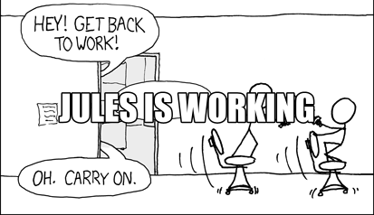

> *Nota da autora:* cerca de 90% deste post foi redigido por IA, mas passei um pente fino na revisão e edição para garantir um texto fluido e agradável. Foi engraçado notar como o Jules tinha uma tendência natural de se autoelogiar. Precisei guiá-lo com diversos prompts até chegar a este resultado, embora os ajustes finais tenham sido mais rápidos de fazer manualmente. Você pode conferir todo o histórico de edições no [histórico de commits do PR](https://github.com/danicat/danicat.dev/pull/6). Um detalhe curioso é que ele se recusou terminantemente a traduzir este post para o português (Brasil), alegando não ter habilidades de tradução — mesmo com o blog inteiro tendo sido traduzido com o próprio Jules em uma interação anterior! Acho que ele só não estava no clima mesmo. :)

## Introdução

Recentemente, resolvi renovar a página inicial do meu blog para destacar melhor os conteúdos mais recentes. Como engenheira de backend, mergulhar nas minúcias do frontend não faz parte da minha rotina. Por isso, em vez de codificar tudo manualmente em um domínio que domino menos, convoquei a ajuda do [Jules](https://jules.google), um assistente de programação baseado em IA.

Neste post, detalho toda a nossa jornada iterativa: os acertos, os mal-entendidos (alguns bem cômicos) e os principais aprendizados sobre como colaborar de forma produtiva com IA no desenvolvimento web — sobretudo para cobrir lacunas técnicas.

## O Objetivo: Uma Seção de Post em Destaque

Minha solicitação inicial para o Jules foi bem direta:
> "Change the layout of the main page so that it displays the most recent blog post in highlight instead of it being in the recent posts list. The recent posts should contain all other posts except the most recent one. This behaviour should be seen only on the blog landing page (home). If the user clicks on the Blog menu it should still see all the posts in reverse chronological order, including the most recent one."

O Jules compreendeu o objetivo de imediato e elaborou um plano: explorar a estrutura do Hugo, mapear os templates pertinentes e aplicar as alterações necessárias.

## Destaques das Iterações: O Bom, o Ruim e a IA

Nossa colaboração exigiu algumas rodadas de ajustes para acertar todos os detalhes.

### Iteração 1: Estrutura Inicial — Garantindo a Base
O Jules identificou corretamente os partials do tema Blowfish e estruturou os overrides. A lógica para separar o artigo mais recente dos demais na lista de "Posts Recentes" foi implementada com precisão.

*   **O que funcionou:** Compreensão da arquitetura interna do Hugo, busca dos posts e modificações básicas nos templates. A facilidade do Jules em navegar pelos arquivos do tema e do projeto poupou um tempo precioso nessa etapa inicial.

### Iteração 2: Estilização com Tailwind — A Dança da Tentativa e Erro
Passamos a focar no visual: título, largura do card e dimensões da imagem. Isso demandou uma sequência de prompts para afinar os detalhes estéticos. Por exemplo:

> "Change the featured post title to 'Featured Post'. Adjust its width to be about 80% of the view. The image is too tall/narrow, let's try a 4:3 aspect ratio. That's still not quite right, make it wider/less tall."

Foi aqui que a dinâmica iterativa de trabalhar com o Jules em tarefas visuais se mostrou desafiadora.

*   **A abordagem do Jules:** Modificou arquivos de internacionalização (i18n) para os títulos, testou diferentes classes de largura do Tailwind (como `md:w-4/5`, `md:w-2/3`, `max-w-xl`, `max-w-2xl`) e usou `padding-bottom` para controlar o aspect ratio das imagens.

*   **Desafio e Frustração:** Um obstáculo claro — especialmente para quem tem foco no backend como eu — foi o processo de tentativa e erro ao ajustar o Tailwind por intermédio do agente. Embora o Jules aplicasse as classes que julgava corretas, o resultado visual nem sempre correspondia ao esperado de primeira. Trocar classes do Tailwind nem sempre produzia uma diferença perceptível ou gerava o efeito visual exato. Isso demandou várias rodadas de “tente esta classe”, “não, faça mais estreito/mais largo/mais alto/mais baixo”, o que, apesar de ter chegado a um bom resultado final, foi um pouco cansativo. Ficou evidente o atrito entre mexer no código e não ter feedback visual instantâneo nesse fluxo assíncrono mediado por IA.

*   **Aprendizado:** Ajustar detalhes visuais puramente via texto é a parte menos agradável do processo, pois instruções em linguagem natural frequentemente geram interpretações imprecisas. Ter um feedback descritivo e claro é essencial, mas é preciso aceitar que certo vai-e-vem é inevitável quando você não pode apontar para a tela ou aplicar microajustes em tempo real. Ainda assim, o Jules atendeu pacientemente a cada ajuste, ajudando a suprir minha menor familiaridade com frontend.

### Iteração 3: CSS Customizado vs. Tailwind — Um Breve Desvio
Em dado momento, para ter controle total sobre as dimensões do card, passei o seguinte prompt:

> "jules, instead of trying to use an existing style class, create an unique style class for the featured post card. This style should use relative width and height of 75% of the container..."

*   **Resposta do Jules:** O Jules criou as regras de CSS customizado corretamente e refatorou o partial do card para adotá-las.

*   **Resultado e Aprendizado:** Apesar de ter atendido exatamente ao pedido, o visual resultante parecia destoar do restante do blog, cuja base é fortemente apoiada no Tailwind. O CSS customizado não casou bem com o conjunto, e rapidamente percebi que manter a consistência com o Tailwind era mais vantajoso. Foi uma ótima lição sobre garantir que soluções geradas por IA respeitem a linguagem de design existente e as convenções do projeto. Pedi então para desfazer a abordagem:

> "undo the last change and restore the tailwind style of formatting. apply the same style guidelines using tailwind best practices"

### Iteração 4: O Grande Mal-Entendido dos "Comentários"!
Esta foi, sem dúvida, a parte mais reveladora da interação entre humanos e IA. Enviei a seguinte mensagem:

> "the comments are rendering in the featured post. please remove all the comments or make them invisible"

*   **Interpretação do Jules:** O Jules presumiu que eu me referia ao *sistema de comentários dos leitores* (como Utterances ou Giscus) ou a contadores de visualizações/curtidas. Ele iniciou uma sequência de passos investigando e ocultando condicionalmente as métricas de visualização.
*   **Meu Esclarecimento:** Ao perceber o desvio, esclareci com exemplos:
    > "you are wrong, I never said I wanted to remove the views and likes - I'm referring to the code comments in rendering as {/* Adjusted padding ... */} and {/* Removed prose classes ... */}"
*   **Resolução:** Quando o Jules entendeu que se tratava de *comentários de código literais do template Go/HTML* mal formatados (usando a sintaxe `{/*...*/}`, que não é um comentário válido de Hugo e por isso era impressa como texto na tela, em vez de `{{/* ... */}}`), a correção foi imediata: remover os trechos indevidos dos templates.
*   **O que funcionou:** A persistência e o método sistemático do Jules para investigar e depurar o problema (mesmo tendo partido de uma premissa errada) foram impressionantes.
*   **Desafio e Aprendizado:** O episódio evidenciou um ponto fundamental: a ambiguidade da linguagem natural. A palavra "comentários" tem múltiplos significados no contexto web. Minha instrução inicial não havia sido específica o suficiente.

### Iteração 5: Polimento Final
Com os comentários removidos da renderização, fizemos os últimos retoques:

> "Remove the 'Featured Post' title. Change card width to 50%. Increase title and summary font sizes. Make the image's aspect ratio 16:9."

Isso definiu o formato final da largura do card, tamanhos de fonte e proporção da imagem. A porcentagem de largura em si não surtiu efeito direto, mas ajustar o aspect ratio resolveu a apresentação.

### Iteração Bônus: O Jules Rascunha Este Post

> "This is perfect. No more code changes are needed. Now I want you to create a new blog post entry describing the iteration we just did..."

E chegamos aqui! O rascunho inicial deste artigo foi montado pelo próprio Jules com base no histórico das nossas interações e nas minhas orientações de refinamento — incluindo as reflexões que você acabou de ler.

## O Que Funcionou Muito Bem com o Jules

*   **Ponte para Lacunas Técnicas:** Como engenheira de backend, o suporte do Jules foi fundamental para encarar tarefas de frontend envolvendo templates do Hugo e classes do Tailwind CSS — áreas que não compõem meu dia a dia. Ele compensou a falta de conhecimento especializado nessas ferramentas, propondo e implementando soluções que coube a mim apenas direcionar e refinar.
*   **Velocidade de Execução:** Para alterações bem delineadas, o Jules modifica código, cria arquivos e reorganiza estruturas muito mais rápido do que qualquer digitação manual.
*   **Processamento de Instruções Complexas:** De forma geral, o assistente lidou muito bem com requisições em múltiplas etapas e requisitos complexos de layout.
*   **Resolução Sistemática de Problemas:** Mesmo diante de mal-entendidos, o agente seguiu uma linha de raciocínio estruturada e transparente.
*   **Iteração Flexível:** O Jules se manteve receptivo e adaptável a cada novo feedback enviado.

## Desafios e Aprendizados

*   **Precisão na Comunicação:** O episódio dos "comentários" comprova a importância de ser cirúrgica nos prompts. Atalhos de linguagem ou termos ambíguos que parecem óbvios para um desenvolvedor podem confundir o modelo com facilidade.
*   **Loop de Feedback Visual no Tailwind:** O ajuste visual no Tailwind foi o maior gargalo. Como o Jules não “enxerga” a renderização, explicar o aspecto visual desejado ou por que determinado conjunto de classes não funcionou exige paciência e descrições detalhadas. É uma limitação natural de interfaces puramente textuais para tarefas visuais.
*   **Interpretações Incorretas e Correção de Rota:** Quando o Jules tomava uma direção errada, ele a executava com afinco até o fim. Como não havia como interromper o fluxo no meio do caminho, era preciso aguardar a conclusão de toda a sequência para então passar o feedback corretivo.
*   **Ritmo do Fluxo Assíncrono:** O modelo opera quase sempre de forma assíncrona. Cada prompt e execução do Jules podia levar de alguns minutos até cerca de meia hora em fluxos mais complexos. Isso torna o ciclo de iteração mais compassado do que programar localmente com hot-reload ou fazer pair programming ao vivo.

## Recursos Úteis

Para quem quiser se aprofundar no Jules:

*   [Site oficial do Jules](https://jules.google)
*   [Documentação do Jules](https://jules.google/docs)

## Conclusão

No saldo geral, trabalhar com o Jules para construir o recurso da home foi uma experiência super produtiva. Teve um gostinho autêntico de "vibe coding" — uma troca dinâmica orientando e refinando o trabalho da IA. O segredo para o sucesso está em manter uma comunicação clara e iterativa, demonstrar paciência diante de mal-entendidos e fornecer feedbacks pontuais e acionáveis.

As pequenas dores de cabeça — em especial as rodadas de ajuste no Tailwind e as eventuais interpretações equivocadas — fazem parte do estado da arte do desenvolvimento assistido por IA hoje. Contudo, mesmo com o fluxo assíncrono e o tempo de espera nas gerações, delegar a parte mecânica da programação e receber sugestões para áreas fora da minha especialidade (como particularidades do Tailwind ou da arquitetura do Hugo) gerou um saldo extremamente positivo. Foi infinitamente mais rápido e prático do que aprender do zero todos os princípios de design, peculiaridades do Hugo e detalhes do Tailwind apenas para entregar essa funcionalidade.

Assistentes como o Jules são ferramentas poderosas. Eles não substituem o julgamento crítico nem a intenção arquitetural de quem desenvolve, mas atuam como aceleradores extraordinários quando combinados com a mentalidade e as práticas de comunicação corretas.