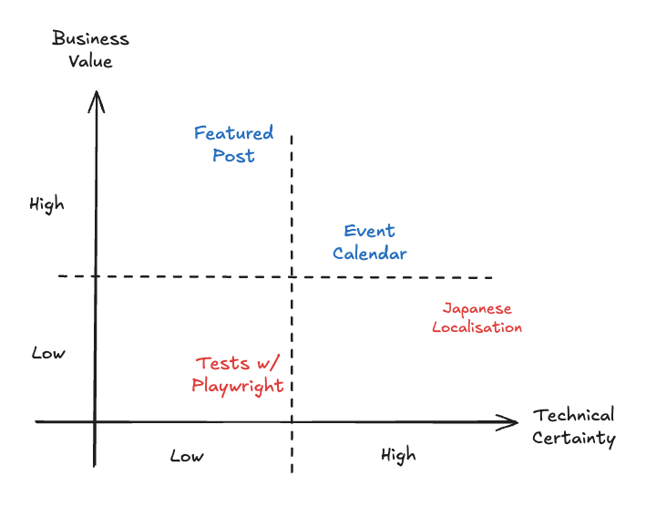
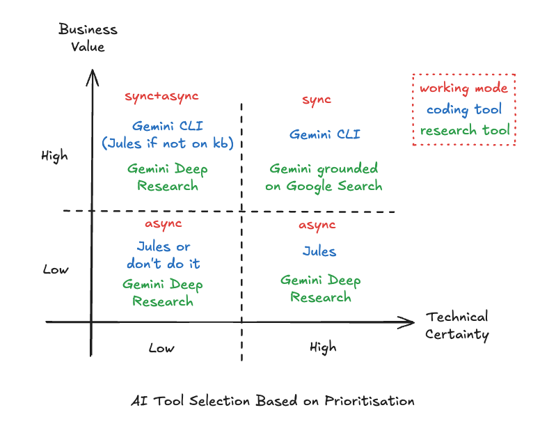

## Introduction

I'm just coming back from the WeAreDevelopers World Congress 2025 in Berlin and I'm inspired by the many developers I've met from all over Europe and the rest of the world. Of course, the main theme this year was AI - AI is everywhere! Now we have AI in our cloud, in our computer, in our sunglasses, in our toaster, in our kitchen sink and in our toilet rolls. No one can escape from AI... not even JS frameworks can grow faster than AI! We are DOOMED!!! >.<

Or maybe not! I know that we are living some scary times. The tech industry is shifting. Companies are laying off people to the left and right using the premise that AI is making people more productive or even replacing people altogether. Whether this is the real reason for the layoffs, or AI is just a scapegoat for a hidden agenda, this is a conversation for the pub and not for this blog post, but let's just acknowledge that changes are happening.

One important life lesson I've learned with time and experience is that you should not care about the things you cannot control. AI is inevitable, so instead of worrying about what will happen with our jobs in the future, I would like to invite you for a reflection on what AI can actually do to improve your job today. This is the famous glass half full approach: let's transform a crisis in opportunity. So let's drop the guard for a moment and imagine what the workflow of the modern developer should look like by incorporating the "vibe" in our process.

This is actually a workflow I've been applying for the past four weeks that have been working very well, but of course, take it with a grain of salt as it is not perfect yet. That said, this scene is evolving every day and I believe it will only get better.

## A two dimensional approach to prioritisation

Before we get into the actual "AI-native" ways of working let me give you a quick peek at a prioritisation model I've been using for the past 7+ years of my career. This is a method I've learned while working at ThoughtWorks in Agile transformation projects and then adapted to suit my own needs. It involves gathering the relevant people together in a room for a discussion - including both engineers and stakeholders - and producing a logical sequence for the backlog to be executed.

It is based on two orthogonal principles: `technical certainty` and `business value`.

Technical certainty is how clear is the implementation path for a feature. If technical certainty is high, it means all (or almost all) steps to implement the feature are known. If technical certainty is low, it means we don't know how to implement the feature, or we might know only a few initial steps.

Business value is how important this feature is to achieve the goals of the team. High business value implies that the feature is critical for the business success, and low business value is likely to be a "nice to have" kind of feature.

The ultimate goal of this exercise is to break those impasses where **everything** is deemed important. Even if everything **is** important, putting them side by side will help even the most rigid stakeholder to rethink their position relatively to other priorities. Also, things of equal value but different technical certainties also have an order of execution - picking the "low hanging fruit" first often buys the team time to spike and reduce the uncertainty (increasing the technical certainty) of the remaining features.

How does this process relate to AI-native work? I like to think of myself as being the boss of many AIs. I'm prioritising my own backlog and organising which tool I'm going to use for each task. If I am "invested" in a feature, I'll prioritise working with it in a synchronous manner, but if not, I can delegate it to an async worker.

## A basic "AI-native" workflow

Let's say I need to implement a new feature for my system. I have two main modes of operation - interactive and batch (a.k.a. "fire-and-forget") modes. Whether I am going to choose one or the other is highly dependent on the `technical certainty` I have on how to implement the given feature and how invested I am in it at the moment (`business value`).

For example, in this very blog I wrote last time how I implemented the "featured post" in the home page. When I started working on it, I knew nothing about how to implement a featured post, but I had an idea of what I wanted to achieve. This is a problem with low technical certainty, because I didn't know which technology to use nor the exact places in code I had to change. At the same time, it had a high business value for me, because my hypothesis is that it would make the blog much more professional and attractive to the readers.

Given that, the natural choice would be to have a short feedback loop, so that for every change the AI proposes I can see the results immediately and guide them to the right direction. On the other hand, for things that are lower priority, I'm ok with having a long feedback loop, and so they are more suitable for batch mode.

## Low/Mid Technical Certainty OR High Business Value = Interactive Mode (Sync)

Problems with lower technical certainty require more supervision to get things done the right way, so I prefer to use an interactive process with a CLI tool. My current tool of choice is [Gemini CLI](https://cloud.google.com/gemini/docs/codeassist/gemini-cli?utm_campaign=CDR_0x72884f69_default_b431747616&utm_medium=external&utm_source=blog), which was released by Google only two weeks ago and it is already taking the development world by storm.

Gemini CLI is an AI-enabled REPL (Repeat Eval Print Loop) kind of command line application. You type a prompt and the CLI will react with a response, which can be not only code and text, but basically anything due to its support for the Model Context Protocol (MCP). Thanks to that you can use the CLI for basically anything, from buying coffee to updating your databases. Of course, the natural use case of the CLI is coding, but you know, people. :)

Although the Gemini CLI has an YOLO mode that is designed for automation, honestly I don't trust it well enough to do things without supervision (more on this later), so I prefer to use the CLI when I need to brainstorm and explore the problem space before coming up with a solution. I might ask it to plan a feature for me, to research implementation options or even to implement straight away - only to discard the implementation and redo it again with a clean state based on the learnings from the initial implementation - a.k.a. "prototyping".

It takes a few tries for me to get the prompt right, in the same way it might take you a few tries to prototype something in a satisfying way coding it manually. The main difference is that instead of taking one week per prototype, I usually spend 30 minutes to one hour. In one day I can cover 3 to 4 different implementations of my problem and by the end of the day I'll be ready to commit to one, with lots of data to make an informed decision.

The main reason to use the CLI for low technical certainty problems is that the feedback loop closes almost immediately. You test your hypothesis, fix any rough edges and iterate. The only lag will be the time for the model to process your request.

## High Technical Certainty AND Low/Mid Business Value = Batch Mode (Async)

A high technical certainty problem, as said above, is the one where you already know all (or almost all) the steps required to implement it. This makes your life much easier, because if you already know the steps, instead of doing them yourself you can simply instruct the AI to do it for you.

Here would be one case for using the Gemini CLI in YOLO mode, but we actually have a better tool for that called [Jules](https://jules.google/). Jules was launched by Google during I/O earlier this year, and quickly became my favourite tool ever (Gemini CLI comes as a close second).

Jules is an assynchronous agent that you can connect to GitHub to perform tasks in the background. I confess that when I initially discovered Jules I didn't pay enough attention to the fine print and was slightly annoyed how slow it was, but only after a while I realised that the whole point is to put a task to be done in the background so you can disconnect and move on with your life.

Because Jules is connected to GitHub, it already has the full context of your project so you can ask it to perform maintenance tasks like "upgrade the version of my dependencies" or "implement unit tests", or even "fix this particular bug". The important note is that because the feedback loop is long - you will not get the result immediately - it is better to reserve this tool for tasks that you have clarity of what to do step by step.

## High Technical Certainty AND High Business Value = Interactive Mode (Sync)

You might have noticed that based on the categories above I singled out that high technical certainty with high business value is always synchronous. The only reason for that is because I care a lot about this result (high business value) so I want to oversee it personally and want to make sure it is ready as fast as possible. For me it is a natural thing because business value will always trump technical certainty if those parameters have the same level.

## Low Technical Certainty AND Low Business Value = Should I really do this?

These are the ones that usually get lost in the backlog hell. In pre-AI days I would just forget them, but in an AI enabled world if I stumble upon them I would just fire a Jules task to explore some possibilities in the hope of reducing uncertainty and/or increasing the business value. Since the cognitive cost is low, you have literally nothing to lose by firing a Jules task even with the simplest prompt you can think off. The result might not be great, but you would not do it anyway so anything good that comes out of it is a benefit.

## Exceptions

Of course, no good process would be complete without some exceptions. There are cases when I delegate a high business value task to Jules, and that is usually when I wouldn't be able to do it otherwise. For example:
1. I'm at an event and cannot get my hands on keyboard to implement a new idea, but I do have my smartphone with me
2. I'm traveling with patchy or slow internet
3. I'm stuck at the supermarket queue and remembered of something I forgot to do and want to get it kickstarted for when I'm back home

In summary - if my options are making zero progress or firing up Jules, I will fire up Jules to do some work for me.

On the other hand, I did not cover so far where the traditional IDEs get into my workflow. It doesn't mean I abandoned them, as in fact I'm currently writing this blog post on VS Code. I reserve IDE / manual editing for the last mile or final polish of my code. Just be VERY careful with minor edits in the middle of a "vibe coding" session as they tend to throw the LLMs off the rails pretty quickly. But if this is the last thing you do, you are pretty much safe.

## Bonus: A note about reducing uncertainty

Sometimes you just need to explore a topic, but are not even sure how to integrate with your code base yet. While you can try to force Gemini CLI or Jules to do non-coding tasks, it feels like using a hammer to fix a screw to the wall. In this case, when I need to do pure research, I prefer using [Gemini Deep Research](https://gemini.google/overview/deep-research/?hl=en-GB) instead. Just like Jules, Gemini Deep Research is async so you can just trigger a research in the background and get on with your day.

If you have your hands on the keyboard and don't want to wait, using the regular Gemini with grounding on Google Search can also do wonders. Both have the tendency to produce slightly verbose outputs, so if you have little patience (like me), a way to make things even better is to take whatever research output you got and put it into [NotebookLM](https://notebooklm.google/) and ask it to summarise and/or produce a podcast for you so you can listen on the go.

## Conclusions

The whole AI tool selection process and working model based on the prioritisation exercise can be summarised as:

1. High Technical Certainty + High Business Value = sync process or pair programming with Gemini CLI. Use Gemini grounded on search for minor clarifications.
1. Low/Mid Technical Certainty + High Business Value = sync process with Gemini CLI plus async research to increase technical certainty.
1. High Technical Certainty + Low/Mid Business Value = async process with Jules. Deep research if necessary.
1. Low Technical Certainty + Low Business Value = most of the cases don't do it, but if you really want to use Jules or deep research to increase one of the parameters.

What do you think about this process? Please leave your comments below.