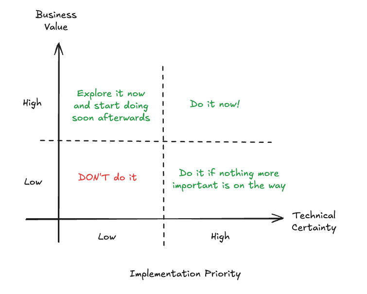
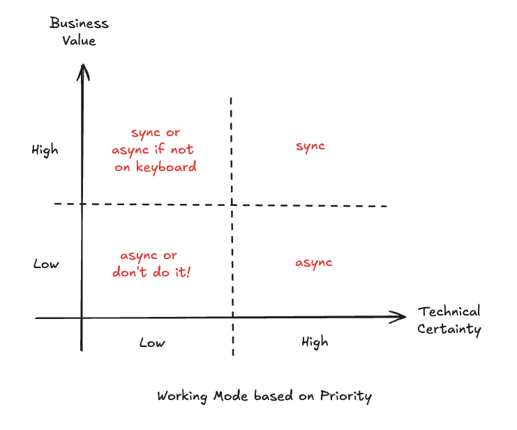
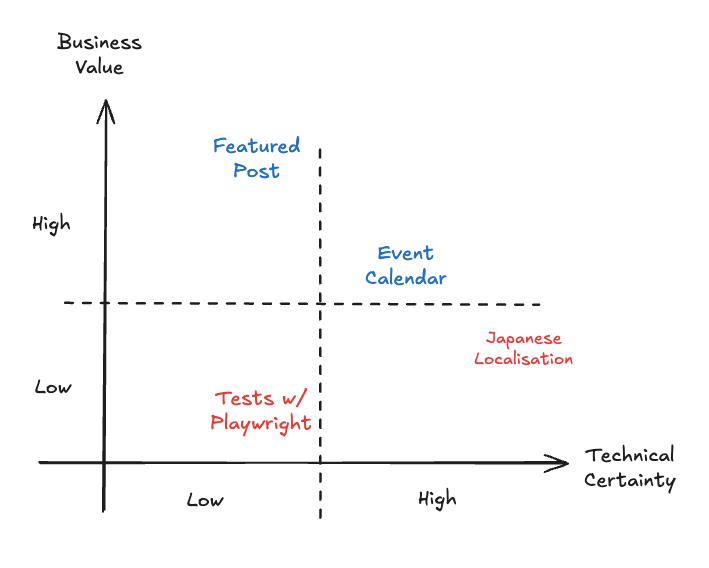
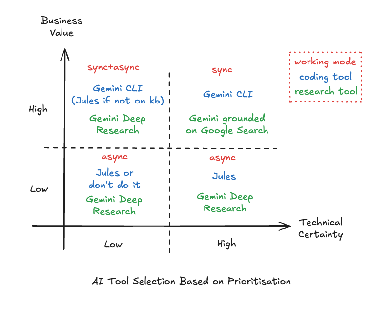


## Introdução

Estou voltando do WeAreDevelopers World Congress 2025 em Berlim e estou inspirada pelos muitos desenvolvedores que conheci de toda a Europa e do resto do mundo. Claro, o tema principal deste ano foi IA - IA está em toda parte! Agora temos IA em nossa nuvem, em nosso computador, em nossos óculos de sol, em nossa torradeira, em nossa pia de cozinha e em nossos rolos de papel higiênico. Ninguém pode escapar da IA... nem mesmo os frameworks JS conseguem crescer mais rápido que a IA! Estamos CONDENADOS!!! >.<

Ou talvez não! Eu sei que estamos vivendo tempos assustadores. A indústria de tecnologia está mudando. As empresas estão demitindo pessoas a torto e a direito usando a premissa de que a IA está tornando as pessoas mais produtivas ou até mesmo substituindo pessoas. Se este é o motivo real das demissões, ou se a IA é apenas um bode expiatório para uma agenda oculta, esta é uma conversa para o bar e não para este post de blog, mas vamos apenas reconhecer que as mudanças estão acontecendo.

Uma importante lição de vida que aprendi com o tempo e a experiência é que você não deve se preocupar com as coisas que não pode controlar. A IA é inevitável, então, em vez de me preocupar com o que acontecerá com nossos empregos no futuro, gostaria de convidá-lo para uma reflexão sobre o que a IA pode realmente fazer para melhorar seu trabalho hoje. Esta é a famosa abordagem do copo meio cheio: vamos transformar uma crise em oportunidade. Então, vamos baixar a guarda por um momento e imaginar como o fluxo de trabalho do desenvolvedor moderno deveria ser, incorporando a "vibe" em nosso processo.

Este é, na verdade, um fluxo de trabalho que venho aplicando nas últimas quatro semanas e que tem funcionado muito bem, mas, claro, leve-o com um grão de sal, pois ainda não é perfeito. Dito isso, este cenário está evoluindo a cada dia e acredito que só vai melhorar.

## Uma abordagem bidimensional para priorização

Antes de entrarmos nos modos de trabalho "nativos de IA", deixe-me dar uma rápida olhada em um modelo de priorização que venho usando nos últimos 7+ anos de minha carreira. Este é um método que aprendi enquanto trabalhava na ThoughtWorks em projetos de transformação ágil e depois adaptei para atender às minhas próprias necessidades. Envolve reunir as pessoas relevantes em uma sala para uma discussão - incluindo engenheiros e partes interessadas - e produzir uma sequência lógica para o backlog a ser executado.

É baseado em dois princípios ortogonais: `certeza técnica` e `valor de negócio`.

Certeza técnica é o quão claro é o caminho de implementação de um recurso. Se a certeza técnica for alta, significa que todas (ou quase todas) as etapas para implementar o recurso são conhecidas. Se a certeza técnica for baixa, significa que não sabemos como implementar o recurso, ou podemos saber apenas algumas etapas iniciais.

Valor de negócio é o quão importante este recurso é para atingir os objetivos da equipe. Alto valor de negócio implica que o recurso é crítico para o sucesso do negócio, e baixo valor de negócio provavelmente será um recurso do tipo "bom ter".

O objetivo final deste exercício é quebrar aqueles impasses onde **tudo** é considerado importante. Mesmo que tudo **seja** importante, colocá-los lado a lado ajudará até mesmo a parte interessada mais rígida a repensar sua posição em relação a outras prioridades. Além disso, coisas de igual valor, mas com diferentes certezas técnicas, também têm uma ordem de execução - escolher a "fruta mais baixa" primeiro muitas vezes compra tempo para a equipe para investigar e reduzir a incerteza (aumentando a certeza técnica) dos recursos restantes.

Como esse processo se relaciona com o trabalho nativo de IA? Gosto de pensar em mim como o chefe de muitas IAs. Estou priorizando meu próprio backlog e organizando qual ferramenta vou usar para cada tarefa. Se estou "investido" em um recurso, priorizarei o trabalho com ele de forma síncrona, mas se não, posso delegá-lo a um trabalhador assíncrono.

## Um fluxo de trabalho básico "nativo de IA"

Digamos que eu precise implementar um novo recurso para o meu sistema. Tenho dois modos principais de operação - interativo e em lote (também conhecido como "dispare e esqueça"). Se vou escolher um ou outro depende muito da `certeza técnica` que tenho sobre como implementar o recurso em questão e o quão investido estou nele no momento (`valor de negócio`).

Por exemplo, neste mesmo blog, escrevi da última vez como implementei o "post em destaque" na página inicial. Quando comecei a trabalhar nisso, não sabia nada sobre como implementar um post em destaque, mas tinha uma ideia do que queria alcançar. Este é um problema com baixa certeza técnica, porque eu não sabia qual tecnologia usar nem os lugares exatos no código que eu tinha que mudar. Ao mesmo tempo, tinha um alto valor de negócio para mim, porque minha hipótese é que tornaria o blog muito mais profissional e atraente para os leitores.

Diante disso, a escolha natural seria ter um ciclo de feedback curto, para que a cada mudança que a IA propusesse eu pudesse ver os resultados imediatamente e guiá-los na direção certa. Por outro lado, para coisas de menor prioridade, estou bem em ter um ciclo de feedback longo e, portanto, são mais adequadas para o modo em lote.

## Certeza Técnica Baixa/Média OU Alto Valor de Negócio = Modo Interativo (Síncrono)

Problemas com menor certeza técnica exigem mais supervisão para fazer as coisas da maneira certa, então prefiro usar um processo interativo com uma ferramenta de CLI. Minha ferramenta de escolha atual é o [Gemini CLI](https://cloud.google.com/gemini/docs/codeassist/gemini-cli?utm_campaign=CDR_0x72884f69_default_b431747616&utm_medium=external&utm_source=blog), que foi lançado pelo Google há apenas duas semanas e já está conquistando o mundo do desenvolvimento.

O Gemini CLI é um aplicativo de linha de comando do tipo REPL (Repeat Eval Print Loop) habilitado para IA. Você digita um prompt e a CLI reagirá com uma resposta, que pode ser não apenas código e texto, mas basicamente qualquer coisa devido ao seu suporte ao Model Context Protocol (MCP). Graças a isso, você pode usar a CLI para basicamente qualquer coisa, desde comprar café até atualizar seus bancos de dados. Claro, o caso de uso natural da CLI é a codificação, mas você sabe, pessoas. :)

Embora o Gemini CLI tenha um modo YOLO projetado para automação, honestamente não confio nele o suficiente para fazer as coisas sem supervisão (mais sobre isso depois), então prefiro usar a CLI quando preciso fazer um brainstorming e explorar o espaço do problema antes de chegar a uma solução. Posso pedir para planejar um recurso para mim, pesquisar opções de implementação ou até mesmo implementar imediatamente - apenas para descartar a implementação e refazê-la novamente com um estado limpo com base nos aprendizados da implementação inicial - também conhecido como "prototipagem".

Leva algumas tentativas para eu acertar o prompt, da mesma forma que pode levar algumas tentativas para você prototipar algo de maneira satisfatória codificando-o manualmente. A principal diferença é que, em vez de levar uma semana por protótipo, geralmente gasto de 30 minutos a uma hora. Em um dia, posso cobrir de 3 a 4 implementações diferentes do meu problema e, no final do dia, estarei pronto para me comprometer com uma, com muitos dados para tomar uma decisão informada.

A principal razão para usar a CLI para problemas de baixa certeza técnica é que o ciclo de feedback se fecha quase que imediatamente. Você testa sua hipótese, corrige quaisquer arestas e itera. O único atraso será o tempo para o modelo processar sua solicitação.

## Alta Certeza Técnica E Baixo/Médio Valor de Negócio = Modo em Lote (Assíncrono)

Um problema de alta certeza técnica, como dito acima, é aquele em que você já conhece todas (ou quase todas) as etapas necessárias para implementá-lo. Isso torna sua vida muito mais fácil, porque se você já conhece as etapas, em vez de fazê-las você mesmo, pode simplesmente instruir a IA a fazer isso por você.

Aqui seria um caso para usar o Gemini CLI no modo YOLO, mas na verdade temos uma ferramenta melhor para isso chamada [Jules](https://jules.google/). O Jules foi lançado pelo Google durante o I/O no início deste ano e rapidamente se tornou minha ferramenta favorita (o Gemini CLI vem em um segundo lugar).

Jules é um agente assíncrono que você pode conectar ao GitHub para executar tarefas em segundo plano. Confesso que quando descobri o Jules inicialmente, não prestei atenção suficiente nas letras miúdas e fiquei um pouco irritado com a lentidão, mas só depois de um tempo percebi que o objetivo é colocar uma tarefa para ser feita em segundo plano para que você possa se desconectar e seguir com sua vida.

Como o Jules está conectado ao GitHub, ele já tem o contexto completo do seu projeto para que você possa pedir para ele executar tarefas de manutenção como "atualizar a versão das minhas dependências" ou "implementar testes de unidade", ou até mesmo "corrigir este bug em particular". A nota importante é que, como o ciclo de feedback é longo - você não obterá o resultado imediatamente - é melhor reservar esta ferramenta para tarefas em que você tenha clareza do que fazer passo a passo.

## Alta Certeza Técnica E Alto Valor de Negócio = Modo Interativo (Síncrono)

Você deve ter notado que, com base nas categorias acima, destaquei que alta certeza técnica com alto valor de negócio é sempre síncrona. A única razão para isso é porque me importo muito com este resultado (alto valor de negócio), então quero supervisioná-lo pessoalmente e quero ter certeza de que está pronto o mais rápido possível. Para mim, é uma coisa natural, porque o valor do negócio sempre superará a certeza técnica se esses parâmetros tiverem o mesmo nível.

## Baixa Certeza Técnica E Baixo Valor de Negócio = Devo realmente fazer isso?

Estes são os que geralmente se perdem no inferno do backlog. Nos dias pré-IA, eu simplesmente os esqueceria, mas em um mundo habilitado para IA, se eu me deparar com eles, eu simplesmente dispararia uma tarefa do Jules para explorar algumas possibilidades na esperança de reduzir a incerteza e/ou aumentar o valor do negócio. Como o custo cognitivo é baixo, você literalmente não tem nada a perder ao disparar uma tarefa do Jules, mesmo com o prompt mais simples que você possa imaginar. O resultado pode não ser ótimo, mas você não o faria de qualquer maneira, então qualquer coisa boa que saia disso é um benefício.

## Exceções

Claro, nenhum bom processo estaria completo sem algumas exceções. Há casos em que delego uma tarefa de alto valor de negócio para o Jules, e isso geralmente ocorre quando eu não conseguiria fazê-lo de outra forma. Por exemplo:
1. Estou em um evento e não consigo colocar as mãos no teclado para implementar uma nova ideia, mas tenho meu smartphone comigo
2. Estou viajando com internet irregular ou lenta
3. Estou preso na fila do supermercado e lembrei de algo que esqueci de fazer e quero dar o pontapé inicial para quando eu voltar para casa

Em resumo - se minhas opções são não fazer nenhum progresso ou disparar o Jules, eu vou disparar o Jules para fazer algum trabalho por mim.

Por outro lado, não abordei até agora onde os IDEs tradicionais entram no meu fluxo de trabalho. Isso não significa que eu os abandonei, pois na verdade estou escrevendo este post de blog no VS Code. Eu reservo a edição manual/IDE para a última milha ou polimento final do meu código. Apenas tenha MUITO cuidado com pequenas edições no meio de uma sessão de "vibe coding", pois elas tendem a desviar os LLMs dos trilhos rapidamente. Mas se esta é a última coisa que você faz, você está praticamente seguro.

## Bônus: Uma nota sobre a redução da incerteza

Às vezes, você só precisa explorar um tópico, mas ainda não tem certeza de como integrá-lo à sua base de código. Embora você possa tentar forçar o Gemini CLI ou o Jules a fazer tarefas que não sejam de codificação, parece que está usando um martelo para fixar um parafuso na parede. Nesse caso, quando preciso fazer uma pesquisa pura, prefiro usar o [Gemini Deep Research](https://gemini.google/overview/deep-research/?hl=en-GB) em vez disso. Assim como o Jules, o Gemini Deep Research é assíncrono, então você pode simplesmente acionar uma pesquisa em segundo plano e continuar com o seu dia.

Se você estiver com as mãos no teclado e não quiser esperar, usar o Gemini regular com base na Pesquisa Google também pode fazer maravilhas. Ambos têm a tendência de produzir saídas um pouco verbosas, então se você tem pouca paciência (como eu), uma maneira de tornar as coisas ainda melhores é pegar qualquer resultado de pesquisa que você obteve e colocá-lo no [NotebookLM](https://notebooklm.google/) e pedir para ele resumir e/ou produzir um podcast para você para que você possa ouvir em qualquer lugar.

## Conclusões

Todo o processo de seleção de ferramentas de IA e modelo de trabalho com base no exercício de priorização pode ser resumido como:

1. Alta Certeza Técnica + Alto Valor de Negócio = processo síncrono ou programação em par com o Gemini CLI. Use o Gemini com base na pesquisa para pequenos esclarecimentos.
1. Baixa/Média Certeza Técnica + Alto Valor de Negócio = processo síncrono com o Gemini CLI mais pesquisa assíncrona para aumentar a certeza técnica.
1. Alta Certeza Técnica + Baixo/Médio Valor de Negócio = processo assíncrono com o Jules. Pesquisa aprofundada, se necessário.
1. Baixa Certeza Técnica + Baixo Valor de Negócio = na maioria dos casos, não o faça, mas se você realmente quiser, use o Jules или a pesquisa aprofundada para aumentar um dos parâmetros.

O que você acha deste processo? Por favor, deixe seus comentários abaixo.
