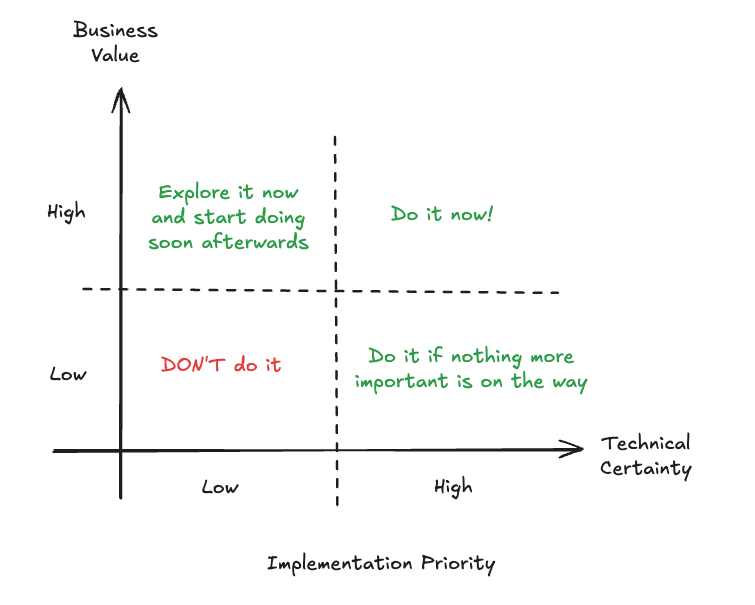
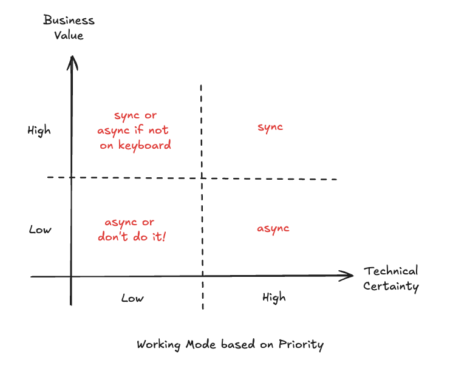
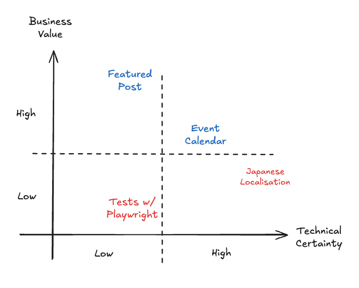
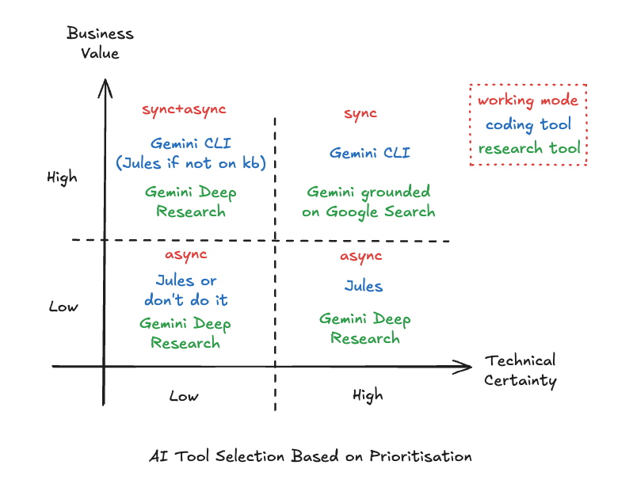

## Introdução

Acabei de voltar do WeAreDevelopers World Congress 2025 em Berlim e voltei inspirada pelas inúmeras pessoas desenvolvedoras que conheci de toda a Europa e do mundo. Como esperado, o grande tema deste ano foi IA — e ela está em todo lugar! Temos IA na nuvem, no computador, nos óculos de sol, na torradeira, na pia da cozinha e até no rolo de papel higiênico. Ninguém consegue escapar da IA… nem mesmo os frameworks JavaScript conseguem surgir mais rápido que ela! Estamos CONDENADOS!!! >.<

Ou talvez não! Eu sei que estamos atravessando tempos de incerteza. A indústria de tecnologia está em transformação. Empresas estão demitindo a torto e a direito sob o argumento de que a IA torna as equipes mais produtivas ou até substitui pessoas por completo. Se essa é a causa real ou se a IA serve apenas de bode expiatório para outros interesses, essa é uma conversa para a mesa de bar e não para este post. Mas o fato inegável é: as mudanças estão acontecendo.

Uma lição de vida valiosa que aprendi ao longo da carreira é: não gaste energia com o que você não pode controlar. A IA é um caminho sem volta. Portanto, em vez de nos angustiarmos com o que será do mercado no futuro, convido você a refletir sobre como a IA pode melhorar o seu dia a dia de trabalho hoje. É a clássica visão do copo meio cheio: transformar momentos de crise em oportunidade. Vamos baixar a guarda por um instante e desenhar como pode ser o fluxo de trabalho de quem desenvolve software ao incorporar o "vibe coding" à rotina.

Este é exatamente o fluxo de trabalho que venho aplicando nas últimas quatro semanas com ótimos resultados. Claro, veja isso como um relato empírico, pois o processo não é perfeito e está em constante evolução. Ainda assim, o ecossistema avança diariamente e a tendência é só melhorar.

## Uma abordagem bidimensional de priorização

Antes de mergulhar nas práticas "AI-native", quero apresentar brevemente um modelo de priorização que utilizo há mais de 7 anos na minha trajetória. Aprendi essa abordagem trabalhando na ThoughtWorks em projetos de transformação ágil e a adaptei para a minha realidade. O método consiste em reunir os papéis relevantes na mesma sala — engenharia e pessoas de produto/negócio — para estruturar uma sequência lógica de execução do backlog.

A matriz se baseia em dois eixos ortogonais: `certeza técnica` e `valor de negócio`.

A **certeza técnica** mede o quanto o caminho de implementação de uma funcionalidade já está claro. Se a certeza técnica é alta, conhecemos todos (ou quase todos) os passos necessários para implementar. Se for baixa, não sabemos como resolver o problema ou temos apenas algumas hipóteses iniciais.

O **valor de negócio** indica o grau de relevância daquela entrega para os objetivos do time. Alto valor de negócio significa que a feature é essencial para o sucesso do produto; baixo valor indica algo no nível de um "nice to have".

A grande meta dessa dinâmica é destravar impasses em que **tudo** parece urgente e prioritário. Mesmo quando tudo é importante, colocar os itens lado a lado ajuda até as lideranças mais resistentes a repensar prioridades relativas. Além disso, itens de mesmo valor mas com certezas técnicas distintas ganham uma ordem de execução natural: priorizar os "ganhos rápidos" (*quick wins*) compra tempo para o time investigar e realizar *spikes*, reduzindo incertezas e elevando a certeza técnica dos itens mais complexos.

E como isso se traduz no trabalho com IA? Gosto de me ver como a gestora e orquestradora de várias IAs. Eu priorizo meu próprio backlog e defino qual ferramenta alocar para cada tarefa. Se estou fortemente engajada em uma funcionalidade crítica, atuo de forma interativa e síncrona; se não, delego a execução para um agente assíncrono.

## Um fluxo de trabalho básico "AI-native"

Imagine que eu precise implementar uma nova funcionalidade no sistema. Tenho dois modos principais de operação: **interativo** (síncrono) e **em lote** (assíncrono, no estilo *fire-and-forget*). A decisão entre um e outro depende diretamente da `certeza técnica` sobre a implementação e do meu nível de investimento emocional e estratégico nela (`valor de negócio`).

Um exemplo prático deste próprio blog: no post anterior, contei como implementei o "post em destaque" na home. Quando iniciei o trabalho, eu não sabia como estruturar esse destaque no tema — era um problema de baixa certeza técnica, pois não dominava os templates nem sabia onde alterar no código. Ao mesmo tempo, tinha alto valor de negócio para mim, pois a hipótese era deixar o blog com um acabamento muito mais atraente e profissional para quem lê.

Diante desse cenário, a escolha evidente era um ciclo de feedback curto: para cada alteração sugerida pela IA, eu precisava avaliar o resultado visual imediatamente e corrigir a rota em tempo real. Já para tarefas de prioridade secundária, um ciclo longo não é problema, tornando-as ideais para execução em lote.

## Certeza Técnica Baixa/Média OU Alto Valor de Negócio = Modo Interativo (Síncrono)

Tarefas com menor clareza técnica exigem supervisão contínua para saírem conforme o esperado. Nesses casos, prefiro um processo interativo via linha de comando. Minha ferramenta favorita atual é o [Gemini CLI](https://cloud.google.com/gemini/docs/codeassist/gemini-cli?utm_campaign=CDR_0x72884f69_default_b431747616&utm_medium=external&utm_source=blog), lançado pelo Google recentemente e que já vem conquistando grande tração na comunidade de desenvolvimento.

O Gemini CLI funciona como um REPL (*Read-Eval-Print Loop*) potencializado por IA: você digita um prompt no terminal e ele devolve uma resposta — que pode ser código, texto ou comandos executáveis, especialmente com o suporte ao Model Context Protocol (MCP). Isso permite usar a CLI para quase tudo, desde consultar APIs até automatizar tarefas complexas. O caso de uso nativo é codificar, mas a criatividade não tem limites! :)

Embora o Gemini CLI conte com um modo YOLO desenhado para automação sem confirmações, sinceramente ainda não confio a ponto de deixá-lo rodar sem supervisão em código sensível. Prefiro usá-lo para explorar o problema e fazer *brainstorming*. Posso pedir para planejar uma funcionalidade, comparar caminhos de arquitetura ou até escrever um primeiro esboço — apenas para descartá-lo em seguida e recomeçar do zero, aplicando o que aprendi no protótipo.

Às vezes são necessárias algumas iterações no prompt até calibrar a resposta, da mesma forma que levaria algumas tentativas para prototipar manualmente. A diferença brutal é que, em vez de gastar uma semana por protótipo, resolvo tudo em 30 a 60 minutos. Em um único dia, consigo validar de 3 a 4 abordagens arquiteturais diferentes e chegar ao fim da tarde pronta para escolher a melhor com dados concretos.

O grande trunfo da CLI para problemas de baixa certeza técnica é o ciclo de feedback instantâneo: você testa hipóteses, ajusta arestas e itera rapidamente. O único tempo de espera é o do modelo processar a requisição.

## Certeza Técnica Alta E Valor de Negócio Baixo/Médio = Modo em Lote (Assíncrono)

Quando um problema tem alta certeza técnica, você já sabe de antemão todos (ou quase todos) os passos necessários para executá-lo. Isso simplifica bastante o cenário: em vez de digitar tudo na mão, você pode simplesmente instruir o agente a fazer o trabalho pesado.

Esse seria um caso de uso para o Gemini CLI no modo YOLO, mas temos uma ferramenta ainda mais talhada para isso: o [Jules](https://jules.google/). Lançado pelo Google no I/O deste ano, o Jules rapidamente se tornou minha ferramenta favorita de todas (com o Gemini CLI em um segundo lugar muito próximo).

O Jules é um agente assíncrono que se integra ao GitHub para executar tarefas em background. Confesso que, ao testá-lo inicialmente, não me atentei aos detalhes e fiquei um pouco impaciente com o tempo de resposta. Só depois compreendi que o grande diferencial é justamente disparar a tarefa e ir cuidar de outra coisa enquanto o agente trabalha.

Como o Jules é conectado ao repositório no GitHub, ele tem o contexto completo do projeto. Você pode pedir tarefas de manutenção como “atualize a versão das dependências”, “crie testes unitários para o módulo X” ou “corrija este bug específico”. Como o ciclo de feedback é mais longo e não imediato, o segredo é reservar essa ferramenta para atividades cujos passos estejam muito bem delineados.

## Certeza Técnica Alta E Alto Valor de Negócio = Modo Interativo (Síncrono)

Você deve ter reparado que, na matriz, tarefas de alta certeza técnica e alto valor de negócio foram categorizadas como síncronas. O motivo é simples: por se tratar de algo com alto impacto no negócio, prefiro acompanhar de perto e garantir que a entrega saia com qualidade e o mais rápido possível. Para mim, o valor de negócio sempre tem peso preponderante sobre a certeza técnica quando ambos os parâmetros são elevados.

## Certeza Técnica Baixa E Baixo Valor de Negócio = Vale mesmo a pena fazer?

Essas são as tarefas que costumam definhar no limbo do backlog. No mundo pré-IA, elas seriam sumariamente esquecidas. No contexto atual, porém, se me deparo com uma tarefa assim, costumo disparar uma demanda no Jules para explorar possibilidades e tentar reduzir a incerteza ou alavancar o valor de negócio. Como o custo cognitivo para abrir uma tarefa é mínimo, não há nada a perder com um prompt simples. Mesmo que o resultado não seja perfeito, é algo que eu não faria manualmente de qualquer forma — logo, qualquer progresso é lucro.

## Exceções

Nenhum modelo se sustenta sem suas exceções. Há situações em que delego tarefas de alto valor de negócio para o Jules, principalmente quando não há como realizá-las de outra maneira. Por exemplo:
1. Estou em um evento e não consigo abrir o laptop para implementar uma ideia, mas estou com o celular em mãos
2. Estou viajando com conexão lenta ou instável
3. Estou presa na fila do supermercado, lembro de uma pendência e quero dar o pontapé inicial para quando chegar em casa

Em resumo: se a alternativa for fazer zero progresso, prefiro acionar o Jules para adiantar o trabalho.

E onde entram as IDEs tradicionais nisso tudo? Não significa que as abandonei — inclusive, estou escrevendo este artigo no VS Code neste momento. Reservo a edição manual na IDE para a última milha e o polimento final do código. Apenas tome MUITO cuidado ao fazer edições manuais avulsas no meio de uma sessão de "vibe coding", pois intervenções intermediárias costumam desestabilizar o contexto dos LLMs com facilidade. Se deixar para fazer o ajuste fino ao término da sessão, o processo flui com total segurança.

## Bônus: Uma nota sobre redução de incerteza

Às vezes precisamos explorar um conceito sem ter certeza de como ele se integrará à base de código. Tentar forçar o Gemini CLI ou o Jules para tarefas puramente conceituais é como usar uma marreta para parafusar algo na parede. Para pesquisa pura e aprofundada, prefiro recorrer ao [Gemini Deep Research](https://gemini.google/overview/deep-research/?hl=en-GB). Assim como o Jules, ele roda de forma assíncrona: você dispara a pesquisa em background e segue seu dia.

Se você já estiver diante do teclado e preferir respostas imediatas, o Gemini padrão com grounding na Busca do Google funciona incrivelmente bem. Como ambos costumam gerar relatórios detalhados e um tanto extensos, caso você tenha pouca paciência para longas leituras (como eu), um truque excelente é jogar os resultados no [NotebookLM](https://notebooklm.google/) e gerar um resumo em tópicos ou um podcast em áudio para ouvir no caminho.

## Conclusões

A escolha de ferramentas de IA baseada na matriz de priorização pode ser resumida da seguinte forma:

1. **Alta Certeza Técnica + Alto Valor de Negócio** = processo síncrono ou pair programming com Gemini CLI. Gemini com busca integrada para tirar dúvidas pontuais.
2. **Baixa/Média Certeza Técnica + Alto Valor de Negócio** = processo síncrono com Gemini CLI acompanhado de pesquisa assíncrona para elevar a certeza técnica.
3. **Alta Certeza Técnica + Baixo/Médio Valor de Negócio** = processo assíncrono com o Jules. Deep Research caso necessário.
4. **Baixa Certeza Técnica + Baixo Valor de Negócio** = na maioria dos casos, descarte; se quiser explorar, use o Jules ou Deep Research para aumentar um dos parâmetros.

O que você achou dessa metodologia de trabalho? Compartilhe suas impressões e práticas nos comentários abaixo!
