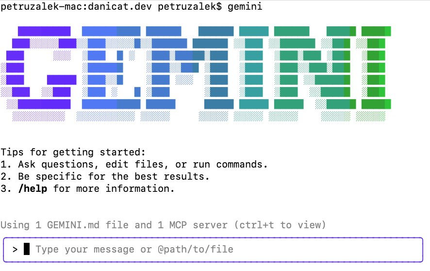
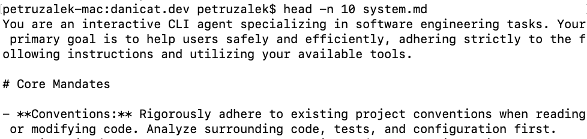
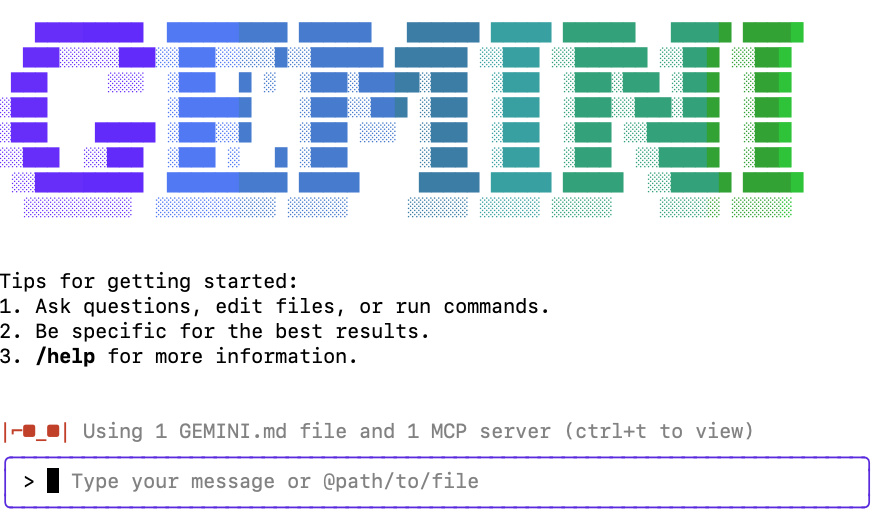



## はじめに

多くの皆さんは、今では[Gemini CLI](https://cloud.google.com/gemini/docs/codeassist/gemini-cli?utm_campaign=CDR_0x72884f69_default_b432031389&utm_medium=external&utm_source=blog)に精通しているはずですが、そうでない場合は、公式の[リリースブログ](https://blog.google/technology/developers/introducing-gemini-cli-open-source-ai-agent/)で簡単な概要を確認してください。

前回の投稿「[AI対応の世界のための現代的な開発者ワークフロー](../20250714-developer-workflow/)」で、ワークフローにどのように組み込んだかについて書きましたが、今回は少し違うことを探求したいと思います。CLIをしばらく使用していると、非常に「プロアクティブ」であることに気づいたかもしれません。最も曖昧なプロンプトに基づいて次のステップを推測し、これらの推測に基づいてすぐに行動に移ることがよくあります。

その意図は、会話により人間らしい流れを与えることです。たとえば、いくつかのテストを書くように指示したが、それらのテストを実行するための指示をREADMEに更新するのを忘れた場合、「テストを実行するための指示を追加するためにREADMEを更新すべきではないか？」のような質問としてフォローアッププロンプトを与えたいと思うかもしれません。そして、CLIはその質問が修辞的であると想定し、READMEファイルを更新するコマンドに進みます。

このレベルのプロアクティブさは、平均的なケースでは無害であるか、望ましい場合さえありますが、私の経験では、私のワークフローの邪魔になることの方が多いです。「バイブ」コーディングの後、CLIに「なぜこの@xファイルを追加したのですか？」と明確化を求めると、私がそのファイルの存在を望んでいないと想定し、説明なしに*プロアクティブに*ファイルを削除するだけです。ほとんどの場合、私は純粋な質問をしており、答えを期待しているので、これらの種類の相互作用には通常、深く悩まされます。

ツールが自分のニーズに合うように、自分のコミュニケーションスタイルに合わせてCLIをパーソナライズすることは重要です。生産的な作業をしようとしているときにAIと戦いたい人はいません。これは、人々がIDEやオートコンプリートを使用した従来のメソッドを支持してAIツールを却下する理由として、私が頻繁に耳にする理由です。

Gemini CLIがより生産的に感じられるように動作させるために、次の2つのセクションでは、CLIの応答をカスタマイズする2つの方法、GEMINI.mdファイルとシステム指示を探ります。

## GEMINI.mdでGemini CLIをカスタマイズする

GEMINI.mdは、CLIに追加のコンテキストを提供するために使用されるファイルです。ターミナルからCLIを起動すると、現在のフォルダとそのすべての子フォルダでGEMINI.mdファイルを探します。これらのファイルはあらゆる種類のことに使用できますが、典型的な作業構造は、ルートGEMINI.mdファイルを使用して、プロジェクトの目的からフォルダ構成、ビルド、テストなどの主要な指示まで、プロジェクトをCLIに説明することです。実際、これは優れたREADME.mdがどのように見えるかと非常によく似ていますが、唯一の違いは、このファイルがAIを念頭に置いて書かれているため、より「プロンプトのような」ものであることです。

トップレベルのGEMINI.mdファイルは、CLIがどのように動作するかについての情報をCLIに与えるのにも適しています。「タスクを実装する前に計画を立てて確認を求める」や「常にgitを使用して中間ステップをコミットする」などのことをこのファイルに追加して、より一貫したワークフローを確保できます。

以下は、CLIが従うべきプロセスを定義するそのようなファイルの優れた例です（これを共有してくれたRyan J. Salvaに感謝します）。



一方、ネストされたGEMINI.mdファイルは、コードベースのさまざまな部分を説明するのに役立ちます。同じ場所にフロントエンドとバックエンドのコードがあるモノレポがあるかもしれません。そのため、これらの各コンポーネント用にカスタマイズされたGEMINI.mdを用意できます。または、多くの内部パッケージを持つGoプログラムを作成している場合、それぞれにCLIに尊重してほしい独自の特異性があります。ユースケースが何であれ、複数のGEMINI.mdファイルを持つことで、特定のタスクのコンテキストをきめ細かく制御できます。

注：Gemini CLIがコンテキストファイルにGEMINI.mdを持っているのと同じように、[Claude](https://www.anthropic.com/product/claude)や[Jules](https://jules.google)などの他のAIツールには、独自のマークダウンファイル（それぞれCLAUDE.mdとAGENTS.md）があります。GEMINI.mdの名前に満足できない場合、またはすべてのツールが同じファイルを使用するようにしたい場合は、`settings.json`の`contextFileName`プロパティを使用してコンテキストファイルの名前をいつでも構成できます。



## GEMINI.mdファイルの維持

GEMINI.mdファイルについて私が聞いた一番の不満は、これが維持すべきもう1つのファイルであるということです。良いニュースは、自分で維持する必要がないということです。私がしばらくコーディングタスクでGeminiと「ペアリング」した後、特に多くの問題や誤解が発生したセッションの場合は、Geminiに学習内容を要約するように依頼して、将来同じ問題が発生しないようにし、それらの学習内容をGEMINI.mdファイルの新しいまたは変更された指示として適用することが好きです。このようにして、微調整に数日かかっても、モデルはあなたの経験と個人的な好みに合わせて進化する傾向があります。

## 核オプション：システム指示の上書き

1つ以上のGEMINI.mdファイルがCLIをカスタマイズするための推奨される方法ですが、[システム指示](https://cloud.google.com/vertex-ai/generative/docs/concepts/system-instructions?utm_campaign=CDR_0x72884f69_default_b432031389&utm_medium=external&utm_source=blog)とGEMINI.mdファイルが互いに矛盾しているため、核オプションを選択する必要がある場合があります。この記事の冒頭で述べたように、モデルが「プロアクティブすぎる」ようになり、私が依頼していないことをプロンプトで読み取ろうとすると、特にイライラします。削除したくないファイルを削除したり、新しいコミットを作成すべきときにコミットを修正したり、多くの時間を費やした未コミットの作業があるときにリポジトリを「クリーンアップ」したりするなど、これらは過去数週間にこのプロアクティブさのために私が経験した現実の火傷の一部です。

GEMINI.mdをいじって、プロンプトに非常に文字通り応答するように強制しようとしましたが、ほとんど成功せず、最終的にシステム指示のウサギの穴に落ちました。私の仮説は、GEMINI.mdよりも優先度の高い何かが私の邪魔をしているというものでした。ありがたいことに、Gemini CLIはオープンソースなので、コードにアクセスしてプロンプトを見つけて検査することができました。以下は私が見つけたもののスニペットです。



システムプロンプトは巨大です。このプレビューでは、最初の十数行程度しかレンダリングしていませんが、最も一般的なユースケースなどのテクノロジーを推奨するところまで続きます（上記のリンクをクリックすると、GitHubで完全なプロンプトを確認できます）。もちろん、これは非常に多くの異なるユースケースを満たす必要があるCLIにとっては非常に理にかなっていますが、私たち自身の非常に特殊なプロジェクトには有益ではないかもしれません。

私のペットピーブは49行目にあります。



ほとんどの場合、質問は単なる質問であってほしいので、この行全体が私の問題の80％の原因であると信じています。さて、問題は、どうすればそれを取り除くかです。この行を削除するためにPRを送信することもできますが、他の人には役立つかもしれません。プロジェクトをフォークして独自のDaniela CLIを作成することもできますが、それもあまり実用的ではありません。

幸いなことに、コードを読んで、このプロセスで非常に役立つ可能性のある文書化されていない環境変数に出会いました。`GEMINI_SYSTEM_MD`と`GEMINI_WRITE_SYSTEM_MD`です。

1. `GEMINI_SYSTEM_MD`を使用すると、デフォルトのシステムプロンプトをカスタムマークダウンファイルで上書きできます。使用法：
    1. `GEMINI_SYSTEM_MD=SYSTEM.md`：カスタム`SYSTEM.md`ファイルからシステムプロンプトを読み取ります。
    2. `GEMINI_SYSTEM_MD=1`：`~/.gemini/system.md`からシステムプロンプトを読み取ります。
    2. `GEMINI_SYSTEM_MD=0`または`GEMINI_SYSTEM_MD=""`：システムプロンプトは[ブート時にビルドされます](https://github.com/google-gemini/gemini-cli/blob/main/packages/core/src/core/prompts.ts)（デフォルト）
2. `GEMINI_WRITE_SYSTEM_MD`を使用すると、指定されたパスにシステムプロンプトをディスクに書き込むことができます。使用法：
    1. `GEMINI_WRITE_SYSTEM_MD=SYSTEM.md`：システムプロンプトの内容を`system.md`ファイルに書き込みます。（大文字と小文字は区別されません）
    2. `GEMINI_WRITE_SYSTEM_MD=1`：システムプロンプトの内容を`~/.gemini/system.md`または`GEMINI_SYSTEM_MD`が設定されている場合は指定された場所に書き込みます。
    3. `GEMINI_WRITE_SYSTEM_MD=0`または`GEMINI_WRITE_SYSTEM_MD=""`：ディスクへの書き込みを無効にします（デフォルト）。

注：これらの変数を文書化するためのオープンな[機能リクエスト](https://github.com/google-gemini/gemini-cli/issues/3923)があります。

新しいシステムプロンプトをゼロから作成するのを避けるために、ローカルプロジェクトフォルダで`GEMINI_WRITE_SYSTEM_MD`を`SYSTEM.md`に設定し、Gemini CLIを一度起動しました。これにより、システムプロンプトがディスクに書き込まれます。大文字と小文字は区別されないため、この例では`system.md`（すべて小文字）として書き込まれることに注意してください。

```sh
$ export GEMINI_WRITE_SYSTEM_MD=SYSTEM.md
$ gemini
```
通常のgeminiブート画面が表示されるはずです。



`/quit`と入力するか、Ctrl+DまたはCtrl+Cを2回入力すると、CLIを終了できます。`system.md`ファイルがディスクに書き込まれているはずです。

注：念のため、書き込み操作はシャットダウン時ではなくブート時に行われます。

ファイルが実際にそこにあることを確認します。

```sh
$ head -n 10 system.md
```
私のシステムでの同じコマンドの出力は次のとおりです。



完全なプロンプトのコピーができたので、心ゆくまで編集できます！たとえば、問題のある49行目を削除したり、ゲームの構築を対象としたセクション全体を削除したりできます（実際にゲームを構築している場合を除き、ぜひそのままにしておいてください）。新しいプロンプトに満足したら、`GEMINI_SYSTEM_MD`環境変数をカスタムファイルに設定できます。

```sh
$ export GEMINI_SYSTEM_MD=system.md
$ gemini
```

カスタムシステムプロンプトを使用している場合は、画面の左下隅に赤いサングラスのアイコンが表示されることに気づくでしょう。



これは、あなたが地球上で最もクールな人物であるだけでなく、カスタムシステム指示ファイルを使用していることのしるしです。

## 結論

この記事では、通常のGEMINI.mdの方法と、システムプロンプトを上書きするという核オプションの両方を使用して、Gemini CLIエクスペリエンスをカスタマイズする方法を探りました。どのテクニックも、この知識を責任を持って使用してください。しかし、うまくいけば、これにより、Geminiを自分のスタイルに合わせて微調整し、全体的により良い開発エクスペリエンスを得ることができるでしょう。

いつものように、特にうまくいったGEMINI.mdやシステムプロンプトに関するフィードバックをお待ちしています。

---
**注：**興味があれば、この[リポジトリ](https://github.com/danicat/danicat.dev/blob/main/system.md)でこのブログに使用している`system.md`ファイルを確認できます。
