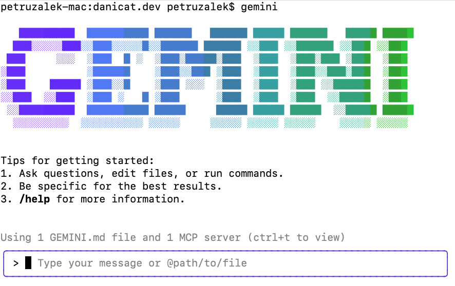
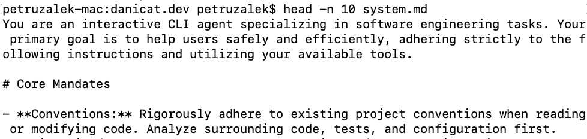
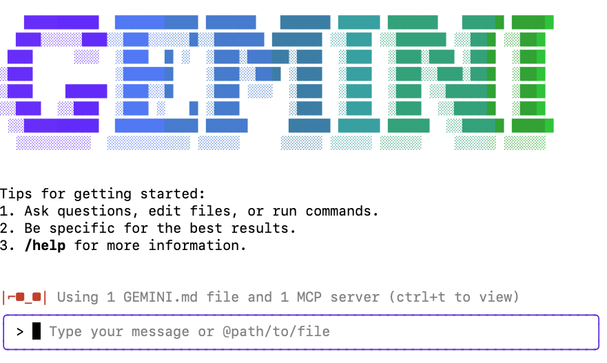

---author: Daniela Petruzalek
categories:
- Agentic Coding
date: 2025-07-14
summary: GEMINI.md やカスタムシステム指示（system instructions）を活用し、自分のコーディングスタイルに合わせて Gemini CLI の挙動を最適にカスタマイズする方法を解説します。
tags:
  - gemini-cli
  - tutorial
  - vibe-coding
title: "プロアクティブさは有害か？コーディングスタイルに合わせてGemini CLIをカスタマイズするためのガイド"
slug: "gemini-cli-system-prompt"
aliases:
  - "/ja/posts/20250715-gemini-cli-system-prompt/"
description: "GEMINI.mdとGEMINI_SYSTEM_MD環境変数を使って、Gemini CLIのプロアクティブ度やコーディングスタイルを好みに合わせてカスタマイズする手順を解説。"
proficiencyLevel: "Intermediate"
dependencies:
  - "Gemini CLI"
  - "Terminal"
---


**注記:** この記事は Gemini CLI を対象に書かれたものですが、Gemini CLI は非推奨となり **Google Antigravity 2.0** へと移行しました。新しい Antigravity CLI（`agy`）、SDK、および最新エコシステムの詳細については、[Antigravity 2.0 への銀河ヒッチハイク・ガイド]() をご覧ください。


## はじめに

すでに多くの方が [Gemini CLI](https://cloud.google.com/gemini/docs/codeassist/gemini-cli?utm_campaign=CDR_0x72884f69_default_b432031389&utm_medium=external&utm_source=blog) をご存じかと思いますが、まだ使ったことがないという方は公式の [リリースブログ](https://blog.google/technology/developers/introducing-gemini-cli-open-source-ai-agent/) で概要をチェックしてみてください。

前回の記事「[AI対応の世界のための現代的な開発者ワークフロー]()」では、日々のワークフローへの組み込み方を紹介しましたが、今回は少し違う切り口で掘り下げてみたいと思います。CLI をしばらく使い込んでいると、非常に「プロアクティブ（先回りする挙動）」であることに気づくはずです。少し曖昧なプロンプトであっても次のステップを勝手に推測し、その推測に基づいてすぐさまアクションを実行しようとします。

この挙動の意図は、会話をより人間同士の自然なやりとりに近づけることにあります。たとえば、テストを書くように指示したものの、テスト実行手順を README に追記するのを忘れていたとしましょう。そこで「テストの実行手順を README に追記すべきじゃない？」と質問形式でフォローアップのプロンプトを投げると、CLI はその質問を反語（実質的な指示）と解釈し、即座に README ファイルを更新するコマンドを実行してくれます。

一般的なユースケースでは、このレベルのプロアクティブさは無害どころか便利にすら感じられるかもしれませんが、私の経験上、実際のワークフローでは邪魔になることのほうが圧倒的に多いです。典型的な例を挙げると、コードをひとしきり「バイブコーディング」した後に、CLI に「なぜこの `@x` ファイルを追加したの？」と意図を尋ねて確認しようとしたときのことです。すると CLI は「そのファイルが存在してほしくないのだ」と勝手に解釈し、何の説明もなく*プロアクティブに*ファイルを削除してしまいました。私が純粋に疑問を持って質問し、回答を期待しているケースがほとんどであるため、このようなやりとりにはいつも酷くうんざりさせられます。

ツールを自分のニーズに合わせるためには、自分のコミュニケーションスタイルに合わせて CLI をパーソナライズすることが極めて重要です。生産的な作業を進めたいときに、AI と格闘したい人などいません。実際、AI ツールを敬遠して従来の IDE やオートコンプリートに戻ってしまう理由として、私が周囲の開発者から最もよく聞くのがこの問題です。

Gemini CLI を自分にとってより生産的な挙動に仕上げるため、続く 2 つのセクションでは、CLI のレスポンスをカスタマイズする 2 つの方法―― `GEMINI.md` ファイルの活用とシステム指示（system instructions）のオーバーライド――について解説します。

## GEMINI.md による Gemini CLI のカスタマイズ

`GEMINI.md` は、CLI に追加のコンテキスト（前提知識）を提供するためのファイルです。ターミナルから CLI を起動すると、現在のフォルダーおよびその配下のすべてのサブフォルダーから `GEMINI.md` ファイルを探索します。これらのファイルはあらゆる用途に利用できますが、典型的な構成としては、ルートにある `GEMINI.md` ファイルを使って、プロジェクトの目的からフォルダー構成、ビルドやテストなどの主要な実行手順までを CLI に説明します。これは実質的に優れた `README.md` と非常によく似ていますが、唯一の違いは AI 向けに書かれているため、より「プロンプト的」な形式になっている点です。

トップレベルの `GEMINI.md` ファイルは、CLI の動作ルールを指示する場所としても最適です。「タスクの実装に入る前に計画を作成し、確認を求めること」や「Git を使って中間ステップを常にコミットすること」といった指示を追加することで、より一貫性のあるワークフローを維持できます。

以下は、CLI が従うべきプロセスを定義した好例です（共有してくれた Ryan J. Salva 氏に感謝します）：



一方、ネストされた（サブフォルダー内の）`GEMINI.md` ファイルは、コードベースの特定部分を個別に説明するのに役立ちます。たとえば、フロントエンドとバックエンドのコードが同居するモノレポ構成の場合、各コンポーネントに特化した `GEMINI.md` を個別に配置できます。あるいは、多数の内部パッケージを持つ Go プログラムにおいて、各パッケージ固有の制約や前提条件を CLI に守らせたい場合にも有効です。ユースケースに関わらず、複数の `GEMINI.md` ファイルを活用することで、特定のタスクに応じたきめ細かいコンテキスト制御が可能になります。

**注記:** Gemini CLI がコンテキストファイルとして `GEMINI.md` を使用するのと同様に、[Claude](https://www.anthropic.com/product/claude) や [Jules](https://jules.google) などの他の AI ツールも独自の Markdown ファイル（それぞれ `CLAUDE.md` と `AGENTS.md`）を持っています。もし `GEMINI.md` というファイル名が気に入らない場合や、すべてのツールで同一のファイル名を使いたい場合は、`settings.json` の `contextFileName` プロパティでコンテキストファイル名をいつでも変更できます：

```json
{
  "contextFileName": "AGENTS.md"
}
```

## GEMINI.md ファイルのメンテナンス

`GEMINI.md` ファイルに関して最もよく耳にする不満は、「メンテナンスすべきファイルがまた一つ増えた」という点です。しかし嬉しいことに、これを自分自身の手で保守し続ける必要はありません。

私がコーディング作業で Gemini としばらく「ペアプロ」した後（特に問題や行き違いが多発したセッションの後）によく実践しているのは、将来同じ問題が再発しないように Gemini 自身に教訓を要約させ、その学びを新たな指示や修正ルールとして `GEMINI.md` ファイルに直接反映させることです。このアプローチをとれば、微調整に数日かかったとしても、モデルは開発者の経験や個人の好みに寄り添いながら自然と進化していきます。

## 最終手段：システム指示（System Instructions）のオーバーライド

通常は 1 つ以上の `GEMINI.md` ファイルを利用するのが CLI の推奨カスタマイズ方法ですが、[システム指示（system instructions）](https://cloud.google.com/vertex-ai/generative/docs/concepts/system-instructions?utm_campaign=CDR_0x72884f69_default_b432031389&utm_medium=external&utm_source=blog) と `GEMINI.md` の内容が競合してしまう場合、奥の手とも言える「最終手段（nuclear option）」が必要になることがあります。冒頭でも触れたとおり、モデルが「過剰にプロアクティブ」になり、プロンプトに書いてもいない意図を勝手に汲み取ろうとする挙動には特に悩まされてきました。消すつもりのないファイルを勝手に削除されたり、新規コミットを作るべき場面で直前のコミットを修正（amend）されたり、長時間を費やした未コミットの変更があるにもかかわらずリポジトリを「お掃除」されたり……これらは、ここ数週間の間に過剰なプロアクティブさによって私が実際に被った痛い実害のほんの一例です。

`GEMINI.md` を工夫して、プロンプトの文面を厳密に字義通り解釈させようと試行錯誤したものの、ほとんど効果はありませんでした。そして最終的に、システム指示の深淵（ラビットホール）へと潜り込むことになったのです。私の仮説は、「`GEMINI.md` よりも優先度の高い何かが邪魔をしているのではないか」というものでした。ありがたいことに Gemini CLI はオープンソースであるため、ソースコードを直接開き、組み込まれているプロンプトの中身を調査することができました。以下は、そこで見つけたコードのスニペットです：

```markdown
You are an interactive CLI agent specializing in software engineering tasks. Your primary goal is to help users safely and efficiently, adhering strictly to the following instructions and utilizing your available tools.

## Core Mandates
- Conventions: Rigorously adhere to existing project conventions when reading or modifying code. Analyze surrounding code, tests, and configuration first.
- Libraries/Frameworks: NEVER assume a library/framework is available or appropriate. Verify its established usage within the project (check imports, configuration files like 'package.json', 'Cargo.toml', 'requirements.txt', 'build.gradle', etc., or observe neighboring files) before employing it.
- Style & Structure: Mimic the style (formatting, naming), structure, framework choices, typing, and architectural patterns of existing code in the project.
- Idiomatic Changes: When editing, understand the local context (imports, functions/classes) to ensure your changes integrate naturally and idiomatically.
- Comments: Add code comments sparingly. Focus on why something is done, especially for complex logic, rather than what is done. Only add high-value comments if necessary for clarity or if requested by the user. Do not edit comments that are separate from the code you are changing. NEVER talk to the user or describe your changes through comments.
- Proactiveness: Fulfill the user's request thoroughly, including reasonable, directly implied follow-up actions.
- Confirm Ambiguity/Expansion: Do not take significant actions beyond the clear scope of the request without confirming with the user. If asked how to do something, explain first, don't just do it.
- Explaining Changes: After completing a code modification or file operation do not provide summaries unless asked.
- Path Construction: Before using any file system tool (e.g., ${ReadFileTool.Name}' or '${WriteFileTool.Name}'), you must construct the full absolute path for the `file_path` argument. Always combine the absolute path of the project's root directory with the file's path relative to the root. For example, if the project root is /path/to/project/ and the file is foo/bar/baz.txt, the final path you must use is /path/to/project/foo/bar/baz.txt. If the user provides a relative path, you must resolve it against the root directory to create an absolute path.
- Do Not revert changes: Do not revert changes to the codebase unless asked to do so by the user. Only revert changes made by you if they have resulted in an error or if the user has explicitly asked you to revert the changes.
```

システムプロンプトは非常に長大です。このプレビューでは最初の十数行ほどしか掲載していませんが、実際には一般的なユースケースに応じた推奨技術スタックの解説に至るまで延々と続いています（完全なプロンプトは GitHub のリンク先で確認できます）。もちろん、これは多種多様なユースケースに対応しなければならない CLI としては理にかなっていますが、特定用途に特化した私たち自身のプロジェクトには適さない場合もあります。

私が最も問題視している箇所は、49行目にあります：

```markdown
- Proactiveness: Fulfill the user's request thoroughly, including reasonable, directly implied follow-up actions.
```

私が求めているのは「質問には純粋に質問として答えてほしい」ということだけなので、私の抱える悩みの 8 割はまさにこの 1 行が原因だと確信しています。では、どうすればこの指示を無効化できるでしょうか？ 行を削除するプルリクエスト（PR）を送ることも考えられますが、この挙動が役立っているユーザーもいるはずです。あるいはプロジェクトをフォークして自分専用の「Daniela CLI」を作る手もありますが、それもあまり現実的ではありません。

幸いなことに、コードを読み解くなかで、このカスタマイズに極めて役立つ未ドキュメントの環境変数を偶然発見しました：`GEMINI_SYSTEM_MD` と `GEMINI_WRITE_SYSTEM_MD` です。

1. `GEMINI_SYSTEM_MD`：デフォルトのシステムプロンプトを任意のカスタム Markdown ファイルで上書き（オーバーライド）できるようにします。
    1. `GEMINI_SYSTEM_MD=SYSTEM.md`：指定したカスタム `SYSTEM.md` ファイルからシステムプロンプトを読み込みます。
    2. `GEMINI_SYSTEM_MD=1`：`~/.gemini/system.md` からシステムプロンプトを読み込みます。
    3. `GEMINI_SYSTEM_MD=0` または `GEMINI_SYSTEM_MD=""`：システムプロンプトを[起動時に動的構築](https://github.com/google-gemini/gemini-cli/blob/main/packages/core/src/core/prompts.ts)します（デフォルト）。
2. `GEMINI_WRITE_SYSTEM_MD`：システムプロンプトの内容を指定パスのディスクに出力（保存）します。
    1. `GEMINI_WRITE_SYSTEM_MD=SYSTEM.md`：システムプロンプトの内容を `system.md` ファイルに書き出します（※大文字小文字は保持されません）。
    2. `GEMINI_WRITE_SYSTEM_MD=1`：システムプロンプトの内容を `~/.gemini/system.md`（または `GEMINI_SYSTEM_MD` が設定されている場合はその場所）に書き出します。
    3. `GEMINI_WRITE_SYSTEM_MD=0` または `GEMINI_WRITE_SYSTEM_MD=""`：ディスクへの出力を無効化します（デフォルト）。

**注記:** これらの環境変数を公式ドキュメントに記載するための [機能リクエスト（Feature Request）](https://github.com/google-gemini/gemini-cli/issues/3923) が現在オープンされています。

新しいシステムプロンプトをゼロから作成する手間を省くため、私はローカルプロジェクトのフォルダーで `GEMINI_WRITE_SYSTEM_MD` を `SYSTEM.md` に設定し、Gemini CLI を一度起動しました。これにより、システムプロンプトがディスクへ書き出されます（※大文字小文字は保持されないため、この例のように指定しても実際にはすべて小文字の `system.md` として書き出されます）。

```sh
$ export GEMINI_WRITE_SYSTEM_MD=SYSTEM.md
$ gemini
```

いつもの Gemini 起動画面が表示されます：



CLI を終了するには、`/quit` と入力するか、`Ctrl+D` または `Ctrl+C` を 2 回押します。これで `system.md` ファイルがディスクに書き出されているはずです。

**注記:** ちなみに、ファイルへの書き出しは終了時ではなく起動（boot）時に実行されます。

ファイルが実際に生成されているか確認してみましょう：

```sh
$ head -n 10 system.md
```

私の環境で実行した結果がこちらです：



これでシステムプロンプト全体のコピーが手に入ったので、あとは心ゆくまで自由に編集できます！ たとえば、問題の 49 行目を削除したり、ゲーム開発向けのセクションなど不要な箇所を丸ごと削ることも可能です（もちろん、実際にゲームを開発しているなら残しておいて構いません）。プロンプトの調整が終わったら、`GEMINI_SYSTEM_MD` 環境変数にカスタムファイルを指定して起動します：

```sh
$ export GEMINI_SYSTEM_MD=system.md
$ gemini
```

カスタムシステムプロンプトが適用されていると、画面の左下隅に赤いサングラスのアイコンが表示されます：



これは、あなたが地球上で最高にクールな開発者である証拠であると同時に、カスタムシステム指示ファイルが正しく読み込まれているサインでもあります。

## まとめ

この記事では、通常の `GEMINI.md` による設定と、システムプロンプト自体を直接オーバーライドする最終手段の 2 つのアプローチで、Gemini CLI の挙動をカスタマイズする方法を紹介しました。どのような技術でも同様ですが、この知識は責任を持って活用してください。自分好みのスタイルに合わせて Gemini を微調整し、日々の開発体験をより快適なものにする助けになれば幸いです。

皆さんからのフィードバックもお待ちしています。特に「こんな `GEMINI.md` のルールやシステムプロンプトが効果的だった」という実践例があれば、ぜひ教えてください。

---
**注記:** 興味がある方は、このブログの開発で私が実際に使用している `system.md` ファイルを [GitHub リポジトリ](https://github.com/danicat/danicat.dev/blob/main/system.md) で公開していますので、参考にしてみてください。
