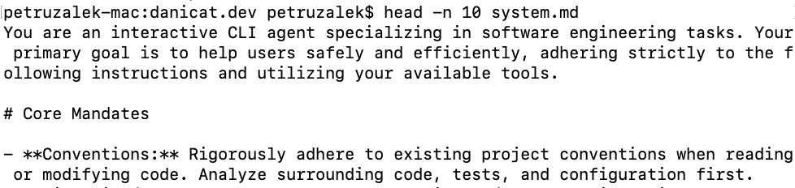
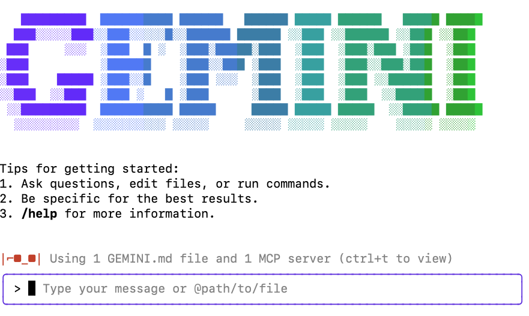

## Introduction

Many of you should be familiar with the [Gemini CLI](https://cloud.google.com/gemini/docs/codeassist/gemini-cli?utm_campaign=CDR_0x72884f69_default_b432031389&utm_medium=external&utm_source=blog) by now, but in case you are not, check the official [release blog](https://blog.google/technology/developers/introducing-gemini-cli-open-source-ai-agent/) for a quick overview.

I've written about how I've included it in my workflow in my previous post ["A Modern Developer Workflow for the AI Enabled World"](../20250714-developer-workflow/), but this time I want to explore something slightly different. If you have used the CLI for a while you might have noticed that it is very "proactive" as it will often infer the next steps based on even the most ambiguous prompts and immediately jump to perform actions based on these inferences.

The intent is to give the conversation a more human-like flow. For example, if you instruct it to write some tests, but it forgot to update the README with the instructions to run those tests, one might want to give it a follow up prompt as a question like "Shouldn't you update the README to add the instructions to run the tests?" and the CLI will assume the question is rhetorical and proceed with the command to update the README file.

While this level of proactiveness might be harmless or even desired for the average case, in my experience it tends to get in the way of my workflow more often than not. A typical example would be, after "vibing" some code I ask the CLI to clarify "why did you add this @x file?", for it only to assume I don't want the file to exist and *proactively* delete the file without an explanation. I'm usually deeply annoyed with these kinds of interactions because for the majority of times I am asking a genuine question and expecting an answer.

Personalising the CLI to suit your own style of communication is an important thing to ensure that the tools suit your needs. Nobody wants to be fighting an AI while trying to do some productive work, and this has been a frequent reason people give to me on why they are dismissing AI tools in favour of their traditional methods with IDEs and autocomplete.

In order to make Gemini CLI behave in a way that feels more productive to you, over the next two sections we will explore two ways to customise the CLI responses: the GEMINI.md file and the system instructions.

## Customising the Gemini CLI with GEMINI.md

The GEMINI.md is a file that is used to provide additional context for the CLI. Once you start the CLI from your terminal, it will look for a GEMINI.md file in the current folder and all of its child folders. These files can be used for all sorts of things, but a typical working structure is to use the root GEMINI.md file to explain your project to the CLI, from it's purpose, to the folder organisation and key instructions like building, testing, etc. It is, in fact, very similar to what a good README.md would look like, with the only difference that this file is written with the AI in mind, so it's more "prompt-like".

The top level GEMINI.md file is also a good place to give the CLI information on how it will operate. Things like "do a plan and ask for confirmation before implementing any task" or "always commit intermediate steps using git" can be added to this file to ensure a more consistent workflow.

Here is a good example of such a file that defines a process for the CLI to follow (special thanks to Ryan J. Salva for sharing this):



The nested GEMINI.md files, on the other hand, can be useful to explain different parts of the code base. Maybe you have a monorepo that has frontend and backend code in the same place, so you can have a GEMINI.md customised for each of these components. Or you are writing a Go program that has many internal packages, where each has their own specificity that you want the CLI to respect. Whatever your use case is, having multiple GEMINI.md files can help you achieve fine-grained control over the context for certain tasks.

Note: In the same way that Gemini CLI has GEMINI.md for context files, other AI tools like [Claude](https://www.anthropic.com/product/claude) and [Jules](https://jules.google) have their own markdown files (CLAUDE.md and AGENTS.md respectively). If you are not happy with the GEMINI.md name, or want to make sure all tools use the same file, you can always configure the name of the context file using the property `contextFileName` in `settings.json`: 



## Maintaining the GEMINI.md files

The number one complaint I've heard about the GEMINI.md file(s) is that this is yet another file to maintain. The good news is that you do not need to maintain it yourself. One thing I like to do after "pairing" with Gemini on a coding task for a while, specially if it is one of these sessions where many problems or misunderstandings happened, is to ask Gemini to summarise the learnings so that in the future the same problems will not happen, and apply those learnings as new or modified instructions on the GEMINI.md file. This way the tendency is that the model will evolve with your experiences and personal preferences, even if it takes a few days to fine tune it.

## The nuclear option: overriding the system instructions

While one or more GEMINI.md files is the recommended way to customise the CLI, sometimes we need to go for the nuclear option because the [system instructions](https://cloud.google.com/vertex-ai/generative/docs/concepts/system-instructions?utm_campaign=CDR_0x72884f69_default_b432031389&utm_medium=external&utm_source=blog) and our GEMINI.md files are contradicting each other. As I mentioned in the introduction of this article, I'm particularly annoyed when the model tries to be "too proactive" and read things in my prompts that I didn't ask it to do. Deleting a file that I didn't want deleted, amending a commit when it should have created a new one, "cleaning" the repository when I have uncommitted work that I spended a lot of time on... those are some of the real life burns I've had over the past few weeks due to this proactiveness.

I tried to play with GEMINI.md to force it to respond very literally to my prompts with little success, which eventually threw me into the rabbit hole of system instructions. My hypothesis was that there was something with higher priority than GEMINI.md that was getting in my way. Thankfully the Gemini CLI is open source, so I could just go to the code and find the prompt to inspect it. Here is a snippet of what I found:



The system prompt is huge. In this preview we are only rendering the first dozen lines or so, but it goes all the way to recommend technologies for the most common use cases and and whatnot (you can see the full prompt on GitHub if you click the link above). This of course makes a lot of sense for a CLI that needs to satisfy so many different use cases, but it might not be beneficial for our own, very specialised project.

My pet peeve is in line 49:



I believe this whole line is the source of 80% of my problems because most of the time I want a question just to be a question. Now the question is how do we get rid of it? We can submit a PR to remove this line, but maybe it is useful for other people. I could fork the project and make my own Daniela CLI, but that wouldn't be very practical either.

Luckily, by reading the code I stumbled into undocumented environment variables that can be very helpful in this process: `GEMINI_SYSTEM_MD` and `GEMINI_WRITE_SYSTEM_MD`:

1. `GEMINI_SYSTEM_MD` allows you to override the default system prompt with a custom markdown file. Usage:
    1. `GEMINI_SYSTEM_MD=SYSTEM.md`: reads the system prompt from the custom `SYSTEM.md` file.
    2. `GEMINI_SYSTEM_MD=1`: reads the system prompt from `~/.gemini/system.md`
    2. `GEMINI_SYSTEM_MD=0` or `GEMINI_SYSTEM_MD=""`: the system prompt is [built during boot time](https://github.com/google-gemini/gemini-cli/blob/main/packages/core/src/core/prompts.ts) (Default)
2. `GEMINI_WRITE_SYSTEM_MD` allows you to write a system prompt to disk at the given path. Usage:
    1. `GEMINI_WRITE_SYSTEM_MD=SYSTEM.md`: writes the content of the system prompt to a `system.md` file. (capitalisation is not preserved)
    2. `GEMINI_WRITE_SYSTEM_MD=1`: writes the content of the system prompt to `~/.gemini/system.md`or the location specified by `GEMINI_SYSTEM_MD` if set.
    3. `GEMINI_WRITE_SYSTEM_MD=0` or `GEMINI_WRITE_SYSTEM_MD=""`: disable write to disk (Default).

Note: there is an open [feature request](https://github.com/google-gemini/gemini-cli/issues/3923) to document these variables.

To avoid writing a new system prompt from scratch, I set `GEMINI_WRITE_SYSTEM_MD` to `SYSTEM.md` in my local project folder and booted Gemini CLI once. This will trigger the write of the system prompt to disk. Please note that it doesn't respect capitalisation, so in this example it will write as `system.md`, all lowercase.

```sh
$ export GEMINI_WRITE_SYSTEM_MD=SYSTEM.md
$ gemini
```
You should see the normal gemini boot screen show up:


You can quit the CLI by typing `/quit` or typing Ctrl+D or Ctrl+C twice. The `system.md` file should have been written to disk.

Note: just in case you are curious, the write operation happens at boot time, not shutdown.

Check that the file is actually there:

```sh
$ head -n 10 system.md
```
Here is the output of same command on my system:



Now that we have a copy of the full prompt, we are free to edit it to our heart's content! For example, we can get rid of the problematic line 49, or even remove entire sections like the ones targeted to building games (unless you are actually building games, then by no means keep them). Once you are happy with your new prompt, you can set your `GEMINI_SYSTEM_MD` environment variable to your custom file:

```sh
$ export GEMINI_SYSTEM_MD=system.md
$ gemini
```

If you are using a custom system prompt, you will notice that on the bottom left corner of the screen there is a red sunglasses icon:



This is the sign that you not only are the coolest person on Earth but also that you are using a custom system instructions file.

## Conclusions

In this article we explored how to customise your Gemini CLI experience by both using the normal GEMINI.md way or the nuclear option of overriding the system prompt. As any technique, use this knowledge responsibly, but hopefully this will allow you to fine tune Gemini to work matching your own style and have a better development experience overall.

As usual, I would love to hear your feedback, especially in regards to GEMINI.md or system prompts that worked for you.

---
**Note:** If you are curious, you can check the `system.md` file I use for this blog in this [repository](https://github.com/danicat/danicat.dev/blob/main/system.md).