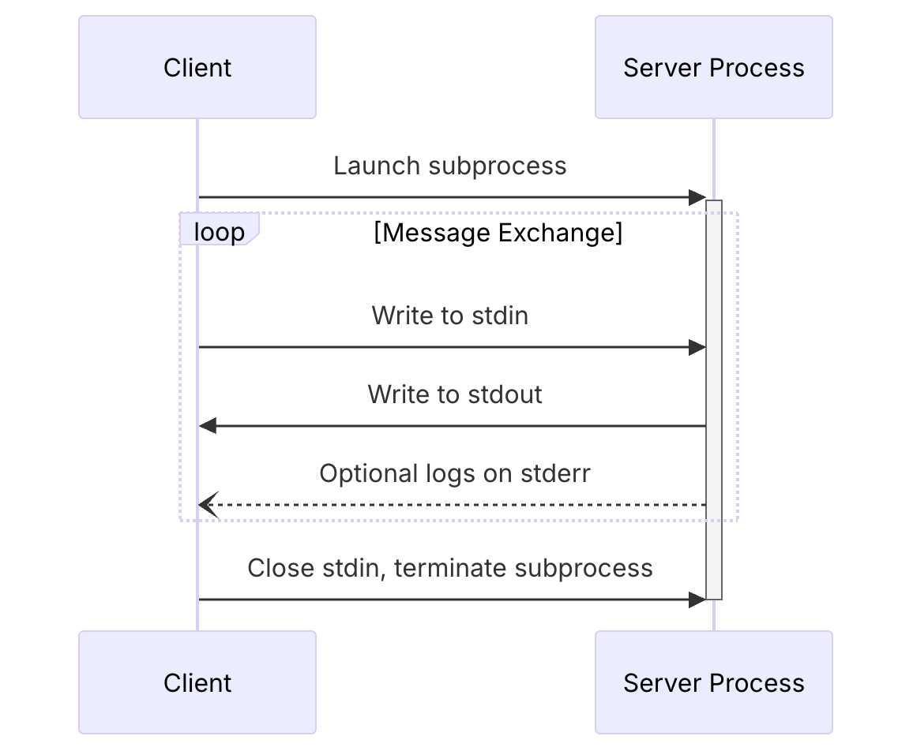


**注記:** この記事は Gemini CLI を対象に書かれたものですが、Gemini CLI は非推奨となり **Google Antigravity 2.0** へと移行しました。新しい Antigravity CLI（`agy`）、SDK、および最新エコシステムの詳細については、[Antigravity 2.0 への銀河ヒッチハイク・ガイド]() をご覧ください。


## はじめに

多くの皆さんと同様に、私も AI 支援開発の世界に深く没頭してきました。その道のりは、「おおっ！」と驚くような瞬間と、もどかしい壁にぶつかることの連続（まるでジェットコースター）です。これは、そんな道のりのひとつの記録です。あるものを作ろうと始めたはずが、もどかしいトラブルによって完全に脱線し、最終的には自分の AI 支援ワークフローを根本的に向上させるツールを手に入れることになった——そんなストーリーです。

私の当初の目標は、SQL を使ってマシンの状態をクエリできるツール [osquery](https://www.osquery.io/) のための Model Context Protocol（MCP）サーバーを構築することでした。Go コードを書くのを手伝ってもらうため、Gemini CLI を使うのをとても楽しみにしていました。しかし、すぐに大きな壁にぶつかりました。エージェントが生成する Go コードは、お世辞にもイディオマティック（Go らしい作法に則っている）とは言えなかったのです。初心者のようなミスを犯し、過剰な抽象化を作り込み、存在しない API をまるごと「ハルシネーション（幻覚）」で捏造することもしばしばありました。私の推測では、基盤モデルが新しい [Go SDK for MCP](https://github.com/modelcontextprotocol/go-sdk) で学習されておらず、「知らない」と認める代わりにそれっぽい答えをでっち上げるほうを選んでしまったのだと思います。

この経験から、ひとつの重要な気づきを得ました。ツールと戦うのではなく、ツールに*教える*ことができるのではないか、ということです。そこで私は osquery プロジェクトを一時中断し、「サイドクエスト」に乗り出すことにしました。その目的はただひとつ、Go 開発のエキスパートとなる専用 MCP サーバーを作ることです。最終的に [GoDoctor](https://github.com/danicat/godoctor) と名付けたこのサイドプロジェクトは、Gemini CLI がより良い Go コードを書くために必要なツール群を提供してくれます。

本記事では、GoDoctor を構築したプロセスを振り返ります。これは従来のチュートリアルというよりは、「プロンプト主導」の探求記です。プロジェクト要件をいかに効果的なプロンプトへと落とし込み、AI を実装へと導きながら、道中で避けられない失敗から何を学んでいくかに焦点を当てます。

## 舞台設定：`GEMINI.md`

コードを1行も書く前に、まず行うべきは基本ルールの策定でした。`GEMINI.md` は Gemini CLI 固有のファイルですが、コンテキストファイルを用意するプラクティスは多くの AI コーディングエージェントで一般的です（たとえば Jules では `AGENTS.md`、Claude では `CLAUDE.md` が使われます）。実際、これを [`AGENT.md`](https://ampcode.com/AGENT.md) というファイル名で標準化しようとする新たな動きも始まっています。このファイルは、AI に対してプロジェクトの規範や振る舞いへの期待値を正しく理解させるための土台となるため、極めて重要です。

新規プロジェクトだったため、この段階では具体的なアーキテクチャの詳細はまだありませんでした。そこで、まずは高品質でイディオマティックな Go コードを書くための汎用的なガイドラインから始めることにしました。プロジェクトが進むにつれて、ディレクトリ構造やビルドコマンド、主要ライブラリに関する具体的な指示を追加していくのが一般的です。よりプロジェクト固有の設定例としては、私の [`testquery` プロジェクト](https://github.com/danicat/testquery/blob/main/GEMINI.md) で使っている `GEMINI.md` をご覧ください。

以下が、今回の開発において AI の「憲法」として機能した初期の `GEMINI.md` です：

```markdown
# Go開発ガイドライン
本プロジェクトにコントリビュートされるすべてのコードは、以下の原則に従う必要があります。

## 1. フォーマット
すべてのGoコードは、コミット前に必ず `gofmt` でフォーマットしてください。

## 2. 命名規則
- **パッケージ:** 短く簡潔な、すべて小文字の名前を使用してください。
- **変数、関数、メソッド:** 非公開（unexported）の識別子には `camelCase` を、公開（exported）の識別子には `PascalCase` を使用してください。
- **インターフェース:** `I` のようなプレフィックスを付けるのではなく、その振る舞い（役割）に応じた命名をしてください（例: `io.Reader`）。

## 3. エラーハンドリング
- エラーは値（value）です。決して破棄しないでください。
- `if err != nil` パターンを使用して明示的にエラーを処理してください。
- `fmt.Errorf("context: %w", err)` を使用してエラーに文脈（コンテキスト）を付与してください。

## 4. シンプルさと明快さ
- 「Clear is better than clever（トリッキーであるより明快であれ）」：理解しやすいコードを書いてください。
- 不要な複雑さや過剰な抽象化は避けてください。
- インターフェースではなく具象型を返すようにしてください。

## 5. ドキュメント
- すべての公開識別子（`PascalCase`）には doc コメントが必須です。
- コメントには「何をしているか（*what*）」ではなく「なぜそうしているか（*why*）」を記述してください。

# エージェントガイドライン
- **URLの読み込み:** ユーザーから提示されたURLは必ず読み込んでください。スキップは認められません。
```

このファイルによって、開発の最初期から品質とスタイルのベースラインを確立できます。

## Model Context Protocol（MCP）を理解する

このプロジェクトの核心にあるのが Model Context Protocol（MCP）です。MCP を「LLM ツールのための USB 標準」と例える人もいますが、私は別の見方をしています。**HTTP と REST が Web API の標準化にもたらした変革を、今まさに MCP が LLM ツールにもたらそうとしている**、と。REST が予測可能なアーキテクチャを提供して巨大な Web サービスのエコシステムを解き放ったように、MCP は AI エージェントの世界に待望の共通言語を提供しています。これは JSON-RPC ベースのプロトコルであり、MCP を「話す」エージェントであれば、個別の専用統合を作ることなく、仕様に準拠したあらゆるツールを発見して利用できるようになります。

プロトコルでは、エージェントとツールサーバーが通信するための方式（トランスポート）が定義されています。代表的なものは以下の2つです：
*   **HTTP:** おなじみの Request/Response モデルであり、[Cloud Run](https://cloud.google.com/run?utm_campaign=CDR_0x72884f69_default_b421852297&utm_medium=external&utm_source=blog) などにリモートサービスとしてデプロイされたツールに最適です。
*   **stdio:** 標準入出力（stdin/stdout）を使用する堅牢なトランスポートであり、ローカルマシン上のプロセスとしてツールを実行するのに適しています。

`stdio` トランスポートでは、エージェントとサーバーが一連の JSON-RPC メッセージをやり取りします。接続を確立するために、まず重要な3ウェイハンドシェイクから始まります。クライアントがツール呼び出しを行えるのは、このハンドシェイクが完了した後のみです。

シーケンスは以下のようになります：


*<p align="center">図1：公式MCPドキュメント（2025-06-18）の stdio トランスポート・シーケンス図。</p>*

公式仕様に基づいた、初期ハンドシェイクの JSON メッセージの例は以下のとおりです：

**1. Client → Server: `initialize` リクエスト**
クライアントは `initialize` リクエストを送信して対話を開始します。
```json
{
  "jsonrpc": "2.0",
  "id": 1,
  "method": "initialize",
  "params": {
    "protocolVersion": "2025-06-18",
    "clientInfo": {
      "name": "Gemini CLI",
      "version": "1.0.0"
    }
  }
}
```

**2. Server → Client: `initialize` レスポンス（結果）**
サーバーはプロトコルバージョンを確認し、サポートする機能（capabilities）やサーバー情報を返す形で応答します。以下は `godoctor` バイナリからの実際のレスポンスです：
```json
{
  "jsonrpc": "2.0",
  "id": 1,
  "result": {
    "capabilities": {
      "completions": {},
      "logging": {},
      "tools": {
        "listChanged": true
      }
    },
    "protocolVersion": "2025-06-18",
    "serverInfo": {
      "name": "godoctor",
      "version": "0.2.0"
    }
  }
}
```

**3. Client → Server: `initialized` 通知（Notification）**
最後に、クライアントが `initialized` 通知を送信して初期化の完了を伝えます。これは通知（notification）であるため `id` フィールドがなく、メソッド名が名前空間（`notifications/initialized`）で区切られている点に注意してください。
```json
{
  "jsonrpc": "2.0",
  "method": "notifications/initialized",
  "params": {}
}
```

このやり取りが完了してセッションが確立されると、クライアントはツールの呼び出しに進むことができます。たとえばサーバーに利用可能なツール一覧を要求するには、`tools/list` リクエストを送信します。肝心なのは、このリクエストを送る前に、3つのハンドシェイクメッセージがすべて正しい順序で送信されていなければならない点です。

この一連のシーケンスは、以下のシェルスクリプトで実際に確認できます：
```bash
#!/bin/bash
(
  echo '{"jsonrpc":"2.0","id":1,"method":"initialize","params":{"protocolVersion":"2025-06-18","clientInfo":{"name":"Manual Test Client","version":"1.0.0"}}}';
  echo '{"jsonrpc":"2.0","method":"notifications/initialized","params":{}}';
  echo '{"jsonrpc":"2.0","id":2,"method":"tools/list","params":{}}';
) | godoctor
```

このスクリプトを `godoctor` バイナリへパイプで流し込むと、まず `initialize` の結果が返され、続いて GoDoctor が提供する全ツールを正しく一覧表示する `tools/list` の結果が出力されます。この必須の3ステップによるフローを理解できたことが、最初の最大の難関を突破する鍵となりました（詳しくは次のセクションで説明します）。

MCP を初めて触る方には、公式ドキュメントを一読することを強くおすすめします。私にとって特に重要だったのは、[クライアント／サーバーのライフサイクル](https://modelcontextprotocol.io/specification/2025-06-18/basic/lifecycle) と [トランスポート層](https://modelcontextprotocol.io/specification/2025-06-18/basic/transports) に関するページでした。（あるいは読むのが面倒なら、それらの URL を CLI に渡して代わりに読ませてしまうのも手です =^_^=）

## 最初のブレークスルー：ドキュメントを読むエージェント

私の最初の目標は、API のハルシネーション問題を解決することでした。プロンプティングの初期段階によくあるように、最初のリクエストは素朴で少し曖昧なものでした：

> 「`godoc` という名前のツールを1つ持つ Go 製の MCP サーバーを作成してください。このツールはパッケージ名と任意のシンボル名を受け取り、`go doc` コマンドを実行するものとします。」

しかし、結果は芳しいものではありませんでした。エージェントはどのツールを使い、どのプロトコルが最適なのかを判断するのに多くの時間を費やしてしまったのです。「MCP」という頭字語すら自明ではなく、私が「Model Context Protocol」のことだと明示するまでは、まったく別の概念だと解釈してしまうこともしばしばでした。Google 検索と WebFetch を呼び出すループに囚われ、手当たり次第に別の SDK を試しては動くコードを生成できずに別の SDK へピボットする……という試行錯誤を延々と繰り返しました。

これこそが「バイブコーディング（vibe coding）」の現場で直面する現実です。指示を少しずつ磨き上げていく反復的なプロセスが求められます。数時間の試行錯誤の末、私ははるかに効果的なプロンプトにたどり着きました。具体的で質の高いリファレンスをあらかじめ与えておくことが何より重要だと学んだのです。

以下が、最終的に完成した改善版プロンプトです：

> あなたのタスクは、`go doc` コマンドを公開し、LLM が Go のドキュメントを検索できるようにする Model Context Protocol（MCP）サーバーを作成することです。ツール名は `go-doc` とし、`package_path`（必須）と `symbol_name`（任意）の2つの引数を取ります。ドキュメントの取得には `go doc` シェルコマンドを使用してください。MCP 実装には公式の Go SDK for MCP を使用し、stdio トランスポート経由で通信するプロダクションレディな MCP サーバーを記述してください。また、サーバーの動作テストができるシンプルな CLI クライアントもあわせて作成してください。
>
> コードを書き始める前に、技術仕様とプロジェクト構造を把握するため、必ず以下のリファレンスを読み込んでください：
> - https://github.com/modelcontextprotocol/go-sdk
> - https://modelcontextprotocol.io/specification/2025-06-18/basic/lifecycle
> - https://go.dev/doc/modules/layout

このプロンプトが優れている理由はいくつかあります。使用すべき正確な SDK を指定し、トランスポート（`stdio`）を明確に定め、そして何よりエージェントに「読むべき資料リスト」を提示している点です。SDK のソースコードや MCP 仕様へのリンクをあらかじめ渡すことで、エージェントがハルシネーションを起こす確率を劇的に抑え込むことができました。

しかし、プロンプトを改善した後も道のりは平坦ではありませんでした。最大の壁となったのが `stdio` トランスポートの実装です。ツール呼び出しを行うと、決まって `server initialisation is not complete`（サーバーの初期化が完了していません）という不可解なエラーで失敗してしまったのです。

骨の折れるデバッグの末に判明したのは、問題がサーバー側のコードにあるわけではまったくない、ということでした。原因はまさに先述したとおり、MCP の `stdio` トランスポートが厳格な3ステップのハンドシェイクを要求する仕様だったためです。クライアントがハンドシェイク完了前にツールの呼び出しを試みてしまっていたのです。この経験から貴重な教訓を得ました。AI 向けのツールを構築する際、デバッグしているのは単なるプログラムコードではなく、「対話プロトコルそのもの」なのだということです。

サーバーが正常に起動し、プロトコルに従って正しく対話できるようになったら、次のステップはそれを Gemini CLI に認識させることでした。これにはプロジェクトルートの `.gemini/settings.json` ファイルを使用し、ロードすべきツールを CLI に指示します。以下の設定を追加しました：

```json
{
  "mcpServers": {
    "godoctor": {
      "command": "./bin/godoctor"
    }
  }
}
```

これを設定しておけば、このディレクトリで Gemini CLI を起動するたびに、バックグラウンドで `godoctor` サーバーが自動的に立ち上がり、エージェントからそのツールが利用可能になります。

## AIコードレビュアーでフィードバックループを作る

`godoc` ツールが動くようになったところで、次なるステップは、エージェントにドキュメントを読ませるだけでなく、コードの「品質」について考察（推論）させることでした。こうして誕生したのが `code_review` ツールです。これまでの土台があったおかげで、今回ははるかにスムーズに進みました。

プロンプトでは実装の詳細ではなく、「達成したいゴール」に焦点を当てました：

> プロジェクトに `code_review` という新しいツールを追加したいです。このツールは Gemini API を使用して Go コードを解析し、Go コミュニティで広く受け入れられているベストプラクティスに沿った改善案のリストを JSON 形式で返すものとします。ツールへの入力として Go コードの文字列と、任意のヒント（hint）を受け取るようにしてください...
>
> Gemini の呼び出しには次の SDK を使用してください：https://github.com/googleapis/go-genai

エージェントは依然として新しい `genai` Go SDK を学ぶ必要がありましたが、今回のツールボックスにはすでに自作の `godoc` ツールがありました。エージェントが自らツールを使って SDK の仕様を調べ、自分の間違いを修正しながらリアルタイムに学習していく様子を目の当たりにしました。試行錯誤のイテレーションは依然として必要でしたが、開発スピードと効率は以前と比べて格段に向上しました。

最大の収穫は、ツールそのもの以上に、それによって切り拓かれた「新たな可能性」でした。ツール自身を使ってツール自身のコードをレビューできるようになり、AI 支援開発が一段上のステージへと引き上げられたのです。**まさに正のフィードバックループが完成した瞬間でした。**

私のワークフローには、強力な新しいステップが加わりました。エージェントがコードを生成した直後に、自分自身の成果物を批評するよう指示できるようになったのです：

> 「今書いたコードに対して `code_review` ツールを実行し、その提案を適用してリファクタリングしてください。」

するとエージェントは自身の出力を自ら分析し、AI が提示したフィードバックに基づいてコードをリファクタリングしてくれます。これこそが AI 向けツールを構築する真の醍醐味です。単にタスクを自動化するだけでなく、「自己改善できるシステム」そのものを構築しているのです。

## 最終章：クラウドへのデプロイ


独自の MCP サーバーを Cloud Run にデプロイする際は、必ず適切な認証を設定してください。特に Gemini API キーを使用している場合、**誰でもアクセスできる公開サーバーとしてデプロイしないでください**。公開エンドポイントが悪意ある第三者に悪用された場合、予期せぬ莫大なクラウド利用料が発生する恐れがあります。


`stdio` 経由で動作するローカルツールは個人の開発環境には最適ですが、Model Context Protocol の真の目標は、共有可能で発見しやすいツールのエコシステムを構築することにあります。この「サイドクエスト」の次なるフェーズは、GoDoctor をノートPC上のローカルバイナリから、[Google Cloud Run](https://cloud.google.com/run?utm_campaign=CDR_0x72884f69_default_b421852297&utm_medium=external&utm_source=blog) を使ったスケーラブルな Web サービスへと昇華させることでした。

そのためには、エージェントにクラウド開発における2つの新しいスキル——「アプリケーションのコンテナ化」と「クラウドへのデプロイ」——を教え込む必要がありました。

まず、トランスポートを `stdio` から `HTTP` へと切り替える必要がありました。前回の成果を踏まえ、プロンプトは簡潔かつ直接的に指示しました：

> 「サーバーを Web に公開する準備をします。MCP サーバーを `stdio` トランスポートから `streamable HTTP` トランスポートを使用するようにリファクタリングしてください。」

サーバーが HTTP で通信できるようになったので、次はクラウド向けにパッケージングします。軽量で安全なコンテナイメージを構築する標準的な手法である、プロダクションレディなマルチステージ `Dockerfile` の作成をエージェントに依頼しました：

> 「Go バイナリをコンパイルし、最小限の `golang:1.24-alpine` イメージにコピーするマルチステージ Dockerfile を作成してください。」

`Dockerfile` が完成したら、いよいよデプロイです。ローカルの概念実証（PoC）が、本物のクラウドインフラへと生まれ変わる瞬間です：

> 「作成したイメージを Cloud Run にデプロイしてください。リージョンは `us-central1` を指定し、現在環境で設定されているプロジェクトを使用してください。完了したら、MCP ツールを呼び出すための URL を教えてください。」

エージェントは適切な `gcloud` コマンドを提示し、ほんの数分後には GoDoctor がインターネット上で稼働し始めました。セットアップを完了させるため、ローカルの Gemini CLI にリモートサーバーの存在を伝える必要があります。`.gemini/settings.json` ファイルを更新し、ローカルの `command` をリモートの `httpUrl` に差し替えました：

```json
{
  "mcpServers": {
    "godoctor": {
      "httpUrl": "https://<your-cloud-run-url>.run.app"
    }
  }
}
```

これだけで、私の CLI はクラウド上にデプロイされて稼働しているリモートツールを直接利用できるようになりました。概念実証が真に完成したと感じた瞬間でした。エージェントを丁寧に誘導する反復的なプロセスが実を結び、ひとつのアイデアを現代のアプリケーションライフサイクル全体（ローカルの PoC からスケーラブルなクラウドネイティブサービスまで）へと導くことができたのです。

とはいえ、普段の開発作業では現在も `stdio` 版を使っています。1人だけの開発環境にとって、Cloud Run へのデプロイはオーバースペック（やりすぎ）ですからね。

## GoDoctor のバイブコーディングから得た教訓

今回の旅は、単にコードを書くこと以上に「AI といかに効果的に協働するか」を学ぶプロセスでした。最大の気づきは、自分のマインドセットを「コーダー」から「教師」あるいは「パイロット」へと切り替えることの重要性です。ここで得られた特に重要な教訓をいくつか挙げます：

*   **あなたがパイロットであること。** AI はときに納得のいかないアクションを提案してくることがあります。ためらわずに `ESC` キーを押して中断し、新たなプロンプトを与えて正しい方向へと誘導してください。
*   **AI を常に「同じ認識（ループ）」に留めておくこと。** 基本的にはすべての作業をエージェントに任せるのがベストですが、ときに手動での修正が必要になることもあります。人間が手動でコードを変更すると、AI の持っているコンテキストが古くなってしまいます。コードベースの同期を保つために、どこを変更したのかを必ずエージェントに伝えてください。
*   **困ったときは「再起動」に限る。** （決して珍しくない）AI が完全に行き詰まってしまった状況では、古典的な IT の対処法が驚くほど効きます。Gemini CLI であれば、`/compress` コマンドで会話履歴を要約するか、最悪の場合は CLI を再起動してクリーンなコンテキストから再開すると良いでしょう。

エージェントに適切なコンテキストとツールを与えることで、AI は格段に頼もしいパートナーへと成長しました。単にコードを書かせるだけの作業から、「自ら学び、自己改善できるシステム」を構築する旅へと変化したのです。

## 今後の展望

GoDoctor をめぐる探求はまだまだ終わりではありません。現在も実験的なプロジェクトであり、新しいツールを追加したり対話を重ねたりするたびに、新たな発見があります。私の目標は、世界中の Go 開発者にとって真に役立つコーディングアシスタントへと育て続けることです。

もしこの旅をご自身でも体験し、ゼロから独自の MCP サーバーを作ってみたいと思われたなら、そのプロセスを体験できるハンズオンワークショップを用意しています。ぜひ **[Gemini CLI と Go で作る MCP サーバー開発](https://codelabs.developers.google.com/cloud-gemini-cli-mcp-go)** のコードラボをチェックしてみてください。

また、こうした概念が公式の Go ツールチェーンにどのように適用されているか興味がある方には、同様の目標を掲げる `gopls` MCP サーバーについてのドキュメントを読むことを強くおすすめします。詳細は [Go 公式ドキュメント](https://tip.golang.org/gopls/features/mcp) を参照してください。

## リソースと参考リンク

本記事で紹介した主なリソースをまとめました。皆さんにとっても役立つ情報となれば幸いです。

*   **[GoDoctor プロジェクトリポジトリ](https://github.com/danicat/godoctor):** 今回作成したツールの完全なソースコード
*   **[Model Context Protocol 公式サイト](https://modelcontextprotocol.io/):** MCP を学ぶための公式ポータル
*   **[MCP 仕様書 (2025-06-18)](https://modelcontextprotocol.io/specification/2025-06-18):** 技術仕様の完全版
*   **[MCP ライフサイクル仕様](https://modelcontextprotocol.io/specification/2025-06-18/basic/lifecycle):** クライアント・サーバー間のハンドシェイクを理解するための必読ドキュメント
*   **[MCP トランスポート仕様](https://modelcontextprotocol.io/specification/2025-06-18/basic/transports):** `stdio` と `http` トランスポートの違いを理解するためのリファレンス