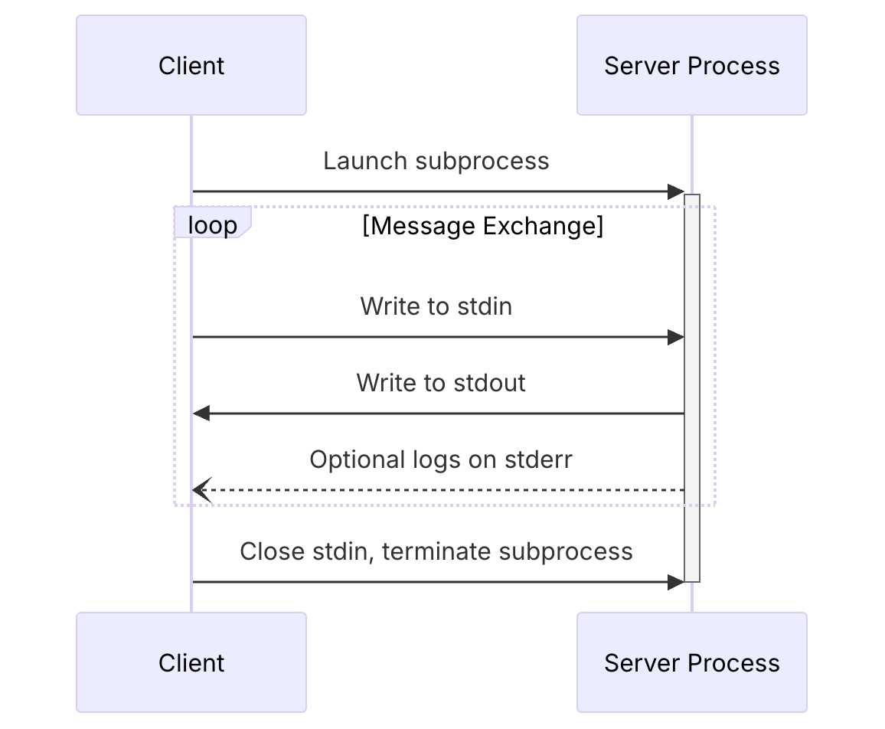

### Introduction

Like many of you, I've been diving deep into AI-assisted development. The journey is often a rollercoaster of "wow" moments and frustrating roadblocks. This is the story of one such journey—a story that started with me trying to build one thing, getting completely sidetracked by a frustrating problem, and ending up with a tool that has fundamentally improved my AI-assisted workflow.

My original goal was to build a Model Context Protocol (MCP) server for [osquery](https://www.osquery.io/), a tool that lets you query a machine's state using SQL. I was excited to use the Gemini CLI to help me write the Go code. However, I quickly hit a wall. The Go code the agent produced often wasn't idiomatic. It made beginner mistakes, created excessive abstractions, and would frequently "hallucinate" entire APIs that didn't exist. My suspicion was that the underlying model hadn't been trained on the newer [Go SDK for MCP](https://github.com/modelcontextprotocol/go-sdk), so it preferred to invent answers rather than admit it didn't know.

This experience led me to a key realization: instead of fighting the tool, I could *teach* it. I decided to pause my osquery project and embark on a "side quest": to build a dedicated MCP server whose sole purpose was to be a Go development expert. This side project, which I eventually named [GoDoctor](https://github.com/danicat/godoctor), would provide the tools the Gemini CLI needed to write better Go code.

In this post, I'll walk you through the story of building GoDoctor. This is less a traditional tutorial and more a "prompt-driven" journey. We'll focus on how to translate project requirements into effective prompts and guide an AI through the implementation details, learning from the inevitable mistakes along the way.

### Setting the Stage: The `GEMINI.md`

Before writing a single line of code, the first step was to set the ground rules. While `GEMINI.md` is a file specific to the Gemini CLI, the practice of creating a context file is common for many AI coding agents (for example, Jules uses `AGENTS.md` and Claude uses `CLAUDE.md`). In fact, there's an emerging effort to standardize this with a file called [`AGENT.md`](https://ampcode.com/AGENT.md). This file is crucial because it provides the AI with a foundational understanding of your project's standards and your expectations for its behavior.

Since this project was brand new, I didn't have any specific architectural details to share yet. Therefore, I started with a generic set of guidelines focused on creating high-quality, idiomatic Go code. As a project evolves, it's common to add more specific instructions about the project's structure, build commands, or key libraries. For an example of a more project-specific file, you can see the `GEMINI.md` I use for my [`testquery` project](https://github.com/danicat/testquery/blob/main/GEMINI.md).

Here is the initial `GEMINI.md` that served as our constitution for the AI in this journey:

```markdown
# Go Development Guidelines
All code contributed to this project must adhere to the following principles.

### 1. Formatting
All Go code **must** be formatted with `gofmt` before being submitted.

### 2. Naming Conventions
- **Packages:** Use short, concise, all-lowercase names.
- **Variables, Functions, and Methods:** Use `camelCase` for unexported identifiers and `PascalCase` for exported identifiers.
- **Interfaces:** Name interfaces for what they do (e.g., `io.Reader`), not with a prefix like `I`.

### 3. Error Handling
- Errors are values. Do not discard them.
- Handle errors explicitly using the `if err != nil` pattern.
- Provide context to errors using `fmt.Errorf("context: %w", err)`.

### 4. Simplicity and Clarity
- "Clear is better than clever." Write code that is easy to understand.
- Avoid unnecessary complexity and abstractions.
- Prefer returning concrete types, not interfaces.

### 5. Documentation
- All exported identifiers (`PascalCase`) **must** have a doc comment.
- Comments should explain the *why*, not the *what*.

# Agent Guidelines
- **Reading URLs:** ALWAYS read URLs provided by the user. They are not optional.
```

This file establishes a baseline for quality and style from the very beginning.

### Understanding the Model Context Protocol (MCP)

At the heart of this project is the Model Context Protocol (MCP). Some people describe it as a "USB standard for LLM tools," but I like to think of it another way: **what HTTP and REST did for standardizing web APIs, MCP is doing for LLM tools.** Just as REST provided a predictable architecture that unlocked a massive ecosystem of web services, MCP is providing a much-needed common language for the world of AI agents. It's a JSON-RPC-based protocol that creates a common ground, allowing any agent that "speaks" MCP to discover and use any compliant tool without needing a custom, one-off integration.

The protocol defines different ways for the agent and the tool server to communicate, known as transports. The two most common are:
*   **HTTP:** The familiar request/response model, ideal for tools deployed as remote services (e.g., on [Cloud Run](https://cloud.google.com/run?utm_campaign=CDR_0x72884f69_default_b421852297&utm_medium=external&utm_source=blog)).
*   **stdio:** A simpler transport that uses standard input and output, perfect for running a tool as a local process on your machine.

With the `stdio` transport, the agent and the server exchange a series of JSON-RPC messages. The process starts with a crucial three-way handshake to establish the connection. Only after this handshake is complete can the client start making tool calls.

The sequence looks like this:


*<p align="center">Figure 1: Stdio transport sequence diagram from the official MCP documentation (2025-06-18).</p>*

Here’s what the JSON messages for that initial handshake look like, based on the official spec:

**1. Client → Server: `initialize` Request**
The client starts the conversation by sending an `initialize` request.
```json
{
  "jsonrpc": "2.0",
  "id": 1,
  "method": "initialize",
  "params": {
    "protocolVersion": "2025-06-18",
    "clientInfo": {
      "name": "Gemini CLI",
      "version": "1.0.0"
    }
  }
}
```

**2. Server → Client: `initialize` Result**
The server responds with a result, confirming the protocol version and advertising its capabilities and information. This is the actual response from the `godoctor` binary:
```json
{
  "jsonrpc": "2.0",
  "id": 1,
  "result": {
    "capabilities": {
      "completions": {},
      "logging": {},
      "tools": {
        "listChanged": true
      }
    },
    "protocolVersion": "2025-06-18",
    "serverInfo": {
      "name": "godoctor",
      "version": "0.2.0"
    }
  }
}
```

**3. Client → Server: `initialized` Notification**
Finally, the client acknowledges the setup is complete by sending an `initialized` notification. Note that this is a notification, so it has no `id` field, and the method is namespaced.
```json
{
  "jsonrpc": "2.0",
  "method": "notifications/initialized",
  "params": {}
}
```

Once this exchange is complete, the session is established, and the client can proceed with tool calls. For example, to ask the server for a list of its available tools, you can send a `tools/list` request. The key is that all three handshake messages must be sent in the correct order before this request.

You can see the full sequence in action with this shell script:
```bash
#!/bin/bash
(
  echo '{"jsonrpc":"2.0","id":1,"method":"initialize","params":{"protocolVersion":"2025-06-18","clientInfo":{"name":"Manual Test Client","version":"1.0.0"}}}';
  echo '{"jsonrpc":"2.0","method":"notifications/initialized","params":{}}';
  echo '{"jsonrpc":"2.0","id":2,"method":"tools/list","params":{}}';
) | godoctor
```

Piping this script to the `godoctor` binary produces the `initialize` result first, followed by the `tools/list` result, which correctly lists all of GoDoctor's tools. Understanding this required three-step flow was the key to solving my biggest initial roadblock, which I'll describe in the next section.

For anyone new to MCP, I highly recommend reading the official documentation. The two documents that were most crucial for me were the pages on the [client/server lifecycle](https://modelcontextprotocol.io/specification/2025-06-18/basic/lifecycle) and the [transport layer](https://modelcontextprotocol.io/specification/2025-06-18/basic/transports). (Or if you are feeling lazy, give those URLs to the CLI and make it read for you =^_^=)

### The First Breakthrough: An Agent That Reads the Docs

My first goal was to solve the API hallucination problem. Like many first attempts at prompting, my initial request was simple and a bit vague:

> "Create an MCP server in Go that has one tool called `godoc`. This tool should take a package name and an optional symbol name and run the `go doc` command."

The results were not great. The agent spent a lot of time trying to figure out which tools to use and which protocol was best. Even the acronym "MCP" wasn't an obvious concept for it; it would often infer it stood for different things before I clarified it meant "Model Context Protocol." It got stuck in cycles calling Google Search and WebFetch, trying different SDKs, failing to produce a working example, then pivoting to another SDK, over and over. This is where the real work of "vibe coding" begins. It's an iterative process of refining your instructions. After a few hours of trial and error, I landed on a much more effective prompt. I learned that providing specific, high-quality resources was the key.

Here is the final, much-improved prompt:

> Your task is to create a Model Context Protocol (MCP) server to expose the go doc command, giving LLMs the capability to query Go documentation. The tool should be named go-doc and should take two arguments: package_path (required) and symbol_name (optional). For the documentation part, use the `go doc` shell command. For the MCP implementation, you should use the official Go SDK for MCP and write a production-ready MCP server that communicates through a stdio transport. You should also create a simple CLI client to allow me to test the server.
>
> Read these references to gather information about the technology and project structure before writing any code:
> - https://github.com/modelcontextprotocol/go-sdk
> - https://modelcontextprotocol.io/specification/2025-06-18/basic/lifecycle
> - https://go.dev/doc/modules/layout

This prompt is better for several reasons: it specifies the exact SDK to use, it dictates the transport (`stdio`), and most importantly, it gives the agent a reading list. By providing links to the SDK's source code and the MCP spec, I dramatically reduced the agent's tendency to hallucinate.

Even with this better prompt, the journey wasn't smooth. The biggest hurdle appeared when I tried to use the simple `stdio` transport. My tool calls would consistently fail with a cryptic error: `server initialisation is not complete`. After much painful debugging, I discovered the problem wasn't in my server code at all. The issue was that the MCP `stdio` transport requires the specific three-step handshake I detailed above. My client was trying to call the tool before the handshake was complete. This experience taught me a valuable lesson: when you're building tools for AI, you're not just debugging code, you're debugging the conversation protocol itself.

Once the server was running and speaking the protocol correctly, the next piece of the puzzle was to introduce it to the Gemini CLI. This is handled by a `.gemini/settings.json` file in the project root, which tells the CLI what tools to load. I added the following configuration to it:

```json
{
  "mcpServers": {
    "godoctor": {
      "command": "./bin/godoctor"
    }
  }
}
```

With this in place, every time I started the Gemini CLI in this directory, it would automatically launch my `godoctor` server in the background and make its tools available to the agent.

### Creating a Feedback Loop with an AI Code Reviewer

With a working `godoc` tool, the next logical step was to teach the agent not just to read about code, but to reason about its quality. This led to the `code_review` tool. The experience this time was much smoother, a direct result of the work we had already done.

My prompt was focused on the goal, not the implementation:

> I want to add a new tool to my project called code_review. This tool should use the Gemini API to analyze Go code and provide a list of improvements in json format according to the best practices accepted by the Go community. The tool should take the Go code content and an optional hint as input...
>
> Use this SDK to call Gemini: https://github.com/googleapis/go-genai

The agent still had to learn the `genai` Go SDK, but this time it had our `godoc` tool in its toolbox. I could see it using the tool to look up the SDK, correct its own mistakes, and learn in real-time. The process was still iterative, but it was significantly faster and more efficient.

The most important outcome wasn't just the tool itself, but the new capability it unlocked. For the first time, I could use the tool to review its own code, unlocking another level of AI-driven development. **I had created a positive feedback loop.**

My workflow now had a powerful new step. After the agent generated a new piece of code, I could immediately ask it to critique its own work:

> "Now, use the `code_review` tool on the code you just wrote and apply the suggestions."

The agent would then analyze its own output and refactor it based on the AI-generated feedback. This is the real power of building tools for AI: you're not just automating tasks, you're creating systems for self-improvement.

### The Final Chapter: Deploying to the Cloud


If you deploy your own MCP server to Cloud Run, ensure that you have configured proper authentication. **Do not deploy a publicly accessible server**, especially if it uses a Gemini API key. A public endpoint could be exploited by malicious actors, potentially leading to a very large and unexpected cloud bill.


A local tool running over `stdio` is great for personal use, but the goal of the Model Context Protocol is to create an ecosystem of shared, discoverable tools. The next phase of this "side quest" was to take GoDoctor from a local binary on my laptop to a scalable web service using [Google Cloud Run](https://cloud.google.com/run?utm_campaign=CDR_0x72884f69_default_b421852297&utm_medium=external&utm_source=blog).

This meant teaching the agent two new skills for cloud development: how to containerize an application and how to deploy it.

First, we needed to switch from the simple `stdio` transport to `HTTP`. My prompt was direct, building on our previous work:

> "It's time to take our server to the web. Please refactor the MCP server from the `stdio` transport to use the `streamable HTTP` transport."

With the server now speaking HTTP, the next step was to package it for the cloud. I asked the agent to create a production-ready, multi-stage `Dockerfile`, which is the standard way to build lightweight and secure container images.

> "Please create a multi-stage Dockerfile that compiles the Go binary and copies it into a minimal `golang:1.24-alpine` image."

With the `Dockerfile` defined, it was time for deployment. This is the moment where the local proof-of-concept becomes a real piece of cloud infrastructure.

> "Now, please deploy this image to Cloud Run. Deploy it to `us-central1` and use the project currently configured in the environment. When you're done, give me the URL I can use to call the MCP tool."

The agent provided the correct `gcloud` commands, and after a few minutes, GoDoctor was live on the internet. To complete the setup, I needed to tell my local Gemini CLI about the remote server. This meant updating the `.gemini/settings.json` file, swapping the local `command` for the remote `httpUrl`:

```json
{
  "mcpServers": {
    "godoctor": {
      "httpUrl": "https://<your-cloud-run-url>.run.app"
    }
  }
}
```

And just like that, my CLI was using a tool that was deployed and running on the cloud. This was the moment the proof of concept felt truly complete. The iterative process of guiding the agent had paid off, taking a simple idea through the entire lifecycle of a modern application—from a local concept to a scalable, cloud-native service.

That said, for my day-to-day work, I'm currently using the `stdio` version — for a team of one, deploying to Cloud Run is simply overkill.

### My Key Takeaways from Vibe Coding GoDoctor

This journey was less about writing code and more about learning how to effectively collaborate with an AI. My biggest lesson was to shift my mindset from being a "coder" to being a "teacher" or "pilot." Here are some of the most important lessons I learned:

*   **You are the pilot.** The AI will sometimes propose actions you don't agree with. Don't be afraid to hit `ESC` to cancel and provide a new prompt to guide it in the right direction.

*   **Keep the AI in the loop.** It's best to let the agent perform all the work, but sometimes a manual edit is necessary. When you change the code yourself, the AI's context becomes stale. Be sure to tell it what you changed so it can stay synchronized with the codebase.
*   **When all else fails, turn it off and on again.** In the (not so) rare case that the AI gets completely stuck, the classic IT solution works wonders. For the Gemini CLI, this means using the `/compress` command to condense the conversation history or, in extreme cases, restarting the CLI to begin with a clean context.

By giving the agent the right context and the right tools, it became a much more capable partner. The journey transformed from me simply trying to get code written, to me building a system that could learn and improve itself.

### What's Next?

The journey with GoDoctor is far from over. It's still an experimental project, and I'm learning more with every new tool and every new interaction. My goal is to continue evolving it into a genuinely useful coding assistant for Go developers everywhere.

For those interested in how these concepts are being applied in the official Go toolchain, I highly recommend reading about the `gopls` MCP server, which shares many of the same objectives. You can find more information on the [official Go documentation website](https://tip.golang.org/gopls/features/mcp).

### Resources and Links

Here are some of the key resources I mentioned throughout this post. I hope they are as helpful to you as they were to me.

*   **[GoDoctor Project Repository](https://github.com/danicat/godoctor):** The complete source code for the tool we discussed.
*   **[Model Context Protocol Homepage](https://modelcontextprotocol.io/):** The best starting point for learning about MCP.
*   **[MCP Specification (2025-06-18)](https://modelcontextprotocol.io/specification/2025-06-18):** The full technical specification.
*   **[MCP Lifecycle Documentation](https://modelcontextprotocol.io/specification/2025-06-18/basic/lifecycle):** A crucial read for understanding the client/server handshake.
*   **[MCP Transport Documentation](https://modelcontextprotocol.io/specification/2025-06-18/basic/transports):** Essential for understanding the difference between `stdio` and `http` transports.