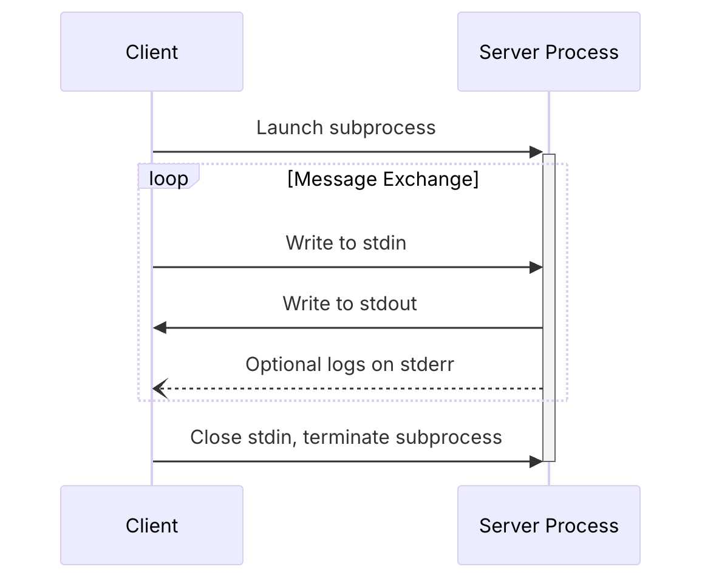



### Introdução

Como muitos de vocês, tenho mergulhado fundo no desenvolvimento assistido por IA. A jornada é muitas vezes uma montanha-russa de momentos "uau" e obstáculos frustrantes. Esta é a história de uma dessas jornadas — uma história que começou comigo tentando construir uma coisa, sendo completamente desviada por um problema frustrante, e terminando com uma ferramenta que melhorou fundamentalmente meu fluxo de trabalho assistido por IA.

Meu objetivo original era construir um servidor de Model Context Protocol (MCP) para o [osquery](https://www.osquery.io/), uma ferramenta que permite consultar o estado de uma máquina usando SQL. Eu estava animada para usar o Gemini CLI para me ajudar a escrever o código em Go. No entanto, rapidamente me deparei com um obstáculo. O código em Go que o agente produzia muitas vezes não era idiomático. Cometia erros de iniciante, criava abstrações excessivas e frequentemente "alucinava" APIs inteiras que não existiam. Minha suspeita era que o modelo subjacente não havia sido treinado no mais novo [SDK Go para MCP](https://github.com/modelcontextprotocol/go-sdk), então preferia inventar respostas a admitir que não sabia.

Essa experiência me levou a uma percepção chave: em vez de lutar contra a ferramenta, eu poderia *ensiná-la*. Decidi pausar meu projeto com o osquery e embarcar em uma "missão secundária": construir um servidor MCP dedicado cujo único propósito era ser um especialista em desenvolvimento Go. Este projeto paralelo, que eventualmente chamei de [GoDoctor](https://github.com/danicat/godoctor), forneceria as ferramentas que o Gemini CLI precisava para escrever um código Go melhor.

Neste post, vou guiá-los pela história da construção do GoDoctor. Isto é menos um tutorial tradicional e mais uma jornada "orientada por prompts". Focaremos em como traduzir os requisitos do projeto em prompts eficazes e guiar uma IA através dos detalhes da implementação, aprendendo com os erros inevitáveis ao longo do caminho.

### Preparando o Terreno: O `GEMINI.md`

Antes de escrever uma única linha de código, o primeiro passo foi estabelecer as regras básicas. Embora o `GEMINI.md` seja um arquivo específico do Gemini CLI, a prática de criar um arquivo de contexto é comum para muitos agentes de codificação de IA (por exemplo, o Jules usa `AGENTS.md` e o Claude usa `CLAUDE.md`). Na verdade, há um esforço emergente para padronizar isso com um arquivo chamado [`AGENT.md`](https://ampcode.com/AGENT.md). Este arquivo é crucial porque fornece à IA uma compreensão fundamental dos padrões do seu projeto e das suas expectativas para o comportamento dela.

Como este projeto era totalmente novo, eu não tinha nenhum detalhe arquitetônico específico para compartilhar ainda. Portanto, comecei com um conjunto genérico de diretrizes focadas na criação de código Go idiomático e de alta qualidade. À medida que um projeto evolui, é comum adicionar instruções mais específicas sobre a estrutura do projeto, comandos de compilação ou bibliotecas chave. Para um exemplo de um arquivo mais específico do projeto, você pode ver o `GEMINI.md` que uso para o meu projeto [`testquery`](https://github.com/danicat/testquery/blob/main/GEMINI.md).

Aqui está o `GEMINI.md` inicial que serviu como nossa constituição para a IA nesta jornada:

```markdown
# Diretrizes de Desenvolvimento em Go
Todo o código contribuído para este projeto deve aderir aos seguintes princípios.

### 1. Formatação
Todo o código Go **deve** ser formatado com `gofmt` antes de ser enviado.

### 2. Convenções de Nomenclatura
- **Pacotes:** Use nomes curtos, concisos e em letras minúsculas.
- **Variáveis, Funções e Métodos:** Use `camelCase` para identificadores não exportados e `PascalCase` para identificadores exportados.
- **Interfaces:** Nomeie as interfaces pelo que elas fazem (por exemplo, `io.Reader`), não com um prefixo como `I`.

### 3. Tratamento de Erros
- Erros são valores. Não os descarte.
- Trate os erros explicitamente usando o padrão `if err != nil`.
- Forneça contexto aos erros usando `fmt.Errorf("contexto: %w", err)`.

### 4. Simplicidade e Clareza
- "Claro é melhor do que inteligente." Escreva código que seja fácil de entender.
- Evite complexidade e abstrações desnecessárias.
- Prefira retornar tipos concretos, não interfaces.

### 5. Documentação
- Todos os identificadores exportados (`PascalCase`) **devem** ter um comentário de documentação.
- Os comentários devem explicar o *porquê*, não o *o quê*.

# Diretrizes do Agente
- **Leitura de URLs:** SEMPRE leia as URLs fornecidas pelo usuário. Elas não são opcionais.
```

Este arquivo estabelece uma base para qualidade e estilo desde o início.

### Entendendo o Model Context Protocol (MCP)

No coração deste projeto está o Model Context Protocol (MCP). Algumas pessoas o descrevem como um "padrão USB para ferramentas de LLM", mas eu gosto de pensar de outra forma: **o que o HTTP e o REST fizeram pela padronização de APIs web, o MCP está fazendo pelas ferramentas de LLM.** Assim como o REST forneceu uma arquitetura previsível que desbloqueou um ecossistema massivo de serviços web, o MCP está fornecendo uma linguagem comum muito necessária para o mundo dos agentes de IA. É um protocolo baseado em JSON-RPC que cria um terreno comum, permitindo que qualquer agente que "fale" MCP descubra e use qualquer ferramenta compatível sem a necessidade de uma integração personalizada e única.

O protocolo define diferentes maneiras para o agente e o servidor de ferramentas se comunicarem, conhecidas como transportes. Os dois mais comuns são:
*   **HTTP:** O modelo familiar de requisição/resposta, ideal para ferramentas implantadas como serviços remotos (por exemplo, no [Cloud Run](https://cloud.google.com/run?utm_campaign=CDR_0x72884f69_default_b421852297&utm_medium=external&utm_source=blog)).
*   **stdio:** Um transporte mais simples que usa a entrada e saída padrão, perfeito para executar uma ferramenta como um processo local em sua máquina.

Com o transporte `stdio`, o agente e o servidor trocam uma série de mensagens JSON-RPC. O processo começa com um aperto de mão (handshake) de três vias crucial para estabelecer a conexão. Somente após a conclusão deste handshake, o cliente pode começar a fazer chamadas de ferramentas.

A sequência se parece com isto:


*<p align="center">Figura 1: Diagrama de sequência do transporte stdio da documentação oficial do MCP (2025-06-18).</p>*

Aqui está como as mensagens JSON para esse handshake inicial se parecem, com base na especificação oficial:

**1. Cliente → Servidor: Requisição `initialize`**
O cliente inicia a conversa enviando uma requisição `initialize`.
```json
{
  "jsonrpc": "2.0",
  "id": 1,
  "method": "initialize",
  "params": {
    "protocolVersion": "2025-06-18",
    "clientInfo": {
      "name": "Gemini CLI",
      "version": "1.0.0"
    }
  }
}
```

**2. Servidor → Cliente: Resultado de `initialize`**
O servidor responde com um resultado, confirmando a versão do protocolo e anunciando suas capacidades e informações. Esta é a resposta real do binário `godoctor`:
```json
{
  "jsonrpc": "2.0",
  "id": 1,
  "result": {
    "capabilities": {
      "completions": {},
      "logging": {},
      "tools": {
        "listChanged": true
      }
    },
    "protocolVersion": "2025-06-18",
    "serverInfo": {
      "name": "godoctor",
      "version": "0.2.0"
    }
  }
}
```

**3. Cliente → Servidor: Notificação `initialized`**
Finalmente, o cliente reconhece que a configuração está completa enviando uma notificação `initialized`. Note que esta é uma notificação, então não tem um campo `id`, e o método está em um namespace.
```json
{
  "jsonrpc": "2.0",
  "method": "notifications/initialized",
  "params": {}
}
```

Uma vez que esta troca esteja completa, a sessão é estabelecida, e o cliente pode prosseguir com as chamadas de ferramentas. Por exemplo, para pedir ao servidor uma lista de suas ferramentas disponíveis, você pode enviar uma requisição `tools/list`. A chave é que todas as três mensagens de handshake devem ser enviadas na ordem correta antes desta requisição.

Você pode ver a sequência completa em ação com este script de shell:
```bash
#!/bin/bash
(
  echo '{"jsonrpc":"2.0","id":1,"method":"initialize","params":{"protocolVersion":"2025-06-18","clientInfo":{"name":"Manual Test Client","version":"1.0.0"}}}';
  echo '{"jsonrpc":"2.0","method":"notifications/initialized","params":{}}';
  echo '{"jsonrpc":"2.0","id":2,"method":"tools/list","params":{}}';
) | godoctor
```

Enviar este script para o binário `godoctor` produz o resultado de `initialize` primeiro, seguido pelo resultado de `tools/list`, que lista corretamente todas as ferramentas do GoDoctor. Entender este fluxo de três passos foi a chave para resolver meu maior obstáculo inicial, que descreverei na próxima seção.

Para quem é novo no MCP, recomendo fortemente a leitura da documentação oficial. Os dois documentos que foram mais cruciais para mim foram as páginas sobre o [ciclo de vida cliente/servidor](https://modelcontextprotocol.io/specification/2025-06-18/basic/lifecycle) e a [camada de transporte](https://modelcontextprotocol.io/specification/2025-06-18/basic/transports). (Ou se você estiver com preguiça, dê essas URLs para o CLI e faça ele ler para você =^_^=)

### A Primeira Conquista: Um Agente que Lê a Documentação

Meu primeiro objetivo era resolver o problema de alucinação de API. Como muitas primeiras tentativas de prompt, meu pedido inicial foi simples e um pouco vago:

> "Crie um servidor MCP em Go que tenha uma ferramenta chamada `godoc`. Esta ferramenta deve receber o nome de um pacote e, opcionalmente, o nome de um símbolo e executar o comando `go doc`."

Os resultados não foram ótimos. O agente passou muito tempo tentando descobrir quais ferramentas usar e qual protocolo era o melhor. Até mesmo a sigla "MCP" não era um conceito óbvio para ele; muitas vezes inferia que significava coisas diferentes antes de eu esclarecer que era "Model Context Protocol". Ele ficou preso em ciclos chamando a Busca Google e o WebFetch, tentando diferentes SDKs, falhando em produzir um exemplo funcional, e então mudando para outro SDK, repetidamente. É aqui que o verdadeiro trabalho de "vibe coding" começa. É um processo iterativo de refinar suas instruções. Após algumas horas de tentativa e erro, cheguei a um prompt muito mais eficaz. Aprendi que fornecer recursos específicos e de alta qualidade era a chave.

Aqui está o prompt final, muito melhorado:

> Sua tarefa é criar um servidor de Model Context Protocol (MCP) para expor o comando go doc, dando aos LLMs a capacidade de consultar a documentação do Go. A ferramenta deve se chamar go-doc e deve receber dois argumentos: package_path (obrigatório) e symbol_name (opcional). Para a parte da documentação, use o comando de shell `go doc`. Para a implementação do MCP, você deve usar o SDK oficial do Go para MCP e escrever um servidor MCP pronto para produção que se comunique através de um transporte stdio. Você também deve criar um cliente CLI simples para me permitir testar o servidor.
>
> Leia estas referências para coletar informações sobre a tecnologia e a estrutura do projeto antes de escrever qualquer código:
> - https://github.com/modelcontextprotocol/go-sdk
> - https://modelcontextprotocol.io/specification/2025-06-18/basic/lifecycle
> - https://go.dev/doc/modules/layout

Este prompt é melhor por várias razões: ele especifica o SDK exato a ser usado, dita o transporte (`stdio`), e o mais importante, dá ao agente uma lista de leitura. Ao fornecer links para o código-fonte do SDK e a especificação do MCP, reduzi drasticamente a tendência do agente a alucinar.

Mesmo com este prompt melhor, a jornada não foi tranquila. O maior obstáculo apareceu quando tentei usar o transporte simples `stdio`. Minhas chamadas de ferramenta falhavam consistentemente com um erro enigmático: `a inicialização do servidor não está completa`. Após muita depuração dolorosa, descobri que o problema não estava no código do meu servidor. A questão era que o transporte `stdio` do MCP requer o handshake específico de três passos que detalhei acima. Meu cliente estava tentando chamar a ferramenta antes que o handshake estivesse completo. Essa experiência me ensinou uma lição valiosa: quando você está construindo ferramentas para IA, você não está apenas depurando código, está depurando o próprio protocolo de conversação.

Uma vez que o servidor estava funcionando e falando o protocolo corretamente, a próxima peça do quebra-cabeça era apresentá-lo ao Gemini CLI. Isso é feito por um arquivo `.gemini/settings.json` na raiz do projeto, que diz ao CLI quais ferramentas carregar. Adicionei a seguinte configuração a ele:

```json
{
  "mcpServers": {
    "godoctor": {
      "command": "./bin/godoctor"
    }
  }
}
```

Com isso no lugar, toda vez que eu iniciava o Gemini CLI neste diretório, ele lançava automaticamente meu servidor `godoctor` em segundo plano e disponibilizava suas ferramentas para o agente.

### Criando um Loop de Feedback com um Revisor de Código de IA

Com uma ferramenta `godoc` funcional, o próximo passo lógico era ensinar o agente não apenas a ler sobre código, mas a raciocinar sobre sua qualidade. Isso levou à ferramenta `code_review`. A experiência desta vez foi muito mais tranquila, um resultado direto do trabalho que já havíamos feito.

Meu prompt estava focado no objetivo, não na implementação:

> Eu quero adicionar uma nova ferramenta ao meu projeto chamada code_review. Esta ferramenta deve usar a API Gemini para analisar o código Go e fornecer uma lista de melhorias em formato json de acordo com as melhores práticas aceitas pela comunidade Go. A ferramenta deve receber o conteúdo do código Go e uma dica opcional como entrada...
>
> Use este SDK para chamar o Gemini: https://github.com/googleapis/go-genai

O agente ainda teve que aprender o SDK `genai` do Go, mas desta vez ele tinha nossa ferramenta `godoc` em sua caixa de ferramentas. Eu podia vê-lo usando a ferramenta para pesquisar o SDK, corrigir seus próprios erros e aprender em tempo real. O processo ainda era iterativo, mas foi significativamente mais rápido e eficiente.

O resultado mais importante não foi apenas a ferramenta em si, mas a nova capacidade que ela desbloqueou. Pela primeira vez, eu podia usar a ferramenta para revisar seu próprio código, desbloqueando outro nível de desenvolvimento orientado por IA. **Eu havia criado um loop de feedback positivo.**

Meu fluxo de trabalho agora tinha um novo passo poderoso. Depois que o agente gerava um novo pedaço de código, eu podia imediatamente pedir para ele criticar seu próprio trabalho:

> "Agora, use a ferramenta `code_review` no código que você acabou de escrever e aplique as sugestões."

O agente então analisaria sua própria saída e a refatoraria com base no feedback gerado pela IA. Este é o verdadeiro poder de construir ferramentas para IA: você não está apenas automatizando tarefas, está criando sistemas para autoaperfeiçoamento.

### O Capítulo Final: Implantando na Nuvem


Se você implantar seu próprio servidor MCP no Cloud Run, certifique-se de ter configurado a autenticação adequada. **Não implante um servidor acessível publicamente**, especialmente se ele usar uma chave de API Gemini. Um endpoint público pode ser explorado por atores mal-intencionados, levando potencialmente a uma conta de nuvem muito grande e inesperada.


Uma ferramenta local rodando sobre `stdio` é ótima para uso pessoal, mas o objetivo do Model Context Protocol é criar um ecossistema de ferramentas compartilhadas e detectáveis. A próxima fase desta "missão secundária" foi levar o GoDoctor de um binário local no meu laptop para um serviço web escalável usando o [Google Cloud Run](https://cloud.google.com/run?utm_campaign=CDR_0x72884f69_default_b421852297&utm_medium=external&utm_source=blog).

Isso significava ensinar ao agente duas novas habilidades para o desenvolvimento em nuvem: como conteinerizar uma aplicação e como implantá-la.

Primeiro, precisávamos mudar do transporte simples `stdio` para `HTTP`. Meu prompt foi direto, com base em nosso trabalho anterior:

> "É hora de levar nosso servidor para a web. Por favor, refatore o servidor MCP do transporte `stdio` para usar o transporte `streamable HTTP`."

Com o servidor agora falando HTTP, o próximo passo era empacotá-lo para a nuvem. Pedi ao agente para criar um `Dockerfile` de múltiplos estágios, pronto para produção, que é a maneira padrão de construir imagens de contêiner leves e seguras.

> "Por favor, crie um Dockerfile de múltiplos estágios que compile o binário Go e o copie para uma imagem mínima `golang:1.24-alpine`."

Com o `Dockerfile` definido, era hora da implantação. Este é o momento em que a prova de conceito local se torna uma peça real de infraestrutura em nuvem.

> "Agora, por favor, implante esta imagem no Cloud Run. Implante-a em `us-central1` e use o projeto atualmente configurado no ambiente. Quando terminar, me dê a URL que posso usar para chamar a ferramenta MCP."

O agente forneceu os comandos `gcloud` corretos e, após alguns minutos, o GoDoctor estava no ar na internet. Para completar a configuração, eu precisava informar ao meu Gemini CLI local sobre o servidor remoto. Isso significava atualizar o arquivo `.gemini/settings.json`, trocando o `command` local pelo `httpUrl` remoto:

```json
{
  "mcpServers": {
    "godoctor": {
      "httpUrl": "https://<your-cloud-run-url>.run.app"
    }
  }
}
```

E assim, meu CLI estava usando uma ferramenta que foi implantada e estava rodando na nuvem. Este foi o momento em que a prova de conceito pareceu verdadeiramente completa. O processo iterativo de guiar o agente valeu a pena, levando uma ideia simples através de todo o ciclo de vida de uma aplicação moderna — de um conceito local a um serviço nativo da nuvem e escalável.

Dito isso, para o meu trabalho do dia-a-dia, estou usando a versão `stdio` — para uma equipe de uma pessoa, implantar no Cloud Run é simplesmente um exagero.

### Minhas Principais Lições do Vibe Coding com o GoDoctor

Esta jornada foi menos sobre escrever código e mais sobre aprender a colaborar eficazmente com uma IA. Minha maior lição foi mudar minha mentalidade de "programadora" para "professora" ou "piloto". Aqui estão algumas das lições mais importantes que aprendi:

*   **Você é o piloto.** A IA é uma colaboradora poderosa, mas ainda é uma ferramenta. Se ela propor uma ação com a qual você não concorda, não hesite em pressionar `ESC` para cancelar e fornecer um novo prompt para guiá-la na direção certa.
*   **Um pequeno lembrete vale muito.** Em uma conversa longa, uma IA pode perder o rastro de uma instrução anterior. Em vez de repetir todo o prompt original, um lembrete curto e direcionado geralmente é tudo o que é necessário para trazê-la de volta aos trilhos (por exemplo, "Lembre-se, estamos usando o transporte `stdio`").
*   **Mantenha a IA informada.** É melhor deixar o agente realizar todo o trabalho, mas às vezes uma edição manual é necessária. Quando você mesmo altera o código, o contexto da IA fica desatualizado. Certifique-se de informá-la sobre o que você mudou para que ela possa permanecer sincronizada com a base de código.
*   **Quando tudo mais falhar, desligue e ligue novamente.** No caso (não tão) raro de a IA ficar completamente presa, a solução clássica de TI funciona maravilhas. Para o Gemini CLI, isso significa usar o comando `/compress` para condensar o histórico da conversa ou, em casos extremos, reiniciar o CLI para começar com um contexto limpo.

Ao dar ao agente o contexto certo e as ferramentas certas, ele se tornou um parceiro muito mais capaz. A jornada se transformou de eu simplesmente tentando fazer com que o código fosse escrito, para eu construindo um sistema que pudesse aprender e se aprimorar.

### O Que Vem a Seguir?

A jornada com o GoDoctor está longe de terminar. Ainda é um projeto experimental, e estou aprendendo mais a cada nova ferramenta e cada nova interação. Meu objetivo é continuar a evoluí-lo para um assistente de codificação genuinamente útil para desenvolvedores Go em todos os lugares.

Para os interessados em como esses conceitos estão sendo aplicados na cadeia de ferramentas oficial do Go, recomendo fortemente a leitura sobre o servidor MCP `gopls`, que compartilha muitos dos mesmos objetivos. Você pode encontrar mais informações no [site oficial de documentação do Go](https://tip.golang.org/gopls/features/mcp).

### Recursos e Links

Aqui estão alguns dos principais recursos que mencionei ao longo deste post. Espero que sejam tão úteis para você quanto foram para mim.

*   **[Repositório do Projeto GoDoctor](https://github.com/danicat/godoctor):** O código-fonte completo da ferramenta que discutimos.
*   **[Página Inicial do Model Context Protocol](https://modelcontextprotocol.io/):** O melhor ponto de partida para aprender sobre o MCP.
*   **[Especificação do MCP (2025-06-18)](https://modelcontextprotocol.io/specification/2025-06-18):** A especificação técnica completa.
*   **[Documentação do Ciclo de Vida do MCP](https://modelcontextprotocol.io/specification/2025-06-18/basic/lifecycle):** Uma leitura crucial para entender o handshake cliente/servidor.
*   **[Documentação de Transporte do MCP](https://modelcontextprotocol.io/specification/2025-06-18/basic/transports):** Essencial para entender a diferença entre os transportes `stdio` e `http`.