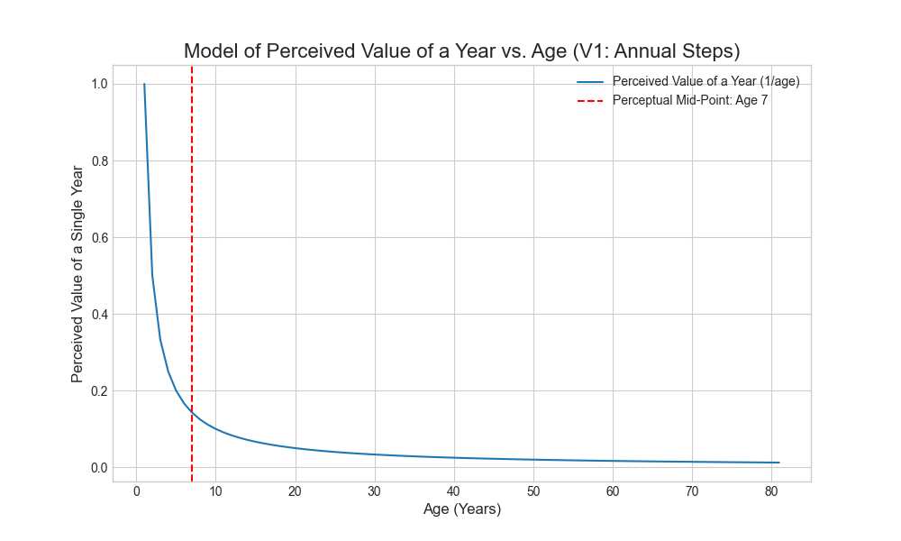
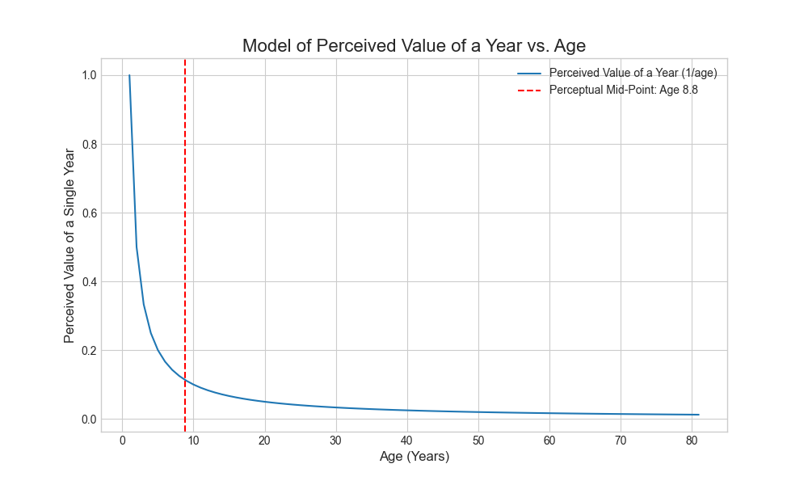

---categories:
- Perspectives
date: 2025-08-11
summary: 年齢を重ねるにつれて時間が速く感じられるのはなぜか。シンプルな数理モデルを用いて、私たちが知覚する人生の時間の構造と、その背後にある驚くべき真実を探求します。
tags:
  - reflection
title: "体感時間の数理モデル：なぜ年齢とともに時間は加速するのか"
slug: "a-model-for-perceived-time"
aliases:
  - "/ja/posts/20250811-a-model-for-perceived-time/"
description: "反比例モデル（1/年齢）とPythonシミュレーションで体感時間の加速を解明する数理エッセイ。81年の生涯における体感の中間地点が9歳になる理由を解説。"
proficiencyLevel: "Beginner"
dependencies:
  - "Python 3"
  - "NumPy"
  - "Matplotlib"
---

## はじめに

大人になると、「年齢を重ねるほど時間の経過が速くなる」とよく実感します。ひとつの夏、1年、あるいは10年という歳月でさえ、子どもの頃に感じていた長さのほんの一瞬で過ぎ去っていくように思えます。私の仮説はこうです。この現象は単なる気のせいではなく、私たちの脳が時間を知覚する仕組みから生じる、測定可能な必然であるということです。1年という時間は固定された経験の単位ではなく相対的なものであり、私たちが生きてきた総時間に対する割合として、その体感の長さが縮小していくのです。

ずっとこの疑問が頭から離れず、夜中の3時にふと目が冴えてしまうことが何度もありました。しかし、これまできちんとモデル化して考察するほどの数学的厳密さや気力はありませんでした。――今日、数学の計算を頼れるLLMインターンたちに任せてみるまでは。これから紹介するのは、その探求の記録です。

本稿は、このアイデアに対する個人的かつ技術的な探求です。抽象的な感覚にとどまらず、時間の知覚的な加速を定量化するシンプルな数理モデルを構築することを目指しました。そしてこの探求は、私たちの人生の構造と、幼少期の経験が持つ極めて大きな意味についての、明確で深く考えさせられる結論へとたどり着きました。

## 前提の整理：シンプルなモデル

知覚される時間の経過をモデル化するにあたり、まずはシンプルな関係性から出発します。「ある1年間の体感的な重み（知覚価値）は、その時点の年齢に反比例する」という関係です。数式で表すと、1年の重みは `1/age`（1/年齢）として表現できます。

この観点から見ると：
-   人生の最初の1年間（1歳時）は、それまでに生きてきた全経験の100%に相当します（`1/1`）。
-   2年目（2歳時）は全経験の50%（`1/2`）。
-   42歳になる頃には、1年が人生全体に占める割合はわずか約2.4%（`1/42`）にすぎません。

このモデルが示唆しているのは、私たちの時間認識が線形（リニア）ではなく対数的（ログスケール）であるということです。1年が経過するごとに、蓄積された総経験に占める割合は次第に小さくなり、その結果として「時間がどんどん加速している」という錯覚が生じます。これは簡略化したモデルではありますが、記憶や経験の構造を考察する上で非常に有用な枠組みを与えてくれます。

## 数理モデルによるアプローチ

純粋に数学的なアプローチを好む方に向けて、離散的な分数を個別に足し合わせることなく、人生の体感的な折り返し地点（中間点）を導き出す方法を見てみましょう。ある年齢 `t` までの累積知覚時間は、関数 \[ f(x) = 1/x \] を `x=1` から `t` まで積分することでモデル化できます。


\[ f(x) = 1/x \implies \int_{1}^{t} f(x) \, dx = \ln(t) \]

この積分の結果は、`t` の自然対数、すなわち `ln(t)` となります。

したがって、寿命 `L` を通じた総体感経験量は `ln(L)` で表されます。中間点 `M` は、累積知覚時間が総量のちょうど半分（50%）に達する年齢です。これにより、次の方程式が得られます。


\[ \ln(M) = \frac{\ln(L)}{2} \]

これを `M` について解くと、次のようになります。


\[ M = L^{1/2} \implies M = \sqrt{L} \]

ここから極めて明快な結論が導かれます。**「人生の体感的な折り返し地点は、寿命の平方根（ルート）である」** ということです。たとえば81歳まで生きるとした場合、人生の体感的な中間点はちょうど **9歳** になります。この数学的な解析解は、後述するシミュレーションスクリプトのベンチマークとなります。

もちろん寿命が延びれば折り返し地点もそれに応じて上がりますが、このモデルの対数的な性質上、その変化はごくわずかです。たとえば寿命が100歳であっても、中間点は10歳にしかなりません。

## 探求のプロセス：体感時間の計算と可視化

### 最初の試み：年単位の単純な離散和

このモデルが持つ意味を探るため、まず各年の離散値（`1/age`）を単純に足し合わせ、体感的な中間点を算出するPythonスクリプトを作成しました。この概念をコードへと落とし込む最もストレートな方法です。関連するコードは以下の通りです。



このスクリプトを実行すると、81年の寿命に対して体感的な中間点は **7歳** という結果が出ました。

しかし、この結果には問題がありました。数理モデルが予測した「9歳」に近いものの、約22%もの誤差は無視できません。この乖離が生じた原因は、年単位の単純な離散和が、積分が表す滑らかで連続的な曲線の「粗い近似」にすぎないためです。特に最初の項（`age=1`）の影響が極端に大きく出すぎてしまい、計算全体が手前に歪んでしまったのです。

### 第2の試み：月単位へのモデルの改善

より正確なシミュレーションを行うため、**月単位のタイムステップ**を用いるようスクリプトを改良しました。各月の知覚価値（`(1/12) / age_in_months`）を積算していくことで、連続的な時間の体験をより高精度に近似できます。改良後の計算処理のコア部分は以下の通りです。



改良版のスクリプトを実行したところ、数理モデルの予測値とほぼ一致する **8.8歳** という体感的中間点が得られました。

このように仮説をモデル化し、反復的に改良を重ねていくプロセスこそ、エンジニアリングや技術的探求の本質です。最初の不完全な結果は失敗ではなく、モデルの本質的な特性を浮き彫りにし、より堅牢で正確な結論へと導くための不可欠なステップでした。

## 神経発達学との興味深い一致

「人生の体感時間は幼少期に偏重している（フロントロードされている）」という結論は、単なる数学的な好奇心にとどまりません。これは神経発達生物学の基礎的な知見とも驚くほど合致します。脳の学習や環境適応の能力は、**臨界期（critical period）** と呼ばれる幼少期に最も高くなります。

小児期から青年期にかけて、脳では **シナプス刈り込み（synaptic pruning）** と呼ばれるプロセスが活発に行われます。使われていない神経回路が整理・淘汰される一方で、頻繁に使われる回路が強化されていきます。この機構により脳の情報処理効率は飛躍的に高まりますが、同時に年齢とともに可塑性（柔軟に適応する力）は低下していきます。言語の習得や社会性の形成といった重要な発達段階には、脳が学習に対して例外的に受容的になる特定の「時間的ウィンドウ」が存在するのです。

人生の体感的な中間点が9歳前後に位置するという今回のモデルの算出結果は、まさにこの生物学的な現実を裏付けています。**脳の可塑性（brain plasticity）** がピークにある時期の経験は、単に主観的に強烈に感じられるだけでなく、その後の人生全体にわたって人格、スキル、世界観を支え続ける神経回路のアーキテクチャを物理的に形成しています。したがって、この数理モデルは「私たちが何者であるかの基盤は、人生の極めて早い段階に圧倒的な比重で構築される」という生物学的な真理を数式で表したものと言えます。

## モデルの限界と前提条件

当然ながら、このモデルは現実を抽象化・単純化したものであるという前提を認識しておく必要があります。その目的は人間の意識を厳密に解明することではなく、人生の捉え方を客観的に見つめ直すための思考フレームワークを提供することにあります。本モデルには、主に以下のような限界が存在します。

*   **経験の一様性（Uniformity of Experience）：** このモデルでは、すべての年が同じ質的重みを持つものとして扱われますが、現実は異なります。ルーティンに終始した1年は、新たな挑戦や旅行、人生の大きな転機に満ちた1年に比べて、体感される人生経験への寄与度は低くなります。
*   **記憶の性質と非線形性（The Nature of Memory）：** モデルは体感時間が一定のペースで蓄積されることを前提としています。しかし、人は多くの経験を忘却すること、また感情的な強度が時間の長さの認識を大きく歪めることなど、記憶の複雑なメカニズムは織り込まれていません。
*   **個人の主観性（Individual Subjectivity）：** 時間の知覚は極めて個人的な体験です。集中度合い、気分、文化的背景などの要因によって、時間の進み方は速くも遅くも感じられます。`1/age` の関係式はあくまで大局的な一般化（モデル化）であり、普遍的な物理法則ではありません。

## まとめ

この数理モデルは、神経発達に関する知見と組み合わせることで、私たちが時間とどう向き合っているかを理解するための強力なフレームワークを提供してくれます。その結果が示すものは明確です。私たちの人生の体感時間は、驚くほど前半に偏重しています。最初の9年間に経験する体感時間はその後の72年分に匹敵し、これは幼少期の極めて高い脳の可塑性とも一致しています。

ただし、これはあくまでモデルであり、人生の完全な設計図ではありません。人間の経験が持つ豊かな複雑さを単純化し、すべての年を均一に扱い、記憶の主観的な性質や新しい体験がもたらすインパクトを抽象化しています。

これらの限界を念頭に置いた上で得られる最大の教訓は、「諦観（運命論）」ではなく、「自覚と意識」です。このモデルは、幼少期・形成期の経験が持つ深く永続的な影響を、定量的な視点から再評価するきっかけを与えてくれます。私たちの世界観の基盤は、生物学的な受容性が最も高まっている人生のごく初期に築かれるのです。そして大人になった私たちにとって、このモデルは強力なリマインダーになります。年齢とともに1年あたりの体感的な重みが目減りしていくのに対抗するには、「新しく意味のある経験を主体的に追求し続けること」が不可欠であるということです。そうすることで、これから先の体感的な人生をより豊かで充実したものにできるのです。

## 参考リンク

-   **[NumPy](https://numpy.org/):** Pythonによる科学計算のための基本パッケージ。
-   **[Matplotlib](https://matplotlib.org/):** Pythonで静的・アニメーション・インタラクティブなグラフや可視化を作成するための包括的なライブラリ。
