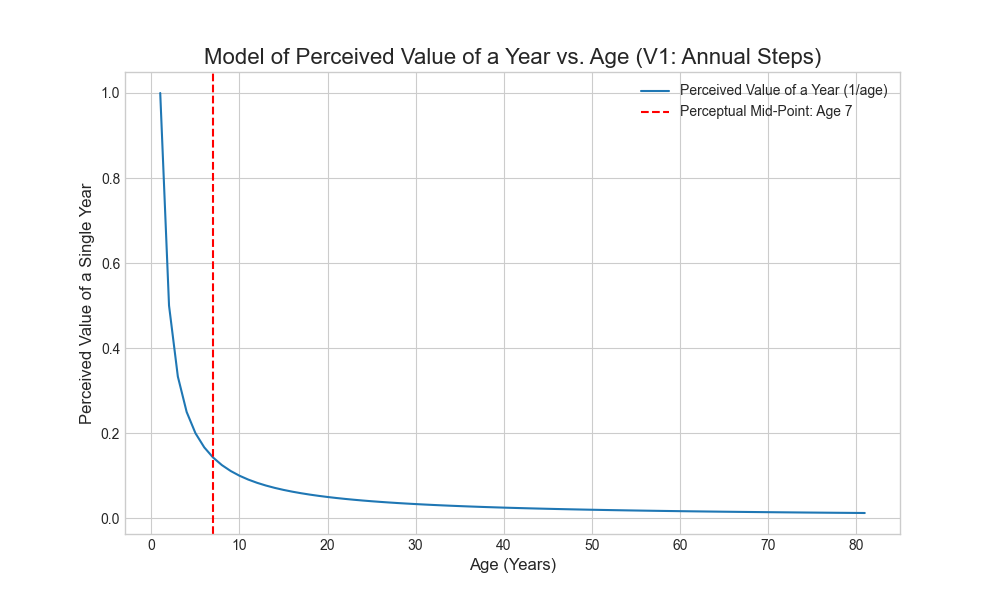



## はじめに

大人になると、時間が経つのが速く感じられるというのはよくある感想です。夏、一年、あるいは十年でさえ、かつて感じた時間の何分の一かで過ぎ去っていくように感じられます。私の仮説はこうです。この現象は単なる感覚ではなく、私たちの脳が時間をどのように知覚するかの測定可能な結果であるということです。一年は経験の固定された単位ではなく、相対的なものであり、私たちが生きてきた総時間に比例してその知覚される期間は縮小していきます。

この概念は常に私を悩ませ、夜中の3時に何度も目を覚まさせましたが、それを適切にモデル化するための数学的な厳密さや意欲を持ったことはありませんでした。今日までは。今日、私は数学を私のLLMインターンに委任することに決めました。そして、次にお見せするのは、この探求の結果です。

この記事は、このアイデアに関する個人的で技術的な探求です。私の目標は、抽象的な感覚を超えて、この知覚される時間の加速を定量化するための簡単な数理モデルを構築することでした。この旅は、私たちの人生の構造と、私たちの最も初期の経験の深い重要性についての、明確で考えさせられる結論へと導きました。

## 文脈設定：単純なモデル

知覚される時間の経過をモデル化するために、私たちは単純な関係から始めることができます。特定の年の知覚価値は、私たちの年齢に反比例します。数学的な言葉で言えば、1年の価値は`1/年齢`として表すことができます。

この観点から見ると：
-   人生の最初の1年間は、生きてきた経験の100%を占めます（`1/1`）。
-   2年目は50%を占めます（`1/2`）。
-   42歳になる頃には、1年間は人生の約2.4%しか占めません（`1/42`）。

このモデルは、私たちの時間認識が線形ではなく対数的であることを示唆しています。毎年が経過するごとに、私たちの総蓄積経験に占める割合は徐々に小さくなり、時間が速く進んでいるかのような錯覚を生み出します。これは単純化されたモデルですが、私たちの記憶と経験の構造を調べるための有用なフレームワークを提供します。

## 数理モデル

純粋に数学的なアプローチを好む人のために、人生の知覚的な中間点は、離散的な分数を合計することなく見つけることができます。特定の年齢`t`までの累積的な知覚時間は、関数\[ f(x) = 1/x \]の`x=1`から`t`までの積分によってモデル化できます。


\[ f(x) = 1/x \implies \int_{1}^{t} f(x) = \ln(t) \]

この積分の結果は、`t`の自然対数、つまり`ln(t)`です。

したがって、寿命`L`にわたる総知覚経験は`ln(L)`で与えられます。中間点`M`は、累積知覚時間が総計のちょうど半分になる年齢です。これにより、次の方程式が得られます。


\[ \ln(M) = \frac{\ln(L)}{2} \]

`M`について解くと、次のようになります。


\[ M = L^{1/2} \implies M = \sqrt{L} \]

これは直接的な結論を提供します：**あなたの人生の知覚的な中間点は、あなたの寿命の平方根です。** 81年の寿命の場合、これは知覚的な中間点を正確に**9歳**に置きます。この数学的な結果は、私たちのスクリプト化されたモデルのベンチマークとして機能します。

当然のことながら、長生きすれば中間点もそれに応じて移動しますが、このモデルの対数的な性質を考えると、それほど大きくは動きません。たとえば、100年の寿命であれば、中間点は10歳になります。

## 旅：知覚時間の計算と視覚化

### 最初の試み：単純な合計

このモデルの意味を探るため、私の最初のステップは、各年の離散値（`1/年齢`）を合計して知覚的な中間点を計算するPythonスクリプトを書くことでした。これは、概念をコードに最も直接的に変換する方法のように思えました。以下がスクリプトの関連部分です。



スクリプトは明確な結果を生成しました。81年の寿命の場合、知覚的な中間点は**7歳**で発生しました。

しかし、この結果には問題がありました。数理モデルの予測である9歳に近かったものの、22%の誤差は無視するには大きすぎました。この不一致は、単純な年間合計が、積分によって記述される滑らかで連続的な曲線の粗い近似であるために生じます。`age=1`の最初の項が過大な影響を与え、計算全体を歪めています。

### 2回目の試み：洗練されたモデル

より正確なシミュレーションを作成するために、私はスクリプトを改良して**月単位のタイムステップ**を使用するようにしました。各月の知覚価値（`(1/12)/age_in_months`）を合計することで、スクリプトは時間の連続的な経験のよりきめ細かい近似を構築できました。改良された計算の核心を以下に示します。



この新しいスクリプトは、数理モデルとほぼ一致する結果を生成しました。計算された知覚的な中間点は**8.8歳**です。

このモデリングと改良の反復プロセスは、技術的な作業の中核部分です。最初の欠陥のある結果は失敗ではなく、モデルに関するより深い真実を明らかにし、より堅牢で正確な結論につながる必要なステップでした。

## 神経発達における類似点

私たちの人生の知覚が前倒しであるという結論は、単なる数学的な好奇心ではありません。それは神経発達生物学の基礎的な概念と一致しています。学習と適応に対する脳の能力は、**臨界期**として知られる幼少期に最も高くなります。

小児期および青年期の間、脳は**シナプス刈り込み**のプロセスを経ます。このプロセスでは、未使用の神経接続が排除され、頻繁に使用される接続が強化されます。このプロセスは脳を非常に効率的にしますが、時間とともに可塑性、つまり適応性が低下します。言語習得や社会的行動の形成などの重要な発達には、脳が学習に対して独自に受容的である特定のウィンドウがあります。

私たちのモデルが人生の知覚的な中間点が9歳前後で起こることを発見したことは、この生物学的な現実を反映しています。この**脳の可塑性**のピーク時に起こる経験は、より重要に感じられるだけでなく、私たちの残りの人生における人格、スキル、世界観を支える神経構造を物理的に形成しています。したがって、このモデルは、私たちが誰であるかの基盤が不釣り合いに早く構築されるという生物学的な真実の数学的な表現と見なすことができます。

## モデルの限界

このモデルが単純化であることを認めることが重要です。その目的は、人間の意識の決定的な説明としてではなく、反省のためのフレームワークを提供することです。このモデルにはいくつかの重要な限界があります。

*   **経験の均一性：** このモデルは、すべての年を経験的な重みで等しいものとして扱いますが、現実にはそうではありません。日常的な年は、新しい出来事、旅行、または重要な人生の変化で満たされた年よりも、人の知覚される人生経験に貢献する可能性は低くなります。
*   **記憶の性質：** このモデルは、知覚された時間の着実な蓄積を前提としています。多くの経験を忘れ、出来事の感情的な強さがその持続時間の認識を変える可能性があるなど、記憶の複雑さを考慮していません。
*   **個人の主観性：** 時間の認識は、非常に個人的な経験です。注意、気分、文化的背景などの要因が、時間がどれだけ速くまたは遅く感じるかに影響を与える可能性があります。`1/age`の関係は、普遍的な法則ではなく、一般化です。

## 結論

数理モデルは、特に神経発達に関する私たちの理解と照らし合わせた場合、時間との関係を理解するためのフレームワークを提供します。結果は明らかです。私たちの人生の知覚は、非常に前倒しです。最初の9年間は、その後の72年間と同じくらい私たちの総知覚経験に貢献しており、これは私たちの若者の高まった脳の可塑性と一致しています。

しかし、これはモデルであり、人生の決定的な地図ではありません。それは人間の経験の豊かな複雑さを単純化し、すべての年を均一として扱い、記憶の主観的な性質や新しい経験の影響を考慮していません。

これらの限界を念頭に置くと、重要な教訓は運命論ではなく、認識です。このモデルは、私たちの形成期の深く永続的な影響を評価するための定量的なレンズを提供します。それは、私たちの世界観の基盤が、生物学的な受容性のピーク時に不釣り合いに早く構築されることを示唆しています。後年にいる私たちにとって、それは、年を重ねるにつれて、毎年経過するごとに減少する知覚価値を打ち消すために、新しく意味のある経験を追求することが不可欠であるという強力なリマインダーとして機能し、私たちが知覚する人生の残りの部分を意識的に豊かにすることを可能にします。

## リソースとリンク

-   **[NumPy](https://numpy.org/):** Pythonによる科学計算のための基本的なパッケージ。
-   **[Matplotlib](https://matplotlib.org/):** Pythonで静的、アニメーション、インタラクティブな視覚化を作成するための包括的なライブラリ。
