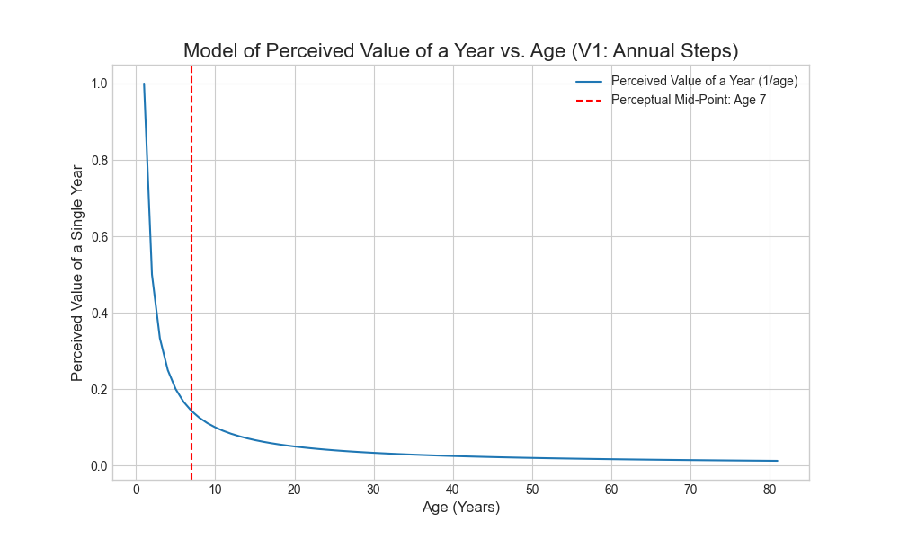
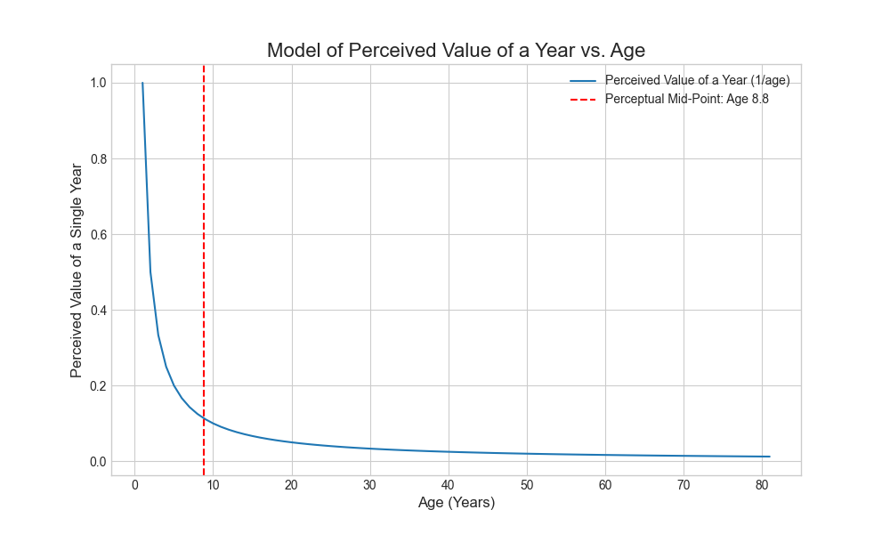

## Introduction

A common reflection in adulthood is that time seems to accelerate as we grow older. A summer, a year, even a decade can feel as though it passes in a fraction of the time it once did. My hypothesis: this phenomenon is not just a feeling; it is a measurable consequence of how our brains perceive time. A year is not a fixed unit of experience but a relative one, its perceived duration shrinking in proportion to the total time we have lived.

This concept always puzzled me, and it kept me awake at 3:00 am for more times than I can remember, but I never had the mathematical rigor or inclination to try to model it properly. This until today, when I decided to delegate the math to my LLM interns, and what you are going to see next are the results of this exploration.

This article is a personal, technical exploration of this idea. My goal was to move beyond the abstract feeling and build a simple mathematical model to quantify this perceived acceleration of time. The journey led to a clear, and thought-provoking, conclusion about the structure of our lives and the profound significance of our earliest experiences.

## Context-Setting: A Simple Model

To model the perceived passage of time, we can start with a straightforward relationship: the perceived value of any given year is inversely proportional to our age. In mathematical terms, the value of one year can be represented as `1/age`.

From this perspective:
-   The first year of life represents 100% of one's lived experience (`1/1`).
-   The second year represents 50% (`1/2`).
-   By age 42, a single year represents only about 2.4% of one's life (`1/42`).

This model suggests that our perception of time is not linear but logarithmic. Each passing year contributes a progressively smaller fraction to our total accumulated experience, creating the illusion that time is moving faster. While this is a simplified model, it provides a useful framework for examining the structure of our memories and experiences.

## The Mathematical Model

For those who prefer a purely mathematical approach, the perceptual mid-point of life can be found without summing discrete fractions. The cumulative perceived time up to a given age, `t`, can be modeled by the integral of the function \[ f(x) = 1/x \] from `x=1` to `t`:


\[ f(x) = 1/x \implies \int_{1}^{t} f(x) = \ln(t) \]

The result of this integral is the natural logarithm of `t`, or `ln(t)`.

Therefore, the total perceived experience over a lifespan, `L` is given by `ln(L)`. The mid-point, `M`, is the age at which the cumulative perceived time is exactly half of the total. This gives us the equation:


\[ ln(M) = \frac{\ln(L)}{2} \]

Solving for `M`, we find that:


\[ M = L^{1/2} \implies M = \sqrt{L} \]

This provides a direct conclusion: **the perceptual mid-point of your life is the square root of your lifespan.** For an 81-year lifespan, this puts the perceptual halfway point at exactly **age 9**. This mathematical result serves as a benchmark for our scripted model.

Naturally, if you live a longer life, the halfway point would move accordingly, but given the logaritmic nature of this model, not by much. For example, a lifespan of 100 years woud result in a halfway point at 10 years old.

## The Journey: Calculating and Visualizing Perceived Time

### First Attempt: A Simple Summation

To explore the implications of this model, my first step was to write a Python script that calculated the perceptual mid-point by summing the discrete value of each year (`1/age`). This seemed like the most direct translation of the concept into code. Here is the relevant part of the script:



The script produced a specific result: for an 81-year lifespan, the perceptual mid-point occurred at **age 7**.

However, this result presented a problem. It was close to the mathematical model's prediction of age 9, but a 22% error was too significant to ignore. The discrepancy arises because a simple annual summation is a coarse approximation of the smooth, continuous curve described by the integral. The first term, where `age=1`, has an outsized impact, skewing the entire calculation.

### Second Attempt: A Refined Model

To create a more accurate simulation, I refined the script to use **monthly time steps**. By summing the perceived value of each month (`(1/12)/age_in_months`), the script could build a much finer-grained approximation of the continuous experience of time. The core of the refined calculation is shown below:



This new script produced a result that aligned closely with the mathematical model: the calculated perceptual mid-point is **age 8.8**.

This iterative process of modeling and refinement is a core part of technical work. The initial, flawed result was not a failure but a necessary step that exposed a deeper truth about the model, leading to a more robust and accurate conclusion.

## Parallels in Neurodevelopment

The conclusion that our perception of life is front-loaded is not just a mathematical curiosity; it aligns with foundational concepts in neurodevelopmental biology. The brain's capacity for learning and adaptation is at its highest in early life, during what are known as **critical periods**.

During childhood and adolescence, the brain undergoes a process of **synaptic pruning**, where unused neural connections are eliminated, and frequently used connections are strengthened. This process makes the brain highly efficient but also less plastic, or adaptable, over time. Key developments, such as language acquisition and the formation of social behaviors, have specific windows during which the brain is uniquely receptive to learning.

Our model's finding that the perceptual mid-point of life occurs around age nine mirrors this biological reality. The experiences that occur during this period of peak **brain plasticity** do not just feel more significant; they are physically shaping the neural architecture that will underpin our personality, skills, and worldview for the rest of our lives. The model, therefore, can be seen as a mathematical representation of a biological truth: the foundations of who we are are built disproportionately early.

## Model Limitations

It is important to acknowledge that this model is a simplification. Its purpose is to provide a framework for reflection, not to serve as a definitive account of human consciousness. The model has several key limitations:

*   **Uniformity of Experience:** The model treats all years as equal in experiential weight, which is not the case in reality. A year of routine will likely contribute less to one's perceived life experience than a year filled with novel events, travel, or significant life changes.
*   **The Nature of Memory:** The model assumes a steady accumulation of perceived time. It does not account for the complexities of memory, such as the fact that we forget many experiences and that the emotional intensity of an event can alter our perception of its duration.
*   **Individual Subjectivity:** The perception of time is a deeply personal experience. Factors such as attention, mood, and cultural background can influence how quickly or slowly time feels. The `1/age` relationship is a generalization, not a universal law.

## Conclusion

The mathematical model, especially when cross-referenced with our understanding of neurodevelopment, provides a framework for understanding our relationship with time. The results are clear: our perception of life is heavily front-loaded. The first 9 years contribute as much to our total perceived experience as the subsequent 72 years, a finding that aligns with the heightened brain plasticity of our youth.

However, this is a model, not a definitive map of life. It simplifies the rich complexity of human experience, treating all years as uniform and not accounting for the subjective nature of memory or the impact of novel experiences.

With these limitations in mind, the key takeaway is not one of fatalism, but of awareness. The model provides a quantitative lens through which to appreciate the profound and lasting impact of our formative years. It suggests that the foundations of our worldview are built disproportionately early, during a period of peak biological receptiveness. For those of us in later years, it serves as a powerful reminder that the pursuit of new and meaningful experiences is essential to counteract the diminishing perceived value of each passing year, allowing us to consciously enrich the remaining portion of our perceived lives.

## Resources and Links

-   **[NumPy](https://numpy.org/):** The fundamental package for scientific computing with Python.
-   **[Matplotlib](https://matplotlib.org/):** A comprehensive library for creating static, animated, and interactive visualizations in Python.
