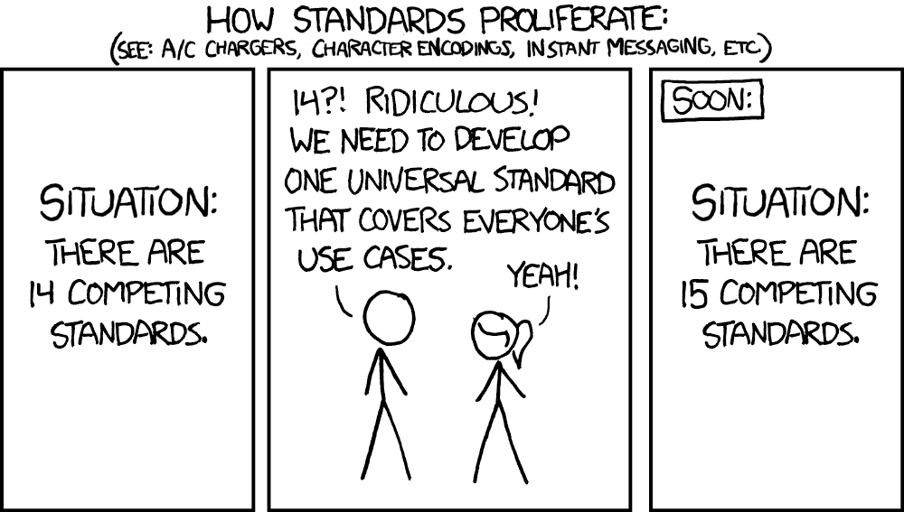
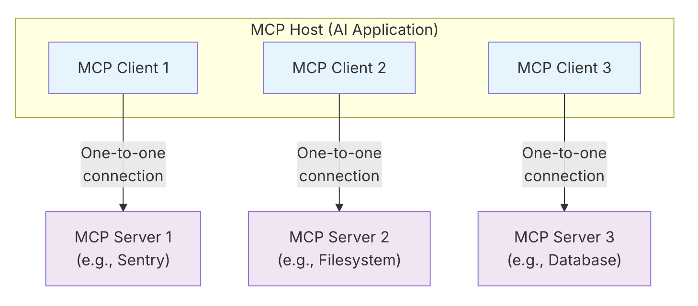

> This article is based on the keynote I delivered at Gophercon UK 2025 on August, 14. For the keynote slides please check this [link](https://speakerdeck.com/danicat/hello-mcp-world).

In this article, we are going to explore the Model Context Protocol (MCP), a protocol developed by Anthropic to standardise the communications between Large Language Models (LLMs) and applications.

To build a clear understanding, we'll start with the fundamentals, then explain the main architectural components illustrating with practical examples from servers I've implemented along my own learning journey. Finally, we are going to see how you can write your own server using the Go SDK for MCP through a simple, "vibe-coded" example using the Gemini CLI.

Whether this is the first time you are hearing about this protocol, or you have already written a server or two, this article aims to provide helpful information for various levels of experience.

## A New Standard is Born

Whenever we talk about standards, this XKCD comic is the first thing that comes to my mind:


*Source: [xkcd.com](https://xkcd.com/927)*

Funny enough, this might be the first time in the industry that this joke doesn't entirely apply (at least for now). Luckily for us, the industry quickly converged to MCP as the standard for adding context to LLMs.

From the specification, MCP is:

> MCP is an open protocol that standardizes how applications provide context to large language models (LLMs). Think of MCP like a USB-C port for AI applications. Just as USB-C provides a standardized way to connect your devices to various peripherals and accessories, MCP provides a standardized way to connect AI models to different data sources and tools. MCP enables you to build agents and complex workflows on top of LLMs and connects your models with the world.

While I understand the analogy with USB-C, I prefer to think of MCP as the new HTTP/REST. Just as HTTP provided a universal language for web services to communicate, MCP provides a common framework for AI models to interact with external systems. As engineers, we have spent roughly the last two decades making everything "API-first", enabling our software systems to become interconnected and powering new levels of automation. Maybe it won't be for the next 20 years, but I believe that for the next 5 to 10 years we will spend quite a lot of engineering power to retrofit all those systems (and creating new ones) to become AI-enabled, and MCP is a key compoenent of this process.

## MCP Architecture

This diagram represents the MCP architecture:


*Source: [MCP Specification](https://modelcontextprotocol.io/docs/learn/architecture)*

The main components of the MCP architecture are:

*   **MCP Host:** The main AI application, like your IDE or a coding agent. The host communicates with MCP servers using clients.
*   **MCP Server:** A process that provides access to some capability.
*   **MCP Client:** The bridge that connects the host to a single server.

## MCP Layers

The communication happens over two layers:

* **Data layer**: is a JSON-RPC based protocol. You can see examples of the message format in the next section.
* **Transport layer**: defines the communication channels, the main ones being:
  - Standard I/O: for local servers
  - Streamable HTTPS: for communications over the network. (Replaces HTTPS+SSE).
  - HTTPS+SSE: deprecated in the last version of the spec for security concerns.

## Initialization Flow

The client and server perform a handshake to establish a connection. This involves three key messages:

1.  The client sends an `initialize` request to the server, specifying the protocol version it supports.
2.  The server confirms initialization with a `notifications/initialized` message.
3.  The client can then begin making requests, such as `tools/list`, to discover the server's capabilities.

This is how the initialization flow looks on the wire using the JSON-RPC representation:

```json
{"jsonrpc":"2.0","id":1,"method":"initialize","params":{"protocolVersion":"2025-06-18"}}
{"jsonrpc":"2.0","method":"notifications/initialized","params":{}}
{"jsonrpc":"2.0","id":2,"method":"tools/list","params":{}}
```
Please note that you can't simply send a "tools/list" or "tools/call" message directly, or you are going to receive a "server not ready" type of error.

If I am coding an MCP server via a coding agent, like for example Gemini CLI, I often instruct them to send those messages via shell like this:

```sh
(
  echo '{"jsonrpc":"2.0","id":1,"method":"initialize","params":{"protocolVersion":"2025-06-18"}}';
  echo '{"jsonrpc":"2.0","method":"notifications/initialized","params":{}}';
  echo '{"jsonrpc":"2.0","id":2,"method":"tools/list","params":{}}';
) | ./bin/godoctor
```

I like to do this to make sure the implementation is sound, as before I fully understood this flow my coding agents would often make wrong assumptions like "the server needs more time to boot up, so I'm going to add a sleep before the tool call". The sooner you teach your coding agent how to properly communicate with the MCP server you are developing the better!

## The Building Blocks of an MCP Server

At its core, an MCP server's functionality is exposed through three fundamental building blocks, sometimes also called "primitives" or "server concepts":

| Building Block | Purpose                  | Who Controls It         | Real-World Example                               |
| :------------- | :----------------------- | :---------------------- | :----------------------------------------------- |
| **Tools**      | For AI actions           | Model-controlled        | Search flights, send messages, review code       |
| **Resources**  | For context data         | Application-controlled  | Documents, calendars, emails, weather data       |
| **Prompts**    | For interaction templates| User-controlled         | "Plan a vacation," "Summarize my meetings"       |

Let's have a closer look at each one of those.

### Tools

Tools are functions that allow an AI model to perform actions, for example, exposing an API, database or command-line tool.

The server I wrote to experiment with the concept of tools is called GoDoctor, which is designed to provide tools to improve the capabilities of LLMs at writing Go code. The name GoDoctor comes as a play with the command-line tool "go doc" that exposes documentation about Go packages.

My hypothesis was that by giving the correct documentation, LLMs would hallucinate less and write better code. Or at least, they would have the resources to learn and self-correct their mistakes.

The implementation of tools consists of two main components: registering the tool with your MCP server and implementing a handler.

The registration is made using the function `mcp.AddTool`:



The handler is an adapter that calls an API, command or function and returns the response in a way that is compatible with the protocol (an `mcp.CallToolResult` struct).

Here is the handler for the documentation tool for GoDoctor:



### Prompts

Prompts provide reusable, user-controlled templates that can be parameterized. They often show up as slash commands in an AI agent, allowing a user to invoke a complex workflow with a simple command.

To see this in action, let's look at a different MCP server I wrote called `speedgrapher`, which is a collection of prompts and tools to help with my technical writing.

One of the simplest prompts in `speedgrapher` is `/haiku`. Just like with tools, the process involves defining the prompt and then implementing a handler for it.



### Resources

Resources expose data from files, APIs, or databases, providing the context an AI needs to perform a task. Conceptually, a Tool is for taking an action, while a Resource is for providing information.

That said, in the real world I haven't seen a good implementation of resources yet, as most developers are using tools to expose data (as you would in an API with a GET request). I think this is one of the cases where the spec might be trying to be too clever, but maybe in the future we are going to see good uses for resources once the community gets more comfortable with them.

## Client Concepts

The protocol also defines **Client Concepts**, which are capabilities the server can request from the client. These include:

*   **Sampling:** Allows a server to request LLM completions from the client's model. This is promising from a security and billing perspective, as server authors don't need to use their own API keys to call models.
*   **Roots:** A mechanism for a client to communicate filesystem boundaries, telling a server which directories it is allowed to operate in.
*   **Elicitation:** A structured way for a server to request specific information from the user, pausing its operation to gather input when needed.

This is another case where most real-world applications I have explored haven't caught up with the spec yet, including both servers and clients. It might take a while until we get these features widely available. It is one of the problems with working with bleeding edge technology... For example, Gemini CLI added roots support about one week ago: https://github.com/google-gemini/gemini-cli/pull/5856

## Live Demo: Vibe Coding an MCP Server

Here is a prompt you can give to your favourite coding agent to produce a "Hello World" kind of server. As agents nowadays are non-deterministic, it might not work 100% on the first try and you might need to guide the LLM with a few extra prompts after the initial one, but it is a good start:

```text
Your task is to create a Model Context Protocol (MCP) server to expose a "hello world" tool. For the MCP implementation, you should use the official Go SDK for MCP and use the stdio transport.

Read these references to gather information about the technology and project structure before writing any code:
- https://raw.githubusercontent.com/modelcontextprotocol/go-sdk/refs/heads/main/README.md
- https://go.dev/doc/modules/layout

To test the server, use shell commands like these:
`( echo '{"jsonrpc":"2.0","id":1,"method":"initialize","params":{"protocolVersion":"2025-06-18"}}' ; echo '{"jsonrpc":"2.0","method":"notifications/initialized","params":{}}'; echo '{"jsonrpc":"2.0","id":2,"method":"tools/list","params":{}}'; ) | ./bin/hello`
```

If the agent is successful completing this task, ask it to execute a "method tools/call" to your new tool to see the results!

## A Peek at the Future

The Go community is actively investing in the MCP ecosystem. Two key projects to watch are:

*   **The Go SDK for MCP:** The official SDK I used in the demo, which is a partnership between Google and Anthropic. You can find it at [github.com/modelcontextprotocol/go-sdk](https://github.com/modelcontextprotocol/go-sdk).
*   **MCP Support for `gopls`:** The Go language server, `gopls`, is gaining MCP support, which will bring even deeper AI integrations into the Go development experience. You can follow its progress at [tip.golang.org/gopls/features/mcp](https://tip.golang.org/gopls/features/mcp).

## Useful MCP Servers

The ecosystem of MCP servers is growing. Besides the ones I've built, there are many others available that you can use to enhance your workflows. Here are a couple of notable examples:

*   **Playwright:** Maintained by Microsoft, this server allows an AI agent to navigate web pages, take screenshots, and automate browser tasks. You can find it at [https://github.com/microsoft/playwright-mcp](https://github.com/microsoft/playwright-mcp).
*   **Context7:** This server retrieves documentation from a crowdsourced repository, providing another rich source of context for your agent. Learn more at [https://context7.com/](https://context7.com/).

## What About Building Your Own?

The Model Context Protocol provides a standardised way to extend the capabilities of AI agents. By building your own servers, you can create specialized, context-aware assistants tailored to your specific workflows.

If you'd like to get started, I've created a Google Codelab that will walk you through the process of building your own MCP server from scratch.

[**How to Build a Coding Assistant with Gemini CLI, MCP and Go**](https://codelabs.developers.google.com/codelabs/gemini-cli-mcp-go)

## Final Words

I hope you enjoyed this article. If you have any questions or comments, feel free to reach out in the comments section below or any of my socials. Thank you!