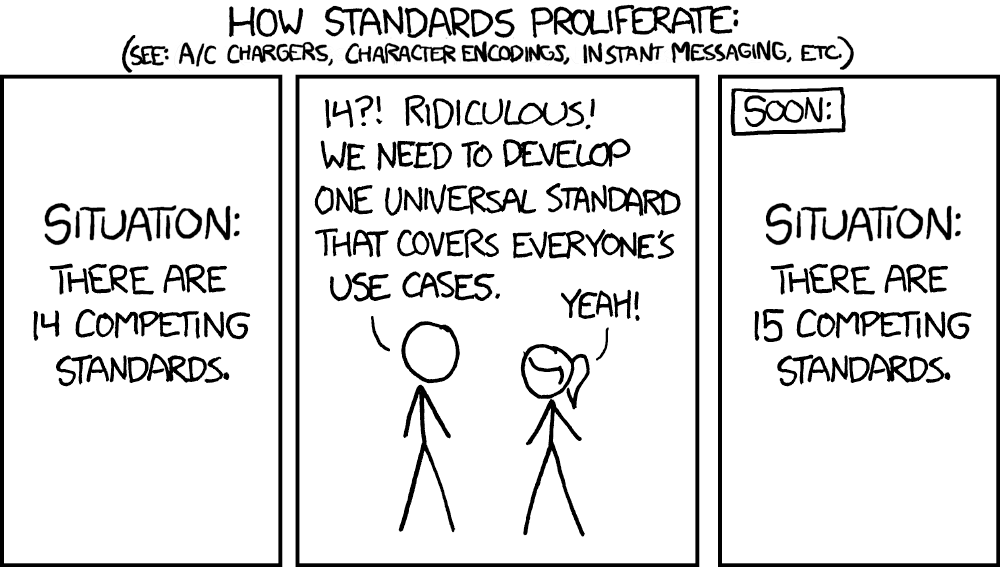
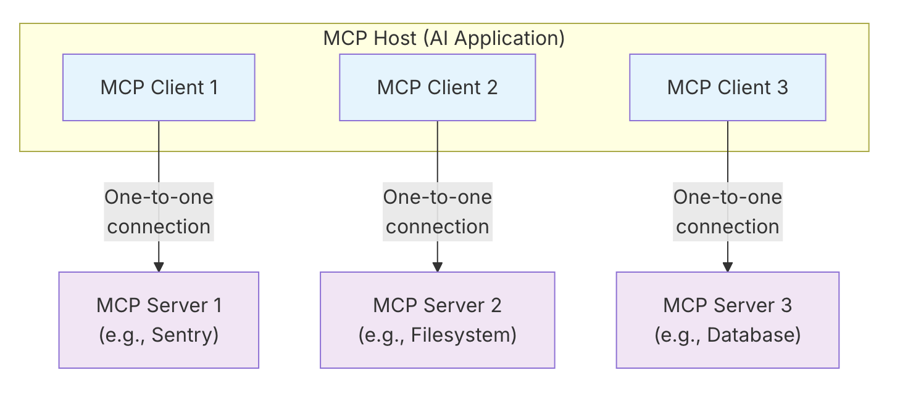



## Introdução

Neste artigo, vamos explorar o Protocolo de Contexto de Modelo (MCP), um protocolo desenvolvido pela Anthropic para padronizar as comunicações entre Modelos de Linguagem Grandes (LLMs) e aplicativos. Este artigo é baseado na [palestra de mesmo nome que apresentei na Gophercon UK](https://speakerdeck.com/danicat/hello-mcp-world) na semana passada.

Para construir um entendimento claro, começaremos com os fundamentos, depois explicaremos os principais componentes da arquitetura, transportes e blocos de construção (ferramentas, prompts e recursos). Vamos lançar alguns exemplos práticos ao longo do caminho com base nos servidores que escrevi anteriormente (godoctor e speedgrapher). Finalmente, veremos como você pode escrever seu próprio servidor usando o SDK Go para MCP através de um exemplo simples, "vibe-coded", usando o Gemini CLI.

Seja esta a primeira vez que você ouve falar sobre este protocolo, ou se você já escreveu um ou dois servidores, este artigo visa fornecer informações úteis para vários níveis de experiência.

## Um Novo Padrão Nasce

Sempre que falamos sobre padrões, esta tirinha do XKCD é a primeira coisa que me vem à mente:


*Fonte: [xkcd.com](https://xkcd.com/927)*

Curiosamente, esta pode ser a primeira vez na indústria que essa piada não se aplica totalmente (pelo menos por enquanto). Felizmente para nós, a indústria convergiu rapidamente para o MCP como o padrão para adicionar contexto aos LLMs.

Da especificação, o MCP é:

> O MCP é um protocolo aberto que padroniza como os aplicativos fornecem contexto para modelos de linguagem grandes (LLMs). Pense no MCP como uma porta USB-C para aplicativos de IA. Assim como o USB-C fornece uma maneira padronizada de conectar seus dispositivos a vários periféricos e acessórios, o MCP fornece uma maneira padronizada de conectar modelos de IA a diferentes fontes de dados e ferramentas. O MCP permite que você construa agentes e fluxos de trabalho complexos sobre LLMs e conecta seus modelos com o mundo.

Embora eu entenda a analogia com o USB-C, prefiro pensar no MCP como o novo HTTP/REST. Assim como o HTTP forneceu uma linguagem universal para os serviços da web se comunicarem, o MCP fornece uma estrutura comum para os modelos de IA interagirem com sistemas externos. Como engenheiros, passamos aproximadamente as últimas duas décadas tornando tudo "API-first", permitindo que nossos sistemas de software se tornassem interconectados e impulsionando novos níveis de automação. Talvez não seja para os próximos 20 anos, mas acredito que nos próximos 5 a 10 anos gastaremos bastante poder de engenharia para adaptar todos esses sistemas (e criar novos) para se tornarem habilitados para IA, e o MCP é um componente chave desse processo.

## Arquitetura MCP

Olhando para o diagrama abaixo, a arquitetura MCP pode parecer mais complexa do que realmente é:


*Fonte: [Especificação MCP](https://modelcontextprotocol.io/docs/learn/architecture)*

Os principais componentes da arquitetura MCP são:

*   **Host MCP:** O aplicativo de IA principal, como seu IDE ou um agente de codificação.
*   **Servidor MCP:** Um processo que fornece acesso a alguma capacidade (por exemplo, ferramentas ou prompts).
*   **Cliente MCP:** Conecta o host a um único servidor.

Em essência, um aplicativo host cria e gerencia vários clientes, com cada cliente tendo um relacionamento 1:1 com um servidor específico.

## Camadas MCP

A comunicação acontece em duas camadas:

* **Camada de dados**: é um protocolo baseado em JSON-RPC. Você pode ver exemplos do formato da mensagem na próxima seção.
* **Camada de transporte**: define os canais de comunicação, sendo os principais:
  - E/S padrão: para servidores locais
  - HTTPS streamable: para comunicações pela rede. (Substitui HTTPS+SSE).
  - HTTPS+SSE: preterido na última versão da especificação por questões de segurança.

A camada de dados é gerenciada pelo SDK e, exceto para fins de teste, você não precisará construir as mensagens manualmente. A escolha do transporte dependerá do seu caso de uso, mas em geral recomendo começar com stdio e adicionar HTTPS posteriormente. Existem até adaptadores de código aberto que convertem MCPs stdio em HTTPS e vice-versa, mas adicionar esse recurso é tão trivial que eu só os usaria para servidores dos quais não controlo o código-fonte.

## Fluxo de Inicialização

O cliente e o servidor realizam um handshake para estabelecer uma conexão. Isso envolve três mensagens principais:

1. O cliente envia uma solicitação de `initialize` ao servidor, especificando a versão do protocolo que ele suporta. (O servidor envia uma mensagem de resposta de inicialização de volta para o cliente.)
2. O cliente confirma a inicialização com uma mensagem `notifications/initialized`.
3.  O cliente pode então começar a fazer solicitações, como `tools/list`, para descobrir as capacidades do servidor.

É assim que o fluxo de inicialização se parece na rede do lado do cliente usando a representação JSON-RPC:

```json
{"jsonrpc":"2.0","id":1,"method":"initialize","params":{"protocolVersion":"2025-06-18"}}
{"jsonrpc":"2.0","method":"notifications/initialized","params":{}}
{"jsonrpc":"2.0","id":2,"method":"tools/list","params":{}}
```
Por favor, note que você não pode simplesmente enviar uma mensagem "tools/list" ou "tools/call" diretamente, ou você receberá um erro do tipo "servidor não pronto".

Se estou codificando um servidor MCP por meio de um agente de codificação, como por exemplo o Gemini CLI, costumo instruí-los a enviar essas mensagens via shell assim:

```sh
(
  echo '{"jsonrpc":"2.0","id":1,"method":"initialize","params":{"protocolVersion":"2025-06-18"}}';
  echo '{"jsonrpc":"2.0","method":"notifications/initialized","params":{}}';
  echo '{"jsonrpc":"2.0","id":2,"method":"tools/list","params":{}}';
) | ./bin/godoctor
```

Gosto de fazer isso para ter certeza de que a implementação está sólida, pois antes de entender completamente esse fluxo, meus agentes de codificação costumavam fazer suposições erradas como "o servidor precisa de mais tempo para inicializar, então vou adicionar um sleep antes da chamada da ferramenta". Quanto mais cedo você ensinar seu agente de codificação a se comunicar adequadamente com o servidor MCP que você está desenvolvendo, melhor!

## Os Blocos de Construção de um Servidor MCP

Em sua essência, a funcionalidade de um servidor MCP é exposta por meio de três blocos de construção fundamentais, às vezes também chamados de "primitivos" ou "conceitos de servidor":

| Bloco de Construção | Propósito                  | Quem o controla         | Exemplo do mundo real                               |
| :------------- | :----------------------- | :---------------------- | :----------------------------------------------- |
| **Ferramentas**      | Para ações de IA           | Controlado pelo modelo        | Pesquisar voos, enviar mensagens, revisar código       |
| **Recursos**  | Para dados de contexto         | Controlado pelo aplicativo  | Documentos, calendários, e-mails, dados meteorológicos       |
| **Prompts**    | Para modelos de interação| Controlado pelo usuário         | "Planejar férias", "Resumir minhas reuniões"       |

Vamos dar uma olhada mais de perto em cada um deles.

### Ferramentas

Ferramentas são funções que permitem que um modelo de IA execute ações, por exemplo, expondo uma API, banco de dados ou ferramenta de linha de comando.

O servidor que escrevi para experimentar o conceito de ferramentas é chamado GoDoctor, que é projetado para fornecer ferramentas para melhorar as capacidades dos LLMs na escrita de código Go. O nome GoDoctor vem como uma brincadeira com a ferramenta de linha de comando "go doc" que expõe a documentação sobre pacotes Go.

Minha hipótese era que, ao fornecer a documentação correta, os LLMs alucinariam menos e escreveriam um código melhor. Ou, pelo menos, teriam os recursos para aprender e autocorrigir seus erros.

A implementação de ferramentas consiste em dois componentes principais: registrar a ferramenta em seu servidor MCP e implementar um manipulador.

O registro é feito usando a função `mcp.AddTool`:



O manipulador é um adaptador que chama uma API, comando ou função e retorna a resposta de uma forma compatível com o protocolo (uma estrutura `mcp.CallToolResult`).

Aqui está o manipulador para a ferramenta de documentação do GoDoctor:



### Prompts

Prompts fornecem modelos reutilizáveis e controlados pelo usuário que podem ser parametrizados. Eles geralmente aparecem como comandos de barra em um agente de IA, permitindo que um usuário invoque um fluxo de trabalho complexo com um comando simples.

Para ver isso em ação, vamos dar uma olhada em um servidor MCP diferente que escrevi chamado `speedgrapher`, que é uma coleção de prompts e ferramentas para ajudar na minha escrita técnica.

Um dos prompts mais simples no `speedgrapher` é `/haiku`. Assim como com as ferramentas, o processo envolve a definição do prompt e, em seguida, a implementação de um manipulador para ele.



### Recursos

Recursos expõem dados de arquivos, APIs ou bancos de dados, fornecendo o contexto que uma IA precisa para executar uma tarefa. Conceitualmente, uma Ferramenta é para executar uma ação, enquanto um Recurso é para fornecer informações.

Dito isso, no mundo real, ainda não vi uma boa implementação de recursos, pois a maioria dos desenvolvedores está usando ferramentas para expor dados (como você faria em uma API com uma solicitação GET). Acho que este é um dos casos em que a especificação pode estar tentando ser muito inteligente, mas talvez no futuro veremos bons usos para os recursos assim que a comunidade se sentir mais confortável com eles.

## Conceitos do Cliente

Além dos blocos de construção do servidor, o protocolo também define **Conceitos do Cliente**, que são capacidades que o servidor pode solicitar do cliente. Estes incluem:

*   **Amostragem:** Permite que um servidor solicite conclusões de LLM do modelo do cliente. Isso é promissor do ponto de vista de segurança e faturamento, pois os autores do servidor não precisam usar suas próprias chaves de API para chamar modelos.
*   **Raízes:** Um mecanismo para um cliente comunicar os limites do sistema de arquivos, dizendo a um servidor em quais diretórios ele tem permissão para operar.
*   **Elicitação:** Uma maneira estruturada para um servidor solicitar informações específicas do usuário, pausando sua operação para coletar informações quando necessário.

Este é outro caso em que a maioria dos aplicativos do mundo real que explorei ainda não alcançou a especificação, incluindo servidores e clientes. Pode levar um tempo até que tenhamos esses recursos amplamente disponíveis. É um dos problemas de trabalhar com tecnologia de ponta... Por exemplo, o Gemini CLI adicionou suporte a raízes há cerca de uma semana: https://github.com/google-gemini/gemini-cli/pull/5856

## Demonstração ao vivo: Vibe Coding um Servidor MCP

Aqui está um prompt que você pode dar ao seu agente de codificação favorito para produzir um servidor do tipo "Olá, Mundo". Como os agentes hoje em dia não são determinísticos, pode não funcionar 100% na primeira tentativa e você pode precisar guiar o LLM com alguns prompts extras após o inicial, mas é um bom começo:

```text
Sua tarefa é criar um servidor do Protocolo de Contexto de Modelo (MCP) para expor uma ferramenta "hello world". Para a implementação do MCP, você deve usar o SDK Go oficial para MCP e usar o transporte stdio.

Leia estas referências para coletar informações sobre a tecnologia e a estrutura do projeto antes de escrever qualquer código:
- https://raw.githubusercontent.com/modelcontextprotocol/go-sdk/refs/heads/main/README.md
- https://go.dev/doc/modules/layout

Para testar o servidor, use comandos de shell como estes:
`( 
	echo '{"jsonrpc":"2.0","id":1,"method":"initialize","params":{"protocolVersion":"2025-06-18"}}';
	echo '{"jsonrpc":"2.0","method":"notifications/initialized","params":{}}';
	echo '{"jsonrpc":"2.0","id":2,"method":"tools/list","params":{}}';
) | ./bin/hello`
```

Se o agente for bem-sucedido em concluir esta tarefa, peça a ele para executar um "method tools/call" em sua nova ferramenta para ver os resultados!

## Uma espiada no futuro

A comunidade Go está investindo ativamente no ecossistema MCP. Dois projetos importantes a serem observados são:

*   **O SDK Go para MCP:** O SDK oficial que usei na demonstração, que é uma parceria entre o Google e a Anthropic. Ainda é experimental (a versão atual é 0.20), mas é funcional e está em desenvolvimento ativo. Você pode encontrá-lo em [github.com/modelcontextprotocol/go-sdk](https://github.com/modelcontextprotocol/go-sdk).
*   **Suporte MCP para `gopls`:** O servidor de linguagem Go, `gopls`, está ganhando suporte a MCP para fornecer capacidades aprimoradas de codificação Go para modelos. O projeto ainda está em seus estágios iniciais, e você pode acompanhar seu progresso em [tip.golang.org/gopls/features/mcp](https://tip.golang.org/gopls/features/mcp).

## Servidores MCP úteis

Aqui estão alguns servidores notáveis construídos pela comunidade:

*   **Playwright:** Mantido pela Microsoft, este servidor permite que um agente de IA navegue em páginas da web, tire capturas de tela e automatize tarefas do navegador. Você pode encontrá-lo em [https://github.com/microsoft/playwright-mcp](https://github.com/microsoft/playwright-mcp).
*   **Context7:** Semelhante ao GoDoctor, este servidor fornece documentação para modelos para mitigar alucinações e melhorar as respostas. Ele recupera a documentação de um repositório de crowdsourcing. Saiba mais em [https://context7.com/](https://context7.com/).

## Que tal construir o seu próprio?

O Protocolo de Contexto de Modelo fornece uma maneira padronizada de estender as capacidades dos agentes de IA. Ao construir seus próprios servidores, você pode criar assistentes especializados e cientes do contexto, adaptados aos seus fluxos de trabalho específicos.

Se você quiser começar, criei um Codelab do Google que o guiará pelo processo de construção de seu próprio servidor MCP do zero.

[**Como construir um assistente de codificação com Gemini CLI, MCP e Go**](https://codelabs.developers.google.com/codelabs/gemini-cli-mcp-go)

## Palavras Finais

Espero que você tenha gostado deste artigo. Se você tiver alguma dúvida ou comentário, sinta-se à vontade para entrar em contato na seção de comentários abaixo ou em qualquer uma das minhas redes sociais. Obrigado!