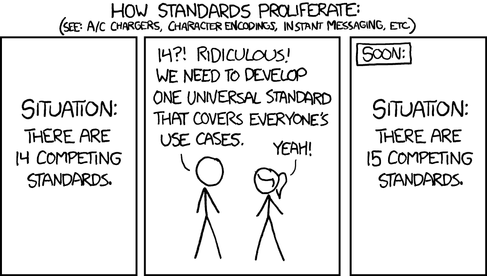
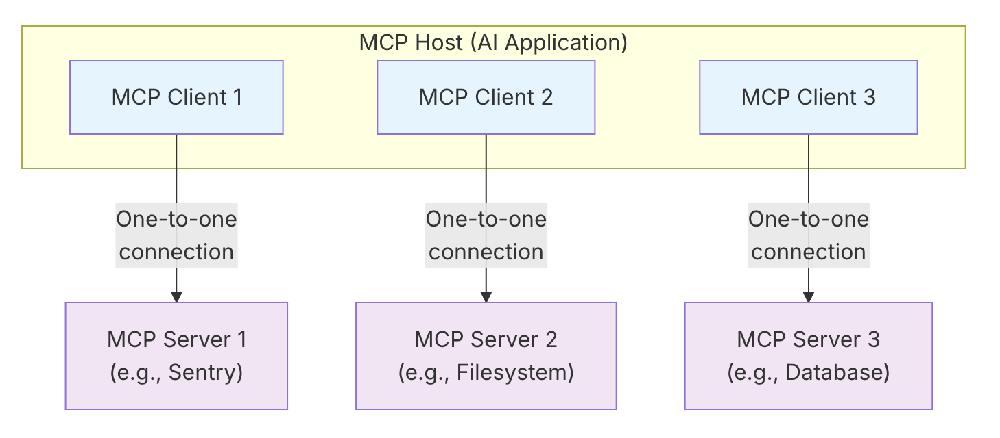

---categories:
- Agent Development
date: 2025-08-17 15:00:00+00:00
summary: Baseado na minha keynote na GopherCon UK 2025, este artigo é uma introdução
  ao Model Context Protocol (MCP), explorando seus conceitos centrais, arquitetura
  e os blocos fundamentais — Tools, Prompts e Resources — usados para criar aplicações
  com suporte a IA em Go.
tags:
  - gemini
  - golang
  - keynote
  - mcp
title: "Olá, Mundo MCP: Arquitetura Model Context Protocol em Go"
slug: "hello-mcp-world"
aliases:
  - "/pt-br/posts/20250817-hello-mcp-world/"
description: "Introdução à arquitetura do Model Context Protocol (MCP) em Go baseada na keynote do GopherCon UK 2025. Aborda Hosts, Clients, Servers, Tools, Prompts e Resources."
proficiencyLevel: "Beginner"
dependencies:
  - "Go 1.24+"
  - "MCP Go SDK"
---


## Introdução

Neste artigo, vamos explorar o Model Context Protocol (MCP), um protocolo criado pela Anthropic para padronizar a comunicação entre Large Language Models (LLMs) e aplicações. Este artigo é baseado na [keynote de mesmo nome que apresentei na GopherCon UK](https://speakerdeck.com/danicat/hello-mcp-world) na semana passada.

Para construir um entendimento sólido, começaremos pelos fundamentos, passando pelos principais componentes de arquitetura, camadas de transporte e blocos fundamentais (*tools*, *prompts* e *resources*). Ao longo do caminho, veremos exemplos práticos baseados em servidores que escrevi anteriormente ([GoDoctor](https://github.com/danicat/godoctor) e [Speedgrapher](https://github.com/danicat/speedgrapher)). Por fim, mostrarei como você pode criar seu próprio servidor usando o Go SDK oficial para MCP por meio de um exemplo simples "vibe-coded" com o Gemini CLI.

Seja esta a sua primeira vez ouvindo falar do protocolo ou se você já implementou um servidor ou outro, este artigo traz informações valiosas para diferentes níveis de experiência.

## Um Novo Padrão Nasce

Sempre que falamos sobre padrões na tecnologia, a clássica tirinha do XKCD é a primeira coisa que me vem à mente:


*Fonte: [xkcd.com](https://xkcd.com/927)*

Curiosamente, esta talvez seja a primeira vez na indústria em que a piada não se aplica totalmente (pelo menos por enquanto). Para a nossa sorte, o mercado convergiu rapidamente para o MCP como padrão para fornecer contexto a LLMs.

De acordo com a especificação oficial, o MCP é:

> O MCP é um protocolo aberto que padroniza como as aplicações fornecem contexto para grandes modelos de linguagem (LLMs). Pense no MCP como uma porta USB-C para aplicações de IA. Assim como o USB-C oferece uma forma padronizada de conectar dispositivos a vários periféricos e acessórios, o MCP oferece uma forma padronizada de conectar modelos de IA a diferentes fontes de dados e ferramentas. O MCP permite criar agentes e fluxos de trabalho complexos sobre LLMs e conecta seus modelos com o mundo.

Embora eu entenda a analogia com o USB-C, prefiro enxergar o MCP como o novo HTTP/REST. Da mesma forma que o HTTP estabeleceu uma linguagem universal para serviços web se comunicarem, o MCP fornece uma base comum para modelos de IA interagirem com sistemas externos. Como engenheiras e desenvolvedores, passamos praticamente as últimas duas décadas adotando a filosofia "API-first", tornando nossos sistemas de software interconectados e impulsionando novos patamares de automação. Talvez não dure 20 anos, mas acredito que nos próximos 5 a 10 anos dedicaremos muito esforço de engenharia para adaptar todos esses sistemas (e construir novos) para que sejam integrados com IA — e o MCP é uma peça central nessa transformação.

## Arquitetura do MCP

Olhando para o diagrama abaixo, a arquitetura do MCP pode parecer mais complexa do que realmente é:


*Fonte: [Especificação MCP](https://modelcontextprotocol.io/docs/learn/architecture)*

Os componentes principais da arquitetura MCP são:

*   **Host MCP:** A aplicação de IA principal, como sua IDE ou um agente de código.
*   **Servidor MCP (MCP Server):** Um processo que disponibiliza capacidades específicas (como *tools* ou *prompts*).
*   **Cliente MCP (MCP Client):** Conecta o host a um servidor específico.

Em resumo, uma aplicação host instancia e gerencia múltiplos clientes, e cada cliente mantém uma conexão 1:1 com um servidor dedicado.

## Camadas do MCP

A comunicação acontece em duas camadas:

* **Camada de dados (*data layer*)**: protocolo baseado em JSON-RPC. Veremos exemplos do formato de mensagens na próxima seção.
* **Camada de transporte (*transport layer*)**: define os canais de comunicação, sendo os principais:
  - **Standard I/O (stdio)**: para servidores locais executados no mesmo ambiente.
  - **Streamable HTTPS**: para comunicações via rede (substituindo HTTPS+SSE).
  - **HTTPS+SSE**: depreciado na versão mais recente da especificação por questões de segurança.

A camada de dados é gerenciada pelo próprio SDK; portanto, a menos que esteja fazendo testes manuais, você não precisará montar essas mensagens na mão. A escolha do transporte depende do seu caso de uso, mas, em geral, recomendo começar com `stdio` e adicionar suporte a HTTPS depois. Existem adaptadores open source que convertem servidores MCP de stdio para HTTPS e vice-versa, mas implementar esse suporte diretamente é tão trivial que eu só usaria esses adaptadores para servidores cujo código-fonte eu não controlo.

## Fluxo de Inicialização

O cliente e o servidor realizam um *handshake* para estabelecer a conexão. Esse processo envolve três mensagens essenciais:

1. O cliente envia uma requisição `initialize` ao servidor, indicando a versão do protocolo suportada (e o servidor responde confirmando a inicialização).
2. O cliente confirma a conclusão da inicialização com uma notificação `notifications/initialized`.
3. A partir daí, o cliente pode começar a enviar requisições normais, como `tools/list`, para descobrir as capacidades expostas pelo servidor.

É assim que o fluxo de inicialização trafega na rede (ou no pipe stdio) do ponto de vista do cliente, em formato JSON-RPC:

```json
{"jsonrpc":"2.0","id":1,"method":"initialize","params":{"protocolVersion":"2025-06-18"}}
{"jsonrpc":"2.0","method":"notifications/initialized","params":{}}
{"jsonrpc":"2.0","id":2,"method":"tools/list","params":{}}
```

Vale ressaltar que você não pode simplesmente disparar uma mensagem `tools/list` ou `tools/call` diretamente sem antes inicializar a conexão — caso contrário, receberá um erro de "servidor não pronto".

Quando estou desenvolvendo um servidor MCP com o apoio de um agente de código (como o Gemini CLI), costumo instruí-lo a testar essas mensagens via shell desta forma:

```sh
(
  echo '{"jsonrpc":"2.0","id":1,"method":"initialize","params":{"protocolVersion":"2025-06-18"}}';
  echo '{"jsonrpc":"2.0","method":"notifications/initialized","params":{}}';
  echo '{"jsonrpc":"2.0","id":2,"method":"tools/list","params":{}}';
) | ./bin/godoctor
```

Gosto de fazer isso para garantir que a implementação está sólida. Antes de entender esse fluxo a fundo, meus agentes de código frequentemente assumiam coisas erradas, como achar que "o servidor precisava de mais tempo para subir" e colocar um `sleep` arbitrário antes de chamar a ferramenta. Quanto mais cedo você ensinar seu agente a se comunicar corretamente com o servidor MCP em desenvolvimento, melhor!

## Os Blocos Fundamentais de um Servidor MCP

Em essência, a funcionalidade de um servidor MCP é exposta por meio de três blocos de construção fundamentais — às vezes chamados de "primitivos" ou "conceitos de servidor":

| Bloco Fundamental | Finalidade               | Quem Controla           | Exemplo Real                                     |
| :---------------- | :----------------------- | :---------------------- | :----------------------------------------------- |
| **Tools**         | Ações executadas pela IA | Controlado pelo modelo  | Buscar voos, enviar mensagens, revisar código    |
| **Resources**     | Dados de contexto        | Controlado pela aplicação| Documentos, calendários, e-mails, dados de clima |
| **Prompts**       | Templates de interação   | Controlado pela usuária | "Planejar férias", "Resumir minhas reuniões"     |

Vamos examinar cada um deles em detalhes.

### Tools (Ferramentas)

*Tools* são funções que permitem a um modelo de IA executar ações — por exemplo, acessar uma API, consultar um banco de dados ou rodar um utilitário de linha de comando.

O servidor que criei para experimentar com o conceito de tools chama-se [GoDoctor](https://github.com/danicat/godoctor), projetado para equipar LLMs com ferramentas que melhoram sua capacidade de escrever código Go. O nome GoDoctor é um trocadilho com o comando `go doc`, que exibe documentação de pacotes Go.

Minha hipótese era de que, tendo acesso à documentação exata das bibliotecas, os LLMs alucinariam menos e gerariam códigos muito melhores — ou, ao menos, teriam insumos para aprender e autocorrigir eventuais erros.

A implementação de tools é dividida em duas etapas principais: registrar a ferramenta no servidor MCP e implementar sua função manipuladora (*handler*).

O registro é feito chamando a função `mcp.AddTool`:



O *handler* atua como um adaptador que executa uma API, comando ou função interna e retorna a resposta no formato esperado pelo protocolo (uma struct `mcp.CallToolResult`).

Aqui está o handler da ferramenta de documentação do GoDoctor:



### Prompts

*Prompts* fornecem templates reutilizáveis e parametrizáveis controlados diretamente pela pessoa usuária. Frequentemente se manifestam como slash commands em agentes de IA, permitindo acionar fluxos de trabalho sofisticados com um comando simples.

Para ver isso na prática, vejamos outro servidor MCP que construí: o `speedgrapher`, uma suíte de prompts e tools criada para acelerar minha produção de escrita técnica.

Um dos prompts mais simples do `speedgrapher` é o `/haiku`. Assim como nas tools, o processo consiste em declarar o prompt e implementar seu respectivo *handler*:



### Resources (Recursos)

*Resources* expõem dados vindos de arquivos, APIs ou bancos de dados, fornecendo o contexto necessário para a IA cumprir uma tarefa. Conceitualmente, uma **Tool** serve para executar uma ação, enquanto um **Resource** serve para disponibilizar informações.

Dito isso, na prática do ecossistema atual, ainda não vi implementações realmente expressivas de resources: a grande maioria dos desenvolvedores tem usado tools até mesmo para expor dados (como faríamos com uma requisição HTTP `GET` em uma API REST). Acredito que aqui a especificação tenha tentado ser um pouco sofisticada demais, mas talvez vejamos ótimos casos de uso de resources no futuro, conforme a comunidade for amadurecendo o uso do protocolo.

## Conceitos de Cliente (Client Concepts)

Além dos blocos do servidor, o protocolo também define **Conceitos de Cliente** (*Client Concepts*), que são capacidades que o servidor pode solicitar ao cliente:

*   **Sampling:** Permite que o servidor requisite completações de LLM através do próprio modelo configurado no cliente. Isso é muito promissor sob a ótica de segurança e custos, já que quem desenvolve o servidor não precisa embutir ou expor chaves de API próprias para chamar modelos.
*   **Roots:** Mecanismo pelo qual o cliente comunica os limites de acesso ao sistema de arquivos, delimitando em quais diretórios o servidor tem permissão para operar.
*   **Elicitation:** Uma forma estruturada para o servidor solicitar informações específicas da pessoa usuária, pausando a execução até receber a resposta necessária.

Esse é outro ponto em que boa parte das aplicações do mundo real ainda está correndo atrás da especificação, tanto do lado do cliente quanto do servidor. Deve levar algum tempo até vermos essas funcionalidades amplamente adotadas — um clássico efeito colateral de trabalhar na fronteira tecnológica (*bleeding edge*). A título de exemplo, o Gemini CLI adicionou suporte a roots apenas recentemente: https://github.com/google-gemini/gemini-cli/pull/5856

## Demonstração Prática: Vibe Coding de um Servidor MCP

Aqui está um prompt que você pode passar para o seu agente de código favorito para gerar um servidor no estilo "Hello, World". Como agentes atuais são não-determinísticos, o resultado pode não sair 100% perfeito de primeira e talvez você precise orientar a IA com alguns ajustes, mas é um excelente ponto de partida:

```text
Your task is to create a Model Context Protocol (MCP) server to expose a "hello world" tool. For the MCP implementation, you should use the official Go SDK for MCP and use the stdio transport.

Read these references to gather information about the technology and project structure before writing any code:
- https://raw.githubusercontent.com/modelcontextprotocol/go-sdk/refs/heads/main/README.md
- https://go.dev/doc/modules/layout

To test the server, use shell commands like these:
`( 
	echo '{"jsonrpc":"2.0","id":1,"method":"initialize","params":{"protocolVersion":"2025-06-18"}}';
	echo '{"jsonrpc":"2.0","method":"notifications/initialized","params":{}}';
	echo '{"jsonrpc":"2.0","id":2,"method":"tools/list","params":{}}';
) | ./bin/hello`
```

Se o agente concluir a tarefa com sucesso, peça a ele para executar um `tools/call` na sua nova ferramenta para testar o resultado!

## Um Olhar Para o Futuro

A comunidade Go vem investindo de forma muito ativa no ecossistema MCP. Dois projetos imperdíveis para acompanhar:

*   **O Go SDK para MCP:** O SDK oficial que utilizei na demonstração, desenvolvido em parceria entre o Google e a Anthropic. Ainda está em estágio experimental (versão 0.20), mas é totalmente funcional e segue em desenvolvimento acelerado. Confira em [github.com/modelcontextprotocol/go-sdk](https://github.com/modelcontextprotocol/go-sdk).
*   **Suporte MCP no `gopls`:** O language server oficial de Go, `gopls`, está recebendo suporte nativo a MCP para turbinar as capacidades de assistência em Go para modelos de IA. O projeto está no início e você pode acompanhar o progresso em [tip.golang.org/gopls/features/mcp](https://tip.golang.org/gopls/features/mcp).

## Servidores MCP Úteis

Aqui estão alguns servidores notáveis criados pela comunidade:

*   **Playwright:** Mantido pela Microsoft, permite que agentes de IA naveguem em páginas web, capturem screenshots e automatizem fluxos no navegador: [github.com/microsoft/playwright-mcp](https://github.com/microsoft/playwright-mcp).
*   **Context7:** Na mesma linha do GoDoctor, fornece documentação técnica para modelos reduzirem alucinações e melhorarem respostas, consumindo documentações de um repositório colaborativo: [context7.com](https://context7.com/).

## Que Tal Construir o Seu Próprio?

O Model Context Protocol oferece uma forma padronizada e elegante de expandir as capacidades de agentes de IA. Ao construir seus próprios servidores, você pode criar assistentes especializados, contextualizados e sob medida para os seus fluxos de trabalho.

Se quiser colocar a mão na massa, preparei um Google Codelab completo que guia você passo a passo na criação de um servidor MCP do zero:

[**Como Construir um Assistente de Programação com Gemini CLI, MCP e Go**](https://codelabs.developers.google.com/codelabs/gemini-cli-mcp-go)

## Considerações Finais

Espero que tenha gostado do artigo! Se tiver dúvidas, sugestões ou comentários, fique à vontade para interagir na seção de comentários abaixo ou nas minhas redes sociais. Obrigada!