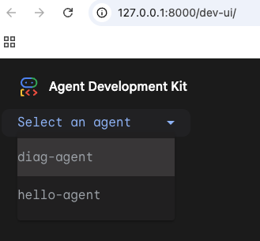
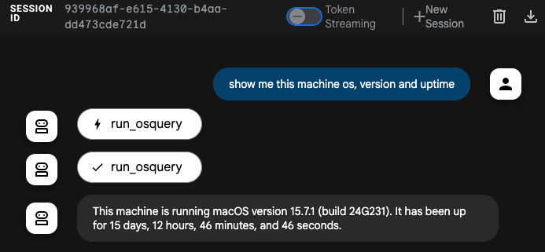
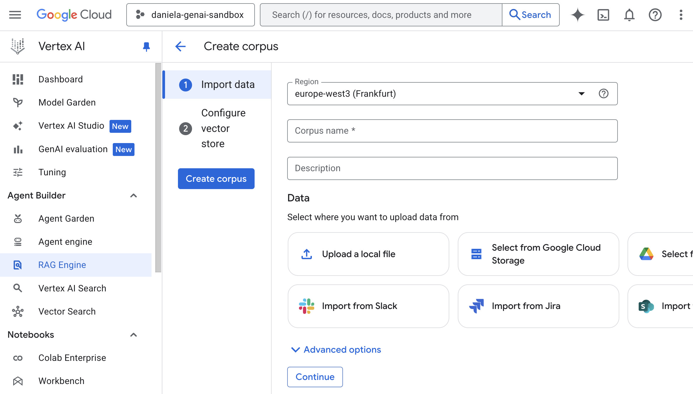
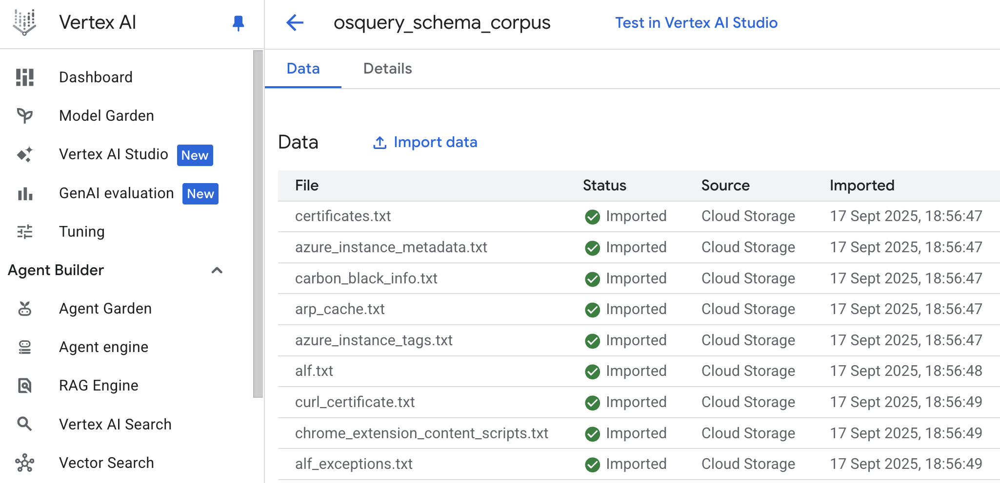
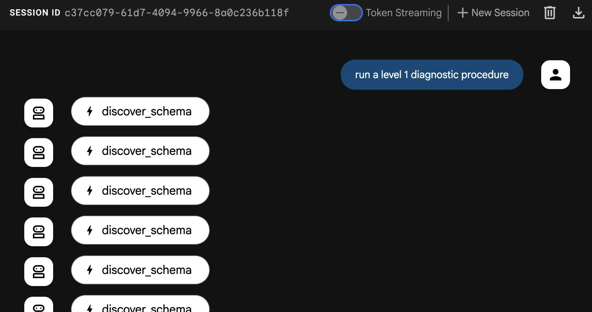

## はじめに

前回の記事からかなり時間が経ちましたが、ヨーロッパ中のカンファレンスやミートアップ（南米への小旅行も挟みつつ）でかなり忙しくしていました。特にこの時期は、9月下旬から12月上旬にかけて多くのカンファレンスが集中するため、私たちデベロッパーリレーションズにとっては非常に忙しいシーズンです。

それでも、旅先で素晴らしい人々に出会うおかげでブログのインスピレーションを得ており、ブログの投稿が新しいトークになることも多いため、一方がなければ他方も存在しないでしょう。

今回は、数ヶ月前に書いた「緊急診断エージェント」()をベースに構築したいと思います。エージェントをリファクタリングして、低レベルの [Vertex AI SDK](https://cloud.google.com/vertex-ai/docs/python-sdk/overview?utm_campaign=CDR_0x72884f69_default_b427567312&utm_medium=external&utm_source=blog) を使用する代わりに、[Agent Development Kit (ADK)](https://github.com/google/agent-development-kit) フレームワークを使用します。これにより、以前に書いた多くの定型コードが無料で提供されるなど、多くの利点があることがわかるでしょう。

これは、それらの記事の知識が時代遅れになったという意味ではありません。特に問題が発生して診断する必要がある場合には、物事がどのように機能するかを内部で知っておくと非常に役立ちます。ADK は、エージェントを開発する際に私たちの生活をはるかに楽にしてくれる、より高い抽象化レイヤーだと考えてください。

## 前回のエピソードのレビュー

時間が経ちましたので、緊急診断エージェントが何であるかを思い出してみましょう。私はこのエージェントを、スタートレックシリーズの「コンピューター」に触発されて開発しました。そこでは、主要キャラクターがコンピューターに話しかけて（タイピングする代わりに）診断コマンドを発行していました（他のことも含めて）。私の目標は、現在の生成AI技術でこの体験を再現することでした。

コンピューターに話しかけて診断を実行するという目標を達成するために、私たちは2つのことを活用しています。リクエストを解釈するための生成AIモデルと、オペレーティングシステムの情報をモデルに公開するための [osquery](https://osquery.io/) というツールです。osquery を使用することで、モデルは独自のトレーニングデータとシステムに関する外部情報を組み合わせることができます。

基本的に、エージェントは次のコンポーネントで構成されています。
- 大規模言語モデル (Gemini)
- Gemini がどのように振る舞うべきかを説明する system prompt
- osquery のバイナリ
- osquery をプログラムで呼び出すための python ライブラリ
- osquery を呼び出すためのツールとして Gemini に与えられた python 関数のラッパー

osquery はマルチプラットフォームであり、その schema はホストシステムによって異なる可能性があるという事実を考慮して、system prompt で Gemini に osquery テーブルの schema を与えるという小さな最適化も追加しました。

以前の実装で注目すべき省略点は、実行したい各診断手順についてモデルに具体的な指示を与えなかったこと、また、テーブル名以外の schema を完全に指定しなかったことです。これらは、この記事で対処する制限の一部であり、ADK、[Vertex AI RAG](https://cloud.google.com/vertex-ai/docs/generative-ai/rag?utm_campaign=CDR_0x72884f69_default_b427567312&utm_medium=external&utm_source=blog)、およびその他のいくつかのトリックの力を使って対処します。しかし、まずはリファクタリングです！

## ADK のためのエージェントのリファクタリング

ADK のためのエージェントのリファクタリングは、思ったよりもはるかに簡単です。これまでに ADK エージェントを書いたことがなくても心配しないでください。必要なのは、SDK をインストールし、ルートエージェントの仕様を定義し、提供されている CLI（便利なことに `adk` と呼ばれています）で実行することだけです。

簡単な `hello world` エージェントから始めて、そこから構築していきましょう。まず、お使いのマシンにお好みのパッケージマネージャーを使用して ADK をインストールします。

macOS または Linux を使用している場合は、これらのコマンドを使用できます。

```sh
$ mkdir adk-tutorial && cd adk-tutorial
$ python3 -m venv .venv
$ source .venv/bin/activate
(.venv) $ pip install google-adk
```
**注意:** 私は古いタイプなのでまだ `virtualenv` と `pip` を使っていますが、新しいパッケージマネージャー [`uv`](https://github.com/astral-sh/uv) を好む人もいます。
```sh
$ mkdir adk-tutorial && cd adk-tutorial
$ uv init
$ uv add google-adk
```
これら2つのアプローチの唯一の違いは、pip では ADK CLI が `adk` コマンドとして公開されますが、`uv` ではデフォルトで `uv run adk` を使用して呼び出す必要があることです。

インストールが完了したら、`adk create [agent-name]`（または `uv adk create [agent-name]`）でテンプレートエージェントを作成できます。

```sh
(.venv) $ adk create hello-agent
```

作成ウィザードは、モデルのバージョンとバックエンド（Gemini または [Vertex AI](https://cloud.google.com/vertex-ai?utm_campaign=CDR_0x72884f69_default_b427567312&utm_medium=external&utm_source=blog)）を尋ねてきます。私は `gemini-2.5-flash` と `Vertex AI` を使用して、Project ID とロケーションで認証できるようにします。

```sh
(.venv) $ adk create hello-agent
Choose a model for the root agent:
1. gemini-2.5-flash
2. Other models (fill later)
Choose model (1, 2): 1
1. Google AI
2. Vertex AI
Choose a backend (1, 2): 2
```

Vertex AI の場合、モデルが実行されているロケーションを気にしたくない場合は、ロケーションを `global` に設定できます。それ以外の場合は、`us-central1` のようなアベイラビリティゾーンを選択します。

ウィザードが完了すると、ファイルがディスクに書き込まれます。
```sh
(...)
Enter Google Cloud region [us-west1]: global

Agent created in ~/adk-tutorial/hello-agent:
- .env
- __init__.py
- agent.py
```

重要なファイルは、環境設定を含み、ADK を実行すると自動的にロードされる `.env` と、エージェントのテンプレートコードを含む `agent.py` です。

生成された `agent.py` ファイルの内容は非常にスリムです。以下に全文を示します。

```
from google.adk.agents.llm_agent import Agent

root_agent = Agent(
    model='gemini-2.5-flash',
    name='root_agent',
    description='A helpful assistant for user questions.',
    instruction='Answer user questions to the best of your knowledge',
)
```

これは、ADK の Dev-UI インターフェースを使用してテストできる本格的なエージェントです。コマンドラインで `adk web` を実行するだけで、`http://localhost:8000` でマシン上にウェブインターフェースが起動します。簡単ですね！

## ADK 診断

以前に Vertex AI SDK を使用したことがある場合は、ADK を使用するとコードがどれだけスリムになるかにすでに気づいているはずです。完全に機能するエージェントを持つためには、エントリーポイントエージェント `root_agent` といくつかの設定を定義するだけで済みます。

さて、この「hello world」を次のレベルに引き上げ、診断機能を追加しましょう。まず、お使いのオペレーティングシステムの[ドキュメント](https://osquery.readthedocs.io/en/stable/)の指示に従って、osquery バイナリをインストールする必要があります。

次に、python バインディングをインストールします。

```sh
(.venv) $ pip install osquery
```

ADK では、同じフォルダ構造に多くのエージェントを持つことができることに注意してください。以前、`adk-tutorial` フォルダに `hello-agent` という名前のエージェントを作成しました。`adk create` を再度実行すると、同じ構造に2番目のエージェントを持つことができます。

```sh
(.venv) $ adk create diag-agent
```

ADK ウェブインターフェースは、すべてのサブフォルダを個別のエージェントとして認識し、複数ある場合はインターフェースの右上隅にあるコンボボックスでそれらを選択できます。



次に、`agent.py` を更新して、`osquery` を呼び出すために必要なコードと正しいエージェントの指示を追加しましょう。

```py
from google.adk.agents.llm_agent import Agent
from google.adk.tools import FunctionTool
import platform
import osquery
import json

def run_osquery(query: str) -> str:
  """Runs a query using osquery.

  Args:
    query: The osquery query to run.

  Returns:
    The query result as a JSON string.
  """
  instance = osquery.SpawnInstance()
  instance.open()
  result = instance.client.query(query)
  return json.dumps(result.response)


root_agent = Agent(
    model='gemini-2.5-flash',
    name='emergency_diagnostic_agent',
    description='A helpful assistant for diagnosing computer problems.',
    instruction=f"""これは緊急診断エージェントです。
あなたの目的は、コンピューターの問題を診断する際にユーザーをサポートすることです。
osquery を介してオペレーティングシステムの情報にアクセスできます。
現在のオペレーティングシステムは {platform.system()} です。
ユーザーがすぐにコマンドを与えない場合は、「診断の緊急事態の性質は何ですか？」とユーザーに尋ねてください。""",
    tools=[FunctionTool(run_osquery)],
)
```

`adk web` を実行していくつかのクエリを発行することで、エージェントをテストできます。



## System Prompt の再検討

system prompt は、システムインストラクションとも呼ばれ、すべてのエージェントの中核です。system prompt は、エージェントにその使命と個性を与える最も低いレベルのプロンプトです。したがって、エージェントが一貫して応答するためには、非常に優れた system prompt を開発することが重要です。

ADK では、system prompt は3つの要素で構成されています。
- エージェントの内部 `name`
- エージェントの `description`
- エージェントの `instruction`

これらは、`root_agent` をインスタンス化するときに与えられる引数に対応します。

スタートレックのファンとして、私はエージェントに「レベル1診断手順」などのリクエストに一貫して応答してもらいたいので、いくつかの診断レベルを定義しましょう。以下に、改訂され、より詳細になった system prompt を示します。

```md
これは緊急診断エージェントです。あなたの目的は、コンピューターの問題を診断する際にユーザーをサポートすることです。osquery を介してオペレーティングシステムの情報にアクセスできます。
  現在のオペレーティングシステムは {platform.system()} です。

  ユーザーのニーズに基づいてアドホックな診断クエリを実行できます。より構造化された包括的な分析のために、
  以下の事前定義された診断手順のいずれかを実行できます。

  レベル1：システムヘルスチェック
  目標：システムの現在の状態とバイタルサインの概要。
   * システムIDとバイタル：ホスト名、オペレーティングシステムのバージョン、システムのアップタイムを収集します。
   * CPUステータス：全体的なCPU負荷を確認し、CPU消費量で上位5つのプロセスを特定します。
   * メモリプレッシャー：システムの合計、使用済み、空きメモリを報告します。メモリ消費量で上位5つのプロセスを特定します。
   * ディスク使用量：マウントされているすべてのファイルシステムとその現在のディスクスペース使用量を一覧表示します。
   * 実行中のプロセス：実行中のプロセスの総数を提供します。

  レベル2：詳細なシステムとネットワークの分析
  目標：レベル1のすべてに加えて、ネットワークアクティビティと最近のシステムイベントを含む詳細な調査。
   * （すべてのレベル1チェック）
   * ネットワーク接続性：すべてのアクティブなネットワークインターフェースとその設定を一覧表示します。
   * リスニングポート：開いているすべてのポートとそれらをリッスンしているプロセスを特定します。
   * アクティブなネットワーク接続：確立されているすべてのネットワーク接続を報告します。
   * システムログレビュー：過去24時間の重要なエラーまたは警告についてプライマリシステムログをスキャンします。

  レベル3：包括的なセキュリティとソフトウェアの監査
  目標：レベル2のすべてに加えて、ソフトウェアインベントリと潜在的なセキュリティ脆弱性の詳細な調査を含む、最も徹底的な分析。
   * （すべてのレベル2チェック）
   * インストール済みアプリケーション：インストールされているすべてのソフトウェアパッケージの完全なリストを生成します。
   * カーネルとシステムの整合性：ロードされているすべてのカーネルモジュールとドライバーを一覧表示します。
   * スタートアップとスケジュールされたタスク：スタートアップ時またはスケジュールに従って実行するように構成されているすべてのアプリケーションとサービスを列挙します。
   * ユーザーアカウントレビュー：すべてのローカルユーザーアカウントを一覧表示し、現在ログインしているユーザーを特定します。

ユーザーがすぐにコマンドを与えない場合は、「診断の緊急事態の性質は何ですか？」とユーザーに尋ねてください。
```

さて、エージェントをもう一度試してみると、「レベル1診断」が何を意味するかを理解し、レポートを作成するためにすぐに多くのツールコールを発行することがわかります。


## Vertex AI RAG で応答品質を向上させる

上記の system prompt は、手順を特定し、エージェントに存在する理由を与えるという点で良い仕事をしていますが、実際の実行に関しては、結果が常に素晴らしいとは限らないことに気付くかもしれません。

たとえば、私のテストでは、エージェントが私のOS（私はMacOSを使用しています）で空のテーブルにクエリを実行することがよくありました。これは、このデータと対話する方法について、より多くのコンテキスト知識が必要であることを強く示しています。


コンテキストエンジニアリング、ツールコール、MCPリソース、retrieval augmented generation (RAG)、モデルの特殊化など、基盤モデルの能力を超えてエージェントの知識を増強する方法はいくつかあります。

この特定のエージェントについては、osquery がかなり有名なオープンソースプロジェクトであり、長年利用可能であるため、osquery の仕組みに関する一般的な知識を持っているという仮説を立てました。そのため、オープンソースとウェブ上の記事の両方で LLM のトレーニングデータに確実に表現されています。

しかし、モデルはより具体的なシナリオでどのように行動するかについてのニュアンスを欠いているようです。system prompt にプラットフォームを動的に追加することは少し役立ちましたが、十分ではありませんでした。そこで私のアイデアは、RAG メカニズムを使用してエージェントに osquery schema の完全な認識を与えることでした。

RAG の背後にある概念は、「知る必要がある」ベースでモデルに情報を供給することです。リアルタイムで取得したい情報をベクターデータベースに保存し、ユーザー（またはエージェント）がクエリを発行すると、ベクター検索を使用してリクエストに最も類似したデータのセグメントを見つけて取得し、モデルが処理する前にコンテキストを充実させます。

診断エージェントの場合、完全な osquery schema をオンデマンドで取得できるようにすることができます。たとえば、「メモリ」に関する情報を要求している場合、RAG 検索はベクトル空間で「メモリ」に近いテーブルを探し、リクエストを処理する前に関連するテーブルを完全な schema と共に取得します。これにより、モデルがより良い osquery コールを選択するのに役立ちます。

これを機能させるには、ベクターデータベースに関連データをロードし、新しいツール `schema_discovery` を与えることでエージェントにそれを取得する方法を「教える」必要があります。

### Vertex AI RAG の設定

最初に行う必要があるのは、Vertex AI RAG で新しいコーパスを作成することです（コーパスはデータのコレクションを表すために使用される用語です）。

コーパスの情報源は、[osquery の GitHub ページ](https://github.com/osquery/osquery)の [specs フォルダ](https://github.com/osquery/osquery/tree/master/specs)から取得できる osquery schema です。

コーパスを作成する非常に便利な方法の1つは、[Google Cloud Storage](https://cloud.google.com/storage?utm_campaign=CDR_0x72884f69_default_b427567312&utm_medium=external&utm_source=blog) または Google Drive からフォルダをアップロードすることですが、Slack や Sharepoint などの他のデータソースも利用できます。Google Cloud Console のコーパス作成ウィザード（Vertex AI -> RAG Engine -> Create corpus）を使用するか、Vertex AI SDK を使用してプログラムで実行できます。



この特定のケースでは、osquery の GitHub リポジトリを自分のマシンにクローンし、`spec` フォルダのコピーを Google Cloud Storage バケットに作成し、クラウドコンソールを使用してバケットからコーパスを作成しました。注意すべき唯一の点は、`spec` のテーブル定義の拡張子が `.table` であるため、Vertex AI RAG がそれらを認識して処理できるように、すべてのファイルの名前を `.txt` に変更する必要があることです。

この一括名前変更操作を実行するには、簡単なシェルコマンドを使用できます。
```sh
# .table ファイルがあるディレクトリで
for f in *.table; do mv -- "$f" "${f%.table}.txt"; done
```

インポートが完了すると、次のようなものが表示されるはずです。



次に、エージェントにこのコーパスへのアクセス権を与えるためのツール定義を作成する必要があります。

### スキーマディスカバリーツール

ツールが機能するためには、作成したばかりのコーパスのリソース名が必要です。これは、コーパスの「詳細」タブの下のコンソールで見つけることができ、次のようになります：`projects/[PROJECT-ID]/locations/[LOCATION]/ragCorpora/[CORPORA_ID]`

`.env` ファイルにこのパスを持つ環境変数を作成します。これを `RAG_CORPORA_URI` と呼びましょう。`.env` ファイルは次のようになります。

```txt
GOOGLE_GENAI_USE_VERTEXAI=1
GOOGLE_CLOUD_PROJECT=[PROJECT-ID]
GOOGLE_CLOUD_LOCATION=[LOCATION]
RAG_CORPORA_URI=projects/[PROJECT-ID]/locations/[LOCATION]/ragCorpora/[CORPORA_ID]
```

次に、次のツール定義を `agent.py` ファイルに追加します。新しいインポートを忘れないでください！

```py
import os
import vertexai
from vertexai.preview import rag
from google.protobuf.json_format import MessageToDict

vertexai.init()

def discover_schema(search_phrase: str) -> str:
  """Discovers osquery table names and schemas based on a descriptive search phrase.

  Args:
    search_phrase: A phrase describing the kind of information you're looking for. 
      For example: 'user login events' or 'network traffic'.

  Returns:
    Table names and schema information for tables related to the search phrase.
  """
  rag_corpora_uri = os.environ.get('RAG_CORPORA_URI')
  response = rag.retrieval_query(
      rag_resources=[
          rag.RagResource(
              rag_corpus=rag_corpora_uri,
          )
      ],
      text=search_phrase,
  )
  return json.dumps(MessageToDict(response._pb))
```

また、エージェントを更新して、新しいツールが利用可能であることを伝える必要があります。

```py
root_agent = Agent(
    model='gemini-2.5-flash',
    name='emergency_diagnostic_agent',
    description='A helpful assistant for diagnosing computer problems.',
    instruction=... # 簡潔にするために省略
    tools=[
        FunctionTool(run_osquery),
        FunctionTool(discover_schema), # 新しいツール定義
    ],
```

最後に、厳密には必要ありませんが、私はエージェントで schema discovery を強制するのが好きなので、指示に次のフレーズを追加しました。

```txt
schema がまだわかっていない限り、すべてのリクエストに対して schema discovery を実行する必要があります。
```

これを一番下に追加するか、診断レベルを定義する直前に追加できます。

さて、エージェントを再起動して `adk web` で再度実行すると、schema discovery が機能し始めるのがわかるはずです。



ぜひ試してみて、schema discovery の有無で応答を比較することをお勧めします。私のテストでは、品質の違いは非常に顕著でした。

## 最後の言葉

いやはや、これは長くなりましたが、楽しんで読んでいただけたなら幸いです！独自の診断エージェントの設定で課題があれば、ぜひお知らせください。[LinkedIn](https://www.linkedin.com/in/petruzalek) では、イベントで非常に忙しい場合を除き、かなり迅速に対応しています。また、このエージェントをどのように拡張するか、試した実験についてもお聞かせいただければ幸いです。

## 参考文献

*   [Agent Development Kit (ADK)](https://github.com/google/agent-development-kit)
*   [osquery](https://osquery.io/)
*   [osquery GitHub page](https://github.com/osquery/osquery)
*   [Vertex AI RAG](https://cloud.google.com/vertex-ai/docs/generative-ai/rag?utm_campaign=CDR_0x72884f69_default_b427567312&utm_medium=external&utm_source=blog)
