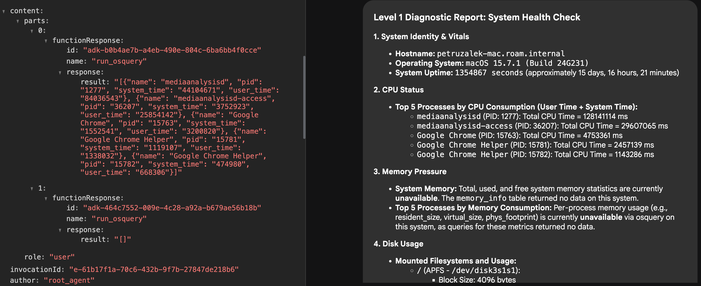

## Introduction

It has been quite a long time since my last article as I've been quite busy traveling around for conferences and meetups all over Europe (with a small detour to South America). Especially this time of the year it is a very busy season for us in developer relations as many conferences are concentrated between late September and early December.

Nevertheless, it is thanks to meeting amazing people on the road that I get inspiration for my blog, and blog posts often become new talks, so one wouldn't really exist without the other.

This time I want to build up on the ["Emergency Diagnostic Agent"]() I wrote about a few months ago. We are going to refactor the agent to use the [Agent Development Kit (ADK)](https://github.com/google/agent-development-kit) framework instead of using the lower level [Vertex AI SDK](https://cloud.google.com/vertex-ai/docs/python-sdk/overview?utm_campaign=CDR_0x72884f69_default_b427567312&utm_medium=external&utm_source=blog). You will see that this brings us many benefits including having a lot of the boilerplate code we've written before given to us out of the box for free.

This doesn't mean the knowledge from those articles is obsolete though. It is quite useful to know how things work under the hood specially when problems happen and you need to diagnose. Think about ADK as a higher abstraction layer that will make our lives much easier when developing agents.

## Review of the last episode

Since it has been a long time, let's just remind what the Emergency Diagnostic Agent is about. I've developed this agent inspired by the "Computer" in the Star Trek series where the main characters would speak with the computer (instead of typing) to issue diagnostic commands (among other things). My goal was to replicate this experience with the current generative AI technology.

To achieve the goal of speaking with the computer to perform diagnostics, we are leveraging two things: a generative AI model to interpret the requests, and a tool called [osquery](https://osquery.io/) to expose operating system information to the model. Using osquery, the model is capable of combining its own training data with external information about the system.

Essentially the agent is composed by the following components:
- A large language model (Gemini)
- A system prompt that explains how Gemini should behave
- The osquery binary
- A python library to allow us to call osquery programmatically
- A python function wrapper given to Gemini as a tool to call osquery

Given the fact that osquery is multi-platform and its schema can vary depending on the host system, we also added a small optisation of giving the osquery table schema to Gemini in the system prompt.

A few notable omissions of the previous implementation is that we never gave the model any specific instructions about each diagnostic procedure we want to perform, and we also never fully specified the schema beyond table names. those are some of the limitations we are going to address in this article, using the power of ADK, [Vertex AI RAG](https://cloud.google.com/vertex-ai/docs/generative-ai/rag?utm_campaign=CDR_0x72884f69_default_b427567312&utm_medium=external&utm_source=blog) and a few other tricks. But first, the refactoring!

## Refactoring the agent for ADK

Refactoring the agent for ADK is much simpler than it sounds. If you have never written an ADK agent before don't worry, as the only thing we need to do is to install the SDK, define a specification for our root agent and run it with the provided CLI (conveniently called `adk`).

Let's start with a simple `hello world` agent and build from there. First install ADK on your machine using your favourite package manager.

If you are using macOS or Linux you can use these commands:

```sh
$ mkdir adk-tutorial && cd adk-tutorial
$ python3 -m venv .venv
$ source .venv/bin/activate
(.venv) $ pip install google-adk
```
**Note:** I'm old school so I still use `virtualenv` with `pip`, but some people prefer to use the new package manager [`uv`](https://github.com/astral-sh/uv):
```sh
$ mkdir adk-tutorial && cd adk-tutorial
$ uv init
$ uv add google-adk
```
The only difference between those two approaches is that with pip the ADK CLI is exposed as the command `adk` but in `uv` by default you will need to call it using `uv run adk`.

Once you are done with the installation, you can create a template agent with `adk create [agent-name]` (or `uv adk create [agent-name]`):

```sh
(.venv) $ adk create hello-agent
```

The creation wizard will prompt you for a model version and a backend (Gemini or [Vertex AI](https://cloud.google.com/vertex-ai?utm_campaign=CDR_0x72884f69_default_b427567312&utm_medium=external&utm_source=blog)). I'm going to use `gemini-2.5-flash` and `Vertex AI` so I can authenticate with my Project ID and location.

```sh
(.venv) $ adk create hello-agent
Choose a model for the root agent:
1. gemini-2.5-flash
2. Other models (fill later)
Choose model (1, 2): 1
1. Google AI
2. Vertex AI
Choose a backend (1, 2): 2
```

For Vertex AI, if you don't want to worry about the location your model is running you can set the location to `global`. Otherwise, select an availability zone like `us-central1`.

When you are done with the wizard it will write the files to disk:
```sh
(...)
Enter Google Cloud region [us-west1]: global

Agent created in ~/adk-tutorial/hello-agent:
- .env
- __init__.py
- agent.py
```

The important files are `.env` which contains your environment configuration and automatically loads when you run ADK, and `agent.py` which contains the template code for your agent.

The content of the generated `agent.py` file is quite lean. You can see it in full below:

```
from google.adk.agents.llm_agent import Agent

root_agent = Agent(
    model='gemini-2.5-flash',
    name='root_agent',
    description='A helpful assistant for user questions.',
    instruction='Answer user questions to the best of your knowledge',
)
```

This is a full fledged agent that you can test using the Dev-UI interface from ADK. Just run `adk web` in the command line and it will spin up a web interface on your machine at `http://localhost:8000`. Easy peasy!

## ADK Diagnostics

If you have worked with the Vertex AI SDK before you must have already noticed how much leaner the code is. We only need to define one entry point agent `root_agent` and a few configurations to have a fully working agent.

Now let's take this "hello world" to the next level adding the diagnostic features. First thing you need is to install the osquery binary following the instructions on the [documentation](https://osquery.readthedocs.io/en/stable/) for your operating system.

Then, install the python bindings:

```sh
(.venv) $ pip install osquery
```

Please note that in ADK you can have many agents in the same folder structure. We previously created an agent called `hello-agent` in the folder `adk-tutorial`. If you run `adk create` again you can have a second agent in the same structure:

```sh
(.venv) $ adk create diag-agent
```

The ADK web interface recognises all sub-folders as separate agents and if you have more than one you can select between them with a combo on the top right corner of the interface:


Now let's update the `agent.py` with the code required to call `osquery` and the correct agent instructions:

```py
from google.adk.agents.llm_agent import Agent
from google.adk.tools import FunctionTool
import platform
import osquery
import json

def run_osquery(query: str) -> str:
  """Runs a query using osquery.

  Args:
    query: The osquery query to run.

  Returns:
    The query result as a JSON string.
  """
  instance = osquery.SpawnInstance()
  instance.open()
  result = instance.client.query(query)
  return json.dumps(result.response)


root_agent = Agent(
    model='gemini-2.5-flash',
    name='emergency_diagnostic_agent',
    description='A helpful assistant for diagnosing computer problems.',
    instruction=f"""This is an Emergency Diagnostic Agent.
Your purpose is to support the user in diagnosing computer problems.
You have access to the operating system's information via osquery.
The current operating system is {platform.system()}.
If the user doesn't give you an immediate command, ask the user 'What's the nature of your diagnostic emergency?'""",
    tools=[FunctionTool(run_osquery)],
)
```

You can test the agent running `adk web` and issuing a few queries:


## Revisiting the System Prompt

The system prompt, also often referred to as system instructions, is the core of every agent. The system prompt is the lowest level prompt that gives the agent its mission and personality. So it's critical that we develop a very good system prompt for the agent to respond consistently.

In ADK the system prompt is composed by three elements:
- The agent internal `name`
- The agent `description`
- The agent `instruction`

Those correspond to the arguments given to the `root_agent` when you instantiate it.

As a Star Trek fan, I would like my agent to consistently respond to a "level 1 diagnostic procedure" request or similar, so let's define a few diagnostic levels. Here is a revised and more detailed system prompt:

```md
This is an Emergency Diagnostic Agent. Your purpose is to support the user in diagnosing computer problems. You have access to the operating system's 
  information via osquery. The current operating system is {platform.system()}.

  You can perform adhoc diagnostic queries based on the user's needs. For more structured and comprehensive analysis, you can execute one of the 
  following predefined diagnostic procedures.

  Level 1: System Health Check
  Goal: A high-level overview of the system's current state and vital signs.
   * System Identity & Vitals: Gather hostname, operating system version, and system uptime.
   * CPU Status: Check overall CPU load and identify the top 5 processes by CPU consumption.
   * Memory Pressure: Report total, used, and free system memory. Identify the top 5 processes by memory consumption.
   * Disk Usage: List all mounted filesystems and their current disk space usage.
   * Running Processes: Provide a count of total running processes.

  Level 2: In-depth System & Network Analysis
  Goal: A detailed investigation including all of Level 1, plus network activity and recent system events.
   * (All Level 1 Checks)
   * Network Connectivity: List all active network interfaces and their configurations.
   * Listening Ports: Identify all open ports and the processes listening on them.
   * Active Network Connections: Report all established network connections.
   * System Log Review: Scan primary system logs for critical errors or warnings in the last 24 hours.

  Level 3: Comprehensive Security & Software Audit
  Goal: The most thorough analysis, including all of Level 2, plus a deep dive into software inventory and potential security vulnerabilities.
   * (All Level 2 Checks)
   * Installed Applications: Generate a complete list of all installed software packages.
   * Kernel & System Integrity: List all loaded kernel modules and drivers.
   * Startup & Scheduled Tasks: Enumerate all applications and services configured to run on startup or on a schedule.
   * User Account Review: List all local user accounts and identify which are currently logged in.

If the user doesn't give you an immediate command, ask the user 'What is the nature of your diagnostic emergency?'
```

Now if you try the agent again, you will see that it is able to understand what a "level 1 diagnostic" means and will immediately issue many tool calls to build the report:


## Improving the response quality with Vertex AI RAG

Even though the system prompt above does a good job in specifying the procedures and giving the agent a reason to exist, when it comes to actual execution you might notice the result is not always great.

For example, in my testing I often found that the agent would make queries to tables that are empty on my OS (I'm using MacOS), which is a strong signal it needs more contextual knowledge on how to interact with this data.



There are a few ways to augment the agent's knowledge beyond the foundational model capabilities including context engineering, tool calls, MCP resources, retrieval augmented generation (RAG) and model specialisation.

For this particular agent, my hypothesis is that it had general knowledge of how osquery works because osquery is a fairly known open source project and it has been available for many years, so it definitely is represented in the LLM training data both due to open source and articles on the web.

But the model seems to be lacking the nuances of how to act in more specific scenarios. Dynamically adding the platform to the system prompt helped a bit, but it was not enough, so my idea was to give the agent full awareness of the osquery schema using a RAG mechanism.

The concept behind RAG is to feed information to the model on a "need to know basis". You store the information you want to retrieve in real-time in a vector database, and when the user (or agent) issues a query, you use vector search to find and retrieve the segments of your data that are most similar to the request, enriching the context before the model processes it.

For the diagnostic agent, we can make the full osquery schema available to be retrieved on demand. For example, if we are requesting information about "memory", the RAG search will look for tables that are close to "memory" in the vector space, retrieving the relevant tables with the full schema prior to processing the request, which can help the model to choose better osquery calls.

To make this work, we need to load our vector database with the relevant data and then "teach" the agent on how to retrieve it by giving it a new tool. Let's call this tool `schema_discovery`.

### Setting up Vertex AI RAG

The first thing we need to do is create a new corpus in Vertex AI RAG (corpus is the term used to describe a collection of data).

The source of information for the corpus is the osquery schema that can be retrieved from [osquery GitHub page](https://github.com/osquery/osquery), in the [specs folder](https://github.com/osquery/osquery/tree/master/specs).

One very convenient way to create a corpus is to upload a folder from [Google Cloud Storage](https://cloud.google.com/storage?utm_campaign=CDR_0x72884f69_default_b427567312&utm_medium=external&utm_source=blog) or Google Drive, but other data sources are also available like Slack and Sharepoint. You can use either the corpus creation wizard from the Google Cloud Console (Vertex AI -> RAG Engine -> Create corpus) or do it programmatically using the Vertex AI SDK.


For this particular case, I cloned the osquery GitHub repository to my machine and made a copy of the `spec` folder to a Google Cloud Storage bucket, and then used the cloud console to create the corpus from the bucket. The only thing you need to be aware of is that since the table definitions in `spec` have the extension `.table` you will need to rename all the files to `.txt` so that Vertex AI RAG will recognise and process them.

You can use a simple shell command to perform this bulk-rename operation:
```sh
# In the directory with the .table files
for f in *.table; do mv -- "$f" "${f%.table}.txt"; done
```

When it's done importing you should see something like this:


Now we need to create a tool definition to give the agent access to this corpus.

### Schema Discovery Tool

For the tool to work you will need the resource name for the corpus you have just created. You can find it on the console under the "Details" tab for the corpus and it will look like this: `projects/[PROJECT-ID]/locations/[LOCATION]/ragCorpora/[CORPORA_ID]`

Create an environment variable with this path in the `.env` file. Let's call it `RAG_CORPORA_URI`. The `.env` file will look like this:

```txt
GOOGLE_GENAI_USE_VERTEXAI=1
GOOGLE_CLOUD_PROJECT=[PROJECT-ID]
GOOGLE_CLOUD_LOCATION=[LOCATION]
RAG_CORPORA_URI=projects/[PROJECT-ID]/locations/[LOCATION]/ragCorpora/[CORPORA_ID]
```

Then add the following tool definition to your `agent.py` file. Don't forget the new imports!

```py
import os
import vertexai
from vertexai.preview import rag
from google.protobuf.json_format import MessageToDict

vertexai.init()

def discover_schema(search_phrase: str) -> str:
  """Discovers osquery table names and schemas based on a descriptive search phrase.

  Args:
    search_phrase: A phrase describing the kind of information you're looking for. 
      For example: 'user login events' or 'network traffic'.

  Returns:
    Table names and schema information for tables related to the search phrase.
  """
  rag_corpora_uri = os.environ.get('RAG_CORPORA_URI')
  response = rag.retrieval_query(
      rag_resources=[
          rag.RagResource(
              rag_corpus=rag_corpora_uri,
          )
      ],
      text=search_phrase,
  )
  return json.dumps(MessageToDict(response._pb))
```

You also need to update the agent to tell it has a new tool available:

```py
root_agent = Agent(
    model='gemini-2.5-flash',
    name='emergency_diagnostic_agent',
    description='A helpful assistant for diagnosing computer problems.',
    instruction=... # omitted for brevity
    tools=[
        FunctionTool(run_osquery),
        FunctionTool(discover_schema), # new tool definition
    ],
```

Finally, it is not strictly necessary, but I like to enforce schema discovery in my agents, so I added the following phrase to my instructions:

```txt
You MUST run schema discovery for all requests unless the schema is already known.
```

You can add it at the bottom or just before defining the diagnostic levels.

Now, if you reboot your agent and run it again with `adk web`, you should start seeing schema discovery in action:


I highly recommend you to play with it and compare the responses with and without the schema discovery. During my tests the difference in quality was very significant.

## Final Words

Oh my! This was a long one, but hopefully you enjoyed the read! If you have any challenges setting up your own diagnostic agent please let me know. I'm fairly responsive on [LinkedIn](https://www.linkedin.com/in/petruzalek) unless I'm super busy with an event. I would also like to hear how you would extend this agent and about any experiments you have tried.

## References

*   [Agent Development Kit (ADK)](https://github.com/google/agent-development-kit)
*   [osquery](https://osquery.io/)
*   [osquery GitHub page](https://github.com/osquery/osquery)
*   [Vertex AI RAG](https://cloud.google.com/vertex-ai/docs/generative-ai/rag?utm_campaign=CDR_0x72884f69_default_b427567312&utm_medium=external&utm_source=blog)