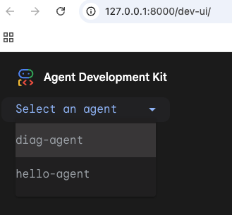
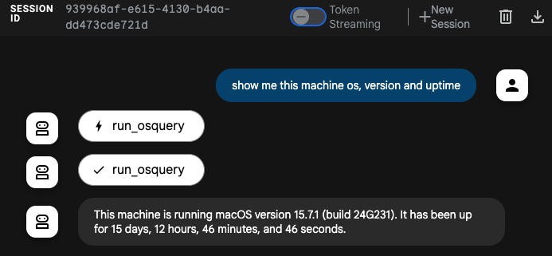
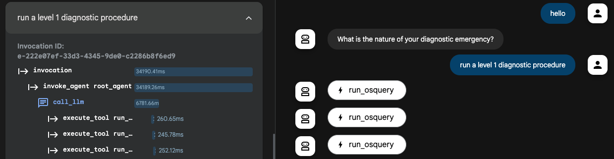
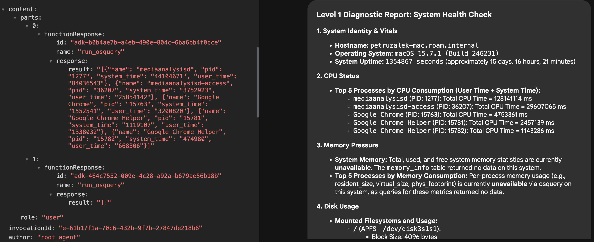
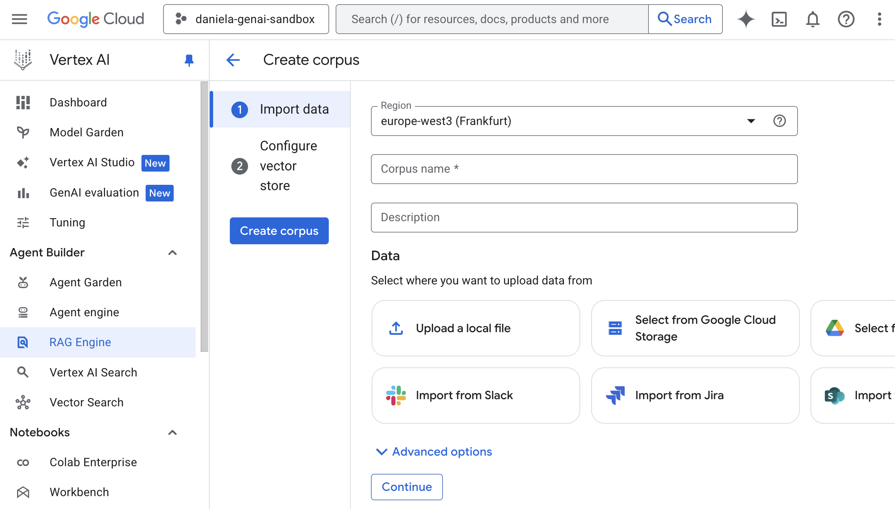
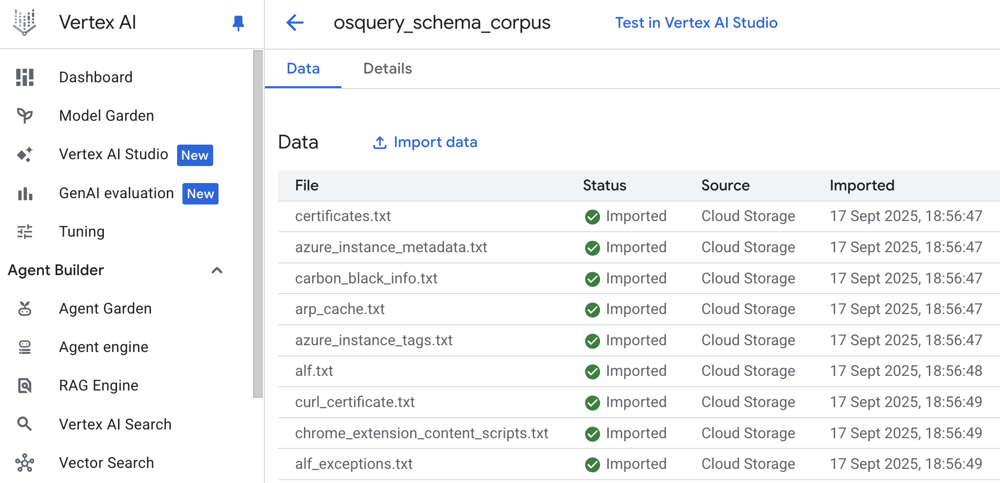
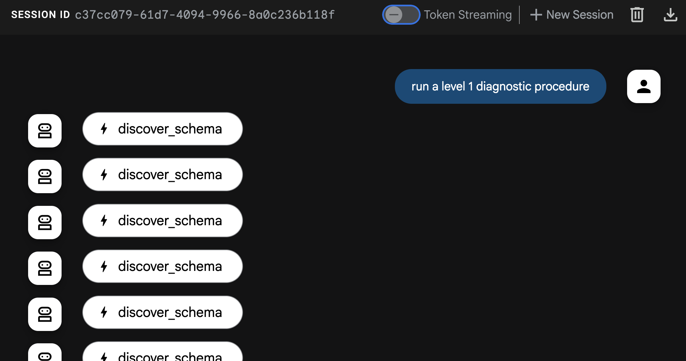

## Introdução

Já faz bastante tempo desde o meu último artigo, pois estive bastante ocupado viajando para conferências e meetups por toda a Europa (com um pequeno desvio para a América do Sul). Especialmente nesta época do ano, é uma temporada muito movimentada para nós em relações com desenvolvedores, já que muitas conferências se concentram entre o final de setembro e o início de dezembro.

No entanto, é graças a conhecer pessoas incríveis na estrada que eu me inspiro para o meu blog, e os posts do blog muitas vezes se tornam novas palestras, então um não existiria sem o outro.

Desta vez, quero construir sobre o ["Agente de Diagnóstico de Emergência"]() sobre o qual escrevi há alguns meses. Vamos refatorar o agente para usar o framework [Agent Development Kit (ADK)](https://github.com/google/agent-development-kit) em vez de usar o [Vertex AI SDK](https://cloud.google.com/vertex-ai/docs/python-sdk/overview) de nível mais baixo. Você verá que isso nos traz muitos benefícios, incluindo ter muito do código boilerplate que escrevemos antes, fornecido para nós gratuitamente.

Isso não significa que o conhecimento desses artigos seja obsoleto. É bastante útil saber como as coisas funcionam por baixo dos panos, especialmente quando ocorrem problemas e você precisa diagnosticar. Pense no ADK como uma camada de abstração mais alta que tornará nossas vidas muito mais fáceis ao desenvolver agentes.

## Revisão do último episódio

Como já faz muito tempo, vamos apenas relembrar do que se trata o Agente de Diagnóstico de Emergência. Eu desenvolvi este agente inspirado no "Computador" da série Star Trek, onde os personagens principais falavam com o computador (em vez de digitar) para emitir comandos de diagnóstico (entre outras coisas). Meu objetivo era replicar essa experiência com a tecnologia de IA generativa atual.

Para atingir o objetivo de falar com o computador para realizar diagnósticos, estamos aproveitando duas coisas: um modelo de IA generativa para interpretar as solicitações e uma ferramenta chamada [osquery](https://osquery.io/) para expor informações do sistema operacional ao modelo. Usando o osquery, o modelo é capaz de combinar seus próprios dados de treinamento com informações externas sobre o sistema.

Essencialmente, o agente é composto pelos seguintes componentes:
- Um modelo de linguagem grande (Gemini)
- Um system prompt que explica como o Gemini deve se comportar
- O binário do osquery
- Uma biblioteca python para nos permitir chamar o osquery programaticamente
- Um wrapper de função python dado ao Gemini como uma ferramenta para chamar o osquery

Dado o fato de que o osquery é multiplataforma e seu schema pode variar dependendo do sistema hospedeiro, também adicionamos uma pequena otimização de fornecer o schema da tabela do osquery ao Gemini no system prompt.

Algumas omissões notáveis da implementação anterior são que nunca demos ao modelo nenhuma instrução específica sobre cada procedimento de diagnóstico que queremos realizar, e também nunca especificamos completamente o schema além dos nomes das tabelas. Essas são algumas das limitações que vamos abordar neste artigo, usando o poder do ADK, [Vertex AI RAG](https://cloud.google.com/vertex-ai/docs/generative-ai/rag) e alguns outros truques. Mas primeiro, a refatoração!

## Refatorando o agente para o ADK

Refatorar o agente para o ADK é muito mais simples do que parece. Se você nunca escreveu um agente ADK antes, não se preocupe, pois a única coisa que precisamos fazer é instalar o SDK, definir uma especificação para o nosso agente raiz e executá-lo com o CLI fornecido (convenientemente chamado de `adk`).

Vamos começar com um agente `hello world` simples e construir a partir daí. Primeiro, instale o ADK em sua máquina usando seu gerenciador de pacotes favorito.

Se você estiver usando macOS ou Linux, pode usar estes comandos:

```sh
$ mkdir adk-tutorial && cd adk-tutorial
$ python3 -m venv .venv
$ source .venv/bin/activate
(.venv) $ pip install google-adk
```
**Nota:** Eu sou da velha guarda, então ainda uso `virtualenv` com `pip`, mas algumas pessoas preferem usar o novo gerenciador de pacotes [`uv`](https://github.com/astral-sh/uv):
```sh
$ mkdir adk-tutorial && cd adk-tutorial
$ uv init
$ uv add google-adk
```
A única diferença entre essas duas abordagens é que com o pip, o ADK CLI é exposto como o comando `adk`, mas no `uv`, por padrão, você precisará chamá-lo usando `uv run adk`.

Quando terminar a instalação, você pode criar um agente de modelo com `adk create [agent-name]` (ou `uv adk create [agent-name]`):

```sh
(.venv) $ adk create hello-agent
```

O assistente de criação solicitará uma versão do modelo e um backend (Gemini ou [Vertex AI](https://cloud.google.com/vertex-ai)). Vou usar `gemini-2.5-flash` e `Vertex AI` para que eu possa autenticar com meu Project ID e localização.

```sh
(.venv) $ adk create hello-agent
Choose a model for the root agent:
1. gemini-2.5-flash
2. Other models (fill later)
Choose model (1, 2): 1
1. Google AI
2. Vertex AI
Choose a backend (1, 2): 2
```

Para o Vertex AI, se você não quiser se preocupar com a localização em que seu modelo está sendo executado, pode definir a localização como `global`. Caso contrário, selecione uma zona de disponibilidade como `us-central1`.

Quando terminar com o assistente, ele gravará os arquivos no disco:
```sh
(...)
Enter Google Cloud region [us-west1]: global

Agent created in ~/adk-tutorial/hello-agent:
- .env
- __init__.py
- agent.py
```

Os arquivos importantes são `.env`, que contém a configuração do seu ambiente e é carregado automaticamente quando você executa o ADK, e `agent.py`, que contém o código de modelo para o seu agente.

O conteúdo do arquivo `agent.py` gerado é bastante enxuto. Você pode vê-lo na íntegra abaixo:

```
from google.adk.agents.llm_agent import Agent

root_agent = Agent(
    model='gemini-2.5-flash',
    name='root_agent',
    description='A helpful assistant for user questions.',
    instruction='Answer user questions to the best of your knowledge',
)
```

Este é um agente completo que você pode testar usando a interface Dev-UI do ADK. Basta executar `adk web` na linha de comando e ele iniciará uma interface da web em sua máquina em `http://localhost:8000`. Moleza!

## Diagnósticos com ADK

Se você já trabalhou com o Vertex AI SDK antes, já deve ter notado como o código é muito mais enxuto usando o ADK. Precisamos apenas definir um agente de ponto de entrada `root_agent` e algumas configurações para ter um agente totalmente funcional.

Agora, vamos levar este "hello world" para o próximo nível, adicionando os recursos de diagnóstico. A primeira coisa que você precisa é instalar o binário do osquery seguindo as instruções na [documentação](https://osquery.readthedocs.io/en/stable/) para o seu sistema operacional.

Em seguida, instale os bindings do python:

```sh
(.venv) $ pip install osquery
```

Observe que no ADK você pode ter muitos agentes na mesma estrutura de pastas. Anteriormente, criamos um agente chamado `hello-agent` na pasta `adk-tutorial`. Se você executar `adk create` novamente, poderá ter um segundo agente na mesma estrutura:

```sh
(.venv) $ adk create diag-agent
```

A interface da web do ADK reconhece todas as subpastas como agentes separados e, se você tiver mais de um, pode selecionar entre eles com um combo no canto superior direito da interface:



Agora vamos atualizar o `agent.py` com o código necessário para chamar o `osquery` e as instruções corretas do agente:

```py
from google.adk.agents.llm_agent import Agent
from google.adk.tools import FunctionTool
import platform
import osquery
import json

def run_osquery(query: str) -> str:
  """Runs a query using osquery.

  Args:
    query: The osquery query to run.

  Returns:
    The query result as a JSON string.
  """
  instance = osquery.SpawnInstance()
  instance.open()
  result = instance.client.query(query)
  return json.dumps(result.response)


root_agent = Agent(
    model='gemini-2.5-flash',
    name='emergency_diagnostic_agent',
    description='A helpful assistant for diagnosing computer problems.',
    instruction=f"""Este é um Agente de Diagnóstico de Emergência.
Seu propósito é apoiar o usuário no diagnóstico de problemas de computador.
Você tem acesso às informações do sistema operacional via osquery.
O sistema operacional atual é {platform.system()}.
Se o usuário não lhe der um comando imediato, pergunte ao usuário 'Qual é a natureza da sua emergência de diagnóstico?'""",
    tools=[FunctionTool(run_osquery)],
)
```

Você pode testar o agente executando `adk web` e emitindo algumas queries:



## Revisitando o System Prompt

O system prompt, também frequentemente chamado de instruções de sistema, é o núcleo de todo agente. O system prompt é o prompt de nível mais baixo que dá ao agente sua missão e personalidade. Portanto, é fundamental que desenvolvamos um system prompt muito bom para que o agente responda de forma consistente.

No ADK, o system prompt é composto por três elementos:
- O `name` interno do agente
- A `description` do agente
- A `instruction` do agente

Eles correspondem aos argumentos dados ao `root_agent` quando você o instancia.

Como fã de Star Trek, eu gostaria que meu agente respondesse consistentemente a uma solicitação de "procedimento de diagnóstico de nível 1" ou similar, então vamos definir alguns níveis de diagnóstico. Aqui está um system prompt revisado e mais detalhado:

```md
Este é um Agente de Diagnóstico de Emergência. Seu propósito é apoiar o usuário no diagnóstico de problemas de computador. Você tem acesso às informações do sistema operacional 
  via osquery. O sistema operacional atual é {platform.system()}.

  Você pode realizar queries de diagnóstico adhoc com base nas necessidades do usuário. Para uma análise mais estruturada e abrangente, você pode executar um dos 
  seguintes procedimentos de diagnóstico predefinidos.

  Nível 1: Verificação de Saúde do Sistema
  Objetivo: Uma visão geral de alto nível do estado atual e dos sinais vitais do sistema.
   * Identidade e Sinais Vitais do Sistema: Coletar hostname, versão do sistema operacional e uptime do sistema.
   * Status da CPU: Verificar a carga geral da CPU e identificar os 5 principais processos por consumo de CPU.
   * Pressão de Memória: Relatar a memória total, usada e livre do sistema. Identificar os 5 principais processos por consumo de memória.
   * Uso de Disco: Listar todos os sistemas de arquivos montados e o uso atual de espaço em disco.
   * Processos em Execução: Fornecer uma contagem do total de processos em execução.

  Nível 2: Análise Aprofundada do Sistema e Rede
  Objetivo: Uma investigação detalhada incluindo tudo do Nível 1, mais atividade de rede e eventos recentes do sistema.
   * (Todas as Verificações do Nível 1)
   * Conectividade de Rede: Listar todas as interfaces de rede ativas e suas configurações.
   * Portas em Escuta: Identificar todas as portas abertas e os processos que as escutam.
   * Conexões de Rede Ativas: Relatar todas as conexões de rede estabelecidas.
   * Revisão de Log do Sistema: Varrer os logs primários do sistema em busca de erros ou avisos críticos nas últimas 24 horas.

  Nível 3: Auditoria Abrangente de Segurança e Software
  Objetivo: A análise mais completa, incluindo tudo do Nível 2, mais um mergulho profundo no inventário de software e potenciais vulnerabilidades de segurança.
   * (Todas as Verificações do Nível 2)
   * Aplicações Instaladas: Gerar uma lista completa de todos os pacotes de software instalados.
   * Integridade do Kernel e do Sistema: Listar todos os módulos e drivers do kernel carregados.
   * Tarefas de Inicialização e Agendadas: Enumerar todas as aplicações e serviços configurados para serem executados na inicialização ou em um cronograma.
   * Revisão de Contas de Usuário: Listar todas as contas de usuário locais e identificar quais estão atualmente logadas.

Se o usuário não lhe der um comando imediato, pergunte ao usuário 'Qual é a natureza da sua emergência de diagnóstico?'
```

Agora, se você tentar o agente novamente, verá que ele é capaz de entender o que significa um "diagnóstico de nível 1" e emitirá imediatamente muitas chamadas de ferramenta para construir o relatório:



## Melhorando a qualidade da resposta com o Vertex AI RAG

Embora o system prompt acima faça um bom trabalho em especificar os procedimentos e dar ao agente uma razão para existir, quando se trata da execução real, você pode notar que o resultado nem sempre é ótimo.

Por exemplo, em meus testes, muitas vezes descobri que o agente fazia queries para tabelas que estão vazias no meu SO (estou usando MacOS), o que é um forte sinal de que ele precisa de mais conhecimento contextual sobre como interagir com esses dados.



Existem algumas maneiras de aumentar o conhecimento do agente além das capacidades do modelo fundamental, incluindo engenharia de contexto, chamadas de ferramenta, recursos MCP, retrieval augmented generation (RAG) e especialização do modelo.

Para este agente em particular, minha hipótese é que ele tinha conhecimento geral de como o osquery funciona porque o osquery é um projeto de código aberto bastante conhecido e está disponível há muitos anos, então definitivamente está representado nos dados de treinamento do LLM, tanto devido ao código aberto quanto a artigos na web.

Mas o modelo parece não ter as nuances de como agir em cenários mais específicos. Adicionar dinamicamente a plataforma ao system prompt ajudou um pouco, mas não foi suficiente, então minha ideia foi dar ao agente consciência total do schema do osquery usando um mecanismo de RAG.

O conceito por trás do RAG é alimentar informações ao modelo com base na "necessidade de saber". Você armazena as informações que deseja recuperar em tempo real em um banco de dados vetorial e, quando o usuário (ou agente) emite uma query, você usa a busca vetorial para encontrar e recuperar os segmentos de seus dados que são mais semelhantes à solicitação, enriquecendo o contexto antes que o modelo o processe.

Para o agente de diagnóstico, podemos disponibilizar o schema completo do osquery para ser recuperado sob demanda. Por exemplo, se estivermos solicitando informações sobre "memória", a busca do RAG procurará por tabelas que estão próximas de "memória" no espaço vetorial, recuperando as tabelas relevantes com o schema completo antes de processar a solicitação, o que pode ajudar o modelo a escolher melhores chamadas do osquery.

Para que isso funcione, precisamos carregar nosso banco de dados vetorial com os dados relevantes e, em seguida, "ensinar" o agente a recuperá-los, dando-lhe uma nova ferramenta. Vamos chamar essa ferramenta de `schema_discovery`.

### Configurando o Vertex AI RAG

A primeira coisa que precisamos fazer é criar um novo corpus no Vertex AI RAG (corpus é o termo usado para descrever uma coleção de dados).

A fonte de informação para o corpus é o schema do osquery que pode ser recuperado da [página do GitHub do osquery](https://github.com/osquery/osquery), na pasta [specs](https://github.com/osquery/osquery/tree/master/specs).

Uma maneira muito conveniente de criar um corpus é fazer o upload de uma pasta do [Google Cloud Storage](https://cloud.google.com/storage) ou do Google Drive, mas outras fontes de dados também estão disponíveis, como Slack e Sharepoint. Você pode usar o assistente de criação de corpus do Google Cloud Console (Vertex AI -> RAG Engine -> Create corpus) ou fazê-lo programaticamente usando o Vertex AI SDK.



Para este caso específico, eu clonei o repositório do GitHub do osquery para minha máquina e fiz uma cópia da pasta `spec` para um bucket do Google Cloud Storage e, em seguida, usei o console da nuvem para criar o corpus a partir do bucket. A única coisa que você precisa estar ciente é que, como as definições de tabela em `spec` têm a extensão `.table`, você precisará renomear todos os arquivos para `.txt` para que o Vertex AI RAG os reconheça e processe.

Você pode usar um comando de shell simples para realizar esta operação de renomeação em massa:
```sh
# No diretório com os arquivos .table
for f in *.table; do mv -- "$f" "${f%.table}.txt"; done
```

Quando a importação terminar, você deverá ver algo assim:



Agora precisamos criar uma definição de ferramenta para dar ao agente acesso a este corpus.

### Ferramenta de Descoberta de Schema

Para que a ferramenta funcione, você precisará do nome do recurso para o corpus que acabou de criar. Você pode encontrá-lo no console na guia "Detalhes" do corpus e terá a seguinte aparência: `projects/[PROJECT-ID]/locations/[LOCATION]/ragCorpora/[CORPORA_ID]`

Crie uma variável de ambiente com este caminho no arquivo `.env`. Vamos chamá-la de `RAG_CORPORA_URI`. O arquivo `.env` ficará assim:

```txt
GOOGLE_GENAI_USE_VERTEXAI=1
GOOGLE_CLOUD_PROJECT=[PROJECT-ID]
GOOGLE_CLOUD_LOCATION=[LOCATION]
RAG_CORPORA_URI=projects/[PROJECT-ID]/locations/[LOCATION]/ragCorpora/[CORPORA_ID]
```

Em seguida, adicione a seguinte definição de ferramenta ao seu arquivo `agent.py`. Não se esqueça dos novos imports!

```py
import os
import vertexai
from vertexai.preview import rag
from google.protobuf.json_format import MessageToDict

vertexai.init()

def discover_schema(search_phrase: str) -> str:
  """Discovers osquery table names and schemas based on a descriptive search phrase.

  Args:
    search_phrase: A phrase describing the kind of information you're looking for. 
      For example: 'user login events' or 'network traffic'.

  Returns:
    Table names and schema information for tables related to the search phrase.
  """
  rag_corpora_uri = os.environ.get('RAG_CORPORA_URI')
  response = rag.retrieval_query(
      rag_resources=[
          rag.RagResource(
              rag_corpus=rag_corpora_uri,
          )
      ],
      text=search_phrase,
  )
  return json.dumps(MessageToDict(response._pb))
```

Você também precisa atualizar o agente para dizer que ele tem uma nova ferramenta disponível:

```py
root_agent = Agent(
    model='gemini-2.5-flash',
    name='emergency_diagnostic_agent',
    description='A helpful assistant for diagnosing computer problems.',
    instruction=... # omitido para brevidade
    tools=[
        FunctionTool(run_osquery),
        FunctionTool(discover_schema), # nova definição de ferramenta
    ],
```

Finalmente, não é estritamente necessário, mas eu gosto de forçar a descoberta de schema em meus agentes, então adicionei a seguinte frase às minhas instruções:

```txt
Você DEVE executar a descoberta de schema para todas as solicitações, a menos que o schema já seja conhecido.
```

Você pode adicioná-lo na parte inferior ou logo antes de definir os níveis de diagnóstico.

Agora, se você reiniciar seu agente e executá-lo novamente com `adk web`, deverá começar a ver a descoberta de schema em ação:



Eu recomendo fortemente que você brinque com ele e compare as respostas com e sem a descoberta de schema. Durante meus testes, a diferença na qualidade foi muito significativa.

## Palavras Finais

Nossa! Este foi longo, mas espero que você tenha gostado da leitura! Se você tiver algum desafio para configurar seu próprio agente de diagnóstico, por favor me avise. Eu sou bastante responsivo no [LinkedIn](https://www.linkedin.com/in/petruzalek), a menos que esteja super ocupado com um evento. Eu também gostaria de saber como você estenderia este agente e sobre quaisquer experimentos que você tenha tentado.

## Referências

*   [Agent Development Kit (ADK)](https://github.com/google/agent-development-kit)
*   [osquery](httpss://osquery.io/)
*   [osquery GitHub page](https://github.com/osquery/osquery)
*   [Vertex AI RAG](https://cloud.google.com/vertex-ai/docs/generative-ai/rag)
