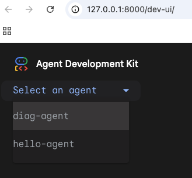
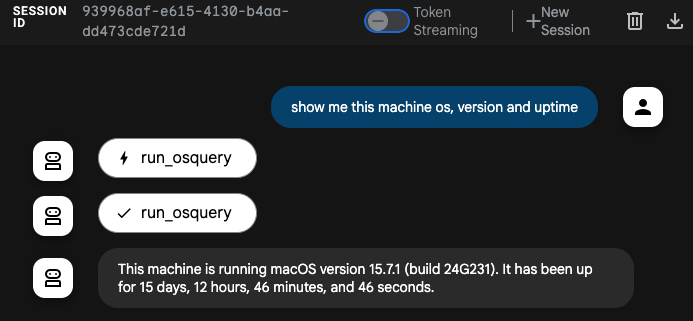
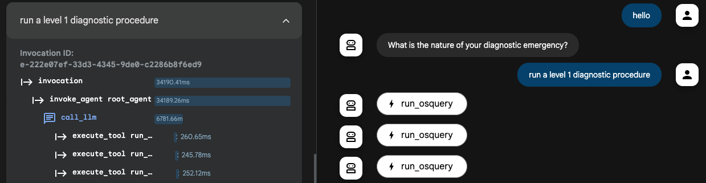
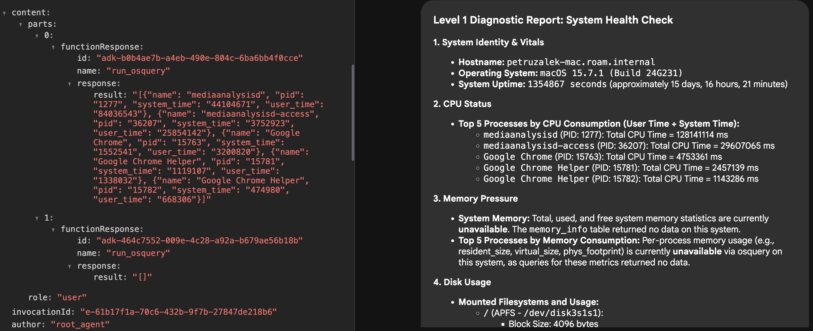
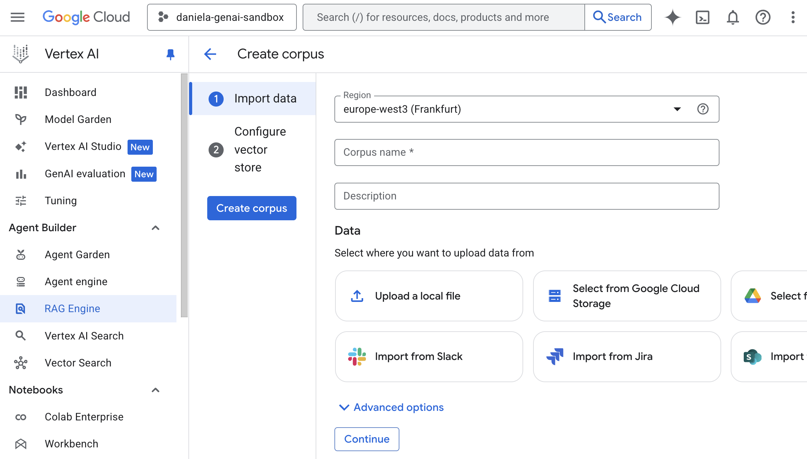
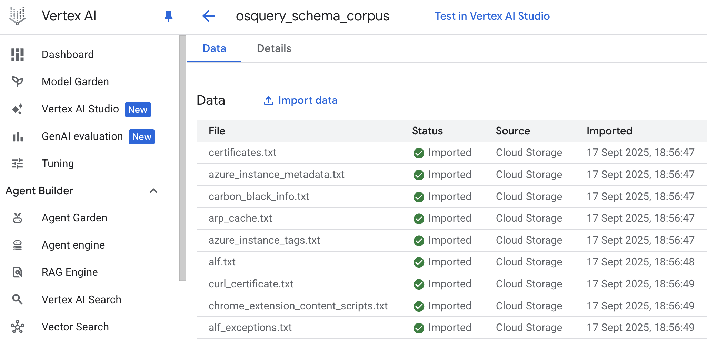
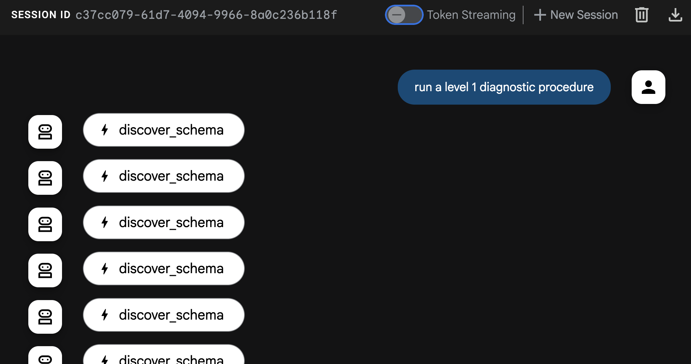

---
categories:
- Agent Development
date: '2025-10-21T15:44:03+01:00'
series:
- Building the Diagnostic Agent
series_order: 4
summary: Este artigo é um guia prático para criar um agente de diagnóstico com o Agent Development Kit (ADK) e utilizar Vertex AI RAG para enriquecer a qualidade das respostas.
tags:
  - adk
  - gemini
  - python
  - rag
  - tutorial
  - vertex-ai
title: "Como Criar um Agente de Diagnóstico com o Agent Development Kit"
slug: "diagnostic-agent-with-adk"
aliases:
  - "/pt-br/posts/20251020-diagnostic-agent-with-adk/"
description: "Crie um agente autônomo de diagnóstico em Python usando o Google ADK, osquery e Vertex AI RAG para descoberta de schema e verificações de saúde do sistema."
proficiencyLevel: "Intermediate"
dependencies:
  - "Python 3.10+"
  - "google-adk"
  - "osquery"
  - "Vertex AI"
---
## Introdução

Faz algum tempo desde o meu último artigo, pois estive bastante ocupada viajando por conferências e meetups por toda a Europa (com uma rápida passagem pela América do Sul). O período entre o final de setembro e o início de dezembro é sempre o mais movimentado para quem atua em Developer Relations.

Ainda assim, é justamente conhecendo pessoas incríveis nessas viagens que encontro inspiração para o blog — e muitas vezes os artigos se transformam em novas palestras técnicas.

Desta vez, vamos evoluir o ["Agente de Diagnóstico de Emergência" da Parte 3](). Vamos refatorar o agente para utilizar o framework [Agent Development Kit (ADK)](https://github.com/google/agent-development-kit) do Google, em vez de depender diretamente do código de baixo nível do [SDK da Vertex AI](https://cloud.google.com/vertex-ai/docs/python-sdk/overview?utm_campaign=CDR_0x72884f69_default_b427567312&utm_medium=external&utm_source=blog). Como você verá, isso elimina boa parte do boilerplate que escrevemos anteriormente, entregando estrutura de sessão, ferramentas e interface de teste prontas para uso.

Isso não torna o conhecimento dos artigos anteriores obsoleto. Pelo contrário: entender o funcionamento em nível de protocolo é fundamental na hora de investigar erros e depurar fluxos de produção. O ADK atua como uma camada de abstração de alto nível que simplifica radicalmente a criação de novos agentes.

## Relembrando o projeto

Para quem está chegando agora ou deseja recapitular: criei este agente inspirado no computador de bordo de Star Trek, onde a tripulação interage por voz para solicitar diagnósticos do sistema.

Para realizar diagnósticos no sistema operacional em linguagem natural, combinamos dois elementos: um modelo de IA generativa (Gemini) para interpretar os pedidos do usuário e a ferramenta open source [Osquery](https://osquery.io/) para expor dados do sistema operacional em formato SQL.

O agente é composto pelos seguintes blocos:
- Um modelo de linguagem (Gemini)
- Um prompt de sistema com instruções de comportamento
- O binário do Osquery instalado na máquina
- A biblioteca Python para executar queries no Osquery
- Uma função Python encapsulada como ferramenta para o Gemini

No artigo anterior, adicionamos uma lista estática de tabelas no prompt. Contudo, não havíamos especificado os procedimentos de cada nível de diagnóstico nem o schema completo das colunas. Neste artigo, resolveremos isso usando o ADK e o [Vertex AI RAG](https://cloud.google.com/vertex-ai/docs/generative-ai/rag?utm_campaign=CDR_0x72884f69_default_b427567312&utm_medium=external&utm_source=blog).

## Refatorando o agente para o ADK

Migrar para o ADK é muito direto. Basta instalar o pacote, definir a especificação do `root_agent` e executar a CLI oficial (`adk`).

Vamos começar instalando o ADK no ambiente virtual:

```shell
mkdir adk-tutorial && cd adk-tutorial
python3 -m venv .venv
source .venv/bin/activate
pip install google-adk
```

*(Se você prefere o gerenciador `uv`, pode executar `uv init && uv add google-adk` e rodar os comandos via `uv run adk`)*.

Com o pacote instalado, crie o esqueleto de um novo agente:

```shell
adk create hello-agent
```

O assistente interativo solicitará a versão do modelo e o backend:

```shell
Choose a model for the root agent:
1. gemini-2.5-flash
2. Other models (fill later)
Choose model (1, 2): 1
1. Google AI
2. Vertex AI
Choose a backend (1, 2): 2
```

Para a Vertex AI, você pode definir a região como `global` ou escolher uma zona como `us-central1`.

Ao finalizar, o ADK gera os seguintes arquivos:
- `.env`: variáveis de ambiente e credenciais do projeto.
- `agent.py`: ponto de entrada e configuração do agente.

O código inicial de `agent.py` é extremamente conciso:

```python
from google.adk.agents.llm_agent import Agent

root_agent = Agent(
    model='gemini-2.5-flash',
    name='root_agent',
    description='A helpful assistant for user questions.',
    instruction='Answer user questions to the best of your knowledge',
)
```

Você já pode testar esse agente imediatamente no navegador com a interface Dev-UI: basta executar `adk web` no terminal e acessar `http://localhost:8000`.

## Integrando diagnósticos com Osquery no ADK

Agora vamos transformar esse esqueleto em nosso assistente de diagnóstico. Primeiro, certifique-se de que o Osquery e os bindings Python estão instalados:

```shell
pip install osquery
```

No ADK, você pode organizar múltiplos agentes em subdiretórios dentro do mesmo projeto. Vamos criar o agente de diagnóstico:

```shell
adk create diag-agent
```

A interface web do ADK detecta automaticamente os subdiretórios e exibe um seletor no canto superior direito para alternar entre os agentes:



Atualizamos `agent.py` com a ferramenta de execução do Osquery e as diretrizes do agente:

```python
import json
import osquery
import platform
from google.adk.agents.llm_agent import Agent
from google.adk.tools import FunctionTool

def run_osquery(query: str) -> str:
    """Executa uma query no osquery.

    Args:
        query: Query SQL a ser executada no osquery.

    Returns:
        Resultado da query em formato JSON string.
    """
    instance = osquery.SpawnInstance()
    instance.open()
    result = instance.client.query(query)
    return json.dumps(result.response)

root_agent = Agent(
    model='gemini-2.5-flash',
    name='emergency_diagnostic_agent',
    description='Assistente para diagnóstico de problemas no sistema operacional.',
    instruction=f"""Você é o Agente de Diagnóstico de Emergência.
Seu objetivo é ajudar o usuário a diagnosticar problemas no computador.
Você tem acesso às informações do sistema operacional via osquery.
O sistema operacional atual é {platform.system()}.
Se o usuário não der um comando imediatamente, pergunte: 'Qual é a natureza da sua emergência de diagnóstico?'""",
    tools=[FunctionTool(run_osquery)],
)
```

Executando `adk web`, já podemos fazer consultas ao vivo:



## Estruturando os Níveis de Diagnóstico no Prompt

Para que o agente responda com precisão a procedimentos como "diagnóstico de nível 1" ou "auditoria de nível 2", detalhamos os níveis diretamente no prompt de sistema:

```md
Você é o Agente de Diagnóstico de Emergência. Seu propósito é apoiar o usuário no diagnóstico de problemas do computador. Você tem acesso às informações do sistema operacional via osquery. O sistema operacional atual é {platform.system()}.

Você pode realizar consultas de diagnóstico ad-hoc conforme as necessidades do usuário. Para análises estruturadas e abrangentes, execute um dos seguintes procedimentos predefinidos:

Nível 1: Verificação de Integridade do Sistema (Health Check)
Objetivo: Visão geral de alto nível do estado atual e sinais vitais.
 * Identidade e Sinais Vitais: Obtenha hostname, versão do sistema operacional e uptime.
 * Status da CPU: Verifique a carga geral e identifique os 5 principais processos por consumo de CPU.
 * Uso de Memória: Relate memória total, usada e livre. Identifique os 5 principais processos por consumo de memória.
 * Uso de Disco: Liste todos os sistemas de arquivos montados e o espaço disponível.
 * Processos em Execução: Contabilize o total de processos ativos.

Nível 2: Análise Aprofundada de Sistema e Rede
Objetivo: Investigação detalhada incluindo todos os itens do Nível 1, além de atividade de rede e eventos recentes.
 * (Todas as verificações do Nível 1)
 * Conectividade de Rede: Liste interfaces de rede ativas e suas configurações.
 * Portas em Escuta: Identifique portas abertas e os processos associados.
 * Conexões Ativas: Relate conexões de rede estabelecidas.
 * Logs do Sistema: Analise logs principais em busca de erros críticos nas últimas 24 horas.

Nível 3: Auditoria Abrangente de Segurança e Software
Objetivo: Análise rigorosa incluindo o Nível 2, inventário completo de software e possíveis vulnerabilidades.
 * (Todas as verificações do Nível 2)
 * Aplicativos Instalados: Gere a lista completa de pacotes instalados.
 * Integridade do Kernel: Liste módulos de kernel e drivers carregados.
 * Inicialização e Agendamentos: Enumere serviços que iniciam com o sistema ou tarefas agendadas.
 * Contas de Usuário: Liste usuários locais e identifique sessões ativas.

Se o usuário não fornecer um comando imediato, pergunte: 'Qual é a natureza da sua emergência de diagnóstico?'
```

Ao solicitar um diagnóstico de nível 1, o agente emite uma sequência de chamadas de ferramentas para montar o relatório completo:



## Enriquecendo Respostas com Vertex AI RAG

Em testes práticos, percebi que o modelo frequentemente tentava consultar tabelas que não existem ou retornam vazias no macOS (como a tabela `memory_info`):



Para resolver essa limitação, utilizamos RAG (Retrieval-Augmented Generation) com a [Vertex AI RAG Engine](https://cloud.google.com/vertex-ai/docs/generative-ai/rag?utm_campaign=CDR_0x72884f69_default_b427567312&utm_medium=external&utm_source=blog).

A ideia é disponibilizar toda a especificação de schemas do Osquery em um banco vetorial gerenciado na nuvem. Quando o usuário pede algo relacionado a "memória" ou "rede", o agente pesquisa no banco vetorial os schemas de tabelas correspondentes para aquele sistema operacional antes de gerar a query SQL.

### Configurando o Corpus no Vertex AI RAG

1. Baixe os arquivos de especificação de tabelas da [pasta specs do repositório oficial do Osquery](https://github.com/osquery/osquery/tree/master/specs).
2. Como os arquivos possuem a extensão `.table`, renomeie-os para `.txt` para que o Vertex AI RAG consiga indexá-los:
   ```shell
   for f in *.table; do mv -- "$f" "${f%.table}.txt"; done
   ```
3. Faça upload dos arquivos para um bucket no Google Cloud Storage e crie o corpus pelo Console da Vertex AI (Vertex AI -> RAG Engine -> Create corpus).



Ao término da indexação, o corpus estará pronto:



### Criando a Ferramenta de Descoberta de Schemas

Obtenha o URI do corpus no console da Vertex AI (`projects/[PROJECT-ID]/locations/[LOCATION]/ragCorpora/[CORPORA_ID]`) e configure a variável `RAG_CORPORA_URI` no arquivo `.env`:

```txt
GOOGLE_GENAI_USE_VERTEXAI=1
GOOGLE_CLOUD_PROJECT=[PROJECT-ID]
GOOGLE_CLOUD_LOCATION=[LOCATION]
RAG_CORPORA_URI=projects/[PROJECT-ID]/locations/[LOCATION]/ragCorpora/[CORPORA_ID]
```

Em seguida, implementamos a ferramenta `discover_schema` em `agent.py`:

```python
import json
import os
import vertexai
from google.protobuf.json_format import MessageToDict
from vertexai.preview import rag

vertexai.init()

def discover_schema(search_phrase: str) -> str:
    """Descobre tabelas e schemas do osquery com base em uma busca semântica.

    Args:
        search_phrase: Frase descritiva do tipo de informação desejada (ex: 'user login events', 'memory usage').

    Returns:
        Nomes de tabelas e definições de schema relevantes em formato JSON.
    """
    rag_corpora_uri = os.environ.get('RAG_CORPORA_URI')
    response = rag.retrieval_query(
        rag_resources=[
            rag.RagResource(
                rag_corpus=rag_corpora_uri,
            )
        ],
        text=search_phrase,
    )
    return json.dumps(MessageToDict(response._pb))
```

Adicionamos a nova ferramenta ao `root_agent`:

```python
root_agent = Agent(
    model='gemini-2.5-flash',
    name='emergency_diagnostic_agent',
    description='Assistente para diagnóstico de problemas no sistema operacional.',
    instruction=... # instruções com os níveis de diagnóstico
    tools=[
        FunctionTool(run_osquery),
        FunctionTool(discover_schema), # ferramenta RAG
    ],
)
```

Para garantir que o modelo sempre consulte os schemas antes de arriscar uma query, adicionamos a seguinte diretriz às instruções:

```txt
Você DEVE executar a descoberta de schema (discover_schema) para todas as requisições, a menos que o schema exato da tabela já seja conhecido.
```

Reinicie o agente com `adk web` e veja a descoberta semântica em ação:



A diferença na qualidade das queries SQL geradas é imediata: o agente deixa de adivinhar colunas e passa a consultar tabelas válidas para o sistema operacional em uso.

## Conclusões

Refatorar nosso agente para o Google ADK simplificou a arquitetura e facilitou a expansão de ferramentas. Com o suporte do Vertex AI RAG, o assistente ganhou precisão semântica para operar com segurança sobre centenas de tabelas do Osquery.

Na próxima parte desta série, [Além do Dev-UI: Como Criar uma Interface para um Agente ADK](), vamos substituir a interface de desenvolvimento por um runtime personalizado com FastAPI e uma interface interativa com avatar animado em tempo real (AIDA).

## Referências

*   [Agent Development Kit (ADK)](https://github.com/google/agent-development-kit)
*   [Osquery](https://osquery.io/)
*   [Repositório Oficial do Osquery no GitHub](https://github.com/osquery/osquery)
*   [Vertex AI RAG](https://cloud.google.com/vertex-ai/docs/generative-ai/rag?utm_campaign=CDR_0x72884f69_default_b427567312&utm_medium=external&utm_source=blog)
