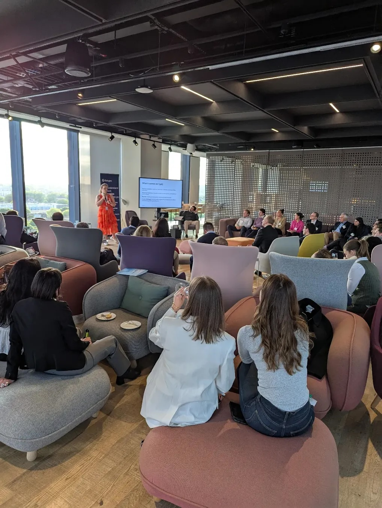
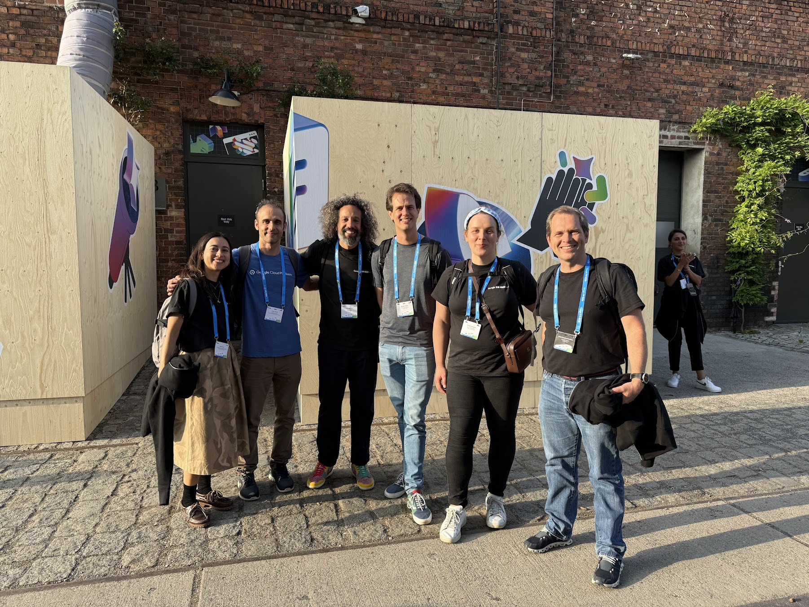
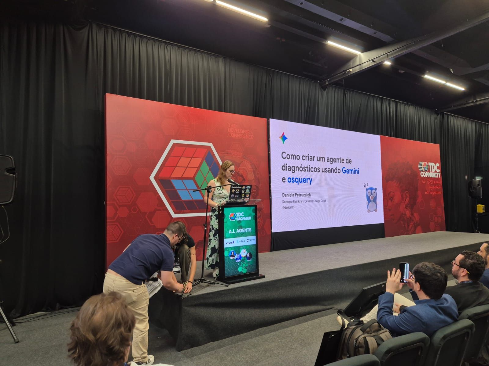
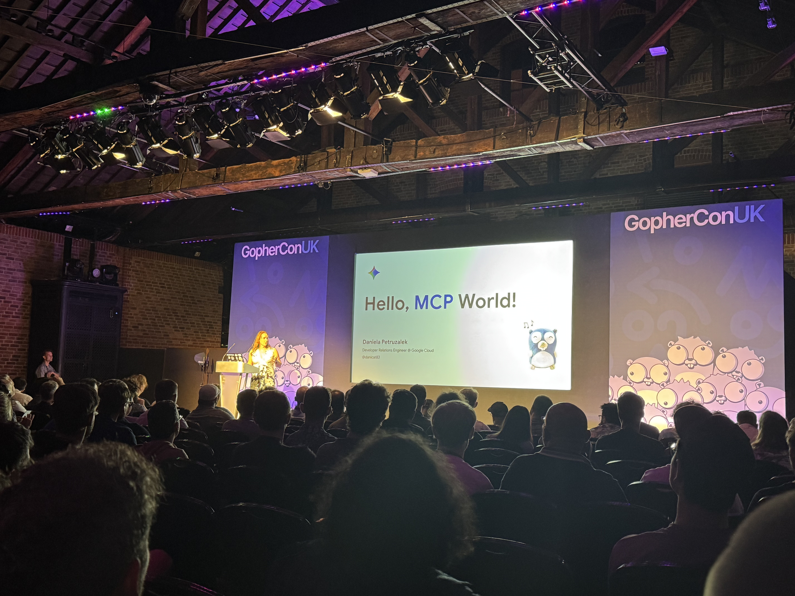
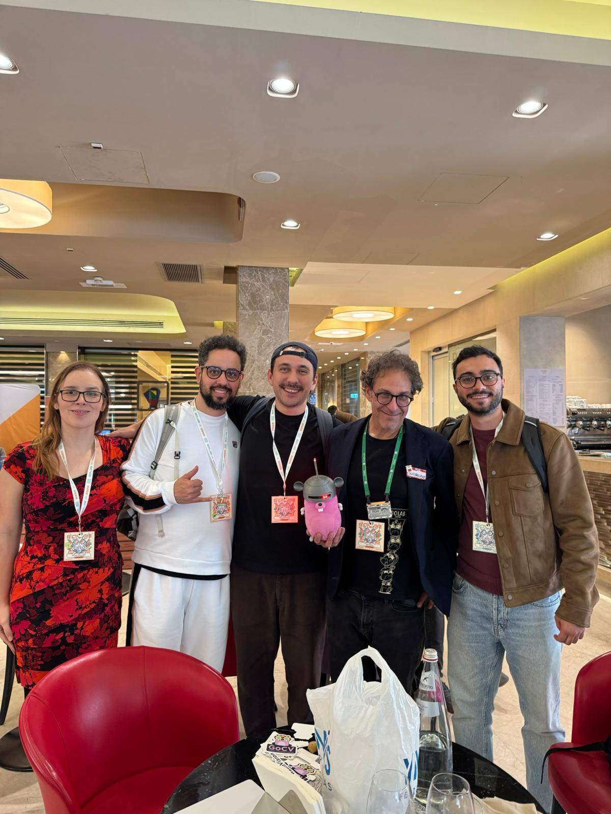
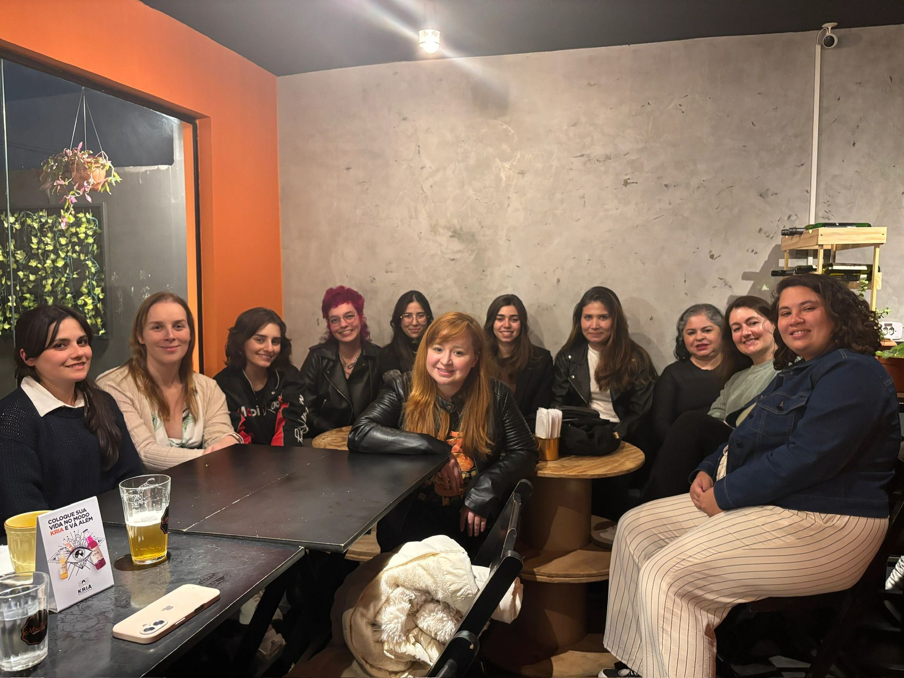
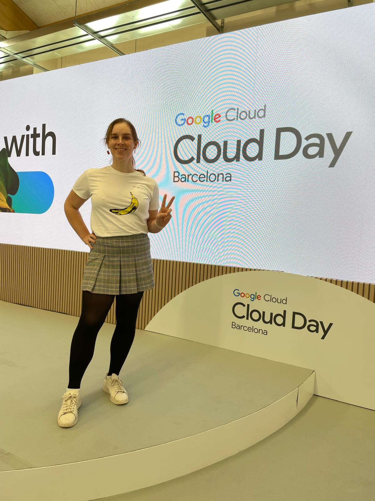

---
categories:
- Perspectives
date: 2025-10-29 09:00:00+00:00
summary: Google 入社から最初の 6 か月を祝して！5 か国 15 のイベントへの参加、AI エコシステムへのダイブ、そして個人的な健康面での大きなマイルストーン達成など、怒涛の半年間を振り返ります。
tags:
  - career
  - community
  - devrel
  - reflection
title: "Google 入社 6 か月の振り返り：DevRel、AI、そしてマイルストーン"
slug: "six-months-at-google"
aliases:
  - "/ja/posts/20251029-six-months-at-google/"
description: "Google Developer Relations Engineer としての最初の6か月間の振り返り。5カ国15イベント登壇、MCPやAIエージェントのリスキリング、個人マイルストーンを総括。"
proficiencyLevel: "Beginner"
---

今日は私にとって、とても特別な節目です。Google に入社して正式に 6 か月が経ちました！

半年がもう過ぎたなんて信じられません。この会社に加わる絶好の機会を何年も何年も待ち望んできましたが、まさに期待していた通りの素晴らしい日々だったと胸を張って言えます。刺激的な挑戦の連続、素晴らしい仲間たち、そして目を見張るほどのスピードで進むイノベーションに満ちた、実に濃密な旅路でした。

この記事では、これまでの歩みの中からいくつかのハイライトを振り返ってみたいと思います。

## 怒涛のスピード感

この 6 か月を一言で言い表すなら、間違いなく「*intense*（濃密、怒涛）」です。

光栄なことに、**5 か国 8 都市**にまたがる **15 のイベント**に参加・登壇する機会に恵まれました（気になる方のために挙げると、ロンドン、ベルリン、サンパウロ、クリチバ、ブレッチリー、フィレンツェ、バルセロナ、マラガです）。

開発者と直接顔を合わせ、彼らが何を開発しているのかを聞き、知識を共有することは常に私の情熱であり、これをこのスケールで体験できたのはまさに「唆る（exhilarating）」ものでした。（そう、AI が「exhilarating」という単語を提案してきたのですが、私は [Dr. STONE](https://www.nicovideo.jp/watch/sm36919684) の大ファンなので、今回は良しとしましょう。）

コンテンツ面では、このブログで **15 本の記事**を執筆し、[Gemini CLI と Go MCP の Codelab](https://codelabs.developers.google.com/cloud-gemini-cli-mcp-go?hl=ja#0) を作成しました。また、オープンソースや各種ドキュメントへの小さな貢献もいくつか行いました。

### 自分自身のリファクタリング

世の中に JavaScript フレームワークの増殖スピードよりも速く増えているものが 1 つだけあるとすれば、それは AI ツールです。

私個人として最もエネルギーを費やしたのは、AI 開発の凄まじいスピードについていくことでした。エコシステムの進化は留まることを知りません。Vibe Coding やエージェントから、Model Context Protocol (MCP)、そして絶え間なく登場する新しいツールやモデルに至るまで、そのすべてをキャッチアップし続けるのは並大抵のことではありません。

4 月に Google での旅をスタートさせたとき、私は MCP が何なのかさえ知らず、自分自身で Vibe Coding を試した経験もほとんどありませんでした。それが 6 か月経った今では、それらの技術にどっぷりと浸かる毎日を送っています。

以前の私は、いつも変わらない「また新しい CRUD API を作る仕事か……」というルーティンに正直うんざりしていたので、自分自身をリスキリングするこの機会を得られたことは本当に幸運でした。そうした知識が今や時代遅れになったと言うつもりはありません（基礎的な知識は今でも極めて重要です）。しかし、すべてのコードを自分自身で手書きしなくてよくなったのは本当にありがたいことです。ワークフローに AI を導入したことは大きな転換点となり、私のエンジニアキャリアに新たな命を吹き込んでくれました。

## コミュニティとのつながり

これほど急速に変化する環境の中では、圧倒されて途方に暮れてしまいがちです。そこで私の戦略は、自分が最も得意とすること、すなわち **Python** と **Go** のコミュニティに寄り添い続けることにフォーカスすることでした。

もちろん、すべての開発者コミュニティを心から大切に思っていますし、世界中のエンジニアと交流する楽しさは言葉では言い尽くせません。それでも、この 2 つのエコシステムにしっかりと軸足を置くことで、より明確な目的意識と集中力を持って AI 革命の波を乗りこなすことができました。

ADHD の気質を持つ私の脳は、あらゆる場所に首を突っ込みたがりますが、やはりフォーカスが不可欠だと実感しています。ひとりの人間にとって 2 つのコミュニティに関わることさえ多すぎる、と言う人もいるかもしれませんが、2017 年の初めにカンファレンス登壇を巡り始めて以来、Python と Go は私にとってずっと特別な存在であり続けています。

2018 年の Python Brazil でオープニング基調講演を務めたことは、2024 年の GopherCon（シカゴ）での基調講演と並び、今でも私のキャリアにおける最高のハイライトです。シカゴといえば、近いうちに Go のミューテーションテスト（mutation testing）のテーマを再訪する予定ですので、ぜひお楽しみに！

## もうひとつの個人的な勝利

仕事面での成果も素晴らしいものですが、Google 入社以来の最大の達成感は、実はプライベートなところにあります。なんと **16 kg の減量**に成功しました（そして現在も継続中です）！

Google オフィスの充実した無料のカフェテリアやスナック、そして数々のイベント遠征を思えば、この減量ミッションは間違いなく「ハードモード」でした！これだけは言わせてください。**大好きな仕事に情熱を注ぐことは、メンタルヘルスに驚くほど素晴らしい効果をもたらす**ということです。

互いを支え合える環境に身を置き、心から満たされる仕事をしていると、人生のあらゆる側面にポジティブな波及効果が連鎖していくのだと実感しています。

## これからに向けて

このような刺激的な時代に Google の一員であれることを、心から誇りに思っています。私たちは今まさに未来を創り出しており、その渦中に身を置けることは夢の実現そのものです。

次の 6 か月、そしてその先を見据えると、感謝とワクワク感で胸がいっぱいです。学ぶべきことはまだまだ山ほどあり、繋がるべきコミュニティも数多くあります。そしてもちろん、もっとたくさんの「Vibe Coding」を実践していくつもりです。

夢を見ることを決してやめないでください。私にできたのですから、あなたにも絶対にできます！

*追記（P.S.）：誤解のないように言っておくと、私は生成 AI が登場するずっと前からダッシュ（—）を使った文章を書いてきました。もっとも、この記事の推敲には Gemini の力を少し借りましたが :)*
