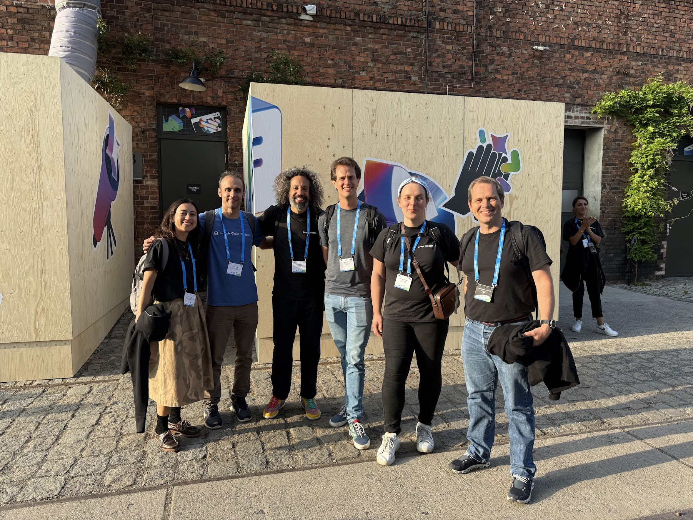

今日は私にとって特別な節目です。Google に入社して正式に 6 ヶ月が経ちました！

半年がもう過ぎたなんて信じられません。この会社に入る適切な機会を何年も待ち望んでいましたが、期待していた通りの素晴らしい経験だと言えます。信じられないような挑戦、素晴らしい人々、そして驚くほど速いイノベーションのペースに満ちた旅でした。

この記事では、これまでの旅のハイライトをいくつか紹介したいと思います。

## ペースの速さについて

この 6 ヶ月を一言で表すなら、「**濃密**」でしょう。

私は **5 カ国**、**8 都市**で開催された **15 のイベント**に参加する機会に恵まれました（興味のある方のために：ロンドン、ベルリン、サンパウロ、クリチバ、ブレッチリー、フィレンツェ、バルセロナ、マラガ）。

開発者と直接会い、彼らが何を作っているのかを聞き、知識を共有することは常に私の情熱でしたが、この規模でそれを行うことは非常に刺激的でした。（はい、AI は「exhilarating（刺激的）」という言葉を提案しましたが、私は [Dr. Stone](https://www.nicovideo.jp/watch/sm36919684) の大ファンなので、今回はそのまま使います。）

コンテンツ面では、このブログに **15 本の記事**を書き、[1 つの Codelab](https://codelabs.developers.google.com/cloud-gemini-cli-mcp-go?hl=en#0) を作成しました。また、オープンソースやドキュメントにも少し貢献しました。

### 自分自身の Refactoring

JavaScript フレームワークの数よりも速く成長しているものが世界に 1 つだけあります。それは AI ツールです。

私個人にとって最大の努力は、AI 開発の凄まじい速度に追いつくことでした。エコシステムは常に進化し続けています。Vibe Coding や Agent から Model Context Protocol (MCP)、そして次々と登場する新しいツールやモデルまで、すべてを把握し続けるのは大変な作業です。

4 月に Google での旅を始めたとき、私は MCP が何であるか全く知らず、Vibe Coding の経験もほとんどありませんでした。6 ヶ月経った今、私はそれらにどっぷりと浸かっています。

以前の私は「また新しい CRUD API を作るのか」と退屈していたので、自分自身をリスキリングするこの機会を得られたことは非常に幸運だと思っています。この知識が時代遅れになったとは言いません（基礎知識は依然として重要です）が、自分でコードを書く必要がなくなったことはとても嬉しいです。ワークフローに AI を取り入れたことは大きな変化であり、私のキャリアに新たな活力を与えてくれました。

## コミュニティとのつながり

このように急速に変化する状況では、圧倒されてしまいがちです。私の戦略は、自分が最も得意とすること、つまり **Python** と **Go** コミュニティの近くにいることに集中することでした。

私はすべての開発者コミュニティを大切に思っています（世界中の開発者と交流することがどれほど楽しいか、言葉では言い表せません）が、この 2 つのエコシステムに軸足を置くことで、より集中して目的を持って AI 革命を乗り切ることができました。

私の ADHD の脳は確かにあらゆる場所にいたいと思っていますが、集中することは重要だと感じています。1 人で 2 つのコミュニティに関わるのは多すぎるという人もいるかもしれませんが、2017 年初頭にカンファレンス巡りを始めて以来、Python と Go は私にとって特別な存在です。

2018 年の Python Brazil でのオープニング基調講演は、2024 年の Gophercon (Chicago) での基調講演と並んで、今でも私のキャリアのハイライトの 1 つです。シカゴといえば、近いうちに Go のミューテーションテストについて再考する予定ですので、お楽しみに！

## 個人的な勝利

仕事での成果も素晴らしいですが、入社以来の最大の成果は個人的なものです。**16 kg の減量**を達成しました（現在も継続中）！

Google オフィスの無料の食事やこれらすべてのイベントを考えると、この成果はハードモードでした！**好きな仕事をすることは、メンタルヘルスに素晴らしい効果をもたらす**と言いたいです。

充実感を得られる仕事をし、協力的な環境にいると、それは人生の他のあらゆる側面に良い波及効果をもたらします。

## 今後に向けて

このようなエキサイティングな時期に Google の一員であることを非常に誇りに思います。私たちは未来を築いており、その真っ只中にいることは夢のようです。

次の 6 ヶ月、そしてその先を楽しみにしながら、私は感謝と興奮でいっぱいです。学ぶべきことはまだたくさんあり、つながるべきコミュニティもたくさんあります。そしてもちろん、もっと「Vibe Coding」をする必要があります。

夢を見ることをやめないでください。私にできたのなら、あなたにもできます！

