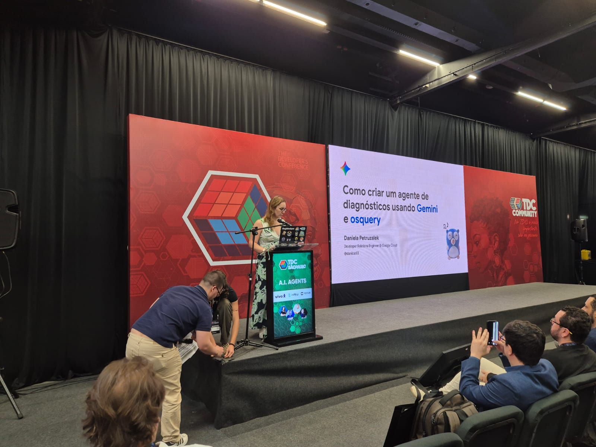

Today marks a very special milestone for me: I have officially completed my first six months at Google!

It’s hard to believe half a year has already passed. After many, many years of waiting for the right opportunity to join this company, I can honestly say it has been everything I hoped for. It’s been quite a journey, filled with incredible challenges, amazing people, and a pace of innovation that is remarkably fast.

In this article I want to share a few highlights of my journey so far.

## Talking about fast-paced

If I had to summarize these past six months in one word, it would be *intense*.

I’ve had the privilege of participating in **15 events** across **8 different cities** in **5 countries** (for those who are curious: London, Berlin, Sao Paulo, Curitiba, Bletchley, Florence, Barcelona and Malaga).

Connecting with developers face-to-face, hearing about what they are building, and sharing knowledge has always been my passion, and doing it at this scale has been exhilarating. (Yes, AI suggested the word "exhilarating", but I'm a huge [Dr. Stone](https://www.nicovideo.jp/watch/sm36919684) fan so I'll let it pass this time.)

On the content side, I have written **15 articles** for this blog and authored [one codelab](https://codelabs.developers.google.com/cloud-gemini-cli-mcp-go?hl=en#0). I’ve also made a few small contributions to open source and documentation.

### Refactoring myself

There is only one thing in the world that grows faster than the number of JavaScript frameworks: AI tools.

The biggest effort for me personally has been catching up with the sheer velocity of AI development. The ecosystem never stops evolving. From Vibe Coding and Agents to the Model Context Protocol (MCP) and a constant stream of new tools and models, staying on top of everything is a monumental task.

When I started my Google journey back in April I had no idea of what MCP was and had very little experience with vibe coding myself. Fast forward 6 months now I live and breathe those things.

I consider myself very lucky to have this opportunity to reskill myself as previous me was already bored of the same old "let's build a new CRUD API". I won't say this knowledge is obsolete now - foundational knowledge continues to be critical - but I'm so glad I don't have to write the code myself. Adding AI to my workflow was a game changer and injected a new life into my career.

## Connecting with the Community

In such a rapidly changing landscape, it’s easy to feel overwhelmed. My strategy has been to focus on what I do best: staying close to the **Python** and **Go** communities.

While I have a space in my heart for all developer communities — I can't really capture into words how much I enjoy interacting with devs all around the world — anchoring myself in these two ecosystems has helped me navigate the AI revolution with more focus and purpose.

My ADHD brain for sure wants to be everywhere, but I find that focus is important. Some would say that even two communities is already too much for a single person, but both Python and Go are special to me ever since I started doing the conference rounds in early 2017.

Being the opening keynote for Python Brazil in 2018 is still one of the highlights of my career, tied right there on top with my keynote at Gophercon (Chicago) in 2024. Talking about Chicago, I'm planning to revisit mutation testing in Go very soon, stay tuned!

## A Personal Victory

While the professional achievements are wonderful, my biggest achievement since joining is a personal one: I’m celebrating **16 kg of weight loss** (and counting)!

Given all the free food at the Google office and all those events, this achievement was in hard mode! I just want to say that **working with what you love does wonders for your mental health.**

When you are in a supportive environment, doing work that fulfills you, it has a cascading positive effect on every other aspect of your life.

## Looking Ahead

I'm incredibly proud to be part of Google during such exciting times. We are building the future, and being in the thick of it is a dream come true.

As I look forward to the next six months and beyond, I am filled with gratitude and excitement. There is so much more to learn, so many more communities to connect with, and yes, more "vibe coding" to do.

Never stop dreaming. If I could do it, so can you!

*P.S.: Before you judge me, I've been using dashes to write since long before GenAI was a thing, although this article had a little help from Gemini to tidy things up :)*