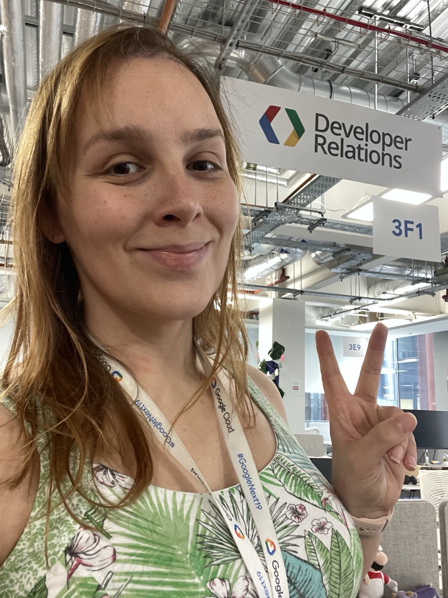

Hoje marca um marco muito especial para mim: completei oficialmente meus primeiros seis meses no Google!

É difícil acreditar que meio ano já se passou. Depois de muitos, muitos anos esperando pela oportunidade certa para ingressar nesta empresa, posso dizer honestamente que tem sido tudo o que eu esperava. Tem sido uma jornada e tanto, repleta de desafios incríveis, pessoas maravilhosas e um ritmo de inovação que é notavelmente rápido.

Neste artigo, quero compartilhar alguns destaques da minha jornada até agora.

## Falando sobre ritmo acelerado

Se eu tivesse que resumir esses últimos seis meses em uma palavra, seria *intenso*.

Tive o privilégio de participar de **15 eventos** em **8 cidades diferentes** em **5 países** (para os curiosos: Londres, Berlim, São Paulo, Curitiba, Bletchley, Florença, Barcelona e Málaga).

Conectar-me com desenvolvedores pessoalmente, ouvir sobre o que estão construindo e compartilhar conhecimento sempre foi minha paixão, e fazer isso nessa escala tem sido estimulante. (Sim, a IA sugeriu a palavra "estimulante", mas sou um grande fã de [Dr. Stone](https://www.nicovideo.jp/watch/sm36919684), então vou deixar passar desta vez.)

No lado do conteúdo, escrevi **15 artigos** para este blog e sou autor de [um codelab](https://codelabs.developers.google.com/cloud-gemini-cli-mcp-go?hl=en#0). Também fiz algumas pequenas contribuições para open source e documentação.

### Refatorando a mim mesmo

Só existe uma coisa no mundo que cresce mais rápido do que o número de frameworks JavaScript: ferramentas de IA.

O maior esforço para mim, pessoalmente, tem sido acompanhar a velocidade vertiginosa do desenvolvimento de IA. O ecossistema nunca para de evoluir. De Vibe Coding e Agentes ao Model Context Protocol (MCP) e um fluxo constante de novas ferramentas e modelos, ficar por dentro de tudo é uma tarefa monumental.

Quando comecei minha jornada no Google em abril, eu não tinha ideia do que era MCP e tinha muito pouca experiência com vibe coding. Avançando 6 meses, agora eu vivo e respiro essas coisas.

Considero-me muito sortudo por ter esta oportunidade de me requalificar, já que o meu "eu" anterior já estava entediado com o mesmo velho "vamos construir uma nova API CRUD". Não vou dizer que esse conhecimento está obsoleto agora - o conhecimento fundamental continua sendo crítico - mas estou muito feliz por não ter que escrever o código sozinho. Adicionar IA ao meu fluxo de trabalho foi um divisor de águas e injetou uma nova vida em minha carreira.

## Conectando com a Comunidade

Em um cenário de mudanças tão rápidas, é fácil se sentir sobrecarregado. Minha estratégia tem sido focar no que faço de melhor: ficar perto das comunidades **Python** e **Go**.

Embora eu tenha um espaço no meu coração para todas as comunidades de desenvolvedores — não consigo realmente expressar em palavras o quanto gosto de interagir com devs em todo o mundo — ancorar-me nesses dois ecossistemas me ajudou a navegar na revolução da IA com mais foco e propósito.

Meu cérebro com TDAH com certeza quer estar em todos os lugares, mas acho que o foco é importante. Alguns diriam que até duas comunidades já é demais para uma única pessoa, mas tanto Python quanto Go são especiais para mim desde que comecei a fazer o circuito de conferências no início de 2017.

Ser o keynote de abertura da Python Brasil em 2018 ainda é um dos destaques da minha carreira, empatado lá no topo com meu keynote na Gophercon (Chicago) em 2024. Falando em Chicago, estou planejando revisitar testes de mutação em Go muito em breve, fiquem ligados!

## Uma Vitória Pessoal

Embora as conquistas profissionais sejam maravilhosas, minha maior conquista desde que entrei é pessoal: estou comemorando **16 kg de perda de peso** (e contando)!

Dada toda a comida de graça no escritório do Google e todos esses eventos, essa conquista foi no modo difícil! Só quero dizer que **trabalhar com o que você ama faz maravilhas pela sua saúde mental.**

Quando você está em um ambiente de apoio, fazendo um trabalho que o preenche, isso tem um efeito positivo em cascata em todos os outros aspectos da sua vida.

## Olhando para o Futuro

Estou incrivelmente orgulhoso de fazer parte do Google durante tempos tão emocionantes. Estamos construindo o futuro, e estar no meio disso é um sonho que se tornou realidade.

Enquanto olho para os próximos seis meses e além, estou cheio de gratidão e entusiasmo. Há muito mais para aprender, muito mais comunidades para se conectar e, sim, mais "vibe coding" para fazer.

Nunca pare de sonhar. Se eu consegui, você também consegue!

*P.S.: Antes que você me julgue, eu uso travessões para escrever desde muito antes da GenAI existir, embora este artigo tenha tido uma ajudinha do Gemini para organizar as coisas :)*
