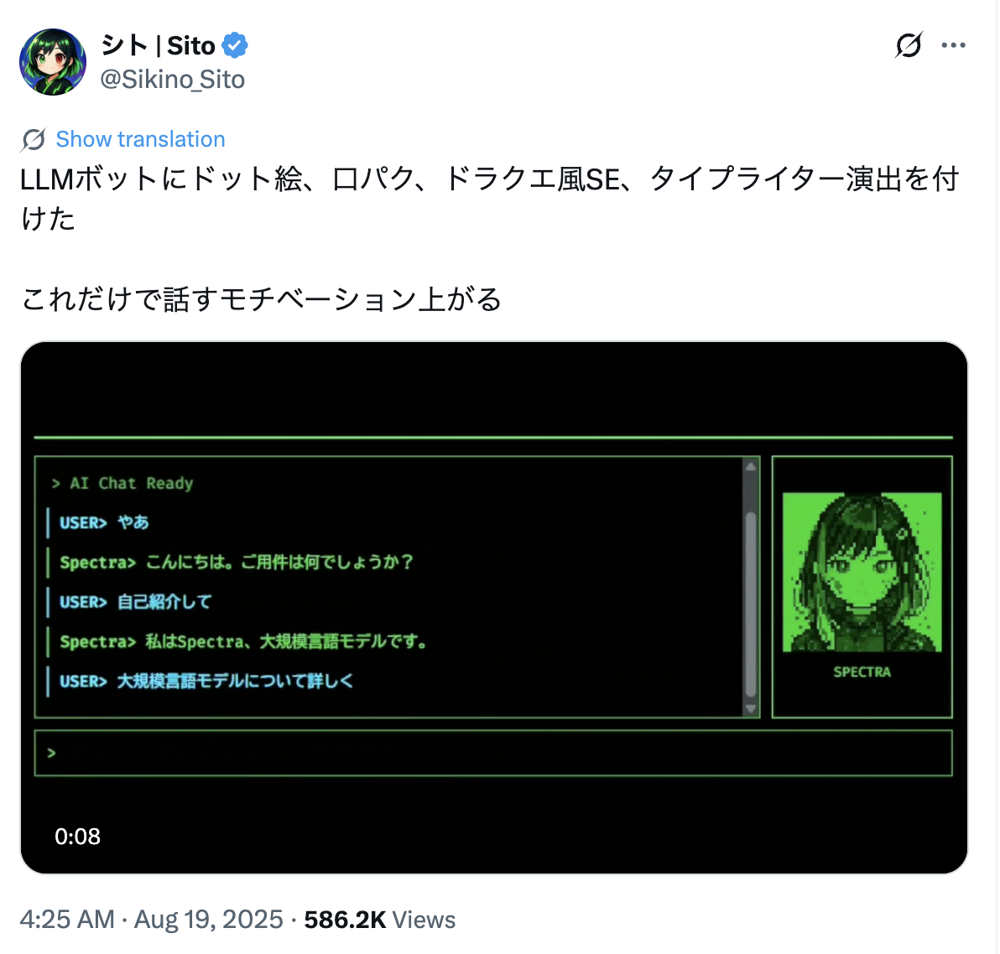
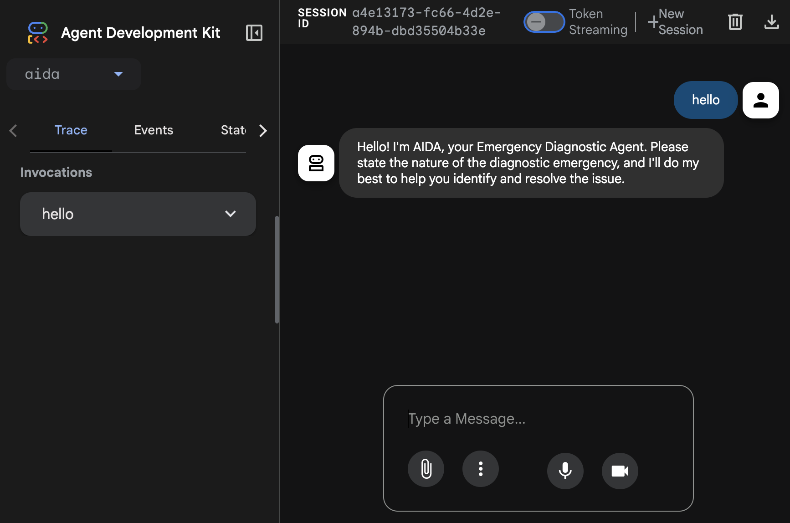
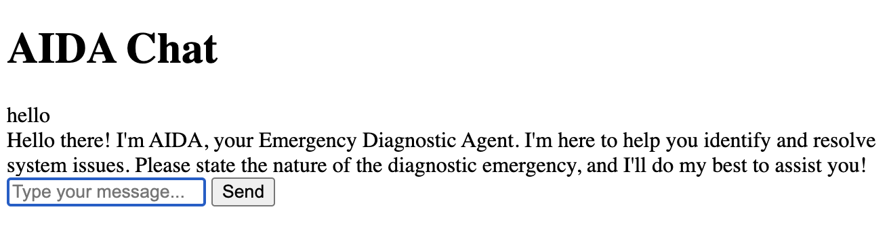
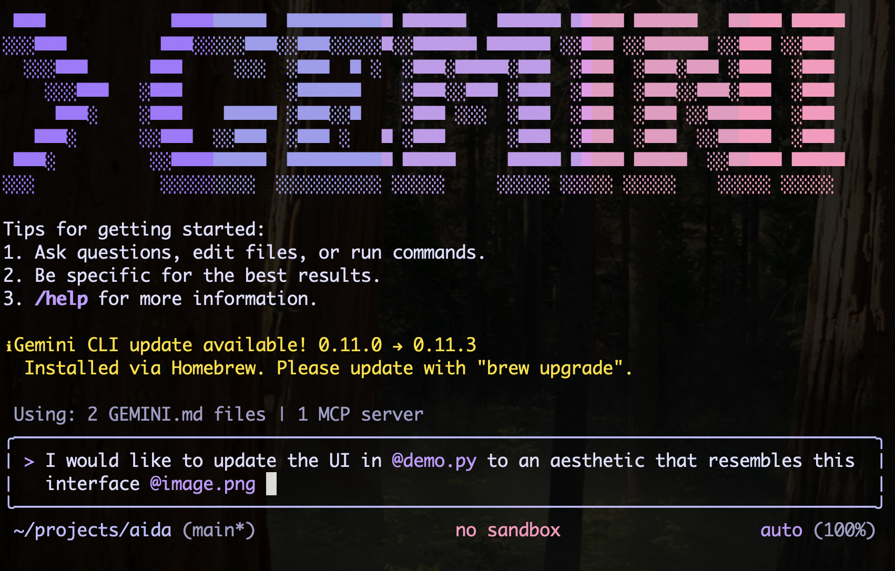
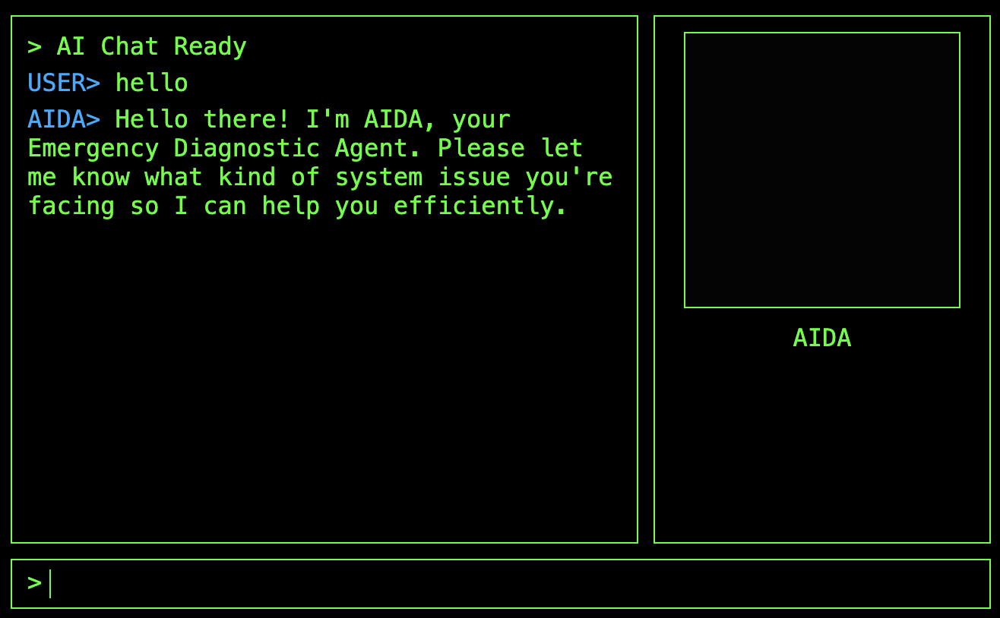
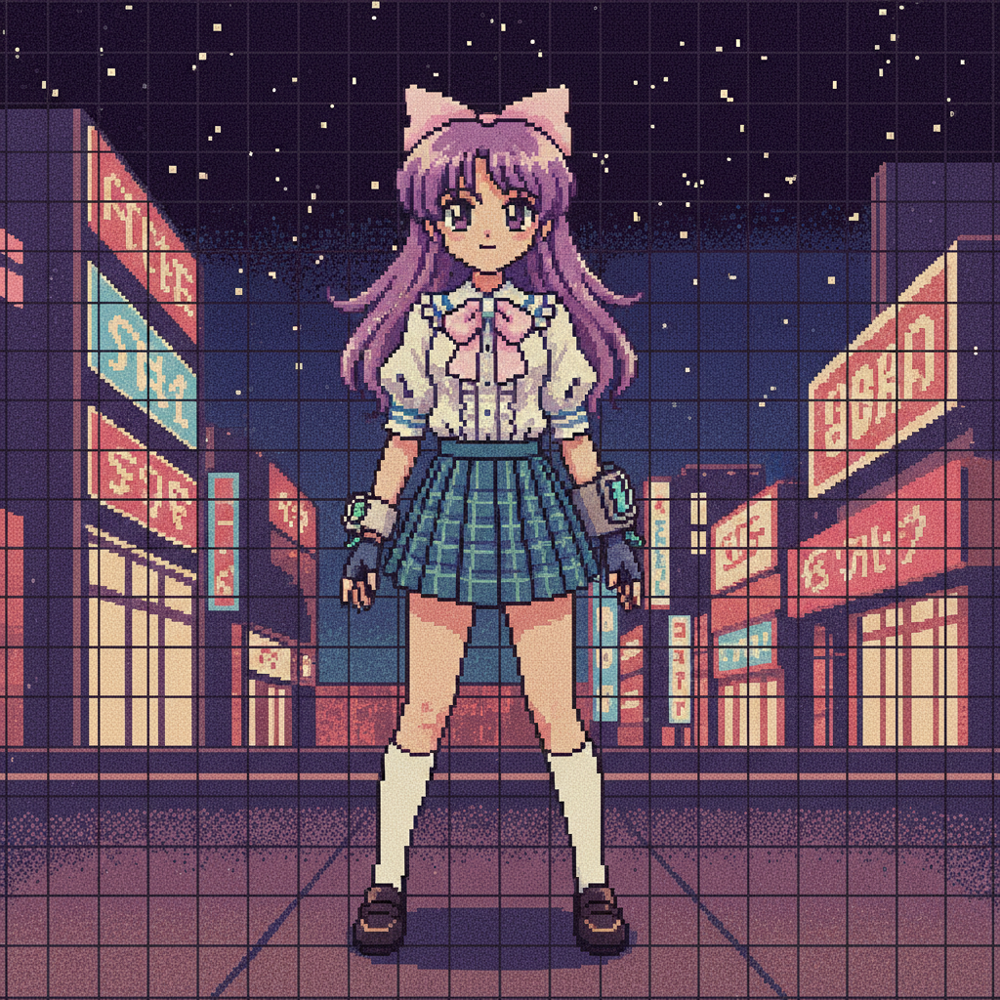
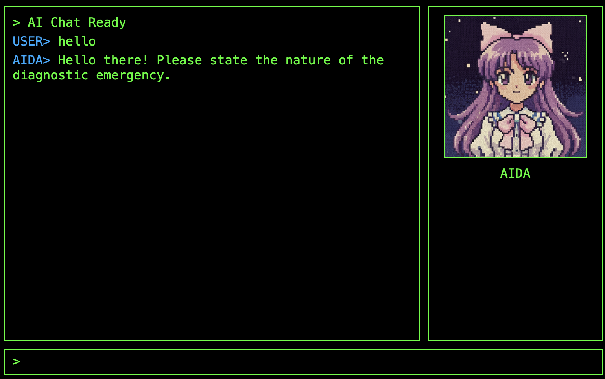
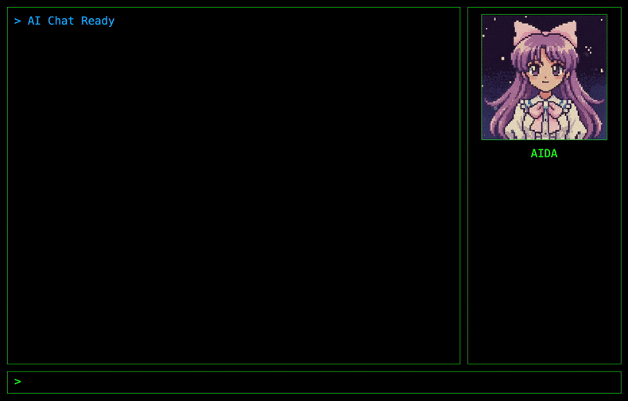

---
categories:
- Agent Development
date: '2025-10-31T11:43:35Z'
series:
- Building the Diagnostic Agent
series_order: 5
summary: Google ADK エージェントにレトロスタイルのカスタムインターフェースを構築する実践ガイド。FastAPI と JavaScript を用いて標準の Dev-UI を置き換え、リアルタイムストリーミングと連動して動く AI 生成アバターを実装する手順を解説します。
tags:
  - adk
  - fastapi
  - gemini
  - javascript
  - python
  - tutorial
title: "Dev-UI の先へ：ADK エージェントのカスタムUIを構築する方法"
slug: "building-aida"
aliases:
  - "/ja/posts/20251031-building-aida/"
description: "Google ADK の Dev-UI を脱却し、FastAPI バックエンド、Vanilla JS クライアント、ストリーミング同期アニメーション付きアバターUIを構築する実践チュートリアル。"
proficiencyLevel: "Intermediate"
dependencies:
  - "Python 3.11+"
  - "Google ADK"
  - "FastAPI"
  - "Uvicorn"
  - "Gemini CLI"
---

この半年間、Google での DevRel 業務の一環として、生成 AI やバイブコーディング、エージェント開発など、関連するあらゆる領域を探求してきました。新しい技術を学ぶときは、実際に動くものを作ってみるのが一番の近道です。この期間に私が情熱を注いできたプロジェクトのひとつが「診断エージェント」でした。これは、自然言語を使ってコンピューターのトラブルを診断できるアシスタントソフトウェアです。

本シリーズの第4弾「[Agent Development Kit (ADK) で診断エージェントを作成する]()」では、Google の [ADK (Agent Development Kit)](https://google.github.io/adk-docs/) を使って診断エージェントをリファクタリングしました。今回は、標準の Dev-UI から一歩進んで、ADK エージェント向けのカスタムフロントエンドを作成し、プロジェクトに個性豊かなキャラクターと UI を与える方法を解説します。

## 新しいユーザーインターフェースを求めて

これまでは、ADK、[Gemini](https://gemini.google.com/)、[osquery](https://osquery.io/)、[Vertex AI](https://cloud.google.com/vertex-ai/docs/start/introduction-unified-platform) といった主要コンポーネントを組み合わせて、小さな MVP を作り上げてきました。多少のクセはあったものの十分に面白く、ここ数か月の登壇でのトークテーマとしても活用していました。

次のステップをどうしようかと考えていたとき、8月に見かけた [Sito さん](https://x.com/Sikino_Sito) のツイートを思い出しました：



アニメやレトロゲームの大ファンである私にとって、このビジュアルはたまらなく魅力的でしたが、当時はまだ自分のプロジェクトと直接結びついてはいませんでした。それから数か月後、スペイン・マラガの BiznagaFest での登壇準備をしていたとき、ADK の開発用 UI を超えて、エージェントのための本格的なクライアントを作ってみたいと考えるようになりました。その瞬間、点と点がカチッと繋がったのです。

Sito さんは [Avatar UI Core](https://github.com/sito-sikino/avatar-ui-core) というオープンソースプロジェクトを公開されていますが、当時の私にはすぐに統合できるほどの知識がありませんでした。前述の通り、学ぶための最善の方法は「自分で作ること」です。そこで、Sito さんの作品にインスパイアされながら独自の UI を自作することにしました。また、レトロな世界観は大好きですが、8-bit というよりは 16-bit 時代のような、少しだけモダンさを残したテイストにしたいと考えました。

## ADK ランタイムを探る

独自の UI を構築するための最初のステップは、エージェントランタイムを用意することでした。ランタイムとは、エージェントを実際に実行し、ユーザーのリクエストをエージェントへルーティングするとともに、エージェントから返ってくるイベントをキャプチャしてモデルのレスポンスを処理するコンポーネントです。

これまでは `adk web` コマンドで起動できる ADK の開発用 UI（Dev-UI）に頼っていたため、ランタイムを自分で書く必要がありませんでした：



開発用 UI は非常に便利です。モデルへのリクエストやレスポンスのインスペクト、評価セットの作成といった多数のデバッグ機能が揃っているほか、画像や双方向ストリーミングを扱うマルチモーダル機能も標準で備わっています。

ある意味、Dev-UI が最初から完璧に動いてくれたおかげで、私はエージェントの機能やツールの実装だけに集中でき、ランタイム自体の探索を後回しにしてしまっていたとも言えます。しかし、独自の本格的な UI を作るとなると、Dev-UI を自前の実装に置き換え、エージェントの Runner を自分で直接制御しなければなりません。

システムの全体アーキテクチャは以下の通りです：


flowchart LR
    frontend["`Frontend
    (HTML/CSS + JS)`"]
    runtime[Runtime]
    root["Root Agent"]
    osquery["osquery"]
    schema["schema"]
    rag[("Schema RAG")]
    os("Operating System")
    
    frontend -->|GET/POST| runtime
    
    subgraph be ["`Backend
    (FastAPI)`"]
    runtime -- クエリ --> root
    root -- イベント --> runtime
    root --> osquery
    root --> schema
    subgraph tools
    osquery
    schema
    end
    end
    
    osquery --> os
    schema --> rag


HTML/CSS と JavaScript で書かれた軽量なフロントエンドが、Python の [FastAPI](https://fastapi.tiangolo.com/) で構築されたバックエンドに対してリクエストを送信します。バックエンド側では ADK の Runner を起動し、ルートエージェントとの対話を制御します。

ルートエージェントは AIDA の「頭脳」であり、リクエストの処理（LLM へのルーティング）と必要なツール呼び出しを担当します。ルートエージェントの処理が完了すると、ランタイムが処理するためのイベントが発行されます。

まずは最小限の実装（ベアボーン実装）から見ていきましょう。なお、ルートエージェントの定義自体は[前回の記事（Agent Development Kit (ADK) で診断エージェントを作成する）]() で解説しているため、ここでは割愛します。

ユーザーセッションを管理するために、`Runner` クラスとセッションサービスが必要になります。ADK にはさまざまなセッションサービスの実装が用意されていますが、今回は単一ユーザーかつセッションが一時的なものであるため、シンプルに `InMemorySessionService` を使用し、ユーザー ID とセッション ID をハードコードします。

セッションと Runner の初期化コードは以下の通りです：

```py
from fastapi import FastAPI
from google.adk.runners import Runner
from google.adk.sessions import InMemorySessionService
from dotenv import load_dotenv

load_dotenv()

# --- Agent Definition ---
from aida.agent import root_agent

APP_NAME = "aida"

# --- Services and Runner Setup ---
session_service = InMemorySessionService()
runner = Runner(
    app_name=APP_NAME, agent=root_agent, session_service=session_service
)
app = FastAPI()
```

次に、エージェントにメッセージを送信するためのエンドポイントを実装します。名前は `chat` としましょう：

```py
from fastapi import Request
from fastapi.responses import JSONResponse
from google.genai.types import Content, Part

# --- API Endpoint for Chat Logic ---
@app.post("/chat")
async def chat_endpoint(request: Request):
    """チャット処理を行い、エージェントの最終応答を返します。"""
    body = await request.json()
    query = body.get("query")
    user_id = "demo_user"
    session_id = "demo_session"

    # セッションが存在することを確認
    session = await session_service.get_session(app_name=APP_NAME, user_id=user_id, session_id=session_id)
    if not session:
        session = await session_service.create_session(app_name=APP_NAME, user_id=user_id, session_id=session_id)

    response_text = ""
    async for event in runner.run_async(
        user_id=user_id,
        session_id=session_id,
        new_message=Content(role="user", parts=[Part.from_text(text=query)]),
    ):
        if event.is_final_response() and event.content and event.content.parts[0].text:
            response_text = event.content.parts[0].text

    return JSONResponse(content={"response": response_text})
```

冒頭の数行は一般的なリクエスト処理とハードコードされたセッション管理です。このコードの肝は `runner.run_async` の呼び出しで、ルートエージェントからイベントが非同期に発行されます。ここでは最終応答（`is_final_response()`）のみに関心があるため、それを抽出して呼び出し元に JSON レスポンスとして返しています。

以下のコマンドを実行して、この小さなアプリをテストできます：

```sh
$ uvicorn main:app
...
INFO:     Started server process [86669]
INFO:     Waiting for application startup.
INFO:     Application startup complete.
INFO:     Uvicorn running on http://127.0.0.1:8000 (Press CTRL+C to quit)
```

そして別のターミナルから `/chat` に POST リクエストを送ってみます：

```sh
$ curl -X POST localhost:8000/chat -d '{"query":"hello"}'
{"response":"Hello! Please state the nature of the diagnostic emergency."}
```

現時点ではまだ UI が進化したようには見えませんが、着実に前進しています。洗練された美しいものを作る前には、まず無骨なプロトタイプから始まるものです :)

## エージェントフロントエンドの構築

UI を描画する方法は無数にありますが、私はフロントエンド開発が特に得意というわけではありません。そのため、デザイン周りはすべて Gemini CLI に任せることにしました。結果として、私が自分で書くよりもはるかに素晴らしいものを作ってくれました。

ここでは、PoC（概念実証）として最初の UI を描画するための極めてシンプルなアプローチを紹介します。ただ、その後はフロントエンドに詳しい誰かに相談するか、私と同じように Gemini CLI を試してみることをおすすめします。

何らかの方法で HTML を配信する必要があるため、手軽な方法として FastAPI に新しいエンドポイントを追加します：

```py
from fastapi.responses import HTMLResponse

# 詳細は以下の HTML を参照
HTML_CONTENT = """
...
"""

# --- Web UI Endpoint ---
@app.get("/", response_class=HTMLResponse)
async def get_chat_ui():
    return HTML_CONTENT
```

もちろん重要なのは実際の HTML コンテンツです。ここでは「チャットウィンドウ」「入力ボックス」「メッセージ送信ボタン」という3つの要素を定義します。

コードを簡潔にするため、以下のスニペットからはスタイル（CSS）をすべて削ぎ落としています。見た目は無骨ですが、機能としては十分です：

```html
<!DOCTYPE html>
<html lang="ja">
<head>
    <title>AIDA Chat</title>
</head>
<body>
    <h1>AIDA Chat</h1>
    <div id="chat-window"></div>
    <form id="input-area">
        <input type="text" id="user-input" placeholder="メッセージを入力..." autocomplete="off">
        <button type="submit">送信</button>
    </form>

    <script>
        const chatWindow = document.getElementById('chat-window');
        const inputForm = document.getElementById('input-area');
        const userInput = document.getElementById('user-input');

        function appendMessage(text, className) {
            const div = document.createElement('div');
            div.className = className;
            div.textContent = text;
            chatWindow.appendChild(div);
            return div;
        }

        inputForm.addEventListener('submit', async (e) => {
            e.preventDefault();
            const query = userInput.value.trim();
            if (!query) return;

            appendMessage(`USER: ${query}`, 'user-message');
            userInput.value = '';

            try {
                const response = await fetch('/chat', {
                    method: 'POST',
                    headers: { 'Content-Type': 'application/json' },
                    body: JSON.stringify({ query })
                });
                const data = await response.json();
                appendMessage(`AIDA: ${data.response}`, 'bot-message');
            } catch (error) {
                appendMessage('ボットとの通信でエラーが発生しました。', 'error-message');
            }
        });
    </script>
</body>
</html>
```

再度 `uvicorn main:app` を実行してトップページ（`http://127.0.0.1:8000/`）を開くと、以下のような画面が表示されます。メッセージを送信してみてください。



なお、ここではシンプルにするためにすべてを1つのファイルにまとめていますが、実際の開発では HTML、CSS、JS、アセットファイルを専用のディレクトリ（通常は `static`）に分けるのがベストプラクティスです。適切な拡張子を付けることで IDE のコード補完やシンタックスハイライトも効くようになります。Gemini CLI にとってハイライトの有無は関係ありませんが、人間がコードを手動でレビューしたり微調整したりするときには非常に役立ちます。

## デザインを洗練させる

正直に言うと、ここからの作業は完全に Gemini CLI の魔法です。私の狙いは、Sito さんが作ったような「レトロ・サイバーパンク・キュート・アニメ」なインターフェースを、自分好みのテイストで再現することでした。

そこで、少し裏技を使いました。Sito さんのツイートから保存したスクリーンショット（`image.png`）を Gemini CLI に渡し、そのスタイルを再現するように指示したのです：

> I would like to update the UI in @demo.py to an aesthetic that resembles this interface @image.png  
> （@demo.py の UI を、@image.png のような雰囲気にアップデートしてください）

Gemini CLI では、`@` に続けてファイル名を指定することで、対象のリソース（ファイル）を読み込ませることができます。



そして、Gemini が生成してくれた画面がこちらです：



これが可能なのは、Gemini 2.5 がマルチモーダル対応であり、画像を直接「理解」できるからです。言葉だけでニュアンスをうまく伝えられないとき、私はよくこの手法を使います。「百聞は一見にしかず（An image is worth more than a thousand words）」ですね。

### Nano Banana 拡張機能によるアセット生成

UI の見た目は劇的に良くなりましたが、まだ決定的なピースが欠けています。それが「アバター」です。この問題を解決するために、もうひとつの CLI テクニックを使いました。Gemini CLI の [Nano Banana](https://github.com/gemini-cli-extensions/nanobanana) 拡張機能を導入したのです。

この拡張機能を使うと、別のツールに切り替えることなく CLI 内で直接画像を生成できます。Nano Banana は新規の画像生成だけでなく画像の「編集」にも優れており、ベースとなる画像から指示を出して差分フレームを生成できるため、アニメーション素材の作成に打ってつけです。

使用したプロンプトは以下の通りです：

> create an avatar for the agent in @demo.py. the avatar should be a 2d anime girl in PC-98 style. make so it is looking at the "camera" in an idle pose  
> （@demo.py のエージェント用アバターを作成してください。PC-98 スタイルの 2D アニメ少女で、カメラ目線の待機ポーズ（idle）にしてください）

Nano Banana 拡張機能がインストールされていれば、Gemini CLI がそれを呼び出して画像を生成してくれます。拡張機能をインストールしたくない場合は、Gemini アプリや Web 版から同じプロンプトを実行しても構いません。

最初に生成されたのがこの画像です：



これを手動でトリミングし、顔を中心に切り抜きました：


次に、シンプルな口パク（トークアニメーション）を作るため、この画像をベースに2枚目のフレームを生成させました：

> modify static/assets/aida.png to create a new asset with the exact same pose but the character is with the mouth open, speaking  
> （static/assets/aida.png を元に、全く同じポーズで口を開けて話している新しいアセットを作成してください）

その結果がこちらです：


ファイルを整理するため、すべての PNG 画像を保存する `static/assets` ディレクトリを作成しました。HTML コンテンツのように Base64 で Python スクリプト内にインライン埋め込みすることも可能ですが、スクリプトが肥大化して見通しが悪くなってしまいます。

次に、これらの画像ファイルを配信するコードを追加します：

```py
# --- Static assets ---
@app.get("/idle")
async def idle():
    return FileResponse("static/assets/idle.png")

@app.get("/talk")
async def talk():
    return FileResponse("static/assets/talk.png")
```

そして、HTML 内の `avatar-container` にこれらのエンドポイントから画像を表示するように変更します：

```html
<div class="avatar-container">
    
    <div id="avatar-name">AIDA</div>
</div>
```

表示結果：



いよいよ形になってきました！

### アニメーションの実装

アニメーションの実装自体はそれほど難しくありません。必要なポーズのフレームを用意し、それを切り替えるだけです。すでに `talk`（発話）と `idle`（待機）の2フレームを用意したので、これらを交互に切り替えることでシンプルな口パクアニメーションが実現できます。

このロジックをシンプルな状態管理関数としてカプセル化します：

```js
let talkInterval = null;

function setAvatarState(state) {
    const avatarImg = document.getElementById('avatar-image');
    if (state === 'talking') {
        if (!talkInterval) {
            talkInterval = setInterval(() => {
                // talk フレームと idle フレームを交互に切り替え
                const isTalking = avatarImg.src.endsWith('/talk');
                avatarImg.src = isTalking ? '/idle' : '/talk';
            }, 150);
        }
    } else {
        // アニメーションを停止し、idle にリセット
        if (talkInterval) {
            clearInterval(talkInterval);
            talkInterval = null;
        }
        avatarImg.src = '/idle';
    }
}
```

これで、エージェントがデータ送信を開始したときに `setAvatarState('talking')` を呼び出し、完了したときに `setAvatarState('idle')` を呼び出すだけで、発話アニメーションが完成します。

## ストリーミングによるアバターの命の吹き込み

最後の仕上げとして、エージェントのストリーミング応答とアバターの会話アニメーションを同期させ、アバターに本当の「命」を吹き込みます。これには、リアルタイムデータを処理できるようにバックエンドとフロントエンドの双方を改修する必要があります。

### バックエンドの変更：エージェント応答のストリーミング

標準の HTTP リクエストでは、レスポンス全体が完成するまでクライアントに何も返されません。LLM エージェントにおいてこれは、モデルが「思考」して段落全体を生成する間、ユーザーが静止した画面を見つめ続けなければならないことを意味します。アバターを生き生きと動かすには、この沈黙を打破しなければなりません。

FastAPI の `/chat` エンドポイントを `StreamingResponse` を使うように更新し、`runner.run_async` のイベントからテキストチャンクが生成された瞬間に逐次 yield します：

```py
from fastapi.responses import StreamingResponse
from google.genai.types import Content, Part

@app.post("/chat")
async def chat_endpoint(request: Request):
    data = await request.json()
    user_query = data.get("query")
    
    # デモ用の簡易的な固定値
    user_id = "demo_user"
    session_id = "demo_session"

    # セッションの存在を確認
    if not await session_service.get_session(APP_NAME, user_id, session_id):
        await session_service.create_session(APP_NAME, user_id, session_id)

    async def response_stream():
        """エージェントのイベントからテキストチャンクを逐次生成"""
        async for event in runner.run_async(
            user_id=user_id,
            session_id=session_id,
            new_message=Content(role="user", parts=[Part.from_text(text=user_query)]),
        ):
            # このシンプルな UI では最終テキスト応答のみを抽出
            if event.is_final_response() and event.content and event.content.parts:
                for part in event.content.parts:
                    if hasattr(part, "text") and part.text:
                        yield part.text

    return StreamingResponse(response_stream(), media_type="text/plain")
```

### フロントエンドの変更：ストリームの受信とアニメーション連動

バックエンドがストリーミング対応したため、フロントエンドの JavaScript もこのストリームを受信してアバターの会話アニメーションをトリガーするように更新します。`submit` イベントリスナーを変更し、`ReadableStream` を使ってテキストが到着するたびに追加していきます。

また、処理全体を `try/finally` ブロックで囲んでいます。これにより、ネットワークリクエストやストリーム処理中にエラーが発生した場合でも確実に `setAvatarState('idle')` が呼び出され、アバターが口パクを続けたままフリーズしてしまうのを防ぎます。

```js
// ... submit ハンドラー内 ...
// AIDA のメッセージコンテナを準備
const aidaMsg = appendMessage('AIDA> ', 'aida');

try {
    const response = await fetch('/chat', {
        method: 'POST',
        headers: { 'Content-Type': 'application/json' },
        body: JSON.stringify({ query })
    });

    const reader = response.body.getReader();
    const decoder = new TextDecoder();

    while (true) {
        const { value, done } = await reader.read();
        if (done) break;

        setAvatarState('talking');
        const chunk = decoder.decode(value, { stream: true });
        
        // タイピング風エフェクト
        for (const char of chunk) {
            aidaMsg.textContent += char;
            chatWindow.scrollTop = chatWindow.scrollHeight;
            // レトロ感を出すための微小なディレイ
            await new Promise(r => setTimeout(r, 5)); 
        }
    }
} catch (err) {
    appendMessage(`SYSTEM> エラー: ${err.message}`, 'system');
} finally {
    setAvatarState('idle');
}
```

## 完成したインターフェース

これらの変更により、AIDA エージェントはインタラクティブで視覚的にも魅力的なインターフェースを手に入れました。ストリーミング応答と同期してアバターがリアルタイムに口を動かし、より没入感のある対話体験を生み出しています。



## まとめとソースコード

基本的な ADK 開発用 UI から、私たちは大きな一歩を踏み出しました。カスタムフロントエンドの構築方法を探求し、Gemini CLI や Nano Banana 拡張機能といった生成 AI ツールをフル活用して、ユニークなレトロサイバーパンク風アニメ UI を作り上げました。

本記事では ADK エージェント向けのフロントエンド構築の基礎を解説しましたが、これはあくまで出発点にすぎません。今回作成したデモの完全なソースコードは以下からダウンロードできます：

*   **[demo.py をダウンロード](demo.py)**

より発展的なエージェント実装に興味がある方は、私の GitHub リポジトリをご覧ください：**[github.com/danicat/aida](https://github.com/danicat/aida)**

ぜひリポジトリを覗いて実際に動かしてみて、フィードバックやコントリビューションもお待ちしています！これらのビルディングブロックが実際のアプリケーションでどのように組み合わさるかを体感できるはずです。

本シリーズの次回予告：[ADK、Ollama、SQLite で完全オフラインなエージェントを構築する方法]() では、Ollama 経由のローカル Qwen 2.5 とローカル SQLite RAG を使用して、ネットワーク障害時でも完全に動作する強靭な AIDA の構築に深く切り込みます。

## 参考リンク

*   **[Agent Development Kit (ADK)](https://google.github.io/adk-docs/)**: Google ADK の公式ドキュメント
*   **[Gemini](https://gemini.google.com/)**: Google の AI アシスタント
*   **[osquery](https://osquery.io/)**: osquery 公式サイト
*   **[Vertex AI](https://cloud.google.com/vertex-ai/docs/start/introduction-unified-platform)**: Google Cloud の統合 AI プラットフォーム
*   **[FastAPI](https://fastapi.tiangolo.com/)**: Python Web フレームワーク FastAPI 公式サイト
*   **[Sitoさんのツイート](https://x.com/Sikino_Sito/status/1957645002533925235)**: UI デザインの着想を得たオリジナルのツイート
*   **[Avatar UI Core](https://github.com/sito-sikino/avatar-ui-core)**: Sito さんのオープンソースプロジェクト
*   **[Nano Banana 拡張機能](https://github.com/gemini-cli-extensions/nanobanana)**: 画像生成用 Gemini CLI 拡張機能
