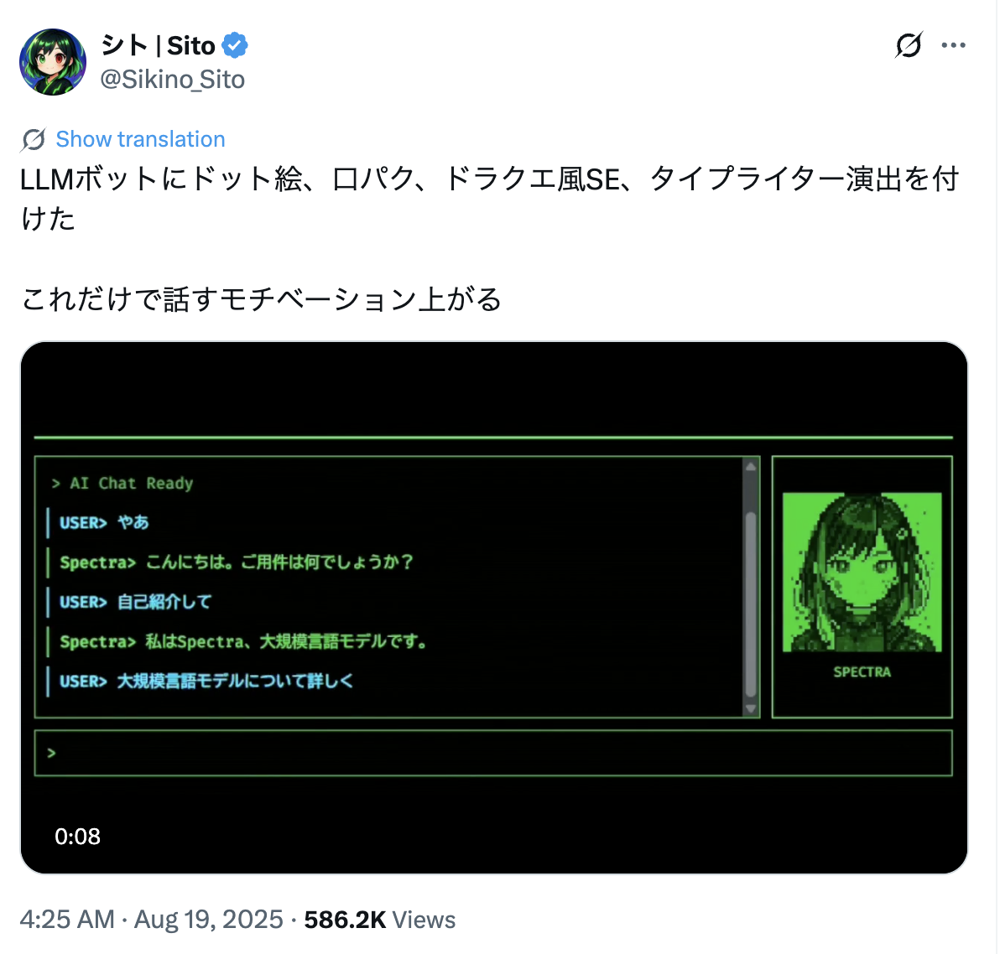
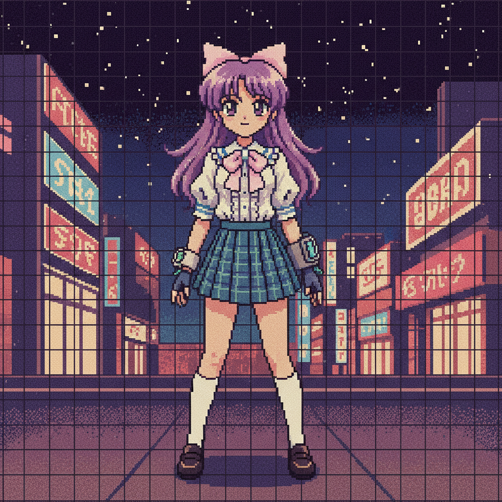
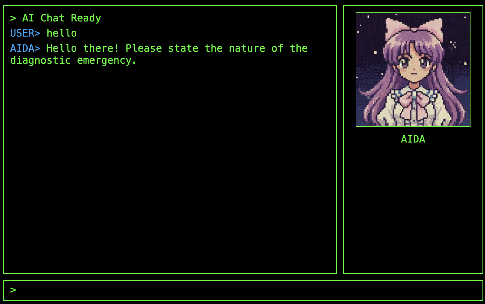

+++
date = '2025-10-31T11:43:35Z'
draft = false
title = 'Dev-UIの先へ：ADKエージェントのインターフェースを構築する方法'
summary = "デフォルトのADK開発UIを超えて、Google ADKエージェント用のカスタムレトロスタイルUIの構築方法を学びましょう。このチュートリアルでは、エージェントランタイムを管理するためのPythonとFastAPIのバックエンド、チャットインターフェースをレンダリングするためのバニラJavaScriptのフロントエンドの作成をガイドします。生成AIでビジュアルアセットを生成し、ストリーミングアニメーションアバターを作成し、そのアニメーションをエージェントのリアルタイム応答と同期させて、より魅力的なユーザーエクスペリエンスを実現する方法をご覧ください。"
categories = ["GenAI", "チュートリアル"]
tags = ["ADK", "Gemini", "Python", "FastAPI", "Frontend", "Agent"]

[article]
  heroStyle = "big"
+++

過去6か月間、私はGoogleのDevRelとしての役割の一環として、GenAI、vibe coding、エージェント、そしてその間のすべてを探求してきました。新しい技術を学びたいときはいつでも、それを使って何かを構築するのが最善の方法だと気づきました。この期間中の私の情熱的なプロジェクトの1つは、診断エージェントでした。これは、自然言語を使用して人々がコンピューターの問題を診断するのを助けることができるソフトウェアです。

この記事では、[ADK](https://google.github.io/adk-docs/)エージェントのfrontendを作成して、プロジェクトにもう少し個性を与える方法を探ります。

## 新しいユーザーインターフェースの探求

これまで、私は主要なコンポーネント（ADK、[Gemini](https://gemini.google.com/)、[osquery](https://osquery.io/)、[Vertex AI](https://cloud.google.com/vertex-ai/docs/start/introduction-unified-platform)）を使用して、小さなMVPをまとめていました。エージェントにはいくつかの癖がありましたが、十分に興味深かったので、過去数か月のいくつかの講演のコンテンツとして使用することにしました。

次にどこへ進むべきか少し行き詰まっていたとき、8月に見た[Sito-san](https://x.com/Sikino_Sito)のこのツイートを思い出しました。



アニメやレトロゲームの大ファンとして、私はその美学に非常に興奮しましたが、当時は完全にはピンときませんでした。数か月後、マラガでのBiznagaFestでの講演の準備中に、ADK開発UIを超えて、エージェント用の実際のクライアントを作成する方法を探求したいと思いました。その時、ついにすべてが腑に落ちました。

Sito-sanには[Avatar UI Core](https://github.com/sito-sikino/avatar-ui-core)というオープンソースプロジェクトがありますが、すぐにそれを接続するのに十分な知識がありませんでした。上で述べたように、学ぶための最善の方法は構築することだと思うので、彼らの作品をインスピレーションとして独自のUIを作成することにしました。また、レトロな美学が大好きであると同時に、もう少しモダンなものを作りたかったのですが、あまりモダンすぎない... 8ビットではなく16ビットモダンのようなものです。

## ADKランタイムの探求

独自のUIを構築する最初のステップは、エージェントのruntimeを作成することでした。runtimeは実際にエージェントを実行するコンポーネントであり、ユーザーのリクエストをエージェントにルーティングし、イベントをキャプチャしてモデルの応答を処理する責任があります。

以前は、`adk web`コマンドで起動できるADK開発UIに依存していたため、これを行う必要はありませんでした。


開発UIは、モデルからのリクエストとレスポンスを検査したり、評価セットを作成したりできる多くのデバッグツールを提供し、画像や双方向ストリーミングを処理するためのすぐに使えるマルチモーダル機能も備えているため、非常に便利です。

すべてがすぐに機能したため、私がADKランタイムを探求するのにこれほど時間がかかったのは、部分的にはDev-UIのせいです。私はエージェントの機能とツールの構築に喜んで集中していました。今、適切なUIが必要になったので、Dev-UIをカスタムのものに置き換える必要がありました。つまり、自分でagent runnerを扱う必要がありました。

ソリューションの全体的なアーキテクチャは次のようになります。


flowchart LR
    frontend["`Frontend
    (HTML/CSS + JS)
    `"]
    runtime[Runtime]
    root["Root Agent"]
    osquery["osquery"]
    schema["schema"]
    rag[("Schema RAG")]
    os("Operating System")
    
    frontend -->|GET/POST| runtime
    
    subgraph be ["`Backend
    (FastAPI)`"]
    runtime -- query --> root
    root -- events --> runtime
    root --> osquery
    root --> schema
    subgraph tools
    osquery
    schema
    end
    end
    
    osquery --> os
    schema --> rag


HTML/CSSとJavaScriptで書かれた小さなfrontendがあり、[FastAPI](https://fastapi.tiangolo.com/)を使用してPythonで書かれたbackendにリクエストを送信します。backendはADK runnerを起動し、ルートエージェントとの対話を制御します。

ルートエージェントはAIDAの「頭脳」であり、リクエストの処理（LLMへのルーティング）と必要なツールコールの実行を担当します。ルートエージェントが完了するたびに、runtimeが処理するイベントを発行します。

まず、最小限の実装を見てみましょう。簡潔にするために、前の記事で説明したルートエージェントの定義は省略します。

`Runner`クラスと、ユーザーセッションを制御するためのセッションサービスが必要です。探索できるセッションサービスの実装は多数ありますが、この場合、エージェントは単一のユーザーが使用することを目的としており、セッションは一時的なものであるため、`InMemorySessionService`を使用し、簡単にするためにユーザーIDとセッションIDをハードコーディングします。

以下にセッションとrunnerの宣言を示します。

```py
from fastapi import FastAPI
from google.adk.runners import Runner
from google.adk.sessions import InMemorySessionService
from dotenv import load_dotenv

load_dotenv()

# --- Agent Definition ---
from aida.agent import root_agent

APP_NAME="aida"

# --- Services and Runner Setup ---
session_service = InMemorySessionService()
runner = Runner(
    app_name=APP_NAME, agent=root_agent, session_service=session_service
)
app = FastAPI()
```

次に、エージェントにメッセージを送信するためのendpointを実装する必要があります。`chat`と呼びましょう。

```py
from fastapi import Request
from fastapi.responses import JSONResponse
from google.genai.types import Content, Part

# --- API Endpoint for Chat Logic ---
@app.post("/chat")
async def chat_endpoint(request: Request):
    """Handles the chat logic, returning the agent's final response."""
    body = await request.json()
    query = body.get("query")
    user_id = "demo_user"
    session_id = "demo_session"

    # Ensure a session exists
    session = await session_service.get_session(app_name=APP_NAME, user_id=user_id, session_id=session_id)
    if not session:
        session = await session_service.create_session(app_name=APP_NAME, user_id=user_id, session_id=session_id)

    response_text = ""
    async for event in runner.run_async(
        user_id=user_id,
        session_id=session_id,
        new_message=Content(role="user", parts=[Part.from_text(text=query)]),
    ):
        if event.is_final_response() and event.content and event.content.parts[0].text:
            response_text = event.content.parts[0].text

    return JSONResponse(content={"response": response_text})
```

最初の数行は典型的なリクエスト処理コードと、ハードコーディングされたセッション制御です。このコードの中心は`runner.run_async`呼び出しで、ルートエージェントからイベントを発行します。私たちは最終的な応答にのみ関心があり、それをJSON応答として呼び出し元に返します。

次のコマンドを実行して、この小さなアプリをテストできます。

```sh
$ uvicorn main:app
...
INFO:     Started server process [86669]
INFO:     Waiting for application startup.
INFO:     Application startup complete.
INFO:     Uvicorn running on http://127.0.0.1:8000 (Press CTRL+C to quit)
```

そして、2番目のターミナルで`/chat`にPOSTコールを行います。

```sh
$ curl -X POST localhost:8000/chat -d '{"query":"hello"}'
{"response":"Hello! Please state the nature of the diagnostic emergency."}
```

これまでのところ、UIの改善はあまり感じられませんが、そこに向かっています。きれいになる前はいつも醜いものです！:)

## エージェントのフロントエンド

UIをレンダリングする方法はたくさんありますが、私は特に優れたfrontend開発者ではないので、最終的にすべてのデザイン部分をGemini CLIに委任しました。結果として、私がこれまでに行うことができたよりもはるかに優れた仕事をしてくれました。

ここでは、概念実証として最初のUIをレンダリングするために使用できる非常に基本的なアプローチを示しますが、その後は、実際にfrontendを知っている人と話すか、私のようにGemini CLIを試してみることを強くお勧めします。

HTMLを何らかの方法で提供する必要があり、手っ取り早い方法は、新しいFastAPI endpointを作成することです。

```py
from fastapi.responses import HTMLResponse

# see the full content below
HTML_CONTENT="""
...
"""

# --- Web UI Endpoint ---
@app.get("/", response_class=HTMLResponse)
async def get_chat_ui():
    return HTML_CONTENT
```

もちろん、ここで重要なのは実際のHTMLコンテンツです。チャットウィンドウ、入力ボックス、エージェントにメッセージを送信するためのボタンの3つの要素を定義しています。

スニペットを短く保つために、以下のコードからすべてのスタイル情報を削除しました。醜いですが機能的です。

```html
<!DOCTYPE html>
<html lang="en">
<head>
    <title>AIDA Chat</title>
</head>
<body>
    <h1>AIDA Chat</h1>
    <div id="chat-window"></div>
    <form id="input-area">
        <input type="text" id="user-input" placeholder="Type your message..." autocomplete="off">
        <button type="submit">Send</button>
    </form>

    <script>
        const chatWindow = document.getElementById('chat-window');
        const inputForm = document.getElementById('input-area');
        const userInput = document.getElementById('user-input');

        function appendMessage(text, className) {
            const div = document.createElement('div');
            div.className = className;
            div.textContent = text;
            chatWindow.appendChild(div);
            return div;
        }

        inputForm.addEventListener('submit', async (e) => {
            e.preventDefault();
            const query = userInput.value.trim();
            if (!query) return;

            appendMessage(`USER: ${query}`, 'user-message');
            userInput.value = '';

            try {
                const response = await fetch('/chat', {
                    method: 'POST',
                    headers: { 'Content-Type': 'application/json' },
                    body: JSON.stringify({ query })
                });
                const data = await response.json();
                appendMessage(`AIDA: ${data.response}`, 'bot-message');
            } catch (error) {
                appendMessage('Error communicating with the bot.', 'error-message');
            }
        });
    </script>
</body>
</html>
```

`uvicorn main:app`を再度実行してホームページにアクセスすると、このようなものが表示されます。メッセージを送信してみてください。


簡単にするためにすべてを1つのファイルにまとめていますが、実際の世界では、HTML、CSS、JS、アセットファイル用に別のフォルダ（通常は`static`と呼ばれる）を用意する方がよいでしょう。正しい拡張子を持つことで、IDEがコードを理解するのにも役立ちます。Gemini CLIは構文のハイライトを気にしませんが、手動でコードを修正したり微調整したりするときに便利です。

## 美しくする

正直に言うと、ここから先はすべてGemini CLIの魔法です。私の目標は、Sita-sanが作成したものと同じように、レトロでサイバーパンクでキュートなアニメのインターフェースを、私自身のひねりを加えて作成することでした。

そこで私はずるをして、Sita-sanのツイートから撮ったスクリーンショットのスタイルを再現するようにGemini CLIに依頼しました。スクリーンショットを`image.png`として保存し、CLIに次のpromptを与えました。

> @demo.pyのUIを、このインターフェース@image.pngに似た美学に更新したいです

Gemini CLIの@文字は、それが指すリソース（ファイル）をロードするように指示します。


そして、これがGeminiが考え出したものです。


これは、Gemini 2.5がマルチモーダルであるため、実際に画像を「理解」できるからこそ可能です。言葉で適切に説明できない場合に、やりたいことをモデルに説明するためにこのトリックをよく使用します。百聞は一見に如かず、ですよね？

### Nano Bananaでアセットを生成する

インターフェースは良くなりましたが、重要な部分が欠けています。アバターです。この問題を解決するために、私は2番目のCLIトリックを使用しています。Gemini CLI用の[Nano Banana](https://github.com/gemini-cli-extensions/nanobanana)拡張機能をインストールしました。

この拡張機能を使用すると、別のツールに切り替えることなく画像を生成できます。Nano Bananaは画像生成だけでなく編集にも優れているため、ベース画像から新しいフレームを生成するように依頼できるため、アニメーションを作成するための効果的なツールになります。

私が使用したpromptは次のとおりです。
> @demo.pyのエージェント用のアバターを作成してください。アバターはPC-98スタイルの2Dアニメの女の子である必要があります。アイドルポーズで「カメラ」を見ているようにしてください

Nano Banana拡張機能がインストールされていると仮定すると、Gemini CLIはそれを呼び出して画像を生成します。拡張機能をインストールしたくない場合は、GeminiアプリまたはWebから同じことを行うこともできます。

最初の結果はこの画像でした。



これを手動で切り取って、顔だけに焦点を合わせました。


簡単な会話アニメーションを作成するために、これに基づいて2番目のフレームを生成するように依頼しました。

> static/assets/aida.pngを変更して、まったく同じポーズで、キャラクターが口を開けて話している新しいアセットを作成してください

そして、これが結果です。


整理整頓のために、すべての`png`ファイルを保存する`static/assets`フォルダを作成しました。HTMLコンテンツと同様にbase64を使用してインライン化することもできましたが、私の貧弱なPythonスクリプトには大きすぎ（そして乱雑すぎ）ます。

次に、これらのファイルを提供するためのコードが必要です。

```py
# --- Static assets ---
@app.get("/idle")
async def idle():
    return FileResponse("static/assets/idle.png")

@app.get("/talk")
async def talk():
    return FileResponse("static/assets/talk.png")
```

そして今、これらのendpointのいずれかからの画像で`avatar-container`を埋めるためにHTMLを編集する必要があります。

```html
<div class="avatar-container">
    
    <div id="avatar-name">AIDA</div>
</div>
```

結果：



だんだん形になってきました！

### アニメーション

アニメーションを追加することは特に難しくありませんが、必要なすべてのポーズのフレームを作成することに依存します。すでに`talk`と`idle`を作成したので、これらのフレームを交互に使用して簡単な会話アニメーションを生成することが可能です。

このロジックを単純な状態関数にカプセル化できます。

```js
let talkInterval = null;

function setAvatarState(state) {
    const avatarImg = document.getElementById('avatar-image');
    if (state === 'talking') {
        if (!talkInterval) {
            talkInterval = setInterval(() => {
                // Toggle between talk and idle frames
                const isTalking = avatarImg.src.endsWith('/talk');
                avatarImg.src = isTalking ? '/idle' : '/talk';
            }, 150);
        }
    } else {
        // Stop animation and reset to idle
        if (talkInterval) {
            clearInterval(talkInterval);
            talkInterval = null;
        }
        avatarImg.src = '/idle';
    }
}
```

会話アニメーション効果を実現するには、エージェントがデータの送信を開始したときに`setAvatarState('talking')`を呼び出し、終了したときに`setAvatarState('idle')`を呼び出す必要があります。

## ストリーミングでアバターに命を吹き込む

パズルの最後のピースは、エージェントのストリーミング応答とアバターの会話アニメーションを同期させることで、アバターを本当に生き生きとさせることです。これには、リアルタイムデータを処理するためにbackendとfrontendの両方を変更する必要があります。

### バックエンドの変更：エージェントの応答をストリーミングする

標準のHTTPリクエストは、応答全体が準備できるまで待ってから何かを返します。LLMエージェントの場合、これは、それが「考えて」完全な段落を生成している間、静的な画面を見つめていることを意味します。アバターを生き生きと感じさせるには、その沈黙を破る必要があります。

FastAPIの`/chat` endpointを更新して`StreamingResponse`を使用し、`runner.run_async`イベントから生成された瞬間にテキストチャンクを直接生成します。

```python
from fastapi.responses import StreamingResponse
from google.genai.types import Content, Part

@app.post("/chat")
async def chat_endpoint(request: Request):
    data = await request.json()
    user_query = data.get("query")
    
    # Hardcoded for demo simplicity
    user_id = "demo_user"
    session_id = "demo_session"

    # Ensure session exists
    if not await session_service.get_session(APP_NAME, user_id, session_id):
        await session_service.create_session(APP_NAME, user_id, session_id)

    async def response_stream():
        """Generates text chunks from the agent's events."""
        async for event in runner.run_async(
            user_id=user_id,
            session_id=session_id,
            new_message=Content(role="user", parts=[Part.from_text(text=user_query)]),
        ):
            # We only want the final text response for this simple UI
            if event.is_final_response() and event.content and event.content.parts:
                for part in event.content.parts:
                    if hasattr(part, "text") and part.text:
                        yield part.text

    return StreamingResponse(response_stream(), media_type="text/plain")
```

### フロントエンドの変更：ストリームを消費してアニメーション化する

backendがストリーミングするようになったので、frontendのJavaScriptを更新して、このストリームを消費し、アバターの会話アニメーションをトリガーする必要があります。`submit`イベントリスナーを変更して`ReadableStream`を使用し、テキストが到着するたびに追加します。

また、操作全体を`try/finally`ブロックでラップします。これにより、ネットワークリクエストまたはストリーム処理中にエラーが発生した場合でも、`setAvatarState('idle')`が常に呼び出され、アバターが無限の会話ループでスタックするのを防ぎます。

```js
// ... inside the submit handler ...
// Prepare AIDA's message container
const aidaMsg = appendMessage('AIDA> ', 'aida');

try {
    const response = await fetch('/chat', {
        method: 'POST',
        headers: { 'Content-Type': 'application/json' },
        body: JSON.stringify({ query })
    });

    const reader = response.body.getReader();
    const decoder = new TextDecoder();

    setAvatarState('talking');

    while (true) {
        const { value, done } = await reader.read();
        if (done) break;

        const chunk = decoder.decode(value, { stream: true });
        
        // Typing effect
        for (const char of chunk) {
            aidaMsg.textContent += char;
            chatWindow.scrollTop = chatWindow.scrollHeight;
            // Tiny delay for retro feel
            await new Promise(r => setTimeout(r, 5)); 
        }
    }
} catch (err) {
    appendMessage(`SYSTEM> Error: ${err.message}`, 'system');
} finally {
    setAvatarState('idle');
}
```

## 最終結果

これらの変更により、AIDAエージェントは完全にインタラクティブで視覚的に魅力的なインターフェースを持つようになりました。アバターは、ストリーミングされた応答と同期して話し、はるかに没入感のある体験を生み出します。


## 最後の言葉と情報源

基本的なADK開発UIから長い道のりを歩んできました。Gemini CLIやNano Banana拡張機能などの生成AIツールを活用して、独自のレトロでサイバーパンクでキュートなアニメの美学を持つカスタムfrontendを構築する方法を探りました。

この記事では、ADKエージェントのfrontendを構築するための基本を説明しましたが、これはほんの始まりにすぎません。ここで構築したデモの完全なソースコードは、以下からダウンロードできます。

*   **[demo.pyをダウンロード](demo.py)**

エージェントのより高度なバージョンに興味がある場合は、私のGitHubで入手できます：**[github.com/danicat/aida](https://github.com/danicat/aida)**

リポジトリを探索し、自分で実行してみて、そしておそらく貢献することをお勧めします！これらの構成要素が実際のアプリケーションでどのように組み合わさるかを見るのに最適な方法です。

パート2にご期待ください。そこでは、SQLiteを使用して完全にローカルなRAGエンジンを構築するためにbackendを深く掘り下げ、AIDAがマシンからデータを出さずにシステムを診断できるようにします。

## リソース

*   **[Agent Development Kit (ADK)](https://google.github.io/adk-docs/)**: Google ADKの公式ドキュメント。
*   **[Gemini](https://gemini.google.com/)**: GoogleのAIアシスタント。
*   **[osquery](https://osquery.io/)**: osqueryの公式サイト。
*   **[Vertex AI](https://cloud.google.com/vertex-ai/docs/start/introduction-unified-platform)**: Google Cloudの統合AIプラットフォーム。
*   **[FastAPI](https://fastapi.tiangolo.com/)**: FastAPI Python Webフレームワークの公式サイト。
*   **[Sito-sanのツイート](https://x.com/Sikino_Sito/status/1957645002533925235)**: UIデザインのインスピレーションとなった元のツイート。
*   **[Avatar UI Core](https://github.com/sito-sikino/avatar-ui-core)**: Sito-sanのオープンソースプロジェクト。
*   **[Nano Banana Extension](https://github.com/gemini-cli-extensions/nanobanana)**: 画像生成用のGemini CLI拡張機能。