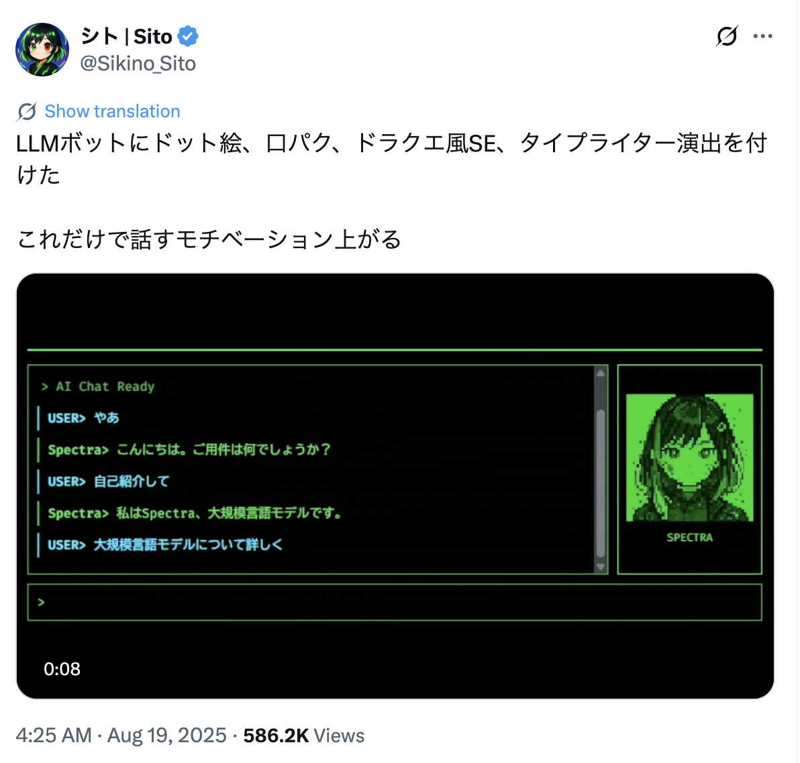
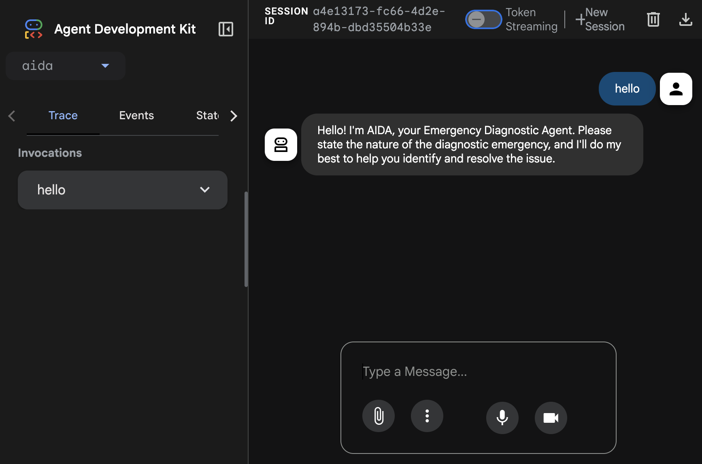
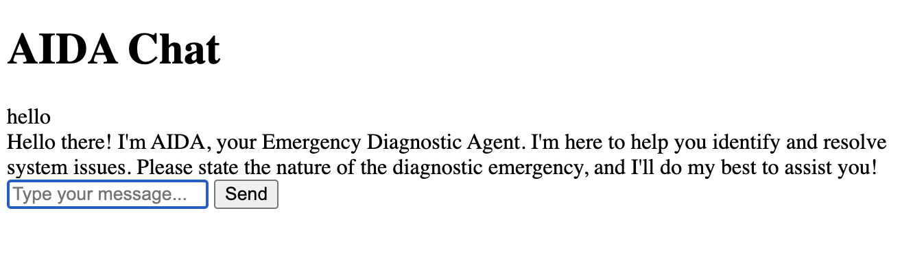
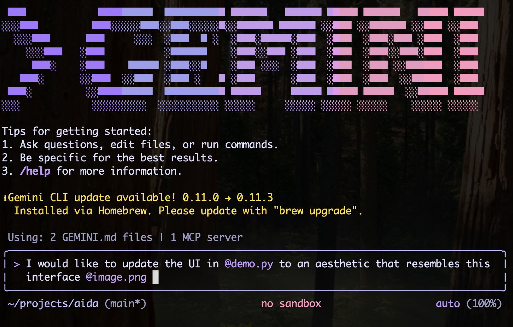
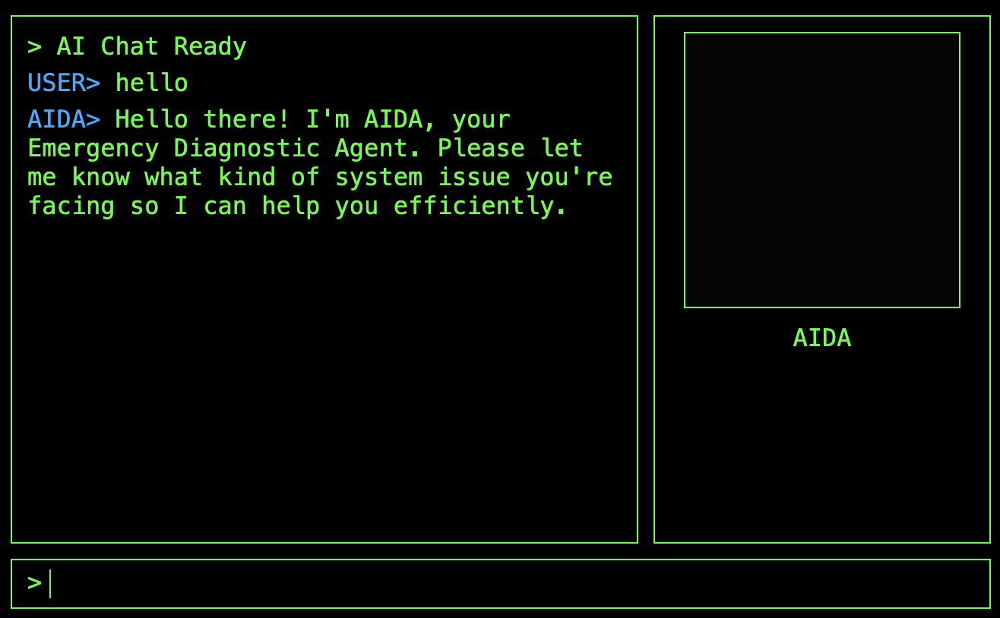
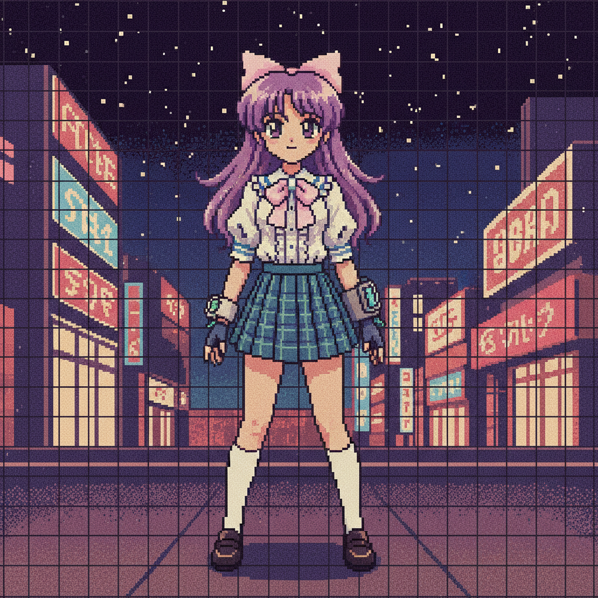
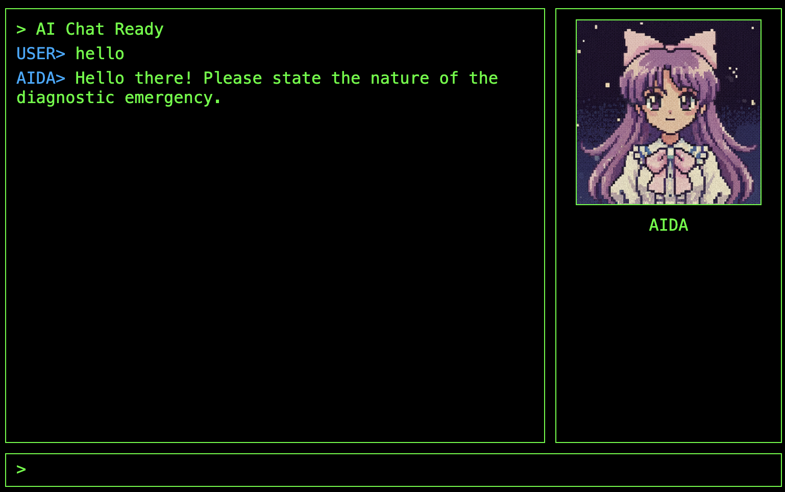
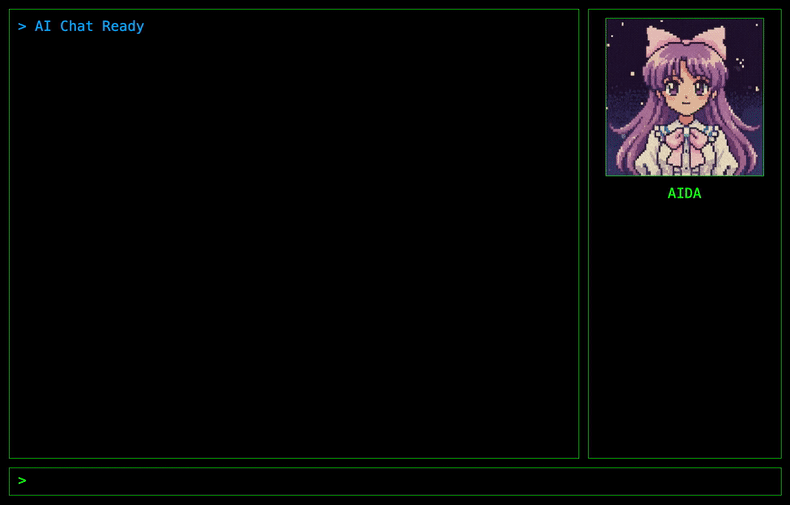

+++
date = '2025-10-31T11:43:35Z'
draft = false
title = 'Beyond the Dev-UI: How to Build an Interface for an ADK agent'
summary = "Elevate your Google ADK agent with a custom, retro-style interface. This step-by-step guide shows you how to replace the standard Dev-UI using FastAPI and vanilla JavaScript, adding personality with a real-time streaming, AI-generated avatar."
categories = ["AI & Development"]
tags = ["genai", "tutorial", "adk", "gemini", "python", "fastapi", "frontend", "agent"]
+++

For the past six months I have been exploring GenAI, vibe coding, agents and everything in between as part of my DevRel role at Google. Whenever I want to learn a new technology I find that the best way is to build something with it. One of my passion projects during this time has been the diagnostic agent: a software that could help people diagnose their computer problems using natural language.

In this article I'm going to explore how to create a frontend for an [ADK](https://google.github.io/adk-docs/) agent so you can give a bit more of personality to your projects.

## The quest for a new user interface

Up to now I was working with the key components - ADK, [Gemini](https://gemini.google.com/), [osquery](https://osquery.io/) and [Vertex AI](https://cloud.google.com/vertex-ai/docs/start/introduction-unified-platform) - to stitch together a small MVP. The agent had a few quirks, but it was interesting enough that I decided to use it as content for a few of my talks over the past couple of months.

I was a bit stuck on where to take it next, when I remembered this tweet from [Sito-san](https://x.com/Sikino_Sito) I saw back in August:



As a huge anime and retro-gaming fan I was very excited with the aesthetics, but back then I didn't fully connect the dots. Fast forward a few months, during the preparation for my talk at BiznagaFest in Malaga I wanted to explore how to go beyond the ADK development UI and create a real client for my agent. This is when things finally clicked for me.

Sito-san does have an open source project called [Avatar UI Core](https://github.com/sito-sikino/avatar-ui-core), but I didn't have enough knowledge to connect it right away. As I said above, I think that the best way to learn is to build, so I decided to make my own UI using their work as inspiration. Also, as much as I love the retro aesthetics, I also wanted to make something a bit more modern, but not too much... like 16-bit modern instead of 8-bit.

## Exploring the ADK runtime

The first step in building my own UI was to create the agent runtime. The runtime is the component that actually runs the agent, responsible for routing the user's requests to the agent and capturing the events back for then to process the models responses.

I didn't have to do this before because I was relying on the ADK development UI, which you can spin up with the `adk web` command:



The development UI is very convenient as it provides many debug tools, allowing you to inspect requests and responses from the models and create evaluation sets, plus out out-of-box multi-modal capabilities to deal with images and even bidirectional streaming.

The Dev-UI is partially to blame for why it took me so long to explore the ADK runtime, as since everything worked out of the box I was happily focused on building the agent capabilities and tooling. Now that I need a proper UI, I had to replace the Dev-UI with something custom, which meant dealing with the agent runner on my own.

The overall architecture of the solution looks like this:


flowchart LR
    frontend["`Frontend
    (HTML/CSS + JS)
    `"]
    runtime[Runtime]
    root["Root Agent"]
    osquery["osquery"]
    schema["schema"]
    rag[("Schema RAG")]
    os("Operating System")
    
    frontend -->|GET/POST| runtime
    
    subgraph be ["`Backend
    (FastAPI)`"]
    runtime -- query --> root
    root -- events --> runtime
    root --> osquery
    root --> schema
    subgraph tools
    osquery
    schema
    end
    end
    
    osquery --> os
    schema --> rag


We have a small frontend written in HTML/CSS and JavaScript that will make requests to our backend written in Python using [FastAPI](https://fastapi.tiangolo.com/). The backend will spin up the ADK runner which will control the interactions with our root agent.

The root agent is the "brains" of AIDA and is responsible for processing the requests (routing them to an LLM) and making the required tool calls. Whenever the root agent is done it emits events that the runtime will process.

Let's have a look at a barebones implementation first. For the sake of brevity, I'm going to omit the root agent definition as it was explained on the [previous article]().

We are going to need the `Runner` class and a session service to control user sessions. There are many implementations of session services that you can explore, but in this case the agent is meant to be used by a single user and the sessions are ephemeral, so we are going to use the `InMemorySessionService` and hardcode the user and session ids for simplicity.

You can see the session and runner declarations below:

```py
from fastapi import FastAPI
from google.adk.runners import Runner
from google.adk.sessions import InMemorySessionService
from dotenv import load_dotenv

load_dotenv()

# --- Agent Definition ---
from aida.agent import root_agent

APP_NAME="aida"

# --- Services and Runner Setup ---
session_service = InMemorySessionService()
runner = Runner(
    app_name=APP_NAME, agent=root_agent, session_service=session_service
)
app = FastAPI()
```

Next, we need to implement an endpoint to send messages to the agent. Let's call it `chat`:

```py
from fastapi import Request
from fastapi.responses import JSONResponse
from google.genai.types import Content, Part

# --- API Endpoint for Chat Logic ---
@app.post("/chat")
async def chat_endpoint(request: Request):
    """Handles the chat logic, returning the agent's final response."""
    body = await request.json()
    query = body.get("query")
    user_id = "demo_user"
    session_id = "demo_session"

    # Ensure a session exists
    session = await session_service.get_session(app_name=APP_NAME, user_id=user_id, session_id=session_id)
    if not session:
        session = await session_service.create_session(app_name=APP_NAME, user_id=user_id, session_id=session_id)

    response_text = ""
    async for event in runner.run_async(
        user_id=user_id,
        session_id=session_id,
        new_message=Content(role="user", parts=[Part.from_text(text=query)]),
    ):
        if event.is_final_response() and event.content and event.content.parts[0].text:
            response_text = event.content.parts[0].text

    return JSONResponse(content={"response": response_text})
```

The first few lines are the typical request handling code plus our hardcoded session control. The heart of this code is the `runner.run_async` call, which emits the events from the root agent. We are only interested in the final response and we return it as a JSON response to the caller.

You can test this small app by running the following command:

```sh
$ uvicorn main:app
...
INFO:     Started server process [86669]
INFO:     Waiting for application startup.
INFO:     Application startup complete.
INFO:     Uvicorn running on http://127.0.0.1:8000 (Press CTRL+C to quit)
```

And on a second terminal make the POST call to `/chat`:

```sh
$ curl -X POST localhost:8000/chat -d '{"query":"hello"}'
{"response":"Hello! Please state the nature of the diagnostic emergency."}
```

Doesn't feel like much of an UI improvement so far, but we are getting there. It always gets ugly before it gets pretty! :)

## The agent frontend

There are many ways of rendering the UI, and I'm not a particularly good frontend developer, so I ended up delegating all the design parts to Gemini CLI which ended up doing a much better job than I could ever do.

Here I'm going to show a very barebones approach that you can use to render the first UI as a proof of concept, but afterwards I highly encourage you to speak with someone who actually knows frontend, or do like as I did and give Gemini CLI a go.

We need to serve the HTML somehow, and the quick and dirty way is to create a new FastAPI endpoint for this:

```py
from fastapi.responses import HTMLResponse

# see the full content below
HTML_CONTENT="""
...
"""

# --- Web UI Endpoint ---
@app.get("/", response_class=HTMLResponse)
async def get_chat_ui():
    return HTML_CONTENT
```

Of course, the important bit here is the actual HTML content. We are defining three elements: a chat window, an input box and a button to send the message to the agent.

To keep the snippet short I stripped all the styling information from the code below. It's ugly but functional:

```html
<!DOCTYPE html>
<html lang="en">
<head>
    <title>AIDA Chat</title>
</head>
<body>
    <h1>AIDA Chat</h1>
    <div id="chat-window"></div>
    <form id="input-area">
        <input type="text" id="user-input" placeholder="Type your message..." autocomplete="off">
        <button type="submit">Send</button>
    </form>

    <script>
        const chatWindow = document.getElementById('chat-window');
        const inputForm = document.getElementById('input-area');
        const userInput = document.getElementById('user-input');

        function appendMessage(text, className) {
            const div = document.createElement('div');
            div.className = className;
            div.textContent = text;
            chatWindow.appendChild(div);
            return div;
        }

        inputForm.addEventListener('submit', async (e) => {
            e.preventDefault();
            const query = userInput.value.trim();
            if (!query) return;

            appendMessage(`USER: ${query}`, 'user-message');
            userInput.value = '';

            try {
                const response = await fetch('/chat', {
                    method: 'POST',
                    headers: { 'Content-Type': 'application/json' },
                    body: JSON.stringify({ query })
                });
                const data = await response.json();
                appendMessage(`AIDA: ${data.response}`, 'bot-message');
            } catch (error) {
                appendMessage('Error communicating with the bot.', 'error-message');
            }
        });
    </script>
</body>
</html>
```

If you run `uvicorn main:app` again and hit the home page you will see something like this. Try sending a message.



Note that I'm keeping everything in a single file for simplicity, but in the real world it is better to have a separate folder for the HTML, CSS, JS and asset files (usually called `static`), as having the right extension will also help your IDE understand the code. Gemini CLI doesn't care about syntax highlighting, but it is useful for when you are revising the code manually or fine-tuning it.

## Making it beautiful

I'm not going to lie, everything from here on out is pure Gemini CLI doing its magic. My goal was to have a retro-cyberpunk-cute-anime interface just like the one Sita-san created, but with my personal twist.

So I cheated, and asked Gemini CLI to replicate the style in the screenshot I took from Sita-san's tweet. I saved the screenshot as `image.png` and gave the CLI the following prompt:

> I would like to update the UI in @demo.py to an aesthetic that resembles this interface @image.png 

The @ character in Gemini CLI tells it to load the resource (file) pointed by it.



And this is what Gemini came up with:



Note that this is only possible because Gemini 2.5 is multi-modal, so it can actually "understand" the image. I often use this trick to describe to the model what I want to do if I can't properly describe with words. An image is worth more than a thousand words, right?

### Generating assets with Nano Banana

The interface is better but it is missing a key piece: the avatar. To solve this problem, I'm using a second CLI trick - I installed the [Nano Banana](https://github.com/gemini-cli-extensions/nanobanana) extension for Gemini CLI.

The extension allows me to generate images without needing to switch to a different tool. Nano banana is not only good for image generation but for editing, which makes it an effective tool to create animations as I can, from a base image, ask to modify it to generate new frames.

The prompt I used was:
> create an avatar for the agent in @demo.py. the avatar should be a 2d anime girl in PC-98 style. make so it is looking at the "camera" in an idle pose

Assuming you have the Nano Banana extension installed, the Gemini CLI will invoke it to generate the image. If you don't want to install the extension, you can also do the same from the Gemini app or on the web.

The initial result was this image:



Which I manually cut to focus only on the face:


To have a simple talk animation, I asked it to generate a second frame based on this one:

> modify static/assets/aida.png to create a new asset with the exact same pose but the character is with the mouth open, speaking

And this was the result:


To keep things organised I created a `static/assets` folder to store all the `png` files. I could have inlined them using base64, just as it was done with the HTML content, but it would be too big (and messy) for my poor python script.

Now we need the code to serve those files:

```py
# --- Static assets ---
@app.get("/idle")
async def idle():
    return FileResponse("static/assets/idle.png")

@app.get("/talk")
async def talk():
    return FileResponse("static/assets/talk.png")
```

And now we need to edit the HTML to populate the `avatar-container` with the image from one of these endpoints:

```html
<div class="avatar-container">
    
    <div id="avatar-name">AIDA</div>
</div>
```

The results:



We are starting to get somewhere!

### The animation

Adding animation is not particularly hard, but relies on creating frames for all the poses you need. We already created `talk` and `idle`, so it's possible to generate a simple talking animation by alternating these frames.

We can encapsulate this logic in a simple state function:

```js
let talkInterval = null;

function setAvatarState(state) {
    const avatarImg = document.getElementById('avatar-image');
    if (state === 'talking') {
        if (!talkInterval) {
            talkInterval = setInterval(() => {
                // Toggle between talk and idle frames
                const isTalking = avatarImg.src.endsWith('/talk');
                avatarImg.src = isTalking ? '/idle' : '/talk';
            }, 150);
        }
    } else {
        // Stop animation and reset to idle
        if (talkInterval) {
            clearInterval(talkInterval);
            talkInterval = null;
        }
        avatarImg.src = '/idle';
    }
}
```

Achieving the talk animation effect requires calling `setAvatarState('talking')` when the agent starts sending data and `setAvatarState('idle')` when it finishes.

## Bringing the avatar to life with streaming

The final piece of the puzzle is to make our avatar truly come alive by synchronizing its talking animation with the agent's streamed responses. This requires modifying both our backend and frontend to handle real-time data.

### Backend changes: streaming the agent's response

Standard HTTP requests wait until the entire response is ready before sending anything back. For an LLM agent, this means staring at a static screen while it "thinks" and generates a complete paragraph. To make the avatar feel alive, we need to break that silence.

We'll update our FastAPI `/chat` endpoint to use `StreamingResponse`, yielding text chunks directly from the `runner.run_async` events the moment they are generated.

```python
from fastapi.responses import StreamingResponse
from google.genai.types import Content, Part

@app.post("/chat")
async def chat_endpoint(request: Request):
    data = await request.json()
    user_query = data.get("query")
    
    # Hardcoded for demo simplicity
    user_id = "demo_user"
    session_id = "demo_session"

    # Ensure session exists
    if not await session_service.get_session(APP_NAME, user_id, session_id):
        await session_service.create_session(APP_NAME, user_id, session_id)

    async def response_stream():
        """Generates text chunks from the agent's events."""
        async for event in runner.run_async(
            user_id=user_id,
            session_id=session_id,
            new_message=Content(role="user", parts=[Part.from_text(text=user_query)]),
        ):
            # We only want the final text response for this simple UI
            if event.is_final_response() and event.content and event.content.parts:
                for part in event.content.parts:
                    if hasattr(part, "text") and part.text:
                        yield part.text

    return StreamingResponse(response_stream(), media_type="text/plain")
```

### Frontend changes: consuming the stream and animating

With the backend now streaming, our frontend JavaScript needs to be updated to consume this stream and trigger the avatar's talking animation. We'll modify the `submit` event listener to use a `ReadableStream` and append text as it arrives.

We also wrap the whole operation in a `try/finally` block. This ensures that even if an error occurs during the network request or stream processing, `setAvatarState('idle')` is always called, preventing the avatar from getting stuck in an infinite talking loop.

```js
// ... inside the submit handler ...
// Prepare AIDA's message container
const aidaMsg = appendMessage('AIDA> ', 'aida');

try {
    const response = await fetch('/chat', {
        method: 'POST',
        headers: { 'Content-Type': 'application/json' },
        body: JSON.stringify({ query })
    });

    const reader = response.body.getReader();
    const decoder = new TextDecoder();

    while (true) {
        const { value, done } = await reader.read();
        if (done) break;

        setAvatarState('talking');
        const chunk = decoder.decode(value, { stream: true });
        
        // Typing effect
        for (const char of chunk) {
            aidaMsg.textContent += char;
            chatWindow.scrollTop = chatWindow.scrollHeight;
            // Tiny delay for retro feel
            await new Promise(r => setTimeout(r, 5)); 
        }
    }
} catch (err) {
    appendMessage(`SYSTEM> Error: ${err.message}`, 'system');
} finally {
    setAvatarState('idle');
}
```

## The final result

With these changes, our AIDA agent now has a fully interactive and visually engaging interface. The avatar comes to life, speaking in sync with the streamed responses, creating a much more immersive experience.



## Final words and sources

We've come a long way from the basic ADK development UI. We've explored how to build a custom frontend, leveraging generative AI tools like Gemini CLI and the Nano Banana extension to create a unique retro-cyberpunk-cute-anime aesthetic.

This article covered the basics of building a frontend for an ADK agent, but it is just a starting point. You can download the full source code for the demo we built here:

*   **[Download demo.py](demo.py)**

If you are interested on a more advanced version of the agent, you can find it on my GitHub: **[github.com/danicat/aida](https://github.com/danicat/aida)**

I encourage you to explore the repository, try running it yourself, and maybe contribute! It's a great way to see how these building blocks come together in a real-world application.

Stay tuned for Part 2, where we'll dive deep into the backend to build a fully local RAG engine using SQLite, allowing AIDA to diagnose your system without any data leaving your machine.

## Resources

*   **[Agent Development Kit (ADK)](https://google.github.io/adk-docs/)**: The official documentation for the Google ADK.
*   **[Gemini](https://gemini.google.com/)**: Google's AI assistant.
*   **[osquery](https://osquery.io/)**: The official website for osquery.
*   **[Vertex AI](https://cloud.google.com/vertex-ai/docs/start/introduction-unified-platform)**: Google Cloud's unified AI platform.
*   **[FastAPI](https://fastapi.tiangolo.com/)**: The official website for the FastAPI Python web framework.
*   **[Sito-san's Tweet](https://x.com/Sikino_Sito/status/1957645002533925235)**: The original tweet that inspired the UI design.
*   **[Avatar UI Core](https://github.com/sito-sikino/avatar-ui-core)**: Sito-san's open-source project.
*   **[Nano Banana Extension](https://github.com/gemini-cli-extensions/nanobanana)**: The Gemini CLI extension for image generation.