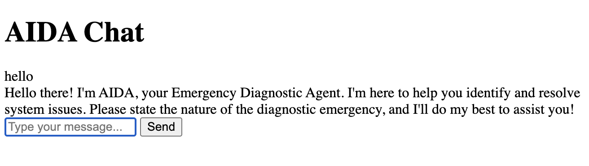
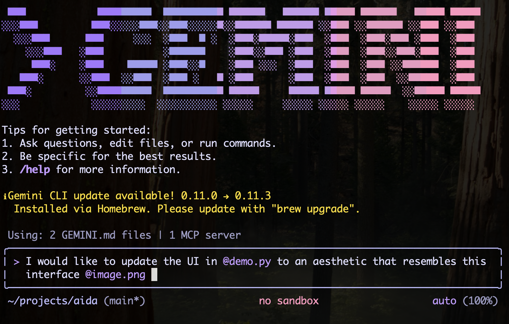

Nos últimos seis meses, tenho explorado GenAI, vibe coding, agentes e tudo mais como parte da minha função de DevRel no Google. Sempre que quero aprender uma nova tecnologia, descubro que a melhor maneira é construir algo com ela. Um dos meus projetos de paixão durante esse tempo tem sido o agente de diagnóstico: um software que poderia ajudar as pessoas a diagnosticar problemas em seus computadores usando linguagem natural.

Neste artigo, vou explorar como criar um frontend para um agente [ADK](https://google.github.io/adk-docs/) para que você possa dar um pouco mais de personalidade aos seus projetos.

## A busca por uma nova interface de usuário

Até agora, eu estava trabalhando com os componentes principais - ADK, [Gemini](https://gemini.google.com/), [osquery](https://osquery.io/) e [Vertex AI](https://cloud.google.com/vertex-ai/docs/start/introduction-unified-platform) - para montar um pequeno MVP. O agente tinha algumas peculiaridades, mas era interessante o suficiente para que eu decidisse usá-lo como conteúdo para algumas das minhas palestras nos últimos meses.

Eu estava um pouco empacada sobre para onde levá-lo a seguir, quando me lembrei deste tweet de [Sito-san](https://x.com/Sikino_Sito) que vi em agosto:


Como uma grande fã de animes e jogos retrô, fiquei muito animada com a estética, mas na época não conectei totalmente os pontos. Avançando alguns meses, durante a preparação para minha palestra no BiznagaFest em Málaga, eu queria explorar como ir além da UI de desenvolvimento do ADK e criar um cliente real para o meu agente. Foi quando as coisas finalmente fizeram sentido para mim.

Sito-san tem um projeto de código aberto chamado [Avatar UI Core](https://github.com/sito-sikino/avatar-ui-core), mas eu não tinha conhecimento suficiente para conectá-lo imediatamente. Como eu disse acima, acho que a melhor maneira de aprender é construir, então decidi fazer minha própria UI usando o trabalho deles como inspiração. Além disso, por mais que eu ame a estética retrô, eu também queria fazer algo um pouco mais moderno, mas não muito... tipo 16-bit moderno em vez de 8-bit.

## Explorando o runtime do ADK

O primeiro passo para construir minha própria UI foi criar o runtime do agente. O runtime é o componente que realmente executa o agente, responsável por rotear as solicitações do usuário para o agente e capturar os eventos de volta para então processar as respostas dos modelos.

Eu não precisei fazer isso antes porque estava contando com a UI de desenvolvimento do ADK, que você pode iniciar com o comando `adk web`:


A UI de desenvolvimento é muito conveniente, pois fornece muitas ferramentas de depuração, permitindo inspecionar requisições e respostas dos modelos e criar conjuntos de avaliação, além de recursos multimodais prontos para lidar com imagens e até mesmo streaming bidirecional.

A Dev-UI é parcialmente culpada por eu ter demorado tanto para explorar o runtime do ADK, já que tudo simplesmente funcionou de fábrica, e eu estava felizmente focada em construir as capacidades e ferramentas do agente. Agora que preciso de uma UI adequada, tive que substituir a Dev-UI por algo customizado, o que significava lidar com o agent runner por conta própria.

A arquitetura geral da solução se parece com isto:


flowchart LR
    frontend["`Frontend
    (HTML/CSS + JS)
    `"]
    runtime[Runtime]
    root["Root Agent"]
    osquery["osquery"]
    schema["schema"]
    rag[("Schema RAG")]
    os("Operating System")
    
    frontend -->|GET/POST| runtime
    
    subgraph be ["`Backend
    (FastAPI)`"]
    runtime -- query --> root
    root -- events --> runtime
    root --> osquery
    root --> schema
    subgraph tools
    osquery
    schema
    end
    end
    
    osquery --> os
    schema --> rag


Temos um pequeno frontend escrito em HTML/CSS e JavaScript que fará requisições para o nosso backend escrito em Python usando [FastAPI](https://fastapi.tiangolo.com/). O backend iniciará o ADK runner, que controlará as interações com nosso agente raiz.

O agente raiz é o "cérebro" da AIDA e é responsável por processar as requisições (roteando-as para um LLM) e fazer as chamadas de ferramenta necessárias. Sempre que o agente raiz termina, ele emite eventos que o runtime processará.

Vamos dar uma olhada em uma implementação básica primeiro. Para ser breve, vou omitir a definição do agente raiz, pois foi explicada no [artigo anterior]().

Vamos precisar da classe `Runner` e de um serviço de sessão para controlar as sessões do usuário. Existem muitas implementações de serviços de sessão que você pode explorar, mas neste caso, o agente é destinado a ser usado por um único usuário e as sessões são efêmeras, então vamos usar o `InMemorySessionService` e fixar os IDs de usuário e sessão para simplificar.

Você pode ver as declarações de sessão e runner abaixo:

```py
from fastapi import FastAPI
from google.adk.runners import Runner
from google.adk.sessions import InMemorySessionService
from dotenv import load_dotenv

load_dotenv()

# --- Agent Definition ---
from aida.agent import root_agent

APP_NAME="aida"

# --- Services and Runner Setup ---
session_service = InMemorySessionService()
runner = Runner(
    app_name=APP_NAME, agent=root_agent, session_service=session_service
)
app = FastAPI()
```

Em seguida, precisamos implementar um endpoint para enviar mensagens ao agente. Vamos chamá-lo de `chat`:

```py
from fastapi import Request
from fastapi.responses import JSONResponse
from google.genai.types import Content, Part

# --- API Endpoint for Chat Logic ---
@app.post("/chat")
async def chat_endpoint(request: Request):
    """Handles the chat logic, returning the agent's final response."""
    body = await request.json()
    query = body.get("query")
    user_id = "demo_user"
    session_id = "demo_session"

    # Ensure a session exists
    session = await session_service.get_session(app_name=APP_NAME, user_id=user_id, session_id=session_id)
    if not session:
        session = await session_service.create_session(app_name=APP_NAME, user_id=user_id, session_id=session_id)

    response_text = ""
    async for event in runner.run_async(
        user_id=user_id,
        session_id=session_id,
        new_message=Content(role="user", parts=[Part.from_text(text=query)]),
    ):
        if event.is_final_response() and event.content and event.content.parts[0].text:
            response_text = event.content.parts[0].text

    return JSONResponse(content={"response": response_text})
```

As primeiras linhas são o código típico de tratamento de requisição, mais nosso controle de sessão fixo. O coração deste código é a chamada `runner.run_async`, que emite os eventos do agente raiz. Estamos interessados apenas na resposta final e a retornamos como uma resposta JSON para o chamador.

Você pode testar este pequeno aplicativo executando o seguinte comando:

```sh
$ uvicorn main:app
...
INFO:     Started server process [86669]
INFO:     Waiting for application startup.
INFO:     Application startup complete.
INFO:     Uvicorn running on http://127.0.0.1:8000 (Press CTRL+C to quit)
```

E em um segundo terminal, faça a chamada POST para `/chat`:

```sh
$ curl -X POST localhost:8000/chat -d '{"query":"hello"}'
{"response":"Hello! Please state the nature of the diagnostic emergency."}
```

Não parece uma grande melhoria na UI até agora, mas estamos chegando lá. Sempre fica feio antes de ficar bonito! :)

## O frontend do agente

Existem muitas maneiras de renderizar a UI, e eu não sou uma desenvolvedora de frontend particularmente boa, então acabei delegando todas as partes de design para o Gemini CLI, que acabou fazendo um trabalho muito melhor do que eu jamais poderia fazer.

Aqui, vou mostrar uma abordagem muito básica que você pode usar para renderizar a primeira UI como uma prova de conceito, mas depois eu encorajo fortemente você a falar com alguém que realmente entende de frontend, ou fazer como eu fiz e dar uma chance ao Gemini CLI.

Precisamos servir o HTML de alguma forma, e a maneira rápida e suja é criar um novo endpoint FastAPI para isso:

```py
from fastapi.responses import HTMLResponse

# see the full content below
HTML_CONTENT="""
...
"""

# --- Web UI Endpoint ---
@app.get("/", response_class=HTMLResponse)
async def get_chat_ui():
    return HTML_CONTENT
```

Claro, a parte importante aqui é o conteúdo HTML real. Estamos definindo três elementos: uma janela de chat, uma caixa de entrada e um botão para enviar a mensagem ao agente.

Para manter o trecho de código curto, retirei todas as informações de estilo do código abaixo. É feio, mas funcional:

```html
<!DOCTYPE html>
<html lang="en">
<head>
    <title>AIDA Chat</title>
</head>
<body>
    <h1>AIDA Chat</h1>
    <div id="chat-window"></div>
    <form id="input-area">
        <input type="text" id="user-input" placeholder="Type your message..." autocomplete="off">
        <button type="submit">Send</button>
    </form>

    <script>
        const chatWindow = document.getElementById('chat-window');
        const inputForm = document.getElementById('input-area');
        const userInput = document.getElementById('user-input');

        function appendMessage(text, className) {
            const div = document.createElement('div');
            div.className = className;
            div.textContent = text;
            chatWindow.appendChild(div);
            return div;
        }

        inputForm.addEventListener('submit', async (e) => {
            e.preventDefault();
            const query = userInput.value.trim();
            if (!query) return;

            appendMessage(`USER: ${query}`, 'user-message');
            userInput.value = '';

            try {
                const response = await fetch('/chat', {
                    method: 'POST',
                    headers: { 'Content-Type': 'application/json' },
                    body: JSON.stringify({ query })
                });
                const data = await response.json();
                appendMessage(`AIDA: ${data.response}`, 'bot-message');
            } catch (error) {
                appendMessage('Error communicating with the bot.', 'error-message');
            }
        });
    </script>
</body>
</html>
```

Se você executar `uvicorn main:app` novamente e acessar a página inicial, verá algo assim. Tente enviar uma mensagem.



Note que estou mantendo tudo em um único arquivo por simplicidade, mas no mundo real é melhor ter uma pasta separada para os arquivos HTML, CSS, JS e de assets (geralmente chamada de `static`), pois ter a extensão correta também ajudará seu IDE a entender o código. O Gemini CLI não se importa com o destaque de sintaxe, mas é útil para quando você está revisando o código manualmente ou ajustando-o.

## Deixando tudo bonito

Não vou mentir, tudo a partir daqui é pura mágica do Gemini CLI. Meu objetivo era ter uma interface retrô-cyberpunk-fofa-anime, assim como a que Sita-san criou, mas com meu toque pessoal.

Então eu trapaceei e pedi ao Gemini CLI para replicar o estilo na captura de tela que tirei do tweet de Sita-san. Salvei a captura de tela como `image.png` e dei ao CLI o seguinte prompt:

> Eu gostaria de atualizar a UI em @demo.py para uma estética que se assemelhe a esta interface @image.png

O caractere @ no Gemini CLI diz a ele para carregar o recurso (arquivo) apontado por ele.



E foi isso que o Gemini criou:


Note que isso só é possível porque o Gemini 2.5 é multimodal, então ele pode realmente "entender" a imagem. Costumo usar esse truque para descrever ao modelo o que quero fazer se não consigo descrever adequadamente com palavras. Uma imagem vale mais que mil palavras, certo?

### Gerando assets com Nano Banana

A interface está melhor, mas falta uma peça chave: o avatar. Para resolver esse problema, estou usando um segundo truque do CLI - instalei a extensão [Nano Banana](https://github.com/gemini-cli-extensions/nanobanana) para o Gemini CLI.

A extensão me permite gerar imagens sem precisar mudar para uma ferramenta diferente. Nano banana não é bom apenas para geração de imagens, mas também para edição, o que o torna uma ferramenta eficaz para criar animações, pois posso, a partir de uma imagem base, pedir para modificá-la para gerar novos frames.

O prompt que usei foi:
> crie um avatar para o agente em @demo.py. o avatar deve ser uma garota de anime 2d no estilo PC-98. faça com que ela esteja olhando para a "câmera" em uma pose ociosa

Supondo que você tenha a extensão Nano Banana instalada, o Gemini CLI a invocará para gerar a imagem. Se você não quiser instalar a extensão, também pode fazer o mesmo no aplicativo Gemini ou na web.

O resultado inicial foi esta imagem:


Que eu cortei manualmente para focar apenas no rosto:


Para ter uma animação de fala simples, pedi para gerar um segundo frame com base neste:

> modifique static/assets/aida.png para criar um novo asset com a mesma pose exata, mas o personagem está com a boca aberta, falando

E este foi o resultado:


Para manter as coisas organizadas, criei uma pasta `static/assets` para armazenar todos os arquivos `png`. Eu poderia tê-los embutido usando base64, assim como foi feito com o conteúdo HTML, mas ficaria muito grande (e bagunçado) para o meu pobre script python.

Agora precisamos do código para servir esses arquivos:

```py
# --- Static assets ---
@app.get("/idle")
async def idle():
    return FileResponse("static/assets/idle.png")

@app.get("/talk")
async def talk():
    return FileResponse("static/assets/talk.png")
```

E agora precisamos editar o HTML para preencher o `avatar-container` com a imagem de um desses endpoints:

```html
<div class="avatar-container">
    
    <div id="avatar-name">AIDA</div>
</div>
```

Os resultados:


Estamos começando a chegar a algum lugar!

### A animação

Adicionar animação não é particularmente difícil, mas depende da criação de frames para todas as poses que você precisa. Já criamos `talk` e `idle`, então é possível gerar uma animação de fala simples alternando esses frames.

Podemos encapsular essa lógica em uma função de estado simples:

```js
let talkInterval = null;

function setAvatarState(state) {
    const avatarImg = document.getElementById('avatar-image');
    if (state === 'talking') {
        if (!talkInterval) {
            talkInterval = setInterval(() => {
                // Toggle between talk and idle frames
                const isTalking = avatarImg.src.endsWith('/talk');
                avatarImg.src = isTalking ? '/idle' : '/talk';
            }, 150);
        }
    } else {
        // Stop animation and reset to idle
        if (talkInterval) {
            clearInterval(talkInterval);
            talkInterval = null;
        }
        avatarImg.src = '/idle';
    }
}
```

Alcançar o efeito de animação de fala requer chamar `setAvatarState('talking')` quando o agente começa a enviar dados e `setAvatarState('idle')` quando termina.

## Dando vida ao avatar com streaming

A peça final do quebra-cabeça é fazer nosso avatar realmente ganhar vida, sincronizando sua animação de fala com as respostas em streaming do agente. Isso requer a modificação tanto do nosso backend quanto do frontend para lidar com dados em tempo real.

### Mudanças no backend: streaming da resposta do agente

Requisições HTTP padrão esperam até que toda a resposta esteja pronta antes de enviar qualquer coisa de volta. Para um agente LLM, isso significa olhar para uma tela estática enquanto ele "pensa" e gera um parágrafo completo. Para fazer o avatar parecer vivo, precisamos quebrar esse silêncio.

Vamos atualizar nosso endpoint `/chat` do FastAPI para usar `StreamingResponse`, enviando pedaços de texto diretamente dos eventos `runner.run_async` no momento em que são gerados.

```python
from fastapi.responses import StreamingResponse
from google.genai.types import Content, Part

@app.post("/chat")
async def chat_endpoint(request: Request):
    data = await request.json()
    user_query = data.get("query")
    
    # Hardcoded for demo simplicity
    user_id = "demo_user"
    session_id = "demo_session"

    # Ensure session exists
    if not await session_service.get_session(APP_NAME, user_id, session_id):
        await session_service.create_session(APP_NAME, user_id, session_id)

    async def response_stream():
        """Generates text chunks from the agent's events."""
        async for event in runner.run_async(
            user_id=user_id,
            session_id=session_id,
            new_message=Content(role="user", parts=[Part.from_text(text=user_query)]),
        ):
            # We only want the final text response for this simple UI
            if event.is_final_response() and event.content and event.content.parts:
                for part in event.content.parts:
                    if hasattr(part, "text") and part.text:
                        yield part.text

    return StreamingResponse(response_stream(), media_type="text/plain")
```

### Mudanças no frontend: consumindo o stream e animando

Com o backend agora fazendo streaming, nosso JavaScript do frontend precisa ser atualizado para consumir esse stream e acionar a animação de fala do avatar. Vamos modificar o event listener de `submit` para usar um `ReadableStream` e anexar o texto à medida que ele chega.

Também envolvemos toda a operação em um bloco `try/finally`. Isso garante que, mesmo que ocorra um erro durante a requisição de rede ou o processamento do stream, `setAvatarState('idle')` seja sempre chamado, evitando que o avatar fique preso em um loop de fala infinito.

```js
// ... inside the submit handler ...
// Prepare AIDA's message container
const aidaMsg = appendMessage('AIDA> ', 'aida');

try {
    const response = await fetch('/chat', {
        method: 'POST',
        headers: { 'Content-Type': 'application/json' },
        body: JSON.stringify({ query })
    });

    const reader = response.body.getReader();
    const decoder = new TextDecoder();

    while (true) {
        const { value, done } = await reader.read();
        if (done) break;

        setAvatarState('talking');
        const chunk = decoder.decode(value, { stream: true });
        
        // Typing effect
        for (const char of chunk) {
            aidaMsg.textContent += char;
            chatWindow.scrollTop = chatWindow.scrollHeight;
            // Tiny delay for retro feel
            await new Promise(r => setTimeout(r, 5)); 
        }
    }
} catch (err) {
    appendMessage(`SYSTEM> Error: ${err.message}`, 'system');
} finally {
    setAvatarState('idle');
}
```

## O resultado final

Com essas mudanças, nosso agente AIDA agora tem uma interface totalmente interativa e visualmente envolvente. O avatar ganha vida, falando em sincronia com as respostas em streaming, criando uma experiência muito mais imersiva.


## Palavras finais e fontes

Percorremos um longo caminho desde a UI de desenvolvimento básica do ADK. Exploramos como construir um frontend customizado, aproveitando ferramentas de IA generativa como o Gemini CLI e a extensão Nano Banana para criar uma estética única retrô-cyberpunk-fofa-anime.

Este artigo cobriu o básico da construção de um frontend para um agente ADK, mas é apenas um ponto de partida. Você pode baixar o código-fonte completo da demo que construímos aqui:

*   **[Download demo.py](demo.py)**

Se você estiver interessado em uma versão mais avançada do agente, pode encontrá-la no meu GitHub: **[github.com/danicat/aida](https://github.com/danicat/aida)**

Eu encorajo você a explorar o repositório, tentar executá-lo você mesmo e talvez contribuir! É uma ótima maneira de ver como esses blocos de construção se unem em uma aplicação do mundo real.

Fique ligado na Parte 2, onde mergulharemos fundo no backend para construir um motor de RAG totalmente local usando SQLite, permitindo que a AIDA diagnostique seu sistema sem que nenhum dado saia da sua máquina.

## Recursos

*   **[Agent Development Kit (ADK)](https://google.github.io/adk-docs/)**: A documentação oficial do Google ADK.
*   **[Gemini](https://gemini.google.com/)**: O assistente de IA do Google.
*   **[osquery](https://osquery.io/)**: O site oficial do osquery.
*   **[Vertex AI](https://cloud.google.com/vertex-ai/docs/start/introduction-unified-platform)**: A plataforma de IA unificada do Google Cloud.
*   **[FastAPI](https://fastapi.tiangolo.com/)**: O site oficial do framework web Python FastAPI.
*   **[Sito-san's Tweet](https://x.com/Sikino_Sito/status/1957645002533925235)**: O tweet original que inspirou o design da UI.
*   **[Avatar UI Core](https://github.com/sito-sikino/avatar-ui-core)**: O projeto de código aberto de Sito-san.
*   **[Nano Banana Extension](https://github.com/gemini-cli-extensions/nanobanana)**: A extensão do Gemini CLI para geração de imagens.