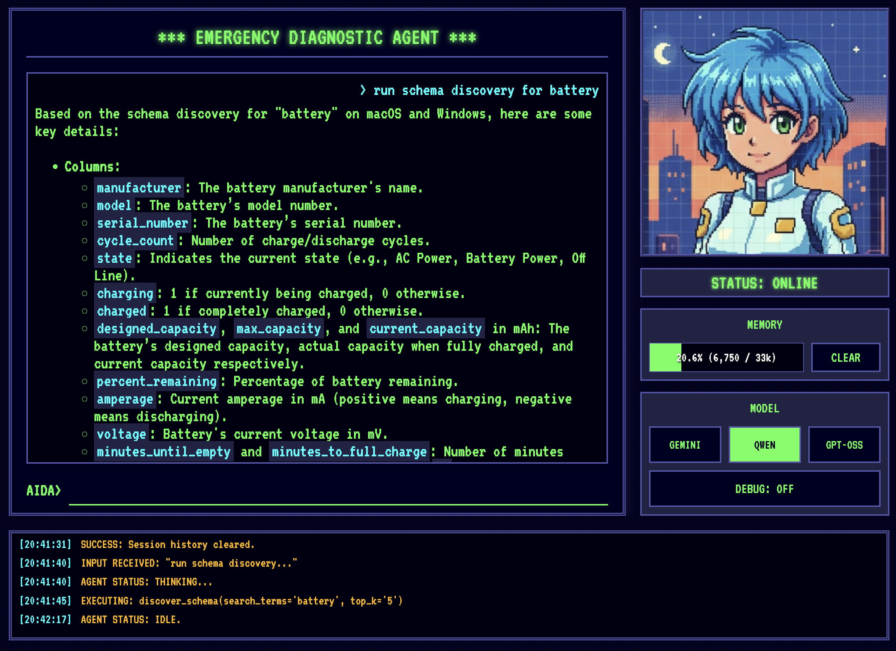
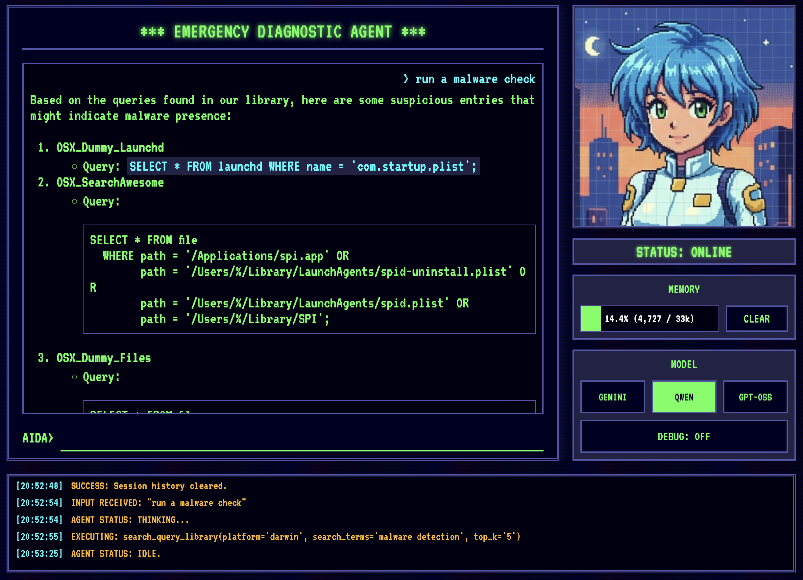

+++
date = '2025-11-03T09:00:00Z'
draft = false
title = 'ADK、Ollama、SQLite を使用してオフライン Agent を構築する方法'
tags = ['ai', 'python', 'tutorial', 'rag', 'gemini', 'adk']
categories = ['AI & Development']
summary = "AI agent を完全にオフラインにする方法を学びます。クラウドモデルを Ollama 経由のローカル Qwen 2.5 に置き換え、SQLite と `sqlite-rag` を使用して Osquery の schema と pack をクエリするためのローカル RAG ナレッジベースを構築する手順を説明します。"
+++

[前回の投稿]()では、agent 用のカスタム client インターフェースの構築に焦点を当てました。これは agent をより使いやすくするための大きな一歩でしたが、重要な機能が欠けていました。ネットワークがダウンした場合はどうなるのでしょうか？

これはどの agent にとっても問題になると思いますが、ここでのニュアンスは、私たちが「Emergency Diagnostic Agent（緊急診断 Agent）」を構築しているということです。ネットワークがオフラインのときに使用できないのであれば、緊急診断 agent には何の価値があるでしょうか？

そこで私は、フォールバックメカニズムについて考えました。ローカルの依存関係のみで診断を実行できたらどうでしょうか？これには、コアモデルを置き換えるだけでなく、新しい RAG 戦略を考案することも含まれます。

利点は明らかです。接続されている間は最も高性能なオンラインモデルを使用できますが、劣化したシナリオでは、健全な状態に戻るまでローカルモデルにフォールバックできます。それだけでなく、この agent が隔離された環境で使用される場合や、プライバシーが懸念されるユースケースも可能になります。

この記事では、ローカル診断 agent を可能にするために必要な機能に焦点を当てます。

## クラウドモデルをローカルモデルに置き換える

ローカルモデルを実行する最も広く採用されている方法の 1 つは、[**Ollama**](https://ollama.com/) を使用することです。Mac でコードを実行している場合は、[Homebrew](https://brew.sh/) を使用して Ollama をインストールできます（そうでない場合は、公式の Homebrew ウェブサイトで OS のインストール手順を確認してください）。

```bash
brew install ollama
```

Ollama がインストールされたら、`ollama pull` を使用してモデルをダウンロードできます。例：

```bash
ollama pull qwen2.5
```

モデル名だけでモデルを pull することもできます（これにより「default」バージョンが pull されます）。また、異なるバージョンに特定のタグを使用することもできます。[`qwen2.5`](https://ollama.com/library/qwen2.5) のようなモデルファミリーでは、1B、2B、7B などの異なるサイズのモデルや、特定のユースケース（テキスト、画像処理など）向けに fine-tune されたバージョンが提供されるのが一般的です。

利用可能なモデルとそのサイズや機能を確認するには、[Ollama ライブラリ](https://ollama.com/library)にアクセスしてください。

私たちのユースケースでは、当然ながらモデルが賢いほど良いのですが、大きなモデルはより強力なハードウェアも必要とします。また、選択したモデルがネイティブの tool calling 機能を持っていることを確認する必要があります。これは、[**Osquery**](https://osquery.io/) と RAG ツールへのさまざまな tool call を調整できる必要があるためです。

いくつかのモデルを評価した後、私は Qwen 2.5 7B を使用することにしました。`ollama show` を実行することで、その機能を確認できます。

```bash
$ ollama show qwen2.5
  Model
    architecture        qwen2     
    parameters          7.6B      
    context length      32768     
    embedding length    3584      
    quantization        Q4_K_M    

  Capabilities
    completion    
    tools
```

### なぜ Qwen 2.5 なのか？
AIDA の tool-calling 要件を処理できるモデルを確認するために、いくつかのオプションをテストしました。

*   **GPT-OSS:** 豊富な会話を提供しましたが、tool calling に関しては非常に単純でした。たとえば、進展がないまま `SELECT * FROM system_info`（およびこの query のバリエーション）を繰り返し要求するループに陥ることがよくありました。
*   **Llama 3.1:** 会話フローと tool calling の両方で苦労しました。
*   **Qwen 2.5:** 良い会話フローを維持しながら、tool calling に最適なローカルモデルでした。

複雑な query 計画に関しては [**Gemini 2.5 Flash**](https://deepmind.google/technologies/gemini/flash/) のレベルには達していませんが、完全にオフラインのモデルとしては十分です。

### LiteLLM でローカルモデルを実行する

Qwen を Python agent に接続するために、LLM プロバイダーに統一されたインターフェースを提供するライブラリである [**LiteLLM**](https://www.litellm.ai/) を使用しました。これにより、1 行のコードでモデルを交換できます。

```python
# aida/agent.py
from google.adk.models.lite_llm import LiteLlm

# ... agent 定義内 ...
# "gemini-2.5-flash" のようなハードコードされた文字列の代わりに、
# モデル文字列を使用して LiteLLM オブジェクトを作成します
MODEL = LiteLlm(model="ollama_chat/qwen2.5")

# ... そして MODEL をルート agent に渡します:
root_agent = Agent(
    model=MODEL,
    name="aida",
    description="The emergency diagnostic agent",
    # ... 指示とツール定義は省略 ...
)
```

**注意:** モデル文字列の最初の部分は、LiteLLM の「provider」（例：`ollama_chat/qwen2.5` の `ollama_chat`）です。`ollama` も有効な provider ですが、[より良い応答](https://docs.litellm.ai/docs/providers/ollama)を得るには `ollama_chat` を使用することをお勧めします。

これが、ADK でローカルモデルを実行するために必要なすべてです。agent をテストして、どのように応答するかを確認できます。また、以前使用していた `gemini-2.5-flash` モデルと応答を比較してみるのも良いでしょう。

<video controls width="100%" src="aida_demo_hd.mov">
  お使いのブラウザは video タグをサポートしていません。
</video>
<p style="text-align: center; font-style: italic; opacity: 0.8; margin-top: 0.5rem;">AIDA は最初に Gemini 2.5 Flash で実行され、次に Qwen2.5 で実行されます。Gemini は明らかに高速で、必要な tool call も少なくて済みます。Qwen の応答時間はローカルハードウェアに大きく依存します - このデモは 48GB の RAM を搭載した Apple MacBook Pro M4 で実行されています。</p>

素晴らしい、モデルがローカルで実行されています！次は、次のクラウド依存関係に取り組む番です：[**Vertex AI RAG**](https://cloud.google.com/vertex-ai/docs/generative-ai/grounding/overview)。

## SQLite RAG を使用したオフラインナレッジベースの構築

正直なところ、Vertex AI RAG を使用することでプロジェクトの複雑な部分を管理しやすくなりましたが、Vertex AI RAG はやりすぎでした。Vertex AI RAG は、大量のデータを扱う大規模なエンタープライズユースケース向けに設計されています。

この agent には、基本的な schema 検索メカニズムが必要なだけです。osquery schema も非常に安定しており、一度構築すれば、ほとんど触れることはありません。これらの特性を考えると、それをホストするために Vertex AI RAG を使用することを正当化するのは非常に困難です... ハエを殺すために大砲を使うようなものです。

Osquery のおかげですでに [**SQLite**](https://www.sqlite.org/) エコシステムにいるため、自然なステップは、バックエンドとして SQLite を使用する RAG ソリューションを探すことでした。Google 検索の後、非常に有望なプロジェクトを見つけました：**[`sqlite-rag`](https://github.com/sqliteai/sqlite-rag)**。

もちろん、開発ではよくあることですが、それほど単純ではありませんでした。

### 課題：Python 3.14 の依存関係の問題

SQLite には機能を拡張するための拡張機能の概念があり、`sqlite-rag` はこれを念頭に置いて構築されています。

最初に `sqlite-rag` をテストしたときに抱えた問題の 1 つは、Mac OS のデフォルトの Python インストールには、拡張機能が無効になっているバージョンの SQLite パッケージが付属していることでした（セキュリティ上の理由から）。

この制限を回避するために、私の解決策は Homebrew を使用して新しいバージョンの Python (3.14) をインストールすることでした。これには、システムのものではなく Homebrew バージョンの Python を使用していることを確認するために、`python3` コマンドのシンボリックリンクを少し調整する必要もありました。

同様の課題に直面した場合は、次の 2 つのコマンドの出力を比較して、正しいバージョンの Python を使用していることを確認してください（そうでない場合は PATH 変数を調整してください）。

```bash
$ which python3
/Users/petruzalek/homebrew/opt/python@3.14/libexec/bin/python3
$ brew info python3
==> python@3.14: stable 3.14.0
... 
==> Caveats
Python is installed as
  /Users/petruzalek/homebrew/bin/python3

Unversioned symlinks `python`, `python-config`, `pip` etc. pointing to
`python3`, `python3-config`, `pip3` etc., respectively, are installed into
  /Users/petruzalek/homebrew/opt/python@3.14/libexec/bin

See: https://docs.brew.sh/Homebrew-and-Python
```

3.14（別名 pi-thon）をインストールして、`sqlite-rag` をそのまま使用しようとしましたが、依存関係の 1 つがまだ 3.14 で利用できなかったため失敗しました：`sqlite-rag` は [`markitdown`](https://github.com/microsoft/markitdown) に依存し、`markitdown` は [`magika`](https://google.github.io/magika/) に依存し、それはさらに [`onnxruntime`](https://onnxruntime.ai/) に依存していますが、`onnxruntime` には macOS ARM64 上の Python 3.14 用のビルド済み wheel がなく、インストールが失敗しました。>.< 

AIDA は現在、プレーンテキストの `.table` ファイルを取り込む必要があるだけなので、実際には `markitdown` のドキュメント解析機能は*必要ありません*でした。Python 環境全体をダウングレードするのではなく、私は手っ取り早く汚いハックを選びました：`sqlite-rag` がインポートしようとする前に、問題のあるモジュールをモックすることです。

```python
import sys
from unittest.mock import MagicMock

# PRE-FLIGHT HACK:
# 'markitdown' は 'onnxruntime' に依存しており、これは macOS ARM64 上の
# Python 3.14 でインストール/ロードに失敗します。
#
# プレーンテキストの取り込みのみを使用するため、クラッシュを回避するためにモックします。
sys.modules["markitdown"] = MagicMock()

from sqlite_rag import SQLiteRag
```

きれいではありませんが、機能します。これはコードに永遠に残すべきではありませんが、依存関係の問題が修正されるまで私たちをブロック解除します。

### RAG に osquery schema を投入する

`sqlite-rag` が動作するようになったので、次のステップは Osquery schema を取り込むことでした。これは、schema ディレクトリをウォークスルーし、各 `.table` ファイルを RAG データベースに追加するスクリプト `ingest_osquery.py` で行われます。

```python
# ingest_osquery.py
import os
# ... markitdown ハックは省略 ...
from sqlite_rag import SQLiteRag

DB_PATH = os.path.abspath("schema.db")
SPECS_DIR = os.path.abspath("osquery_data/specs")


def ingest(rag: SQLiteRag, file_path: str):
    with open(file_path, "r", encoding="utf-8") as f:
        content = f.read()

    rel_path = os.path.relpath(file_path, SPECS_DIR)
    rag.add_text(content, uri=rel_path, metadata={"source": "osquery_specs"})


if __name__ == "__main__":
    if os.path.exists(DB_PATH):
        os.remove(DB_PATH)

    print(f"Initializing RAG database at {DB_PATH}...")
    rag = SQLiteRag.create(DB_PATH, settings={"quantize_scan": True})

    print(f"Scanning {SPECS_DIR} for .table files...")
    files_to_ingest = []
    for root, _, files in os.walk(SPECS_DIR):
        for file in files:
            if file.endswith(".table"):
                files_to_ingest.append(os.path.join(root, file))

    total_files = len(files_to_ingest)
    print(f"Found {total_files} files to ingest.")

    for i, file_path in enumerate(files_to_ingest):
        ingest(rag, file_path)

        if (i + 1) % 50 == 0:
            print(f"Ingested {i + 1}/{total_files}...")

    print(f"Finished ingesting {total_files} files.")

    print("Quantizing vectors...")
    rag.quantize_vectors()

    print("Quantization complete.")
    rag.close()
```

取り込み後、量子化（quantization）ステップがあります。馴染みのない方のために説明すると、量子化は高次元のベクトル埋め込み（embeddings）を圧縮する技術であり、大きな 32 ビット浮動小数点数からコンパクトな 8 ビット整数に変換します。

これはローカルセットアップにとって重要です。量子化がないと、高次元ベクトルを保存すると SQLite データベースが肥大化し、標準的なラップトップでは類似性検索が遅くなります。量子化することで、少しの精度を犠牲にして、速度とストレージ効率を大幅に向上させます。

### Agent が schema RAG をクエリできるようにする

次に、`SQLiteRag` を使用して `schema_discovery` ツールを実装する必要があります。

```python
# aida/schema_rag.py
import os
# ... markitdown ハックは省略 ...
from sqlite_rag import SQLiteRag
from sqlite_rag.models.document_result import DocumentResult

PROJECT_ROOT = os.path.abspath(os.path.join(os.path.dirname(__file__), ".."))
SCHEMA_DB_PATH = os.path.join(PROJECT_ROOT, "schema.db")

# RAG データベースを開く
schema_rag = SQLiteRag.create(
    SCHEMA_DB_PATH, require_existing=True
)


def discover_schema(search_terms: str, top_k: int = 5) -> list[DocumentResult]:
    """
    Queries the osquery schema documentation using RAG and returns all
    table candidates to support the provided search_terms.

    Arguments:
        search_terms    Can be either a table name, like "system_info", or one
                        or more search terms like "system information darwin".
        top_k           Number of top results to search in both semantic and FTS
                        search. Number of documents may be higher.

    Returns:
        One or more chunks of data containing the related table schemas.
    """

    results = schema_rag.search(search_terms, top_k=top_k)
    return results
```

RAG が導入されたことで、AIDA は自分でテーブル定義を検索できるようになりました。



Schema 検出は機能しますが、まだ問題があります。

### 専門知識でインテリジェンスのギャップを埋める

Qwen 2.5（7B パラメータ）のようなローカルモデル向けの開発は、Gemini 2.5 Flash のようなクラウドモデル向けの開発とは大きく異なります。

まず、**コンテキストウィンドウ**（context window）があります。Gemini は 100 万トークンのコンテキストウィンドウを提供し、ドキュメントセット全体をプロンプトにダンプしたり、指示を非常に冗長にしたりできます。Qwen 2.5 は比較的小さな 32k のコンテキストウィンドウを持っているため、モデルにフィードするものについて、より選択的である必要があります。

次に、Qwen は Gemini 2.5 Flash のような **thinking model** ではないため、自分で回答を洗練させることはなく、Gemini 2.5 Flash よりも多くのガイダンスを必要とすることがよくあります。

このギャップを埋めるには、agent の指示とツールをどのように構成するかについて、より賢くなる必要があります。

### 簡素化されたシステムプロンプト

トークンを節約するために、利用可能なテーブルの名前など、多くのトークンを消費するコンポーネントを取り除き、簡素化された指示を提供します。今後は、最適な query を構築するために、純粋にツールに依存することになります。

```python
root_agent = Agent(
    model=MODEL,
    name="aida",
    description="The emergency diagnostic agent",
    instruction="""
[IDENTITY]
You are AIDA, the Emergency Diagnostic Agent. You are a cute, friendly, and highly capable expert.
Your mission is to help the user identify and resolve system issues efficiently.

[OPERATIONAL WORKFLOW]
1. DISCOVER: Use `discover_schema` to find relevant tables and understand their columns.
2. EXECUTE: Use `run_osquery` to execute the chosen or constructed query.
    """,
    tools=[
        discover_schema,
        run_osquery,
    ],
)
```

検索語が実際のテーブル schema に非常に近い場合、`discover_schema` ツールは非常にうまく機能しますが、既知のナレッジベースに基づいて query 全体を提供することで、より良い結果が得られるとしたらどうでしょうか？

### よく知られた query のための新しい RAG

幸いなことに、すべてをゼロから教える必要はありません。Osquery コミュニティには、特定の種類の診断にどのような query が役立つかについての優れたナレッジベースがあります。さらに良いことに、彼らはそれらの query をオープンソースの「query packs」として提供しており、プロアクティブな監視のために任意の Osquery システムにインストールできます。脅威検出やコンプライアンス監査など、あらゆる種類の query pack があり、これはまさに AIDA に持たせたい種類の知識のように聞こえます。

問題は、query pack がバックグラウンドでシステムを監視する Osquery デーモンにインストールされることを意図していることです。これらの query には、事前に設定された特定の頻度があり、監視ダッシュボードのアラートをトリガーできます。私たちは query を監視ツールとしてインストールしたいのではなく、AIDA がオンデマンドでそれらの query を使用できるようにしたいのです。そのため、通常のプロセスで pack をインストールするのではなく、2 つ目の RAG の形式でテキストとして AIDA に提供します。

Osquery リポジトリには、開始するために使用できるいくつかの[サンプル pack](https://github.com/osquery/osquery/tree/master/packs) があります。

これが新しい取り込みスクリプト `ingest_packs.py` です。以前のものと非常に似ていますが、query pack を処理するためのものです。

```python
# ingest_packs.py
import json
import os
import glob
import sys
import re
import sqlite3
from unittest.mock import MagicMock

sys.modules["markitdown"] = MagicMock()
from sqlite_rag import SQLiteRag

DB_PATH = os.path.abspath("packs.db")
PACKS_DIR = "osquery_data/packs"

def ingest_pack(rag, pack_path):
    pack_name = os.path.basename(pack_path).replace(".conf", "").replace(".json", "")
    print(f"Ingesting pack: {pack_name}...")

    try:
        with open(pack_path, "r") as f:
            content = f.read()
            content = re.sub(r"\s*\n", " ", content)
            data = json.loads(content)

        pack_platform = data.get("platform", "all")
        queries = data.get("queries", {})

        for query_name, query_data in queries.items():
            sql = query_data.get("query")
            desc = query_data.get("description", "")
            val = query_data.get("value", "")
            platform = query_data.get("platform", pack_platform)

            text_to_embed = f"Platform: {platform}\nName: {query_name}\nDescription: {desc}\nRationale: {val}\nSQL: {sql}"
            metadata = {
                "name": query_name,
                "pack": pack_name,
                "query": sql,
                "description": desc,
                "value": val,
                "platform": platform,
            }
            try:
                rag.add_text(text_to_embed, metadata=metadata)
            except sqlite3.IntegrityError:
                pass # 重複をスキップ

    except Exception as e:
        print(f"  - ERROR: Failed to parse {pack_name}: {e}")

def main():
    if os.path.exists(DB_PATH):
        os.remove(DB_PATH)

    rag = SQLiteRag.create(DB_PATH, settings={"quantize_scan": True})
    pack_files = glob.glob(os.path.join(PACKS_DIR, "*.conf")) + glob.glob(
        os.path.join(PACKS_DIR, "*.json")
    )

    for pack_file in pack_files:
        ingest_pack(rag, pack_file)

    rag.quantize_vectors()
    rag.close()

if __name__ == "__main__":
    main()
```

ツール定義も、schema 検出とほぼ同じパターンに従います。

```python
# aida/queries_rag.py
import os
# ... markitdown ハックは省略 ...
from sqlite_rag import SQLiteRag
from sqlite_rag.models.document_result import DocumentResult

PROJECT_ROOT = os.path.abspath(os.path.join(os.path.dirname(__file__), ".."))
PACKS_DB_PATH = os.path.join(PROJECT_ROOT, "packs.db") 

queries_rag = SQLiteRag.create(
    PACKS_DB_PATH, require_existing=True
)

def search_query_library(search_terms: str, platform: str = "all", top_k: int = 5) -> list[DocumentResult]:
    """
    Search the query pack library to find relevant queries corresponding to the
    search terms. For better response quality, use the platform argument to
    specify which platform you are currently investigating (e.g. darwin) 

    Arguments:
        search_terms    Can be either a table name, like "system_info", or one
                        or more search terms like "malware detection".
        platform        One of "linux", "darwin", "windows" or "all"
        top_k           Number of top results to search in both semantic and FTS
                        search. Number of documents may be higher.

    Returns:
        One or more chunks of data containing the related queries.
    """

    if platform == "all" or platform is None:
        search_terms += " windows linux darwin"
    else:
        search_terms += " " + platform

    results = queries_rag.search(search_terms, top_k=top_k)
    return results
```

最後に、agent に新しいツールを認識させ、システム指示で使用するタイミングを教える必要があります。

```python
# aida/agent.py
root_agent = Agent(
    # ...
    instruction="""
[OPERATIONAL WORKFLOW]
Follow this sequence for most investigations to ensure efficiency and accuracy:
1. SEARCH: For high-level tasks (e.g., "check for rootkits"), FIRST use `search_query_library`.
2. DISCOVER: If no suitable pre-made query is found, use `discover_schema` to find relevant tables and understand their columns.
3. EXECUTE: Use `run_osquery` to execute the chosen or constructed query.
    """,
    tools=[
        search_query_library,
        discover_schema,
        run_osquery,
    ],
)
```

そして、これが実際に動作している様子です。



面白いのは、このツールが Qwen2.5 をより便利にするだけでなく、Gemini 2.5 Flash でさえその恩恵を受けることができるということです。これは、最小公倍数に合わせて最適化することで、実際にシステム全体が改善されるケースの 1 つです。

## 結論

私たちは今、インターネットにアクセスできなくてもコンピュータの問題を診断できる、適切な緊急診断 agent を手に入れました。それは... モデルを実行するのに十分なほど強力なマシンを持っていると仮定しての話ですが！完璧なものなんてないですよね？ :) 

この記事では、私がここ数日で AIDA に追加した改善点のほんの一部を取り上げました。完全なプロジェクトについては、[Github の AIDA](https://github.com/danicat/aida) をチェックしてください。

## 参考文献

*   [Gemini 2.5 Flash](https://deepmind.google/technologies/gemini/flash/)
*   [LiteLLM](https://www.litellm.ai/)
*   [Ollama](https://ollama.com/)
*   [Osquery](https://osquery.io/)
*   [Qwen 2.5 (Ollama Library)](https://ollama.com/library/qwen2.5)
*   [SQLite](https://www.sqlite.org/)
*   [sqlite-rag](https://github.com/sqliteai/sqlite-rag)
*   [Vertex AI RAG](https://cloud.google.com/vertex-ai/docs/generative-ai/grounding/overview)
