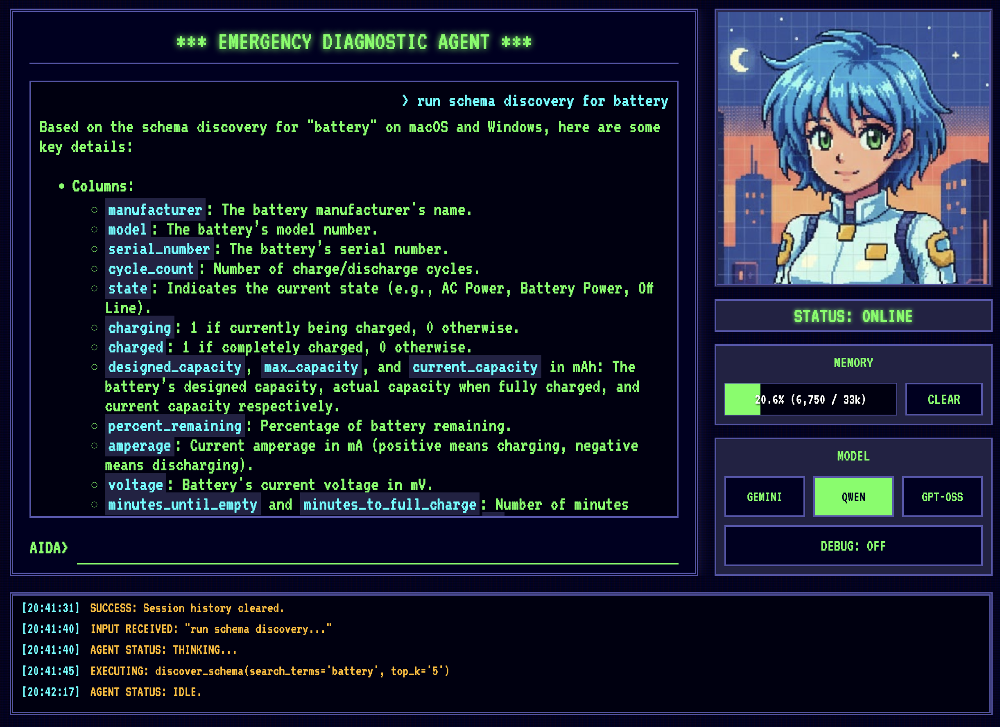
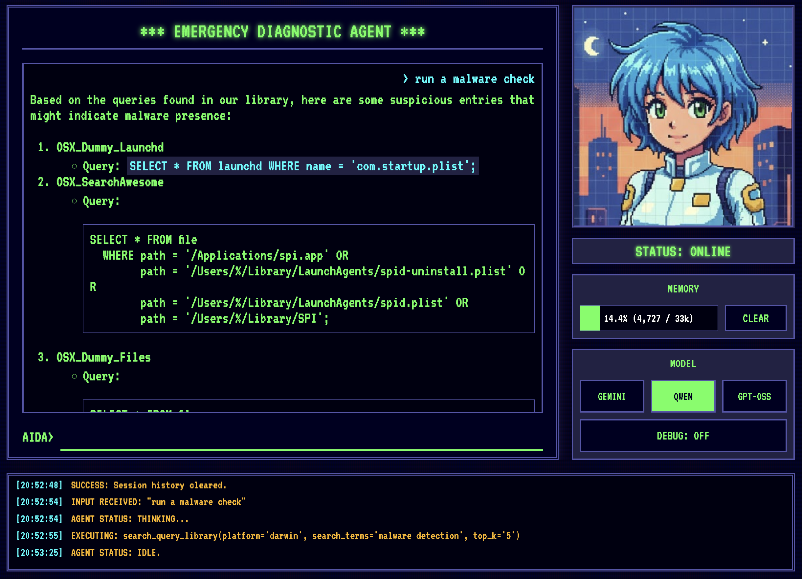

---categories:
- Agent Development
date: '2025-11-03T09:00:00Z'
series:
- Building the Diagnostic Agent
series_order: 6
summary: AI エージェントを完全オフラインで動作させる方法を解説します。クラウドモデルから Ollama 経由のローカル Qwen 2.5 への切り替えや、SQLite と `sqlite-rag` を使った Osquery スキーマおよびクエリパックのローカル RAG 構築手順を詳しく紹介します。
tags:
  - adk
  - gemini
  - ollama
  - python
  - rag
  - sqlite
  - tutorial
title: "ADK、Ollama、SQLite で完全オフラインなエージェントを構築する方法"
slug: "building-aida-part-2"
aliases:
  - "/ja/posts/20251103-building-aida-part-2/"
description: "Google ADK、Ollama/LiteLLM 経由のローカル Qwen 2.5、sqlite-rag による組み込みベクトル RAG を用いて、100% オフラインで動作する AI エージェントを構築する完全ガイド。"
proficiencyLevel: "Advanced"
dependencies:
  - "Python 3.11+"
  - "Google ADK"
  - "Ollama"
  - "Qwen 2.5"
  - "SQLite"
  - "sqlite-rag"
---

[シリーズ第5回「Dev-UIの先へ：ADKエージェントのインターフェースを構築する方法」]() では、エージェント用のカスタムクライアントインターフェースの構築に焦点を当てました。エージェントの使い勝手を高める大きな一歩となりましたが、まだ重要な機能が1つ欠けていました。「ネットワークがダウンしたときにどうするか」という問題です。

これはあらゆるエージェントにとって課題ですが、私たちが作っているのが「緊急診断エージェント」であるという点を考えると、特に深刻です。ネットワークがオフラインのときに使えない緊急診断エージェントなど、何の役に立つでしょうか？

そこで私は、フォールバックの仕組みについて考え始めました。ローカルの依存関係のみで診断を実行できるようにしたらどうでしょうか？これには、メインのモデルを置き換えるだけでなく、新しい RAG 戦略を考案することも含まれます。

そのメリットは明白です。接続があるときは最も高性能なオンラインモデルを使用し、障害発生時には正常な状態に戻るまでローカルモデルにフォールバックできます。それだけでなく、隔離された環境（エアギャップ環境）やプライバシーが重視される環境でエージェントを利用するユースケースも可能になります。

この記事では、ローカル診断エージェントを実現するために必要な機能に焦点を当てていきます。

## クラウドモデルからローカルモデルへの切り替え

ローカルモデルを実行する最も一般的な方法の1つが [**Ollama**](https://ollama.com/) です。Mac を使用している場合は、[Homebrew](https://brew.sh/) を使って Ollama をインストールできます（Mac 以外の場合は、公式のインストール手順を確認してください）：

```bash
brew install ollama
```

Ollama のインストールが完了したら、`ollama pull` コマンドでモデルをダウンロードできます。例えば次の通りです：

```bash
ollama pull qwen2.5
```

モデル名だけで pull することもできますし（この場合はデフォルトバージョンが取得されます）、特定のバージョンタグを指定することも可能です。[`qwen2.5`](https://ollama.com/library/qwen2.5) のようなモデルファミリーでは、1B、2B、7B といった様々なサイズや、特定のユースケース（テキスト、画像処理など）向けにファインチューニングされたバージョンが提供されているのが一般的です。

どのモデルが利用可能で、サイズや機能がどうなっているかを確認するには、[Ollama ライブラリ](https://ollama.com/library) にアクセスしてみてください。

今回のユースケースでは、モデルが賢ければ賢いほど望ましいのはもちろんですが、モデルが大きくなればそれだけ強力なハードウェアが必要になります。また、[**Osquery**](https://osquery.io/) や RAG ツールへのツール呼び出し（Tool Calling / Function Calling）を適切に連携させる必要があるため、ネイティブのツール呼び出し機能を備えたモデルを選ぶ必要があります。

いくつかのモデルを評価した結果、今回は Qwen 2.5 7B を採用することにしました。`ollama show` を実行すると、その仕様や機能を確認できます：

```bash
$ ollama show qwen2.5
  Model
    architecture        qwen2     
    parameters          7.6B      
    context length      32768     
    embedding length    3584      
    quantization        Q4_K_M    

  Capabilities
    completion    
    tools
```

### なぜ Qwen 2.5 なのか？

AIDA のツール呼び出し要件を満たせるかどうか、いくつかの候補を検証しました：

*   **GPT-OSS:** 自然な対話は得意でしたが、ツール呼び出しが非常にナイーブでした。例えば、`SELECT * FROM system_info`（およびその派生クエリ）を何度も繰り返し要求してループに陥り、先に進まなくなることが頻発しました。
*   **Llama 3.1:** 会話の流れとツール呼び出しの両面で苦戦しました。
*   **Qwen 2.5:** スムーズな会話の流れを維持しながら、ツール呼び出しを最も安定してこなせるローカルモデルでした。

複雑なクエリプランニングにおいては [**Gemini 2.5 Flash**](https://deepmind.google/technologies/gemini/flash/) のレベルには及びませんが、完全オフラインで動作するモデルとしては十分な実力を備えています。

### LiteLLM によるローカルモデルの実行

Qwen をエージェントに接続するために、各 LLM プロバイダーに統一インターフェースを提供するライブラリ [**LiteLLM**](https://www.litellm.ai/) を使用します。これを使えば、わずか1行のコード変更でモデルを切り替えられます：

```python
# aida/agent.py
from google.adk.models.lite_llm import LiteLlm

# ... エージェント定義の内部 ...
# "gemini-2.5-flash" のようなハードコードされた文字列の代わりに、
# モデル文字列を指定して LiteLLM オブジェクトを作成します
MODEL = LiteLlm(model="ollama_chat/qwen2.5")

# ... そして MODEL を root agent に渡します:
root_agent = Agent(
    model=MODEL,
    name="aida",
    description="The emergency diagnostic agent",
    # ... 指示文やツール定義は省略 ...
)
```

**注意:** モデル文字列の先頭部分は LiteLLM の「プロバイダー」名です（例: `ollama_chat/qwen2.5` の `ollama_chat`）。`ollama` も有効なプロバイダーですが、[より精度の高い応答を得る](https://docs.litellm.ai/docs/providers/ollama) ためには `ollama_chat` を使用することが推奨されています。

ADK でローカルモデルを実行するために必要な設定はこれだけです。エージェントをテストして応答を確認してみましょう。以前使用していた `gemini-2.5-flash` モデルとの応答の違いを比較してみるのも面白いでしょう。

<video controls width="100%" src="aida_demo_hd.mov">
  お使いのブラウザは動画タグをサポートしていません。
</video>
<p style="text-align: center; font-style: italic; opacity: 0.8; margin-top: 0.5rem;">最初に Gemini 2.5 Flash、次に Qwen 2.5 で実行した AIDA の比較。Gemini の方が明らかに高速で、必要なツール呼び出しの回数も少なくなっています。Qwen の応答速度はローカルのハードウェア性能に大きく左右されます（このデモは 48GB RAM を搭載した Apple MacBook Pro M4 で動作しています）。</p>

これでモデルをローカルで動かす準備が整いました。次は、もう1つのクラウド依存である [**Vertex AI RAG**](https://cloud.google.com/vertex-ai/docs/generative-ai/grounding/overview) の置き換えに取り組みましょう。

## SQLite RAG によるオフラインナレッジベースの構築

正直なところ、Vertex AI RAG のおかげでプロジェクトの複雑な部分をシンプルに扱えたものの、Vertex AI RAG は明らかにオーバースペックでした。Vertex AI RAG は、膨大なデータを扱う大規模なエンタープライズ用途を想定して設計されているからです。

今回のエージェントに必要なのは、基本的なスキーマ検索の仕組みだけです。また Osquery のスキーマは非常に安定しており、一度構築してしまえば後から手を加えることはほとんどありません。こうした特徴を考えると、Vertex AI RAG をホストに使うのは、まさに「ハエを大砲で撃つ」ようなものでした。

Osquery を使っている関係上、すでに [**SQLite**](https://www.sqlite.org/) エコシステムの中にいたため、SQLite をバックエンドにした RAG ソリューションを探すのは自然な流れでした。Google で検索してみたところ、非常に有望なプロジェクトを見つけました。**[`sqlite-rag`](https://github.com/sqliteai/sqlite-rag)** です。

もちろん、開発ではよくあることですが、一筋縄ではいきませんでした。

### 課題: Python 3.14 の依存関係トラブル

SQLite には機能を拡張するためのエクステンション（拡張機能）の概念があり、`sqlite-rag` もこれを利用するように設計されています。

最初に `sqlite-rag` をテストした際に直面した問題は、macOS のデフォルト Python に同梱されている SQLite パッケージでは（セキュリティ上の理由から）拡張機能の読み込みが無効化されていたことでした。

この制限を回避するため、Homebrew で新しいバージョンの Python（3.14）をインストールすることにしました。システム標準の Python ではなく Homebrew 版の Python が確実に使われるよう、`python3` コマンドのシンボリックリンクの調整も少し必要でした。

同様の問題に遭遇した場合は、次の2つのコマンドの出力を比較して正しいバージョンの Python が使われているか確認してください（一致していない場合は PATH 環境変数を調整します）：

```bash
$ which python3
/opt/homebrew/opt/python@3.14/libexec/bin/python3
$ brew info python3
==> python@3.14: stable 3.14.0
...
==> Caveats
Python is installed as
  /opt/homebrew/bin/python3

Unversioned symlinks `python`, `python-config`, `pip` etc. pointing to
`python3`, `python3-config`, `pip3` etc., respectively, are installed into
  /opt/homebrew/opt/python@3.14/libexec/bin

See: https://docs.brew.sh/Homebrew-and-Python
```

こうして 3.14（通称 pi-thon）をインストールした状態で `sqlite-rag` をそのまま使おうとしたところ、依存関係の一部がまだ 3.14 に対応しておらずエラーになってしまいました。`sqlite-rag` は [`markitdown`](https://github.com/microsoft/markitdown) に依存しており、`markitdown` は [`magika`](https://google.github.io/magika/) に、そしてそれが [`onnxruntime`](https://onnxruntime.ai/) に依存しています。しかし `onnxruntime` には macOS ARM64 向けの Python 3.14 用ビルド済み wheel がまだ存在せず、インストールに失敗してしまったのです。 >.<

現時点で AIDA が取り込む必要があるのはプレーンテキストの `.table` ファイルだけなので、`markitdown` の高機能なドキュメントパース機能は実際には*必要ありません*でした。Python 環境全体をダウングレードする代わりに、手っ取り早いハックを採用しました。`sqlite-rag` がモジュールをインポートしようとする前に、問題のモジュールをモック化してしまう方法です。

```python
import sys
from unittest.mock import MagicMock

# PRE-FLIGHT HACK:
# 'markitdown' は 'onnxruntime' に依存していますが、
# macOS ARM64 上の Python 3.14 ではインストール/ロードに失敗します。
#
# 今回はプレーンテキストのインジェストのみを行うため、
# モック化してクラッシュを回避します。
sys.modules["markitdown"] = MagicMock()

from sqlite_rag import SQLiteRag
```

お世辞にも綺麗とは言えませんが、しっかり機能します。ずっとコードに残しておくべきものではありませんが、依存関係の問題が解決するまでの暫定対応としては十分です。

### Osquery スキーマの RAG データベースへの格納

`sqlite-rag` が動作するようになったので、次のステップは Osquery スキーマのインジェストです。これは `ingest_osquery.py` スクリプトで行います。スキーマディレクトリを巡回し、各 `.table` ファイルを RAG データベースに追加していきます：

```python
# ingest_osquery.py
import os
# ... markitdown のハックは省略 ...
from sqlite_rag import SQLiteRag

DB_PATH = os.path.abspath("schema.db")
SPECS_DIR = os.path.abspath("osquery_data/specs")


def ingest(rag: SQLiteRag, file_path: str):
    with open(file_path, "r", encoding="utf-8") as f:
        content = f.read()

    rel_path = os.path.relpath(file_path, SPECS_DIR)
    rag.add_text(content, uri=rel_path, metadata={"source": "osquery_specs"})


if __name__ == "__main__":
    if os.path.exists(DB_PATH):
        os.remove(DB_PATH)

    print(f"Initializing RAG database at {DB_PATH}...")
    rag = SQLiteRag.create(DB_PATH, settings={"quantize_scan": True})

    print(f"Scanning {SPECS_DIR} for .table files...")
    files_to_ingest = []
    for root, _, files in os.walk(SPECS_DIR):
        for file in files:
            if file.endswith(".table"):
                files_to_ingest.append(os.path.join(root, file))

    total_files = len(files_to_ingest)
    print(f"Found {total_files} files to ingest.")

    for i, file_path in enumerate(files_to_ingest):
        ingest(rag, file_path)

        if (i + 1) % 50 == 0:
            print(f"Ingested {i + 1}/{total_files}...")

    print(f"Finished ingesting {total_files} files.")

    print("Quantizing vectors...")
    rag.quantize_vectors()

    print("Quantization complete.")
    rag.close()
```

インジェストの後には量子化（Quantization）のステップがあります。馴染みのない方のために説明すると、量子化とは高次元のベクトル埋め込み（Embedding）を圧縮する技術で、大きな 32 ビット浮動小数点数をコンパクトな 8 ビット整数に変換します。

これはローカル環境において非常に重要です。量子化を行わないと、高次元ベクトルの保存によって SQLite データベースのサイズが肥大化し、一般的なノート PC 上での類似度検索がもたつく原因になります。量子化によってわずかな精度と引き換えに、検索速度とストレージ効率の大幅な向上を得ることができます。

### エージェントによるスキーマ RAG への問い合わせ

次に、`SQLiteRag` を使って `schema_discovery` ツールを実装します：

```python
# aida/schema_rag.py
import os
# ... markitdown のハックは省略 ...
from sqlite_rag import SQLiteRag
from sqlite_rag.models.document_result import DocumentResult

PROJECT_ROOT = os.path.abspath(os.path.join(os.path.dirname(__file__), ".."))
SCHEMA_DB_PATH = os.path.join(PROJECT_ROOT, "schema.db")

# RAG データベースを開く
schema_rag = SQLiteRag.create(
    SCHEMA_DB_PATH, require_existing=True
)


def discover_schema(search_terms: str, top_k: int = 5) -> list[DocumentResult]:
    """
    RAG を使用して osquery のスキーマドキュメントを検索し、
    指定された search_terms をサポートするすべてのテーブル候補を返します。

    引数:
        search_terms    "system_info" のようなテーブル名、または
                        "system information darwin" のような1つ以上の検索語句。
        top_k           セマンティック検索と全文検索（FTS）の両方で検索する上位結果件数。
                        ドキュメント数はこれより多くなる場合があります。

    戻り値:
        関連するテーブルスキーマを含む1つ以上のデータチャンク。
    """

    results = schema_rag.search(search_terms, top_k=top_k)
    return results
```

RAG を導入したことで、AIDA は自力でテーブル定義を調べられるようになりました。



スキーマの探索は機能するようになりましたが、まだ課題が残っています。

## 専門知識の活用による能力差の克服

Qwen 2.5（パラメータ数 7B）のようなローカルモデル向けの開発は、Gemini 2.5 Flash のようなクラウドモデル向けの開発とは大きく異なります。

第一に、**コンテキストウィンドウ**の違いです。Gemini は 100 万トークンのコンテキストウィンドウを備えているため、ドキュメント全体をプロンプトに流し込んだり、非常に詳細な指示を与えたりすることができます。対して Qwen 2.5 は 32k トークンと比較的小さいため、モデルに渡す情報をはるかに厳選する必要があります。

第二に、Qwen は Gemini 2.5 Flash のような **Thinking Model（思考型モデル）** ではないため、自律的に回答を推敲・洗練することが難しく、Gemini 2.5 Flash よりも丁寧な誘導を必要とする場面が多くなります。

このギャップを埋めるためには、エージェントのシステム指示とツールの構成をより工夫する必要があります。

### シンプル化されたシステムプロンプト

トークン数を節約するために、利用可能なテーブル名の一覧など、大量のトークンを消費していた要素を削ぎ落としてシンプルな指示文に変更します。最適なクエリを組み立てる処理は、完全にツール側に委ねる方針をとります。

```python
root_agent = Agent(
    model=MODEL,
    name="aida",
    description="The emergency diagnostic agent",
    instruction="""
[IDENTITY]
You are AIDA, the Emergency Diagnostic Agent. You are a cute, friendly, and highly capable expert.
Your mission is to help the user identify and resolve system issues efficiently.

[OPERATIONAL WORKFLOW]
1. DISCOVER: Use `discover_schema` to find relevant tables and understand their columns.
2. EXECUTE: Use `run_osquery` to execute the chosen or constructed query.
    """,
    tools=[
        discover_schema,
        run_osquery,
    ],
)
```

検索キーワードが実際のテーブルスキーマに十分近ければ `discover_schema` ツールでも良好に機能しますが、既知のナレッジベースからクエリそのものを提供できるようにすれば、さらに精度を高められるのではないでしょうか？

### 定番クエリのための新しい RAG

幸いなことに、ゼロからすべてを学習させる必要はありません。Osquery コミュニティには、特定の診断にどのクエリが役立つかという素晴らしいナレッジベースが蓄積されています。さらに嬉しいことに、プロアクティブな監視のために任意の Osquery 環境へ導入できるオープンソースの「クエリパック（Query Packs）」としてそれらのクエリが提供されています。脅威検知やコンプライアンス監査など多種多様なクエリパックが存在し、まさに AIDA に持たせたい知識そのものです。

ただし、クエリパックは本来、バックグラウンドでシステムを常時監視する Osquery デーモンにインストールされることを想定しています。あらかじめ設定された頻度でクエリを実行し、監視ダッシュボードにアラートを飛ばす仕組みです。私たちがやりたいのは監視ツールとして導入することではなく、AIDA が必要に応じてオンデマンドでそれらのクエリを利用できるようにすることです。そこで、通常の手順でパックをインストールするのではなく、テキストデータとして AIDA に渡す第2の RAG を構築することにしました。

Osquery リポジトリには、手始めに利用できる [サンプルパック](https://github.com/osquery/osquery/tree/master/packs) がいくつか用意されています。

以下が、クエリパックを処理するための新しいインジェストスクリプト `ingest_packs.py` です。先ほどのスクリプトと非常によく似ています：

```python
# ingest_packs.py
import json
import os
import glob
import sys
import re
import sqlite3
from unittest.mock import MagicMock

sys.modules["markitdown"] = MagicMock()
from sqlite_rag import SQLiteRag

DB_PATH = os.path.abspath("packs.db")
PACKS_DIR = "osquery_data/packs"

def ingest_pack(rag, pack_path):
    pack_name = os.path.basename(pack_path).replace(".conf", "").replace(".json", "")
    print(f"Ingesting pack: {pack_name}...")

    try:
        with open(pack_path, "r") as f:
            content = f.read()
            content = re.sub(r"\s*\n", " ", content)
            data = json.loads(content)

        pack_platform = data.get("platform", "all")
        queries = data.get("queries", {})

        for query_name, query_data in queries.items():
            sql = query_data.get("query")
            desc = query_data.get("description", "")
            val = query_data.get("value", "")
            platform = query_data.get("platform", pack_platform)

            text_to_embed = f"Platform: {platform}\nName: {query_name}\nDescription: {desc}\nRationale: {val}\nSQL: {sql}"
            metadata = {
                "name": query_name,
                "pack": pack_name,
                "query": sql,
                "description": desc,
                "value": val,
                "platform": platform,
            }
            try:
                rag.add_text(text_to_embed, metadata=metadata)
            except sqlite3.IntegrityError:
                pass # 重複をスキップ

    except Exception as e:
        print(f"  - ERROR: Failed to parse {pack_name}: {e}")

def main():
    if os.path.exists(DB_PATH):
        os.remove(DB_PATH)

    rag = SQLiteRag.create(DB_PATH, settings={"quantize_scan": True})
    pack_files = glob.glob(os.path.join(PACKS_DIR, "*.conf")) + glob.glob(
        os.path.join(PACKS_DIR, "*.json")
    )

    for pack_file in pack_files:
        ingest_pack(rag, pack_file)

    rag.quantize_vectors()
    rag.close()

if __name__ == "__main__":
    main()
```

ツール定義も、スキーマ探索ツールとほぼ同様のパターンに従います：

```python
# aida/queries_rag.py
import os
# ... markitdown のハックは省略 ...
from sqlite_rag import SQLiteRag
from sqlite_rag.models.document_result import DocumentResult

PROJECT_ROOT = os.path.abspath(os.path.join(os.path.dirname(__file__), ".."))
PACKS_DB_PATH = os.path.join(PROJECT_ROOT, "packs.db") 

queries_rag = SQLiteRag.create(
    PACKS_DB_PATH, require_existing=True
)

def search_query_library(search_terms: str, platform: str = "all", top_k: int = 5) -> list[DocumentResult]:
    """
    クエリパックライブラリを検索し、検索語句に対応する関連クエリを見つけます。
    応答品質を高めるため、platform 引数を使用して現在調査中のプラットフォーム
    （例: darwin）を指定してください。

    引数:
        search_terms    "system_info" のようなテーブル名、または
                        "malware detection" のような1つ以上の検索語句。
        platform        "linux"、"darwin"、"windows"、または "all" のいずれか
        top_k           セマンティック検索と全文検索（FTS）の両方で検索する上位結果件数。
                        ドキュメント数はこれより多くなる場合があります。

    戻り値:
        関連するクエリを含む1つ以上のデータチャンク。
    """

    if platform == "all" or platform is None:
        search_terms += " windows linux darwin"
    else:
        search_terms += " " + platform

    results = queries_rag.search(search_terms, top_k=top_k)
    return results
```

最後に、エージェントに新しいツールを認識させ、システム指示によっていつ使用すべきかを伝えます：

```python
# aida/agent.py
root_agent = Agent(
    # ...
    instruction="""
[OPERATIONAL WORKFLOW]
効率と正確性を確保するため、ほとんどの調査において次の順序に従ってください:
1. SEARCH: 高度なタスク（例: "check for rootkits"）では、まず `search_query_library` を使用してください。
2. DISCOVER: 適切な既存クエリが見つからない場合は、`discover_schema` を使って関連テーブルを探し、そのカラム定義を確認してください。
3. EXECUTE: `run_osquery` を使用して、選択または構築したクエリを実行してください。
    """,
    tools=[
        search_query_library,
        discover_schema,
        run_osquery,
    ],
)
```

実際の動作画面がこちらです：



面白いのは、このツールが Qwen 2.5 の実用性を高めるだけでなく、Gemini 2.5 Flash にとっても大きなメリットになる点です。最小公約数（最も制約の厳しい環境）に向けて最適化を行うことで、結果的にシステム全体の品質が底上げされる好例と言えます。

## まとめ

これで、インターネットへの接続がない状態でもコンピュータの問題を診断できる、本格的な緊急診断エージェントが完成しました。もっとも……モデルを実行できるだけの十分なマシンスペックがあれば、の話ですが！完璧なものなんてそうそうありませんよね :)

この記事で紹介したのは、ここ数日で AIDA に加えた改善のほんの一部に過ぎません。プロジェクトの全容については、ぜひ [GitHub の AIDA リポジトリ](https://github.com/danicat/aida) をチェックしてみてください。

## 参考リンク

*   [Gemini 2.5 Flash](https://deepmind.google/technologies/gemini/flash/)
*   [LiteLLM](https://www.litellm.ai/)
*   [Ollama](https://ollama.com/)
*   [Osquery](https://osquery.io/)
*   [Qwen 2.5 (Ollama Library)](https://ollama.com/library/qwen2.5)
*   [SQLite](https://www.sqlite.org/)
*   [sqlite-rag](https://github.com/sqliteai/sqlite-rag)
*   [Vertex AI RAG](https://cloud.google.com/vertex-ai/docs/generative-ai/grounding/overview)
