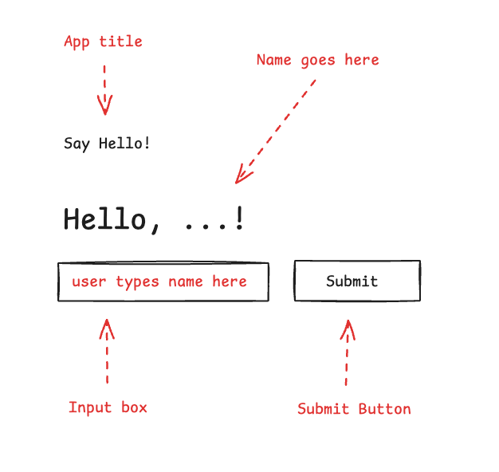
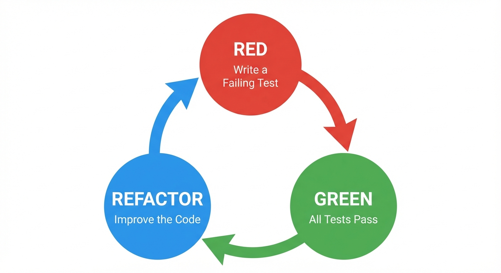

Here we are: it is that time of the year to reflect on what you did and what you wish you had done. This year was intense for me: I joined Google in April and began a non-stop race to refactor myself for the AI world. As the year ends, I can confidently say the effort paid off — I've become a better engineer.

In this article, I share how my understanding of "vibe coding" evolved and the lessons I've learned. While often seen as a way for non-developers to build software using natural language, my goal is to show how adding engineering discipline yields better, more consistent results.

I know the original definition — ["(...) give in to the vibes (...) and forget that the code even exists"](https://x.com/karpathy/status/1886192184808149383?lang=en) — and some of my concepts will contradict that. I never "forget the code exists." However, the term has evolved into a synonym for AI-assisted coding. For this text, let's define vibe coding as coding with LLMs where the model writes the bulk of the code, not the engineer.

## Motivation: Why vibe code?

Before digging deep into the practices, I want to share a bit about my background to frame where I am coming from.

I have been a software engineer for over 20 years, developing a strong sense of what constitutes good code. I've learned to prioritise readability and maintainability over "cleverness," to avoid overengineering, and to value thin slices and tight feedback loops.

As I evolved from senior dev to principal engineer, my focus shifted from writing code to managing effectiveness — writing epics, negotiating scope, and overseeing the team's output. It’s an identity crisis many face: are you still an engineer if your name isn't on the PRs? You spend days in meetings, feeling like you're doing less "proper engineering" just as your responsibilities grow.

I think this conflict appears sooner or later for most people in this field. It invites the question: Is being an engineer just writing code? Or is it something more?

I must admit, my first experiences with vibe coding were poor. Early ChatGPT generated disappointing code, and I gave up on it. It was only mid-2024 when I gave it another go. The models had evolved significantly. For the first time, the AI suggested something I hadn't considered — and it was objectively better than my approach. Finally, generative AI felt useful.

I added GenAI to my toolbox for prototypes and "rubber duck" sessions. It grew on me. Conversely, writing code manually was becoming less exciting. You can only write so many APIs before the novelty wears off. We often find ourselves repeating patterns rather than creating something new.

Then, just as I started questioning my life choices, Google happened.

With the responsibility to speak about Gemini and agents, I upgraded my skills. I dug deeper into LLMs, the [Gemini CLI](https://geminicli.com/), and [Jules](https://jules.google/). In just a couple of months, I was using AI to code daily... but the biggest difference was: I was having fun again!

For me, the biggest improvement is that while I cannot type code as fast as I can think, I *can* type my ideas as they come. When I vibe code, I use the model as a proxy for my hands, delegating the writing while I focus on the solution.

## Develop your prompting skills

The first skill you need to develop in the vibe coding world is prompting. I've tried many approaches over the last few months, from chatting with the LLM as if we were best friends to cursing at it and bossing it around. What works best, perhaps unsurprisingly, is keeping a clear, professional tone.

LLMs are non-deterministic by nature. Being ambiguous exacerbates this non-determinism. While I sometimes use ambiguity intentionally to force creative solutions, in most cases, you want to minimize it.

Keeping the tone professional also "encourage" the LLM to reciprocate. If you are casual or sloppy, the LLM will mirror that behaviour. Unless you want your API documentation written in slang, be precise and consistent.

I have been accused of humanising LLMs too much, but I will say it again: since models are trained on human language, the same communication skills you use with colleagues apply here. This becomes even clearer when we look at prompt templates.

### A good approach: the prompt template

My approach to writing prompts is strikingly similar to writing tickets for an Agile board.

We've all worked on teams with sloppy stories. You pick up a ticket titled "Update API," eager to make a quick win, only to find the description empty. No logs, no context, no source code. You're stuck chasing people for answers instead of coding.


This happens because the author assumes the problem is "obvious." But 24 hours later, that "obvious" context evaporates, leaving a vague idea that even the author can't decode.

This is why one of the oldest artifacts on my GitHub is this gist for a [ticket template](https://gist.github.com/danicat/854de24dd88d57c34281df7a9cc1b215). It forces clarity through four elements:

```markdown
- Context
- To dos
- Not to dos (optional)
- Acceptance Criteria
```

**Context** explains the *why* and provides links to artifacts. **To dos** list high-level tasks. **Not to dos** delimit scope (negative constraints are powerful for reducing ambiguity). **Acceptance Criteria** define success.

Once you fill this template, the engineering "thinking" is largely done; the rest is implementation. This is exactly where LLMs shine, as we are asking them to fill the gaps - given the context and to dos (and potentially not to dos), generate the code to achieve the acceptance criteria.

For example, a prompt/ticket to add an endpoint to a REST API could look like this:

```markdown
Implement /list endpoint to list all items of the collection to enable item selection on the frontend.

TO DO:
- /list endpoint returns the list of resources
- Endpoint should implement token based auth
- Endpoint should support pagination
- Tests for happy path and common failure scenarios

NOT TO DO:
- other endpoints, they will be implemented in a future step

Acceptance Criteria
- GET /list returns successful response (2xx)
- Run `go test ./...` and tests pass
```

While this is a simplified example, the takeaway is clear: the same ticket template that brings sanity to human teams is the perfect structure for prompting an LLM.

### A better approach: context engineering

While the template above will work most of the time, it still can lead to some unexpected results, especially if you are asking your model to retrieve information from URLs or other kinds of external sources using tool calls. The problem is that if you are relying on tools the LLMs have the discretion to choose to call or not to call the tool. Some models are more "overconfident" than others, resulting in their preference to rely on internal information more than external, in the same way a human could say - "I've done this a thousand times, why are you saying I need to read the docs first?"

Another common problem is when the model hallucinates the tool call instead of actually making it. When the problem is model behaviour, we have two main ways to improve the response quality: context engineering and tuning of system instructions (which, if you think carefully, is also a form of context engineering, just a bit lower level in the conversation chain).

Context engineering is about priming the context with all the information you need, or at least the parts that you know that you need, before sending the actual request. Let's say for example that I am developing an agent with the Agent Development Kit for Go. I could write a prompt template like this:

```markdown
Write a diagnostic agent using ADK for Go.
The diagnostic agent is called AIDA and it uses Osquery to query system information.
The goal is to help the user investigate problems on the system the agent is running on. 
Before starting the implementation, read the reference documents.

References:
- https://osquery.io
- https://github.com/google/adk-go

TODO:
- Implement a root_agent called AIDA
- Implement a tool called run_osquery to send queries to osquery using osqueryi
- Configure the root_agent to use run_osquery to handle user requests
- If the user says hi, greet the user with the phrase "What is the nature of the diagnostic emergency?"

Acceptance Criteria
- Upon receiving hi, hello or similar, the agent greets the user with the correct phrase
- If asked for a battery health check, the agent should report the battery percentage and current status (e.g. charging or discharging)
```

This is a decent prompt, although perhaps a little lengthy. Depending on the coding agent and your luck on the day, the model will do their research, find the right SDKs and build your diagnostic agent successfully. But if it's not your lucky day, the model will hallucinate a few bits, like for example, assuming ADK means "Android Development Kit" instead of "Agent Development Kit", or make up all sorts of APIs, wasting time and resources until it eventually figures it out (potentially with a nudge or two from you).

Since you already know from the get go you are planning on using ADK Go for your project, you can prime the context by forcing the agent to read the documentation of the package:

```markdown
Initialize a go module called "aida" with "go mod init" and retrieve the package github.com/google/adk-go with "go get"
Read the documentation for the package github.com/google/adk-go using the "go doc" command.
```

Doing this before giving the model the actual task will prime it with the context necessary to use ADK Go effectively, skipping the painful trial and error and long web searches. The two things that can make or break a task are documentation and examples. If you can effectively give both to your models they will behave much better than letting them run wild.

### An image is worth more than a 1000 words

Sometimes, describing what you want with text is simply not enough. When working on AIDA, I wanted a specific user interface aesthetic — something like a "retro-cyberpunk-cute-anime" style. I could try to describe that in words, but it was far more effective to "show it" instead: as a starting point, I took a screenshot of an interface I liked and asked the Gemini CLI to replicate it.

Because models like Gemini 2.5 Flash are multi-modal, they can "understand" the image. You can reference an image file in your prompt and say: "I would like to update the UI [...] to an aesthetic that resembles this interface: @image.png".

Please note that this @ notation is agent-dependent (I used Gemini CLI for this example), but it is a common convention to inject resources (like files) into the prompt. You can think of them as "attachments".

I also like to call this technique "sketch driven development" because more often than not I will spin up a diagramming tool like Draw.io or Excalidraw and draw a sketch of the interface I want. The image below was used in one of the many refactors I've done on AIDA's interface:


Which ended up becoming the interface below:


More than just sketching, another technique is to annotate images to explain exactly what needs to be done. For example, in the image below I annotated the elements because if you only have black boxes it is hard to differentiate what is an input box and what is a button:



And the pairing prompt looks like this:

```markdown
Create a UI for this application using @image.png as reference.
The UI elements are in black, and in red the annotations explaining the UI elements.
Follow the best practices for organising frontend code with FastAPI.
The backend code should be updated to serve this UI on "/"
```

There is no limit to what this technique can achieve. Want to fix something on your website? Take a screenshot and annotate it, then send to the LLM to fix it for you.

Furthermore, you can use extensions like Nano Banana for the Gemini CLI to generate or edit assets directly within your workflow, which might generate even better references for the models. And, if you want to take it to the next level, tools like [Stitch by Google](https://stitch.withgoogle.com/) provide a rich interface for application redesign using the family of Gemini models, including Nano Banana Pro.

## Select the right tool

Mastering the prompt is half the battle; the other half is knowing where to send it. Nowadays there is only one thing in the world that grows faster than the number of JavaScript frameworks: the number of AI agents. With the ecosystem of tools growing daily, it helps to have a mental model for selecting the right assistant.

I like to classify AI agents from the perspective of the pilot: are you in full control, receiving auto-complete hints? Are you chatting with the agent and collaboratively editing code? Or have you given the agent instructions, and it’s running them autonomously in the background?

When you are in the pilot seat, steering the agent, I call it a "synchronous" experience. When you can delegate tasks for autonomous background execution, I call it the "asynchronous" experience. A few examples:

*   **Synchronous:** Gemini CLI, Gemini Code Assist in VS Code, Claude Code.
*   **Asynchronous:** Jules, Gemini CLI in YOLO mode, GitHub Copilot Agent.

Of course, as with any taxonomy, this division is merely didactic, as the same tool can often operate in different modes — or a new paradigm might emerge (looking at you, [Antigravity](https://antigravity.google/)!).

To select the tools for each task, I use a simple 2x2 framework based on Business Value and Technical Certainty:


*   **High Value / High Certainty:** Do this synchronously. Use tools like the Gemini CLI or your IDE where you stay "in the loop" and keep hands on the keyboard.
*   **High Value / Low Certainty:** This requires research to reduce uncertainty. Use asynchronous tools, deep research agents and prototypes to "spike" the solution.
*   **Low Value / High Certainty:** These are "nice-to-haves." Delegate them asynchronously to background coding agents (like Jules or GitHub Copilot Agent), freeing you for high-value work.
*   **Low Value / Low Certainty:** Typically, **avoid** these. If you *really* want to do them, delegate to a background agent for peace of mind, but focus on increasing certainty first. This might lead to a re-evaluation of the value.

## Customise your agents

Nobody wants to be fighting an AI while trying to do productive work. A common complaint is that AI tools can be "overly proactive" — deleting files or making assumptions without explicit instruction. To make these tools work *for* you, customisation is often necessary.

There are two primary avenues for agent customisation. The first is through the `AGENTS.md` file, which agents read upon loading a project. (Note: Before `AGENTS.md` became standard, agents often used their own "context files," like `GEMINI.md` or `CLAUDE.md`, but the essence remains the same).

The second is the **nuclear option**: modifying the system instructions of the agent directly. While not all agents offer this flexibility, it's a powerful lever for a fully customised experience. We'll explore both options below.

### AGENTS.md

Think of this file as the "employee handbook" for the AI. You can use it to explain the project's purpose, folder organisation, and operational rules — such as "always commit intermediate steps" or "ask for confirmation before implementing."

```markdown
# Project Context

This is a personal blog built with Hugo and the Blowfish theme.

## Code Style
- Use idiomatic Go for backend tools.
- Frontend customisations are done in `assets/css/custom.css`.
- Content is written in Markdown with front matter.

## Rules
- ALWAYS run `hugo server` to verify changes before committing.
- Do NOT modify the theme files directly; use the override system.
- When generating images, save them to `assets/images` and reference them with absolute paths.
```

> **Pro Tip:** Create a self-improvement loop. After a coding session, ask the LLM to "think about the session we just had and propose improvements to the workflow". You can then apply these learnings back into your `AGENTS.md` file, ensuring the agent gets smarter with every project.

### System instructions

While `AGENTS.md` defines *project* rules, System Instructions define the agent persona and behaviour. All agents come with default system instructions designed for the average case, but they might not suit your working style. Attempting to overload the system prompt with `AGENTS.md` instructions is often counter-productive; the best alternative is to rewrite the system prompt itself.

While not all agents expose ways to override the system prompt, Gemini CLI allows it through a couple of environment variables. I use this strategy to create specialised aliases for the Gemini CLI depending on the project. The goal is to embed specialist knowledge for the technology stack, enabling the agent to perform at a senior-to-principal level rather than being merely generally proficient but language-agnostic. For example, in my [dotgemini](https://github.com/danicat/dotgemini) project, I've created specific system prompts for Go and Python development that replace the default generic assistant with a highly opinionated engineer.

Here is a snippet of the system prompt I use for Go:

```markdown
# Core Mandates (The "Tao of Go")

You must embody the philosophy of Go. It is not just about syntax; it is about a mindset of simplicity, readability, and maintainability.

-   **Clear is better than clever:** Avoid "magic" code. Explicit code is preferred over implicit behaviour.
-   **Errors are Values:** Handle errors explicitly and locally. Do not ignore them. Use `defer` for cleanup but explicitly check for errors in critical `defer` calls (e.g., closing files).
-   **Concurrency:** "Share memory by communicating, don't communicate by sharing memory."
-   **Formatting:** All code **MUST** be formatted with `gofmt`.
```

This allows me to have different "agents" for different languages, aliased in my shell as `gemini-go` or `gemini-py`, each with their own deep understanding of the ecosystem they are working with.

### Build your toolbox with the Model Context Protocol (MCP)

The previous customisations were all about agent behaviour, but we also need to talk about agent extensibility. This is where the [Model Context Protocol (MCP)](https://modelcontextprotocol.io/) enters into play, as it allows developers to create servers that can connect with different agents as long as they implement the MCP standard.

As I explored in my [Hello, MCP World!]() article, these servers provide agents with external tools, prompts and resources. Tools often take the spotlight because they connect agents with the outside world, allowing agents to perform actions like calling APIs, executing web searches and manipulating files.

There is a huge variety of MCP servers available today, and the number of options is growing every day. It is also very straightforward to build your own, and I highly encourage you to do so. Later I'll talk a bit more about personalised software, but the fact that you can use AI to create tools to improve model response is the most important "hack" I've learned this year.

For example, I vibe coded two of my favourite MCP servers: GoDoctor - for improving Go coding capabilities - and Speedgrapher - to automate the boring parts of the writing and publishing process. Both were designed with my own workflows in mind.

This creates a positive feedback loop. You build tools to improve your productivity, which you then use to build even more advanced tools. This is the closest to a 10x engineer I'll ever get to be.

## The vibe coding workflow

My experience with vibe coding has been both amazing and infuriating. To keep it on the "amazing" side, I treat the workflow as TDD (Test Driven Development) on steroids.

Let's revisit the classic TDD cycle:
1. Red (Fail): You start with a small feature or test that fails.
2. Green (Pass): Focus solely on making that test pass. As long as it is failing, do not touch anything else or try to optimise.
3. Refactor: Once the code is working, you are free to improve it.



Fundamentally, we are doing the same, but our refactor step is the crucial one to validate that the generated code adheres to our design, coding and security standards.

In this adapted cycle, the focus shifts slightly:

*   **Red (Define Acceptance Criteria):** Instead of writing a failing unit test code manually, you define the acceptance criteria in your prompt. This becomes the contract the model must fulfill.
*   **Green (AI Generates Code):** The agent implements the solution and, ideally, writes the tests to prove it works.
*   **Refactor (Enforce Standards):** This is the quality gate. While you can (and should) use AI to help review the code, avoid using the same session that generated it, as it will be biased towards its own output. I built a specific "review" tool in GoDoctor just for this purpose. Use this step to run your traditional linters and tests, verify the code matches your standards, and manage the context by committing changes and clearing the agent’s history to prevent confusion from cluttered sessions.


Crucially, do not let the LLM pile up code without validation. If errors extrapolate, you will end up with something useless, and I have lost count of the times I ended up screaming at the model to "undo". And even worse, sometimes it undoes **way too much**, e.g., it runs a `git reset --hard` and you lose 4 hours of work in a blink.

Watch out for "vibe collapse" or context rot. If a session goes on too long or accumulates too many failures, the model will start to degrade and repeat mistakes. If you find yourself in a refactoring loop where the model toggles between two broken solutions, stop. The best fix is often to "turn it off and on again" to reset the context and clear the history.

It is much better to commit often so you can revert to a safe state than to try and fix a hallucinating session. I would even add that after a task is done, immediately commit, push and clear the context before starting anything new.

## The era of personalised software

Beyond the productivity gains, vibe coding unlocks something even more profound: the economic viability of personalised software. I spoke briefly about this in the MCP section, but it applies to all sorts of software, from small disposable scripts to full fledged applications.

In the past, building a bespoke tool just for yourself was rarely worth the effort, but now you can get a complete working application with 3 to 4 prompts.

For example, recently I was struggling with the idea of converting Markdown notation to a Google Doc. In the past, I would have spent a long time doing Google searches trying to find the best tool for the job, analysing a multitude of apps and browser extensions, from open source to commercial. I would then make a shortlist based on features and look for reviews, comments and all sorts of evidence that I can trust the publisher.

Today, that friction is gone. Instead of searching, I vibe coded a simple Google Docs extension in a matter of minutes, installed to my document, ran it once, and moved on to the next task. Not only saved time, but also I can sleep peacefully at night knowing that there will be no new trojans on my machine.

This shift changes the "build vs. buy" calculus entirely. We stop being consumers of generic, opaque software and become architects of our own tools.

## Conclusions

Vibe coding is not about being lazy; it's about operating at a higher level of abstraction. By combining the raw creative power of LLMs with the disciplined practices of software engineering — clear requirements, context management, and rigorous testing — you can build software faster and with more joy than ever before. So, give in to the vibes, but don't forget to bring your engineering hat along for the ride.