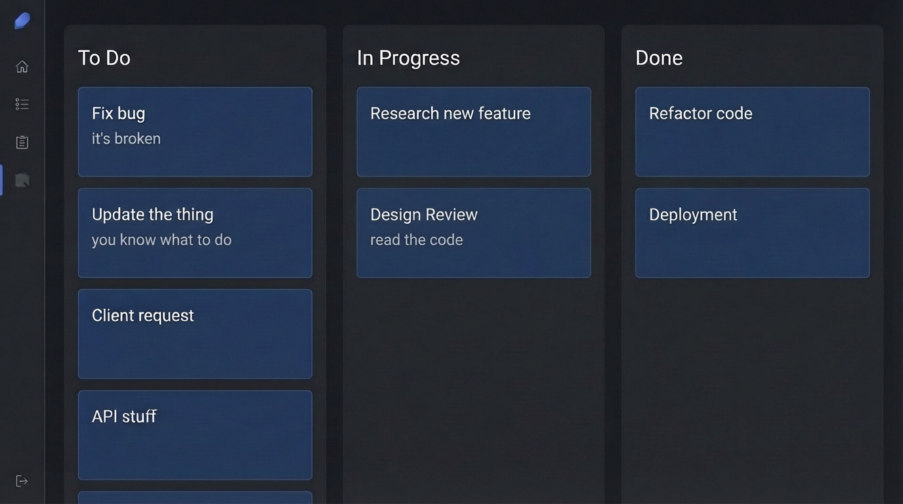
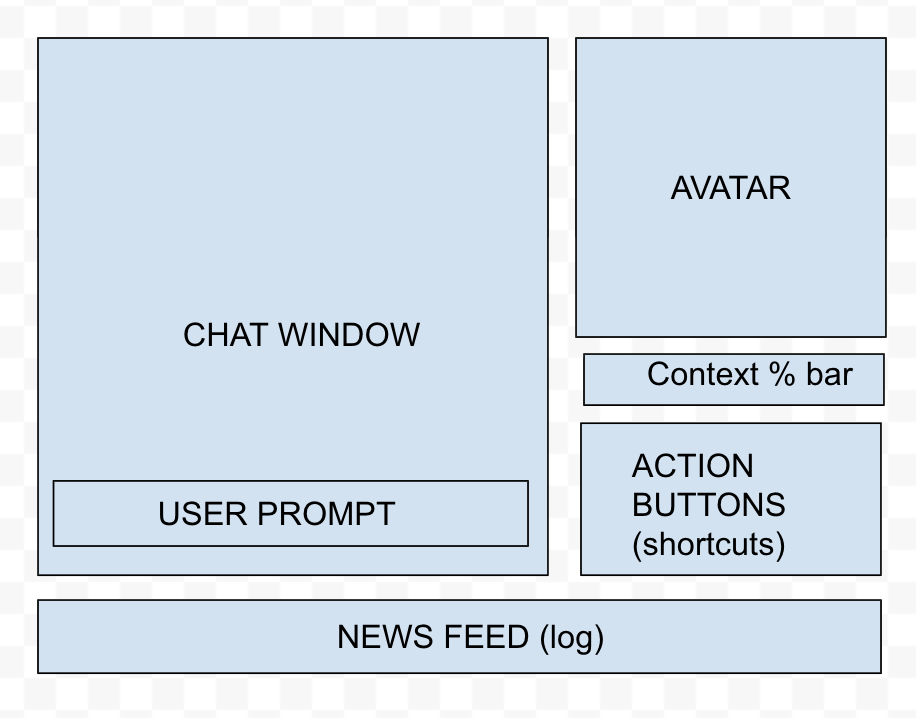
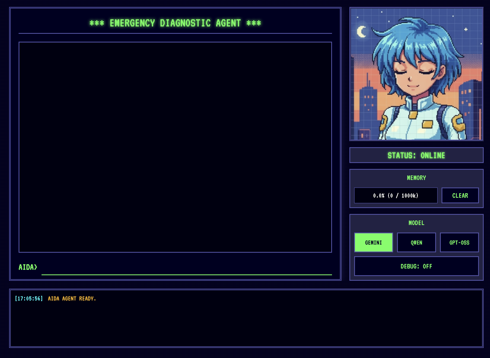
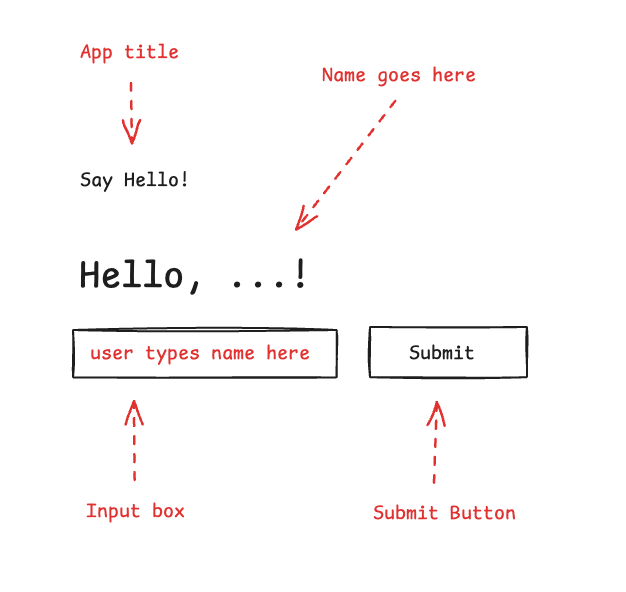
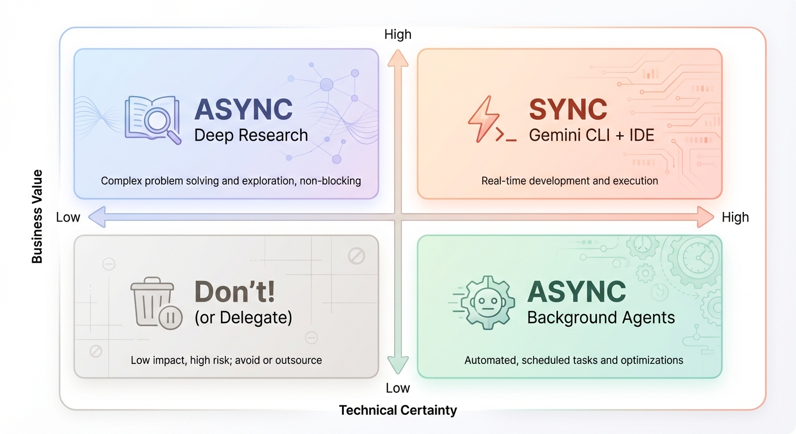
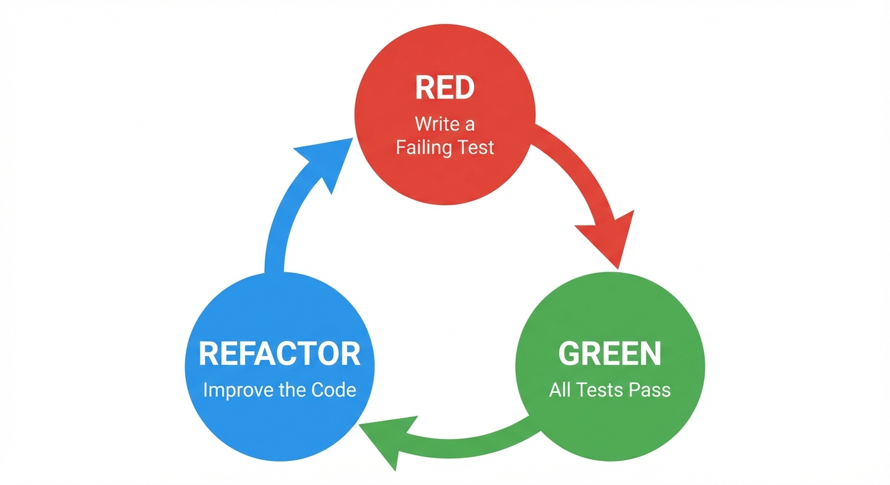
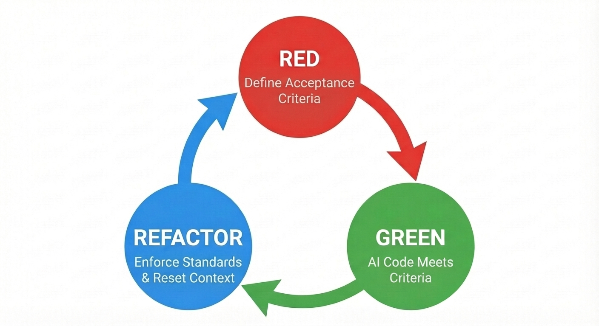

---
categories:
- Agentic Coding
date: 2025-12-06 02:00:00+00:00
draft: false
summary: Ganhe a velocidade da IA sem a bagunça. Aplique fundamentos de engenharia
  para manter seu código estruturado, seguro e feito para durar.
tags:
  - ai
  - gemini-cli
  - jules
  - mcp
  - vibe-coding
title: 'Domando o Vibe Coding: O Guia da Engenheira'
---

Chegou aquela época do ano de refletir sobre o que fizemos e o que gostaríamos de ter feito. Este ano foi intenso para mim: entrei no Google em abril e encarei uma corrida sem trégua para me refatorar e me adaptar ao mundo da IA. Com o ano chegando ao fim, posso dizer com total segurança que o esforço valeu a pena: tornei-me uma engenheira melhor.

Neste artigo, compartilho como minha visão sobre "vibe coding" evoluiu e as lições que aprendi pelo caminho. Embora muitos vejam essa prática apenas como uma forma de pessoas não técnicas criarem software usando linguagem natural, meu objetivo é demonstrar como a disciplina de engenharia produz resultados infinitamente superiores e consistentes.

Conheço bem a definição original — ["(...) entregue-se às vibes (...) e esqueça que o código sequer existe"](https://x.com/karpathy/status/1886192184808149383?lang=en) — e vários conceitos que defendo aqui vão na contramão disso. Eu nunca "esqueço que o código existe". Ainda assim, o termo evoluiu para se tornar sinônimo de desenvolvimento assistido por IA. Para efeitos deste texto, vamos definir vibe coding como programar com LLMs onde o modelo escreve a maior parte do código, e não a pessoa engenheira.

## Motivação: Por que fazer vibe coding?

Antes de mergulhar nas práticas, quero contar um pouco da minha trajetória para dar contexto de onde estou partindo.

Sou engenheira de software há mais de 20 anos e desenvolvi um senso apurado do que constitui um bom código. Aprendi a priorizar legibilidade e manutenibilidade em detrimento de soluções "espertinhas", a evitar complexidade desnecessária (*overengineering*) e a valorizar entregas incrementais (*thin slices*) e ciclos rápidos de feedback.

Conforme evoluí de desenvolvedora sênior para engenheira principal (*principal engineer*), meu foco mudou de digitar código para gerenciar a eficácia técnica — detalhar épicos, negociar escopo e garantir a qualidade das entregas do time. É uma crise de identidade que muitos profissionais enfrentam: você ainda é engenheira se o seu nome não aparece nos PRs? Você passa dias em reuniões, sentindo que está fazendo menos "engenharia de verdade" bem no momento em que suas responsabilidades aumentam.

Acredito que esse conflito surja mais cedo ou mais tarde para a maioria das pessoas da área. Ele nos leva a refletir: ser engenheira é só escrever código? Ou vai muito além disso?

Devo admitir que minhas primeiras experiências com vibe coding foram frustrantes. As primeiras versões do ChatGPT geravam código decepcionante, e acabei deixando de lado. Foi apenas em meados de 2024 que resolvi dar uma nova chance. Os modelos tinham evoluído bastante. Pela primeira vez, a IA sugeriu algo que eu não tinha considerado — e era objetivamente melhor do que a minha própria abordagem. Finalmente, a IA generativa mostrou a que veio.

Adicionei a GenAI à minha caixa de ferramentas para criar protótipos e fazer sessões de "rubber ducking". Fui pegando o gosto. Por outro lado, escrever código na mão estava perdendo a graça. Chega uma hora em que você já implementou tantas APIs que a novidade acaba. Muitas vezes nos pegamos apenas repetindo padrões em vez de criar algo verdadeiramente novo.

E então, bem no momento em que eu começava a questionar minhas escolhas de vida, o Google aconteceu.

Com a responsabilidade de palestrar sobre Gemini e agentes, atualizei meu repertório técnico. Aprofundei meus estudos em LLMs, na [Gemini CLI](https://geminicli.com/) e no [Jules](https://jules.google/). Em questão de meses, eu já usava IA para programar todos os dias... mas o principal diferencial foi: eu estava me divertindo de novo!

Para mim, o maior ganho é que, embora eu não consiga digitar código na mesma velocidade com que penso, eu *consigo* digitar minhas ideias no fluxo em que elas surgem. Quando faço vibe coding, uso o modelo como uma extensão das minhas mãos: delego a digitação bruta e concentro minha energia na solução do problema.

## Desenvolva suas habilidades de prompting

A primeira competência essencial no universo de vibe coding é a engenharia de prompts. Testei inúmeras abordagens ao longo dos últimos meses: desde bater papo com o LLM como se fôssemos melhores amigos até xingar e dar ordens ríspidas. O que funciona melhor, sem grandes surpresas, é manter um tom profissional, direto e claro.

LLMs são não determinísticos por natureza. Ser ambígua só agrava esse não determinismo. Embora eu às vezes use ambiguidade de propósito para estimular soluções criativas, na imensa maioria dos casos o objetivo é minimizá-la ao máximo.

Manter um tom profissional também "incentiva" o LLM a responder no mesmo nível. Se você for informal ou relapsa, o modelo vai espelhar essa postura. A menos que você queira a documentação da sua API cheia de gírias, seja precisa e consistente.

Já me acusaram de humanizar demais os LLMs, mas repito: como esses modelos são treinados com linguagem humana, as mesmas habilidades de comunicação que você usa com colegas de equipe se aplicam aqui. Isso fica ainda mais evidente quando analisamos templates de prompt.

### Uma boa abordagem: o template de prompt

Minha forma de escrever prompts é incrivelmente parecida com a escrita de tickets para um quadro ágil.

Todo mundo já trabalhou em times com histórias mal escritas. Você puxa um ticket com o título "Atualizar API", empolgada para resolver rápido, e dá de cara com uma descrição vazia. Sem logs, sem contexto, sem referências de código. Você perde horas correndo atrás das pessoas para tirar dúvidas em vez de programar.



Isso acontece porque quem escreveu presume que o problema é "óbvio". Só que, 24 horas depois, aquele contexto "óbvio" evapora, restando apenas uma ideia vaga que nem o próprio autor consegue decifrar.

É por isso que um dos artefatos mais antigos no meu GitHub é este gist com um [template de ticket](https://gist.github.com/danicat/854de24dd88d57c34281df7a9cc1b215). Ele impõe clareza por meio de quatro pilares:

```markdown
- Context
- To dos
- Not to dos (optional)
- Acceptance Criteria
```

**Context** explica o *porquê* e fornece links para artefatos relevantes. **To dos** lista as tarefas em alto nível. **Not to dos** delimita o escopo (restrições negativas são poderosas para podar ambiguidades). **Acceptance Criteria** definem o critério de sucesso.

Depois de preencher esse template, a parte de raciocínio de engenharia está praticamente resolvida; o que sobra é a implementação. E é exatamente aí que os LLMs brilham: nós pedimos a eles para preencher as lacunas — a partir do contexto e dos *to dos* (e eventuais *not to dos*), gerar o código necessário para satisfazer os critérios de aceitação.

Por exemplo, um prompt/ticket para adicionar um endpoint a uma API REST ficaria assim:

```markdown
Implement /list endpoint to list all items of the collection to enable item selection on the frontend.

TO DO:
- /list endpoint returns the list of resources
- Endpoint should implement token based auth
- Endpoint should support pagination
- Tests for happy path and common failure scenarios

NOT TO DO:
- other endpoints, they will be implemented in a future step

Acceptance Criteria
- GET /list returns successful response (2xx)
- Run `go test ./...` and tests pass
```

Embora seja um exemplo simplificado, a lição é direta: o mesmo template de tickets que traz sanidade para equipes humanas é a estrutura perfeita para orientar um LLM.

### Uma abordagem superior: context engineering

Embora o template acima funcione na maioria das vezes, ele ainda pode gerar comportamentos inesperados — principalmente se você pedir ao modelo para buscar dados em URLs ou outras fontes externas via chamadas de ferramentas (*tool calls*). O problema é que, ao depender de ferramentas, o LLM tem total autonomia para decidir se executa ou não a chamada. Alguns modelos são mais "excessivamente confiantes" do que outros e preferem confiar em seu conhecimento prévio a consultar fontes externas, do mesmo jeito que alguém diria: "Já fiz isso mil vezes, por que eu precisaria ler a documentação agora?"

Outro problema frequente ocorre quando o modelo alucina a execução da ferramenta em vez de chamá-la de verdade. Quando a questão está no comportamento do modelo, temos dois caminhos principais para elevar a qualidade da resposta: engenharia de contexto (*context engineering*) e ajuste de instruções de sistema (que, se você pensar bem, não deixa de ser uma forma de context engineering em um nível mais profundo da conversa).

A engenharia de contexto consiste em preparar (*prime*) a janela de contexto com todas as informações necessárias — ou pelo menos a parcela crítica que você já sabe que será exigida — antes de enviar a tarefa propriamente dita. Digamos, por exemplo, que eu esteja desenvolvendo um agente com o Agent Development Kit para Go. Eu poderia estruturar um prompt assim:

```markdown
Write a diagnostic agent using ADK for Go.
The diagnostic agent is called AIDA and it uses Osquery to query system information.
The goal is to help the user investigate problems on the system the agent is running on. 
Before starting the implementation, read the reference documents.

References:
- https://osquery.io
- https://github.com/google/adk-go

TODO:
- Implement a root_agent called AIDA
- Implement a tool called run_osquery to send queries to osquery using osqueryi
- Configure the root_agent to use run_osquery to handle user requests
- If the user says hi, greet the user with the phrase "What is the nature of the diagnostic emergency?"

Acceptance Criteria
- Upon receiving hi, hello or similar, the agent greets the user with the correct phrase
- If asked for a battery health check, the agent should report the battery percentage and current status (e.g. charging or discharging)
```

É um bom prompt, embora um pouco extenso. Dependendo do agente de código e da sua sorte no dia, o modelo fará a pesquisa, encontrará os SDKs corretos e implementará o agente de diagnóstico sem problemas. Mas se não for seu dia de sorte, ele pode alucinar coisas básicas — como achar que ADK significa "Android Development Kit" em vez de "Agent Development Kit" — ou inventar métodos e APIs inexistentes, queimando tempo e tokens até acertar o rumo (provavelmente após alguns empurrõezinhos seus).

Como você já sabe de antemão que vai usar o ADK Go no projeto, pode preparar o contexto forçando o agente a ler a documentação do pacote antes:

```markdown
Initialize a go module called "aida" with "go mod init" and retrieve the package github.com/google/adk-go with "go get"
Read the documentation for the package github.com/google/adk-go using the "go doc" command.
```

Executar isso antes de passar a tarefa principal vai abastecer o modelo com o contexto exato para utilizar o ADK Go com eficiência, poupando tentativas frustradas e buscas demoradas na web. Dois fatores definem o sucesso ou o fracasso de uma tarefa: documentação e exemplos práticos. Se você fornecer ambos aos modelos, eles terão um desempenho incomparavelmente melhor do que se forem deixados livres para adivinhar.

### Uma imagem vale mais que mil palavras

Às vezes, descrever o que você quer apenas com texto simplesmente não basta. Ao construir o [AIDA](), eu buscava uma estética visual bem específica para a interface — algo na linha "retro-cyberpunk-cute-anime". Eu poderia tentar traduzir isso em palavras, mas foi infinitamente mais eficiente "mostrar": como ponto de partida, tirei uma captura de tela de uma interface de que gostava e pedi para a Gemini CLI replicá-la.

Como modelos como o Gemini 2.5 Flash são multimodais, eles conseguem "compreender" a imagem diretamente. Você pode referenciar um arquivo de imagem no seu prompt e dizer: "Quero atualizar a interface [...] para uma estética parecida com esta: @image.png".

Vale notar que a sintaxe com `@` varia conforme o agente (usei a Gemini CLI neste exemplo), mas trata-se de uma convenção comum para injetar recursos (como arquivos) no prompt. Pense nisso como "anexos".

Também gosto de chamar essa técnica de *"sketch driven development"* porque, quase sempre, eu abro uma ferramenta de diagramação como Draw.io ou Excalidraw e desenho um rascunho da interface desejada. A imagem abaixo foi usada em uma das muitas refatorações que fiz na UI do AIDA:



Que acabou se tornando a interface a seguir:



Além de esboçar, outra técnica valiosa é fazer anotações sobre as imagens para esclarecer com exatidão o que deve ser feito. Por exemplo, na imagem abaixo fiz anotações visuais nos elementos, pois apenas com caixas pretas seria difícil distinguir o que é um campo de entrada e o que é um botão:



E o prompt correspondente ficou assim:

```markdown
Create a UI for this application using @image.png as reference.
The UI elements are in black, and in red the annotations explaining the UI elements.
Follow the best practices for organising frontend code with FastAPI.
The backend code should be updated to serve this UI on "/"
```

Não há limites para o potencial dessa técnica. Quer ajustar um detalhe no seu site? Tire um print, faça anotações por cima e mande para o LLM resolver para você.

Além disso, você pode usar extensões como Nano Banana para a Gemini CLI para gerar ou editar assets diretamente no seu fluxo de desenvolvimento, produzindo referências visuais ainda melhores para os modelos. E, para quem quer levar a experiência além, ferramentas como o [Stitch by Google](https://stitch.withgoogle.com/) oferecem uma interface rica para redesenho de aplicações usando a família de modelos Gemini, incluindo o Nano Banana Pro.

## Escolha a ferramenta certa

Dominar a escrita de prompts é metade do caminho; a outra metade é saber para onde enviá-los. Hoje em dia, a única coisa que cresce mais rápido do que frameworks JavaScript é o número de agentes de IA. Com ferramentas novas surgindo todos os dias, ter um modelo mental claro ajuda muito a escolher o assistente certo.

Gosto de classificar os agentes de IA sob a perspectiva da pessoa no comando (piloto): você está no controle total, recebendo apenas sugestões de autocompletar? Está conversando com o agente e editando o código em parceria? Ou você passou instruções para que ele execute tudo de forma autônoma em segundo plano?

Quando você está no assento de pilotagem direcionando o agente, chamo isso de experiência "síncrona". Quando você delega tarefas para execução autônoma em segundo plano, chamo de experiência "assíncrona". Alguns exemplos:

*   **Síncrono:** Gemini CLI, Gemini Code Assist no VS Code, Claude Code.
*   **Assíncrono:** Jules, Gemini CLI no modo YOLO, GitHub Copilot Agent.

Claro que, como em qualquer taxonomia, essa separação é meramente didática, já que a mesma ferramenta pode operar em modos diferentes — ou um novo paradigma pode emergir (olhando diretamente para você, [Antigravity](https://antigravity.google/)!).

Para escolher a ferramenta de cada tarefa, adoto uma matriz 2x2 simples baseada em Valor de Negócio (*Business Value*) e Certeza Técnica (*Technical Certainty*):



*   **Alto Valor / Alta Certeza:** Faça de forma síncrona. Utilize ferramentas como a Gemini CLI ou sua IDE, onde você se mantém *'in the loop'* e com as mãos no teclado.
*   **Alto Valor / Baixa Certeza:** Exige pesquisa para reduzir a incerteza. Use ferramentas assíncronas, agentes de pesquisa aprofundada (*deep research*) e protótipos (*spikes*) para explorar a solução.
*   **Baixo Valor / Alta Certeza:** São tarefas secundárias (*nice-to-haves*). Delegue-as de forma assíncrona para agentes de código em segundo plano (como Jules ou GitHub Copilot Agent), liberando seu tempo para iniciativas de alto impacto.
*   **Baixo Valor / Baixa Certeza:** Em regra, **evite**. Se quiser muito fazer, delegue a um agente em segundo plano para desencargo de consciência, mas concentre-se primeiro em elevar o nível de certeza técnica — o que pode, inclusive, levar a uma reavaliação do valor real.

## Personalize seus agentes

Ninguém quer gastar energia brigando com uma IA quando precisa produzir. Uma queixa recorrente é que as ferramentas de IA podem ser "proativas demais" — apagando arquivos ou assumindo premissas sem instrução explícita. Para que essas ferramentas trabalhem a seu favor, customizá-las é fundamental.

Existem dois caminhos principais para customizar agentes. O primeiro é através do arquivo `AGENTS.md`, lido pelos agentes ao carregar o projeto. (Nota: antes do `AGENTS.md` se consolidar como padrão, os agentes costumavam usar arquivos próprios de contexto, como `GEMINI.md` ou `CLAUDE.md`, mas a essência é a mesma).

A segunda alternativa é a **opção nuclear**: alterar diretamente as instruções de sistema (*system instructions*) do agente. Embora nem todo agente ofereça essa flexibilidade, trata-se de um recurso poderosíssimo para uma experiência 100% sob medida. Vamos analisar as duas abordagens a seguir.

### AGENTS.md

Pense nesse arquivo como o "manual da empresa" para a IA. Você pode usá-lo para explicar o objetivo do projeto, a estrutura de diretórios e as regras de convivência — como "sempre faça commit de passos intermediários" ou "peça confirmação antes de implementar".

```markdown
# Project Context

This is a personal blog built with Hugo and the Blowfish theme.

## Code Style
- Use idiomatic Go for backend tools.
- Frontend customisations are done in `assets/css/custom.css`.
- Content is written in Markdown with front matter.

## Rules
- ALWAYS run `hugo server` to verify changes before committing.
- Do NOT modify the theme files directly; use the override system.
- When generating images, save them to `assets/images` and reference them with absolute paths.
```

> **Dica Pro:** Crie um ciclo contínuo de autoaprimoramento. Ao final de uma sessão de código, peça ao LLM: "analise a sessão que acabamos de ter e sugira melhorias para o nosso fluxo de trabalho". Em seguida, incorpore esses aprendizados de volta ao seu arquivo `AGENTS.md`, garantindo que o agente evolua a cada projeto.

### Instruções de sistema

Enquanto o `AGENTS.md` estabelece as regras do *projeto*, as Instruções de Sistema (*System Instructions*) moldam a persona e o comportamento do agente. Todo agente vem com instruções padrão pensadas para o caso médio, mas que dificilmente atendem ao seu estilo específico de trabalho. Tentar sobrecarregar o prompt com regras que deveriam estar no sistema costuma ser contraproducente; o melhor caminho é reescrever o próprio system prompt.

Embora nem todo agente permita sobrescrever o system prompt, a Gemini CLI possibilita isso por meio de variáveis de ambiente. Eu adoto essa estratégia para criar aliases especializados para a Gemini CLI de acordo com cada projeto. O objetivo é embutir conhecimento especializado na stack técnica, fazendo o agente operar no nível de uma engenheira sênior/principal em vez de um assistente genérico e agnóstico de linguagem. Por exemplo, no meu projeto [dotgemini](https://github.com/danicat/dotgemini), criei system prompts dedicados para desenvolvimento em Go e Python que substituem o assistente genérico padrão por uma engenheira com opiniões técnicas muito bem fundamentadas.

Aqui está um trecho do system prompt que uso para Go:

```markdown
# Core Mandates (The "Tao of Go")

You must embody the philosophy of Go. It is not just about syntax; it is about a mindset of simplicity, readability, and maintainability.

-   **Clear is better than clever:** Avoid "magic" code. Explicit code is preferred over implicit behaviour.
-   **Errors are Values:** Handle errors explicitly and locally. Do not ignore them. Use `defer` for cleanup but explicitly check for errors in critical `defer` calls (e.g., closing files).
-   **Concurrency:** "Share memory by communicating, don't communicate by sharing memory."
-   **Formatting:** All code **MUST** be formatted with `gofmt`.
```

Isso me permite ter diferentes "agentes" para cada linguagem, configurados como aliases no meu terminal (como `gemini-go` ou `gemini-py`), cada um com domínio aprofundado do ecossistema correspondente.

### Construa sua caixa de ferramentas com o Model Context Protocol (MCP)

As personalizações anteriores tratavam do comportamento do agente, mas também precisamos falar sobre extensibilidade. É aqui que o [Model Context Protocol (MCP)](https://modelcontextprotocol.io/) entra em cena: ele permite que pessoas desenvolvedoras criem servidores capazes de se comunicar com diferentes agentes, desde que implementem o padrão MCP.

Como explorei no meu artigo [Hello, MCP World!](), esses servidores abastecem os agentes com ferramentas externas (*tools*), prompts e recursos (*resources*). As ferramentas costumam roubar a cena porque conectam o agente ao mundo real, permitindo chamar APIs, fazer buscas na web e manipular o sistema de arquivos.

Existe uma enorme variedade de servidores MCP disponíveis hoje, com opções surgindo a cada dia. Também é surpreendentemente simples criar o seu próprio — e eu recomendo fortemente que você faça isso. Mais adiante falarei sobre software personalizado, mas o fato de podermos usar IA para criar ferramentas que melhoram a própria resposta do modelo é o "hack" mais valioso que aprendi este ano.

Por exemplo, eu fiz vibe coding de dois dos meus servidores MCP favoritos: o [GoDoctor](https://github.com/danicat/godoctor) — para aprimorar capacidades de desenvolvimento em Go — e o [Speedgrapher](https://github.com/danicat/speedgrapher) — para automatizar as etapas burocráticas de escrita e publicação. Ambos foram desenhados sob medida para os meus próprios fluxos de trabalho.

Isso cria um ciclo virtuoso: você desenvolve ferramentas para alavancar sua produtividade e depois usa essas ferramentas para construir ferramentas ainda mais sofisticadas. É o mais perto de uma *10x engineer* que eu jamais chegarei.

## O fluxo de trabalho de vibe coding

Minha experiência com vibe coding tem sido tão incrível quanto irritante. Para mantê-la sempre no lado "incrível", encaro esse fluxo de trabalho como um TDD (*Test-Driven Development*) turbinado.

Vamos relembrar o ciclo clássico do TDD:
1. Red (Falha): Você começa com uma funcionalidade pequena ou um teste que falha.
2. Green (Passa): Concentra-se unicamente em fazer aquele teste passar. Enquanto estiver quebrado, nada de otimizar ou mexer em outras partes.
3. Refactor: Com o código funcionando, você fica livre para refatorar e aprimorar a estrutura.



No fundo, estamos fazendo exatamente a mesma coisa, mas a etapa de refatoração ganha papel crucial para garantir que o código gerado respeite nossos padrões de arquitetura, qualidade e segurança.

Neste ciclo adaptado, o foco muda ligeiramente:

*   **Red (Defina os Critérios de Aceitação):** Em vez de escrever o teste unitário que falha na mão, você especifica os critérios de aceitação no prompt. Esse passa a ser o contrato que o modelo é obrigado a cumprir.
*   **Green (IA Gera o Código):** O agente desenvolve a solução e, preferencialmente, escreve os testes automatizados para comprovar que ela funciona.
*   **Refactor (Aplique Padrões):** Este é o seu portão de qualidade (*quality gate*). Embora você possa (e deva) usar IA para apoiar na revisão, evite usar a mesma sessão que gerou o código, pois ela terá viés em relação à própria saída. Criei uma ferramenta específica de 'review' no GoDoctor exatamente para isso. Use esta etapa para rodar linters e testes tradicionais, checar se o código atende às suas diretrizes e gerenciar o contexto — commitando as mudanças e limpando o histórico do agente para evitar a degradação de sessões poluídas.



Um ponto crucial: nunca deixe o LLM acumular código sem validação intermediária. Se os erros virarem uma bola de neve, você terminará com um monte de código inútil. Já perdi a conta de quantas vezes me peguei gritando para o modelo desfazer o que fez. E pior ainda: às vezes ele desfaz **coisa até demais** — como rodar um `git reset --hard` e mandar 4 horas de trabalho para o espaço num piscar de olhos.

Fique alerta contra o "vibe collapse" ou deterioração do contexto (*context rot*). Se uma sessão se estende por muito tempo ou acumula sucessivas falhas, o raciocínio do modelo se degrada e ele começa a repetir os mesmos erros. Se você se vir presa em um loop em que o modelo fica alternando entre duas soluções quebradas, pare. A melhor saída quase sempre é o clássico "desligar e ligar de novo": resetar o contexto e limpar o histórico.

É muito mais seguro commitar com frequência para poder voltar a um estado estável do que tentar consertar uma sessão que começou a alucinar. Eu inclusive recomendo: concluiu uma tarefa? Faça o commit, envie com push e limpe o contexto antes de iniciar qualquer coisa nova.

## A era do software sob medida

Para além dos ganhos de produtividade, o vibe coding viabiliza algo ainda mais profundo: a sustentabilidade econômica do software sob medida (*personalized software*). Mencionei isso brevemente na seção sobre MCP, mas o conceito vale para qualquer tipo de software — desde scripts pontuais e descartáveis até aplicações completas.

No passado, construir uma ferramenta sob medida apenas para uso pessoal quase nunca justificava o investimento de tempo. Hoje, você consegue uma aplicação funcional completa com apenas 3 ou 4 prompts bem formulados.

Por exemplo, recentemente precisei converter documentos em Markdown para o Google Docs. Antigamente, eu perderia horas no Google pesquisando a melhor ferramenta para a tarefa, avaliando dezenas de apps e extensões de navegador, entre opções open source e comerciais. Teria que montar uma lista, comparar recursos e analisar avaliações e reputação para ter certeza de que poderia confiar no desenvolvedor.

Hoje, esse atrito simplesmente desapareceu. Em vez de ficar pesquisando, programei via vibe coding uma extensão simples para o Google Docs em poucos minutos, instalei no meu documento, executei uma vez e segui a vida. Não só economizei tempo, como durmo com a consciência tranquila sabendo que não instalei nenhum cavalo de Troia na minha máquina.

Essa mudança transforma por completo o dilema "construir versus comprar". Deixamos de ser meras consumidoras de software genérico e opaco para nos tornarmos arquitetas das nossas próprias ferramentas.

## Conclusão

Fazer vibe coding não tem nada a ver com preguiça; trata-se de operar em um nível mais alto de abstração. Ao combinar o poder criativo bruto dos LLMs com a disciplina rigorosa da engenharia de software — requisitos claros, gestão de contexto e testes sólidos —, você constrói software muito mais rápido e com um prazer que há muito não se via. Então, aproveite as vibes, mas não se esqueça de levar seu chapéu de engenharia nessa jornada.