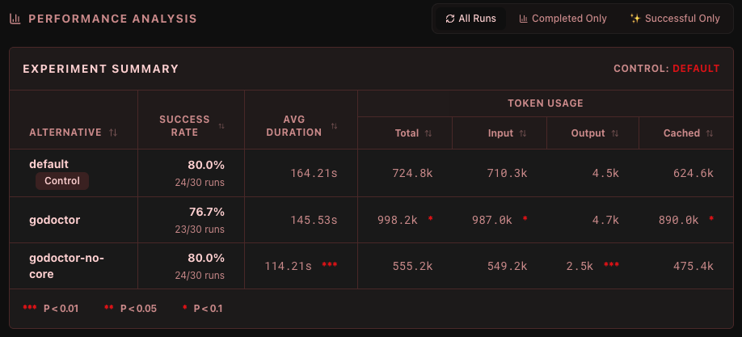

ソフトウェア開発における[決定論から非決定論への移行](https://newsletter.pragmaticengineer.com/p/martin-fowler)は、現在、私たちが業界として直面している最大の課題の一つです。

誰もが経験したことがあるでしょう。AIエージェントを使っていて、「システムプロンプトにこれを追加したらどうなるだろう？」とか「この新しいMCPツールへのアクセスを許可してみようか？」と考える。

変更を加えて一度実行してみると、うまくいった。大成功だ！自分は天才だと感じ、同僚、フォロワー、おばあちゃん、そして飼い猫にまでその喜びを共有する。しかし、1時間後、全く同じタスクで再度実行すると、無残にも失敗する。その変更は本当に良かったのでしょうか、それとも最初の実行で運が良かっただけなのでしょうか？「今回はやり方が良くなかったのかもしれない…」——電源を入れ直し、もう一度試すとうまくいった。……本当にそうでしょうか？

事実は、LLMの仕組みには固有のランダム性があるだけでなく、これらの結果に寄与する多くの交絡因子（ confounding factors）が存在するということです。

私たちはあまりにも長い間、決定論的な世界に生きてきた（本当にそうでしょうか？）ため、私たちソフトウェアエンジニアはこのレベルの不確実性に対処する心の準備ができていません。私たちは、コンピューティングが最初から教えられてきた通り、[精密科学（exact science）](https://ja.wikipedia.org/wiki/%E7%B2%BE%E5%AF%86%E7%A7%91%E5%AD%A6)であることを期待しているのです。

## バイブ対科学

私は[規律あるバイブ・コーディング（vibe coding with discipline）]()についてよく話します。言い換えれば、高品質な結果を得るためには、バイブ・コーディングに手法（メソドロジー）を加えることが不可欠であるということです。これは新しい問題ではありません。私たちは何十年もの間、ソフトウェアの品質問題に対処してきましたが、参入障壁が下がり、コード生成のスピードが上がったことで、この問題は新たな桁違いの重要性を持つようになりました。

人間のチームがより良い成果を出せるように設計された古い手法が、AIエージェントのガードレールとして非常にうまく機能することを「発見」するたびに、私はいつも驚かされます。しかし、実際には誰も驚くべきではありません。結局のところ、人間も本質的に非決定論的な存在なのです。AIは、すでによく知られているいくつかのパターンを増幅しているに過ぎません。

それらの原則に基づいたかなりまともなワークフローを考案することはできましたが、「これが正しいやり方だ」と言い切れるレベルの自信には至りませんでした。それは、時折発生する失敗やデグレードが私の自信を削ぐからです。「この `GEMINI.md` は本当に Go 開発者にとって究極のプロンプトなのだろうか？」「このタスクに対して最善のシステム指示を実現できたのか？」「私の MCP ツールは考案しうる最高の API なのか？」——毎日、あまりにも多くの疑問に押しつぶされそうになり、昨年公開したコンテンツのほとんどについては、断定的な表現を避け、すべてを**ケーススタディ**（「これを行ったところ、あれが起きた」というだけの話）として位置づけてきました。科学文献において、ケーススタディは[エビデンスレベルが最も低い](https://ja.wikipedia.org/wiki/%E6%A0%B9%E拠%E3%81%AB%E5%9F%BA%E3%81%A5%E3%81%8F%E5%8C%BB%E7%99%82)ものの一つです。

これは技術ブログで見かける典型的な議論ではないことは承知しています。ここで少し寄り道をして、私の前世の話をさせてください。ソフトウェアエンジニアのキャリアに落ち着く前、私は医学部に通っていました（卒業はしていませんが、それはまた別の機会に）。医学や生物学の他の分野では、未知の起源を持つシステムから「真実」を抽出する必要があるため（基本的には世界をリバースエンジニアリングしているのです。なんとクールなことでしょう！）、人々は実験や、バイアス、ノイズ、ランダム性への対処にはるかに慣れています。研究データをそのまま提示するだけでは不十分です。潜在的な汚染を確実に取り除くために、統計的に検証する必要があります。サンプルサイズ、アルファ、p値、Studentのt検定……試験のためにこれらの用語を暗記しなければならなかった時は大嫌いでしたが、今日これほど役立つことになるとは思いもしませんでした。

もちろん、これは生物学に限ったことではありません。エンジニアリングにおいても、研究を行う際に統計的手法を適用することはよくありますが、私たちの分野では他の分野ほど普及していないように感じます。例えば、レコメンデーションシステムに従事していた時、機械学習アルゴリズムを最適化するためにA/Bテストは不可欠な業務でした。UXリサーチャーも、どのインターフェースが優れているかを判断するために広範なA/Bテストを行っています。

コーディングエージェントの実験から推測（guesswork）を排除する方法を見つけたいと考え、データを収集して統計分析を行う実験フレームワークを作成することが最善の策であると気づきました。これにより、「うまくいっていると思う」から「（95%の確信を持って）うまくいっていると**知っている**」へと進化できるのです。

## Tenkai（展開）の紹介：エージェント実験フレームワーク

これを解決するために、私は**Tenkai（展開）**を構築しました。これは、コーディングエージェントのさまざまな設定を統計的な厳密さで評価・テストするために設計された、Goベースのフレームワークです。

これをAIエージェントのための実験室だと考えてください。プロンプトを一度実行して最善を祈るのではなく、Tenkaiでは、同じタスクを何度も（サンプルサイズであるN回まで）繰り返し実行し、代替案（異なる設定のセット）を統計前回のテストを用いて互いに比較する実験を行うことができます。

例えば、代替案Aをデフォルトの設定（実験の「コントロール（比較基準）」）とし、代替案Bを試してみたい新しいシステムプロンプトとします。実験では両方をN回実行し、Bの方が有意に速いか、効率的か、あるいは正確かを示すレポートを出力します。その差が偶然やノイズによるものである場合、フレームワークはそれを有意とは見なさず、結果を安心して無視することができます。

### 仕組み

Tenkaiのワークフロー：

1.  **シナリオを定義する:** シナリオは標準化されたコーディングタスクです（例：「このGoパッケージのバグを修正する」「新しいReactコンポーネントを実装する」）。これには、「コンパイルできるか？」「テストに合格するか？」といった検証ルールが含まれます。シナリオが成功したと見なされるには、指定したすべての検証基準に合格する必要があります。

2.  **テンプレートを作成する:** 何をテストしたいかを定義します。例えば、「代替案A（コントロール）」をGemini 2.5 Flashモデルとし、「代替案B」をMCPサーバーを設定したGemini 2.5 Flashとすることができます。同じ実験テンプレート内に最大10個の代替案を設定でき、それらはすべてコントロールと比較されます。

3.  **実験を実行する:** Tenkaiは、各代替案に対して各シナリオを複数回実行します。実行は一時的なワークスペースで隔離され、タイムアウトが管理され、ツール呼び出しからシェル出力までのあらゆるイベントが記録されます。また、並列度を指定してタスクを並列に実行し、実験結果を長時間待たずに済むようにすることも可能です。

### 統計的厳密さ（科学の部分）

これらは現在フレームワークに組み込まれている統計的テストです：

*   **ウェルチのt検定（Welch's t-test）**: 実行時間、トークン使用量、リンターの問題数などの連続的な指標に使用されます。標準のt検定ではなくウェルチのt検定を使用するのは、グループ間の分散が等しいことを前提としないためです。これは、パフォーマンスプロファイルが大きく異なる可能性のあるモデルを比較する際に不可欠です。
*   **フィッシャーの直接確率検定（Fisher's Exact Test）**: 成功率に使用されます。10回や20回といった少数のサンプルサイズで作業する場合、標準のカイ二乗検定は不正確になる可能性があります。フィッシャーの検定は、80%の成功率が60%よりも本当に優れているのか、それとも単なる幸運の連続なのかを判断するための信頼できるp値を与えてくれます。
*   **マン・ホイットニーのU検定（Mann-Whitney U Test）**: これらは私たちの非媒介的な「主役」です。成功した実行と失敗した実行の間でツール呼び出しの「分布」を比較するために使用します。ツール呼び出し回数は正規分布に従わない（ゼロが多い！）ため、マン・ホイットニーのU検定は、特定のツールが「勝利した」実行において有意に多く使用されているかどうかを特定するのに役立ちます。
*   **スピアマンの順位相関係数（Spearman's Rho）**: これを使用して「成功の決定要因」を特定します。特定のツール呼び出しと、実行時間やトークンなどの指標との間の相関を計算することで、Tenkaiは新しいMCPツールが実際に**成功の原動力（Success Driver）**なのか、それともコストを膨らませるだけの邪魔者なのかを教えてくれます。

## リアルタイムの洞察とダッシュボード

実験が実行される様子を見ながら、エージェントの思考プロセスを観察し、どのツールを呼び出しているかを確認し、どこで詰まっているかを特定できます。これは、数十の同時実行を通じてエージェントの「心の中を覗き込む」ことができるようなものです。

ダッシュボードの最も強力な機能の一つは、3つの異なる「レンズ」を使用して、分析をその場でフィルタリングできることです：

*   **すべての実行（All Runs）**: 生の真実。すべての壊滅的なタイムアウトやシステムエラーを含みます。これは、システム全体の**信頼性**を測る主要な指標です。
*   **完了のみ（Completed Only）**: ターミナル状態（成功または検証失敗）に達した実行をフィルタリングします。外部のタイムアウトによるノイズを取り除き、リンターの問題や実行時間などの**品質**指標を分析する場合に使用します。
*   **成功のみ（Successful Only）**: 「ゴールドスタンダード」ビュー。勝者だけを見ることで、なぜ彼らが成功したのかを推測し始めることができます。ここでは、成功と高い相関があるツールを特定するために、スピアマンの Rho とマン・ホイットニーの U p値を計算します。

## 私自身の実験からの初期結果

私は Tenkai を使用して、[godoctor](https://github.com/danicat/godoctor) を理想的な Go 専用 MCP サーバーへと磨き上げてきました。私の仮説は、モデルに特殊なツールを提供することで、コーディングタスクの実行がより効果的になるというものです。例えば、モデルがクライアントライブラリの API を発見するためにいつドキュメントを読み込むかをモデル自身に判断させるのではなく、モデルが `go get` を呼び出すたびにドキュメントを返すことで、ドキュメントを「強制的に」提供しています。これにより、API の幻覚（hallucination）や、モデルが間違ったバージョンのパッケージを取得したと思い込んで `go get` と `go mod` を繰り返してしまう「依存関係の地獄ループ」を大幅に防ぐことができました。

初期の結果では、モデルのバージョンを最新世代に固定すると、この差が縮まることも示されています。Gemini CLI はデフォルトで「auto」モードで起動し、Gemini 2.5 と Gemini 3（Flash および Pro バージョンの両方）のどちらを呼び出すかを自動的に判断します。バージョンを Gemini 3 Pro（モデルID `gemini-3-pro-preview`）に固定すると、モデルははるかに賢くなり、それらの競合シナリオにおいて（コマンドラインで `go doc` を起動するなどして）自らドキュメントを調達することが多くなり、godoctor のツールセットの影響力は相対的に小さくなります。

また、ツールの採用に関しても多くの課題がありました。モデルはデフォルトで、トレーニングで使用された組み込みツールを好んで使用する傾向が強いです。「より賢い」ツールを提供しても、モデルはコンフォートゾーンから抜け出すのに苦労します。私はこれに関して多くの実験の設計に失敗しましたが、最終的に私の実験プロセスが完全に欠陥していたことに気づきました。**ツールの採用（adoption）**と**ツールの有効性（efficacy）**は直交する概念です。同じ実験で両方をテストしようとしたため、有効な結果を得られなかったのです。そこで、モデルの組み込みツールへのアクセスをブロックすることで、ツールの有効性のみをテストするように方向転換しました。これにより、godoctor ツールの良し悪しについて、ようやくより良いシグナルが得られ始めました。

godoctor がどのように形成されているか、そして現在の API にどのようにたどり着いたかに興味がある方は、[来年2月1日の FOSDEM](https://fosdem.org/2026/schedule/event/3BD3Z9-making_of_godoctor_an_mcp_server_for_go_development/) でお話しします。もちろん、参加できない方もご安心ください。今後数週間かけて、さらに詳しく書いていく予定です。

## 結論

私たちはソフトウェア開発の転換点にいます。すべての行を自分で書く世界から、インテリジェンスを**オーケストレーション（編成）**する世界へと移行しています。

しかし、オーケストレーションには測定が必要です。測定できないものを改善することはできません。コードの書き手からインテリジェンスのオーケストレーターへの転換は、私たちの仕事が減ることを意味するのではなく、**異なる**仕事をすることを意味します。私たちの主な責任はもはや構文（シンタックス）だけではなく、**コンテキスト、ツール、およびガードレール**なのです。

自分たちの変更の影響を厳密に測定しなければ、それはエンジニアリングではなく、単なるギャンブルです。コーディングエージェントに対してエビデンスに基づくアプローチを採用することで、単に「うまくいった時にクール」なだけでなく、ビジネスを構築できるほど信頼性の高いシステムをようやく構築できるようになるのです。

コードを確認したり、自分で実験を実行したりすることに興味がある方は、プロジェクトを[こちら](https://github.com/danicat/tenkai)で見つけることができます。

Happy experimenting! o/

Dani =^.^=