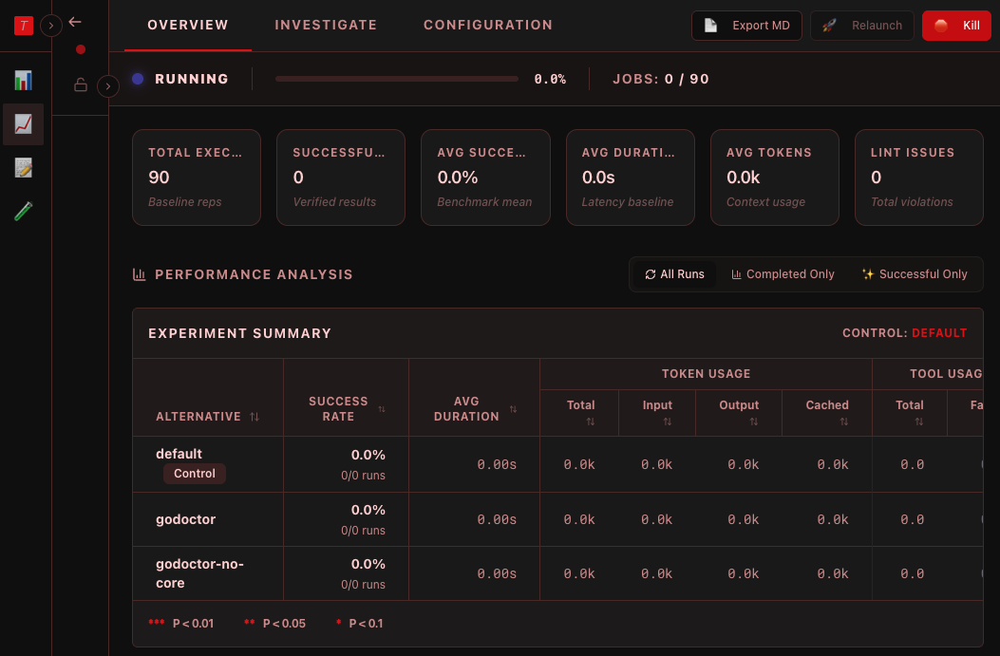
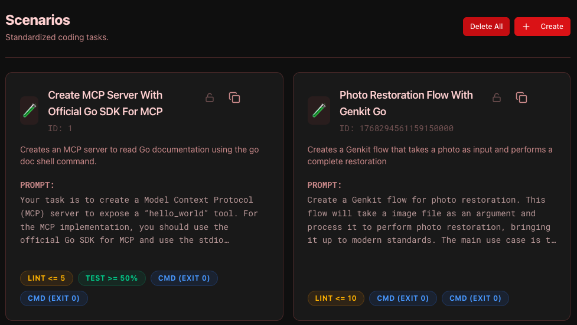
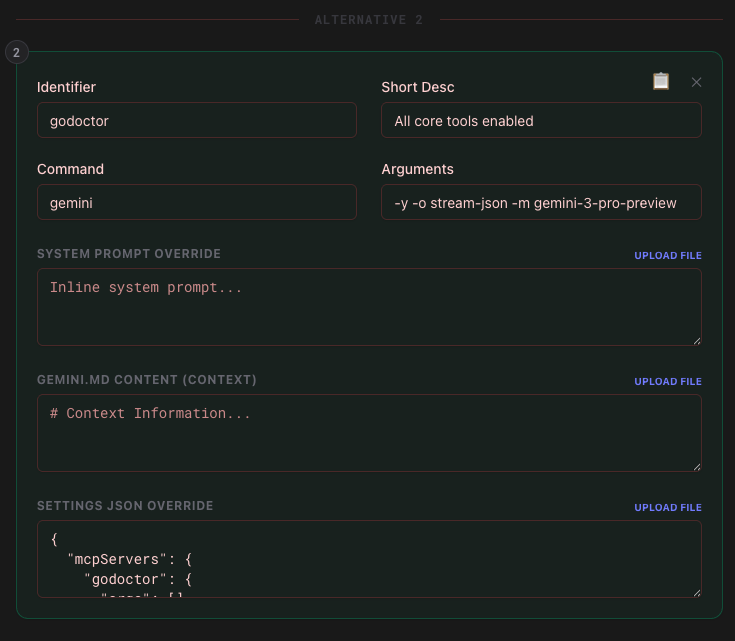
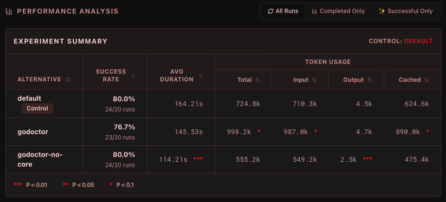

---
categories:
- Agentic Coding
date: 2026-01-21 00:00:00+00:00
draft: false
summary: AIエージェントの制御にはバイブスだけでなく科学が必要です。A/Bテストと統計的厳密さが、コーディングエージェントをどのように測定可能なエンジニアリング規律へと変えるかを解説します。
tags:
  - agents
  - ai
  - gemini-cli
  - golang
  - mcp
  - testing
  - vibe-coding
title: "科学の力を借りてコーディングエージェントを改善する"
slug: "improving-agentic-coding-with-science"
aliases:
  - "/ja/posts/20260120-improving-agentic-coding-with-science/"
description: "Go製フレームワークTenkaiとウェルチのt検定、フィッシャーの正確確率検定、スピアマン相関などの統計的検定を用いて、AIコーディングエージェントの設定を客観的に評価・比較する方法を解説。"
proficiencyLevel: "Intermediate"
dependencies:
  - "Go 1.24+"
  - "Gemini CLI"
  - "Tenkai Framework"
---

ソフトウェア開発における[決定論から非決定論への移行](https://newsletter.pragmaticengineer.com/p/martin-fowler)は、現在、私たちが業界全体として直面している最大の課題の一つです。

誰もが経験したことがあるはずです。AIエージェントと作業していて、「システムプロンプトにこれを追加したらどうなるだろう？」とか「この新しいMCPツールへのアクセスを与えてみたらどうだろう？」と思い立ちます。

変更を加えて一度実行してみると、動いた。大成功です！自分は天才だと感じて、同僚やフォロワー、おばあちゃん、果ては飼い猫にまでその興奮をシェアします。ところが1時間後、まったく同じタスクでもう一度実行してみると、無残にも大失敗するのです。その変更は本当に良かったのでしょうか？それとも最初の実行でたまたま運が良かっただけなのでしょうか？「今回はやり方を間違えたのかもしれない……」 —— 再起動（オフにしてオンに）して、もう一度試してみると今度は動いた……本当に動いたと言えるのでしょうか？

実際のところ、LLMの仕組みそのものに内在するランダム性があるだけでなく、こうした結果をもたらす多くの交絡因子（confounding factors）が存在しています。

私たちはあまりにも長い間、決定論的な世界に生きてきた（本当にそうだったでしょうか？）ため、私たちソフトウェアエンジニアはこのレベルの不確実性に対処する心構えができていません。最初から教えられてきた通り、コンピューティングは[精密科学（exact science）](https://ja.wikipedia.org/wiki/%E7%B2%BE%E5%AF%86%E7%A7%91%E5%AD%A6)であり、厳密で再現可能なものであると期待してしまうのです。

## バイブス vs. 科学

私は[規律あるバイブコーディング（Taming Vibe Coding）]()についてよく話します。言い換えれば、高品質な結果を得るためには、バイブコーディングに手法（メソドロジー）を加えることが不可欠であるということです。これは新しい問題ではありません。私たちは何十年もの間ソフトウェアの品質問題に対処してきましたが、参入障壁が下がり、コード生成のスピードが上がったことで、この問題は新たな桁違いの規模へと引き上げられました。

人間のチームがより良い成果を出せるように考案された昔ながらの手法が、AIエージェント相手でも非常によく機能することを「発見」するたび、私はいつも自分自身に驚かされます。ですが実際には、誰にとっても驚くことではないはずです。結局のところ、人間も本質的に非決定論的な存在なのですから。AIは、すでによく知られたパターンを増幅しているに過ぎないのです。

それらの原則に基づいたかなりまともなワークフローを考案することはできましたが、「これが絶対に正しいやり方だ」と言い切れるレベルの自信には決して至りませんでした。それは、時折発生する失敗やリグレッション（予期せぬ劣化）が私の自信を削ぐからです。「この `GEMINI.md` は本当に Go 開発者にとって究極のプロンプトなのだろうか？」「このタスクに対して最善のシステム指示を実現できたのか？」「私の MCP ツールは考案しうる最高の API なのだろうか？」 —— 毎日、あまりにも多くの疑問に押しつぶされそうになり、昨年公開したコンテンツのほとんどについては、断定的な表現を避け、すべてを**ケーススタディ**（「『これ』を試したら、『あれ』が起きた。以上、おしまい」）として位置づけてきました。科学文献において、ケーススタディは[エビデンスレベルが最も低い](https://ja.wikipedia.org/wiki/%E6%A0%B9%E6%8B%A0%E3%81%AB%E5%9F%BA%E3%81%A5%E3%81%8F%E5%8C%BB%E7%99%82)ものの一つです。

これは技術ブログで見かける典型的な議論ではないことは承知しています。ここで少し寄り道をして、私の「過去の人生」の話をさせてください。ソフトウェアエンジニアのキャリアに落ち着く前、私は医学部に通っていました（卒業はしていませんが、それはまた別の機会に）。医学や生物学の分野では、未知の起源を持つシステムから「真実」を抽出する必要があるため（基本的には世界をリバースエンジニアリングしているわけです。なんとクールなことでしょう！）、研究者たちは実験や、バイアス、ノイズ、ランダム性への対処にはるかに慣れています。研究データをそのまま提示するだけでは不十分であり、潜在的な汚染を確実に取り除くために、統計的に検証する必要があります。サンプルサイズ、アルファ、p値、Studentのt検定……学生時代にテストや実験で扱っていた頃はこれらの用語が大嫌いでしたが、今日これほど役立つことになるとは夢にも思っていませんでした。

もちろん、これは生物学に限ったことではありません。エンジニアリングにおいても研究を行う際に統計的手法を適用することはよくありますが、私たちの分野では他の分野ほど普及していないように感じます。例えば、レコメンデーションシステムに従事していた時、機械学習アルゴリズムを最適化するためにA/Bテストは不可欠な業務でした。UXリサーチャーも、どのインターフェースが優れているかを判断するために広範なA/Bテストを行っています。

コーディングエージェントの実験からあて推量（guesswork）を排除する方法を見つけたいと考えた結果、データを収集して統計分析を行う実験フレームワークを構築するのがベストな解決策だと気づきました。これによって、「なんとなく動いている気がする」から「（95%の信頼水準で）確実に機能していると**断言できる（知っている）**」という境地へと前進できるようになったのです。

## Tenkai のご紹介：エージェント実験フレームワーク

これを解決するために、私は **Tenkai**（日本語の「展開」に由来し、アニメ好きのためのささやかなイースターエッグでもあります）を構築しました。これは、コーディングエージェントのさまざまな設定や構成を、統計的な厳密さをもって評価・検証するために設計された Go 製フレームワークです。

これを AI エージェントのための実験室（ラボ）だと考えてみてください。プロンプトを一度実行して神頼みする代わりに、Tenkai を使えば、同じタスクを何度も繰り返し実行し（サンプルサイズとなる N 回の反復）、複数の選択肢（異なる設定のバリエーション）を統計的検定を用いて相互に比較する実験を行えます。

たとえば、Alternative A をデフォルトの設定（実験における「対照群 / コントロール」）とし、Alternative B を試してみたい新しいシステムプロンプトだとしましょう。実験では両方を N 回ずつ実行し、B の方が統計的に有意に高速か、効率的か、あるいは高精度かを示すレポートを出力します。その差が単なる偶然やノイズによるものである場合、フレームワークはそれらを有意とは判定しないため、結果を安心して無視できます。

### 仕組み

Tenkai のワークフローは次の通りです。

1.  **シナリオを定義する:** シナリオは標準化されたコーディングタスクです（例：「このGoパッケージのバグを修正する」「新しいReactコンポーネントを実装する」）。これには、「コンパイルできるか？」「テストに合格するか？」といった検証ルールが含まれます。シナリオが成功したと見なされるには、指定したすべての検証基準に合格する必要があります。

2.  **テンプレートを作成する:** 何をテストしたいかを定義します。例えば、「Alternative A（コントロール）」をGemini 2.5 Flashモデルとし、「Alternative B」をMCPサーバーを設定したGemini 2.5 Flashとすることができます。同じ実験テンプレート内に最大10個の選択肢を設定でき、それらはすべてコントロールと比較されます。

3.  **実験を実行する:** Tenkai は、各選択肢に対して各シナリオを複数回実行します。実行は一時的なワークスペースで隔離され、タイムアウトが管理され、ツール呼び出しからシェル出力までのあらゆるイベントが記録されます。また、並列度（concurrency）を指定してタスクを並列に実行し、実験結果を長時間待たずに済むようにすることも可能です。

### 統計的厳密さ（科学のアプローチ）

現在フレームワークに組み込まれている統計的検定は以下の通りです。

*   **ウェルチのt検定（Welch's t-test）**: 実行時間、トークン使用量、リンターの問題数などの連続的な指標に使用します。標準のt検定ではなくウェルチのt検定を使用するのは、グループ間の等分散性を前提としないためです。これは、パフォーマンスプロファイルが大きく異なる可能性のあるモデルを比較する際に不可欠です。
*   **フィッシャーの正確確率検定（Fisher's Exact Test）**: 成功率の比較に使用します。10回や20回といった少数のサンプルサイズで作業する場合、標準のカイ二乗検定は不正確になる可能性があります。フィッシャーの検定は、80%の成功率が60%よりも本当に優れているのか、それとも単なる幸運の連続なのかを判断するための信頼できるp値を与えてくれます。
*   **マン・ホイットニーのU検定（Mann-Whitney U Test）**: ノンパラメトリック（非母数）検定の主力ツールです。成功した実行と失敗した実行の間で、ツール呼び出しの「分布」を比較するために使用します。ツール呼び出し回数は正規分布に従わない（ゼロが非常に多い！）ため、マン・ホイットニーのU検定は、特定のツールが「勝利した（成功した）」実行において有意に多く使用されているかどうかを特定するのに役立ちます。
*   **スピアマンの順位相関係数（Spearman's Rho）**: 「成功の決定要因」を特定するために使用します。特定のツール呼び出しと、実行時間やトークン消費量などの指標との間の相関を計算することで、Tenkai は新しいMCPツールが真に**成功の原動力（Success Driver）**となっているのか、それともコストを膨らませるだけの邪魔者なのかを教えてくれます。

## リアルタイムのインサイトとダッシュボード

実験の実行中、エージェントの思考プロセスをリアルタイムに観察し、どのツールを呼び出しているかを確認し、どこでスタックしているかを特定できます。これは、数十の同時並行実行を通じてエージェントの「頭の中を覗き込む」ことができるような体験です。

ダッシュボードの最も強力な機能の一つは、3つの異なる「レンズ」を使用して、分析をその場でフィルタリングできることです。

*   **すべての実行（All Runs）**: 生の真実。すべての壊滅的なタイムアウトやシステムエラーを含みます。これは、システム全体の**信頼性（reliability）**を測る主要な指標です。
*   **完了のみ（Completed Only）**: 終端状態（成功または検証失敗）に達した実行のみをフィルタリングします。外部のタイムアウトによるノイズを取り除き、リンターの問題や実行時間などの**品質（quality）**指標を分析する場合に使用します。
*   **成功のみ（Successful Only）**: 「ゴールドスタンダード」ビュー。成功した実行だけを見ることで、なぜ成功できたのかを推論し始めることができます。ここでは、成功と強い相関を持つツールを特定するために、スピアマンの順位相関係数（Spearman's Rho）とマン・ホイットニーのU検定のp値を算出します。

## 自身の実験から得られた初期結果

私は Tenkai を使用して、[godoctor](https://github.com/danicat/godoctor) を理想的な Go 専用 MCP サーバーへと磨き上げてきました。私の仮説は、モデルに特化したツールを提供することで、コーディングタスクの遂行がより効果的になるというものです。例えば、モデルがクライアントライブラリの API を把握するためにいつドキュメントを読み込むかをモデル自身に判断させるのではなく、モデルが `go get` を呼び出すたびにドキュメントを自動返却することで、ドキュメントを「強制的に」読み込ませています。これにより、API のハルシネーション（幻覚）や、モデルが間違ったバージョンのパッケージを取得したと思い込んで `go get` と `go mod` の間で格闘し続ける「依存関係の地獄ループ」を大幅に防ぐことができました。

初期の結果では、モデルのバージョンを最新世代に固定すると、この差が縮まることも示されています。 —— Gemini CLI はデフォルトで「auto」モードで起動し、Gemini 2.5 と Gemini 3（Flash および Pro バージョンの両方）のどちらを呼び出すかを自動的に判断します。バージョンを Gemini 3 Pro（モデルID `gemini-3-pro-preview`）に固定すると、モデルははるかに賢くなり、そうした競合シナリオにおいて（コマンドラインで `go doc` を起動するなどして）自らドキュメントを調達することが多くなり、godoctor のツールセットの影響力は相対的に小さくなります。

また、ツールの定着・採択（Tool Adoption）に関しても多くの課題がありました。モデルはデフォルトで、トレーニングで使用された組み込みツールを好んで使用する強い傾向があります。「より賢い」ツールを提供しても、モデルは慣れ親しんだコンフォートゾーンから抜け出すのに苦労します。私はこれに関して多くの実験設計で失敗を重ねましたが、最終的に私の実験プロセス自体に根本的な欠陥があったことに気づきました。**ツールの採択（adoption）**と**ツールの有効性（efficacy）**は直交する概念です。同じ実験で両方を同時にテストしようとしたため、有効な結果が得られなかったのです。そこで、モデルの組み込みツールへのアクセスを遮断し、ツールの有効性のみをテストするように方向転換しました。これにより、godoctor ツールの真の実力（良し悪し）について、ようやく確かなシグナルが得られ始めました。

godoctor がどのように形作られてきたか、そして現在の API にどのようにたどり着いたかに興味がある方は、[2月1日の FOSDEM](https://fosdem.org/2026/schedule/event/3BD3Z9-making_of_godoctor_an_mcp_server_for_go_development/) で登壇してお話しします。もちろん、参加できない方もご安心ください。今後数週間かけて、ブログでもさらに詳しく書いていく予定です。

## まとめ

私たちはソフトウェア開発における転換点（ティッピングポイント）に立っています。1行1行すべてのコードを人間が書く世界から、インテリジェンスを**オーケストレーション**する世界へと移行しつつあるのです。

しかし、オーケストレーションには測定が不可欠です。測定できないものを改善することはできません。コードの書き手からインテリジェンスのオーケストレーターへの移行は、仕事が減ることを意味するのではなく、**異なる種類の仕事**をするようになることを意味します。私たちの主たる責務は、もはやシンタックス（文法）だけではなく、**コンテキスト、ツール、そしてガードレール**なのです。

加えた変更の影響を厳密に測定しなければ、それはエンジニアリングではなく、単なるギャンブルに過ぎません。コーディングエージェントに対してエビデンスに基づくアプローチを取ることで、単に「動いたときにカッコいい」だけでなく、ビジネスの基盤として信頼できるシステムをようやく構築できるようになるのです。

コードを確認したり、ご自身で実験を実行してみたい方は、[GitHub 上の Tenkai リポジトリ](https://github.com/danicat/tenkai)をご覧ください。

実験を楽しみましょう！ o/

Dani =^.^=