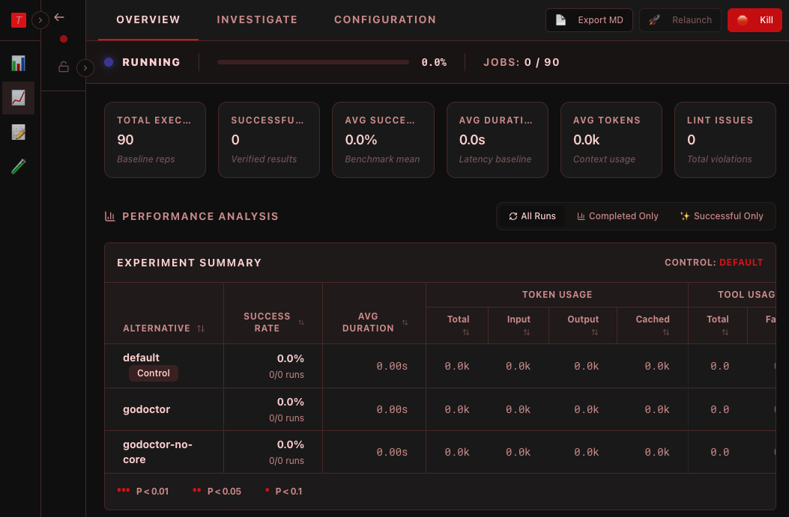
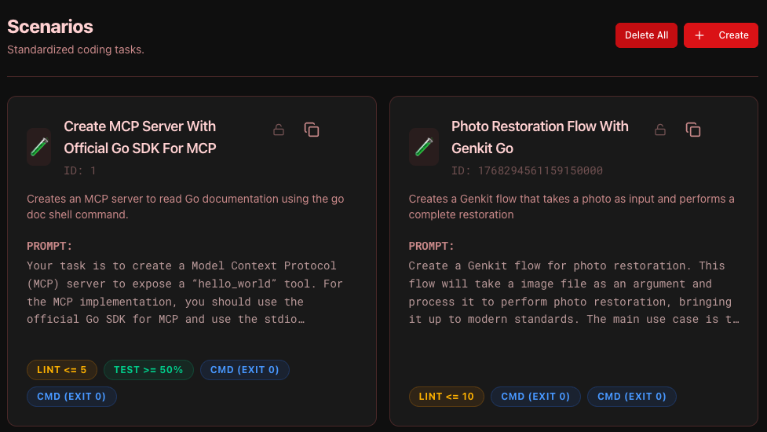
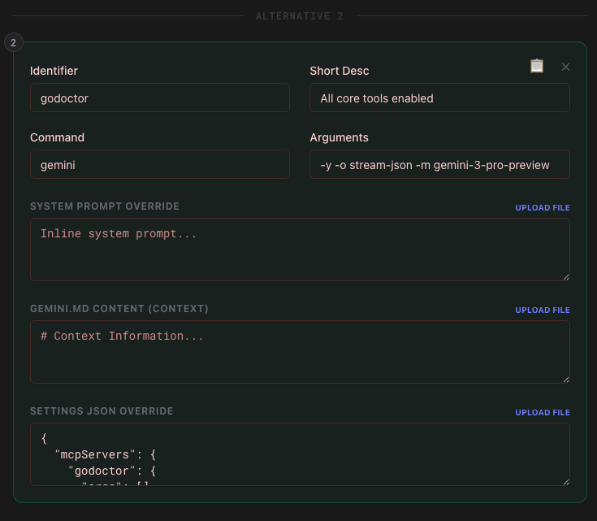

A mudança do [determinismo para o não-determinismo](https://newsletter.pragmaticengineer.com/p/martin-fowler) no desenvolvimento de software é um dos maiores desafios que enfrentamos como indústria no momento.

Todos nós já passamos por isso: você está trabalhando com um agente de IA e pensa: *"E se eu adicionar isso ao meu system prompt?"* ou *"Talvez eu devesse dar a ele acesso a esta nova ferramenta MCP?"*

Você faz a alteração, executa uma vez e funciona. Sucesso! Você se sente um gênio e compartilha com todos os seus colegas, seus seguidores, sua avó e seu gato. Mas então, uma hora depois, você faz de novo e falha miseravelmente na exata mesma tarefa. A mudança foi realmente boa ou você apenas deu sorte na primeira execução? "Talvez eu não tenha feito direito desta vez..." — desliga e liga de novo, tenta mais uma vez e funciona... ou será que não?

O fato é que não há apenas uma aleatoriedade inerente na forma como os LLMs funcionam, mas também existem muitos fatores de confusão que podem contribuir para esses resultados.

Como vivemos no mundo determinístico por tanto tempo (será?), nós, engenheiros de software, não estamos mentalmente preparados para lidar com esse nível de incerteza. Esperamos que a computação seja exata, pois nos dizem desde o início que ela é uma [ciência exata](https://pt.wikipedia.org/wiki/Ci%C3%AAncias_exatas).

## A vibe vs. a ciência

Eu falo muito sobre [vibe coding com disciplina]() ou, em outras palavras, como adicionar metodologia à vibe coding é fundamental para alcançar resultados de boa qualidade. Este não é um problema novo — lidamos com questões de qualidade de software há décadas — mas baixar a barreira de entrada e aumentar nossa velocidade para produzir código elevou isso a uma nova ordem de magnitude.

Sempre me surpreendo quando "descubro" que uma metodologia antiga, projetada para ajudar equipes de humanos a produzir melhores resultados, muitas vezes funciona muito bem com agentes de IA. Mas, na verdade, não deveria ser surpresa para ninguém; afinal, os humanos também são não-determinísticos por natureza. A IA está apenas funcionando como um amplificador de alguns padrões muito bem conhecidos.

Embora eu tenha conseguido criar um fluxo de trabalho razoável baseado nesses princípios, nunca alcancei realmente o nível de confiança para dizer "esta é a maneira CERTA de fazer isso", e isso geralmente acontece porque aquela falha ocasional ou regressão erodes minha confiança — "Este `GEMINI.md` é realmente o prompt definitivo para desenvolvedores Go?" "Eu alcancei as melhores instruções de sistema para esta tarefa?" "Minhas ferramentas MCP são as melhores APIs que eu poderia criar?" — todos os dias sou inundado por tantas dúvidas que, para a maior parte do conteúdo que publiquei no ano passado, evitei ser muito prescritivo e posicionei tudo como **estudos de caso** — "Eu fiz _isso_", "_aquilo_ aconteceu". Fim de história. Na literatura científica, estudos de caso são um dos [níveis mais baixos de evidência](https://pt.wikipedia.org/wiki/Medicina_baseada_em_evid%C3%AAncias).

Eu sei que este não é o argumento típico que você verá em um blog técnico, então preciso fazer um pequeno desvio aqui e falar sobre mim em uma vida anterior: antes de me estabelecer na carreira de engenheiro de software, eu fui para a faculdade de Medicina (nunca me formei, mas essa é uma história para outra hora). Na Medicina e em outras áreas da Biologia, as pessoas estão muito mais acostumadas à experimentação e a lidar com vieses, ruído e aleatoriedade, porque precisam extrair "verdades" de sistemas de origens desconhecidas (eles estão fazendo engenharia reversa do mundo, quão legal é isso?). Apresentar os dados de um estudo como eles são não é suficiente; você precisa validá-los estatisticamente para garantir que removeu qualquer contaminação potencial. Tamanho da amostra, alfa, p-valores, Student T-Test... eu odiava esses termos quando tinha que fazer minhas provas, mas mal sabia eu que eles seriam tão úteis hoje.

É claro que isso não é exclusivo da Biologia; na engenharia, muitas vezes aplicamos técnicas estatísticas ao fazer pesquisas, mas sinto que não é tão difundido em nossa área quanto em outras. Quando trabalhei em sistemas de recomendação, por exemplo, os testes A/B eram uma parte crítica do trabalho para otimizar os algoritmos de machine learning. Pesquisadores de UX também usam testes A/B extensivos para determinar quais interfaces são melhores que outras, e assim por diante.

Eu queria encontrar uma maneira de remover o "achismo" da minha experimentação de agentes de programação, então percebi que a melhor coisa que eu poderia fazer seria criar um framework de experimentação para coletar dados e fazer a análise estatística, permitindo-me assim ir além do "eu acho que isso funciona" para o "eu **sei** que isso funciona (_com 95% de confiança_)."

## Apresentando o Tenkai: O framework de experimentação para agentes

Para resolver isso, construí o **Tenkai** (do japonês "desdobramento" ou "expansão", um pequeno Easter Egg para amantes de anime). É um framework em Go projetado para avaliar e testar diferentes configurações de agentes de programação com rigor estatístico.

Pense nele como um laboratório para seus agentes de IA. Em vez de executar um prompt uma vez e esperar o melhor, o Tenkai permite que você execute experimentos que repetirão as mesmas tarefas repetidamente (até um número N de repetições — o tamanho da sua amostra) e comparará alternativas (diferentes conjuntos de configurações) entre si usando testes estatísticos.

Let's say Alternative A is your default setup (the experiment "control") and Alternative B is a new system prompt you want to try. The experiment will run both N amount of times and output a report saying if B is significantly faster, more efficient, or more precise. If the difference is due to coincidence or noise, the framework won't flag it as significant and you can safely ignore the results.

### Como funciona

O fluxo de trabalho no Tenkai:

1.  **Definir cenários:** Um cenário é uma tarefa de programação padronizada (ex: "Corrigir um bug neste pacote Go" ou "Implementar um novo componente React"). Inclui regras de validação como "Compila?" ou "Os testes passam?". Para um cenário ser contado como bem-sucedido, ele precisa passar por todos os critérios de validação que você especificar.

2.  **Criar um template:** Você define o que deseja testar. Por exemplo, sua "Alternativa A" (control) pode ser o modelo Gemini 2.5 Flash, e sua "Alternativa B" pode ser o Gemini 2.5 Flash com um servidor MCP configurado. Você pode ter até 10 alternativas no mesmo template de experimento (todas serão comparadas com o controle).

3.  **Executar o experimento:** O Tenkai executa cada cenário várias vezes para cada alternativa. Ele isola as execuções em espaços de trabalho temporários, gerencia timeouts e captura cada evento — de chamadas de ferramentas a saídas do shell. Você também pode especificar um nível de simultaneidade para executar tarefas em paralelo e não precisar esperar uma eternidade pelos resultados.

### Rigor estatístico (A parte científica)

Estes são os testes estatísticos atualmente integrados ao framework:

*   **Welch's t-test**: Para métricas contínuas como duração, uso de tokens ou o número de problemas de lint. Usamos o Welch's em vez de um t-test padrão porque ele não assume variância igual entre os grupos — o que é essencial ao comparar modelos que podem ter perfis de desempenho muito diferentes.
*   **Fisher's Exact Test**: Para taxas de sucesso. Quando você está trabalhando com tamanhos de amostra menores (como 10 ou 20 repetições), os testes Qui-quadrado padrão podem ser imprecisos. O teste de Fisher nos dá um p-valor confiável para determinar se uma taxa de sucesso de 80% é realmente melhor do que uma de 60%, ou apenas uma sequência de sorte.
*   **Mann-Whitney U Test**: Este é o nosso "burro de carga" não paramétrico. Nós o usamos para comparar a *distribuição* de chamadas de ferramentas entre execuções bem-sucedidas e falhas. Como as contagens de chamadas de ferramentas não são distribuídas normalmente (muitos zeros!), o Mann-Whitney nos ajuda a identificar se uma ferramenta específica está sendo usada significativamente mais nas execuções "vencedoras".
*   **Spearman's Rho (Correlation)**: Usamos isso para identificar os "Determinantes de Sucesso". Ao calcular a correlação entre chamadas de ferramentas específicas e métricas como duração ou tokens, o Tenkai pode dizer se uma nova ferramenta MCP é um **Success Driver** ou apenas uma distração que infla os custos.

## Insights em tempo real e o dashboard

À medida que um experimento é executado, você pode observar o processo de pensamento do agente, ver quais ferramentas ele está chamando e identificar onde ele trava. É como poder "olhar dentro da mente" do seu agente em dezenas de execuções simultâneas.

Um dos recursos mais poderosos do dashboard é a capacidade de filtrar a análise rapidamente usando três "lentes" distintas:

*   **Todas as Execuções:** A verdade nua e crua. Inclui cada timeout catastrófico e erro de sistema. Esta é a sua medida primária de **confiabilidade** geral do sistema.
*   **Apenas Completas:** Filtra execuções que atingiram um estado terminal (Sucesso ou Falha de Validação). É aqui que você analisa métricas de **qualidade**, como problemas de lint ou tempo de execução, removendo o ruído de timeouts externos.
*   **Apenas Sucessos:** A visão do "Padrão Ouro". Ao olhar apenas para os vencedores, você pode começar a inferir *por que* eles tiveram sucesso. É aqui que calculamos o **Spearman's Rho** e os p-valores do **Mann-Whitney U** para identificar quais ferramentas estão altamente correlacionadas com o sucesso.

## Primeiros resultados dos meus próprios experimentos

Tenho usado o Tenkai para refinar o [godoctor](https://github.com/danicat/godoctor) no meu servidor MCP dedicado a Go dos sonhos. Minha hipótese é que, ao fornecer ferramentas especializadas aos modelos, eles se tornarão mais eficazes na execução de tarefas de codificação. Por exemplo, em vez de dar aos modelos a liberdade de decidir quando ler a documentação para descobrir a API de uma biblioteca cliente, estou forçando a documentação para eles, retornando-a toda vez que o modelo chama `go get`. Isso preveniu massivamente alucinações de API e "loops de inferno de dependências", onde o modelo continua lutando com `go get` e `go mod` porque acha que obteve a versão errada do pacote.

Os primeiros resultados também mostram que essa diferença diminui se eu fixar a versão do modelo na geração mais recente — o Gemini CLI, por padrão, é lançado no modo "auto", o que significa que ele decide automaticamente qual modelo chamar entre Gemini 2.5 e Gemini 3, em ambas as versões Flash e Pro. Ao fixar a versão para o Gemini 3 Pro (id do modelo `gemini-3-pro-preview`), ele se torna muito mais inteligente e muitas vezes obtém a documentação por si só (lançando `go doc` na linha de comando) nesses cenários de conflito, tornando o conjunto de ferramentas do godoctor menos impactante.

, mas após desativar as ferramentas principais — forçando o uso do godoctor — a duração média da tarefa reduziu em mais de 30% (p < 0,01)")

Também tive muitos desafios com a adoção de ferramentas. Os modelos, por padrão, têm uma forte preferência por usar as ferramentas integradas com as quais foram treinados. Mesmo que eu forneça uma ferramenta "mais inteligente", eles têm dificuldade em sair de sua zona de conforto. Falhei muito tentando projetar experimentos em torno disso até perceber que meu processo de experimentação estava completamente falho. **Adoção de ferramentas** e **eficácia de ferramentas** são conceitos ortogonais: ao tentar testar ambos no mesmo experimento, eu estava falhando em produzir resultados válidos, então acabei pivotando para testar apenas a eficácia da ferramenta, bloqueando o acesso do modelo às ferramentas integradas. Dessa forma, finalmente comecei a obter sinais melhores sobre o quão boas (ou ruins) são as ferramentas do godoctor.

If you are curious about how godoctor is shaping to be, and how I came up with the current API, I am speaking about it at [FOSDEM no próximo dia 1º de fevereiro](https://fosdem.org/2026/schedule/event/3BD3Z9-making_of_godoctor_an_mcp_server_for_go_development/). Claro, se você não puder comparecer, não se preocupe. Também escreverei mais sobre isso nas próximas semanas.

## Conclusões

Estamos em um ponto de virada no desenvolvimento de software. Estamos saindo de um mundo onde escrevemos cada linha de código para um onde **orquestramos** inteligência.

Mas a orquestração requer medição. Não podemos melhorar o que não podemos medir. A transição de ser um escritor de código para um orquestrador de inteligência não significa que trabalhamos menos — significa que fazemos um trabalho **diferente**. Nossa responsabilidade primária não é mais apenas a sintaxe; é o **Contexto, as Ferramentas e as Diretrizes (Guardrails)**.

Se não medirmos o impacto de nossas mudanças com rigor, não estamos fazendo engenharia; estamos apenas apostando. Ao avançar para uma abordagem baseada em evidências para agentes de programação, podemos finalmente construir sistemas que não sejam apenas "legais" quando funcionam, mas confiáveis o suficiente para construir um negócio sobre eles.

Se você estiver interessado em conferir o código ou realizar seus próprios experimentos, pode encontrar o projeto [aqui](https://github.com/danicat/tenkai).

Bons experimentos! o/

Dani =^.^=