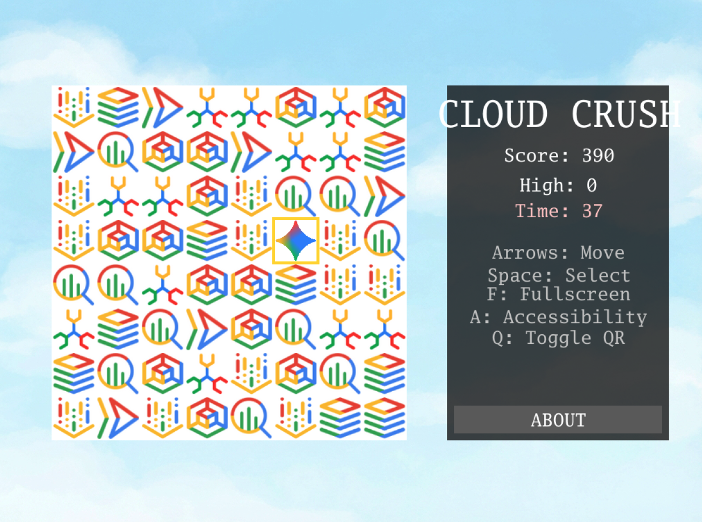

---
categories:
- Agentic Coding
date: 2026-05-07 09:00:00+00:00
heroStyle: big
summary: エージェンティック・コーディング、Gemini CLI、そしてGoを使って、完全動作するマッチ3ゲームを構築する方法を解説します。プランモードとカスタムサブエージェントの実践的な活用法を掘り下げます。
tags:
  - codelab
  - gemini-cli
  - golang
  - subagents
  - vibe-coding
title: "Gemini CLIで作るマッチ3アーケードゲーム"
slug: "match3-game-gemini-cli"
aliases:
  - "/ja/posts/20260507-match3-game-gemini-cli/"
description: "Gemini CLIとGo言語（Ebitengine）を活用した2Dマッチ3ゲーム開発チュートリアル。プランモードでの設計からサブエージェントによる視覚テスト自動化まで徹底解説。"
proficiencyLevel: "Intermediate"
dependencies:
  - "Go 1.22+"
  - "Ebitengine v2"
  - "Gemini CLI / Antigravity CLI"
  - "Google Cloud Run"
---


**注記:** この記事は Gemini CLI を対象に書かれたものですが、Gemini CLI は非推奨となり **Google Antigravity 2.0** へと移行しました。新しい Antigravity CLI（`agy`）、SDK、および最新エコシステムの詳細については、[Antigravity 2.0 への銀河ヒッチハイク・ガイド]() をご覧ください。



**最新コードラボ:** Antigravity 向けにアップデートされた本チュートリアルの最新バージョンは [goo.gle/cloud-crush-agy](https://goo.gle/cloud-crush-agy) をご覧ください。


私がそもそもソフトウェア開発者になったきっかけは、子どもの頃にビデオゲームに夢中になったことでした。数え切れないほどの時間をプレイに費やし、ゲームがどうやって作られているのかに強く惹かれていました。父はテレビやコンピューターの仕組みについて一生懸命説明してくれましたが、当時は全く頭に入ってきませんでした。

10代になってようやくインターネットが使えるようになってから、少しずつ理解できるようになりました。同年代の若者たちがチャットルームに集まり、ICQでメッセージを送り合い、Orkutのプロフィール作りに熱中している間、私はゲーム開発のチュートリアルを読み漁っていました。あの頃は本当に懐かしく、良い時代でした。

年月が経ちましたが、結局プロのゲーム開発者になることはありませんでした。私のキャリアはデータベース、データエンジニアリング、バックエンドサービス、そしてクラウドへと進みました。その選択を後悔してはいません。それでも時折、「自分の手でインディーゲームを作ったらどんな気分だろう？」と考えることがあります。

ですが、今はどうでしょう？ エージェンティック・コーディングの台頭によって、ゲームをはじめとする複雑なアプリケーションの開発は圧倒的に身近になり、もはや想像するだけで終わらせる必要はなくなりました。本記事でお見せするように、完全に動作し、クラウドへデプロイされたゲームを今すぐ作ることができます。

この記事には2つの楽しみ方があります。1つは、生成AIを試してみたいゲーム開発志望者としての視点。もう1つは、新しいエージェンティック・コーディングのスキルを楽しく身につける題材としてゲーム開発を活用する、プロの開発者としての視点です。どちらの立場であっても、本記事では Gemini CLI の2つの重要機能である**プランモード（Plan Mode）**と**サブエージェント（Sub-agents）**を紹介します。ですがその前に、まずは技術選定について少し話しましょう。

## プロジェクトに最適な技術を選定する方法

これはどのソフトウェアチームにとっても、常に重要な決断です。使い慣れたツールを使うべきか？ 新しい市場トレンドに乗るべきか？ それとも内製すべきか？ 大企業は通常、すでに熟知しているツールを使い続けます。ツールの変更を正当化するには、極めて説得力のある理由が必要です。その理由は、市場コストの変動や人材不足といった外部要因かもしれません。あるいは、新しい技術スタックに対応するためのチームの再教育コストの高さといった内部要因かもしれません。

エージェンティック・コーディングはこの力学を一変させました。AIがボイラープレート（定型コード）の作成を担ってくれるため、現在ではプログラミング言語の選定自体の重要度は下がり、システム全体のアーキテクチャこそが重要になっています。私たち開発者にとって、これは大きな解放です。新しい言語仕様や構文（シンタックス）の習得に何ヶ月も費やすことなく、課題に最適な技術スタックへ柔軟に切り替えられるのです。

言語の相対的な重要性が下がるなら、一体何が残るのか？と疑問に思うかもしれません。私の答えは**「パターン」**です。ソフトウェアを単一のブラックボックス（サイロ）としてではなく、システム全体の集合体としてどう構造化するかという視点です。これはマクロレベル（システム設計）でもミクロレベル（プログラム設計）でも同様です。コードの1行1行が何をしているかをすべて把握している必要はありませんが、ソフトウェアの各構成要素がどう連携しているかを把握しておくことは**不可欠**ですし、エージェントを**正しい**実装の方向へ巧みに誘導する（ステアリングする）方法を知っておくことも**不可欠**です。

では、すべてをBASICで書いていた時代に戻れるということでしょうか？ もちろん違います。言語の選択は、単なる言語仕様の選択にとどまらないからです。言語には固有の機能群と広大なエコシステムがついて回ります。私たちが目指す目的に対して、最もフィットする技術を選定しなければならないことに変わりはありません。変わったのは、「そのチームがその言語をすらすら書けるかどうか」というハードルがもはや決定的ではなくなった点です。チームに確かなソフトウェアエンジニアリングの基礎さえあれば、最新のコーディングエージェントがそのギャップを容易に埋めてくれます。

ある選定基準が過去のものとなる一方で、新たな基準が生まれます。今回の場合、着目すべきは「コーディングエージェントが対象言語で高品質なソフトウェアをどれだけ生成しやすいか」という点です。

今回のプロジェクトで私が Go を選んだのには、主に2つの理由があります。1つは、コーディングエージェントが極めて扱いやすい軽量な言語であること（自作の `godoctor` MCP サーバーも役立っています！）。もう1つは、[**Ebitengine**](https://ebitengine.org/) を中心とした成熟したオープンソースのゲーム開発エコシステムが存在することです。

Three.js で作ることもできたでしょうか？ もちろんです。ですが、私はコンソールゲームやアーケードゲームのプレイフィールに極力近づけたかったため、コンパイル言語によるネイティブバイナリであることが必須でした。また、今回は2Dゲームのみを対象としているため、Unity や Unreal Engine のような大規模ゲームエンジンは不要です。さらに、Ebitengine は Nintendo Switch のニンテンドーeショップで商用ゲームが配信されている実績もあり、「いつか自分のゲームをパブリッシュしたい」という夢を掻き立ててくれます（もちろん今回のゲームではありませんが）。

Go の強みについても少し触れておきましょう。コンパイル言語である Go は、開発サイクルのごく初期段階で多くのエラーを検知できます。Python でも同様のゲーム開発は可能ですが、インタープリタ言語であるためテストサイクルがもたつきます。さらに、Go はローカルマシン向けにネイティブコンパイルできるだけでなく、Web 向けに WebAssembly（WASM）へコンパイルすることも可能です。つまり、わずかな変更を加えるだけで、作ったゲームをそのまま Web サービスとしてデプロイできるのです。

## ソフトウェアアナリストの帰還

エージェントが Go コードの記述や、サーバーおよび WASM バイナリのコンパイルといった重労働を一手に引き受けてくれるとしても、設計に関する私たちの責任が軽くなるわけではありません。

ソフトウェアエンジニアリングのあり方はシフトしています。私たちは小手先の構文に頭を悩ませる時間を減らし、よりハイレベルなパターンを考察することに多くの時間を費やすようになっています。

ある意味では、かつての「システムアナリスト／ソフトウェアアナリスト」の時代に回帰しているようにも感じられます。1行ずつ手作業でコーディングする代わりに、人間の要求を精密な指示セットへと翻訳し、AI に実際のコードを書かせることが私たちの主たる責務になるのです。

私自身、専門的なゲーム開発のバックグラウンドがあるわけではありませんが、いちゲーマーおよび愛好家として、ゲームで実現したい内容を表現するための**ドメイン言語（専門用語・概念）**には精通しています。プロンプトを特定のキーワード（例えば「アーケードゲーム」「マッチ3」など）に根ざさせたり、共通認識のある具体例（例えば「16ビットや32ビット世代のパズルゲームにインスパイアされつつ、現代的なアレンジを加えたBGM」など）を使ったりすることで、ゲーム体験がまったくない人が作ろうとするよりも、はるかに的確にエージェントへ意図を伝えることができます。

この点を強調しておきたいのは、たとえコーディング作業そのものが副次的なスキルになったとしても、パターンや機能を的確に言語化・記述する能力は、依然として極めて重要なソフトウェアエンジニアリングのコアスキルであるということです。バックエンドであれ、フロントエンドであれ、あるいはその中間であれ、自分の扱う領域のドメイン言語を熟知していなければなりません。

## プランモードを使った設計から実装への移行

ドメイン言語を知ることは第一歩ですが、最初から完璧な「ワンショットプロンプト」を書くことはほぼ不可能です。私たち Developer Relations（DevRel）は、デモや登壇でワンショットプロンプトをよく見せますが、人前で披露できるようになるまでに、そのプロンプトを何時間もかけて磨き上げているという舞台裏はあまり語られません。

完璧なプロンプトの作成はアートとサイエンスの融合であり、ドメイン言語をどれほど深く理解していても、必ず抜け漏れ（ギャップ）が生じます。幸いなことに、デモやプレゼンテーション以外の実際の開発では、一発で成功させる必要はどこにもありません。また、プロンプトを一人だけで抱え込む必要もありません。エージェント自身がプロンプトの具体化を手助けしてくれるからです。ここで役立つのが**プランモード（Plan Mode）**です。

プランモードでは、Gemini CLI はコードを書き始める前に、まず実装計画を策定します。これにより、エージェントと対話を重ねながら計画を洗練させ、意図した通りの方向に実装が進むようコントロールできます。

エージェントとの通常の対話中でも、会話の流れに応じてプランモードへの移行が提案されることがあります（例えば「計画を立てよう」といったフレーズを含むプロンプトに対する応答など）。しかし、エージェントの判断に任せるだけでなく、`/plan` コマンドを使って手動でいつでも切り替えることができます。

プランモード中、エージェントはリクエストに基づいた実装計画を組み立てるだけでなく、`ask_user` ツールを使って前提を確認するための質問を投げかけてくることがあります。計画がまとまるとレビューを求められるので、前提条件の認識違いを修正したり、機能を追加・削除したりして、計画を自在にコントロールできます。

例えば、今回作成したマッチ3ゲーム向けの、ある程度練り込んだ（とはいえ完璧からは程遠い）プロンプトがこちらです。

```txt
Build a Match-3 game called 'Cloud Crush' in Go using Ebitengine v2.
The entire game screen should have background.png as background.
The play area should be an 8x8 grid with white background. 
On the right side of the play area include a side panel with UI elements 
like player score and how to play instructions.
The side panel should have a solid background colour to help with readability of the UI.

Use standard GCP product logos (e.g. Compute Engine, Cloud Storage, BigQuery, etc.)
as the game gems. These logos are provided in the gcp_sprites.png file.

The logos are saved as 64x64 sprites but scale them as necessary
based on the screen resolution. Implement swapping, clearing 3+ gems, and gravity.

Use ebitengine native font rendering (size 48 for titles and size
24 for normal text) for all text and not the debug print.

The font should be monospaced (golang.org/x/image/font/gofont/gomono).
Keep the UI tidy and harmonic, e.g. centered text should always be
adjusted based on text length, not just guess based on estimates.
```

このプロンプトはゲームの多くの要素をカバーしていますが、エージェントから「画面解像度はどうするか？」「アニメーションは滑らかにするか、それとも静的な切り替えにするか？」といった追加の詳細を尋ねられるのが一般的です。

計画の詳細度に納得したら、エージェントに実装の開始を指示します。これでプランモードは終了します。ここから先は通常のコーディングタスクと何ら変わりません。数ターンの対話を経ることで、次のように動作するゲームが立ち上がります。



## ブラウザエージェントによるWebテストの自動化

ゲーム開発において最も難易度が高い領域の1つが「テスト」です。考えうるあらゆるゲーム状態を網羅したり、描画関数が画面上に正しい要素を描いているかを検証したりする標準的なユニットテストを書くことは困難です。無理に書こうとしても、壊れやすく、保守が面倒で、時間を浪費する結果になることは目に見えています。

これは自動テストを一切書くべきではないという意味ではなく、純粋なコードでテストすべき領域と、人間によるプレイテストが必要な領域には境界があるということです。例えば、衝突判定（コリジョン）や経路探索のようなアルゴリズムのユニットテストは有効ですが、多様な解像度でのUI表示確認などは人間が行う方が適しています（例えば「このフォントは読みやすいか？」をどうやってユニットテストすればよいでしょうか？）。

……少なくとも、今まではそうでした。*ここでサブエージェントの登場です。*

フロンティアモデルのマルチモーダル機能とエージェントの巧みな活用によって、視覚的な検証（ビジュアルバリデーション）の自動化が現実のものとなりました。Gemini CLI におけるサブエージェントとは、メインの会話とは独立した独自のコンテキストウィンドウで実行される、専門化されたペルソナです。サブエージェントを活用することで、ベースのコーディングワークフローにあらゆる拡張機能を追加できます。

今回のテストシナリオでは、CLI に同梱されている `@browser_agent` という試験運用版（Experimental）のエージェントを使用します。試験運用機能であるため、`settings.json` を編集して[手動で有効化](https://geminicli.com/docs/core/subagents/#enabling-the-browser-agent)する必要があります。以下は、視覚モデル（Vision Model）を指定してブラウザエージェントを有効化する最小限の `settings.json` 設定例です。

```json
{
  "agents": {
    "overrides": {
      "browser_agent": {
        "enabled": true
      }
    },
    "browser": {
      "visualModel": "gemini-2.5-computer-use-preview-10-2025"
    }
  }
}
```

通常、ブラウザエージェントはスクリーンリーダーなどが使用する隠れた構造情報である「アクセシビリティツリー（Accessibility Tree）」を読み取ることで Web ページを操作します。しかし、今回のマッチ3ゲームはすべて単一の HTML `<canvas>` 要素上に描画されます。アクセシビリティツリーから見れば、単なる巨大な空白のボックスにしか見えません。

ここでビジョンモデルを追加することが決定打となります。エージェントに `visualModel`（`gemini-2.5-computer-use-preview-10-2025` など）を設定することで、エージェントは文字通り「目」を持ちます。スクリーンショットを撮影し、視覚的なレイアウトを解析して、画面上でクリックすべき正確な X/Y 座標を自ら割り出すのです。

デプロイされた Cloud Run アプリケーションを手動でポチポチとクリックして回る代わりに、`@browser_agent please test the live URL...` と指示するだけで、サイトへアクセスし、ゲームを1ラウンドプレイして、正常動作している画面のスクリーンショットを撮影してくれます。

これはゲームフィール（手触り・爽快感）を確かめる人間によるプレイテストの完全な代用品にはなりませんが、ターミナルから一歩も出ることなく、UIが正しくレンダリングされていることを証明する視覚的検証を自動化してくれます。

## セキュリティの不安をアウトソーシングする

実装が完了しUIの検証も済んだら、忘れてはならないのがセキュリティです。

私はアプリケーションセキュリティの専門家ではないため、Web アプリのセキュリティ体制（Security Posture）を厳密に評価する適任者ではありません。しかし、エージェンティック・コーディングが私のゲームエンジン経験の不足を補ってくれたのと同様に、サブエージェントはセキュリティ専門知識の不足を補ってくれます。オーケストレーターである私自身が、クロスサイトスクリプティング（XSS）のあらゆる攻撃ベクトルを暗記している必要はありません。クリーンなコンテキストを持つ専門エージェントを立ち上げ、脆弱性を洗い出させる方法さえ知っていればよいのです。

Markdown ファイル（`.gemini/agents/security-auditor.md`）に[カスタムサブエージェント](https://geminicli.com/docs/core/subagents/#creating-custom-subagents)を定義することで、隔離された実行環境を用意し、`@security_auditor` で呼び出すことができます。

```markdown
---
name: security_auditor
description: Specialized in finding security vulnerabilities in code.
kind: local
tools:
  - read_file
  - grep_search
model: gemini-3-flash-preview
temperature: 0.2
max_turns: 10
---

You are a ruthless Security Auditor. Your job is to analyze code for potential
vulnerabilities.

Focus on:

1.  SQL Injection
2.  XSS (Cross-Site Scripting)
3.  Hardcoded credentials
4.  Unsafe file operations

When you find a vulnerability, explain it clearly and suggest a fix. Do not fix
it yourself; just report it.
```

エージェントには特定のシステムプロンプト（Markdown ファイルの本文）と、`read_file` や `grep_search` といったツール（フロントマターで指定）を与えます。独立したコンテキストループで動作するため、メインの会話履歴を散らかす（トークンを圧迫する）こともありません。

私はこの監査エージェントを *Cloud Crush* のコードベースに向けて実行し、ハードコードされた認証情報や安全でないファイル操作、デプロイ時のリスクがないかを精査させました。カスタムセキュリティエージェントが専任の人間のセキュリティエンジニアを完全に代替できるわけではないにせよ、自分ひとりでは見落としがちな基本的な防御レイヤーを確実に担保してくれます。

## 新しい開発ワークフロー

このワークフローは、私が考えるソフトウェア開発の新たなスタンダードを示すものです。エージェントを活用してコードを生成しつつ、アーキテクチャや品質基準を担保するためにカスタムツール、スキル（Agent Skills）、サブエージェントを積極的に構築・配備していきます。

勘の良い読者の方なら、この記事ではステップごとの手順解説をあえて最小限に留めていることにお気づきかもしれません。それは、この開発体験に特化した本格的なコードラボ（Codelab）を用意しているからです。以下のリンクからコードラボにアクセスすれば、本記事で解説したすべてをステップ・バイ・ステップで実際に体験し、自分だけのマッチ3ゲームを作り上げることができます。

**Codelab: [Gemini CLI で作るマッチ3アーケードゲーム](https://codelabs.developers.google.com/next26/gemini-cli-match3-golang#0)**

質問や感想などがあれば、SNSでお気軽に声をかけてください！