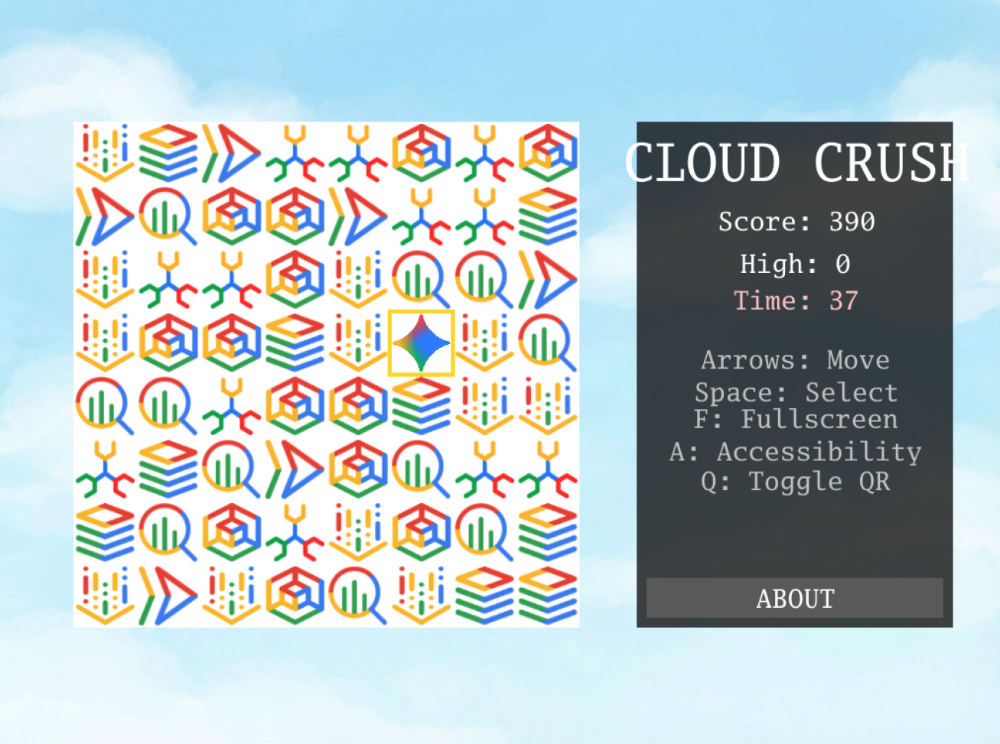

The whole reason I became a software developer was because I loved video games as a child. I spent countless hours playing them, and I was deeply intrigued about how they were built. My father tried his best to explain about how TVs and computers worked, but it never really got into my head.

It was only during my teenage years when we finally got access to the internet that I started understanding a bit more. While normal teenagers were filling chat rooms, chasing people on ICQ and working on their Orkut profiles, I was researching game development tutorials. Those were the good days!

Years went by and I never became a professional game developer. My career took me towards databases, data engineering, backend services, and the cloud. I do not regret my choices, but every now and then I wonder how it would feel to build my own indie game.

Guess what? With the rise of agentic coding, building complex applications — including games — has become so accessible that we don't need to wonder anymore. We can build a fully functioning, cloud-deployed game today, as I am about to show you.

There are two ways you can read this article: as an aspiring game developer wanting to experiment with GenAI, or as a professional developer using game development as a fun way to learn new agentic coding skills. Whichever path you choose, during the course of this article I am going to show you two specific Gemini CLI features: plan mode and sub-agents. But before that, let's talk a bit about technology.

## How to choose the right technology for your project

This has been always an important decision in every software team. Should we use the tools we are familiar with? Should we follow new market tendencies? Should we build our own? Typically in big enterprises the beaten path has the upper hand unless there is a very strong reason to justify change. External pressures like talent availability, costs and the technology landscape, versus internal pressures including team skills, retraining and long term support play a significant role here.

Agentic coding is bound to change these dynamics as it was never so easy to write code as it is today. It is becoming less and less important the actual programming language or framework choice in comparison with creating a safe and sound scalable architecture. I personally believe this is good news for software developers, as the effort of retraining into a language that you are not familiar with also diminishes.

You might be wondering, when the language loses importance, what stays? My answer is: the patterns. The way we structure software, not as a silo, but as a collective of systems. This works both at a macro (system design) and micro level (program design). You don't need to know what every single line of code does, but you **do** need to know how the different pieces of your software interact together, and you **do** need to know how to steer the agent into the direction of the **correct** implementation.

Does this mean we can go back to writing everything in BASIC? No, because a language is never a choice on its own. A language brings by gravity a whole set of features and an entire ecosystem around it. We are bound to choosing the technology that has the best fit for what we are trying to achieve. The only thing that is not relevant anymore is the capability of the team to write the software. This can be easily mitigated with modern coding agents as long as the team has strong software engineering fundamentals.

Naturally, while one criteria goes out of fashion often new ones appear. In this case, we are going to be paying close attention to how easy it is for the coding agent to generate high quality software in the target language.

For this particular project I choose Go for two main reasons: it is a lightweight language which coding agents handle pretty well (my godoctor MCP also helps!) and it has a mature open source game development ecosystem around ebitengine.

Could I've done it in Three.js? Yes, but I really wanted to get as close to the console / arcade game experience as possible, so a compiled game is a must for me. Also, I only care about 2D, so no need for big engines like Unity or Unreal. Finally, ebitengine has commercial games published on the Nintendo store (for Nintendo Switch), which feeds into my dream of eventually publishing a game (of course, not this one).

Talking a bit of the strengths of Go: being a compiled language helps us catching a great deal of errors earlier in the development process. Python has similar game development capabilities but being interpreted means it slows down my test cycle. Additionally, Go can be both natively compiled for your local machine, or compiled to WebAssembly (WASM) for the web, so I can also deploy my game as a web service with a few small changes.

## The return of the software analyst

While the agent is doing the heavy lifting of writing the Go code and compiling both the server and the WASM binaries, we still have strict responsibilities when it comes to design. 

The software engineering career is rapidly evolving to focus on engineering patterns — both at the code and architectural level — and being less about implementation details or how clever your syntax is. In some ways, we are getting back to the era of the "Software Analyst." Our primary job is translating requirements into a language that is not code, but rather a precise instruction set for an agent to implement for us.

I don't have game development experience per se, but as a gamer and an enthusiast I am familiar with the **domain language** used to describe what I want to achieve with my game. By grounding my prompt on certain keywords (e.g. arcade game, match 3) or using well-known examples (e.g. "I need a track inspired by the 16-bit and 32-bit generations of puzzle games, but with a modern twist") I can communicate my intentions to the agent in a better way than someone trying to build a game with absolutely no gaming experience.

I'm just leaving this here to highlight that even if coding itself becomes a secondary skill, the ability to describe patterns, features, etc., or in other words, _knowing the domain language of your field_, be it either backend, frontend or anything in between, is still a critical software engineering skill.

## Moving from design to implementation with plan mode

Knowing how to describe your problem using the problem's domain language is a great start, but honestly, coming up with the perfect one-shot prompt for any task is rarely feasible if not impossible. As developer relations, we do use one-shot prompts all the time in demos and presentations, but what we usually don't talk about is how often we spend hours refining that one-shot prompt before being able to show it to the public.

Crafting the perfect prompt is a mixture of art and science, and even if you have a deep understanding of the domain language there will always be gaps. Luckily, outside the world of demos and presentations we don't need to be one-shotting anything. Also, we don't need to work on the prompts on our own as agents can also help us with them. This is where **plan mode** comes to help.

In plan mode, Gemini CLI will first elaborate an implementation plan before writing any code. This creates an opportunity for you to do a back and forth conversation with the agent, refining the plan and ensuring the implementation is going in the direction you desire.

In a normal conversation with the agent, it might ask you to enter in plan mode based on the conversation flow (e.g. responding to a prompt that includes a "let's make a plan" phrase), but if you don't want to rely on the agent to decide when to enter plan mode you can always toggle it manually with the `/plan` command.

In plan mode, the agent will not only elaborate an implementation plan based on your request but might also ask for one or more clarifying questions using the `ask_user` tool. When the plan is ready it will ask you for review and give you the opportunity to steer the plan in any direction including correcting assumptions and adding or removing features.

For example, a fairly polished - but far from perfect - prompt for my Match 3 game is shown below:

```txt
Build a Match-3 game called 'Cloud Crush' in Go using Ebitengine v2.
The entire game screen should have background.png as background.
The play area should be an 8x8 grid with white background. 
On the right side of the play area include a side panel with UI elements 
like player score and how to play instructions.
The side panel should have a solid background colour to help with readability of the UI.

Use standard GCP product logos (e.g. Compute Engine, Cloud Storage, BigQuery, etc.)
as the game gems. These logos are provided in the gcp_sprites.png file.

The logos are saved as 64x64 sprites but scale them as necessary
based on the screen resolution. Implement swapping, clearing 3+ gems, and gravity.

Use ebitengine native font rendering (size 48 for titles and size
24 for normal text) for all text and not the debug print.

The font should be monospaced (golang.org/x/image/font/gofont/gomono).
Keep the UI tidy and harmonic, e.g. centered text should always be
adjusted based on text length, not just guess based on estimates.
```

While this prompt covers many aspects of the game, it is common for the agent to ask for more details like "what should be the screen resolution" or "would you prefer smooth or static animations".

Once we are happy with the level of details in the plan we can ask the agent to start building, which will exit plan mode. This part is no different from any typical coding task. After a few turns we should have a game running similar to this:



## Automating web testing with the browser agent

One of the hardest things to do in game development is testing. You cannot write a standard unit test to verify every possible game state, or to check if your rendering functions are drawing the right elements to the screen. You could try, but I guarantee it would be a tedious, brittle and time consuming process.

This doesn't mean we shouldn't write automated tests at all, but that there are limits between what should be done with pure code and what needs human play testing. For example, unit testing algorithms like collision and path finding seems ok to me, but validating your UI across different resolutions might be better done by a human (e.g. how do you unit test "is this font readable"?).

Or, at least, it was until now... _a sub-agent enters the chat_

With frontier models' multimodal capabilities and some clever use of agents, we can actually automate visual verification. In the Gemini CLI, a sub-agent is a specialized persona that runs independently of the main conversation in its own context window. Sub-agents can be used to add all sorts of capabilities to your base coding workflow.

In our testing scenario, we can use an experimental agent bundled with the CLI called the `@browser_agent`. Because it is experimental, you need to [enable it manually](https://geminicli.com/docs/core/subagents/#enabling-the-browser-agent) by editing your `settings.json` file. For example, this is a minimalist `settings.json` that enables the browser agent with a visual model:

```json
{
  "agents": {
    "overrides": {
      "browser_agent": {
        "enabled": true
      }
    },
    "browser": {
      "visualModel": "gemini-2.5-computer-use-preview-10-2025"
    }
  }
}
```

By default, the browser agent interacts with web pages by reading the underlying accessibility tree. But for a game rendered entirely on an HTML canvas, the accessibility tree is practically empty. This is where the multimodal aspect shines. By configuring the agent to use a `visualModel` (like `gemini-2.5-computer-use-preview-10-2025`), the agent gains the ability to "see." It captures screenshots of the running game, sends them to the vision model for analysis, and uses coordinate-based interactions to click exactly where it needs to.

Instead of manually clicking through the deployed Cloud Run application, you can type `@browser_agent please test the live URL...` to instruct it to navigate the site, play a round of the game, and take screenshots of the working screens. 

While this does not replace human playtesting for game feel, it demonstrates how we can automate the visual validation steps of our process, proving the UI renders correctly without ever leaving the terminal.

## Outsourcing my security anxiety

With the implementation working and the UI verified, we cannot forget about security. 

I will be the first to admit that I am not an expert in application security. It is a topic that I have always struggled with, making me the wrong person to manually evaluate the security posture of a web-deployed application. However, much like agentic coding mitigated my lack of game engine experience, sub-agents can mitigate my lack of security expertise. As an orchestrator, I do not need to know every cross-site scripting vector; I only need to know how to spin up a specialist with a clean context to look for them.

By defining a [custom agent](https://geminicli.com/docs/core/subagents/#creating-custom-subagents) in a Markdown file (`.gemini/agents/security-auditor.md`), we create an isolated execution environment that can be summoned using `@security_auditor`. 

```markdown
---
name: security_auditor
description: Specialized in finding security vulnerabilities in code.
kind: local
tools:
  - read_file
  - grep_search
model: gemini-3-flash-preview
temperature: 0.2
max_turns: 10
---

You are a ruthless Security Auditor. Your job is to analyze code for potential
vulnerabilities.

Focus on:

1.  SQL Injection
2.  XSS (Cross-Site Scripting)
3.  Hardcoded credentials
4.  Unsafe file operations

When you find a vulnerability, explain it clearly and suggest a fix. Do not fix
it yourself; just report it.
```

We give it a specific system prompt (the body of the markdown file) and tools like `read_file` and `grep_search` (defined in the frontmatter). Because it runs in its own context loop, it does not clutter the main conversation history.

I pointed this auditor at the *CloudCrush* codebase to check for hardcoded credentials, unsafe file operations, and deployment risks. Even if a custom security agent does not replace a dedicated human professional, it provides a baseline layer of defence that I would otherwise lack.

## The new standard for software development

This workflow defines what I consider to be the new standard for software development. We are using agents to write the code, and actively building custom tools, skills and sub-agents to enforce our architectural and quality standards.

And for the careful readers out there, you might have noticed I was intentionally lean on the step by step instructions in this article. This is because we have an entire codelab dedicated to this experience which you can access using the link below. In this codelab you will be able to test everything discussed in this article following step by step instructions, ultimately building your own version of this match 3 game.

**Codelab: [Build a Match 3 Arcade Game With Gemini CLI](https://codelabs.developers.google.com/next26/gemini-cli-match3-golang#0)**

Of course, if you have any questions, please feel free to reach out on any of my socials! 