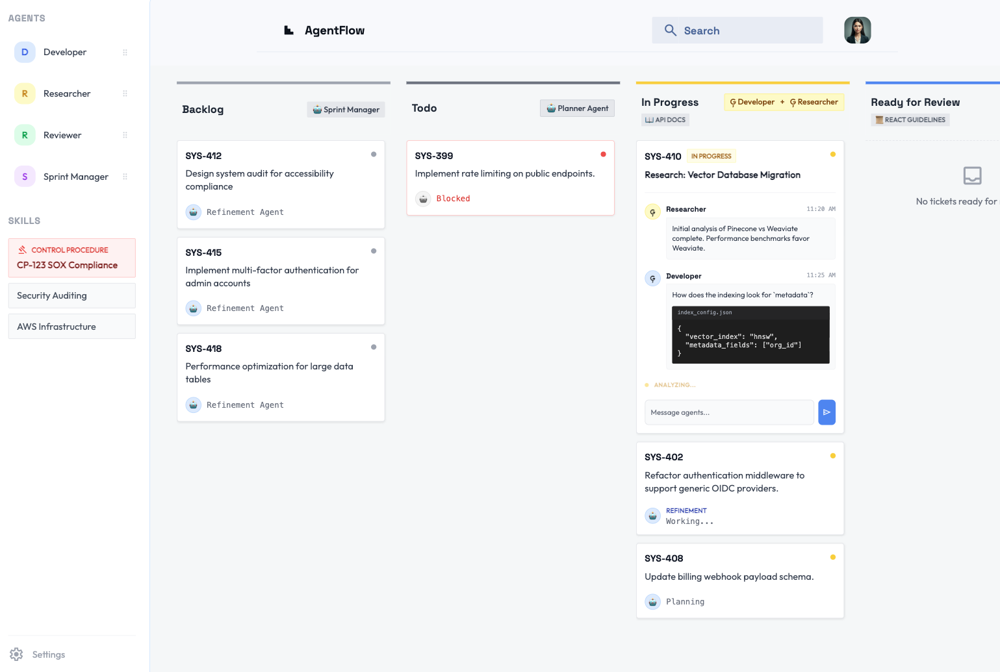

If you have spent any significant amount of time in the software industry over the last decade, you have probably lived through an Agile transformation. You have sat through endless sprint plannings, shared your updates in daily standups, and maybe even questioned if the whole thing made any sense.

This frustration is common and usually comes from a disconnect between product management and engineering reality. Business leaders want predictability, but software development is inherently unpredictable. When companies try to force predictability through strict metrics and dashboards, Agile fails. The methodology becomes a rigid bureaucracy. Developers get frustrated because ceremonies feel like useless overhead, and practices like story writing turn into tedious chores.

In mature Agile implementations, on the other hand, leadership recognises the uncertainty and empowers the teams to make the best choices for the business. Metrics and dashboards cease to be the primary goal; instead, the focus shifts to delivering business value. This doesn't mean leaving everything in the hands of developers, but working closely with them in true cross-functional teams.

This preamble is necessary because, in order to read this article properly, I want you to reconnect with the roots of the Agile manifesto. Keep in mind the [core values](https://agilemanifesto.org/):

> Individuals and interactions over processes and tools  
> Working software over comprehensive documentation  
> Customer collaboration over contract negotiation  
> Responding to change over following a plan

In this article, we are going to explore how we can transition those foundational Agile practices directly into the modern era of agentic workflows.

## The agentic development workflow

Before we talk about enterprise scaling, we need to establish the baseline. I've covered these topics in my previous articles, but I think it's worth putting them here again for the sake of completeness:

1.  **Story writing is prompting:** The hardest part of commanding an agent is giving it the right context. Developers often struggle with writing good stories. However, it is the most important skill you can cultivate today. The skill required to write a good story is exactly the same skill required to write a good prompt. It is about organising information in an easy to consume way, with clear business justification and expected outcomes. Also known in Agile terms as **Definition of Ready (DoR)**.
2.  **Prioritisation dictates the workflow:** Traditional backlog refinement translates directly to managing your AI tools. **By prioritising** tasks based on the *Business Value* versus *Technical Certainty* dimensions, you can decide what to work on synchronously in the foreground (pairing with tools like [Gemini CLI](https://geminicli.com/)) versus what to delegate to asynchronous, background agents (like [Jules](https://jules.google/)).
3.  **The agentic coding cycle:** Coding agents are very powerful, but they often lack consistency. They are non-deterministic by definition. We can mitigate this problem by the use of deterministic tooling. I often describe this as "reducing the agency of the agent". For example, if you know your build process is always build, test, lint and deploy, what you don't want to do is to have this specified as a prompt. The agent will inevitably forget one or more steps as the session progresses. What you really want to do is to package this process as a custom tool and give it to the agent instead, completely removing its option to forget any of those steps.

If you have these three practices down, you are already an effective agentic developer. But how do we make an entire engineering organisation effective?

## Conversational architecture and sharing institutional knowledge

Writing enterprise software is difficult, but remembering *why* specific code was written can be just as challenging. Tribal knowledge decays quickly. When a senior engineer leaves, their institutional knowledge often leaves with them. A traditional solution to this problem is maintaining exhaustive documentation in internal wikis, but these tend to be hard to maintain, discover and enforce.

For many years, one of my favourite pieces on sharing enterprise knowledge has been this post from Martin Fowler's blog: [Scaling Architecture Conversationally](https://martinfowler.com/articles/scaling-architecture-conversationally.html). The authors argue that good architecture spreads through conversation, not just top-down mandates. The post also explores how to formalise those conversations in Architecture Decision Records (ADRs) so that they are not lost in time.

ADRs go beyond simple wikis; they provide a historical, point-in-time snapshot of when a decision was made. They capture the specific conditions, assumptions, and constraints that justified it. This notion might look simple at first glance, but it empowers future teams to make changes when necessary. Because they have a record of *why* the original choice was made, they have the tools to evaluate if the decision still holds, and can confidently override it (by issuing a new ADR) when those constraints evolve.

As the years go by, I increasingly believe that the most important part of this job is managing uncertainty. ADRs are one of the tools that allow us to be honest about what we know and what we don't. The sooner we realise it's okay to not know everything, the better. This is the core of being Agile. We need to know just enough to make progress, accumulate learnings to reduce uncertainty and iterate. Software is a living organism: it is never done.

While ADRs provide multiple advantages over an unstructured wiki, they still share a major flaw: the reliance on humans to be aware of and comply with them. Specially in large organisations, communication becomes the bottleneck. Information silos are wide-spread and a lot of effort is spent in synchronising different parts of the business.

### Distribute knowledge via agents

To scale an architecture today, we must inject this institutional knowledge directly into the agents. Instead of relying solely on official broadcast channels through humans, we can use technology to broadcast regulations, ADRs, control procedures, and corporate standards directly to our agents. If your organisational context lives inside the agent's context window, you ensure those practices are always applied and up to date.

From an architectural perspective, an MCP server is the ideal medium to expose this kind of information. It can be managed centrally and updated every time an architecture council, security council, or other committee issues a decision. Prompts, tools, and skills are effective ways to change agent behaviour, and they can be consumed both by the coding agents in the hands of the engineers and by automated agents in CI/CD pipelines.

It is unfortunate that agent skills are not yet part of the MCP specification, but there is a working group dedicated to this. Once we can use MCP servers to transmit skills directly to agents, the challenge of keeping them up-to-date will be solved, reducing the friction for transmitting new standards to developers.

### Product documentation is also a consumable product

Beyond internal rules, this exact same mechanism applies to product documentation. Traditionally, if Team A builds an internal API, they publish an OpenAPI specification file on a developer portal and expect Team B to read the manual. In the agentic era, static documentation creates friction. If your product is meant to be consumed by other teams, its documentation should be consumable by their tools.

When Team A ships their service, they should also ship a dedicated MCP server that exposes the API schema, integration examples, and compliance checks as tools. When a developer on Team B needs to integrate with the service, they simply connect their coding agent to Team A's MCP server. The agent can query the API structure, read the integration rules, and write the client code automatically. We move from humans reading manuals to agents reading APIs, ensuring that architectural intent and integration patterns are perfectly preserved across the enterprise.

## Automating the ceremonies: Non-coding agents

While we spend a lot of time speaking about coding agents, there are plenty of opportunities for optimisation using non-coding agents to reduce the management overhead that often plagues most Agile implementations.

From low hanging fruits like note taking during meetings and summarization, to re-prioritizing the backlog, refining stories and creating spikes, we can use non-coding agents to reclaim a lot of the effort that is spent in admin to focus back into engineering.

Here are a few ways these process-oriented agents can elevate a team:

*   **Story Refinement & Breakdown:** If a Product Owner drafts a rough epic, an agent can review it to identify missing edge cases, implicit technical assumptions, and unhandled error paths. Give it access to specific skills and it will be automatically compliant with organisational standards. Uncertain points can automatically be turned into spike tickets for further exploration.
*   **Auditing the Definition of Ready and Done:** In many Agile setups, the DoR and DoD are treated as mere wiki checklists that are frequently forgotten. We can make compliance proactive by hooking agents into our existing Kanban boards (like Jira or GitHub Projects). When a ticket is moved to "Ready for Dev", a background agent can scan it to ensure all necessary context, such as API schemas and UI mockups, are actually attached. If they aren't, it flags the transition. Similarly, before a ticket is closed, an agent can verify that tests were added and documentation was updated.
*   **Data-Driven Retrospectives:** Retrospectives often suffer from recency bias. Non-coding agents can act as objective data analysts by reviewing the sprint's ticket transitions, pull request comments, and chat threads. For example, it might point out that tickets touching a specific microservice spent an average of four days in review, prompting the team to ask if there is a domain knowledge silo that needs addressing.

## Scaling the workflow with agent managers

Over the last year or so the industry was pretty much focused on the refinement of the single agent experience, specially the coding agents, and we have seen new standards emerge and consolidate (MCP, skills, hooks, etc.).

As a consequence, the core skill of the software engineering career pivoted from writing code to orchestrating agents. However, there is a hidden bottleneck here: human cognitive load. There are already reports of a [new type of burnout caused by AI use](https://techcrunch.com/2026/02/09/the-first-signs-of-burnout-are-coming-from-the-people-who-embrace-ai-the-most/). 

Delegating tasks to async agents sounds great, but every task running in the background consumes your mental bandwidth. You still have to remember that the task is active, review its output when it finishes, and merge the context back into your main workflow. When these are unrelated tasks, the penalty is even higher as it requires a full context switch. It's ironic how we humans, similarly to AI, also suffer from context problems.

But as the [fundamental theorem of software engineering](https://en.wikipedia.org/wiki/Fundamental_theorem_of_software_engineering) says:

> All problems in computer science can be solved by another level of indirection... Except for the problem of too many layers of indirection.

This year we are seeing the rise of the "Agent Managers": agents responsible for managing other agents. While this concept was first seen in coding (e.g. [`Antigravity`](https://antigravity.google/) and [`scion`](https://github.com/googlecloudplatform/scion)), it has much broader implications.

This creates a bigger issue though: if it is already hard to review the work of one agent, or a few, how can we possible review the work of fleets of agents? There is no easy answer for this question, but in my view we need to work our way to build trust in the multi-agent systems. Or even better, as they say in security: trust but verify.

The same way we can increase trust in single agent systems by applying prompting techniques, creating hooks, sandboxes and deterministic tools, we will need to find our way to add quality gates to agent managers. Agent evaluation, auditability and more mature engineering practices will be fundamental to this change.

Nevertheless, I believe we will get there. Years of engineering practices is what gives us confidence not to inspect the output from our compilers to see if the right assembly code was generated. This will be no different.

## A peek at the future: agentic kanban

What happens when we take the code out of the coding agent and focus on the product we are building instead? I did this as a thought experiment and I realised that it would not be much different than what we have today in a kanban board, but instead of humans picking the tickets, we have predominantly agents doing the interactions:

We have the typical columns for the different development stages (backlog, to do, in progress, etc.), but each column has a set of agents that will work collaboratively to bring the ticket to the next stage. Adding global skills to the column can provide important context for all agents involved, like for example, architecture standards and control procedures. Every step can be audited by clicking on the ticket and watching the conversation flow between the agents. Need to steer the agents? Add a comment to the ticket. Want to have a human review step? Add yourself as one of the "agents".

By combining the visual management of Agile with the execution power of Agent Managers, we can solve the cognitive load limit. We bring the Agile and Agentic worlds full circle. The ceremonies of the past evolve into the dashboards of the future, proving that everything we learned during those endless sprint plannings was just preparation for what comes next.

What do you think about this approach? I would love to hear your thoughts either in the comment section below or in any of my socials.