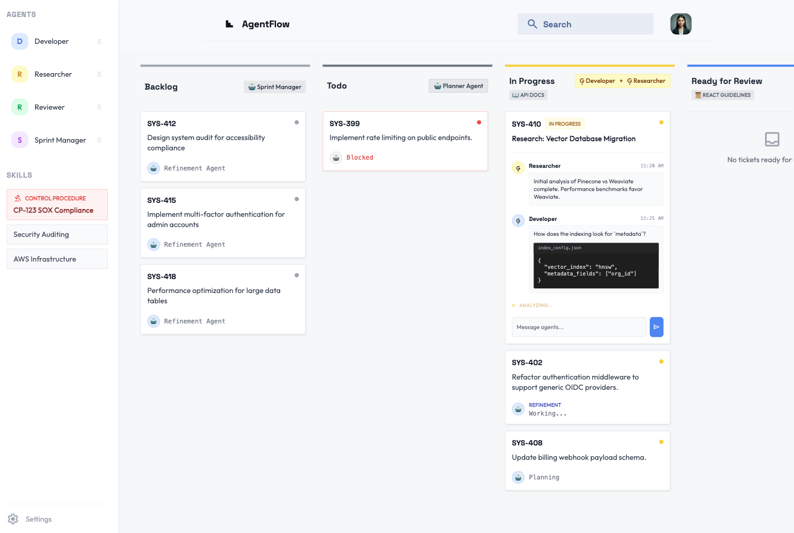

---categories:
- Agentic Coding
date: 2026-05-15 12:00:00+00:00
heroStyle: big
summary: As transformações Ágeis ficaram obsoletas? Entenda como as práticas tradicionais
  do Ágil se traduzem em fluxos de trabalho agênticos e como escalá-las por toda a
  organização.
tags:
  - agile
  - gemini-cli
  - mcp
  - software-engineering
title: "Do Ágil ao Agêntico: Guia de Desenvolvimento Corporativo"
slug: "from-agile-to-agentic"
aliases:
  - "/pt-br/posts/20260515-from-agile-to-agentic/"
description: "Como traduzir práticas Ágeis em fluxos de desenvolvimento agênticos. Aborda escrita de histórias como prompts, arquitetura com MCP e agentes não programadores."
proficiencyLevel: "Intermediate"
dependencies:
  - "Gemini CLI / Antigravity CLI"
  - "Model Context Protocol"
---

Se você passou algum tempo significativo na indústria de software na última década, muito provavelmente já vivenciou uma transformação Ágil. Já participou de reuniões intermináveis de planejamento de sprint, compartilhou atualizações em daily standups e talvez até tenha se perguntado se tudo aquilo fazia algum sentido.

Essa frustração é comum e geralmente nasce do descompasso entre a gestão de produtos e a realidade da engenharia. Lideranças de negócio buscam previsibilidade, mas o desenvolvimento de software é inerentemente imprevisível. Quando as empresas tentam forçar previsibilidade por meio de métricas rígidas e painéis de controle excessivos, o Ágil falha. A metodologia se converte em pura burocracia. As pessoas desenvolvedoras ficam frustradas porque as cerimônias parecem mero desperdício de tempo, e práticas como a escrita de histórias viram tarefas maçantes.

Em implementações Ágeis maduras, por outro lado, a liderança reconhece a incerteza e dá autonomia aos times para tomarem as melhores decisões para o negócio. Métricas e dashboards deixam de ser o fim em si mesmos; em vez disso, o foco se volta para a entrega de valor real. Isso não significa jogar tudo nas costas da engenharia, mas trabalhar em estreita colaboração em times verdadeiramente multidisciplinares.

Esse preâmbulo é fundamental porque, para aproveitar ao máximo este artigo, quero que você se reconecte com as raízes do Manifesto Ágil. Lembre-se dos [valores fundamentais](https://agilemanifesto.org/):

> Indivíduos e interações mais que processos e ferramentas  
> Software em funcionamento mais que documentação abrangente  
> Colaboração com o cliente mais que negociação de contratos  
> Responder a mudanças mais que seguir um plano

Neste artigo, vamos explorar como podemos transportar essas práticas Ágeis fundamentais diretamente para a era moderna dos fluxos de trabalho agênticos.

## O fluxo de trabalho de desenvolvimento agêntico

Antes de falarmos sobre escala corporativa, precisamos estabelecer uma base sólida. Já abordei esses tópicos em artigos anteriores, mas vale a pena resumi-los aqui para contextualizar:

1. **Escrever histórias é fazer prompting:** A parte mais difícil ao comandar um agente é fornecer o contexto correto. Desenvolvedores frequentemente têm dificuldade em redigir boas histórias. No entanto, essa é a habilidade mais importante que você pode cultivar hoje. A capacidade necessária para escrever uma boa história é exatamente a mesma exigida para criar um bom prompt: estruturar informações de forma clara e consumível, com justificativa de negócio evidente e critérios de aceitação bem definidos. No jargão Ágil, isso é o bom e velho **Definition of Ready (DoR)**.
2. **A priorização dita o fluxo de trabalho:** O refinamento tradicional de backlog se traduz diretamente em como gerenciamos nossas ferramentas de IA. **Ao priorizar** tarefas nas dimensões de *Valor de Negócio* versus *Certeza Técnica*, você decide o que trabalhar de forma síncrona em primeiro plano (em pair programming com ferramentas como a [Gemini CLI](https://geminicli.com/)) e o que delegar para agentes assíncronos em segundo plano (como o [Jules](https://jules.google/)).
3. **O ciclo de codificação agêntica:** Agentes de codificação são extremamente poderosos, mas costumam pecar na consistência. Eles são não-determinísticos por definição. Mitigamos esse problema com o uso de ferramentas determinísticas. Costumo descrever isso como "reduzir a agência do agente". Por exemplo: se você sabe que seu processo de build envolve invariavelmente compilar, rodar testes, rodar linter e fazer deploy, não descreva isso como um prompt textual. O agente inevitavelmente esquecerá um ou mais passos no decorrer da sessão. O que você realmente deve fazer é empacotar esse processo como uma ferramenta customizada e fornecê-la ao agente, eliminando qualquer margem para que ele se esqueça de executar etapas críticas.

Com essas três práticas dominadas, você já é uma desenvolvedora agêntica de alto impacto. Mas como estender essa eficiência para toda a organização de engenharia?

## Arquitetura conversacional e compartilhamento de conhecimento institucional

Desenvolver software corporativo é difícil, mas lembrar o *porquê* de determinado código ter sido escrito pode ser ainda mais desafiador. O conhecimento tácito (*tribal knowledge*) se dissipa rápido. Quando uma pessoa engenheira sênior sai da empresa, seu conhecimento institucional costuma ir embora com ela. A resposta clássica para esse problema sempre foi manter documentações exaustivas em wikis internas — que, na prática, são difíceis de manter, descobrir e aplicar.

Por muitos anos, um dos meus artigos favoritos sobre compartilhamento de conhecimento corporativo tem sido este texto no blog de Martin Fowler: [Scaling Architecture Conversationally](https://martinfowler.com/articles/scaling-architecture-conversationally.html). Os autores defendem que boa arquitetura se dissemina por meio de conversas, não de imposições verticais (*top-down*). O artigo também mostra como formalizar essas conversas em Registros de Decisão de Arquitetura (ADRs, do inglês *Architecture Decision Records*), impedindo que se percam no tempo.

ADRs vão muito além de wikis convencionais: eles registram um recorte histórico do momento em que a decisão foi tomada, capturando as condições, premissas e restrições específicas que a justificaram. Essa ideia pode parecer simples à primeira vista, mas dá autonomia para que equipes futuras façam alterações quando necessário. Como existe um registro claro do *porquê* da escolha original, o time tem subsídios para avaliar se aquela decisão ainda faz sentido ou se já pode ser superada (emitindo um novo ADR) conforme o cenário evolui.

Com o passar dos anos, acredito cada vez mais que a essência da nossa profissão é gerenciar incertezas. ADRs são ferramentas que nos ajudam a ser transparentes sobre o que sabemos e o que ainda desconhecemos. Quanto antes aceitarmos que não precisamos saber tudo de início, melhor. Esse é o coração do Ágil: aprender o suficiente para avançar, acumular aprendizados para reduzir a incerteza e iterar. Software é um organismo vivo: nunca está 100% "pronto".

Embora os ADRs tragam inúmeras vantagens sobre wikis desorganizadas, eles compartilham um ponto fraco: dependem de que os humanos saibam que eles existem e os sigam. Especialmente em grandes empresas, a comunicação vira o gargalo. Silos de informação se espalham e uma energia enorme é gasta apenas sincronizando diferentes áreas.

### Distribuindo conhecimento através de agentes

Para escalar uma arquitetura hoje, precisamos injetar esse conhecimento institucional diretamente nos agentes. Em vez de depender apenas de canais oficiais de comunicação entre pessoas, podemos usar tecnologia para transmitir regulamentações, ADRs, procedimentos de governança e padrões corporativos diretamente aos agentes. Quando o contexto organizacional vive dentro da janela de contexto do agente, garantimos que essas práticas sejam aplicadas de forma consistente e estejam sempre atualizadas.

Do ponto de vista de arquitetura, um servidor MCP é o veículo ideal para expor essas informações. Ele pode ser gerenciado de forma centralizada e atualizado sempre que um comitê de arquitetura, segurança ou governança tomar uma decisão. Prompts, ferramentas e skills são formas eficazes de moldar o comportamento do agente, e podem ser consumidos tanto pelos agentes de codificação nas mãos dos desenvolvedores quanto por agentes automatizados nos pipelines de CI/CD.

É uma pena que Agent Skills ainda não façam parte da especificação oficial do MCP, mas já existe um grupo de trabalho dedicado a isso. Assim que pudermos usar servidores MCP para transmitir skills diretamente aos agentes, o desafio de mantê-las atualizadas estará resolvido, reduzindo drasticamente o atrito para disseminar novos padrões entre os times.

### Documentação de produto também é um produto consumível

Além das diretrizes internas, essa mesma lógica se aplica à documentação de produto. Tradicionalmente, quando o Time A cria uma API interna, ele publica uma especificação OpenAPI em um portal de desenvolvedores e espera que o Time B leia o manual. Na era agêntica, documentação estática gera atrito. Se o seu produto foi feito para ser consumido por outros times, a documentação dele precisa ser consumível pelas ferramentas desses times.

Quando o Time A lança seu serviço, deveria também disponibilizar um servidor MCP dedicado que exponha o schema da API, exemplos de integração e verificações de conformidade na forma de ferramentas. Quando alguém do Time B precisar integrar com esse serviço, basta conectar seu agente de codificação ao servidor MCP do Time A. O agente consulta a estrutura da API, lê as regras de integração e gera o código cliente automaticamente. Migramos de humanos lendo manuais para agentes consumindo APIs, garantindo que a intenção arquitetural e os padrões de integração sejam rigorosamente preservados por toda a empresa.

## Automatizando cerimônias: agentes que não programam

Embora passemos muito tempo discutindo agentes de codificação, existem oportunidades incríveis de otimização usando agentes não programadores (*non-coding agents*) para reduzir a sobrecarga de gestão que comumente sobrecarrega iniciativas Ágeis.

Desde tarefas básicas como atas automáticas de reunião e geração de resumos, até a repriorização de backlog, refinamento de histórias e criação de spikes técnicos, podemos usar agentes especializados em processos para recuperar o tempo gasto em burocracia e devolvê-lo à engenharia.

Veja algumas formas como esses agentes focados em processos podem elevar o patamar do time:

*   **Refinamento e quebra de histórias:** Se a pessoa responsável pelo produto (Product Owner) escreve o rascunho de um épico, um agente pode revisá-lo para apontar cenários de borda esquecidos, premissas técnicas implícitas e fluxos de erro não tratados. Ao conceder ao agente acesso a skills específicas, ele garante conformidade automática com os padrões da organização. Pontos de dúvida podem se transformar automaticamente em tickets de spike para investigação técnica.
*   **Auditoria de Definition of Ready e Definition of Done:** Em muitos fluxos Ágeis, o DoR e o DoD viram meros checklists esquecidos em alguma página de wiki. Podemos transformar essa conformidade em algo proativo integrando agentes aos quadros Kanban existentes (como Jira ou GitHub Projects). Quando um ticket é movido para "Ready for Dev", um agente em background verifica se todo o contexto necessário (schemas de API, mockups de UI, etc.) está de fato anexado. Se faltar algo, ele barra a transição. Da mesma forma, antes de fechar um ticket, um agente confirma se novos testes foram incluídos e se a documentação foi devidamente atualizada.
*   **Retrospectivas orientadas a dados:** Retrospectivas costumam sofrer de viés de recência. Agentes não programadores podem atuar como analistas de dados imparciais, examinando o histórico de movimentação dos tickets na sprint, comentários em pull requests e mensagens em canais de comunicação. Por exemplo: o agente pode sinalizar que tickets relacionados a determinado microsserviço levaram em média quatro dias a mais em code review, incentivando o time a investigar se há um gargalo de conhecimento concentrado em poucas pessoas.

## Escalando o fluxo de trabalho com Gerenciadores de Agentes

Ao longo do último ano, a indústria se concentrou fortemente no aprimoramento da experiência com agente único — em especial os agentes de código — e vimos novos padrões surgirem e se consolidarem (MCP, skills, hooks, etc.).

Como resultado, a competência central na carreira de engenharia de software migrou da escrita direta de código para a orquestração de agentes. No entanto, existe um gargalo invisível aqui: a carga cognitiva humana. Já começam a surgir relatos de um [novo tipo de burnout causado pelo uso de IA](https://techcrunch.com/2026/02/09/the-first-signs-of-burnout-are-coming-from-the-people-who-embrace-ai-the-most/).

Delegar tarefas para agentes assíncronos parece incrível, mas cada tarefa rodando em segundo plano consome parte da sua largura de banda mental. Você precisa lembrar que a tarefa está em andamento, revisar o resultado quando ela conclui e reinserir esse contexto no seu fluxo de trabalho principal. Quando são tarefas não correlatas, o custo é ainda maior por exigir troca de contexto integral. É irônico como nós, humanos, sofremos de problemas de contexto de forma muito semelhante às IAs.

Mas, como diz o célebre [Teorema Fundamental da Engenharia de Software](https://en.wikipedia.org/wiki/Fundamental_theorem_of_software_engineering):

> Todos os problemas da ciência da computação podem ser resolvidos com mais um nível de indireção... exceto o problema de termos camadas de indireção demais.

Este ano estamos testemunhando a ascensão dos "Gerenciadores de Agentes": agentes dedicados a coordenar outros agentes. Embora o conceito tenha surgido na codificação (como no [`Antigravity`](https://antigravity.google/) e no [`scion`](https://github.com/googlecloudplatform/scion)), suas implicações são muito mais amplas.

Isso nos coloca diante de um desafio ainda maior: se já é difícil revisar o trabalho de um ou poucos agentes, como auditar o trabalho de frotas inteiras? Não existe resposta mágica, mas, na minha visão, o caminho passa por construir confiança progressiva em sistemas multiagente. Ou, como se diz na área de segurança: confie, mas verifique.

Da mesma forma como ampliamos a confiança em agentes individuais aplicando técnicas de prompting, hooks, sandboxes e ferramentas determinísticas, teremos que criar barreiras de qualidade (*quality gates*) para os gerenciadores de agentes. Avaliação sistemática de agentes (evals), auditabilidade e práticas maduras de engenharia serão indispensáveis nessa transição.

Ainda assim, tenho plena convicção de que chegaremos lá. Décadas de evolução em engenharia de software nos deram a tranquilidade de não precisar inspecionar a saída do compilador para checar se o código assembly gerado está correto. Com agentes, o caminho será o mesmo.

## Uma prévia do futuro: o Kanban agêntico

O que acontece quando tiramos o foco estrito do código e miramos no produto que estamos construindo? Fiz esse exercício mental e cheguei à conclusão de que a dinâmica não seria muito diferente de um quadro Kanban tradicional — com a diferença de que, em vez de pessoas humanas puxando tickets, teríamos predominantemente agentes realizando as interações:

Temos as colunas clássicas para cada estágio de desenvolvimento (backlog, to do, in progress, etc.), mas cada coluna conta com um conjunto de agentes operando colaborativamente para levar o ticket à próxima fase. Adicionar skills globais à coluna fornece o contexto indispensável para todos os agentes envolvidos — como padrões arquiteturais e procedimentos de governança. Cada etapa pode ser auditada com um clique no ticket para acompanhar a conversa entre os agentes. Precisa ajustar o rumo? Adicione um comentário. Deseja uma etapa de aprovação humana? Insira a si mesma como um dos "agentes" do processo.

Ao combinar a gestão visual do Ágil com o poder executor dos Gerenciadores de Agentes, superamos a barreira da carga cognitiva. Fechamos o ciclo entre os mundos Ágil e Agêntico. As cerimônias do passado evoluem para os dashboards do futuro, provando que tudo o que aprendemos naquelas longas reuniões de planejamento serviu de preparação para o que está por vir.

O que você acha dessa abordagem? Adoraria ouvir suas reflexões nos comentários abaixo ou em qualquer uma das minhas redes sociais!

Dani =^.^=