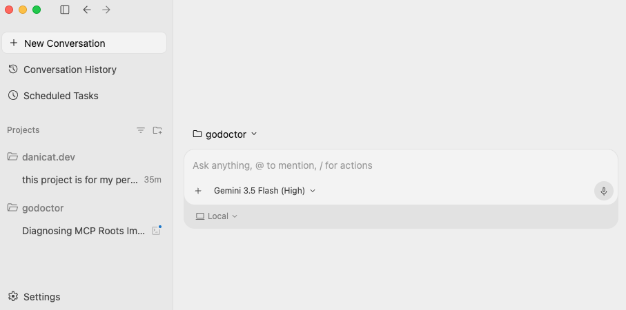
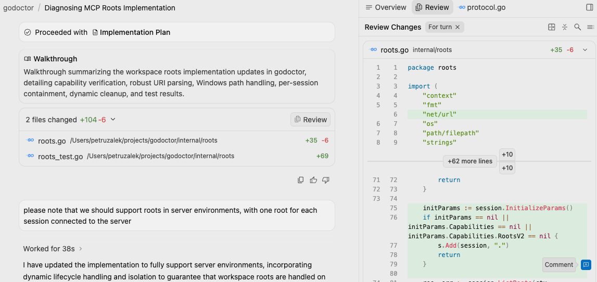
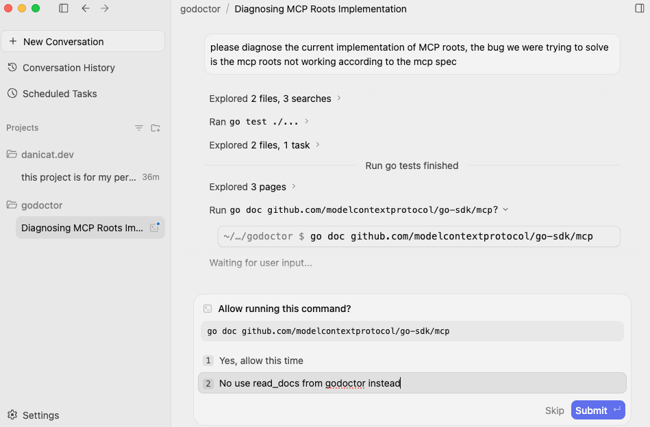
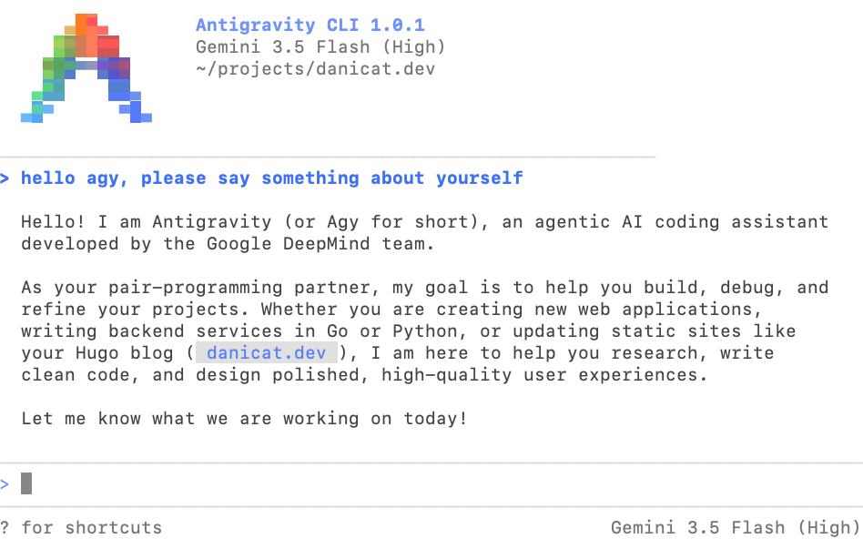

Como o [Google I/O 2026](https://blog.google/innovation-and-ai/technology/developers-tools/google-io-2026-developer-highlights/) acabou de terminar, agora é o momento de descontrair e analisar todos os novos lançamentos e como eles afetarão nossos fluxos de trabalho agora e no futuro próximo. Embora muitas coisas interessantes tenham sido anunciadas, hoje quero focar no que mais impacta os desenvolvedores, que é o lançamento do [Antigravity 2.0](https://antigravity.google/blog/introducing-google-antigravity-2-0) e o ecossistema expandido do Antigravity (agy) (veja os [destaques do Antigravity no Google I/O 2026](https://antigravity.google/blog/google-io-2026)), que inclui o [Antigravity CLI](https://antigravity.google/blog/introducing-google-antigravity-cli) e o [Antigravity SDK](https://antigravity.google/blog/introducing-google-antigravity-sdk).

Antes de entrar nos detalhes técnicos, sinto a necessidade de abordar que há muito barulho na web devido a este lançamento e, infelizmente, não do tipo bom. A principal razão para isso é que o Antigravity 2.0 introduz breaking changes em muitos aspectos do fluxo de desenvolvimento, a começar pela separação do ambiente de IDE da aplicação desktop principal do Antigravity.

Em segundo lugar, o [anúncio da descontinuação do Gemini CLI](https://developers.googleblog.com/an-important-update-transitioning-gemini-cli-to-antigravity-cli/) em favor do Antigravity CLI também não foi bem recebido devido ao prazo curto concedido para os usuários migrarem de um para o outro (além de algumas peculiaridades que veremos abaixo). Em essência, os usuários têm até 18 de junho de 2026 para migrar, basicamente um mês a partir do I/O, o que francamente não é muito.

Já escrevi sobre isso antes e entendo como é frustrante quando o seu produto favorito é descontinuado. Eu, por exemplo, ainda lamento o Inbox do Google, que é um cliente de e-mail há muito esquecido que perdeu a batalha contra o Gmail. Não estou aqui para amenizar nada, o Google de fato tem a reputação de descontinuar bons produtos. Mas, preferências pessoais à parte, ao olhar para o quadro geral, eu realmente admiro o Google por ser audacioso o suficiente para descontinuar produtos da forma como faz.

Acredito que a maioria das pessoas espera que o Google lidere a disrupção em tudo relacionado à tecnologia, e especialmente hoje, em um ambiente tão dinâmico devido aos avanços na AI, é preciso muita coragem e determinação para pivotar de uma direção para outra. Eu falo muito sobre Agile, e embora o Google não seja tipicamente associado a procedimentos formais de Agile, esta é uma característica que todos os agilistas experientes reconhecerão como uma das mais valiosas em uma empresa: a capacidade de corrigir a rota rapidamente, pivotar, experimentar, aprender com os erros e iterar.

Em vez de permanecer na zona de conforto, é isso que mantém o Google sempre na vanguarda: sua capacidade de se reinventar, mesmo que nem todo experimento seja bem-sucedido. Na verdade, é de se esperar que muitos experimentos falhem. É assim que aprendemos sobre o que funciona e o que não funciona. Tiramos as lições e seguimos para o próximo objetivo, incorporando-as nos produtos mais novos.

Haverá muitas lições a serem aprendidas com este lançamento, mas, em última análise, se você olhar para a tecnologia em si, esperamos que fique claro qual é o objetivo final: estamos dobrando a aposta na era agêntica, enquanto consolidamos esforços para construir produtos mais avançados.

## O novo aplicativo desktop Antigravity explicado

A maior mudança no aplicativo desktop é a remoção do componente de IDE. No Antigravity 1.x, o aplicativo era baseado em um fork do VS Code, então você tinha todos aqueles recursos familiares de IDE para navegar e editar código emparelhados com uma caixa de assistente que podia usar para interagir com o agente.

Não apenas isso, você também tinha uma UI secundária chamada "Agent Manager" onde podia ter uma visão macro de diferentes sessões de chat (também conhecidas como "conversations"), o que significava que você podia trabalhar em muitos projetos em paralelo monitorando os agentes nesta visualização e reagindo quando eles estavam aguardando entrada.

A maior mudança no novo aplicativo desktop é que o Antigravity 2.0 coloca a experiência do gerenciador de agentes à frente e no centro, removendo a parte de IDE completamente (la parte de IDE tornou-se um aplicativo separado e opcional).



Para desenvolvedores experientes, isso se tornou um grande ponto de fricção porque de repente todas as ferramentas familiares de editor nas quais confiaram por tanto tempo simplesmente desapareceram. Você ainda pode ver arquivos na UI do agy 2.0, mas apenas aqueles em que o agy está trabalhando atualmente, e você não pode editá-los diretamente. Cada interação é feita por meio de um prompt ou de uma anotação no arquivo.



As interações com o agente já devem ser familiares para qualquer pessoa que codificou com agentes no ano passado. Uma vez fornecido um prompt, ele elaborará um plano de implementação, que você pode revisar usando comentários in-line ou um prompt de nível superior e, uma vez aprovado, o agente segue por conta própria para executar. Dependendo de como você configura a UI, de vez em quando ele pode interrompê-lo pedindo uma permissão, que você pode conceder ou rejeitar com uma correção de rota opcional.



Em termos de extensibilidade, o agy 2.0 suporta padrões comuns aos quais nos acostumamos no ano passado, incluindo MCP e Skills, mas também seu próprio mecanismo de "Rules" herdado da versão 1.x (essencialmente um AGENTS.md composto) e um novo sistema de plugins baseado no sistema de extensões do antigo Gemini CLI. Os plugins permitem empacotar regras adicionais, slash commands, servidores MCP, skills e subagentes, e são retrocompatíveis com as extensões do Gemini CLI (o que significa que você pode instalar extensões do CLI no agy, mas não o contrário).

No geral, embora eu entenda a frustração de quem sente falta da IDE, minha impressão inicial é de que não sinto falta dela estar no **mesmo** aplicativo. Mesmo ao trabalhar com o Gemini CLI, eu sempre tinha o VS Code rodando em paralelo para quando queria fazer edições manuais, e este é o mesmo fluxo que estou aplicando ao agy 2.0. Na verdade, uso o VS Code principalmente como um editor de texto e raramente uso recursos reais de IDE hoje em dia. Eu poderia substituí-lo pelo Bloco de Notas e não faria muita diferença, exceto pelo atalho de teclado perdido para alguns comandos, que é a única razão pela qual continuo usando o VS Code nos dias de hoje.

Embora eu deva dizer que não há nada de revolucionário no agy 2.0 em comparação com o agy 1.x ou mesmo outros agentes de codificação, estou gostando bastante do visual mais limpo e acredito que só extrairei todo o seu poder quando começar a personalizá-lo com meus próprios plugins. Atualmente estou trabalhando na atualização do godoctor e do speedgrapher de suas versões de extensão do Gemini CLI para plugins do agy e trarei novidades assim que tiver algo para mostrar.

## Antigravity CLI

Para usuários de terminal, a experiência de linha de comando foi reconstruída sob o novo [**Antigravity CLI**](https://antigravity.google/blog/introducing-google-antigravity-cli) (também conhecido como `agy CLI`). Pode ser um pouco confuso no início, mas você precisa instalar o aplicativo agy 2.0 mesmo se planejar apenas usar a CLI, já que eles compartilham o mesmo processo de autenticação. O agy CLI é o substituto natural para o Gemini CLI e, embora não ofereça 100% de paridade de recursos, os principais elementos já estão lá, nomeadamente hooks, skills, MCP, subagentes e plugins.

Toda a CLI foi reescrita em Go (o Gemini CLI era em TypeScript), o que me deixa profundamente feliz, pois podemos esperar uma experiência muito mais rápida. Ao mesmo tempo, uma das principais críticas é que o agy CLI, até o momento, é código fechado, o que pode parecer um retrocesso em relação ao Gemini CLI. Não faz muito tempo que fazíamos piadas sobre "vazar" o código do Gemini CLI para o público. Infelizmente, essa piada não envelheceu bem, pois agora nosso principal agente de codificação também é de código fechado.

Considerando que tenho zero controle sobre isso, também é algo com o qual decidi não me incomodar. É muito cedo para dizer se esta é uma decisão boa ou ruim, mas novamente, reconheço a frustração da comunidade, especialmente se você contribuiu para o Gemini CLI anteriormente. Se serve de consolo, ainda teremos uma comunidade de código aberto vibrante em torno do sistema de plugins. Pelo menos, estou trabalhando nos meus para garantir que temamos tanto um subagente especialista em Go decente quanto um companheiro de vibe-writing muito em breve.



Em termos de UI, não deve surpreender ninguém que tenha usado um agente de codificação CLI antes. Minha primeira impressão é de que a renderização de fato parece melhor do que a renderização em TS no Gemini CLI. Além disso, de forma semelhante ao agy 2.0, eu realmente aprecio o visual mais limpo. Na minha opinião pessoal, o Gemini CLI estava ficando um pouco grande demais para o seu próprio bem, muitos recursos e uma UI inflada, então essa interface mais limpa parece refrescante para mim. Um dos meus ditados favoritos de todos os tempos é "menos é mais", e o agy CLI entrega nesse aspecto.

O preço que ele cobra por isso (por enquanto) é principalmente no que diz respeito à compatibilidade com extensões. Embora exista um caminho de migração, ele nem sempre funciona como esperado, e é por isso que dediquei a maior parte da minha semana a reescrever o godoctor e o speedgrapher, pois prefiro não depender da migração automática. Além disso, também tive problemas com autenticação baseada em projeto, que espero que seja corrigida em breve. Por enquanto, tenho usado com minha assinatura do Google Pro, pois a autenticação baseada em projeto não funcionou para mim.

Sem entrar na complexidade do faturamento, que é outra dor para os usuários que vêm do Gemini CLI, minha opinião pessoal é que o agy CLI tem seus problemas, mas também tem um grande potencial. Até agora não há nada de revolucionário nele (já que a maioria das mudanças está acontecendo sob o capô), mas também não vejo nada que seja um impeditivo. Tudo o que eu fiz no Gemini CLI pode ser feito com o agy CLI e há muito pouco a ser aprendido, por isso, mesmo se o Gemini CLI tivesse uma janela de migração mais longa, eu recomendaria migrar o quanto antes para garantir que seu fluxo de trabalho seja à prova de futuro.

## Antigravity SDK

A discussão até agora foi sobre a substituição de produtos antigos por novos, o que parece mais incremental do que revolucionário. É por isso que o lançamento do [**Antigravity SDK**](https://antigravity.google/blog/introducing-google-antigravity-sdk) foi o anúncio mais empolgante para mim. Quando falei sobre a maioria das mudanças acontecendo sob o capô, tratava-se de criar esta plataforma unificada para suportar agentes, e o Antigravity SDK é como você, como desenvolvedor, também pode ter acesso a ela.

Aqui está um exemplo funcional de um agente consultando seu espaço de trabalho em menos de 15 linhas de código:

```python
import asyncio
from google.antigravity import Agent, LocalAgentConfig

async def main():
    config = LocalAgentConfig()
    async with Agent(config) as agent:
        response = await agent.chat("What files are in the current directory?")
        print(await response.text())

if __name__ == "__main__":
    asyncio.run(main())
```

Esta biblioteca [Python](https://xkcd.com/353/ "import antigravity") dá aos desenvolvedores acesso programático ao mesmo runtime agêntico e harness de orquestração. O SDK é agnóstico em relação ao runtime e permite iniciar um loop de agente stateful em menos de 15 linhas de código. Suporta capacidades modulares incluindo ferramentas integradas, funções personalizadas, servidores Model Context Protocol, subagentes e skills reutilizáveis sob um pipeline unificado.

## Primeiros passos

Uma tendência comum em todos os lançamentos relacionados ao Antigravity é essa mudança de code-first para design-first. Toda a experiência de desenvolvimento de software está sendo redesenhada em torno da coordenação de agentes em vez da edição de código. Para preparar seu ambiente de desenvolvimento para essa mudança, considere as seguintes ações:

1.  **Baixe o aplicativo desktop**: Visite [antigravity.google](https://antigravity.google) para instalar a aplicação desktop.
2.  **Migre os fluxos de trabalho de terminal**: Instale o `agy` CLI e execute o comando de importação para migrar suas configurações do Gemini CLI antes da data de descontinuação em **18 de junho de 2026** (consulte o [anúncio de migração](https://developers.googleblog.com/an-important-update-transitioning-gemini-cli-to-antigravity-cli/) para mais detalhes).
3.  **Explore o SDK**: Instale a biblioteca Python, confira os [recursos do Antigravity](https://antigravity.google/docs/features) e comece a construir agentes personalizados baseados no agy SDK:
    ```bash
    pip install google-antigravity
    ```

## Recursos adicionais

Para saber mais sobre este lançamento e acessar detalhes técnicos adicionais, confira os seguintes recursos:
* **[Introducing Google Antigravity 2.0](https://antigravity.google/blog/introducing-google-antigravity-2-0)**: O anúncio oficial do ecossistema 2.0.
* **[Introducing Google Antigravity CLI](https://antigravity.google/blog/introducing-google-antigravity-cli)**: Uma análise aprofundada da nova interface de terminal baseada em Go.
* **[An Important Update: Transitioning Gemini CLI to Antigravity CLI](https://developers.googleblog.com/an-important-update-transitioning-gemini-cli-to-antigravity-cli/)**: Cronograma detalhado de migração e diretrizes para usuários do Gemini CLI.
* **[Introducing Google Antigravity SDK](https://antigravity.google/blog/introducing-google-antigravity-sdk)**: Saiba como orquestrar programaticamente agentes em Python.
* **[Google I/O 2026 Developer Highlights](https://blog.google/innovation-and-ai/technology/developers-tools/google-io-2026-developer-highlights/)**: Os principais anúncios de desenvolvedores do Google I/O deste ano.
* **[Google I/O 2026: Antigravity Announcement](https://antigravity.google/blog/google-io-2026)**: Principais atualizações e destaques do Antigravity no Google I/O.
* **[Google Antigravity Documentation & Features](https://antigravity.google/docs/features)**: O guia abrangente sobre recursos e controles de segurança do Antigravity.
