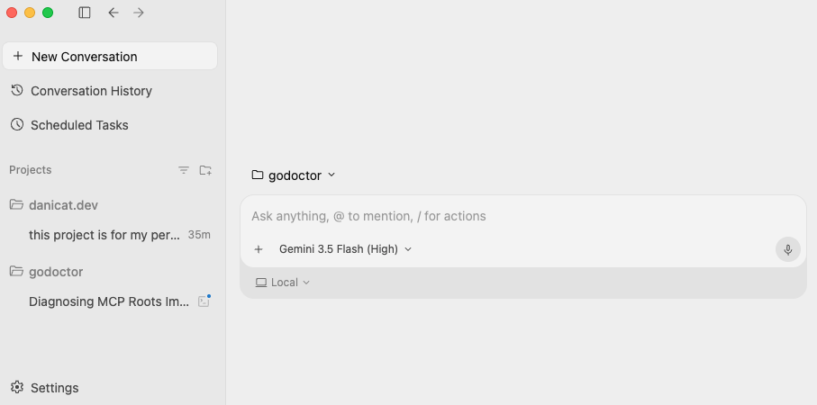
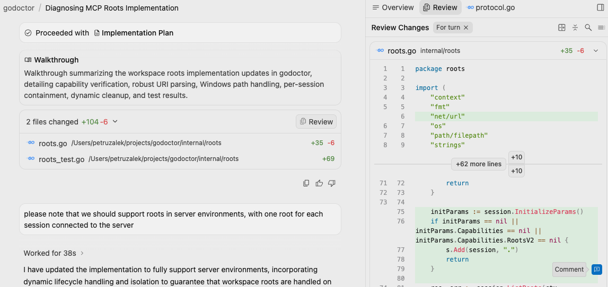
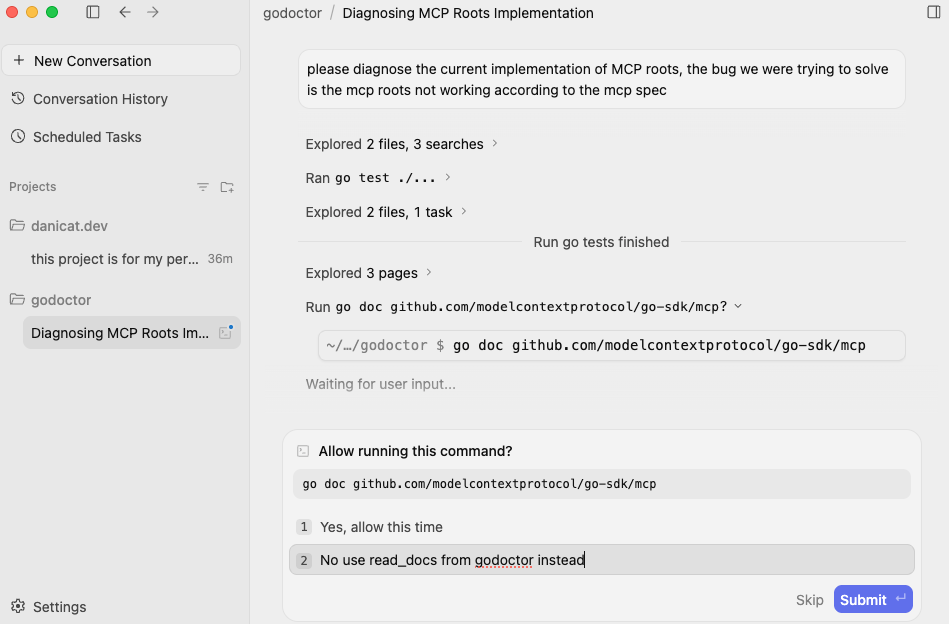
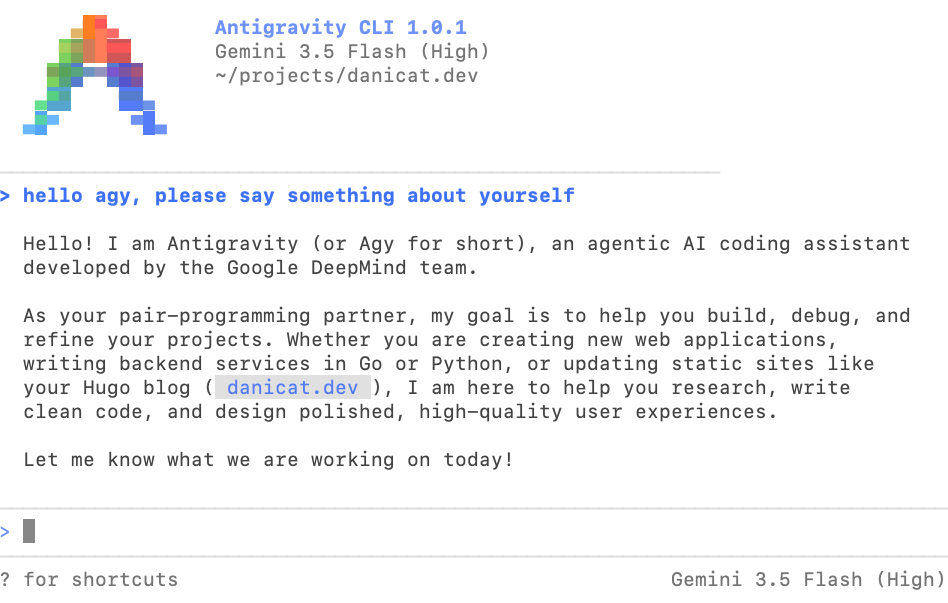

---categories:
- Agentic Coding
date: 2026-05-21 11:00:00+00:00
heroStyle: big
summary: Um guia para o ecossistema Google Antigravity 2.0 anunciado no Google I/O
  2026. Analisamos a aplicação desktop independente, a CLI de terminal baseada em Go
  e o SDK programático em Python.
tags:
  - antigravity
  - cli
  - google-cloud
  - python
  - sdk
title: "O Guia do Mochileiro para o Antigravity 2.0"
slug: "the-hitchhikers-guide-to-antigravity-2-0"
aliases:
  - "/pt-br/posts/20260521-the-hitchhikers-guide-to-antigravity-2-0/"
description: "Guia completo do ecossistema Google Antigravity 2.0 anunciado no Google I/O 2026. Analisa o app desktop Agent Manager, a CLI em Go e o SDK em Python."
proficiencyLevel: "Intermediate"
dependencies:
  - "Google Antigravity 2.0"
  - "google-antigravity Python SDK"
  - "Go 1.22+"
---

Com o encerramento do [Google I/O 2026](https://blog.google/innovation-and-ai/technology/developers-tools/google-io-2026-developer-highlights/), chegou a hora de assimilar todos os novos lançamentos e entender como eles afetam nossos fluxos de trabalho agora e em um futuro próximo. Embora muitas novidades interessantes tenham sido anunciadas, hoje quero focar no que mais impacta as pessoas desenvolvedoras: o lançamento do [Antigravity 2.0](https://antigravity.google/blog/introducing-google-antigravity-2-0) e a expansão do ecossistema Antigravity (`agy`) (veja os [destaques do Antigravity no Google I/O 2026](https://antigravity.google/blog/google-io-2026)), que inclui a [Antigravity CLI](https://antigravity.google/blog/introducing-google-antigravity-cli) e o [Antigravity SDK](https://antigravity.google/blog/introducing-google-antigravity-sdk).

Antes de entrar nos detalhes técnicos, sinto a necessidade de comentar sobre o burburinho na web em torno desse lançamento — e, infelizmente, não no bom sentido. O principal motivo é que o Antigravity 2.0 introduz mudanças estruturais drásticas (*breaking changes*) em vários aspectos do fluxo de desenvolvimento, a começar pela separação do ambiente de IDE da aplicação desktop principal do Antigravity.

Em segundo lugar, o [anúncio da descontinuação da Gemini CLI](https://developers.googleblog.com/an-important-update-transitioning-gemini-cli-to-antigravity-cli/) em prol da Antigravity CLI também não foi bem recebido por causa do prazo apertado concedido para a migração (além de algumas peculiaridades que veremos adiante). Basicamente, as pessoas usuárias têm até 18 de junho de 2026 para migrar — um mês após o I/O, o que, convenhamos, é pouquíssimo tempo.

Já escrevi sobre isso antes e compreendo perfeitamente a frustração de ver seu produto preferido ser descontinuado. Eu mesma ainda sinto saudades do finado Google Inbox, aquele cliente de e-mail incrível que perdeu a batalha interna contra o Gmail. Não estou aqui para dourar a pílula: o Google tem, de fato, a fama de aposentar produtos excelentes. Mas, deixando preferências pessoais de lado e olhando para o quadro geral, admiro a coragem do Google em descontinuar produtos com essa determinação quando decide mudar de rumo.

Acredito que a maioria das pessoas espera que o Google lidere a disrupção tecnológica e, especialmente hoje, em um cenário tão dinâmico impulsionado pela IA, é preciso muita coragem para pivotar de estratégia. Falo bastante sobre o universo Ágil e, embora o Google não seja tipicamente associado a metodologias ágeis formais, essa é uma qualidade que qualquer agilista experiente reconhece como uma das mais valiosas em uma organização: a capacidade de corrigir a rota rapidamente, pivotar, experimentar, aprender com os erros e iterar.

Em vez de permanecer na zona de conforto, é isso que mantém o Google na vanguarda: sua capacidade constante de se reinventar, mesmo que nem todo experimento vingue. Na verdade, é de se esperar que muitos experimentos fracassem. É assim que descobrimos o que funciona e o que não funciona. Absorvemos as lições e seguimos para o próximo desafio, incorporando esses aprendizados nos produtos seguintes.

Haverá muitas lições a serem tiradas desse lançamento, mas, no fim das contas, analisando a tecnologia em si, o objetivo final fica claro: estamos dobrando a aposta na era agêntica e unificando esforços para construir soluções ainda mais avançadas.

## O novo aplicativo desktop Antigravity por dentro

A maior mudança no aplicativo desktop foi a remoção completa do componente de IDE. No Antigravity 1.x, o app era baseado em um fork do VS Code; você tinha todos aqueles recursos clássicos de editor para navegar e editar código lado a lado com um painel de assistente para interagir com o agente.

Além disso, havia uma interface secundária chamada "Agent Manager", onde era possível ter uma visão panorâmica de várias sessões de chat em paralelo (as chamadas *conversations*). Isso permitia tocar múltiplos projetos simultaneamente, acompanhando os agentes nessa tela e intervindo apenas quando eles solicitavam alguma entrada.

No Antigravity 2.0, a experiência do gerenciador de agentes passa a ser o centro absoluto de tudo, e a parte de IDE foi totalmente desmembrada (tornando-se um aplicativo independente e opcional).



Para desenvolvedores acostumados à rotina tradicional, isso virou um grande ponto de atrito: subitamente, todas as ferramentas de edição às quais estavam habituados não estavam mais ali. Ainda é possível visualizar arquivos na interface do agy 2.0, mas somente aqueles em que o agente está trabalhando ativamente no momento — e sem suporte a edição manual direta. Toda interação é feita por meio de prompts ou anotações no arquivo.



A dinâmica de interação com o agente já é familiar para quem vem programando com agentes no último ano. Após o prompt inicial, ele elabora um plano de implementação que você pode revisar com comentários inline ou novos prompts; uma vez aprovado, o agente segue de forma autônoma para a execução. Dependendo das configurações escolhidas, ele pode pausar pontualmente solicitando permissões, que você pode conceder ou rejeitar acompanhadas de instruções de ajuste de rota.



Em termos de extensibilidade, o agy 2.0 adota padrões consolidados no mercado, como MCP e Agent Skills, além do seu próprio sistema de "Rules" herdado da versão 1.x (essencialmente um AGENTS.md componível) e de um novo ecossistema de plugins derivado do sistema de extensões da antiga Gemini CLI. Os plugins permitem agrupar regras adicionais, comandos de barra (*slash commands*), servidores MCP, skills e subagentes, oferecendo retrocompatibilidade com extensões da Gemini CLI (isto é, você pode instalar extensões da CLI no agy, mas não o inverso).

No geral, embora compreenda a queixa de quem sente falta da IDE integrada, minha impressão inicial é positiva: não sinto falta de ter ambos no **mesmo** aplicativo. Mesmo usando a Gemini CLI, eu sempre mantinha o VS Code aberto ao lado para eventuais edições manuais, e sigo exatamente esse mesmo fluxo com o agy 2.0. Na prática, hoje uso o VS Code quase exclusivamente como editor de texto puro e raramente recorro a recursos pesados de IDE. Poderia trocá-lo pelo Bloco de Notas sem grande impacto, exceto pela memória muscular de alguns atalhos de teclado — que é o único motivo pelo qual ainda o mantenho aberto.

Apesar de não haver nada fundamentalmente revolucionário no agy 2.0 em comparação com a versão 1.x ou com outros agentes de código, estou gostando muito do visual mais limpo. Acredito que só vou extrair todo o potencial dele quando começar a customizá-lo com meus próprios plugins. No momento, estou reescrevendo o godoctor e o speedgrapher para migrá-los do formato de extensão da Gemini CLI para plugins do agy, e trarei novidades assim que tiver algo pronto.

## Antigravity CLI

Para quem prefere o terminal, a experiência de linha de comando foi remodelada na nova [**Antigravity CLI**](https://antigravity.google/blog/introducing-google-antigravity-cli) (ou simplesmente `agy CLI`). Pode soar confuso no começo, mas é necessário ter o aplicativo desktop do agy 2.0 instalado mesmo se você planeja usar apenas a CLI, já que ambos compartilham o mesmo fluxo de autenticação. A agy CLI é a sucessora natural da Gemini CLI e, embora ainda não ofereça 100% de paridade de recursos, os principais pilares já estão presentes: hooks, skills, MCP, subagentes e plugins.

Toda a CLI foi reescrita em Go (a Gemini CLI era em TypeScript), o que me deixa profundamente feliz, já que podemos esperar uma performance bem mais ágil. Por outro lado, uma das principais críticas é que a agy CLI, hoje, tem código fechado, o que soa como um retrocesso em relação à Gemini CLI. Não faz muito tempo que fazíamos piada sobre "vazar" o código da Gemini CLI para a comunidade; infelizmente a piada não envelheceu bem, já que agora nossa principal ferramenta de terminal é proprietária.

Como não tenho controle sobre isso, optei por não me estressar com o assunto. É cedo para cravar se foi uma decisão acertada ou não, mas compreendo perfeitamente a frustração da comunidade — sobretudo de quem contribuiu ativamente para a Gemini CLI. Como consolo, continuaremos tendo um ecossistema open source vibrante em torno dos plugins. Pelo menos da minha parte, estou trabalhando firme nos meus para garantir que tenhamos tanto uma subagente especialista em Go quanto uma companheira de escrita agêntica muito em breve.



Visualmente, a CLI não traz grandes surpresas para quem já está acostumada com agentes de terminal. Minha primeira impressão é que a renderização em Go ficou de fato superior à versão em TypeScript da Gemini CLI. Além disso, assim como no agy 2.0, aprecio demais a estética mais limpa. Na minha visão, a Gemini CLI estava ficando inchada demais, com recursos em excesso e uma interface poluída, então esse visual enxuto é um respiro bem-vindo. Uma das minhas frases favoritas é "menos é mais", e a agy CLI cumpre bem essa proposta.

Onde ela ainda deixa a desejar (por enquanto) é principalmente na compatibilidade com extensões legadas. Embora exista um processo de migração, ele nem sempre funciona como esperado — razão pela qual passei boa parte da semana reescrevendo o godoctor e o speedgrapher do zero, preferindo não depender da conversão automática. Além disso, tive problemas com a autenticação baseada em projeto no Google Cloud, que espero ver corrigida em breve. Por ora, tenho utilizado minha assinatura Google Pro pessoal.

Sem entrar nos meandros de faturamento (*billing*), que é outra dor de cabeça para quem migra da Gemini CLI, meu balanço é de que a agy CLI tem suas arestas, mas traz um potencial enorme. Até aqui não há nada de revolucionário (as grandes transformações aconteceram sob o capô), mas tampouco vejo impeditivos graves. Tudo o que eu fazia na Gemini CLI consigo fazer na agy CLI com pouquíssima curva de aprendizado. Assim, mesmo que o prazo de transição fosse maior, minha recomendação seria migrar o quanto antes para garantir que seu fluxo de trabalho continue atualizado.

## Antigravity SDK

Até aqui falamos basicamente sobre substituição de produtos existentes, o que tem um caráter mais incremental do que revolucionário. Por isso mesmo, o anúncio do [**Antigravity SDK**](https://antigravity.google/blog/introducing-google-antigravity-sdk) foi, de longe, o que mais me empolgou. Quando mencionei que as maiores mudanças estavam acontecendo sob o capô, tratava-se justamente da criação dessa infraestrutura unificada para orquestrar agentes — e o Antigravity SDK é a porta de entrada para que qualquer pessoa desenvolvedora acesse esse mesmo poder.

Abaixo está um exemplo funcional de um agente inspecionando seu workspace em menos de 15 linhas de código:

```python
import asyncio
from google.antigravity import Agent, LocalAgentConfig

async def main():
    config = LocalAgentConfig()
    async with Agent(config) as agent:
        response = await agent.chat("What files are in the current directory?")
        print(await response.text())

if __name__ == "__main__":
    asyncio.run(main())
```

Essa biblioteca [Python](https://xkcd.com/353/ "import antigravity") dá acesso programático exatamente ao mesmo runtime agêntico e harness de orquestração do ecossistema. O SDK é agnóstico em relação ao ambiente de execução e permite instanciar loops de agentes com estado em pouquíssimas linhas. Ele oferece suporte nativo a ferramentas embutidas, funções customizadas, servidores Model Context Protocol, subagentes e skills reutilizáveis sob um pipeline unificado.

## Primeiros passos

O fio condutor de todos os lançamentos em torno do Antigravity é a transição de um paradigma focado em código (*code-first*) para um focado em design e orquestração (*design-first*). Toda a experiência de desenvolvimento está sendo redesenhada em torno da coordenação de agentes em vez da edição manual de linhas de código. Para preparar seu ambiente para essa mudança, aqui estão os passos recomendados:

1. **Baixe o aplicativo desktop**: Acesse [antigravity.google](https://antigravity.google) e instale a aplicação desktop.
2. **Migre seus fluxos de terminal**: Instale a `agy` CLI e execute o comando de importação para migrar suas configurações da Gemini CLI antes do encerramento em **18 de junho de 2026** (confira o [anúncio oficial de migração](https://developers.googleblog.com/an-important-update-transitioning-gemini-cli-to-antigravity-cli/) para mais detalhes).
3. **Explore o SDK**: Instale o pacote Python, consulte a [documentação de recursos do Antigravity](https://antigravity.google/docs/features) e comece a construir seus próprios agentes customizados com o agy SDK:
    ```bash
    pip install google-antigravity
    ```

## Recursos adicionais
Para se aprofundar nas novidades e consultar a documentação técnica oficial, recomendo os links a seguir:
* **[Introducing Google Antigravity 2.0](https://antigravity.google/blog/introducing-google-antigravity-2-0)**: Anúncio oficial do ecossistema Antigravity 2.0.
* **[Introducing Google Antigravity CLI](https://antigravity.google/blog/introducing-google-antigravity-cli)**: Detalhes sobre a nova interface de terminal desenvolvida em Go.
* **[An Important Update: Transitioning Gemini CLI to Antigravity CLI](https://developers.googleblog.com/an-important-update-transitioning-gemini-cli-to-antigravity-cli/)**: Cronograma e orientações de migração para usuárias e usuários da Gemini CLI.
* **[Introducing Google Antigravity SDK](https://antigravity.google/blog/introducing-google-antigravity-sdk)**: Como orquestrar agentes programaticamente usando Python.
* **[Google I/O 2026 Developer Highlights](https://blog.google/innovation-and-ai/technology/developers-tools/google-io-2026-developer-highlights/)**: Resumo dos principais anúncios para desenvolvedores no Google I/O 2026.
* **[Google I/O 2026: Antigravity Announcement](https://antigravity.google/blog/google-io-2026)**: Visão geral e destaques dedicados ao Antigravity no evento.
* **[Google Antigravity Documentation & Features](https://antigravity.google/docs/features)**: Guia completo de recursos, arquitetura e controles de segurança da plataforma.

Happy coding!

Dani =^.^=
