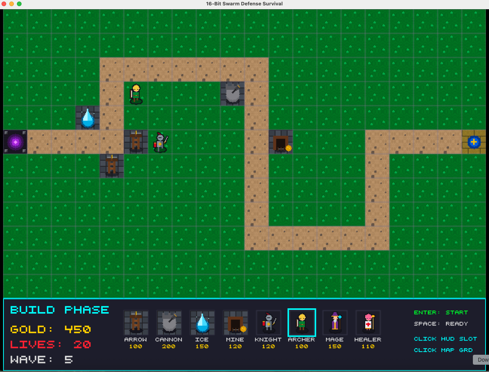

---categories:
- Agentic Coding
date: 2026-07-22 00:00:00+00:00
heroStyle: big
summary: Antigravityにおけるサブエージェント・パラダイムの進化や機能から実践的な応用までを徹底解説。複雑なエンジニアリングタスクに向けて専門サブエージェントをオーケストレーションする「swarm coding」スキルも紹介します。
tags:
  - agile
  - antigravity
  - subagents
title: "サブエージェントの台頭"
slug: "the-rise-of-the-subagents"
aliases:
  - "/ja/posts/20260722-the-rise-of-the-subagents/"
description: "Antigravityにおけるサブエージェントの進化と、Go言語での自律型コーディングスウォームをオーケストレーションするSwarm Codingスキルを解説。"
proficiencyLevel: "Intermediate"
dependencies:
  - "Google Antigravity 2.0 / agy CLI"
  - "Go 1.24+"
---
正直に告白すると、最初に**サブエージェント（subagents）**について読んだとき、私は少し懐疑的でした。個別のコンテキストウィンドウでタスクを実行するメリットは理解できましたが、並列で数十、あるいは数百ものエージェントを立ち上げるという発想はまったくありませんでした。というより、そうすることのメリットが見出せなかったと言ったほうが正確かもしれません。

バックグラウンドで2、3台のコーディングエージェントを管理するだけでも、私のメンタル帯域（脳のリソース）は大きく消費されます。私が並列で作業を行うのは、エージェントが長時間に及ぶ処理で忙しいと分かっているときだけです。2〜3台のエージェントを管理するだけでこれほど大変なのに、何百ものエージェントを並行管理するなんて、とても想像すらできませんでした。

答えにたどり着くまでにずいぶん時間がかかりましたが、その答えとは実は「**自分で管理する必要はない**」だったのです！ サブエージェントの管理責任は、エージェント自身に委ねてしまえばよいのです。「計算機科学のあらゆる問題は、新しい抽象化レイヤーを追加することで解決できる」と言いますが、今回も例外ではありませんでした。

この記事では、過去12ヶ月ほどの間に私が目にしてきたサブエージェント・パラダイムの進化を振り返り、その経験を**Swarm Coding**（スウォームコーディング）という1つのエージェントスキルへと昇華させたプロセスを紹介します。要約（TL;DR）だけ読みたい方は、次のセクションをスキップして、記事末尾のスキル定義と解説へ直接進んで構いません。

## サブエージェント進化の簡単な（そして不完全な）タイムライン

サブエージェント自体は決して新しいものではありません。私は、サブエージェントという言葉が定着するずっと前から、モデル呼び出しをMCPツールとしてパッケージ化することで、この手法を使っていました。例えば、初期の[**GoDoctor**](https://github.com/danicat/godoctor)には、カスタムのコードレビュープロンプトを指定してGeminiを呼び出す`code_review`ツールがありました。このツールは事実上のサブエージェントでしたが、挙動はハードコードされており、会話を継続することはできませんでした（技術的には可能でしたが、毎回バイアスのないレビューを求めていたため実装しませんでした）。

昨年の冬頃、主要なコーディングエージェント（Claude、Gemini CLIなど）が、Markdownファイルで定義されたカスタムサブエージェントのサポートを次々と開始しました。専門知識を厳選されたツールセットと一緒にパッケージ化する手段として、私はこのパターンがとても気に入りました。理想的には、GoDoctorも単なるツールの集合体ではなくスペシャリストエージェントであるべきでしたが、エコシステムが目まぐるしく変化し、サブエージェントの標準仕様がなかなか安定しなかったため、結局そのようには実装しませんでした。

それから数ヶ月が経ち、2026年5月にAntigravity 2.0がサブエージェントのサポートを追加しましたが、ひとつ落とし穴（制約）がありました。サブエージェントは、`DefineSubagent`ツールの呼び出しによってオンザフライ（その場）で動的に定義される仕様だったのです。当初の`DefineSubagent`は柔軟性に乏しく、現在の（デフォルトの）エージェントを新しいプロンプトで複製するだけのものでした。クリーンなコンテキストが得られるメリットはあるものの、エージェントの再利用性という面では失うものがありました。私が思い描いていたGoDoctorの進化が阻まれてしまったため、あまり満足できませんでした。

デフォルトエージェントとは異なるモデルやツールセットを持つカスタムエージェントを定義できなかったため、私は一旦サブエージェントの存在を忘れ、Gemini CLIでうまく動いていたものをAntigravity CLIへ移植することに注力しました（結果は上々でした）。

私がサブエージェントのアイデアを再考することになったのは、6月に[Richard Seroter](https://seroter.com/2026/06/01/one-prompt-four-subagents-and-ninety-seconds-to-get-a-working-app/)が公開したこのプロンプトがきっかけでした：

> Let's build a hotel room booking app for Seroter Hotels consisting of a Go backend API and a web frontend. 
> 
> First, launch the **Engineering Manager** agent to design the API and frontend, saving the design and a Mermaid diagram into an artifact called 'architecture.md'. 
> 
> Once the design is ready, launch three agents in parallel:
> 1. **Test Manager**: Write a simple API test plan and append it to 'architecture.md'.
> 2. **Backend Engineer**: Build a clean Go REST API with standard error handling based on the design.
> 3. **Frontend Engineer**: Build a responsive web UI using a simple CSS framework like Tailwind to interact with the API (skip UI testing).
> 
> As soon as the Test Manager finishes the plan, have them hand it off to the Backend Engineer, who reads the plan from 'architecture.md' and adds the Go tests to the code. After both engineers finish building, the Test Manager runs the tests. Finally, spin up both components and a browser so I can test the live app.

このプロンプトには非常に興味深い提案が含まれており、私はこのパターンを再検討することにしました。しかし、依然として2つの懸念が残っていました。1つ目は、サブエージェントを前提とした思考に合わせて、自分のプロンプティングスタイルをどれだけ適応させなければならないかという点。そして2つ目は、そもそもなぜこのような書き方をしなければならないのか、という疑問です。

私は極めて現実的（プラグマティック）です。品質や速度において明確なメリットがなければ、余計な労力をかけたくありません。サブエージェントの観点で考えることは、従来のプログラミングにおける並行処理（コンカレンシー）の設計とよく似ています。最初の問いは「これはそもそも並列化可能なのか？（parallelisable）」であり、2つ目の問いは「追加のオーバーヘッドでわずかな利益が吹き飛んでしまわないか？（それだけの価値があるのか？）」です。

Richardのプロンプトにおいて、明確に直交（独立）しているコンポーネントはバックエンドとフロントエンドの開発だけです。実装すべき明確なインターフェース契約（APIコントラクト）さえあれば、互いに依存しません。しかし、それ以外のエージェント同士は何らかの依存関係を持っており、並列というよりは直列（シーケンシャル）な処理になります。

そうであるならば、得られるメリットは並列処理による速度向上ではなく、「コンテキストの分離」そのものに由来することになります。そして、この規模でその効果を測定するのは容易ではありません。

私はその後の数週間、「サブエージェントを最大限に活かすには、どのような役割同士が直交しているべきなのだろうか？」という問いを頭のバックグラウンドで走らせながら過ごしました。

そして、ベルリンで開催されたGDE Summitで刺激的な議論を重ねる中で、ついに核心にたどり着いたのです。重要なのは、**人間（自分）**がプロンプトでサブエージェントを定義することではなく、いつサブエージェントを立ち上げるべきかをエージェント自身が判断できるように**教育（指示）する**ことだったのです。要するに、私は自分がリードエンジニアとしてチームにタスクを割り振る感覚で考えていましたが、本当に必要だったのは、コーディングエージェント自身をリードエンジニアに仕立て上げることでした。

## スウォームコーディングの誕生

複雑なタスクを小さく分解し、チームメンバー間で作業を分散できるようにすることは、私にとって決して目新しいことではありません。Developer Relations（DevRel）の世界に入る前、私はTech LeadやPrincipal Engineerを務めていました。こうしたタスクは、特に私のようにアジャイル（Agile）出身のエンジニアにとっては、テクニカルリーダーシップのまさに日常茶飯事（基本中の基本）です。

これと同じTLの論理が、サブエージェントのスウォーム（群れ）を編成する際にもそのまま当てはまります。各エージェントが、他のエージェントから完全に独立して作業できる自己完結型のタスクを持っている状態を作る必要があります。タスクが着手可能（workable）であるためには、明確な着手条件（いわゆるDefinition of Ready）と、明確な完了条件（Definition of Done）が欠かせません。

ちなみに、この種のタスク分解や管理業務を「仕事の中で一番好きだ」と答える人はあまり多くありません（私自身も含めて）。だからこそ、本質的に「テクニカルリーダーシップの強化版」になってしまうような新しいプロンプティングスタイルの構築に、私が心理的な抵抗を感じていた理由もお分かりいただけるでしょう。

そこで、自分がエージェントたちのTLとして振る舞う代わりに、発想を逆転させて、エージェント自身にTLになってもらい、私のビジョンを実行するためのチームを自ら編成させるように教えることにしたのです。こうして生まれたのが、swarm codingの[初期バージョン](https://github.com/danicat/skills/blob/a9f57b10127d8bd23ed4867d64d168063a3726f4/swarm_coding/SKILL.md)でした。主要部分の抜粋を以下に示します：

> Swarm Coding は、複雑なタスクに取り組むために複数のサブエージェントを並列で使用する新しい開発パラダイムです。「分割統治」戦略に基づいています。この戦略の主なメリットは、コンテキストの分離と品質の向上にあります。自己完結した小さなタスクをサブエージェントに割り当てることで、コンテキストの希薄化を防ぎ、ソリューションを極めて集中的に洗練させることができます。例えば、swarm codingを行わない場合、フロントエンドとバックエンドの両方を実装するエージェントは、双方に必要なスキルセット（異なる技術スタック、異なるベストプラクティスなど）が無関係であるため、注意が散漫になりがちです。
> 
> ## ROLE
> 
> あなたはスウォームコーディネーター（SWARM COORDINATOR）です。あなたの役割は複雑なタスクを分解し、実行のためにサブエージェントへ委任（DELEGATE）することです。ユーザーや親コーディネーターから明示的に要求されない限り、どんなに単純に見えるタスクであっても、自分自身でタスクを実行してはなりません。ユーザーや親エージェントから指示コマンドを受信できるよう、通信チャネルは常にオープンにしておいてください。
> 
> ## AGENT BUDGET
> 
> これは、タスクを実行するために生成を許可されたサブエージェントの総数です。エージェントの予算（BUDGET）をフルに活用するか、可能な限りそれに近づけることが推奨されます。これは価値の低いタスクにリソースを浪費することではなく、最高品質の成果物を得るために予算（BUDGET）の最適な配分を見つけることを意味します。
> 
> ## TEAM BUILDING
> 
> 単純（SIMPLE）なタスクの場合、タスクを直交（独立）する要素に分解し、各要素に1つ以上の専門（SPECIALIST）エージェントを割り当てます。
> 複雑（COMPLEX）なタスクの場合、タスクをより小さな領域に分解し、それぞれにリード（LEAD）エージェントを割り当てます。リードエージェントにはタスク実行のためにエージェント予算の一部を配分します。リードエージェントは swarm coding スキルをアクティブにし、それぞれの領域における SWARM COORDINATOR となります。
> リードエージェントと実行（EXECUTOR）エージェントの完全なツリーが完成するまで、再帰的に処理を進めます。
> 
> ## COMMUNICATION
> 
> SWARM COORDINATOR は、自身の配下にあるサブエージェントと直接通信する責任を持ちます。サブエージェント同士が直接メッセージをやり取りしてはなりません。同じ階層のエージェント間の連携は、設計ドキュメント（DESIGN DOCUMENTS）を通じて行います。設計ドキュメントへのすべての変更がスクアッド内のエージェントに確実にブロードキャストされるようにすることは SWARM COORDINATOR の責務です。競合が発生した場合は、SWARM COORDINATOR が曖昧さを排除し、決定を下す責任を持ちます。
> 
> ## PLANNING
> 
> 計画（PLANNING）は最優先（FIRST CLASS）の取り組みであり、スウォームを活用して行われるべきです。各エージェントはそれぞれの専門知識を活かして計画に貢献します。スクアッドの SWARM COORDINATOR の役割は、チームが作成した計画の各パートをレビューし、不整合に対処し、対立がある場合に決定を下すことです。
> 
> ## EXECUTION
> 
> 実行フェーズでは、主要なマイルストーンに沿ってスウォームの進捗を監視し、最終目標から逸脱しないよう必要に応じてエージェントを誘導（ステアリング）します。コーディネーターとして扱えるのはアーティファクト（ARTIFACTS）のみである点に注意してください。すべての開発タスクは、末端のサブエージェント（leaf sub-agents）によって処理される必要があります。

スキルを100%手作業でゼロから書いたのはこれが初めてでした。そうしなければ自分の思い描くビジョンを実現するのが極めて難しかったからです。このプロンプトは、スウォームを「再帰的」に動作させ、エージェント予算（Agent Budget）の残量だけで自分がコーディネーターになるか否かを自己判断させようとしたため、少し野心的すぎました。結果として、期待通りには動きませんでした。

実際に起こったのは、コーディネーターから与えられたタスクの指示が他のあらゆるルールよりも優先されてしまい、サブエージェントがエージェント予算を気にすることなく、いきなり実行モードに飛び込んでしまうという問題でした。スキルの現行バージョンでは、サブエージェントを起動するためのより明確なガイドラインとプロンプトテンプレートを用意することで、この問題を解決しています。

## スウォームを実際に動かしてみる

**swarm coding** スキルの現行バージョンは、[GitHubのdanicat/skillsリポジトリ](https://github.com/danicat/skills)で公開しています。以下のコマンドを使って、お気に入りのコーディングエージェントにインストールできます：

```bash
$ npx skills add github.com/danicat/skills --skill swarm-coding
```

> Note: このスキルは現在も活発に開発が進められている（work in progress）ため、特定の実装や挙動に固定したい場合はフォークして利用することをおすすめします。

肩慣らしにぴったりの面白いプロンプトを紹介しましょう。ぜひ Antigravity CLI で試してみてください：

> /swarm-coding agent budget 50. Develop a 2D tower defense survival game using Go and Ebitengine. The game should be feature complete and have one single screen level. Include an intro sequence, title screen, game win and game over screens as well. Track the high score at the end of each playthrough. Use 32x32 sprites with up to 256 colors each. The sprites should be custom designed for this game and each movement should have at least 3 frames of animation, but ideally 8. Tiles should be 32x32 as well. The level view is top down, movement is on four directions. The player should have access to 4 types of units and 4 types of buildings. The enemy waves should have 8 types of monsters, including one boss monster. Use typical build and attack phases with custom UIs for each. To create art, use vector graphics and/or dot (pixel) art creating each asset manually using binary data. Sound effects should be generated mathematically as well. The whole vibe of the game should match the 16-bit era, but with modern gameplay features.

以下は、私の開発環境での実行結果です：



最初のビルドではスプライトの描画バグで画面全体が真っ暗になってしまったため、完全な「一発成功（one-shot）」とは言えません。しかし、その問題を指摘するプロンプトをもう1回投げるだけで、上記のように正常なゲーム画面が立ち上がりました。

以下は、ボス戦（かわいそうに、ボスには手も足も出ませんでした）を含む実際の動作動画です：

<video controls src="swarm-defense.mp4" title="Swarm Defense のボス戦ショートクリップ"></video>

この動画に含まれるすべてのアセットはプログラムによって生成されたものです。言い換えれば、Antigravity は画像生成モデルへのアクセス権を持っていませんでした。そのため、機転を利かせてビットマップレベルでバイナリデータから直接スプライトを描画する必要があったのです。

このテクニックがこれほどうまく機能したのは、スウォームによって各エージェントが専門特化し、単一のタスクに集中できたからです。以前、単一のエージェントに同様のプロンプトを投げたことがありますが、大抵は中途半端な結果に終わっていました。1つのエージェントに互いに直交するタスクを過剰に詰め込むと、絵に描いたような「器用貧乏（master of none）」に陥ってしまいます。しかし委任（デリゲーション）を導入すれば、各エージェントは自己完結した1つのタスクに専念でき、持てる最高のパフォーマンスを発揮できるのです。

## Antigravity 2.0 と Antigravity CLI におけるサブエージェントのサポート

本稿執筆時点では、サブエージェント機能は Antigravity 2.0 デスクトップアプリと Antigravity CLI の間でやや不均一に実装されています。これら2つのインターフェースは異なるワークフローを想定して作られているため、サブエージェント機能が一時的に分岐（diverge）しているのです。どちらのツールも急速に進化しているため、成熟に伴ってこの機能差は縮まっていくと予想されます。

その根底において、両環境は共通の基盤エンジンを共有しています。サブエージェントを起動するとタスクが委託され、直ちに制御がユーザーへと戻ります。サブエージェントは完全にクリーンな状態で動作します。デフォルトセッションと同じモデルを使用しつつも、完全に分離された独立コンテキストで起動するため、会話履歴が混入・漏洩することはありません。親エージェントは一意のIDを介してサブエージェントと通信します。未承認のコマンドを実行しようとした場合は、ユーザーへとパーミッション要求がエスカレーション（バブルアップ）されます。

両インターフェースの主な違いは以下の通りです：
- **Antigravity 2.0**：管理はビジュアル中心です。グラフィカルなサイドバーを使って実行中のタスクを追跡したり、会話ログを閲覧したり、実行を停止したりできます。カスタムエージェントは `DefineSubagent` ツールを使ってオンザフライで動的に作成されます。プラグインによるサブエージェントのサポートはありません。
- **Antigravity CLI**：エージェントの動的生成に加え、Markdown ファイルを使ってカスタムエージェントを静的に定義することも可能です。Markdown 内の frontmatter オプションを使用することで、特定のモデルを固定したり、利用可能なツールを制御したりできます。また、CLI はプラグイン内に Markdown 形式で定義されたカスタムサブエージェントの読み込みもサポートしています。

現在のスウォーム環境を設定する上では、これらインターフェースの違いを把握しておくことが重要です。とはいえ、前述の通り、ツールの進化とともにこれらの機能はいずれ統合（収束）していくはずです。

## ぜひ実際に試してみてください

サブエージェントの真価を実感する最善の方法は、ご自身の手で実際に試してみることです。私のサンプルプロンプトを再現してみるのも、独自のアイデアを試してみるのも良いでしょう。きっとその仕上がりに驚かされるはずです。スウォームを使って面白いものを作ったら、ぜひ教えてください。その間、私は [Swarm Defense](https://github.com/danicat/swarm-defense) のブラッシュアップをもう少し進めておこうと思います。:)

- swarm coding をはじめとするスキル一式は [GitHub の danicat/skills リポジトリ](https://github.com/danicat/skills) から確認できます
- Antigravity のダウンロードおよび詳細については [Antigravity 公式サイト](https://antigravity.google) をご覧ください
