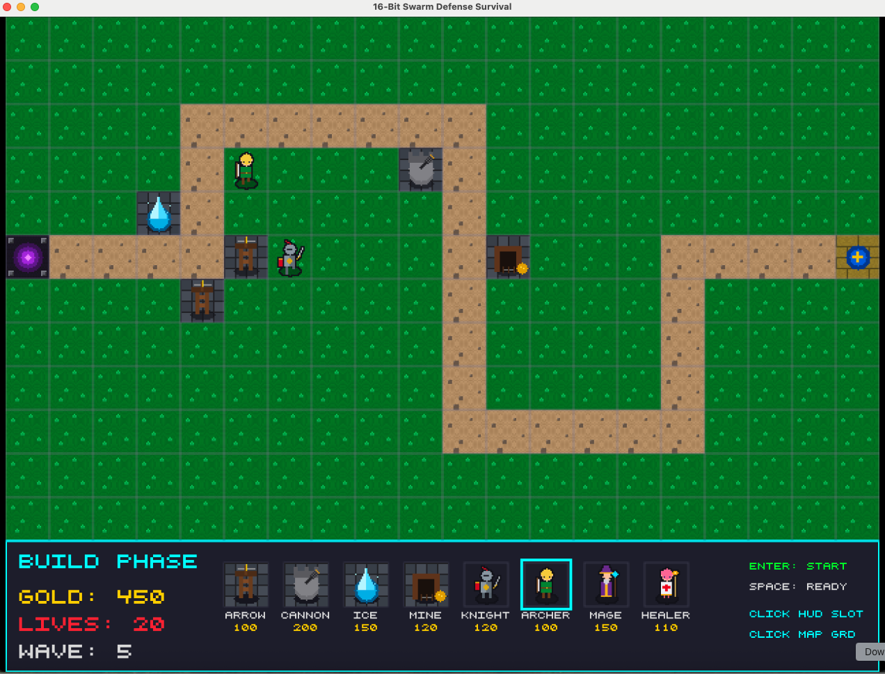

I must confess that when I first read about **subagents**, I was a bit sceptic. I could understand the benefits of running tasks in separate context windows, but it never really occurred to me to spawn dozens or maybe even hundreds of agents in parallel. Or maybe it's better said that I didn't see the benefit in doing so.

Managing a couple of coding agents in the background already takes a huge chunk of my mental bandwidth. I tend to do things in parallel only when I know an agent is busy working on a long-running operation. If managing two or three agents this way is already painful, how can I even dream of managing hundreds of them?

It took me a long time to find it, but the answer is actually **you don't**! You delegate the responsibility of managing the subagents to an agent itself. Every problem in computing is solved by a new level of abstraction, right? It is no different this time.

In this article, I want to walk you through how I have seen the evolution of the subagent paradigm over the past 12 months or so, then consolidating my experience into one agent skill I call **Swarm Coding**. If you are here for the TL;DR, you can skip the section below and go straight for the skill definition and explanation at the bottom of the text.

## A brief (and incomplete) timeline of subagent evolution

Subagents are nothing new. I have been using this trick long before the term subagent was coined, by packaging model calls as MCP tools. For example, the earlier releases of [**GoDoctor**](https://github.com/danicat/godoctor) had a `code_review` tool that was a model call to Gemini with a custom code review prompt. This tool was effectively a subagent, although with hardcoded behaviour and no opportunity to continue the conversation. (Technically it was possible, I just never implemented it as I wanted an unbiased review in every call.)

Sometime around last winter, all the usual coding agent suspects (Claude, Gemini CLI, etc.) started adding support for custom subagents defined in Markdown files. I really liked this pattern as a way to package expert knowledge with a curated set of tools. In the ideal world GoDoctor would be a specialist agent and not just a set of tools, but I ended up never implementing it this way because the scene kept changing and the subagent standard never really stabilised.

Fast forward a few months: in May 2026, Antigravity 2.0 adds subagent support, but with a catch: subagents are defined on the fly by invoking the `DefineSubagent` tool. At first, `DefineSubagent` doesn't give you a lot of flexibility: it clones the current (default) agent with a new prompt. We get the clean context benefit, but we lose on the agent reuse side. I wasn't happy as this prevented me from doing GoDoctor's evolution as I had envisioned it.

Because I wasn't able to define my custom agents with a different model and set of tools from the default agent, I decided to ignore that subagents existed and focused on porting the things that worked well on Gemini CLI to Antigravity CLI with moderate success.

I would only revisit the idea of subagents because of this prompt, published by [Richard Seroter](https://seroter.com/2026/06/01/one-prompt-four-subagents-and-ninety-seconds-to-get-a-working-app/) back in June:

> Let's build a hotel room booking app for Seroter Hotels consisting of a Go backend API and a web frontend. 
> 
> First, launch the **Engineering Manager** agent to design the API and frontend, saving the design and a Mermaid diagram into an artifact called 'architecture.md'. 
> 
> Once the design is ready, launch three agents in parallel:
> 1. **Test Manager**: Write a simple API test plan and append it to 'architecture.md'.
> 2. **Backend Engineer**: Build a clean Go REST API with standard error handling based on the design.
> 3. **Frontend Engineer**: Build a responsive web UI using a simple CSS framework like Tailwind to interact with the API (skip UI testing).
> 
> As soon as the Test Manager finishes the plan, have them hand it off to the Backend Engineer, who reads the plan from 'architecture.md' and adds the Go tests to the code. After both engineers finish building, the Test Manager runs the tests. Finally, spin up both components and a browser so I can test the live app.

This prompt had some very interesting propositions, which made me revisit the pattern, but I was still concerned about two things: one, how much do I need to adapt my prompting style to think in terms of subagents and, two, why would I want to write things this way in the first place?

I'm very pragmatic: if I don't have a clear benefit in quality and/or speed, I don't want to spend the extra effort. Thinking in terms of subagents is very similar to how we think about concurrency in classic programming: first question is "is this thing even 'parallelisable'?", and second, "is it even worth it?" as the additional overhead will often kill minor gains.

In Richard's prompt, the only components that are clearly orthogonal are backend and frontend development. They don't rely on each other as long as they have a clear contract to implement. But all other agents have some sort of dependency on each other which makes them more serial than parallel.

The benefit, then, must come from context isolation alone instead of speed gains due to parallel operations, and this is hard to measure on this scale.

I spent maybe the next couple of weeks with this thought running in the background of my mind: "What kind of roles are orthogonal to each other so that I can leverage subagents?"

It was only after a series of insightful conversations at the GDE Summit in Berlin that I finally cracked the code: It is not about **you** defining the subagents in the prompt, but **teaching** the agent itself to decide when to spawn subagents. In essence, I was thinking as a lead engineer splitting work for my team, but what I needed to do is actually to make the coding agent the lead engineer.

## The birth of swarm coding

The act of breaking down complex tasks into small ones and helping to distribute tasks among team members is not new to me. Before entering Developer Relations, I served as a Tech Lead and then Principal Engineer. These tasks are literally the bread and butter of technical leadership, especially if you come from an Agile background like I did.

The same TL logic applies to creating your swarm of subagents: you want to make sure every agent has a self-contained task that it can work on fully independently of the others. For the task to be workable, it must have clear specifications (aka Definition of Ready) and clear end results (aka Definition of Done).

As a side note, not many people describe this part of the job as the one they enjoy the most (myself included), which should explain my resistance to developing a new prompting style that would essentially become tech leadership on steroids.

So, instead of acting as a TL for my agents, I decided to flip the script and teach my agent to become the TL and assemble their own team to execute my vision. This was how the [first version](https://github.com/danicat/skills/blob/a9f57b10127d8bd23ed4867d64d168063a3726f4/swarm_coding/SKILL.md) of swarm coding came to be. An excerpt of the main parts can be seen here:

> Swarm Coding is a new development paradigm that employs multiple sub-agents in parallel to work on complex tasks. It is based on the divide to conquer strategy. The main benefits of this strategy is context isolation and quality improvement: by assigning small self contained tasks to sub-agents, you avoid context dilution and enable very focused refinement of the solution. For example, without swarm coding an agent implementing both frontend and backend will often get distracted as the skills required for frontend and backend are often unrelated (different technology stack, different best practices, etc.)
> 
> ## ROLE
> 
> You are the SWARM COORDINATOR, your role is to break down complex tasks and DELEGATE to sub-agents for execution. You should NEVER execute tasks on your own, no matter how simple they seem to be UNLESS it is EXPLICITLY requested by the user or your parent coordinator. ALWAYS keep the communication channel open so the user or parent agent can send you steering commands.
> 
> ## AGENT BUDGET
> 
> It is the number of sub-agents you are allowed to spawn to work on a task. You are encouraged to use the FULL BUDGET of agents, or get as close to it as possible. This doesn't mean to waste resources on low value tasks, but in finding the optimal use of the BUDGET to achieve the best quality output.
> 
> ## TEAM BUILDING
> 
> For SIMPLE tasks, break down the task into orthogonal elements and assign one or more SPECIALIST agents for each element.
> For COMPLEX tasks, break down the task into smaller pieces and assign LEAD AGENTS to each of them. The LEAD AGENTS should have a fraction of the agent budget to execute the task. LEAD AGENTS should activate the swarm coding skill and become the SWARM COORDINATOR for their respective areas
> Proceed recursively until you have a complete tree of LEAD AGENTS and EXECUTOR agents.
> 
> ## COMMUNICATION
> 
> The SWARM COORDINATOR is responsible for communicating directly with its sub-agents. Sub-agents should not message each other,communication between agents at the same level should be made by DESIGN DOCUMENTS. It is the SWARM COORDINATOR responsibility to make sure all changes to design documents are broadcast to the agents in their squad. Upon conflict, the SWARM COORDINATOR is responsible for disambiguating and making a decision.
> 
> ## PLANNING
> 
> Planning is a FIRST CLASS effort and should also be made using the SWARM. Each AGENT should contribute to the plan with their expertise. It is the role of the SWARM COORDINATOR for a squad to revise the part of the plan produced by their team and address inconsistencies or make decisions when there is conflict.
> 
> ## EXECUTION
> 
> In execution phase, monitor the progress of the swarm accross the main milestones, and steer agents if necessary to keep them aligned with the end goal. Remember that as coordinator you are ONLY allowed to handle ARTIFACTS. All development tasks should be handled by leaf sub-agents.

This was my first time actually writing a skill 100% manually, as it was really hard to achieve my vision otherwise. This prompt was a bit too ambitious as I wanted the Swarm to be "recursive" and based on the agent budget alone the agent would decide if it was a coordinator or not, but this didn't work as expected.

What happened in practice was that the task the coordinator gave would take precedence over any other instructions, and the subagent would jump straight to execution mode without paying attention to the agent budget. I fixed this in the current version of the skill by providing clearer guidelines and prompt templates to spawn the subagents.

## Taking the swarm for a spin

You can find the current version of the **swarm coding** skill on my GitHub [here](https://github.com/danicat/skills). You can install it in your favourite coding agent with the command below:

```bash
$ npx skills add github.com/danicat/skills --skill swarm-coding
```

> Note: This skill is very much a work in progress, so make a fork if you want to fix it to any specific implementation

Here is a fun prompt to get things started. Try running it on Antigravity CLI:

> /swarm-coding agent budget 50. Develop a 2D tower defense survival game using Go and Ebitengine. The game should be feature complete and have one single screen level. Include an intro sequence, title screen, game win and game over screens as well. Track the high score at the end of each playthrough. Use 32x32 sprites with up to 256 colors each. The sprites should be custom designed for this game and each movement should have at least 3 frames of animation, but ideally 8. Tiles should be 32x32 as well. The level view is top down, movement is on four directions. The player should have access to 4 types of units and 4 types of buildings. The enemy waves should have 8 types of monsters, including one boss monster. Use typical build and attack phases with custom UIs for each. To create art, use vector graphics and/or dot (pixel) art creating each asset manually using binary data. Sound effects should be generated mathematically as well. The whole vibe of the game should match the 16-bit era, but with modern gameplay features.

Here are the results on my machine:



I cannot say this was a one-shot because the first build had a bug rendering the sprites so the entire screen was black, but after one more prompt reporting the problem the game rendered as shown above.

Here is a small video of it in action with the final boss fight (poor thing didn't have a chance):

<video controls src="swarm-defense.mp4" title="Short clip of Swarm Defense boss fight"></video>

Every asset in this video was generated programmatically or, in other words, Antigravity didn't have access to an image generation model. So it had to be creative and generate the sprites at bitmap level.

This technique only worked so well because the swarm allowed agents to specialise and focus on a single task. I've tried this kind of prompt before with a single agent and it will often produce subpar results. Give an agent too many orthogonal tasks and it will clearly become a master of none. But with delegation, each agent can have a single self-contained task and perform at its best.

## Subagent support in Antigravity 2.0 and Antigravity CLI

At the time of this writing, subagent capabilities are unevenly distributed between Antigravity 2.0 and the Antigravity CLI. Because these interfaces are built for different workflows, their subagent features have temporarily diverged. Given that both tools are rapidly evolving, we can expect this feature gap to narrow as both interfaces continue to mature.

At their core, both environments share the same underlying engine. Spawning a subagent delegates the task and immediately returns control to you. The subagent runs with a clean slate: it uses the same model as the default session but starts with a fully isolated context, preventing conversation history from leaking. The parent agent communicates with it via unique IDs. If it hits an unapproved command, it bubbles the permission request up to you.

The notable differences between the two interfaces are:
- In Antigravity 2.0, management is visual. You use a graphical sidebar to track running tasks, view conversation logs, or stop execution. Custom agents are created dynamically on the fly using the `DefineSubagent` tool. There is no plugin support for subagents.
- In the Antigravity CLI, in addition to dynamically creating agents, custom agents can also be defined statically in Markdown files, where you can use frontmatter options to pin specific models or control available tools. The CLI also supports loading custom subagents defined inside plugins using the Markdown format.

Understanding these interface differences is key to setting up your swarm environment today, but, as stated before, these capabilities are likely to converge as both tools continue to evolve.

## Try it yourself

I think the best way to experience the power of subagents is to try it yourself. Whether you want to try reproducing my example prompt or come up with your own, I believe that you are going to be impressed with the results. Let me know about any fun things you build with the swarm. Meanwhile, I will be here polishing Swarm Defense a bit more. :)

- Check out swarm coding and all my other skills at: https://github.com/danicat/skills
- Download and read more about Antigravity at https://antigravity.google
